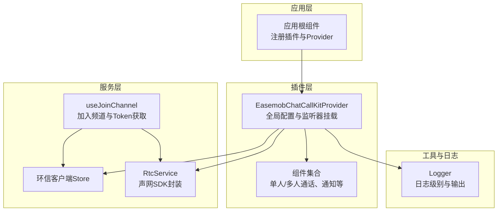
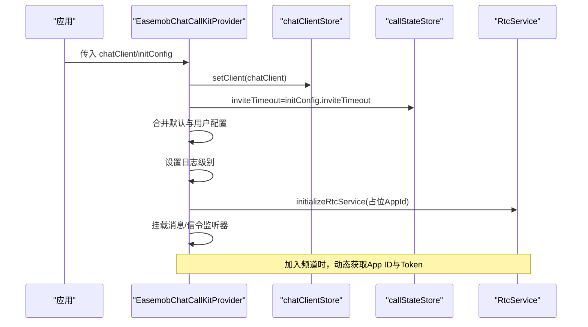
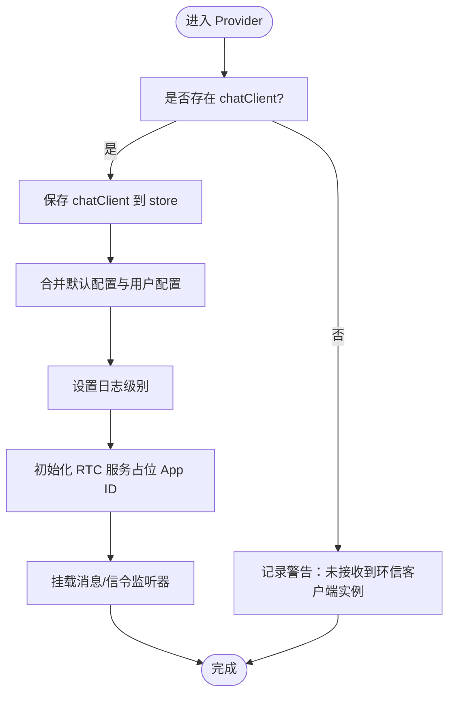
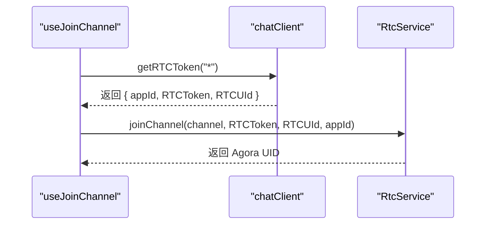
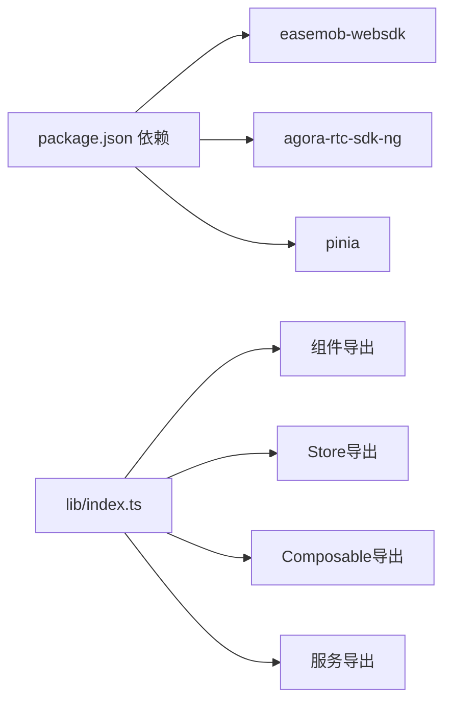

# 配置问题

<cite>
**本文引用的文件**
- [README.md](file://README.md)
- [USAGE.md](file://USAGE.md)
- [package.json](file://package.json)
- [lib/index.ts](file://lib/index.ts)
- [lib/types.ts](file://lib/types.ts)
- [lib/components/EasemobChatCallKitProvider.vue](file://lib/components/EasemobChatCallKitProvider.vue)
- [lib/services/RtcService.ts](file://lib/services/RtcService.ts)
- [lib/composables/useJoinChannel.ts](file://lib/composables/useJoinChannel.ts)
- [lib/store/chatClient.ts](file://lib/store/chatClient.ts)
- [lib/store/callState.ts](file://lib/store/callState.ts)
- [lib/utils/logger.ts](file://lib/utils/logger.ts)
- [test/src/App.vue](file://test/src/App.vue)
</cite>

## 目录
1. [简介](#简介)
2. [项目结构](#项目结构)
3. [核心组件](#核心组件)
4. [架构总览](#架构总览)
5. [详细组件分析](#详细组件分析)
6. [依赖分析](#依赖分析)
7. [性能考虑](#性能考虑)
8. [故障排查指南](#故障排查指南)
9. [结论](#结论)
10. [附录](#附录)

## 简介
本指南聚焦于 Provider 组件及相关配置的常见问题诊断与解决方法，覆盖以下方面：
- SDK 密钥与客户端初始化配置
- 回调函数与事件监听配置
- 权限与运行时能力配置（音视频设备、铃声、调试日志）
- 环信 SDK 与声网 SDK 的配置要点（App ID、Token、信令通道）
- 配置校验与调试技巧
- 配置模板与最佳实践
- 配置热更新与动态配置处理

## 项目结构
该项目采用 Vue3 插件形式封装音视频通话能力，核心通过 Provider 组件注入上下文，配合 Store、Service 与 Composable 实现完整的通话生命周期管理。

图表来源
- [lib/index.ts](file://lib/index.ts#L1-L58)
- [lib/components/EasemobChatCallKitProvider.vue](file://lib/components/EasemobChatCallKitProvider.vue#L1-L115)
- [lib/services/RtcService.ts](file://lib/services/RtcService.ts#L1-L719)
- [lib/composables/useJoinChannel.ts](file://lib/composables/useJoinChannel.ts#L23-L156)
- [lib/utils/logger.ts](file://lib/utils/logger.ts#L1-L231)

章节来源
- [README.md](file://README.md#L1-L181)
- [USAGE.md](file://USAGE.md#L1-L162)
- [lib/index.ts](file://lib/index.ts#L1-L58)

## 核心组件
- Provider 配置（ProviderConfig）
  - chatClient：环信 WebSDK 连接实例（必填或可延迟初始化）
  - agoraAppId：已废弃，App ID 将从环信服务器动态获取，保留仅兼容
  - initConfig：初始化配置（debug、enableRingtone、resizable、draggable、inviteTimeout）
- 插件导出与类型
  - 组件导出：Provider、单人/多人通话组件、通知组件、迷你窗口
  - 类型导出：ProviderConfig、EasemobChatCallKitOptions、状态枚举等
- 日志系统
  - Logger 提供多级别日志输出，支持根据 debug 开关调整日志级别

章节来源
- [lib/types.ts](file://lib/types.ts#L36-L46)
- [lib/index.ts](file://lib/index.ts#L34-L46)
- [lib/utils/logger.ts](file://lib/utils/logger.ts#L1-L231)

## 架构总览
Provider 负责：
- 合并默认与用户配置，计算全局配置
- 设置日志级别
- 初始化 RTC 服务（App ID 占位，实际由环信动态下发）
- 挂载文本消息与信令监听器
- 在卸载时销毁 RTC 服务

图表来源
- [lib/components/EasemobChatCallKitProvider.vue](file://lib/components/EasemobChatCallKitProvider.vue#L65-L92)
- [lib/store/chatClient.ts](file://lib/store/chatClient.ts#L10-L16)
- [lib/store/callState.ts](file://lib/store/callState.ts#L89-L100)
- [lib/services/RtcService.ts](file://lib/services/RtcService.ts#L82-L96)

## 详细组件分析

### Provider 组件配置与常见错误
- 配置项与默认值
  - debug：默认 false；开启后输出更详细日志
  - enableRingtone：默认 true；控制是否播放来电/去电铃声
  - resizable：默认 true；控制窗口尺寸调整
  - draggable：默认 true；控制窗口拖拽
  - inviteTimeout：默认 30000ms；邀请超时时间
- 常见错误
  - 缺少 chatClient：Provider 会记录警告，无法挂载监听器
  - 混淆 agoraAppId 与动态 App ID：agoraAppId 已废弃，实际 App ID 由环信服务器下发
  - 配置合并顺序错误：确保在 Provider 初始化前准备好 initConfig
- 配置校验建议
  - 在 Provider 初始化前后打印合并后的配置
  - 检查日志级别是否按预期生效
  - 验证 inviteTimeout 是否正确写入 callStateStore

图表来源
- [lib/components/EasemobChatCallKitProvider.vue](file://lib/components/EasemobChatCallKitProvider.vue#L30-L103)
- [lib/store/chatClient.ts](file://lib/store/chatClient.ts#L10-L16)
- [lib/utils/logger.ts](file://lib/utils/logger.ts#L91-L94)

章节来源
- [lib/components/EasemobChatCallKitProvider.vue](file://lib/components/EasemobChatCallKitProvider.vue#L19-L77)
- [lib/store/callState.ts](file://lib/store/callState.ts#L89-L100)
- [lib/utils/logger.ts](file://lib/utils/logger.ts#L91-L94)

### 环信 SDK 与声网 SDK 配置要点
- 环信 SDK
  - chatClient 必须在 Provider 初始化前可用，否则无法挂载监听器
  - Provider 会将 chatClient 写入 chatClientStore，并在初始化时写入 callerDevId、callerUserId、token 等
- 声网 SDK
  - RtcService 初始化时设置日志级别与客户端角色
  - 加入频道时支持动态 appId（来自环信服务器），并使用环信提供的 RTCToken
  - 支持动态更新 appId（setAppId）

图表来源
- [lib/composables/useJoinChannel.ts](file://lib/composables/useJoinChannel.ts#L39-L71)
- [lib/services/RtcService.ts](file://lib/services/RtcService.ts#L109-L138)

章节来源
- [lib/store/chatClient.ts](file://lib/store/chatClient.ts#L10-L16)
- [lib/composables/useJoinChannel.ts](file://lib/composables/useJoinChannel.ts#L39-L156)
- [lib/services/RtcService.ts](file://lib/services/RtcService.ts#L82-L138)

### 回调函数与权限配置
- 回调函数
  - RtcService 支持 onUserJoined/onUserLeft/onUserPublished/onUserUnpublished/onNetworkQualityChange/onVolumeIndicator
  - CallService 支持 onCallStart/onCallEnd/onInvitationReceived/onCallDurationUpdate/onUserPublished/onUserUnpublished/onRemoteVideoReady/onNetworkQualityChange/onTalkingUsersChange
- 铃声与音量
  - enableRingtone/ringtoneVolume/ringtoneLoop/outgoingRingtoneSrc/incomingRingtoneSrc/speakingVolumeThreshold
- 权限与设备
  - 音频/视频轨道创建与发布
  - 摄像头/麦克风设备切换
  - 静音/摄像头开关

章节来源
- [lib/services/RtcService.ts](file://lib/services/RtcService.ts#L30-L77)
- [callkit/services/CallService.ts](file://callkit/services/CallService.ts#L69-L99)

### 配置模板与最佳实践
- Provider 基础模板
  - chatClient：必填，环信 WebSDK 连接实例
  - initConfig：按需开启 debug、enableRingtone、resizable、draggable、inviteTimeout
- 最佳实践
  - 在应用启动阶段尽早初始化 chatClient 并传给 Provider
  - 开发阶段开启 debug，生产环境关闭
  - inviteTimeout 根据网络与业务场景调整
  - 铃声路径与音量按产品要求配置
  - 避免直接使用 agoraAppId，依赖环信动态下发

章节来源
- [USAGE.md](file://USAGE.md#L32-L56)
- [lib/types.ts](file://lib/types.ts#L36-L46)
- [test/src/App.vue](file://test/src/App.vue#L11-L14)

### 配置热更新与动态配置
- 动态 App ID
  - RtcService 支持 setAppId 动态更新
  - 加入频道时可传入动态 appId
- 动态 Token
  - 通过环信 SDK 的 getRTCToken 获取最新 Token
- 配置热更新建议
  - 对 inviteTimeout、enableRingtone 等进行响应式更新
  - 在 Provider 中通过 watchEffect 同步到 callStateStore
  - 对日志级别变更，通过 Logger.setDebug 生效

章节来源
- [lib/services/RtcService.ts](file://lib/services/RtcService.ts#L101-L104)
- [lib/composables/useJoinChannel.ts](file://lib/composables/useJoinChannel.ts#L39-L71)
- [lib/components/EasemobChatCallKitProvider.vue](file://lib/components/EasemobChatCallKitProvider.vue#L66-L76)

## 依赖分析
- 运行时依赖
  - easemob-websdk：环信 Web SDK
  - agora-rtc-sdk-ng：声网 RTC SDK
  - pinia：状态管理
- 插件导出
  - 组件、Store、Composable、服务与类型统一从 lib/index.ts 导出

图表来源
- [package.json](file://package.json#L47-L51)
- [lib/index.ts](file://lib/index.ts#L18-L31)

章节来源
- [package.json](file://package.json#L47-L51)
- [lib/index.ts](file://lib/index.ts#L18-L31)

## 性能考虑
- 日志级别控制：debug 下日志量较大，建议仅在开发环境开启
- 邀请超时：合理设置 inviteTimeout，避免过长导致资源占用
- 音视频轨道：及时释放本地轨道与远程轨道，避免内存泄漏
- 动态 App ID 与 Token：减少无效重连，提升稳定性

## 故障排查指南
- 症状：无法发起/接听通话
  - 检查 chatClient 是否传入且已初始化
  - 确认 Provider 是否挂载监听器
  - 查看日志级别是否为 VERBOSE
- 症状：加入频道失败
  - 检查 getRTCToken 返回值与 appId/uid/token
  - 确认 RtcService 是否已初始化
- 症状：铃声不生效
  - 检查 enableRingtone/ringtoneVolume/ringtoneLoop 配置
  - 确认音频轨道已创建并发布
- 症状：设备切换失败
  - 检查本地轨道状态与设备权限
  - 确认摄像头/麦克风设备列表可用

章节来源
- [lib/store/chatClient.ts](file://lib/store/chatClient.ts#L10-L16)
- [lib/composables/useJoinChannel.ts](file://lib/composables/useJoinChannel.ts#L39-L156)
- [lib/services/RtcService.ts](file://lib/services/RtcService.ts#L176-L221)
- [lib/utils/logger.ts](file://lib/utils/logger.ts#L91-L94)

## 结论
- Provider 的配置直接影响通话链路的初始化与运行时行为
- 环信与声网的配置应遵循“动态下发优先”的原则（App ID、Token）
- 通过日志与 Store 状态可观测性，可快速定位配置问题
- 建议在开发阶段开启 debug，生产阶段关闭，并对关键配置进行热更新与回滚策略

## 附录
- 快速检查清单
  - chatClient 是否存在并已 setClient
  - initConfig 是否合并到 Provider
  - 日志级别是否为预期
  - inviteTimeout 是否写入 callStateStore
  - 加入频道时是否拿到正确的 appId/RTCToken/RTCUId
  - 铃声与音视频轨道配置是否生效
- 示例参考
  - Provider 使用示例与配置项说明参见使用文档
  - 测试页中展示了 Provider 的基本用法与调试开关

章节来源
- [USAGE.md](file://USAGE.md#L32-L56)
- [test/src/App.vue](file://test/src/App.vue#L11-L14)