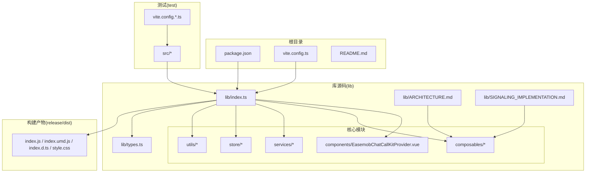
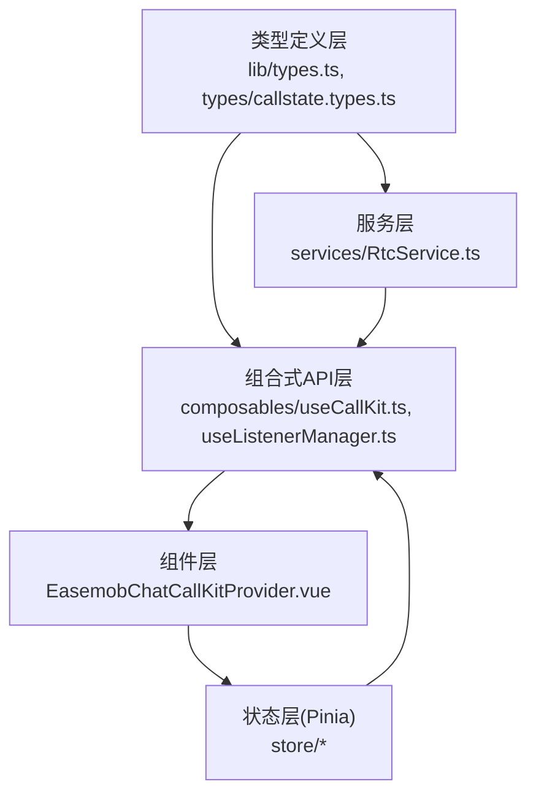
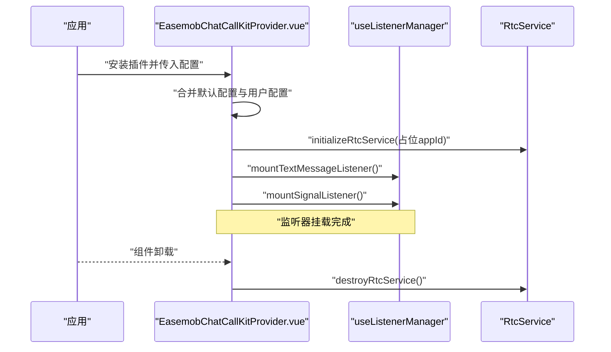
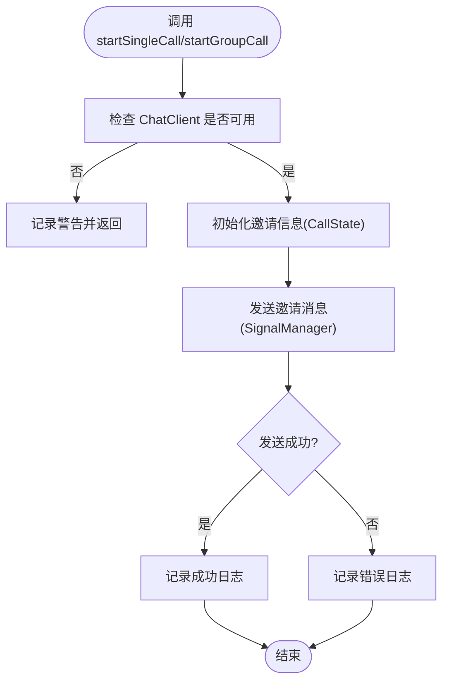
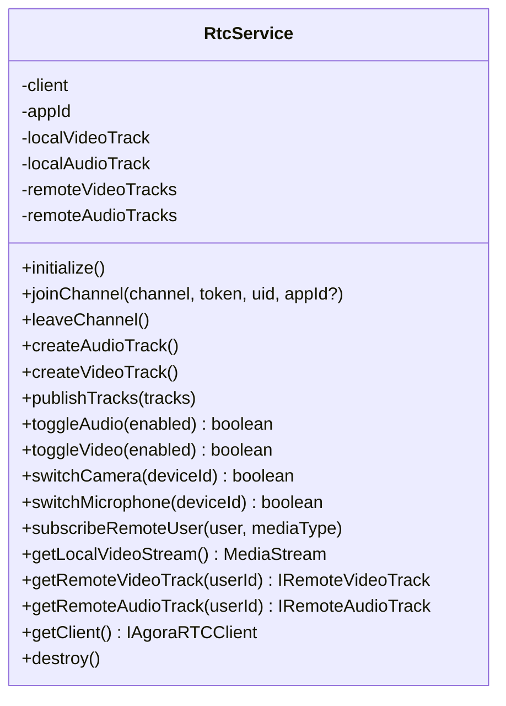
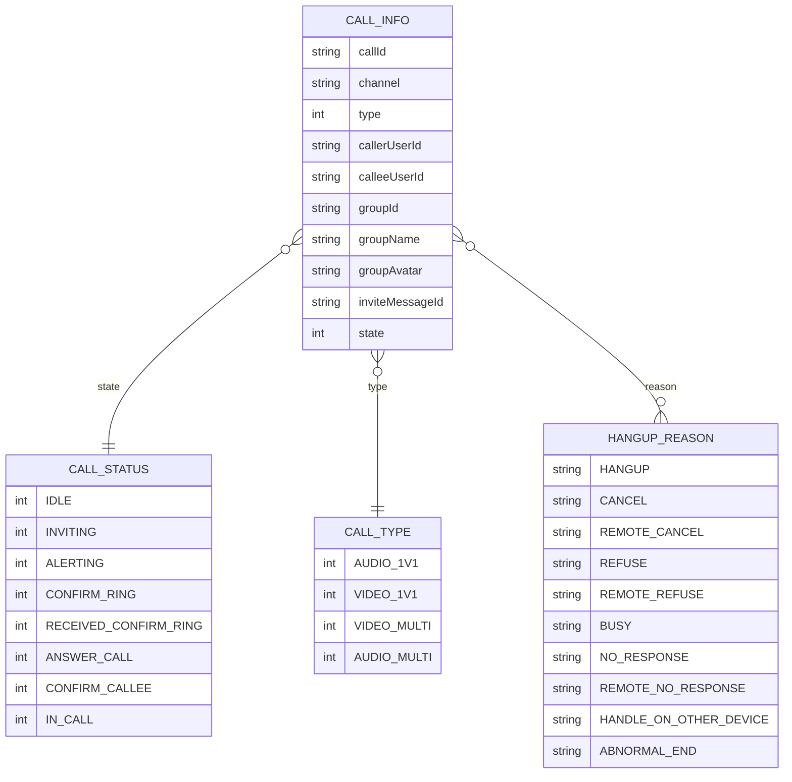
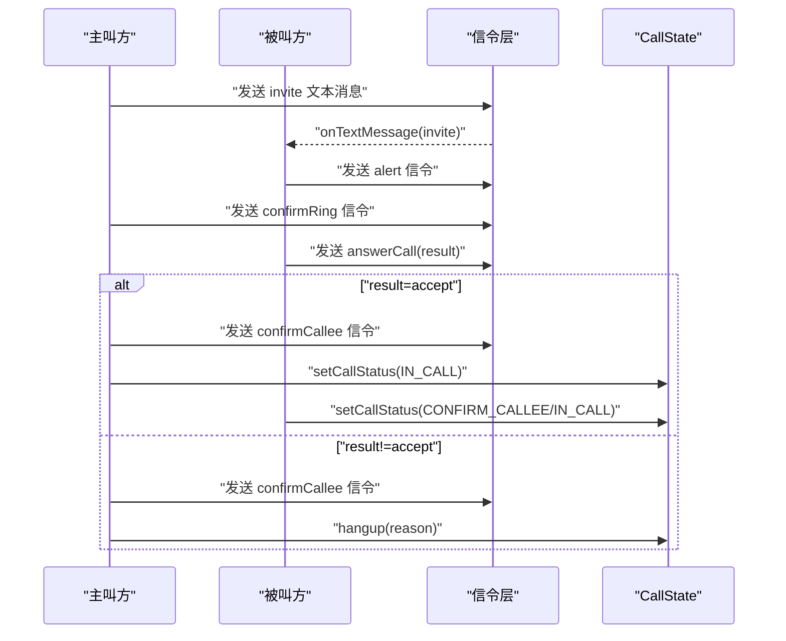
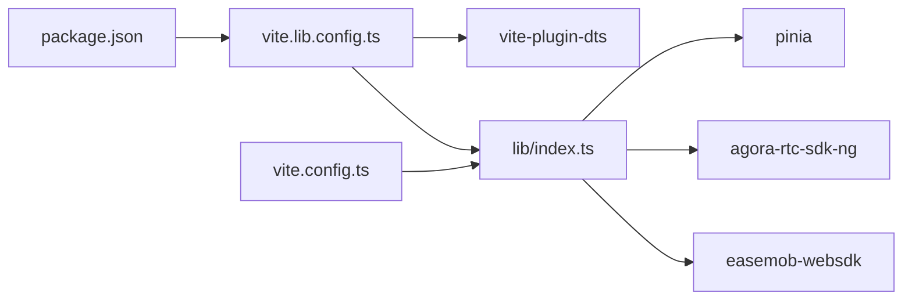

# 代码组织

<cite>
**本文引用的文件**
- [package.json](file://package.json)
- [README.md](file://README.md)
- [vite.config.ts](file://vite.config.ts)
- [vite.lib.config.ts](file://vite.lib.config.ts)
- [lib/index.ts](file://lib/index.ts)
- [lib/types.ts](file://lib/types.ts)
- [lib/types/callstate.types.ts](file://lib/types/callstate.types.ts)
- [lib/components/EasemobChatCallKitProvider.vue](file://lib/components/EasemobChatCallKitProvider.vue)
- [lib/composables/useCallKit.ts](file://lib/composables/useCallKit.ts)
- [lib/composables/useListenerManager.ts](file://lib/composables/useListenerManager.ts)
- [lib/services/RtcService.ts](file://lib/services/RtcService.ts)
- [lib/utils/logger.ts](file://lib/utils/logger.ts)
- [lib/ARCHITECTURE.md](file://lib/ARCHITECTURE.md)
- [lib/SIGNALING_IMPLEMENTATION.md](file://lib/SIGNALING_IMPLEMENTATION.md)
</cite>

## 目录
1. [引言](#引言)
2. [项目结构](#项目结构)
3. [核心组件](#核心组件)
4. [架构总览](#架构总览)
5. [详细组件分析](#详细组件分析)
6. [依赖关系分析](#依赖关系分析)
7. [性能考量](#性能考量)
8. [故障排查指南](#故障排查指南)
9. [结论](#结论)
10. [附录](#附录)

## 引言
本指南围绕“代码组织与架构设计最佳实践”展开，结合本项目的实际实现，总结可复用、可维护、可测试的工程化经验。重点覆盖：
- 清晰的文件组织与模块划分
- Vue3 单文件组件设计与组合式 API 使用规范
- 可维护的状态管理架构（Pinia Store）与数据流设计
- TypeScript 类型定义最佳实践（接口设计与类型安全）
- 代码复用、模块化与可测试性设计原则

## 项目结构
项目采用“库形态”的 Vue3 插件工程，核心源码位于 lib/ 目录，配套测试样例位于 test/ 目录，构建产物输出至 release/dist/。根目录提供开发与构建脚本，支持源码模式与打包产物模式的双向验证。

图表来源
- [package.json](file://package.json#L1-L53)
- [vite.config.ts](file://vite.config.ts#L1-L21)
- [vite.lib.config.ts](file://vite.lib.config.ts#L1-L68)
- [lib/index.ts](file://lib/index.ts#L1-L58)
- [lib/ARCHITECTURE.md](file://lib/ARCHITECTURE.md#L1-L190)
- [lib/SIGNALING_IMPLEMENTATION.md](file://lib/SIGNALING_IMPLEMENTATION.md#L1-L183)

章节来源
- [package.json](file://package.json#L1-L53)
- [README.md](file://README.md#L1-L181)
- [vite.config.ts](file://vite.config.ts#L1-L21)
- [vite.lib.config.ts](file://vite.lib.config.ts#L1-L68)

## 核心组件
- 插件入口与导出：lib/index.ts 负责注册组件、导出组合式 API、服务与类型，并提供默认导出。
- Provider 组件：EasemobChatCallKitProvider.vue 负责全局配置注入、监听器挂载、RTC 初始化与清理。
- 组合式 API：useCallKit.ts、useListenerManager.ts 等，封装业务操作与状态管理。
- 服务层：RtcService.ts 封装 WebRTC 能力；配合 store 与组合式 API 实现端到端通话能力。
- 类型系统：lib/types.ts 与 lib/types/callstate.types.ts 提供完整的类型定义，贯穿状态、行为与交互。

章节来源
- [lib/index.ts](file://lib/index.ts#L1-L58)
- [lib/components/EasemobChatCallKitProvider.vue](file://lib/components/EasemobChatCallKitProvider.vue#L1-L115)
- [lib/composables/useCallKit.ts](file://lib/composables/useCallKit.ts#L1-L123)
- [lib/composables/useListenerManager.ts](file://lib/composables/useListenerManager.ts#L1-L684)
- [lib/services/RtcService.ts](file://lib/services/RtcService.ts#L1-L719)
- [lib/types.ts](file://lib/types.ts#L1-L91)
- [lib/types/callstate.types.ts](file://lib/types/callstate.types.ts#L1-L93)

## 架构总览
项目采用“类型定义层 → 服务层 → 组合式API层 → 组件层”的分层架构，强调职责分离与类型安全。Provider 组件作为全局上下文，统一初始化与清理；组合式 API 连接服务与 UI，提供响应式状态与操作方法；服务层封装具体业务逻辑（如 RTC、信令、聊天）。

图表来源
- [lib/ARCHITECTURE.md](file://lib/ARCHITECTURE.md#L1-L190)
- [lib/types.ts](file://lib/types.ts#L1-L91)
- [lib/types/callstate.types.ts](file://lib/types/callstate.types.ts#L1-L93)
- [lib/services/RtcService.ts](file://lib/services/RtcService.ts#L1-L719)
- [lib/composables/useCallKit.ts](file://lib/composables/useCallKit.ts#L1-L123)
- [lib/composables/useListenerManager.ts](file://lib/composables/useListenerManager.ts#L1-L684)
- [lib/components/EasemobChatCallKitProvider.vue](file://lib/components/EasemobChatCallKitProvider.vue#L1-L115)

## 详细组件分析

### Provider 组件与全局上下文
- 职责：合并配置、初始化 RTC 服务、挂载事件监听器、组件卸载时清理资源。
- 设计要点：使用响应式配置对象与 watchEffect 管理副作用；在 setup 顶层创建监听器管理器，保证生命周期内的一致性；在卸载阶段销毁 RTC 服务，避免资源泄露。

图表来源
- [lib/components/EasemobChatCallKitProvider.vue](file://lib/components/EasemobChatCallKitProvider.vue#L1-L115)
- [lib/composables/useListenerManager.ts](file://lib/composables/useListenerManager.ts#L619-L684)
- [lib/services/RtcService.ts](file://lib/services/RtcService.ts#L678-L719)

章节来源
- [lib/components/EasemobChatCallKitProvider.vue](file://lib/components/EasemobChatCallKitProvider.vue#L1-L115)

### 组合式 API：useCallKit 与 useListenerManager
- useCallKit：封装发起单人/群组通话的流程，协调 ChatClient、CallState 与 SignalManager，确保状态初始化与消息发送的顺序正确。
- useListenerManager：集中处理文本消息与信令消息，按动作类型分发到具体处理器，维护状态机与超时控制，处理多端登录与异常分支。

图表来源
- [lib/composables/useCallKit.ts](file://lib/composables/useCallKit.ts#L1-L123)

章节来源
- [lib/composables/useCallKit.ts](file://lib/composables/useCallKit.ts#L1-L123)
- [lib/composables/useListenerManager.ts](file://lib/composables/useListenerManager.ts#L1-L684)

### 服务层：RtcService
- 职责：封装 Agora WebRTC 客户端生命周期、音视频轨道管理、远端订阅、设备切换、网络质量与音量回调。
- 设计要点：支持动态 appId 更新；在用户加入/离开、发布/取消发布事件中自动维护映射与订阅；提供销毁方法清理资源。

图表来源
- [lib/services/RtcService.ts](file://lib/services/RtcService.ts#L1-L719)

章节来源
- [lib/services/RtcService.ts](file://lib/services/RtcService.ts#L1-L719)

### 类型系统与状态模型
- 类型定义：lib/types.ts 定义插件选项、实例、组合式 API 返回类型；lib/types/callstate.types.ts 定义通话状态、类型、挂断原因等常量与接口。
- 设计要点：使用字面量联合类型与常量映射，确保状态机与动作的类型安全；接口字段尽量可选化，降低调用方心智负担。

图表来源
- [lib/types.ts](file://lib/types.ts#L1-L91)
- [lib/types/callstate.types.ts](file://lib/types/callstate.types.ts#L1-L93)

章节来源
- [lib/types.ts](file://lib/types.ts#L1-L91)
- [lib/types/callstate.types.ts](file://lib/types/callstate.types.ts#L1-L93)

### 信令流程与状态机（一对一）
- 主叫方流程：发送邀请 → 收到 alert → 发送 confirmRing → 收到 answerCall(result=accept/refuse/busy) → 若 accept：发送 confirmCallee 并进入 IN_CALL。
- 被叫方流程：收到 invite → 发送 alert → 收到 confirmRing → 用户点击接听/拒绝 → 发送 answerCall(result=accept/refuse) → 若 accept：进入 ANSWER_CALL，随后 confirmCallee 后进入 IN_CALL。
- 异常与多端：对多端登录、拒绝/忙线、超时等分支进行处理，必要时触发挂断。

图表来源
- [lib/SIGNALING_IMPLEMENTATION.md](file://lib/SIGNALING_IMPLEMENTATION.md#L105-L131)
- [lib/composables/useListenerManager.ts](file://lib/composables/useListenerManager.ts#L319-L447)

章节来源
- [lib/SIGNALING_IMPLEMENTATION.md](file://lib/SIGNALING_IMPLEMENTATION.md#L1-L183)
- [lib/composables/useListenerManager.ts](file://lib/composables/useListenerManager.ts#L1-L684)

## 依赖关系分析
- 构建与打包：vite.lib.config.ts 使用自定义插件清空 release/dist，生成 ES 与 UMD 产物，dts 插件生成类型声明；package.json 的 exports 字段与 types 字段确保外部消费的类型与入口正确。
- 运行时依赖：pinia 作为状态管理，agora-rtc-sdk-ng 作为音视频 SDK，easemob-websdk 作为即时通讯 SDK。
- 开发与测试：README 提供源码模式与 tgz 模式两种验证方式，vite.config.ts 将包名别名指向 lib/index.ts，便于本地开发。

图表来源
- [package.json](file://package.json#L1-L53)
- [vite.lib.config.ts](file://vite.lib.config.ts#L1-L68)
- [vite.config.ts](file://vite.config.ts#L1-L21)
- [lib/index.ts](file://lib/index.ts#L1-L58)

章节来源
- [package.json](file://package.json#L1-L53)
- [vite.lib.config.ts](file://vite.lib.config.ts#L1-L68)
- [vite.config.ts](file://vite.config.ts#L1-L21)

## 性能考量
- 资源清理：Provider 组件在卸载时销毁 RTC 服务，避免内存与媒体资源泄漏。
- 状态机驱动：通过 CallState 管理通话状态，减少 UI 层对复杂流程的感知，提升渲染效率。
- 事件监听：监听器在 Provider 初始化时一次性挂载，避免重复绑定带来的性能损耗。
- 日志级别：Logger 提供可配置的日志级别，生产环境默认较低级别，避免过多 IO。

章节来源
- [lib/components/EasemobChatCallKitProvider.vue](file://lib/components/EasemobChatCallKitProvider.vue#L110-L115)
- [lib/utils/logger.ts](file://lib/utils/logger.ts#L1-L231)

## 故障排查指南
- 信令异常：参考 SIGNALING_IMPLEMENTATION.md 中的修复点，确认 answerCall 与 confirmCallee 的处理逻辑是否正确，特别是主被叫双方状态更新与 RTC 频道加入时机。
- 多端登录：useListenerManager 对多端场景做了分支处理，若出现“已在其他端处理”或“设备ID不匹配”，需检查设备 ID 与 callId 的一致性。
- RTC 频道：RtcService 在用户加入/离开事件中维护 UID/UserId 映射与订阅，若出现远端无声音/画面，检查订阅与轨道状态。
- 日志定位：通过 Logger 的 setDebug 控制日志级别，结合详细日志快速定位问题。

章节来源
- [lib/SIGNALING_IMPLEMENTATION.md](file://lib/SIGNALING_IMPLEMENTATION.md#L1-L183)
- [lib/composables/useListenerManager.ts](file://lib/composables/useListenerManager.ts#L1-L684)
- [lib/services/RtcService.ts](file://lib/services/RtcService.ts#L1-L719)
- [lib/utils/logger.ts](file://lib/utils/logger.ts#L1-L231)

## 结论
本项目通过清晰的分层架构、完善的类型系统与组合式 API，实现了高内聚、低耦合的 Vue3 通话组件体系。遵循本文档的代码组织与最佳实践，可在保证类型安全与可维护性的前提下，高效扩展功能、提升可测试性与运行时性能。

## 附录

### Vue3 组件组织原则（单文件组件）
- 结构清晰：模板、脚本、样式三部分分离；逻辑集中在 script setup 中，保持简洁。
- Props/Emits：使用 defineProps/defineEmits 明确输入输出；优先使用类型推断与解构。
- 生命周期：在 onMounted/onUnmounted 中进行资源初始化与清理，避免在模板中直接操作副作用。
- 组合式 API：将可复用逻辑抽取为组合式函数，便于测试与复用。

### 组合式 API 使用规范
- 状态封装：将 Pinia store 的读写封装为组合式函数，暴露只读状态与受控更新方法。
- 依赖注入：通过 Provider 统一注入全局依赖（如 RTC、监听器管理器），避免组件间重复初始化。
- 错误处理：在组合式函数中捕获并记录错误，向上抛出可诊断的异常或返回错误状态。

### 状态管理架构（Pinia）
- Store 设计：将状态与方法分离，使用 actions 更新状态，computed 派生状态。
- 数据流：从 Provider 初始化 → 组合式 API 调用 → 服务层处理 → Store 更新 → UI 响应式刷新。
- 类型安全：Store 的 state/action/Getter 与 types.ts 中的接口保持一致，避免类型漂移。

### TypeScript 类型定义最佳实践
- 接口设计：优先使用只读接口与可选字段，避免过度约束；对枚举与常量使用字面量联合类型。
- 常量映射：使用 const 断言导出常量映射，确保编译期优化与类型推断。
- 类型导出：统一在 index.ts 中导出公共类型，避免循环依赖与路径污染。

### 代码复用、模块化与可测试性
- 模块化：按职责拆分目录（components/composables/services/store/utils），每个模块边界清晰。
- 可测试性：组合式函数与服务类尽量无副作用或可注入依赖；提供最小可测单元，便于单元测试。
- 可复用性：将通用逻辑抽象为独立模块，通过 Provider 注入全局配置，组件仅关注展示与交互。