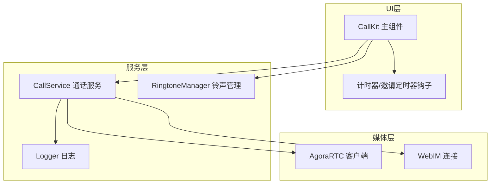
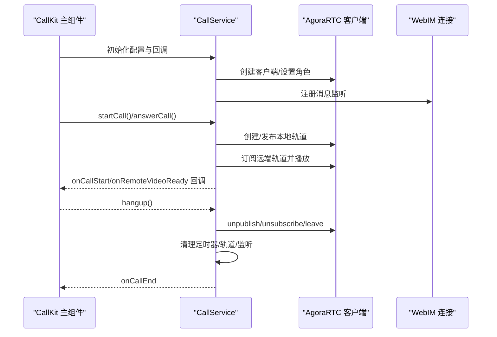
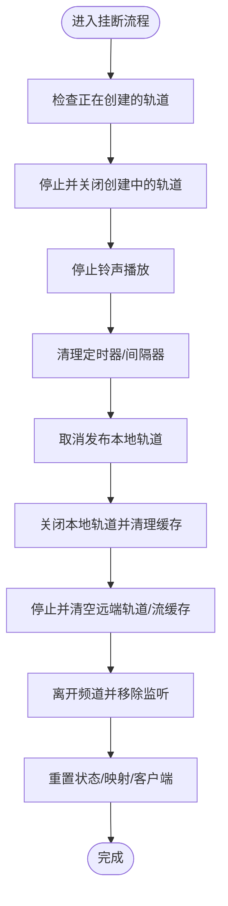
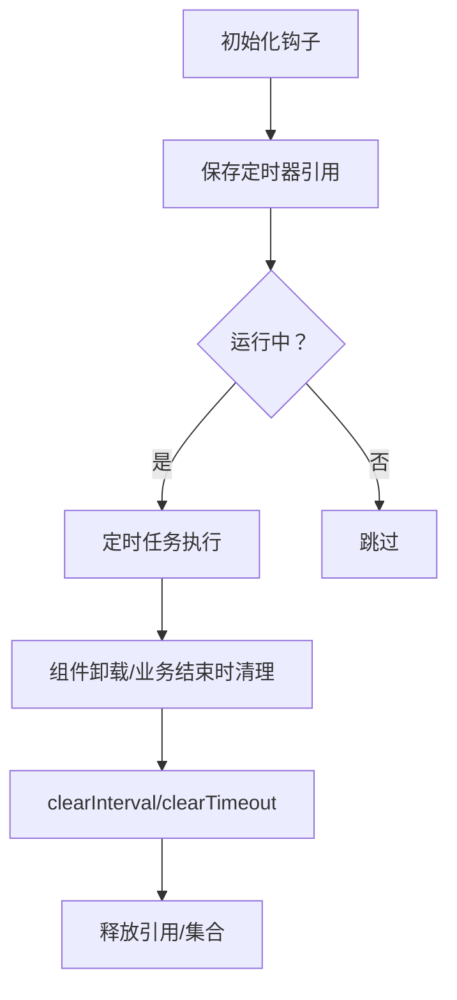
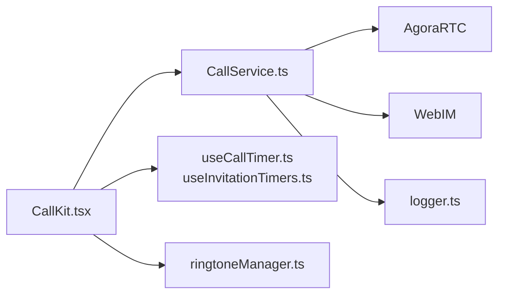

# 内存管理

<cite>
**本文引用的文件**
- [CallService.ts](file://callkit/services/CallService.ts)
- [useCallTimer.ts](file://callkit/hooks/useCallTimer.ts)
- [useInvitationTimers.ts](file://callkit/hooks/useInvitationTimers.ts)
- [logger.ts](file://callkit/utils/logger.ts)
- [ringtoneManager.ts](file://callkit/utils/ringtoneManager.ts)
- [CallKit.tsx](file://callkit/CallKit.tsx)
- [callUtils.ts](file://callkit/utils/callUtils.ts)
</cite>

## 目录
1. [简介](#简介)
2. [项目结构](#项目结构)
3. [核心组件](#核心组件)
4. [架构总览](#架构总览)
5. [详细组件分析](#详细组件分析)
6. [依赖关系分析](#依赖关系分析)
7. [性能考量](#性能考量)
8. [故障排查指南](#故障排查指南)
9. [结论](#结论)
10. [附录](#附录)

## 简介
本指南聚焦于音视频通话应用中的内存管理策略，结合仓库中 CallKit 与 CallService 的实现，系统阐述如何在 WebRTC 场景下高效管理媒体资源、定时器、事件监听与 UI 生命周期，避免内存泄漏与资源占用过高。内容涵盖媒体流的创建/销毁与清理、组件生命周期最佳实践、监控与诊断方法、以及常见陷阱与修复建议。

## 项目结构
- 通话服务层：CallService 负责与 Agora RTC、WebIM 交互，管理媒体轨道、远程流、事件监听与状态机。
- UI 层：CallKit 主组件负责状态管理、布局渲染、定时器与铃声控制，并通过回调与服务层解耦。
- 工具与钩子：计时器钩子、铃声管理器、日志系统、邀请定时器钩子等支撑资源生命周期管理。

图表来源
- [CallKit.tsx](file://callkit/CallKit.tsx#L685-L758)
- [CallService.ts](file://callkit/services/CallService.ts#L221-L285)
- [ringtoneManager.ts](file://callkit/utils/ringtoneManager.ts#L1-L139)
- [logger.ts](file://callkit/utils/logger.ts#L1-L181)

章节来源
- [CallKit.tsx](file://callkit/CallKit.tsx#L685-L758)
- [CallService.ts](file://callkit/services/CallService.ts#L221-L285)

## 核心组件
- 通话服务 CallService：封装 AgoraRTC 客户端、媒体轨道、远程流、事件监听、状态机与资源清理。
- 计时器钩子 useCallTimer/useInvitationTimers：管理通话计时与邀请超时定时器，确保组件卸载时清理。
- 铃声管理 ringtoneManager：统一管理外呼/来电铃声的创建、播放与销毁。
- 日志系统 logger：统一日志级别与输出，便于定位资源泄漏与异常路径。

章节来源
- [CallService.ts](file://callkit/services/CallService.ts#L116-L285)
- [useCallTimer.ts](file://callkit/hooks/useCallTimer.ts#L1-L50)
- [useInvitationTimers.ts](file://callkit/hooks/useInvitationTimers.ts#L1-L70)
- [ringtoneManager.ts](file://callkit/utils/ringtoneManager.ts#L1-L139)
- [logger.ts](file://callkit/utils/logger.ts#L1-L181)

## 架构总览
CallKit 通过 CallService 管理媒体资源与信令流程，UI 层仅负责状态渲染与用户交互，服务层负责资源生命周期与错误恢复。

图表来源
- [CallKit.tsx](file://callkit/CallKit.tsx#L685-L758)
- [CallService.ts](file://callkit/services/CallService.ts#L345-L527)
- [CallService.ts](file://callkit/services/CallService.ts#L806-L1358)
- [CallService.ts](file://callkit/services/CallService.ts#L1360-L1683)

## 详细组件分析

### 通话服务 CallService 的内存管理策略
- 媒体轨道与流的创建/复用/清理
  - 本地视频轨道：在预览/接听阶段按需创建，避免重复；禁用或摄像头被关闭时彻底 stop 底层 MediaStreamTrack 并 close 轨道，清理本地视频流缓存。
  - 远端轨道：使用 Map 以 uid 为键缓存，订阅/取消订阅时按用户粒度清理，离开频道/通话结束时统一 stop 并清空。
  - 本地音频轨道：发布前创建，通话结束时 stop 并 close。
- 定时器与监听器
  - 邀请超时/通话计时：使用独立定时器，挂断与组件卸载时统一清理。
  - Agora 事件监听：加入频道前移除旧监听，加入后重新绑定；离开频道后 removeAllListeners。
- 状态重置与健壮性
  - 挂断后重置所有状态、清理缓存映射、强制重建客户端，避免“未断开”残留。
  - 竞态条件处理：记录 creatingVideoTrack/creatingAudioTrack，在清理时等待并 stop/close。

图表来源
- [CallService.ts](file://callkit/services/CallService.ts#L1360-L1683)
- [CallService.ts](file://callkit/services/CallService.ts#L1416-L1561)
- [CallService.ts](file://callkit/services/CallService.ts#L1604-L1683)

章节来源
- [CallService.ts](file://callkit/services/CallService.ts#L1360-L1683)
- [CallService.ts](file://callkit/services/CallService.ts#L1416-L1561)
- [CallService.ts](file://callkit/services/CallService.ts#L1604-L1683)

### 计时器与定时器清理最佳实践
- 通话计时器：使用 useRef 保存引用，组件卸载时在 useEffect 返回函数中 clearInterval。
- 邀请超时定时器：使用 Map 以用户为键管理，清理单个用户或全部；加入/离开时同步清理集合。
- 铃声播放：播放前先 stop，避免重复播放造成资源占用；销毁时重置状态。

图表来源
- [useCallTimer.ts](file://callkit/hooks/useCallTimer.ts#L1-L50)
- [useInvitationTimers.ts](file://callkit/hooks/useInvitationTimers.ts#L1-L70)
- [ringtoneManager.ts](file://callkit/utils/ringtoneManager.ts#L79-L96)

章节来源
- [useCallTimer.ts](file://callkit/hooks/useCallTimer.ts#L1-L50)
- [useInvitationTimers.ts](file://callkit/hooks/useInvitationTimers.ts#L1-L70)
- [ringtoneManager.ts](file://callkit/utils/ringtoneManager.ts#L79-L96)

### UI 生命周期与资源释放
- CallKit 在组件卸载时销毁 CallService，确保服务层内部定时器、监听器与媒体资源被统一清理。
- 挂断回调中清理 DOM 上的 video 元素 srcObject，避免残留 MediaStream 导致内存占用。
- 邀请超时与用户移除时同步清理视频窗口状态，避免 UI 与资源不同步。

章节来源
- [CallKit.tsx](file://callkit/CallKit.tsx#L740-L744)
- [CallKit.tsx](file://callkit/CallKit.tsx#L355-L426)
- [CallKit.tsx](file://callkit/CallKit.tsx#L404-L414)

### 日志与监控
- 使用 Logger 统一日志级别与输出，便于定位资源泄漏与异常路径。
- 建议在关键节点（创建轨道、订阅/取消订阅、leave、destroy）输出调试信息，配合浏览器性能面板观察内存曲线。

章节来源
- [logger.ts](file://callkit/utils/logger.ts#L1-L181)
- [CallService.ts](file://callkit/services/CallService.ts#L260-L285)

## 依赖关系分析
- CallKit 依赖 CallService 提供的回调接口，实现 UI 与业务解耦。
- CallService 依赖 AgoraRTC 与 WebIM，内部维护复杂的状态与资源映射。
- 钩子与工具模块（计时器、铃声、日志）为服务层与 UI 层提供通用能力。

图表来源
- [CallKit.tsx](file://callkit/CallKit.tsx#L685-L758)
- [CallService.ts](file://callkit/services/CallService.ts#L221-L285)
- [useCallTimer.ts](file://callkit/hooks/useCallTimer.ts#L1-L50)
- [useInvitationTimers.ts](file://callkit/hooks/useInvitationTimers.ts#L1-L70)
- [ringtoneManager.ts](file://callkit/utils/ringtoneManager.ts#L1-L139)
- [logger.ts](file://callkit/utils/logger.ts#L1-L181)

章节来源
- [CallKit.tsx](file://callkit/CallKit.tsx#L685-L758)
- [CallService.ts](file://callkit/services/CallService.ts#L221-L285)

## 性能考量
- 避免重复创建媒体轨道：预览/接听阶段按需创建，状态变更时复用。
- 及时取消发布与订阅：挂断/离开频道前 unpublish/unsubscribe，减少远端流缓存堆积。
- 控制 UI 渲染频率：使用防抖/延迟渲染策略，降低 DOM 与媒体流操作压力。
- 合理使用日志：生产环境降低日志级别，避免频繁 IO 影响性能。

## 故障排查指南
- 常见内存泄漏症状
  - 页面长时间通话后内存持续增长，CPU 占用升高。
  - 视频画面卡顿或黑屏，但轨道仍在播放。
- 快速定位步骤
  - 检查是否在挂断后清理了本地/远端轨道与缓存。
  - 确认定时器与事件监听是否在组件卸载时清理。
  - 查看日志中关键节点（leave、destroy、unpublish）是否执行。
- 常见陷阱与修复
  - 忘记 leave 频道：在挂断流程中确保 client.leave() 与 removeAllListeners。
  - 未停止底层 MediaStreamTrack：在关闭轨道前 stop 底层 track。
  - 未清理视频元素：在 onCallEnd 中将 video.srcObject 置空。
  - 邀请定时器未清理：使用 Map 以用户为键管理，加入/离开时同步清理。

章节来源
- [CallService.ts](file://callkit/services/CallService.ts#L1604-L1683)
- [CallService.ts](file://callkit/services/CallService.ts#L1416-L1561)
- [CallKit.tsx](file://callkit/CallKit.tsx#L404-L414)

## 结论
通过在服务层集中管理媒体资源、在 UI 层严格遵循生命周期清理、在工具层提供统一的计时与日志能力，本项目在 WebRTC 场景下实现了可控的内存占用与稳定的运行表现。遵循本文的策略与最佳实践，可有效避免内存泄漏与资源浪费，提升用户体验与稳定性。

## 附录
- 代码片段路径参考（不展示具体代码内容）
  - [CallService 构造与初始化](file://callkit/services/CallService.ts#L221-L285)
  - [开始通话与本地轨道创建](file://callkit/services/CallService.ts#L345-L527)
  - [加入频道与发布/订阅流程](file://callkit/services/CallService.ts#L806-L1358)
  - [挂断与资源清理](file://callkit/services/CallService.ts#L1360-L1683)
  - [通话计时器钩子](file://callkit/hooks/useCallTimer.ts#L1-L50)
  - [邀请定时器钩子](file://callkit/hooks/useInvitationTimers.ts#L1-L70)
  - [铃声管理器](file://callkit/utils/ringtoneManager.ts#L1-L139)
  - [日志系统](file://callkit/utils/logger.ts#L1-L181)
  - [CallKit 组件卸载与销毁](file://callkit/CallKit.tsx#L740-L744)