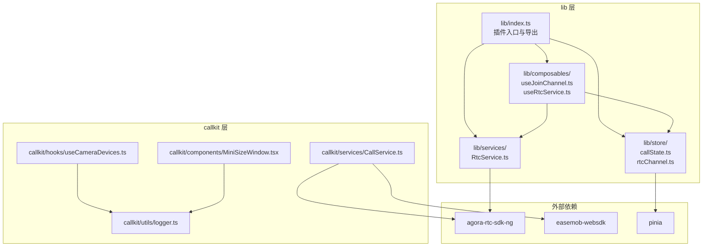
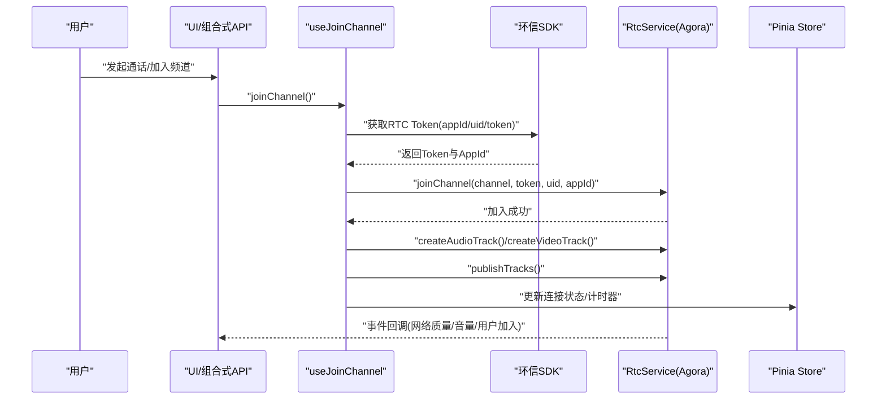
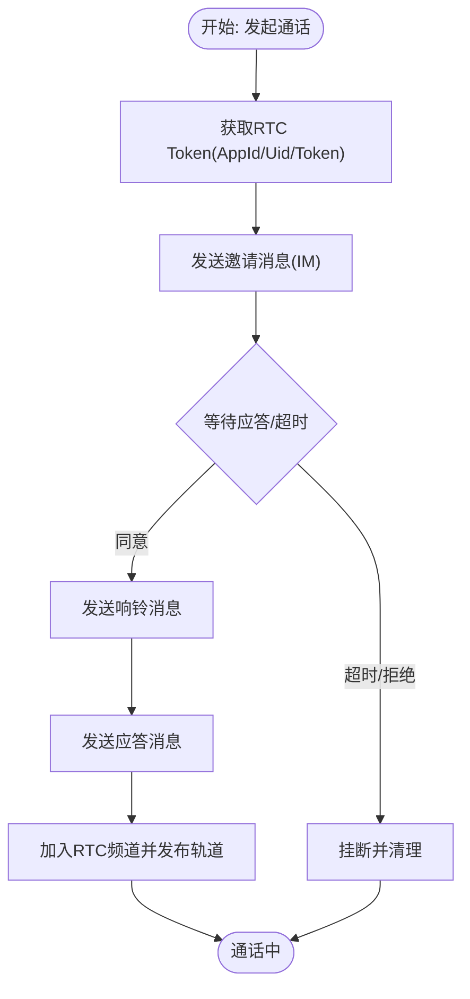
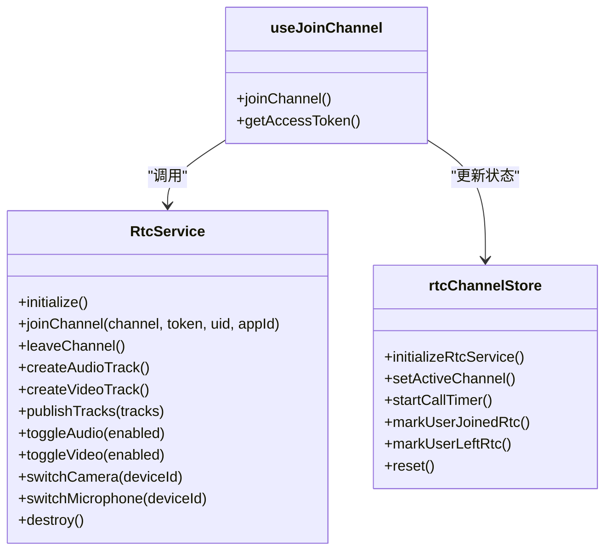
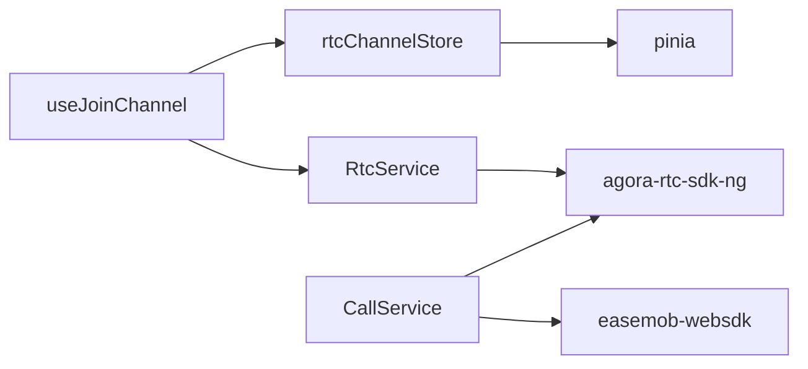

# 安全考虑

<cite>
**本文档引用的文件**
- [README.md](file://README.md)
- [package.json](file://package.json)
- [lib/index.ts](file://lib/index.ts)
- [lib/services/RtcService.ts](file://lib/services/RtcService.ts)
- [lib/composables/useJoinChannel.ts](file://lib/composables/useJoinChannel.ts)
- [lib/composables/useRtcService.ts](file://lib/composables/useRtcService.ts)
- [lib/store/callState.ts](file://lib/store/callState.ts)
- [lib/store/rtcChannel.ts](file://lib/store/rtcChannel.ts)
- [callkit/services/CallService.ts](file://callkit/services/CallService.ts)
- [callkit/utils/logger.ts](file://callkit/utils/logger.ts)
- [callkit/hooks/useCameraDevices.ts](file://callkit/hooks/useCameraDevices.ts)
- [callkit/components/MiniSizeWindow.tsx](file://callkit/components/MiniSizeWindow.tsx)
- [lib/utils/index.ts](file://lib/utils/index.ts)
</cite>

## 目录
1. [简介](#简介)
2. [项目结构](#项目结构)
3. [核心组件](#核心组件)
4. [架构总览](#架构总览)
5. [详细组件分析](#详细组件分析)
6. [依赖关系分析](#依赖关系分析)
7. [性能考量](#性能考量)
8. [故障排查指南](#故障排查指南)
9. [结论](#结论)
10. [附录](#附录)

## 简介
本指南围绕音视频通话应用的安全实践展开，结合代码库中的实现，系统阐述如何在前端侧保障用户隐私与通信安全，包括数据加密、传输安全、存储安全、权限管理、信令与媒体流安全、用户认证策略、常见威胁防护以及安全审计与合规建议。文档同时提供可视化图示与可操作的实践清单，帮助开发者在不牺牲体验的前提下构建更安全的音视频通话系统。

## 项目结构
该项目采用模块化分层组织，核心分为三大部分：
- lib 层：对外暴露的插件入口、组件、组合式 API、服务与状态管理，面向业务方集成。
- callkit 层：演示与示例组件，便于理解 UI 与交互流程。
- test 目录：测试与验证环境，支持源码模式与打包产物模式切换。

图表来源
- [lib/index.ts](file://lib/index.ts#L1-L58)
- [lib/services/RtcService.ts](file://lib/services/RtcService.ts#L1-L719)
- [lib/composables/useJoinChannel.ts](file://lib/composables/useJoinChannel.ts#L1-L185)
- [lib/composables/useRtcService.ts](file://lib/composables/useRtcService.ts#L1-L192)
- [lib/store/callState.ts](file://lib/store/callState.ts#L1-L263)
- [lib/store/rtcChannel.ts](file://lib/store/rtcChannel.ts#L1-L410)
- [callkit/services/CallService.ts](file://callkit/services/CallService.ts#L1-L4478)
- [callkit/utils/logger.ts](file://callkit/utils/logger.ts#L1-L181)
- [callkit/hooks/useCameraDevices.ts](file://callkit/hooks/useCameraDevices.ts#L1-L387)
- [callkit/components/MiniSizeWindow.tsx](file://callkit/components/MiniSizeWindow.tsx#L231-L275)

章节来源
- [README.md](file://README.md#L1-L181)
- [package.json](file://package.json#L1-L53)
- [lib/index.ts](file://lib/index.ts#L1-L58)

## 核心组件
- 信令与媒体服务
  - RtcService：封装 Agora WebRTC 客户端，负责加入/离开频道、音视频轨道创建与发布、设备切换、网络质量与音量指标监听、销毁等。
  - CallService：封装环信 IM 信令流程（邀请、响铃、应答、挂断），并与 RTC Token 获取、UID 映射、UI 回调联动。
- 状态与组合式 API
  - useJoinChannel：在信令确认后获取 RTC Token 并加入频道，创建并发布音视频轨道。
  - useRtcService：提供对本地/远程流、音视频开关、设备切换的响应式访问与控制。
  - callState 与 rtcChannel：Pinia Store，维护通话状态、频道信息、UID/用户映射、参与人集合、计时器等。
- 日志与工具
  - logger：统一日志级别与输出，便于审计与排障。
  - useCameraDevices：摄像头设备枚举与切换，避免与 RTC 冲突，提升权限与隐私保护体验。

章节来源
- [lib/services/RtcService.ts](file://lib/services/RtcService.ts#L1-L719)
- [callkit/services/CallService.ts](file://callkit/services/CallService.ts#L1-L4478)
- [lib/composables/useJoinChannel.ts](file://lib/composables/useJoinChannel.ts#L1-L185)
- [lib/composables/useRtcService.ts](file://lib/composables/useRtcService.ts#L1-L192)
- [lib/store/callState.ts](file://lib/store/callState.ts#L1-L263)
- [lib/store/rtcChannel.ts](file://lib/store/rtcChannel.ts#L1-L410)
- [callkit/utils/logger.ts](file://callkit/utils/logger.ts#L1-L181)
- [callkit/hooks/useCameraDevices.ts](file://callkit/hooks/useCameraDevices.ts#L1-L387)

## 架构总览
下图展示从用户发起通话到媒体流建立的关键路径，以及安全相关要点（令牌、UID 映射、设备权限、日志审计）：

图表来源
- [lib/composables/useJoinChannel.ts](file://lib/composables/useJoinChannel.ts#L39-L178)
- [lib/services/RtcService.ts](file://lib/services/RtcService.ts#L109-L138)
- [lib/store/rtcChannel.ts](file://lib/store/rtcChannel.ts#L242-L272)

## 详细组件分析

### 1) 信令安全（CallService）
- 令牌与身份
  - 通过环信 SDK 获取 Agora RTC Token 与 AppId/Uid，避免在前端硬编码敏感信息。
  - UID 与用户 ID 的映射通过回调与 API 补充，降低明文泄露风险。
- 信令流程
  - 邀请、响铃、应答、挂断均通过 IM 消息承载，包含 callId、channelName、设备标识等，便于追踪与审计。
  - 超时与异常挂断逻辑清晰，防止资源泄漏与僵尸状态。
- 日志与审计
  - 统一日志级别，仅在调试阶段输出敏感上下文；生产环境建议限制日志级别。

图表来源
- [callkit/services/CallService.ts](file://callkit/services/CallService.ts#L292-L308)
- [callkit/services/CallService.ts](file://callkit/services/CallService.ts#L530-L684)
- [callkit/services/CallService.ts](file://callkit/services/CallService.ts#L729-L800)

章节来源
- [callkit/services/CallService.ts](file://callkit/services/CallService.ts#L292-L308)
- [callkit/services/CallService.ts](file://callkit/services/CallService.ts#L530-L684)
- [callkit/services/CallService.ts](file://callkit/services/CallService.ts#L729-L800)
- [callkit/utils/logger.ts](file://callkit/utils/logger.ts#L1-L181)

### 2) 媒体流安全（RtcService 与 useJoinChannel）
- 令牌与鉴权
  - 加入频道时使用动态获取的 Token 与 AppId/Uid，避免硬编码与跨频道滥用。
- 轨道生命周期
  - 成功加入后创建并发布音视频轨道；离开时先 unpublish 再 stop 轨道，防止残留资源。
- 设备权限与隐私
  - 设备枚举与切换通过独立 Hook 执行，避免与 RTC 轨道创建冲突；支持多语言关键词识别主摄像头，减少误用广角/超广角镜头。
- 状态与映射
  - 通过 Store 维护 UID 与用户 ID 的映射、已加入/离开用户集合，避免 UI 混乱与信息泄露。

图表来源
- [lib/services/RtcService.ts](file://lib/services/RtcService.ts#L79-L171)
- [lib/composables/useJoinChannel.ts](file://lib/composables/useJoinChannel.ts#L76-L178)
- [lib/store/rtcChannel.ts](file://lib/store/rtcChannel.ts#L84-L121)

章节来源
- [lib/services/RtcService.ts](file://lib/services/RtcService.ts#L109-L171)
- [lib/composables/useJoinChannel.ts](file://lib/composables/useJoinChannel.ts#L39-L178)
- [lib/store/rtcChannel.ts](file://lib/store/rtcChannel.ts#L274-L408)
- [callkit/hooks/useCameraDevices.ts](file://callkit/hooks/useCameraDevices.ts#L272-L387)

### 3) 权限管理最佳实践
- 摄像头与麦克风权限
  - 通过设备枚举与标签关键词识别前置/后置主摄像头，避免误用广角镜头；切换摄像头时仅使用设备 ID，不暴露设备标签。
  - 在 UI 中仅在具备权限时显示切换按钮，避免误导用户。
- 存储与缓存
  - Hook 层可使用本地缓存策略（如摄像头列表缓存），但不存储敏感信息；涉及用户头像等数据通过安全通道获取。
- 最小权限原则
  - 仅在需要时请求设备权限；在通话结束后及时释放轨道与流，避免长期占用。

章节来源
- [callkit/hooks/useCameraDevices.ts](file://callkit/hooks/useCameraDevices.ts#L1-L387)
- [lib/composables/useRtcService.ts](file://lib/composables/useRtcService.ts#L66-L123)

### 4) 数据与传输安全
- 传输链路
  - 信令通过环信 IM（TLS），媒体通过 Agora RTC（TLS/H264），整体满足现代传输安全要求。
- 敏感数据处理
  - Token、AppId、Uid、设备 ID 等在前端仅用于鉴权与映射，不持久化到本地存储；日志按级别输出，避免泄露。
- 网络质量与异常处理
  - 通过事件监听网络质量与音量指标，异常时及时清理并上报，避免资源泄漏。

章节来源
- [lib/services/RtcService.ts](file://lib/services/RtcService.ts#L664-L673)
- [lib/store/rtcChannel.ts](file://lib/store/rtcChannel.ts#L242-L272)
- [callkit/utils/logger.ts](file://callkit/utils/logger.ts#L1-L181)

### 5) 常见威胁与防护
- 中间人攻击（MITM）
  - 依赖 HTTPS/TLS 的信令与媒体通道；Token 与 AppId 动态下发，缩短有效期窗口。
- 恶意入侵与越权
  - 严格校验 UID 与用户 ID 映射，避免伪造用户身份；离开频道后及时清理映射与计时器。
- 数据泄露
  - 限制日志级别，避免输出 Token、UID 等敏感信息；UI 层仅显示必要信息（头像/昵称）。

章节来源
- [lib/composables/useJoinChannel.ts](file://lib/composables/useJoinChannel.ts#L39-L71)
- [lib/store/rtcChannel.ts](file://lib/store/rtcChannel.ts#L374-L408)
- [callkit/utils/logger.ts](file://callkit/utils/logger.ts#L1-L181)

## 依赖关系分析
- 外部依赖
  - Agora RTC SDK：媒体编解码与传输。
  - 环信 Web SDK：信令与用户体系。
  - Pinia：全局状态管理。
- 内部耦合
  - useJoinChannel 依赖 RtcService 与 Store；RtcService 依赖 Agora 客户端；CallService 依赖环信 SDK 与 Agora。
- 潜在风险
  - 若 Token 获取失败或网络异常，可能导致加入频道失败；应完善重试与降级策略。

图表来源
- [lib/composables/useJoinChannel.ts](file://lib/composables/useJoinChannel.ts#L1-L185)
- [lib/services/RtcService.ts](file://lib/services/RtcService.ts#L1-L719)
- [lib/store/rtcChannel.ts](file://lib/store/rtcChannel.ts#L1-L410)
- [callkit/services/CallService.ts](file://callkit/services/CallService.ts#L1-L4478)

章节来源
- [package.json](file://package.json#L47-L51)
- [lib/index.ts](file://lib/index.ts#L1-L58)

## 性能考量
- 资源释放
  - 离开频道前先 unpublish 再 stop 轨道，避免内存与资源泄漏。
- 事件监听
  - 网络质量与音量指标事件频繁，建议在 UI 层节流或按需渲染。
- 日志级别
  - 生产环境建议降低日志级别，减少 I/O 开销。

章节来源
- [lib/services/RtcService.ts](file://lib/services/RtcService.ts#L143-L171)
- [lib/services/RtcService.ts](file://lib/services/RtcService.ts#L664-L673)
- [callkit/utils/logger.ts](file://callkit/utils/logger.ts#L1-L181)

## 故障排查指南
- Token 获取失败
  - 检查环信 SDK 初始化与登录状态；确认返回数据结构与 appId/uid/token 字段是否存在。
- 加入频道失败
  - 校验 channel 名称、token 有效性与连接状态；查看客户端连接状态与异常日志。
- 设备权限问题
  - 使用设备枚举 Hook 确认摄像头/麦克风可用；避免与 RTC 轨道创建冲突。
- UI 状态不同步
  - 检查 Store 中 UID 映射与 joined/left 用户集合；确认事件回调是否触发。

章节来源
- [lib/composables/useJoinChannel.ts](file://lib/composables/useJoinChannel.ts#L39-L178)
- [lib/store/rtcChannel.ts](file://lib/store/rtcChannel.ts#L274-L408)
- [callkit/hooks/useCameraDevices.ts](file://callkit/hooks/useCameraDevices.ts#L272-L387)

## 结论
本项目在前端侧实现了较为完善的音视频通话安全基线：基于动态 Token 的鉴权、严格的轨道生命周期管理、清晰的信令流程与日志控制、以及对设备权限与隐私的细致处理。建议在生产环境中进一步强化：
- 令牌与密钥的最小暴露面与轮换策略；
- 信令与媒体通道的完整性校验；
- 更细粒度的日志脱敏与合规审计；
- 对异常与边界条件的健壮性测试与监控。

## 附录

### 安全审计清单（实施建议）
- 令牌与密钥
  - [ ] 仅通过受信后端下发 Token 与 AppId/Uid
  - [ ] 避免在前端持久化敏感信息
  - [ ] 定期轮换 Token 生命周期
- 传输与加密
  - [ ] 确保信令与媒体通道使用 TLS
  - [ ] 采用 H264 等业界标准编解码
- 权限与隐私
  - [ ] 仅在需要时请求摄像头/麦克风权限
  - [ ] 切换设备时避免暴露设备标签
  - [ ] 离开频道后立即释放轨道与流
- 日志与审计
  - [ ] 生产环境限制日志级别
  - [ ] 对敏感字段进行脱敏
  - [ ] 记录关键事件（加入/离开、异常、权限变更）
- 异常与边界
  - [ ] 完善超时与重试机制
  - [ ] 异常时清理状态与资源
  - [ ] 监控网络质量与音量指标，及时告警

### 合规性要求（建议）
- 数据最小化：仅收集与提供通话功能所必需的信息
- 用户同意：在首次使用摄像头/麦克风前明确提示并获取同意
- 透明度：向用户公开日志与数据使用政策
- 安全存储：若需缓存，避免存储敏感元数据
- 审计留痕：保留必要的审计日志以便追溯