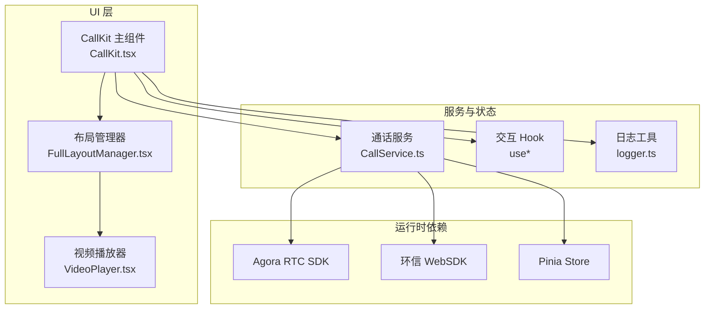
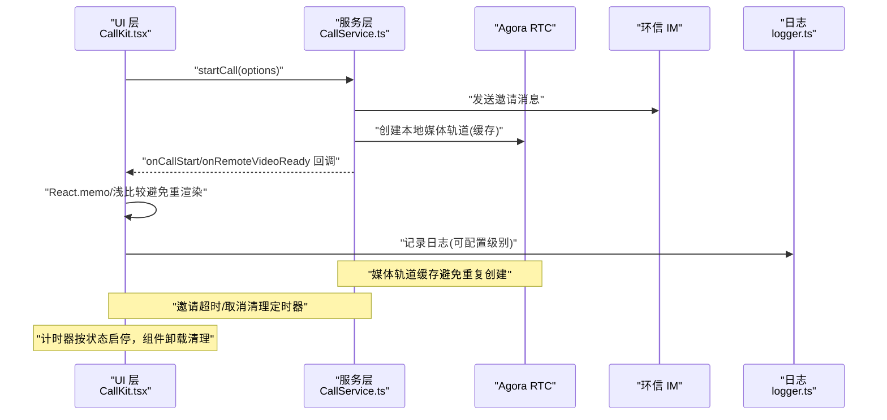
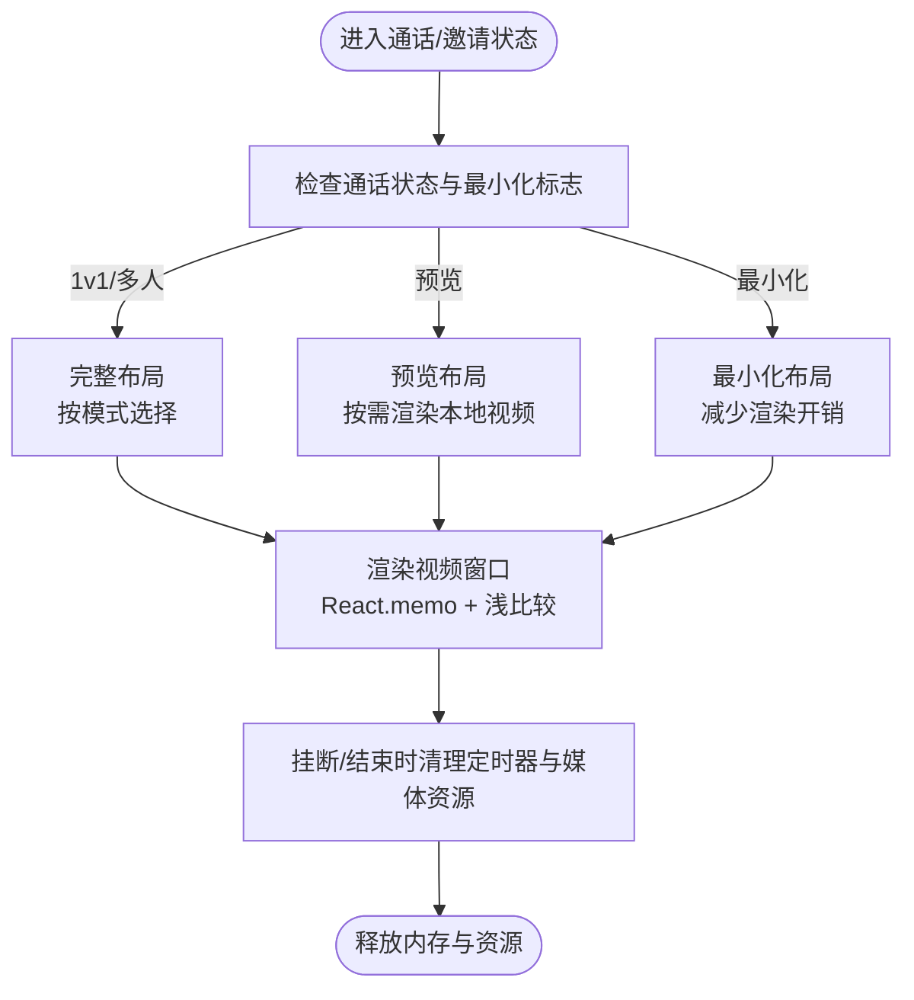
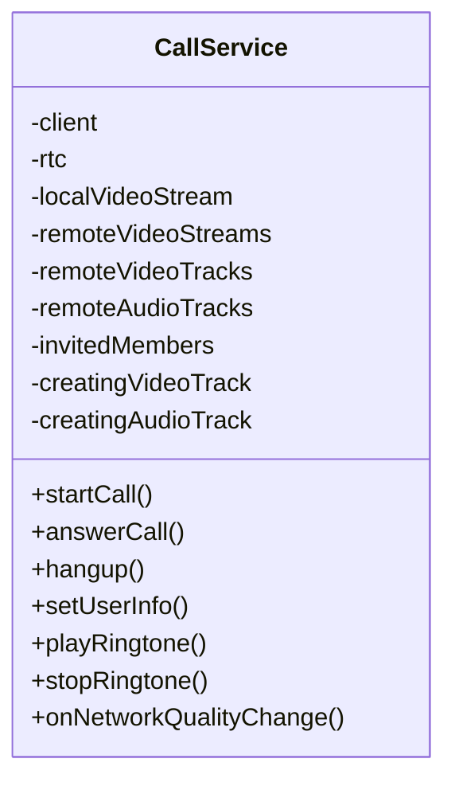
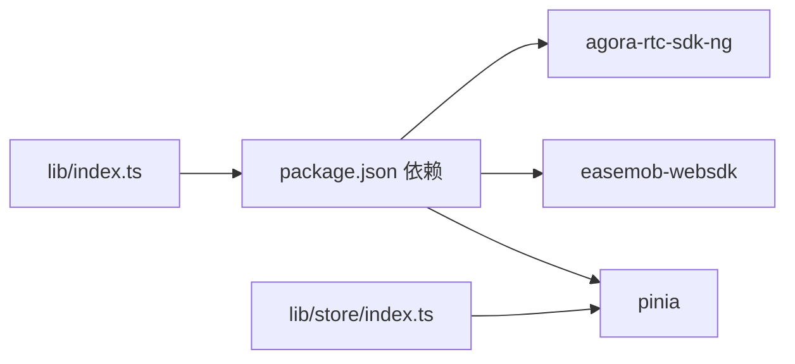

# 性能优化

<cite>
**本文引用的文件**
- [CallKit.tsx](file://callkit/CallKit.tsx)
- [CallService.ts](file://callkit/services/CallService.ts)
- [useCallTimer.ts](file://callkit/hooks/useCallTimer.ts)
- [useContainerSize.ts](file://callkit/hooks/useContainerSize.ts)
- [useFullscreen.ts](file://callkit/hooks/useFullscreen.ts)
- [useResizable.ts](file://callkit/hooks/useResizable.ts)
- [useDraggable.ts](file://callkit/hooks/useDraggable.ts)
- [useInvitationTimers.ts](file://callkit/hooks/useInvitationTimers.ts)
- [FullLayoutManager.tsx](file://callkit/layouts/FullLayoutManager.tsx)
- [VideoPlayer.tsx](file://callkit/components/VideoPlayer.tsx)
- [callUtils.ts](file://callkit/utils/callUtils.ts)
- [logger.ts](file://callkit/utils/logger.ts)
- [package.json](file://package.json)
- [README.md](file://README.md)
- [lib/types.ts](file://lib/types.ts)
- [lib/store/index.ts](file://lib/store/index.ts)
</cite>

## 目录
1. [简介](#简介)
2. [项目结构](#项目结构)
3. [核心组件](#核心组件)
4. [架构总览](#架构总览)
5. [详细组件分析](#详细组件分析)
6. [依赖关系分析](#依赖关系分析)
7. [性能考量](#性能考量)
8. [故障排查指南](#故障排查指南)
9. [结论](#结论)
10. [附录](#附录)

## 简介
本指南聚焦于音视频通话组件的性能优化策略，结合项目中已实现的模块与接口，系统阐述以下主题：
- 组件懒加载与按需渲染
- 状态管理优化与内存泄漏防护
- 网络与媒体流性能调优
- Vue3 响应式系统的性能最佳实践
- Pinia 状态管理的优化配置
- WebRTC 音视频流的性能调优
- 性能监控与测量方法
- 高并发场景下的优化策略

## 项目结构
该项目采用“库+示例”的组织方式，核心能力集中在 callkit 目录；同时提供 lib 目录作为 Vue3 插件形态的封装与导出。关键特性包括：
- 呼叫生命周期管理与 UI 布局编排
- Hook 化的交互与行为（拖拽、缩放、全屏、计时等）
- WebRTC 音视频轨道与媒体流管理
- 日志与网络质量上报
- 可扩展的用户信息与群组信息提供器

图表来源
- [CallKit.tsx](file://callkit/CallKit.tsx#L1-L200)
- [FullLayoutManager.tsx](file://callkit/layouts/FullLayoutManager.tsx#L1-L158)
- [VideoPlayer.tsx](file://callkit/components/VideoPlayer.tsx#L1-L104)
- [CallService.ts](file://callkit/services/CallService.ts#L1-L285)
- [logger.ts](file://callkit/utils/logger.ts#L1-L181)

章节来源
- [README.md](file://README.md#L1-L181)
- [package.json](file://package.json#L1-L53)

## 核心组件
- CallKit 主组件：负责状态聚合、事件回调、UI 布局选择与媒体流状态同步，并通过 CallService 管理 WebRTC 生命周期。
- CallService：封装 Agora RTC 客户端、消息协议、媒体轨道缓存、邀请/应答流程、网络质量回调与铃声播放。
- 布局管理器：根据通话模式与状态动态选择布局，减少不必要的重渲染。
- 视频播放器：基于 React.memo 与自定义浅比较，避免非必要重渲染。
- Hook 集合：计时器、容器尺寸、全屏、可拖拽、可调整大小、邀请定时器等，均采用 useRef 与 useCallback 降低闭包与副作用成本。

章节来源
- [CallKit.tsx](file://callkit/CallKit.tsx#L1-L200)
- [CallService.ts](file://callkit/services/CallService.ts#L116-L285)
- [FullLayoutManager.tsx](file://callkit/layouts/FullLayoutManager.tsx#L16-L157)
- [VideoPlayer.tsx](file://callkit/components/VideoPlayer.tsx#L15-L32)
- [useCallTimer.ts](file://callkit/hooks/useCallTimer.ts#L1-L50)
- [useContainerSize.ts](file://callkit/hooks/useContainerSize.ts#L1-L35)
- [useFullscreen.ts](file://callkit/hooks/useFullscreen.ts#L1-L82)
- [useResizable.ts](file://callkit/hooks/useResizable.ts#L1-L603)
- [useDraggable.ts](file://callkit/hooks/useDraggable.ts#L1-L291)
- [useInvitationTimers.ts](file://callkit/hooks/useInvitationTimers.ts#L1-L70)

## 架构总览
下面的序列图展示了从发起通话到建立媒体流的关键路径，以及性能优化点（如媒体轨道缓存、邀请超时清理、计时器管理）：

图表来源
- [CallKit.tsx](file://callkit/CallKit.tsx#L685-L758)
- [CallService.ts](file://callkit/services/CallService.ts#L345-L527)
- [logger.ts](file://callkit/utils/logger.ts#L28-L181)

## 详细组件分析

### CallKit 主组件性能要点
- 使用 React.memo 包裹布局管理器，减少因无关 props 变化导致的重渲染。
- 通过 useRef 存储回调与状态引用，避免闭包依赖导致的无效重渲染。
- 计时器按通话状态启停，组件卸载时清理，避免后台定时任务泄漏。
- 邀请超时与用户移除场景中，及时清理定时器与视频元素引用，防止内存泄漏。
- 通话结束时主动清理 video 元素的 srcObject 与内部状态，释放媒体资源。

图表来源
- [CallKit.tsx](file://callkit/CallKit.tsx#L41-L45)
- [CallKit.tsx](file://callkit/CallKit.tsx#L196-L230)
- [CallKit.tsx](file://callkit/CallKit.tsx#L355-L426)
- [FullLayoutManager.tsx](file://callkit/layouts/FullLayoutManager.tsx#L62-L85)
- [VideoPlayer.tsx](file://callkit/components/VideoPlayer.tsx#L15-L32)

章节来源
- [CallKit.tsx](file://callkit/CallKit.tsx#L41-L45)
- [CallKit.tsx](file://callkit/CallKit.tsx#L196-L230)
- [CallKit.tsx](file://callkit/CallKit.tsx#L355-L426)
- [FullLayoutManager.tsx](file://callkit/layouts/FullLayoutManager.tsx#L62-L85)
- [VideoPlayer.tsx](file://callkit/components/VideoPlayer.tsx#L15-L32)

### CallService 媒体与网络性能
- 媒体轨道缓存：本地视频/音频轨道与远程视频流缓存，避免重复创建与频繁切换造成的抖动。
- 邀请流程超时与取消：通过定时器与回调清理，避免悬挂状态占用内存。
- 网络质量回调：将 uplink/downlink 质量合并并过滤无效值，降低 UI 抖动。
- 铃声播放：延迟初始化，避免阻塞主流程；接听/拒绝时停止播放，释放资源。
- 编码配置：支持 VideoEncoderConfigurationPreset，按需选择分辨率与码率。

图表来源
- [CallService.ts](file://callkit/services/CallService.ts#L116-L285)
- [CallService.ts](file://callkit/services/CallService.ts#L345-L527)
- [CallService.ts](file://callkit/services/CallService.ts#L686-L727)

章节来源
- [CallService.ts](file://callkit/services/CallService.ts#L116-L285)
- [CallService.ts](file://callkit/services/CallService.ts#L345-L527)
- [CallService.ts](file://callkit/services/CallService.ts#L686-L727)

### Hook 性能与内存优化
- 计时器 Hook：按状态启停，组件卸载清理，避免泄漏。
- 容器尺寸 Hook：使用 ResizeObserver 监听，避免轮询带来的 CPU 占用。
- 全屏 Hook：监听全屏事件，避免重复绑定与未清理的事件监听器。
- 可调整大小 Hook：精细化边缘检测与光标样式，减少不必要的 DOM 操作与样式变更。
- 可拖拽 Hook：区分拖动区域与调整大小区域，避免事件冲突；拖动阈值与“刚结束拖动”标记，减少误触与多余回调。
- 邀请定时器 Hook：Map 存储定时器，按用户清理，组件卸载时批量清理。

章节来源
- [useCallTimer.ts](file://callkit/hooks/useCallTimer.ts#L1-L50)
- [useContainerSize.ts](file://callkit/hooks/useContainerSize.ts#L1-L35)
- [useFullscreen.ts](file://callkit/hooks/useFullscreen.ts#L1-L82)
- [useResizable.ts](file://callkit/hooks/useResizable.ts#L1-L603)
- [useDraggable.ts](file://callkit/hooks/useDraggable.ts#L1-L291)
- [useInvitationTimers.ts](file://callkit/hooks/useInvitationTimers.ts#L1-L70)

### 布局与渲染优化
- 布局管理器根据状态与模式选择具体布局，避免在非必要情况下渲染复杂 UI。
- 视频播放器使用 React.memo 与自定义浅比较，仅在 stream 真正变化时重渲染，减少 DOM 更新。
- 本地镜像视频与远端视频分别处理，避免不必要的类名计算与样式切换。

章节来源
- [FullLayoutManager.tsx](file://callkit/layouts/FullLayoutManager.tsx#L62-L157)
- [VideoPlayer.tsx](file://callkit/components/VideoPlayer.tsx#L15-L32)
- [VideoPlayer.tsx](file://callkit/components/VideoPlayer.tsx#L46-L52)

### 工具与日志
- 通话时长格式化与随机频道生成，避免额外依赖与无谓计算。
- 日志系统支持级别控制与前缀配置，便于生产环境降噪与问题定位。

章节来源
- [callUtils.ts](file://callkit/utils/callUtils.ts#L25-L32)
- [callUtils.ts](file://callkit/utils/callUtils.ts#L11-L18)
- [logger.ts](file://callkit/utils/logger.ts#L28-L181)

## 依赖关系分析
- 运行时依赖：agora-rtc-sdk-ng、easemob-websdk、pinia。
- 项目类型：Vue3 插件形态，lib 目录提供入口与类型，callkit 目录提供核心实现。
- 插件入口与 Store：lib/store/index.ts 明确不创建独立 Pinia 实例，使用应用层提供的 Pinia。

图表来源
- [package.json](file://package.json#L47-L51)
- [lib/store/index.ts](file://lib/store/index.ts#L1-L3)

章节来源
- [package.json](file://package.json#L47-L51)
- [lib/store/index.ts](file://lib/store/index.ts#L1-L3)

## 性能考量

### 组件懒加载与按需渲染
- 使用 React.memo 与浅比较函数，避免 props 仅变化时的重渲染。
- 布局管理器按状态与模式选择渲染，减少不必要的子树计算。
- 视频播放器仅在 stream 变化时更新 DOM，避免频繁重绘。

章节来源
- [VideoPlayer.tsx](file://callkit/components/VideoPlayer.tsx#L15-L32)
- [FullLayoutManager.tsx](file://callkit/layouts/FullLayoutManager.tsx#L62-L85)

### 状态管理优化与内存泄漏防护
- useRef 存储回调与状态引用，避免闭包依赖导致的无效重渲染。
- 计时器、全屏事件、调整大小与拖拽事件均在组件卸载时清理，防止内存泄漏。
- 邀请定时器使用 Map 存储，按用户清理，组件卸载时批量清理。

章节来源
- [CallKit.tsx](file://callkit/CallKit.tsx#L446-L458)
- [useCallTimer.ts](file://callkit/hooks/useCallTimer.ts#L38-L42)
- [useFullscreen.ts](file://callkit/hooks/useFullscreen.ts#L54-L73)
- [useResizable.ts](file://callkit/hooks/useResizable.ts#L544-L595)
- [useDraggable.ts](file://callkit/hooks/useDraggable.ts#L241-L281)
- [useInvitationTimers.ts](file://callkit/hooks/useInvitationTimers.ts#L57-L61)

### 网络与媒体流性能调优
- 媒体轨道与远程视频流缓存，避免重复创建与切换抖动。
- 邀请超时与取消清理，防止悬挂状态占用资源。
- 网络质量回调合并与过滤无效值，降低 UI 抖动。
- 编码配置可选，按需选择分辨率与码率，平衡画质与带宽。

章节来源
- [CallService.ts](file://callkit/services/CallService.ts#L132-L149)
- [CallService.ts](file://callkit/services/CallService.ts#L242-L252)
- [CallService.ts](file://callkit/services/CallService.ts#L686-L727)

### Vue3 响应式系统最佳实践
- 在 Vue3 插件形态中，遵循“应用层提供 Pinia 实例”的约定，避免重复创建 Store 实例。
- 对于高频更新的状态，建议拆分模块化 Store 并使用 getter 缓存派生结果。
- 使用 computed 与 shallowRef 减少深层响应式追踪成本。

章节来源
- [lib/store/index.ts](file://lib/store/index.ts#L1-L3)
- [lib/types.ts](file://lib/types.ts#L1-L91)

### Pinia 状态管理优化配置
- 使用模块化 Store，按功能划分状态域，避免单一 Store 过大。
- 使用持久化插件时，注意白名单与序列化策略，减少 IO 压力。
- 对于频繁更新的 UI 状态，考虑使用局部状态与 props 下推，降低全局状态更新频率。

章节来源
- [lib/store/index.ts](file://lib/store/index.ts#L1-L3)

### WebRTC 音视频流性能调优
- 合理设置编码配置，平衡清晰度与带宽占用。
- 优先使用缓存的媒体轨道，避免频繁创建/销毁。
- 在挂断或离开房间时，显式停止轨道与释放资源，防止后台占用。

章节来源
- [CallService.ts](file://callkit/services/CallService.ts#L242-L252)
- [CallService.ts](file://callkit/services/CallService.ts#L414-L472)
- [CallService.ts](file://callkit/services/CallService.ts#L707-L727)

### 监控与测量性能指标
- 使用日志系统记录关键节点（开始/结束/错误），并按级别控制输出。
- 采集网络质量指标（上/下行质量、丢包率等），结合 UI 反馈。
- 使用浏览器性能面板（Performance/Network）观察渲染帧率、CPU 占用与网络请求。

章节来源
- [logger.ts](file://callkit/utils/logger.ts#L28-L181)
- [CallService.ts](file://callkit/services/CallService.ts#L162-L167)

### 高并发场景优化策略
- 限制同时进行的通话数量，避免资源争用。
- 对媒体轨道与视频元素进行池化管理，减少创建/销毁开销。
- 使用节流/防抖处理高频事件（如窗口大小变化、滚动、触摸）。
- 在服务端限流与客户端降级策略配合下，动态调整编码参数与渲染质量。

[本节为通用指导，无需列出章节来源]

## 故障排查指南
- 无法播放本地/远端视频
  - 检查媒体轨道是否创建成功与缓存状态。
  - 确认视频元素的 srcObject 是否正确赋值。
  - 查看日志输出，确认权限与设备可用性。
- 邀请超时未触发
  - 确认定时器是否按用户存储与清理。
  - 检查 onInvitationTimeout 回调是否正确注册。
- 挂断后内存未释放
  - 确认计时器、事件监听器与定时器均已清理。
  - 检查视频元素的 srcObject 是否置空。
- 全屏/拖拽/调整大小异常
  - 检查事件监听器是否重复绑定与未清理。
  - 确认光标样式与 CSS 类是否冲突。

章节来源
- [CallService.ts](file://callkit/services/CallService.ts#L414-L472)
- [useInvitationTimers.ts](file://callkit/hooks/useInvitationTimers.ts#L7-L23)
- [CallKit.tsx](file://callkit/CallKit.tsx#L403-L414)
- [useFullscreen.ts](file://callkit/hooks/useFullscreen.ts#L54-L73)
- [useResizable.ts](file://callkit/hooks/useResizable.ts#L544-L595)
- [useDraggable.ts](file://callkit/hooks/useDraggable.ts#L241-L281)

## 结论
通过在组件层面采用 React.memo、浅比较与 useRef 引用，结合 CallService 的媒体轨道缓存与邀请超时清理，项目在渲染与资源管理方面已具备良好的性能基础。进一步可在以下方面持续优化：
- 更细粒度的状态拆分与模块化 Store
- 高频事件的节流/防抖与批处理
- WebRTC 编码参数的动态自适应
- 生产环境的日志级别与采样策略

[本节为总结，无需列出章节来源]

## 附录
- 插件入口与类型参考：lib/types.ts
- 插件 Store 约定：lib/store/index.ts

章节来源
- [lib/types.ts](file://lib/types.ts#L1-L91)
- [lib/store/index.ts](file://lib/store/index.ts#L1-L3)