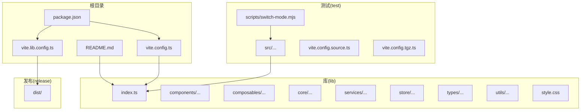
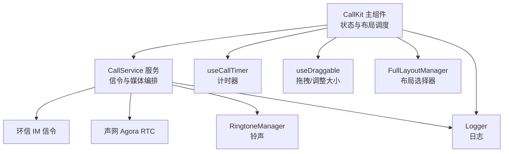
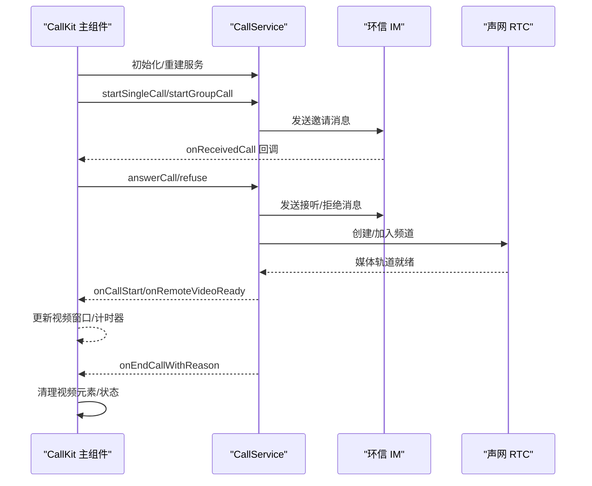
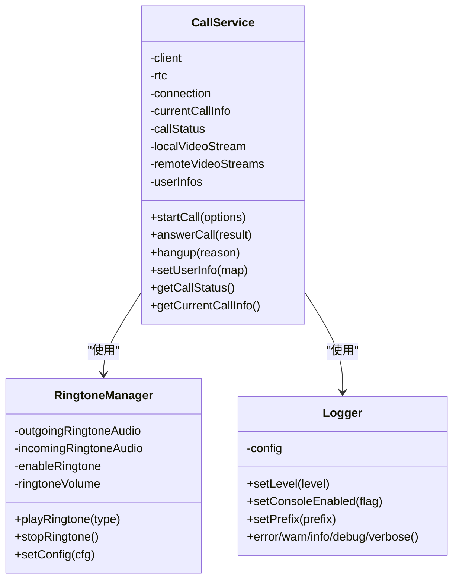
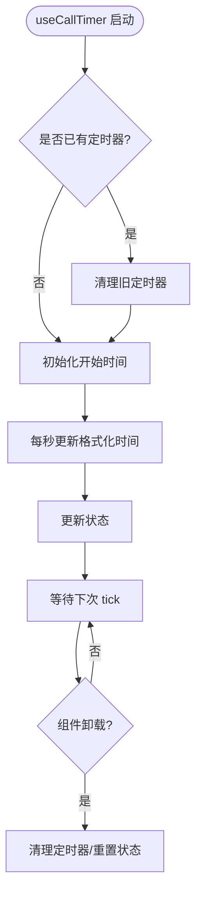
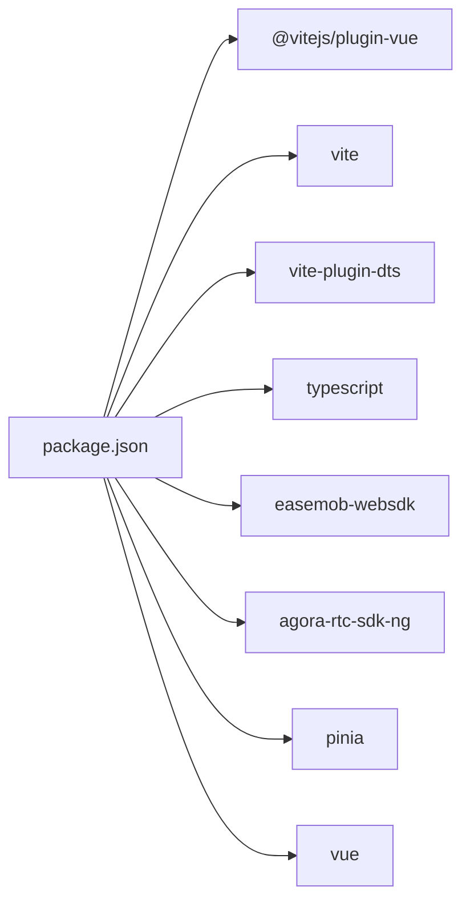

# 最佳实践

<cite>
**本文引用的文件**   
- [README.md](file://README.md)
- [package.json](file://package.json)
- [vite.config.ts](file://vite.config.ts)
- [vite.lib.config.ts](file://vite.lib.config.ts)
- [callkit/CallKit.tsx](file://callkit/CallKit.tsx)
- [callkit/services/CallService.ts](file://callkit/services/CallService.ts)
- [callkit/utils/logger.ts](file://callkit/utils/logger.ts)
- [callkit/types/index.ts](file://callkit/types/index.ts)
- [callkit/hooks/useCallTimer.ts](file://callkit/hooks/useCallTimer.ts)
- [callkit/hooks/useDraggable.ts](file://callkit/hooks/useDraggable.ts)
- [callkit/layouts/FullLayoutManager.tsx](file://callkit/layouts/FullLayoutManager.tsx)
- [callkit/utils/ringtoneManager.ts](file://callkit/utils/ringtoneManager.ts)
- [callkit/docs/quickstart.md](file://callkit/docs/quickstart.md)
- [callkit/docs/integration.md](file://callkit/docs/integration.md)
- [callkit/docs/common_issue.md](file://callkit/docs/common_issue.md)
</cite>

## 目录
1. [引言](#引言)
2. [项目结构](#项目结构)
3. [核心组件](#核心组件)
4. [架构总览](#架构总览)
5. [详细组件分析](#详细组件分析)
6. [依赖分析](#依赖分析)
7. [性能考量](#性能考量)
8. [故障排查指南](#故障排查指南)
9. [结论](#结论)
10. [附录](#附录)

## 引言
本最佳实践指南基于实际项目经验，总结了在开发与使用环信 CallKit Vue3 插件过程中的经验与教训，覆盖性能优化、错误处理、内存管理、用户体验优化、代码组织与命名规范、架构设计、测试与调试、监控、安全与隐私等方面。内容既适用于初学者，也适用于有经验的开发者，帮助团队在不同阶段高效落地高质量的音视频通话能力。

## 项目结构
该项目采用“库模式 + 测试样例”的双目录结构，便于在源码与打包产物之间无缝切换验证，同时提供完善的构建与发布流程。

- 核心库目录：lib/ 提供插件源码、组件、组合式函数、核心服务、Pinia Store、类型定义、工具函数与样式入口。
- 测试样例：test/ 提供独立的测试页面与脚本，支持源码模式与 tgz 包模式自动切换，便于开发与发布前验证。
- 构建配置：根级 vite.config.ts 与 lib 构建 vite.lib.config.ts，分别负责开发与库构建，包含自动清空 release/dist 的自定义插件。
- 文档：callkit/docs/ 提供快速开始、集成指南与常见问题，便于上手与排障。

图表来源
- [README.md](file://README.md#L1-L181)
- [package.json](file://package.json#L1-L53)
- [vite.config.ts](file://vite.config.ts#L1-L21)
- [vite.lib.config.ts](file://vite.lib.config.ts#L1-L68)

章节来源
- [README.md](file://README.md#L1-L181)
- [package.json](file://package.json#L1-L53)
- [vite.config.ts](file://vite.config.ts#L1-L21)
- [vite.lib.config.ts](file://vite.lib.config.ts#L1-L68)

## 核心组件
- CallKit 主组件：负责 UI 呈现、状态管理、布局调度、交互控制与生命周期清理，封装对 CallService 的调用。
- CallService 服务：封装环信 IM 信令与声网 RTC 的交互，负责邀请发送、接听/拒接、通话状态机、媒体轨道管理、铃声播放与错误上报。
- Hook 体系：如 useCallTimer、useDraggable 等，提供可复用的状态与副作用逻辑，降低组件复杂度。
- 布局管理：FullLayoutManager 根据通话模式与状态动态选择布局，支持最小化、预览、多人、1v1 等多种模式。
- 日志与铃声：Logger 提供可控的日志级别与前缀；RingtoneManager 提供统一的铃声播放与停止能力。
- 类型系统：types/index.ts 定义了组件属性、布局模式、视频窗口、邀请信息等强类型，提升开发体验与可维护性。

章节来源
- [callkit/CallKit.tsx](file://callkit/CallKit.tsx#L1-L800)
- [callkit/services/CallService.ts](file://callkit/services/CallService.ts#L1-L800)
- [callkit/types/index.ts](file://callkit/types/index.ts#L1-L356)
- [callkit/hooks/useCallTimer.ts](file://callkit/hooks/useCallTimer.ts#L1-L50)
- [callkit/hooks/useDraggable.ts](file://callkit/hooks/useDraggable.ts#L1-L291)
- [callkit/layouts/FullLayoutManager.tsx](file://callkit/layouts/FullLayoutManager.tsx#L1-L158)
- [callkit/utils/logger.ts](file://callkit/utils/logger.ts#L1-L181)
- [callkit/utils/ringtoneManager.ts](file://callkit/utils/ringtoneManager.ts#L1-L139)

## 架构总览
整体架构围绕“组件层 + 服务层 + Hook 层 + 工具层”展开，组件层负责 UI 与交互，服务层负责信令与媒体，Hook 层提供横切关注点，工具层提供日志、铃声与通用工具。

图表来源
- [callkit/CallKit.tsx](file://callkit/CallKit.tsx#L1-L800)
- [callkit/services/CallService.ts](file://callkit/services/CallService.ts#L1-L800)
- [callkit/hooks/useCallTimer.ts](file://callkit/hooks/useCallTimer.ts#L1-L50)
- [callkit/hooks/useDraggable.ts](file://callkit/hooks/useDraggable.ts#L1-L291)
- [callkit/layouts/FullLayoutManager.tsx](file://callkit/layouts/FullLayoutManager.tsx#L1-L158)
- [callkit/utils/logger.ts](file://callkit/utils/logger.ts#L1-L181)
- [callkit/utils/ringtoneManager.ts](file://callkit/utils/ringtoneManager.ts#L1-L139)

## 详细组件分析

### CallKit 主组件（UI 与状态中枢）
- 职责：接收 props、管理内部状态（邀请、通话状态、视频窗口、最小化、群组成员选择等）、协调 CallService 生命周期、触发 UI 回调。
- 性能优化：使用 React.memo 包裹布局组件、合理拆分状态、使用 useRef 缓存回调与状态引用，避免不必要的重渲染。
- 生命周期：在 chatClient 变更时重建 CallService，组件卸载时销毁服务与清理 DOM 上的视频资源。
- 交互：内置拖拽、调整大小、最小化、计时器、网络质量、铃声播放等能力，通过 Hook 与服务解耦。

图表来源
- [callkit/CallKit.tsx](file://callkit/CallKit.tsx#L1-L800)
- [callkit/services/CallService.ts](file://callkit/services/CallService.ts#L1-L800)

章节来源
- [callkit/CallKit.tsx](file://callkit/CallKit.tsx#L1-L800)

### CallService 服务（信令与媒体编排）
- 职责：封装邀请发送、接听/拒接、通话状态机、媒体轨道管理、用户/群组信息提供、铃声播放、错误上报。
- 状态机：CALL_STATUS/CALL_TYPE/HANGUP_REASON 等枚举清晰表达状态流转，避免魔法值。
- 资源管理：缓存本地/远端媒体流与轨道，避免重复创建；在异常路径清理泄漏轨道。
- 铃声与日志：通过 RingtoneManager 与 Logger 解耦，支持可配置的音量、循环与日志级别。

图表来源
- [callkit/services/CallService.ts](file://callkit/services/CallService.ts#L1-L800)
- [callkit/utils/ringtoneManager.ts](file://callkit/utils/ringtoneManager.ts#L1-L139)
- [callkit/utils/logger.ts](file://callkit/utils/logger.ts#L1-L181)

章节来源
- [callkit/services/CallService.ts](file://callkit/services/CallService.ts#L1-L800)
- [callkit/utils/ringtoneManager.ts](file://callkit/utils/ringtoneManager.ts#L1-L139)
- [callkit/utils/logger.ts](file://callkit/utils/logger.ts#L1-L181)

### Hook 体系（横切关注点）
- useCallTimer：统一管理通话计时器，避免内存泄漏，组件卸载时自动清理。
- useDraggable：提供拖拽与边缘调整大小能力，避免与 resize 光标冲突，减少误触。

图表来源
- [callkit/hooks/useCallTimer.ts](file://callkit/hooks/useCallTimer.ts#L1-L50)

章节来源
- [callkit/hooks/useCallTimer.ts](file://callkit/hooks/useCallTimer.ts#L1-L50)
- [callkit/hooks/useDraggable.ts](file://callkit/hooks/useDraggable.ts#L1-L291)

### 布局管理（FullLayoutManager）
- 根据通话模式与状态动态选择布局：最小化、预览、1v1、多人、屏幕共享等。
- 将 Header/Controls 与布局逻辑整合，简化上层组件复杂度。

章节来源
- [callkit/layouts/FullLayoutManager.tsx](file://callkit/layouts/FullLayoutManager.tsx#L1-L158)

### 类型系统（types/index.ts）
- 定义 VideoWindowProps、LayoutMode、InvitationInfo、CallKitProps/Ref 等强类型，贯穿组件、服务与 Hook，提升可维护性与 IDE 支持。

章节来源
- [callkit/types/index.ts](file://callkit/types/index.ts#L1-L356)

## 依赖分析
- 运行时依赖：easemob-websdk（环信 IM）、agora-rtc-sdk-ng（声网 RTC）、pinia（状态管理）。
- 开发依赖：vue、@vitejs/plugin-vue、vite、vite-plugin-dts、typescript 等。
- 构建与发布：vite.lib.config.ts 中自定义 cleanReleaseDist 插件，构建前清空 release/dist，确保产物干净；导出 es 与 umd 两种格式，样式单独输出。

图表来源
- [package.json](file://package.json#L1-L53)

章节来源
- [package.json](file://package.json#L1-L53)
- [vite.lib.config.ts](file://vite.lib.config.ts#L1-L68)

## 性能考量
- 组件渲染优化
  - 使用 React.memo 包裹重型布局组件，减少重渲染。
  - 将高频状态拆分，避免单一大对象导致的不必要更新。
  - 使用 useRef 缓存回调与状态引用，降低闭包与依赖变更带来的重渲染。
- 媒体资源管理
  - 缓存本地/远端媒体流与轨道，避免重复创建；在异常路径及时释放轨道与停止 MediaStreamTrack。
  - 在通话结束时清理 DOM 上的 video 元素 srcObject，防止资源泄漏。
- 计时与定时器
  - useCallTimer 在组件卸载时自动清理，避免内存泄漏。
- 构建与产物
  - 构建前清空 release/dist，确保产物一致性；按需导出样式与类型声明，减小包体积。

章节来源
- [callkit/CallKit.tsx](file://callkit/CallKit.tsx#L1-L800)
- [callkit/hooks/useCallTimer.ts](file://callkit/hooks/useCallTimer.ts#L1-L50)
- [vite.lib.config.ts](file://vite.lib.config.ts#L1-L68)

## 故障排查指南
- 常见问题
  - 发起通话无反应：检查 chatClient 是否已初始化并登录；确认用户存在。
  - 通话无法建立：检查对方是否在线与网络状况。
  - 音视频问题：检查麦克风/摄像头权限与浏览器兼容性；网络带宽不足可能导致卡顿。
  - 浏览器兼容性：生产环境需 HTTPS；确保使用现代浏览器最新版本。
  - 好友检查：若开启好友检查，非好友间无法一对一通话，群组通话信令也会受影响。
- 快速定位
  - 启用日志：通过 logLevel 与 logPrefix 输出详细日志，定位状态机与媒体问题。
  - 铃声验证：确认 enableRingtone、ringtoneVolume、ringtoneLoop 配置正确。
  - 调试模式：使用源码模式与 tgz 模式对比，快速发现构建差异导致的问题。

章节来源
- [callkit/docs/common_issue.md](file://callkit/docs/common_issue.md#L1-L28)
- [callkit/utils/logger.ts](file://callkit/utils/logger.ts#L1-L181)
- [callkit/utils/ringtoneManager.ts](file://callkit/utils/ringtoneManager.ts#L1-L139)
- [README.md](file://README.md#L1-L181)

## 结论
本项目通过清晰的分层架构、强类型的类型系统、可复用的 Hook 与完善的日志/铃声工具，实现了高可用、易扩展的音视频通话能力。遵循本文的最佳实践，可在不同阶段（开发、构建、测试、发布、运维）持续提升稳定性与用户体验。

## 附录

### 开发与测试最佳实践
- 模式切换：使用根级脚本一键切换源码模式与 tgz 模式，避免手动修改依赖配置。
- 构建验证：构建前自动清空 release/dist，确保产物一致性；发布前使用 tgz 模式验证。
- 测试页面：在 test/ 下准备最小可运行示例，覆盖登录、发起/接听通话、群组通话等关键路径。

章节来源
- [README.md](file://README.md#L1-L181)
- [vite.lib.config.ts](file://vite.lib.config.ts#L1-L68)

### 架构设计与代码组织
- 目录组织：lib/ 下按功能域划分，组件、服务、类型、工具、样式分离，便于维护与复用。
- 导出策略：根级 vite.config.ts 与 lib 构建配置统一入口与别名，保证开发与生产一致。
- 类型与文档：类型定义集中于 types/index.ts，文档集中在 docs/，形成“类型即文档”的开发体验。

章节来源
- [vite.config.ts](file://vite.config.ts#L1-L21)
- [vite.lib.config.ts](file://vite.lib.config.ts#L1-L68)
- [callkit/types/index.ts](file://callkit/types/index.ts#L1-L356)
- [callkit/docs/quickstart.md](file://callkit/docs/quickstart.md#L1-L617)
- [callkit/docs/integration.md](file://callkit/docs/integration.md#L1-L417)