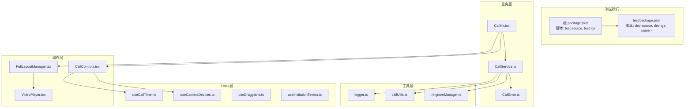
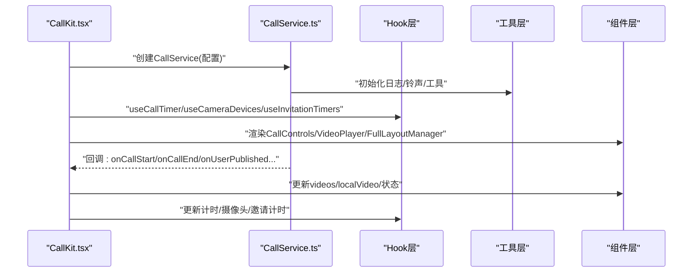
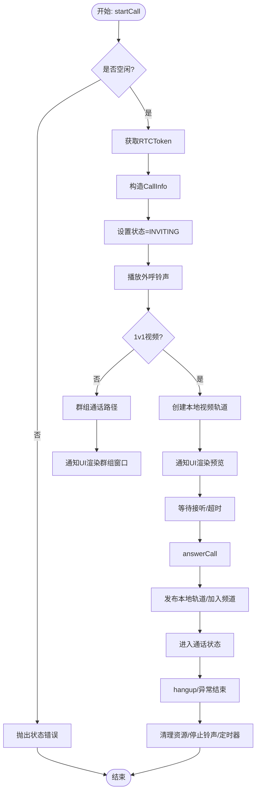
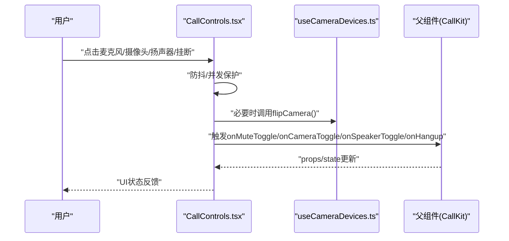
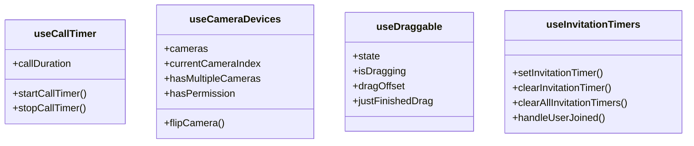
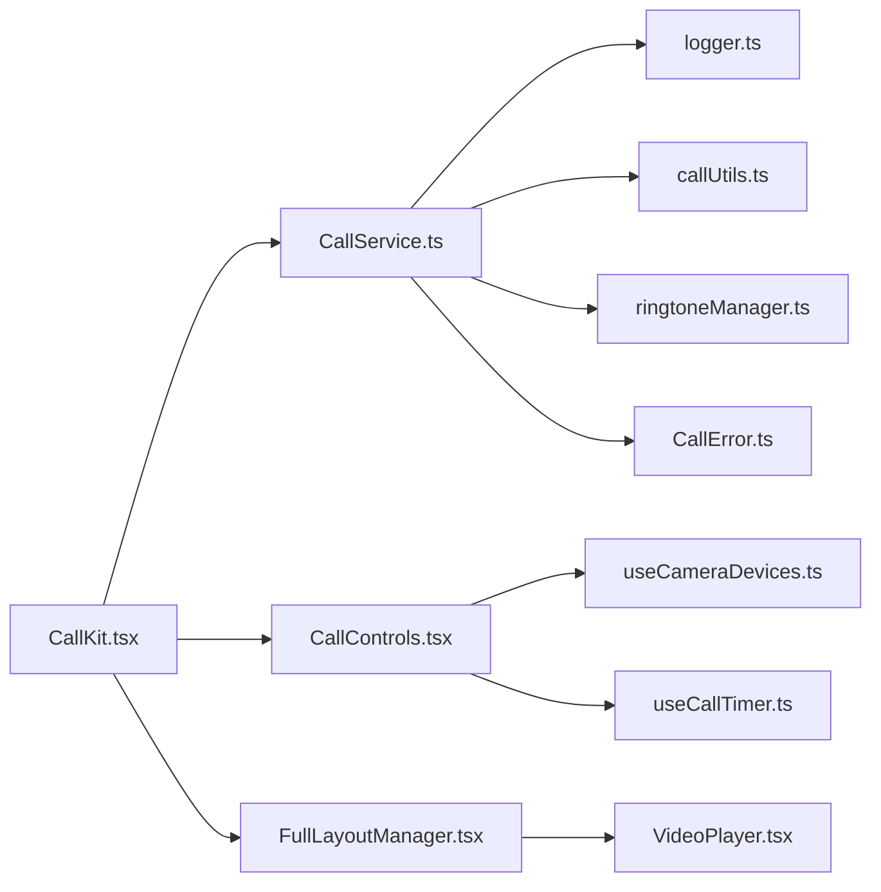

# 测试策略

<cite>
**本文档引用的文件**
- [package.json](file://package.json)
- [test/package.json](file://test/package.json)
- [callkit/services/CallService.ts](file://callkit/services/CallService.ts)
- [callkit/services/CallError.ts](file://callkit/services/CallError.ts)
- [callkit/utils/logger.ts](file://callkit/utils/logger.ts)
- [callkit/utils/callUtils.ts](file://callkit/utils/callUtils.ts)
- [callkit/utils/ringtoneManager.ts](file://callkit/utils/ringtoneManager.ts)
- [callkit/hooks/useCallTimer.ts](file://callkit/hooks/useCallTimer.ts)
- [callkit/hooks/useCameraDevices.ts](file://callkit/hooks/useCameraDevices.ts)
- [callkit/hooks/useInvitationTimers.ts](file://callkit/hooks/useInvitationTimers.ts)
- [callkit/hooks/useDraggable.ts](file://callkit/hooks/useDraggable.ts)
- [callkit/components/CallControls.tsx](file://callkit/components/CallControls.tsx)
- [callkit/components/VideoPlayer.tsx](file://callkit/components/VideoPlayer.tsx)
- [callkit/layouts/FullLayoutManager.tsx](file://callkit/layouts/FullLayoutManager.tsx)
- [callkit/CallKit.tsx](file://callkit/CallKit.tsx)
</cite>

## 目录
1. [简介](#简介)
2. [项目结构](#项目结构)
3. [核心组件](#核心组件)
4. [架构总览](#架构总览)
5. [详细组件分析](#详细组件分析)
6. [依赖关系分析](#依赖关系分析)
7. [性能考量](#性能考量)
8. [故障排查指南](#故障排查指南)
9. [结论](#结论)
10. [附录](#附录)

## 简介
本测试策略面向音视频通话应用，覆盖单元测试、集成测试与端到端测试的实施路径，重点指导Vue3组件测试最佳实践（含组合式API与异步操作），以及复杂音视频状态与交互逻辑的测试方法。文档同时提供Mock策略、测试环境搭建、覆盖率要求与持续集成配置建议，并整合自动化与手动测试、性能测试的综合策略。

## 项目结构
项目采用模块化分层组织，核心模块包括服务层（CallService）、工具层（日志、铃声、工具函数）、Hook层（计时、摄像头、拖拽、邀请计时器）、组件层（CallControls、VideoPlayer、FullLayoutManager）与主组件CallKit。测试相关脚本位于根与test目录的package.json中，分别支持源码与打包产物两种运行模式。

**图表来源**
- [package.json](file://package.json#L23-L31)
- [test/package.json](file://test/package.json#L6-L13)
- [callkit/CallKit.tsx](file://callkit/CallKit.tsx#L1-L120)
- [callkit/services/CallService.ts](file://callkit/services/CallService.ts#L1-L120)
- [callkit/components/CallControls.tsx](file://callkit/components/CallControls.tsx#L1-L120)
- [callkit/layouts/FullLayoutManager.tsx](file://callkit/layouts/FullLayoutManager.tsx#L1-L120)

**章节来源**
- [package.json](file://package.json#L23-L31)
- [test/package.json](file://test/package.json#L6-L13)

## 核心组件
- 服务层：CallService负责信令与媒体生命周期管理、状态机推进、铃声与网络质量回调、错误封装；CallError提供统一错误模型。
- 工具层：logger提供可配置日志；callUtils提供随机频道生成、通话时长格式化、头像获取、窗口安全定位；ringtoneManager封装铃声播放与停止。
- Hook层：useCallTimer提供计时；useCameraDevices提供摄像头设备枚举、权限与翻转；useDraggable提供拖拽；useInvitationTimers提供邀请超时与清理。
- 组件层：CallControls提供通话控制按钮与状态反馈；VideoPlayer负责视频渲染与镜像；FullLayoutManager根据模式选择布局。
- 主组件：CallKit作为协调者，注入CallService，桥接UI与业务。

**章节来源**
- [callkit/services/CallService.ts](file://callkit/services/CallService.ts#L116-L285)
- [callkit/services/CallError.ts](file://callkit/services/CallError.ts#L1-L43)
- [callkit/utils/logger.ts](file://callkit/utils/logger.ts#L1-L181)
- [callkit/utils/callUtils.ts](file://callkit/utils/callUtils.ts#L1-L85)
- [callkit/utils/ringtoneManager.ts](file://callkit/utils/ringtoneManager.ts#L1-L139)
- [callkit/hooks/useCallTimer.ts](file://callkit/hooks/useCallTimer.ts#L1-L50)
- [callkit/hooks/useCameraDevices.ts](file://callkit/hooks/useCameraDevices.ts#L1-L388)
- [callkit/hooks/useDraggable.ts](file://callkit/hooks/useDraggable.ts#L1-L291)
- [callkit/hooks/useInvitationTimers.ts](file://callkit/hooks/useInvitationTimers.ts#L1-L70)
- [callkit/components/CallControls.tsx](file://callkit/components/CallControls.tsx#L1-L200)
- [callkit/components/VideoPlayer.tsx](file://callkit/components/VideoPlayer.tsx#L1-L104)
- [callkit/layouts/FullLayoutManager.tsx](file://callkit/layouts/FullLayoutManager.tsx#L1-L158)
- [callkit/CallKit.tsx](file://callkit/CallKit.tsx#L1-L200)

## 架构总览
音视频通话的测试需覆盖以下关键路径：初始化与配置、邀请与接听流程、计时与状态同步、摄像头与设备切换、铃声播放、布局与UI交互、错误与异常处理。下图展示从主组件到服务层与Hook层的关键交互。

**图表来源**
- [callkit/CallKit.tsx](file://callkit/CallKit.tsx#L685-L758)
- [callkit/services/CallService.ts](file://callkit/services/CallService.ts#L221-L285)
- [callkit/hooks/useCallTimer.ts](file://callkit/hooks/useCallTimer.ts#L9-L35)
- [callkit/hooks/useCameraDevices.ts](file://callkit/hooks/useCameraDevices.ts#L272-L388)
- [callkit/hooks/useInvitationTimers.ts](file://callkit/hooks/useInvitationTimers.ts#L25-L45)
- [callkit/components/CallControls.tsx](file://callkit/components/CallControls.tsx#L65-L120)
- [callkit/components/VideoPlayer.tsx](file://callkit/components/VideoPlayer.tsx#L34-L97)
- [callkit/layouts/FullLayoutManager.tsx](file://callkit/layouts/FullLayoutManager.tsx#L87-L156)

## 详细组件分析

### CallService（服务层）
- 职责：维护通话状态机、发送/接收信令、管理媒体轨道、播放铃声、上报网络质量、错误封装。
- 关键点：状态枚举与转换、邀请/接听/挂断流程、定时器与超时处理、本地/远端视频流管理、回调注入与错误上报。
- 测试要点：状态机边界条件、回调注入顺序、定时器清理、异常分支（网络/权限/令牌）。

**图表来源**
- [callkit/services/CallService.ts](file://callkit/services/CallService.ts#L345-L527)
- [callkit/services/CallService.ts](file://callkit/services/CallService.ts#L686-L727)
- [callkit/services/CallService.ts](file://callkit/services/CallService.ts#L335-L343)
- [callkit/utils/ringtoneManager.ts](file://callkit/utils/ringtoneManager.ts#L50-L96)

**章节来源**
- [callkit/services/CallService.ts](file://callkit/services/CallService.ts#L116-L285)
- [callkit/services/CallService.ts](file://callkit/services/CallService.ts#L345-L527)
- [callkit/services/CallService.ts](file://callkit/services/CallService.ts#L686-L727)
- [callkit/utils/ringtoneManager.ts](file://callkit/utils/ringtoneManager.ts#L1-L139)

### CallControls（组件层）
- 职责：提供麦克风/摄像头/扬声器/挂断等控制按钮，支持预览模式与受控/非受控模式，内置防抖与并发保护。
- 关键点：按钮禁用逻辑（预览/群组/未连接）、摄像头翻转、图标自定义渲染、回调触发时机。
- 测试要点：按钮状态与禁用条件、防抖与并发、图标渲染、预览模式交互。

**图表来源**
- [callkit/components/CallControls.tsx](file://callkit/components/CallControls.tsx#L262-L426)
- [callkit/hooks/useCameraDevices.ts](file://callkit/hooks/useCameraDevices.ts#L353-L377)
- [callkit/CallKit.tsx](file://callkit/CallKit.tsx#L319-L353)

**章节来源**
- [callkit/components/CallControls.tsx](file://callkit/components/CallControls.tsx#L1-L200)
- [callkit/hooks/useCameraDevices.ts](file://callkit/hooks/useCameraDevices.ts#L272-L388)

### VideoPlayer（组件层）
- 职责：渲染视频流，支持镜像、外部videoElement挂载、浅比较避免不必要重渲染。
- 关键点：srcObject更新、外部元素挂载、类名缓存。
- 测试要点：流变更触发、外部元素挂载、镜像效果验证。

**章节来源**
- [callkit/components/VideoPlayer.tsx](file://callkit/components/VideoPlayer.tsx#L1-L104)

### FullLayoutManager（布局层）
- 职责：根据通话模式与状态选择布局（一对一、多人、预览、最小化、屏幕共享）。
- 关键点：布局模式判定、最小化状态映射、渲染回调。
- 测试要点：模式切换、最小化映射、渲染正确性。

**章节来源**
- [callkit/layouts/FullLayoutManager.tsx](file://callkit/layouts/FullLayoutManager.tsx#L1-L158)

### Hook层（计时/摄像头/拖拽/邀请计时）
- useCallTimer：启动/停止计时，格式化时间。
- useCameraDevices：设备枚举、权限、翻转、缓存与关键词识别。
- useDraggable：拖拽区域、边缘调整大小、防抖与事件处理。
- useInvitationTimers：邀请定时器集合、清理与超时回调。

**图表来源**
- [callkit/hooks/useCallTimer.ts](file://callkit/hooks/useCallTimer.ts#L1-L50)
- [callkit/hooks/useCameraDevices.ts](file://callkit/hooks/useCameraDevices.ts#L1-L388)
- [callkit/hooks/useDraggable.ts](file://callkit/hooks/useDraggable.ts#L1-L291)
- [callkit/hooks/useInvitationTimers.ts](file://callkit/hooks/useInvitationTimers.ts#L1-L70)

**章节来源**
- [callkit/hooks/useCallTimer.ts](file://callkit/hooks/useCallTimer.ts#L1-L50)
- [callkit/hooks/useCameraDevices.ts](file://callkit/hooks/useCameraDevices.ts#L1-L388)
- [callkit/hooks/useDraggable.ts](file://callkit/hooks/useDraggable.ts#L1-L291)
- [callkit/hooks/useInvitationTimers.ts](file://callkit/hooks/useInvitationTimers.ts#L1-L70)

## 依赖关系分析
- 组件对服务层的依赖：CallKit通过CallService驱动状态与媒体；CallControls依赖useCameraDevices与useCallTimer；FullLayoutManager依赖VideoPlayer。
- 工具层对Hook层的依赖：Hook层内部使用工具函数（如摄像头关键词识别、计时格式化）。
- 错误与日志：CallService通过CallError与logger进行错误封装与日志记录。

**图表来源**
- [callkit/CallKit.tsx](file://callkit/CallKit.tsx#L1-L120)
- [callkit/services/CallService.ts](file://callkit/services/CallService.ts#L1-L120)
- [callkit/components/CallControls.tsx](file://callkit/components/CallControls.tsx#L1-L120)
- [callkit/layouts/FullLayoutManager.tsx](file://callkit/layouts/FullLayoutManager.tsx#L1-L120)
- [callkit/components/VideoPlayer.tsx](file://callkit/components/VideoPlayer.tsx#L1-L104)
- [callkit/utils/logger.ts](file://callkit/utils/logger.ts#L1-L181)
- [callkit/utils/callUtils.ts](file://callkit/utils/callUtils.ts#L1-L85)
- [callkit/utils/ringtoneManager.ts](file://callkit/utils/ringtoneManager.ts#L1-L139)
- [callkit/services/CallError.ts](file://callkit/services/CallError.ts#L1-L43)

**章节来源**
- [callkit/CallKit.tsx](file://callkit/CallKit.tsx#L1-L200)
- [callkit/services/CallService.ts](file://callkit/services/CallService.ts#L1-L120)

## 性能考量
- 渲染优化：VideoPlayer使用memo与浅比较避免不必要重渲染；CallControls内部状态按模式计算默认值，减少无效更新。
- 计时与定时器：useCallTimer与useInvitationTimers集中管理定时器，组件卸载时清理，避免内存泄漏。
- 设备枚举与缓存：useCameraDevices使用localStorage缓存设备列表，降低频繁枚举开销。
- 日志级别：logger支持动态级别与前缀，生产环境建议限制级别以降低开销。

**章节来源**
- [callkit/components/VideoPlayer.tsx](file://callkit/components/VideoPlayer.tsx#L15-L32)
- [callkit/components/CallControls.tsx](file://callkit/components/CallControls.tsx#L132-L149)
- [callkit/hooks/useCallTimer.ts](file://callkit/hooks/useCallTimer.ts#L37-L42)
- [callkit/hooks/useInvitationTimers.ts](file://callkit/hooks/useInvitationTimers.ts#L56-L61)
- [callkit/hooks/useCameraDevices.ts](file://callkit/hooks/useCameraDevices.ts#L84-L126)
- [callkit/utils/logger.ts](file://callkit/utils/logger.ts#L63-L82)

## 故障排查指南
- 错误模型：统一使用CallError封装错误类型与代码，便于测试断言与日志追踪。
- 日志策略：通过logger配置级别与前缀，结合CallService回调定位问题。
- 铃声问题：RingtoneManager提供播放/停止与配置更新，测试中可验证播放状态与音量/循环设置。
- 状态异常：CallService内部存在状态机与定时器清理逻辑，测试需覆盖异常分支与竞态场景。

**章节来源**
- [callkit/services/CallError.ts](file://callkit/services/CallError.ts#L1-L43)
- [callkit/utils/logger.ts](file://callkit/utils/logger.ts#L1-L181)
- [callkit/utils/ringtoneManager.ts](file://callkit/utils/ringtoneManager.ts#L1-L139)
- [callkit/services/CallService.ts](file://callkit/services/CallService.ts#L292-L308)

## 结论
本测试策略围绕服务层状态机、组件层交互与Hook层工具能力构建，强调通过Mock与隔离测试覆盖复杂音视频场景。建议在CI中引入自动化测试与覆盖率统计，并结合手动与性能测试形成闭环。

## 附录

### 测试策略与实践清单
- 单元测试
  - 服务层：CallService状态机、邀请/接听/挂断流程、定时器与超时、错误处理。
  - 工具层：logger级别与输出、callUtils格式化与安全定位、ringtoneManager播放/停止。
  - Hook层：useCallTimer计时、useCameraDevices设备枚举/翻转/缓存、useDraggable拖拽、useInvitationTimers定时器集合。
  - 组件层：CallControls按钮状态/禁用/图标渲染、VideoPlayer流变更与镜像、FullLayoutManager模式切换。
- 集成测试
  - 主组件CallKit与服务层/Hook层/组件层的协作，验证回调链路与状态同步。
  - 邀请/接听/挂断端到端流程，覆盖1v1与群组场景。
- 端到端测试
  - 在真实浏览器中验证UI交互、媒体渲染、铃声播放、布局适配。
- Vue3组件测试最佳实践
  - 组合式API：对useCallTimer、useCameraDevices等Hook进行纯函数测试，注入依赖（如设备枚举、计时器）。
  - 异步操作：对Promise/定时器进行Mock，断言回调触发顺序与状态变更。
  - Mock策略：对WebIM/Agora RTC SDK、navigator.mediaDevices、HTMLAudioElement进行Mock，隔离外部依赖。
- 测试覆盖率
  - 建议语句/分支/函数/行覆盖率不低于80%，关键路径不低于90%。
- 持续集成
  - 在CI中执行单元/集成测试，收集覆盖率报告；端到端测试在专用环境运行；对关键分支进行阻断式检查。

### 测试环境搭建
- 源码模式：通过test/package.json的dev:source与switch:source切换至源码依赖，便于调试与快速迭代。
- 打包产物模式：通过dev:tgz与switch:tgz切换至打包产物，验证发布包的兼容性与稳定性。
- 脚本入口：根package.json的test脚本统一调度test子项目的脚本。

**章节来源**
- [package.json](file://package.json#L23-L31)
- [test/package.json](file://test/package.json#L6-L13)