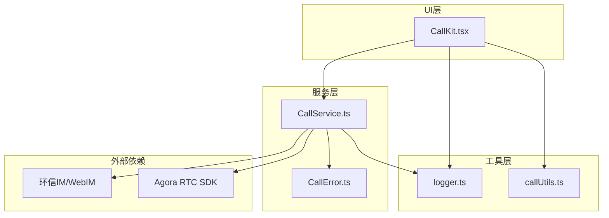
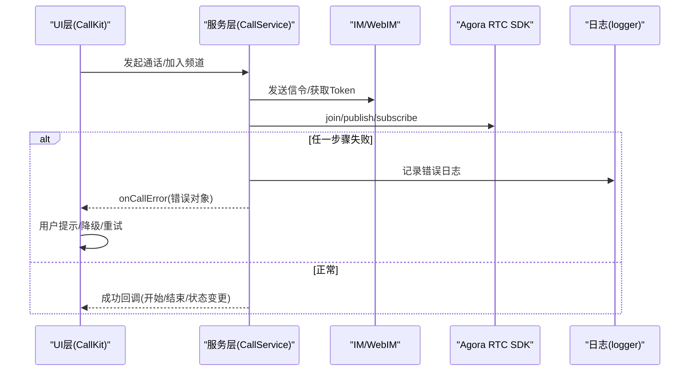
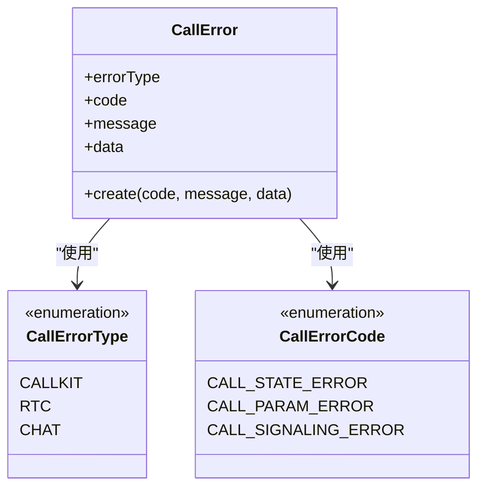
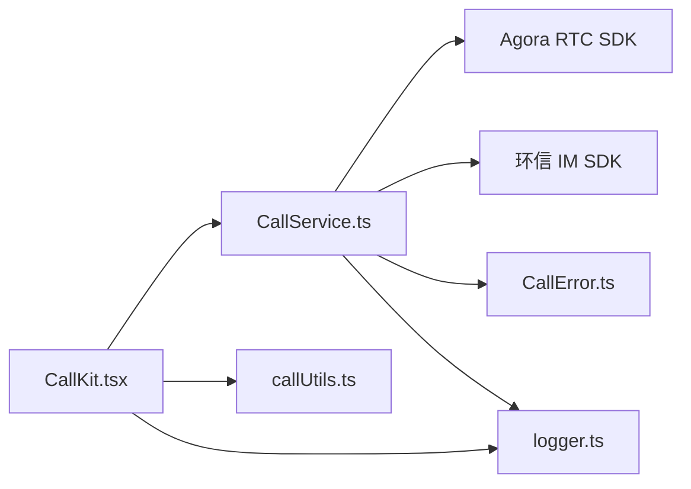

# 错误处理

<cite>
**本文引用的文件**
- [CallError.ts](file://callkit/services/CallError.ts)
- [CallService.ts](file://callkit/services/CallService.ts)
- [logger.ts](file://callkit/utils/logger.ts)
- [callUtils.ts](file://callkit/utils/callUtils.ts)
- [CallKit.tsx](file://callkit/CallKit.tsx)
- [index.ts](file://callkit/types/index.ts)
</cite>

## 目录
1. [简介](#简介)
2. [项目结构](#项目结构)
3. [核心组件](#核心组件)
4. [架构总览](#架构总览)
5. [详细组件分析](#详细组件分析)
6. [依赖关系分析](#依赖关系分析)
7. [性能考量](#性能考量)
8. [故障排查指南](#故障排查指南)
9. [结论](#结论)
10. [附录](#附录)

## 简介
本指南围绕 Easemob Vue3 Callkit 的错误处理与异常管理进行系统化梳理，覆盖网络异常、设备权限问题、RTC 连接失败等常见场景，提供错误分类、处理流程、用户提示策略、自动重试与降级方案，并结合 Logger 工具说明如何进行有效追踪与调试，最终实现优雅的错误恢复与用户体验保障。

## 项目结构
- 错误模型与分类：位于服务层，统一承载错误类型与错误码。
- 服务层：封装 IM 信令、RTC 加入/发布/订阅、设备与轨道管理、铃声播放等核心流程，并在关键节点抛出错误。
- 工具层：提供日志工具与通用工具函数，支撑错误追踪与辅助能力。
- UI 层：通过回调将错误传递至上层 UI，负责用户提示与交互。

图表来源
- [CallKit.tsx](file://callkit/CallKit.tsx#L1-L120)
- [CallService.ts](file://callkit/services/CallService.ts#L1-L120)
- [CallError.ts](file://callkit/services/CallError.ts#L1-L42)
- [logger.ts](file://callkit/utils/logger.ts#L1-L60)

章节来源
- [CallKit.tsx](file://callkit/CallKit.tsx#L1-L120)
- [CallService.ts](file://callkit/services/CallService.ts#L1-L120)
- [CallError.ts](file://callkit/services/CallError.ts#L1-L42)
- [logger.ts](file://callkit/utils/logger.ts#L1-L60)

## 核心组件
- 错误模型与分类
  - 错误类型：CALLKIT、RTC、CHAT，分别对应业务层、RTC 层、IM 层错误。
  - 错误码：通话状态错误、通话参数错误、信令错误等。
- 日志工具
  - 提供多级别日志输出、前缀、开关控制、动态配置更新等能力，便于定位问题。
- 服务层错误处理
  - 在关键流程（加入频道、发布轨道、订阅流、设备切换、挂断清理）中捕获异常并上报错误。
  - 通过回调 onCallError 将错误传递至上层 UI，以便统一提示与降级。

章节来源
- [CallError.ts](file://callkit/services/CallError.ts#L1-L42)
- [logger.ts](file://callkit/utils/logger.ts#L1-L181)
- [CallService.ts](file://callkit/services/CallService.ts#L290-L310)

## 架构总览
错误处理贯穿 UI、服务与外部 SDK 三层，形成“捕获-上报-降级-恢复”的闭环。

图表来源
- [CallService.ts](file://callkit/services/CallService.ts#L806-L874)
- [CallService.ts](file://callkit/services/CallService.ts#L970-L983)
- [CallService.ts](file://callkit/services/CallService.ts#L1360-L1683)
- [logger.ts](file://callkit/utils/logger.ts#L104-L142)
- [CallKit.tsx](file://callkit/CallKit.tsx#L685-L727)

## 详细组件分析

### 错误模型与分类
- 错误类型
  - CALLKIT：业务层错误（如状态不符、参数非法）。
  - RTC：Agora SDK 错误（如加入失败、发布失败、订阅失败）。
  - CHAT：IM 层错误（如发送消息失败、获取 Token 失败）。
- 错误码
  - 通话状态错误、通话参数错误、信令错误等。
- 错误对象
  - 统一承载错误类型、错误码、消息与附加数据，便于 UI 侧做差异化提示与埋点。

图表来源
- [CallError.ts](file://callkit/services/CallError.ts#L12-L42)

章节来源
- [CallError.ts](file://callkit/services/CallError.ts#L1-L42)

### 日志工具与追踪
- 日志级别：ERROR/WARN/INFO/DEBUG/VERBOSE，支持动态调整。
- 输出控制：可启用/禁用控制台输出、设置前缀、动态更新配置。
- 使用建议
  - 在关键流程前后记录 DEBUG/VERBOSE，定位异常时提升到 ERROR/WARN。
  - UI 层通过 props 控制日志级别与前缀，便于集成到产品日志体系。

章节来源
- [logger.ts](file://callkit/utils/logger.ts#L1-L181)
- [CallKit.tsx](file://callkit/CallKit.tsx#L199-L216)

### 服务层错误捕获与上报
- 关键流程与错误捕获
  - 获取 Token：失败时通过 onCallError 上报 CHAT 错误。
  - 加入频道：失败时上报 RTC 错误并触发异常结束。
  - 发布轨道：失败时上报 RTC 错误并触发异常结束。
  - 订阅流：失败时上报 RTC 错误并清理轨道。
  - 设备切换：失败时上报 RTC 错误并回滚状态。
  - 挂断清理：确保轨道与监听器清理完毕，避免资源泄漏。
- 错误上报
  - 通过 onCallError 回调将 CallError 传递至上层 UI。
  - UI 层统一展示用户友好提示，必要时触发自动重试或降级。

章节来源
- [CallService.ts](file://callkit/services/CallService.ts#L290-L310)
- [CallService.ts](file://callkit/services/CallService.ts#L846-L873)
- [CallService.ts](file://callkit/services/CallService.ts#L970-L983)
- [CallService.ts](file://callkit/services/CallService.ts#L1026-L1037)
- [CallService.ts](file://callkit/services/CallService.ts#L1360-L1683)

### UI 层错误边界与提示
- 错误边界
  - UI 通过 onCallError 接收错误，作为错误边界的统一出口。
  - 在邀请、接听、通话中等关键状态变化时，结合日志与错误对象进行用户提示。
- 用户提示策略
  - 优先使用明确的文案与动作按钮（如重试、取消、稍后）。
  - 对于网络/权限类错误，提供引导性提示与可行的操作建议。
- 降级与恢复
  - 网络异常：提示重试并自动重试一次，若失败则降级为纯音频或结束通话。
  - 设备权限：引导用户授权并刷新页面，必要时降级为音频通话。
  - RTC 失败：提示“网络不稳定”并建议稍后再试，或切换网络。

章节来源
- [CallKit.tsx](file://callkit/CallKit.tsx#L685-L727)
- [CallKit.tsx](file://callkit/CallKit.tsx#L199-L216)
- [index.ts](file://callkit/types/index.ts#L295-L306)

### 自动重试与降级策略
- 自动重试
  - 邀请超时：30 秒未响应自动挂断，避免资源占用。
  - 加入频道/发布轨道失败：记录错误并触发异常结束，UI 可按策略重试。
- 降级策略
  - 多人通话中单人拒绝：仅移除该用户，不中断通话。
  - 设备权限不足：降级为音频通话或提示用户授权。
  - 轨道异常：清理并重建轨道，失败则回退到无视频状态。

章节来源
- [CallService.ts](file://callkit/services/CallService.ts#L657-L661)
- [CallService.ts](file://callkit/services/CallService.ts#L876-L906)
- [CallService.ts](file://callkit/services/CallService.ts#L2432-L2445)
- [CallService.ts](file://callkit/services/CallService.ts#L2546-L2564)

### 设备权限与轨道管理
- 摄像头/麦克风切换
  - 预览模式与通话模式分别处理，避免状态不一致。
  - 失败时回滚状态并上报 RTC 错误。
- 轨道生命周期
  - 创建、启用、发布、取消发布、关闭、清理缓存，确保资源释放。
  - 针对安卓设备增加等待与重试策略，提升稳定性。

章节来源
- [CallService.ts](file://callkit/services/CallService.ts#L2734-L3035)
- [CallService.ts](file://callkit/services/CallService.ts#L3037-L3127)
- [CallService.ts](file://callkit/services/CallService.ts#L1458-L1520)

### 信令与网络质量监控
- 信令处理
  - 邀请、响铃、确认、应答、取消、离开等消息的处理与错误上报。
- 网络质量
  - 监听网络质量事件，更新 UI 并触发相应提示（如弱网降分辨率）。

章节来源
- [CallService.ts](file://callkit/services/CallService.ts#L2225-L2254)
- [CallService.ts](file://callkit/services/CallService.ts#L2335-L2366)
- [CallService.ts](file://callkit/services/CallService.ts#L2168-L2181)

## 依赖关系分析
- 组件耦合
  - CallService 依赖 Agora RTC SDK 与环信 IM SDK，通过回调与 UI 解耦。
  - CallError 与 logger 作为横切关注点，被各模块复用。
- 外部依赖
  - Agora RTC SDK：负责音视频通道与轨道管理。
  - 环信 IM SDK：负责信令通道与 Token 获取。

图表来源
- [CallService.ts](file://callkit/services/CallService.ts#L1-L120)
- [CallError.ts](file://callkit/services/CallError.ts#L1-L42)
- [logger.ts](file://callkit/utils/logger.ts#L1-L60)
- [CallKit.tsx](file://callkit/CallKit.tsx#L1-L120)
- [callUtils.ts](file://callkit/utils/callUtils.ts#L1-L85)

章节来源
- [CallService.ts](file://callkit/services/CallService.ts#L1-L120)
- [CallError.ts](file://callkit/services/CallError.ts#L1-L42)
- [logger.ts](file://callkit/utils/logger.ts#L1-L60)
- [CallKit.tsx](file://callkit/CallKit.tsx#L1-L120)
- [callUtils.ts](file://callkit/utils/callUtils.ts#L1-L85)

## 性能考量
- 日志级别控制：生产环境建议使用 ERROR/WARN，避免高频 DEBUG/VERBOSE 影响性能。
- 轨道与监听器清理：在挂断与异常结束时确保彻底清理，防止内存与资源泄漏。
- 重试策略：指数退避与最大次数限制，避免风暴式重试。
- UI 渲染：在设备切换与轨道状态变化时，尽量减少不必要的重渲染。

## 故障排查指南
- 常见问题定位步骤
  - 查看日志：确认错误级别与上下文，定位失败阶段。
  - 检查错误类型：区分 RTC/CHAT/CALLKIT，采取不同处理策略。
  - 设备权限：确认摄像头/麦克风授权状态，必要时引导用户授权。
  - 网络状况：查看网络质量事件与超时逻辑，评估网络波动。
- 常见场景与建议
  - 网络异常：提示“网络不稳定”，建议稍后重试或切换网络。
  - 设备权限问题：提示“请授予摄像头/麦克风权限”，并提供刷新页面操作。
  - RTC 连接失败：提示“加入房间失败”，自动重试一次，失败则降级为音频。
  - 信令异常：提示“对方无响应/拒接”，并清理邀请状态。

章节来源
- [logger.ts](file://callkit/utils/logger.ts#L104-L142)
- [CallService.ts](file://callkit/services/CallService.ts#L290-L310)
- [CallService.ts](file://callkit/services/CallService.ts#L846-L873)
- [CallService.ts](file://callkit/services/CallService.ts#L2432-L2445)

## 结论
本项目通过统一的错误模型、完善的日志工具与严谨的服务层错误处理，实现了对网络异常、设备权限、RTC 连接失败等常见问题的有效应对。配合 UI 层的错误边界与用户提示策略，能够实现自动重试、降级与优雅恢复，从而保障用户体验与系统稳定性。

## 附录
- 错误分类与处理流程（示意）
  - 状态错误：提示“当前状态不可用”，引导回到空闲状态。
  - 参数错误：提示“参数不合法”，修正后重试。
  - 信令错误：提示“信令异常”，稍后重试或联系支持。
  - RTC 错误：提示“网络不稳定/设备异常”，自动重试或降级。
  - CHAT 错误：提示“发送失败”，重试或切换网络。