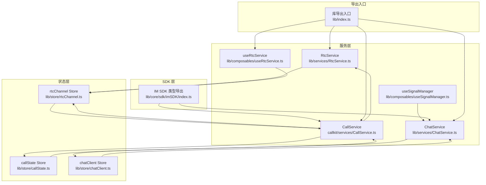
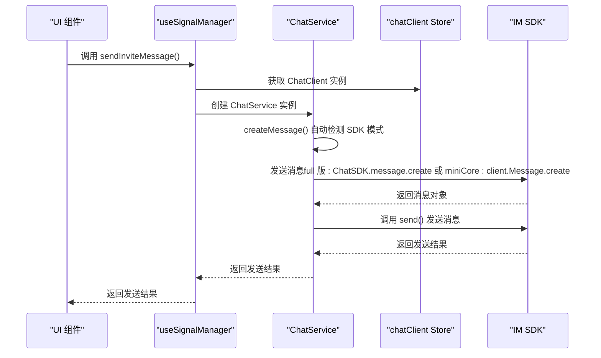
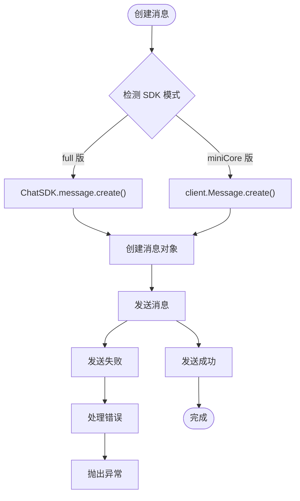
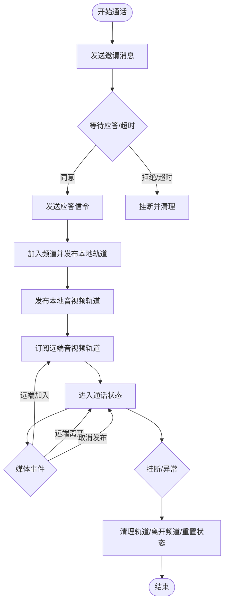
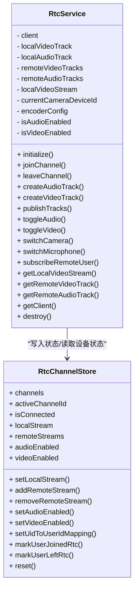
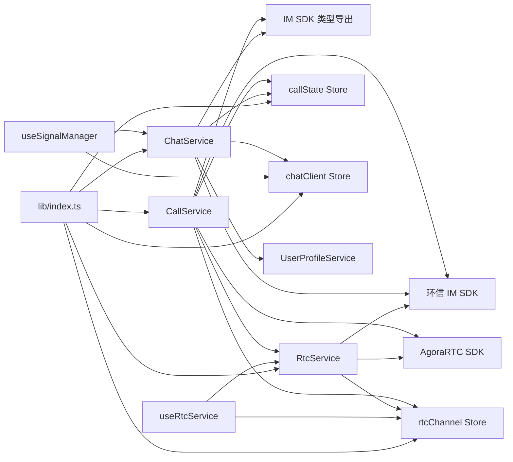

# 服务层

<cite>
**本文档引用的文件**
- [lib/services/RtcService.ts](file://lib/services/RtcService.ts)
- [lib/composables/useRtcService.ts](file://lib/composables/useRtcService.ts)
- [lib/store/rtcChannel.ts](file://lib/store/rtcChannel.ts)
- [lib/store/callState.ts](file://lib/store/callState.ts)
- [lib/core/sdk/imSDK/index.ts](file://lib/core/sdk/imSDK/index.ts)
- [lib/index.ts](file://lib/index.ts)
- [callkit/services/CallService.ts](file://callkit/services/CallService.ts)
- [callkit/services/CallError.ts](file://callkit/services/CallError.ts)
- [lib/services/ChatService.ts](file://lib/services/ChatService.ts)
- [lib/composables/useSignalManager.ts](file://lib/composables/useSignalManager.ts)
- [lib/store/chatClient.ts](file://lib/store/chatClient.ts)
- [lib/types/signal.types.ts](file://lib/types/signal.types.ts)
</cite>

## 目录
1. [简介](#简介)
2. [项目结构](#项目结构)
3. [核心组件](#核心组件)
4. [架构总览](#架构总览)
5. [详细组件分析](#详细组件分析)
6. [依赖关系分析](#依赖关系分析)
7. [性能考虑](#性能考虑)
8. [故障排查指南](#故障排查指南)
9. [结论](#结论)
10. [附录](#附录)

## 简介
本文件面向服务层，系统性阐述 CallService、RtcService 和 ChatService 的设计与实现，重点覆盖以下方面：
- 如何封装底层 SDK 调用（Agora RTC 与环信 IM），统一对外接口
- 业务逻辑封装与状态机管理（邀请、响铃、接听、通话中、挂断）
- 智能消息创建机制改进，包括自动检测 SDK 模式和增强的配置管理功能
- 与 Store 层的交互模式（Pinia Store 与组合式 API）
- 异步操作管理、错误处理与资源清理
- 初始化流程、配置项与扩展点
- 性能优化建议与多平台集成策略

## 项目结构
服务层位于 lib/services 与 callkit/services 两个目录中：
- lib/services：提供可复用的 RtcService、ChatService 与组合式 API useRtcService，配合 store 完成状态管理
- callkit/services：提供 CallService，封装完整的通话生命周期与 IM 信令交互

**图表来源**
- [lib/services/RtcService.ts:1-719](file://lib/services/RtcService.ts#L1-L719)
- [lib/composables/useRtcService.ts:1-192](file://lib/composables/useRtcService.ts#L1-L192)
- [lib/store/rtcChannel.ts:1-410](file://lib/store/rtcChannel.ts#L1-L410)
- [lib/store/callState.ts:1-263](file://lib/store/callState.ts#L1-L263)
- [lib/core/sdk/imSDK/index.ts:1-12](file://lib/core/sdk/imSDK/index.ts#L1-L12)
- [lib/index.ts:1-58](file://lib/index.ts#L1-L58)
- [callkit/services/CallService.ts:1-4478](file://callkit/services/CallService.ts#L1-L4478)
- [lib/services/ChatService.ts:1-358](file://lib/services/ChatService.ts#L1-L358)
- [lib/composables/useSignalManager.ts:1-365](file://lib/composables/useSignalManager.ts#L1-L365)
- [lib/store/chatClient.ts:1-28](file://lib/store/chatClient.ts#L1-L28)

**章节来源**
- [lib/index.ts:1-58](file://lib/index.ts#L1-L58)

## 核心组件
- RtcService：封装 Agora RTC 客户端、音视频轨道创建与发布、订阅、设备切换、网络质量与音量指示等能力，提供类型安全的 API 并与 rtcChannel Store 协作
- CallService：封装完整通话生命周期，包括邀请、响铃、接听、加入频道、发布/订阅、通话计时、挂断与资源清理，桥接 IM 信令与 RTC 能力
- ChatService：封装智能消息创建机制，支持自动检测 SDK 模式（full 版与 miniCore 版），提供统一的文本消息和信令消息发送接口
- useRtcService：组合式 API，暴露响应式状态与控制方法，简化 UI 层对 RtcService 的使用
- useSignalManager：信令管理器，集中处理所有通话信令的发送，提供统一的信令发送接口
- rtcChannel Store：集中管理 RTC 频道、本地/远程流、设备状态、UID/用户映射、通话计时等
- callState Store：集中管理通话状态、邀请信息、定时器与 UI 状态
- chatClient Store：管理聊天客户端实例和 SDK 模式检测状态
- IM SDK 类型导出：统一导出环信 SDK 类型，便于上层使用

**章节来源**
- [lib/services/RtcService.ts:1-719](file://lib/services/RtcService.ts#L1-L719)
- [callkit/services/CallService.ts:1-4478](file://callkit/services/CallService.ts#L1-L4478)
- [lib/services/ChatService.ts:1-358](file://lib/services/ChatService.ts#L1-L358)
- [lib/composables/useRtcService.ts:1-192](file://lib/composables/useRtcService.ts#L1-L192)
- [lib/composables/useSignalManager.ts:1-365](file://lib/composables/useSignalManager.ts#L1-L365)
- [lib/store/rtcChannel.ts:1-410](file://lib/store/rtcChannel.ts#L1-L410)
- [lib/store/callState.ts:1-263](file://lib/store/callState.ts#L1-L263)
- [lib/store/chatClient.ts:1-28](file://lib/store/chatClient.ts#L1-L28)
- [lib/core/sdk/imSDK/index.ts:1-12](file://lib/core/sdk/imSDK/index.ts#L1-L12)

## 架构总览
服务层采用"服务 + Store + 组合式 API"的分层设计：
- 服务层负责业务编排与底层 SDK 调用
- Store 层负责状态持久化与响应式共享
- 组合式 API 将 Store 状态与服务方法暴露给组件使用
- IM 与 RTC 分别由不同服务承载，通过统一的回调与事件进行协作
- ChatService 通过智能消息创建机制自动适配不同的 SDK 模式

**图表来源**
- [lib/composables/useSignalManager.ts:74-106](file://lib/composables/useSignalManager.ts#L74-L106)
- [lib/services/ChatService.ts:238-252](file://lib/services/ChatService.ts#L238-L252)
- [lib/store/chatClient.ts:22-26](file://lib/store/chatClient.ts#L22-L26)

## 详细组件分析

### ChatService 组件分析
ChatService 是服务层的重要组成部分，负责智能消息创建和信令管理。

- 智能消息创建机制
  - 自动检测 SDK 模式：优先尝试 ChatSDK.message.create（full 版），回退到 client.Message.create（miniCore 版）
  - 无需用户手动配置 isMiniCore 参数，自动适配不同 SDK 版本
  - 提供统一的消息创建接口，隐藏底层 SDK 差异

- 核心功能
  - 构建邀请消息扩展字段：包含通话 ID、设备信息、推送扩展、APNS 扩展等
  - 构建信令消息扩展字段：支持多种信令动作（alert、answerCall、cancelCall 等）
  - 发送文本消息：支持单聊和群聊，自动处理群组通话的定向消息
  - 发送信令消息：统一的信令发送接口，支持直投在线用户等功能

- 用户信息管理
  - 优先使用传入的用户信息参数
  - 从全局存储中获取缓存的用户信息
  - 通过用户信息提供者查询用户资料
  - 自动缓存用户信息到全局存储

- 群组信息管理
  - 支持群组通话场景下的群组信息扩展
  - 通过群组信息提供者查询群组资料
  - 自动处理群组名称和头像信息

**图表来源**
- [lib/services/ChatService.ts:238-252](file://lib/services/ChatService.ts#L238-L252)

**章节来源**
- [lib/services/ChatService.ts:1-358](file://lib/services/ChatService.ts#L1-L358)

### useSignalManager 组件分析
useSignalManager 是信令管理器，集中处理所有通话信令的发送。

- 主要职责
  - 封装信令发送逻辑，提供统一的信令发送接口
  - 自动获取最新的 ChatClient 实例，确保获取到登录后的实例
  - 根据 chatClient Store 中的 SDK 模式自动配置 ChatService

- 支持的信令类型
  - 发送通话邀请消息：支持单聊和群聊
  - 发送应答消息：支持接受、拒绝、忙碌等结果
  - 发送取消通话邀请的信令
  - 发送忙碌拒绝通话邀请的信令
  - 发送响铃提示信令
  - 发送确认响铃信令
  - 发送确认被叫方状态信令
  - 发送离开通话信令

- 错误处理
  - 统一的日志记录和错误处理
  - 捕获并重新抛出异常，保持调用链的清晰性

**章节来源**
- [lib/composables/useSignalManager.ts:1-365](file://lib/composables/useSignalManager.ts#L1-L365)

### CallService 组件分析
CallService 是服务层的核心，负责完整的通话生命周期与 IM 信令交互。

- 初始化与配置
  - 从 WebIM 连接获取用户与设备信息，创建 AgoraRTC 客户端并设置角色
  - 支持回调注入：通话开始/结束、邀请接收、远端媒体变化、网络质量、说话者检测、铃声回调、RTC 引擎创建等
  - 配置项包括：音量阈值、铃声资源与音量、是否使用 RTC Token、编码配置等

- 业务流程
  - 邀请发起：构建邀请消息，发送 IM 文本/命令消息，设置超时与状态
  - 响铃与接听：发送 alert/answer 信令，处理超时与拒绝
  - 加入频道：根据 useRTCToken 决定是否携带 token，处理连接中/已连接状态，发布本地轨道，订阅远端轨道
  - 通话中：音量指示、网络质量、远端用户加入/离开、媒体发布/取消发布
  - 挂断：清理轨道、取消发布、离开频道、发送 leave/cancel 信令、重置状态

- 资源管理与竞态处理
  - 预览模式与直接接听的摄像头状态差异处理
  - 正在创建的轨道引用（creatingVideoTrack/creatingAudioTrack）避免竞态
  - 通话结束后的彻底清理：unpublish、close、stop、移除监听器、重建客户端

**图表来源**
- [callkit/services/CallService.ts:345-527](file://callkit/services/CallService.ts#L345-L527)
- [callkit/services/CallService.ts:806-1358](file://callkit/services/CallService.ts#L806-L1358)
- [callkit/services/CallService.ts:1360-1683](file://callkit/services/CallService.ts#L1360-L1683)

**章节来源**
- [callkit/services/CallService.ts:1-4478](file://callkit/services/CallService.ts#L1-L4478)
- [callkit/services/CallError.ts:1-43](file://callkit/services/CallError.ts#L1-L43)

### RtcService 组件分析
RtcService 聚焦于 RTC 能力的封装与设备管理。

- 核心职责
  - 初始化 AgoraRTC 客户端，注册事件监听
  - 本地音视频轨道创建与发布，支持动态更新编码配置
  - 设备切换：摄像头与麦克风设备选择
  - 远端用户订阅与轨道管理，音量指示与网络质量事件
  - 生命周期管理：leaveChannel、destroy，彻底清理轨道与监听器

- 与 Store 的协作
  - 通过 rtcChannel Store 维护本地/远程流、设备状态、UID/用户映射、通话计时
  - 在用户加入/离开、发布/取消发布等事件中更新 Store 状态

**图表来源**
- [lib/services/RtcService.ts:42-719](file://lib/services/RtcService.ts#L42-L719)
- [lib/store/rtcChannel.ts:7-410](file://lib/store/rtcChannel.ts#L7-L410)

**章节来源**
- [lib/services/RtcService.ts:1-719](file://lib/services/RtcService.ts#L1-L719)
- [lib/store/rtcChannel.ts:1-410](file://lib/store/rtcChannel.ts#L1-L410)

### 组合式 API useRtcService
useRtcService 将 rtcChannel Store 的响应式状态与 RtcService 的方法暴露给组件使用，提供简洁的 API。

- 主要能力
  - 响应式状态：localStream、remoteStreams、isVideoEnabled、isAudioEnabled、isConnected、activeChannel
  - 控制方法：toggleVideo/toggleAudio、switchCamera/switchMicrophone
  - 流管理：getLocalStream/getRemoteStream、addRemoteStream/removeRemoteStream、setLocalStream
  - 其他：reset

**章节来源**
- [lib/composables/useRtcService.ts:1-192](file://lib/composables/useRtcService.ts#L1-L192)

### Store 层交互模式
- rtcChannel Store
  - 管理频道、参与者、本地/远程流、设备状态、UID/用户映射、通话计时
  - 提供 initializeRtcService/destroyRtcService 生命周期方法
- callState Store
  - 管理通话状态、邀请信息、定时器、用户信息映射、窗口模式
  - 提供 initInviteInfo/buildAndUpdateInviteState 等邀请构建方法
- chatClient Store
  - 管理聊天客户端实例和 SDK 模式检测状态
  - 提供 getChatClient、getClientDeviceId、getIsMiniCore 等访问器

**章节来源**
- [lib/store/rtcChannel.ts:1-410](file://lib/store/rtcChannel.ts#L1-L410)
- [lib/store/callState.ts:1-263](file://lib/store/callState.ts#L1-L263)
- [lib/store/chatClient.ts:1-28](file://lib/store/chatClient.ts#L1-L28)

## 依赖关系分析
- CallService 依赖 AgoraRTC SDK、环信 IM SDK、IM SDK 类型导出、RtcService（间接）、rtcChannel Store、callState Store
- ChatService 依赖环信 IM SDK、IM SDK 类型导出、chatClient Store、callState Store、UserProfileService
- RtcService 依赖 AgoraRTC SDK、rtcChannel Store、IM SDK（用于 UID/用户映射）
- useRtcService 依赖 rtcChannel Store 与 RtcService
- useSignalManager 依赖 chatClient Store、ChatService
- 导出入口 lib/index.ts 暴露 RtcService、CallService、ChatService、Store 与组合式 API

**图表来源**
- [callkit/services/CallService.ts:1-12](file://callkit/services/CallService.ts#L1-L12)
- [lib/core/sdk/imSDK/index.ts:1-12](file://lib/core/sdk/imSDK/index.ts#L1-L12)
- [lib/index.ts:16-31](file://lib/index.ts#L16-L31)

**章节来源**
- [lib/index.ts:1-58](file://lib/index.ts#L1-L58)

## 性能考虑
- 轨道生命周期管理
  - 避免重复创建本地轨道，及时 unpublish/close，防止资源泄漏
  - 在禁用摄像头时彻底停止底层 MediaStreamTrack，释放硬件资源
- 连接状态与重连
  - join 前检查客户端连接状态，避免重复 join；连接中时等待 CONNECTED
  - 异常时重建客户端，确保后续流程稳定
- 事件驱动与批量更新
  - 使用 Agora 事件驱动订阅/取消订阅，减少轮询
  - 批量更新 Store 状态，降低 UI 重绘频率
- 音量指示与网络质量
  - 多人通话启用音量指示，合理设置阈值，避免频繁回调
  - 网络质量事件合并处理，减少 UI 更新次数
- 铃声与 UI 渲染
  - 铃声播放时机与资源释放需与状态机严格对齐，避免阻塞主线程
  - 预览与通话阶段的 UI 切换延迟，确保 DOM 渲染完成
- 智能消息创建优化
  - 自动检测 SDK 模式避免重复判断，提升消息创建效率
  - 缓存用户信息减少重复查询，提升群组通话体验

## 故障排查指南
- 常见错误类型
  - 通话状态错误：已在通话中再次发起邀请
  - 信令错误：动作类型不匹配或消息缺失
  - RTC 错误：加入频道失败、发布/订阅异常
  - IM 错误：发送消息失败、UID 映射失败
  - SDK 模式错误：无法创建消息，缺少 message.create API
- 定位与处理
  - 使用 CallError 枚举区分错误类型与代码，结合日志定位
  - 在 CallService 中捕获 Agora/IM 异常，触发 onCallError 回调
  - ChatService 中的 createMessage 方法会抛出详细的 SDK 模式错误信息
  - 挂断流程中优先 unpublish，再 close，最后移除监听器，确保资源回收
- 建议
  - 在关键路径增加 try/catch 与 finally，保证清理逻辑执行
  - 对快速挂断场景增加二次检查与延时清理，避免残留轨道
  - 确保正确初始化 chatClient Store，避免 SDK 模式检测失败

**章节来源**
- [callkit/services/CallError.ts:1-43](file://callkit/services/CallError.ts#L1-L43)
- [callkit/services/CallService.ts:1360-1683](file://callkit/services/CallService.ts#L1360-L1683)
- [lib/services/ChatService.ts:248-251](file://lib/services/ChatService.ts#L248-L251)

## 结论
服务层通过 CallService、RtcService 和 ChatService 的协同，实现了从 IM 信令到 RTC 音视频的完整闭环。其中 ChatService 的智能消息创建机制显著提升了 SDK 兼容性和开发体验，自动检测 SDK 模式避免了手动配置的复杂性。借助 Store 层的状态管理与组合式 API，UI 层可以以声明式方式消费状态与行为。整体设计具备良好的扩展性与可维护性，适合在多平台与复杂业务场景中演进。

## 附录

### 初始化流程与配置项
- 初始化流程
  - RtcService.initialize：创建 AgoraRTC 客户端并注册事件
  - rtcChannel Store.initializeRtcService：注入 Agora AppId 与 IM 客户端，创建 RtcService 实例
  - ChatService 构造：自动检测 SDK 模式，无需手动配置 isMiniCore
  - CallService 构造：注入 IM 连接与回调，创建 AgoraRTC 客户端，初始化铃声与配置
- 配置项示例（节选）
  - 音量阈值、铃声资源与循环播放、是否使用 RTC Token、编码配置
  - 回调：通话开始/结束、邀请接收、远端媒体变化、网络质量、说话者检测、RTC 引擎创建等
  - SDK 模式：自动检测 full 版与 miniCore 版，无需用户配置

**章节来源**
- [lib/services/RtcService.ts:67-96](file://lib/services/RtcService.ts#L67-L96)
- [lib/store/rtcChannel.ts:84-109](file://lib/store/rtcChannel.ts#L84-L109)
- [lib/services/ChatService.ts:24-27](file://lib/services/ChatService.ts#L24-L27)
- [callkit/services/CallService.ts:221-285](file://callkit/services/CallService.ts#L221-L285)

### 服务使用最佳实践
- 优先使用组合式 API useRtcService 管理设备与流，避免直接操作底层轨道
- 在组件卸载时调用 reset 或 destroy，确保资源回收
- 对多人通话场景，关注 UID/用户映射与 leftUsers 列表，避免 UI 状态错乱
- 对异常挂断与快速挂断场景，增加延时清理与二次检查
- 使用 useSignalManager 统一封装信令发送，自动处理 SDK 模式检测
- 在群组通话场景下，合理使用 receiverList 参数实现定向消息发送
- 通过 UserProfileService 提供用户信息查询能力，提升用户体验