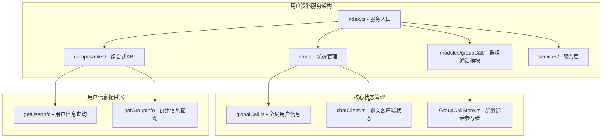
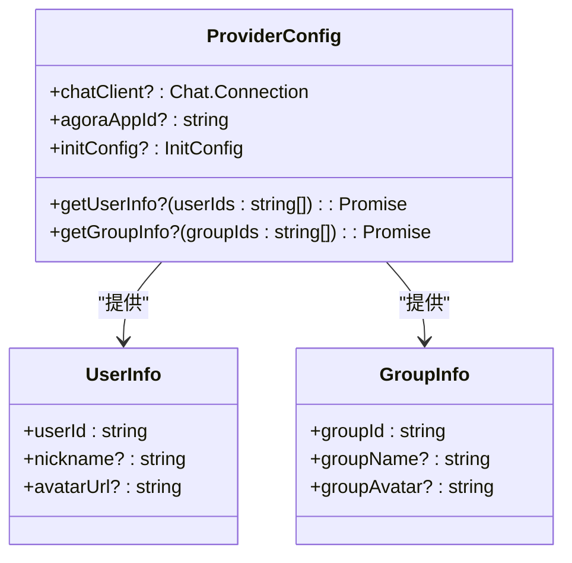
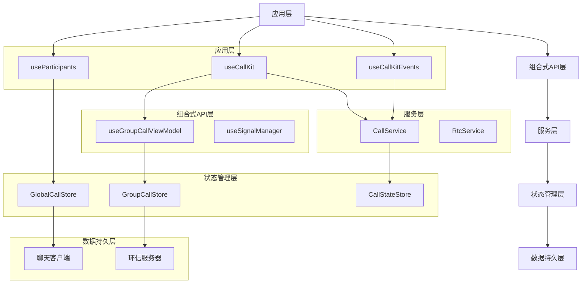
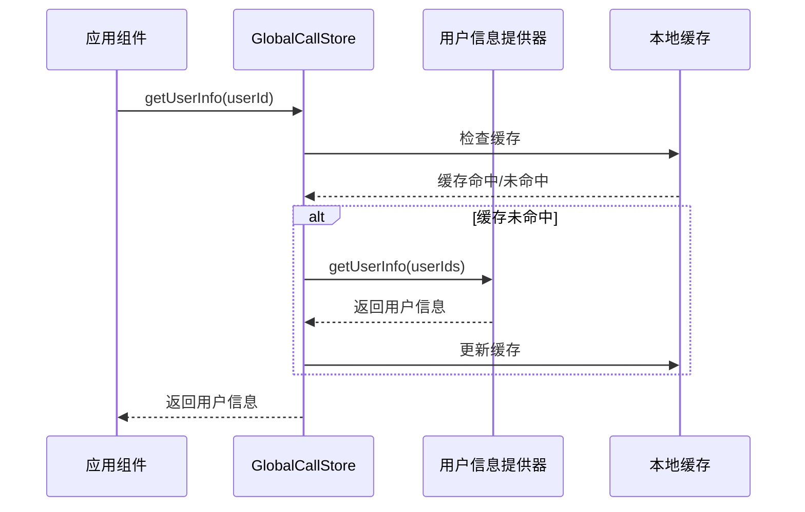
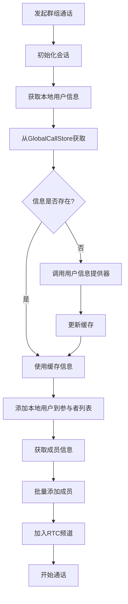
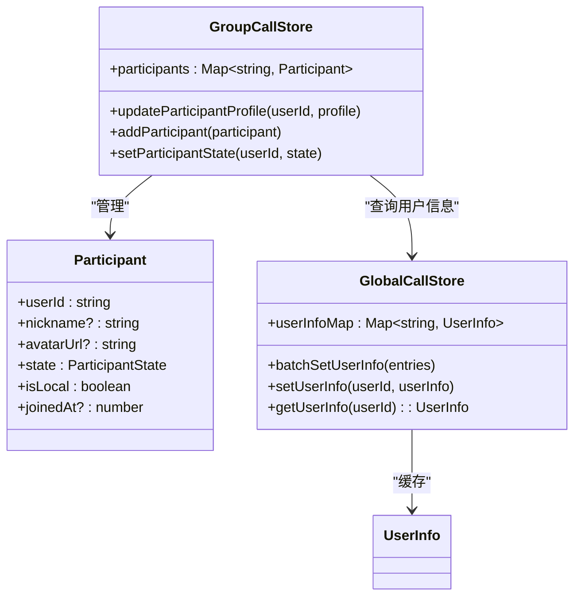
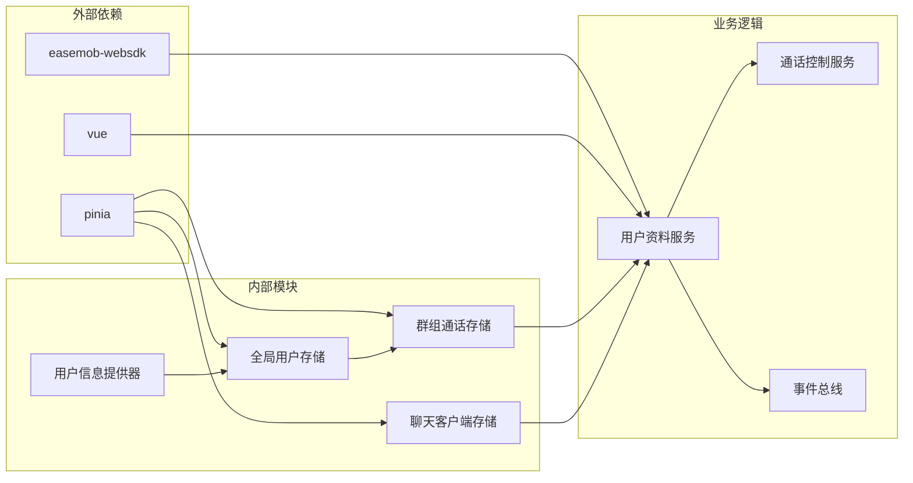

# 用户资料服务

<cite>
**本文档引用的文件**
- [index.ts](file://lib/index.ts)
- [useCallKit.ts](file://lib/composables/useCallKit.ts)
- [useCallKitEvents.ts](file://lib/composables/useCallKitEvents.ts)
- [useParticipants.ts](file://lib/composables/useParticipants.ts)
- [types.ts](file://lib/types.ts)
- [globalCall.ts](file://lib/store/globalCall.ts)
- [chatClient.ts](file://lib/store/chatClient.ts)
- [GroupCallStore.ts](file://lib/modules/groupCall/viewModel/GroupCallStore.ts)
- [useGroupCallViewModel.ts](file://lib/modules/groupCall/viewModel/useGroupCallViewModel.ts)
- [CallService.ts](file://lib/services/CallService.ts)
</cite>

## 目录
1. [简介](#简介)
2. [项目结构](#项目结构)
3. [核心组件](#核心组件)
4. [架构概览](#架构概览)
5. [详细组件分析](#详细组件分析)
6. [依赖关系分析](#依赖关系分析)
7. [性能考虑](#性能考虑)
8. [故障排除指南](#故障排除指南)
9. [结论](#结论)

## 简介

用户资料服务是Easemob CallKit Vue3项目中的关键组件，负责管理通话过程中的用户信息展示和更新。该服务通过统一的用户信息提供器接口，为单人通话和群组通话场景提供用户昵称、头像等基本信息，并支持实时更新和批量处理。

该服务采用模块化设计，结合Pinia状态管理和Vue组合式API，实现了高效的用户信息缓存和同步机制。通过全局用户信息存储和局部参与者信息管理，确保了在复杂通话场景下的用户体验一致性。

## 项目结构

用户资料服务主要分布在以下目录结构中：

**图表来源**
- [index.ts:1-90](file://lib/index.ts#L1-L90)
- [globalCall.ts:1-56](file://lib/store/globalCall.ts#L1-L56)
- [GroupCallStore.ts:1-252](file://lib/modules/groupCall/viewModel/GroupCallStore.ts#L1-L252)

**章节来源**
- [index.ts:1-90](file://lib/index.ts#L1-L90)
- [types.ts:38-63](file://lib/types.ts#L38-L63)

## 核心组件

### 用户信息提供器接口

用户资料服务的核心是`ProviderConfig`接口，定义了用户信息查询的标准化方法：

**图表来源**
- [types.ts:38-63](file://lib/types.ts#L38-L63)

### 全局用户信息存储

`GlobalCallStore`提供了跨通话域的用户信息缓存机制：

| 属性 | 类型 | 描述 | 默认值 |
|------|------|------|--------|
| userInfoMap | Map<string, UserInfo> | 用户信息映射表 | new Map() |
| isMinimized | boolean | 窗口最小化状态 | false |

**章节来源**
- [globalCall.ts:8-56](file://lib/store/globalCall.ts#L8-L56)

## 架构概览

用户资料服务的整体架构采用分层设计，从上到下分别为：

**图表来源**
- [useCallKit.ts:14-235](file://lib/composables/useCallKit.ts#L14-L235)
- [useGroupCallViewModel.ts:52-299](file://lib/modules/groupCall/viewModel/useGroupCallViewModel.ts#L52-L299)
- [CallService.ts:12-397](file://lib/services/CallService.ts#L12-L397)

## 详细组件分析

### 用户信息查询流程

用户信息查询是用户资料服务的核心功能，通过以下流程实现：

**图表来源**
- [globalCall.ts:42-49](file://lib/store/globalCall.ts#L42-L49)
- [types.ts:50-55](file://lib/types.ts#L50-L55)

### 群组通话用户信息管理

群组通话场景下的用户信息管理更加复杂，涉及多个参与者的实时状态更新：

**图表来源**
- [useCallKit.ts:89-133](file://lib/composables/useCallKit.ts#L89-L133)
- [useGroupCallViewModel.ts:230-240](file://lib/modules/groupCall/viewModel/useGroupCallViewModel.ts#L230-L240)

**章节来源**
- [useCallKit.ts:89-133](file://lib/composables/useCallKit.ts#L89-L133)
- [useGroupCallViewModel.ts:230-240](file://lib/modules/groupCall/viewModel/useGroupCallViewModel.ts#L230-L240)

### 用户信息更新机制

用户信息的更新采用响应式设计，确保UI能够实时反映最新的用户状态：

**图表来源**
- [GroupCallStore.ts:198-221](file://lib/modules/groupCall/viewModel/GroupCallStore.ts#L198-L221)
- [globalCall.ts:14-34](file://lib/store/globalCall.ts#L14-L34)

**章节来源**
- [GroupCallStore.ts:198-221](file://lib/modules/groupCall/viewModel/GroupCallStore.ts#L198-L221)
- [globalCall.ts:14-34](file://lib/store/globalCall.ts#L14-L34)

## 依赖关系分析

用户资料服务的依赖关系呈现清晰的层次结构：

**图表来源**
- [package.json:47-51](file://package.json#L47-L51)
- [index.ts:1-90](file://lib/index.ts#L1-L90)

**章节来源**
- [package.json:47-51](file://package.json#L47-L51)
- [index.ts:1-90](file://lib/index.ts#L1-L90)

## 性能考虑

用户资料服务在设计时充分考虑了性能优化：

### 缓存策略
- **本地缓存**：使用Map结构存储用户信息，提供O(1)的查询性能
- **批量处理**：支持批量设置用户信息，减少重复查询
- **响应式更新**：利用Vue的响应式系统，只更新发生变化的数据

### 内存管理
- **弱引用模式**：用户信息以弱引用形式存储，避免内存泄漏
- **及时清理**：通话结束后自动清理相关用户信息缓存
- **状态重置**：提供完整的状态重置机制

### 网络优化
- **去重请求**：避免对同一用户的重复信息查询
- **超时处理**：合理的网络请求超时机制
- **降级策略**：在网络异常时提供基础用户信息显示

## 故障排除指南

### 常见问题及解决方案

| 问题类型 | 症状描述 | 可能原因 | 解决方案 |
|----------|----------|----------|----------|
| 用户信息缺失 | 显示用户ID而非昵称 | 用户信息提供器未正确配置 | 检查ProviderConfig配置 |
| 头像加载失败 | 显示默认头像 | avatarURL格式不正确 | 验证头像URL有效性 |
| 缓存不同步 | 显示过期用户信息 | 缓存未及时更新 | 调用batchSetUserInfo批量更新 |
| 性能问题 | UI渲染卡顿 | 信息频繁更新导致重渲染 | 优化更新频率，使用防抖 |

### 调试建议

1. **启用调试模式**：通过ProviderConfig中的debug选项启用详细日志
2. **监控缓存状态**：定期检查userInfoMap的内容和大小
3. **验证网络请求**：确认用户信息提供器的网络请求正常
4. **检查事件监听**：确保用户信息变更事件正确触发

**章节来源**
- [types.ts:5-19](file://lib/types.ts#L5-L19)
- [globalCall.ts:14-34](file://lib/store/globalCall.ts#L14-L34)

## 结论

用户资料服务作为Easemob CallKit Vue3项目的重要组成部分，通过模块化的设计和高效的缓存机制，为复杂的通话场景提供了可靠的用户信息管理能力。该服务不仅支持单人通话的基础需求，还能满足群组通话的复杂场景，包括实时用户状态更新、批量信息处理和性能优化。

通过标准化的用户信息提供器接口，开发者可以轻松集成自定义的用户信息源，同时保持系统的可扩展性和可维护性。响应式的设计确保了UI能够实时反映用户状态的变化，提升了整体的用户体验。

未来的发展方向包括进一步优化缓存策略、增强离线支持能力，以及提供更丰富的用户信息定制选项，以适应更多样化的应用场景。