# 用户资料服务

<cite>
**本文档引用的文件**
- [UserProfileService.ts](file://lib/services/UserProfileService.ts)
- [globalCall.ts](file://lib/store/globalCall.ts)
- [ChatService.ts](file://lib/services/ChatService.ts)
- [useCallKit.ts](file://lib/composables/useCallKit.ts)
- [GroupCallStore.ts](file://lib/modules/groupCall/viewModel/GroupCallStore.ts)
- [types.ts](file://lib/types.ts)
- [EasemobChatCallKitProvider.vue](file://lib/components/EasemobChatCallKitProvider.vue)
- [EasemobChatGroupMemberList.vue](file://lib/components/multiCall/EasemobChatGroupMemberList.vue)
- [CallService.ts](file://lib/services/CallService.ts)
- [index.ts](file://lib/index.ts)
- [package.json](file://package.json)
- [README.md](file://README.md)
- [USAGE.md](file://USAGE.md)
</cite>

## 更新摘要
**所做更改**
- 新增 userInfo 参数主动传递用户资料功能章节，详细介绍主动传递机制
- 更新用户信息查询流程，包含 userInfo 参数优先级处理
- 新增自动用户资料解析功能分析，说明自动解析的工作原理
- 更新性能考虑章节，增加 userInfo 参数处理的性能优势
- 新增故障排除指南，包含 userInfo 参数相关问题诊断

## 目录
1. [简介](#简介)
2. [项目结构](#项目结构)
3. [核心组件](#核心组件)
4. [架构概览](#架构概览)
5. [详细组件分析](#详细组件分析)
6. [智能缓存机制](#智能缓存机制)
7. [userInfo 参数主动传递机制](#userinfo-参数主动传递机制)
8. [自动用户资料解析功能](#自动用户资料解析功能)
9. [依赖关系分析](#依赖关系分析)
10. [性能考虑](#性能考虑)
11. [故障排除指南](#故障排除指南)
12. [结论](#结论)

## 简介

用户资料服务是Easemob CallKit Vue3项目中的关键组件，负责管理通话过程中的用户信息展示和更新。该服务通过统一的用户信息提供器接口，为单人通话和群组通话场景提供用户昵称、头像等基本信息，并支持实时更新和批量处理。

**更新** 本版本引入了 userInfo 参数主动传递机制和自动用户资料解析功能，显著增强了用户信息管理的灵活性和效率。用户现在可以直接通过 userInfo 参数主动传递用户资料，同时系统会在必要时自动解析用户信息，确保在各种场景下都能提供准确的用户展示信息。

该服务采用模块化设计，结合Pinia状态管理和Vue组合式API，实现了高效的用户信息缓存和同步机制。通过全局用户信息存储和局部参与者信息管理，确保了在复杂通话场景下的用户体验一致性。

## 项目结构

用户资料服务主要分布在以下目录结构中：

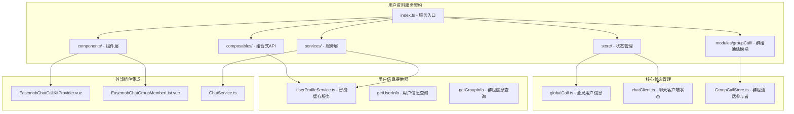

**图表来源**
- [index.ts:1-90](file://lib/index.ts#L1-L90)
- [globalCall.ts:1-56](file://lib/store/globalCall.ts#L1-L56)
- [UserProfileService.ts:1-137](file://lib/services/UserProfileService.ts#L1-L137)
- [EasemobChatCallKitProvider.vue:1-50](file://lib/components/EasemobChatCallKitProvider.vue#L1-L50)

**章节来源**
- [index.ts:1-90](file://lib/index.ts#L1-L90)
- [types.ts:38-63](file://lib/types.ts#L38-L63)

## 核心组件

### 用户信息提供器接口

用户资料服务的核心是`ProviderConfig`接口，定义了用户信息查询的标准化方法：

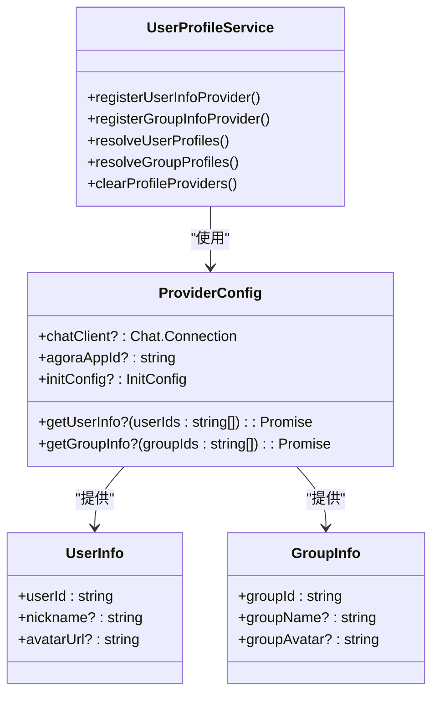

**图表来源**
- [types.ts:38-63](file://lib/types.ts#L38-L63)
- [UserProfileService.ts:15-42](file://lib/services/UserProfileService.ts#L15-L42)

### 全局用户信息存储

`GlobalCallStore`提供了跨通话域的用户信息缓存机制：

| 属性 | 类型 | 描述 | 默认值 |
|------|------|------|--------|
| userInfoMap | Map<string, UserInfo> | 用户信息映射表 | new Map() |
| isMinimized | boolean | 窗口最小化状态 | false |

**章节来源**
- [globalCall.ts:8-56](file://lib/store/globalCall.ts#L8-L56)

## 架构概览

用户资料服务的整体架构采用分层设计，从上到下分别为：

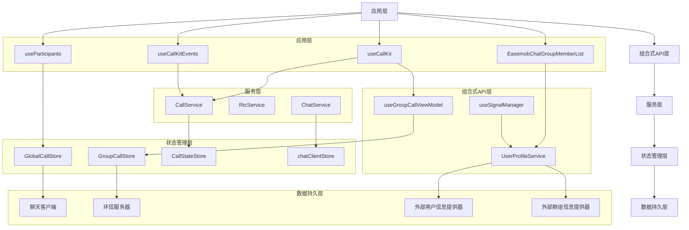

**图表来源**
- [useCallKit.ts:14-235](file://lib/composables/useCallKit.ts#L14-L235)
- [useGroupCallViewModel.ts:52-299](file://lib/modules/groupCall/viewModel/useGroupCallViewModel.ts#L52-L299)
- [CallService.ts:12-397](file://lib/services/CallService.ts#L12-L397)
- [UserProfileService.ts:49-129](file://lib/services/UserProfileService.ts#L49-L129)

## 详细组件分析

### 用户信息查询流程

用户信息查询是用户资料服务的核心功能，通过以下流程实现：

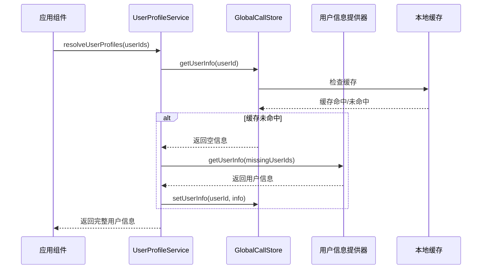

**图表来源**
- [UserProfileService.ts:49-110](file://lib/services/UserProfileService.ts#L49-L110)
- [globalCall.ts:42-49](file://lib/store/globalCall.ts#L42-L49)

### 群组通话用户信息管理

群组通话场景下的用户信息管理更加复杂，涉及多个参与者的实时状态更新：

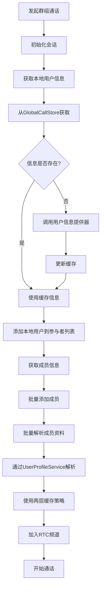

**图表来源**
- [useCallKit.ts:89-133](file://lib/composables/useCallKit.ts#L89-L133)
- [useGroupCallViewModel.ts:230-240](file://lib/modules/groupCall/viewModel/useGroupCallViewModel.ts#L230-L240)

**章节来源**
- [useCallKit.ts:89-133](file://lib/composables/useCallKit.ts#L89-L133)
- [useGroupCallViewModel.ts:230-240](file://lib/modules/groupCall/viewModel/useGroupCallViewModel.ts#L230-L240)

### 用户信息更新机制

用户信息的更新采用响应式设计，确保UI能够实时反映最新的用户状态：

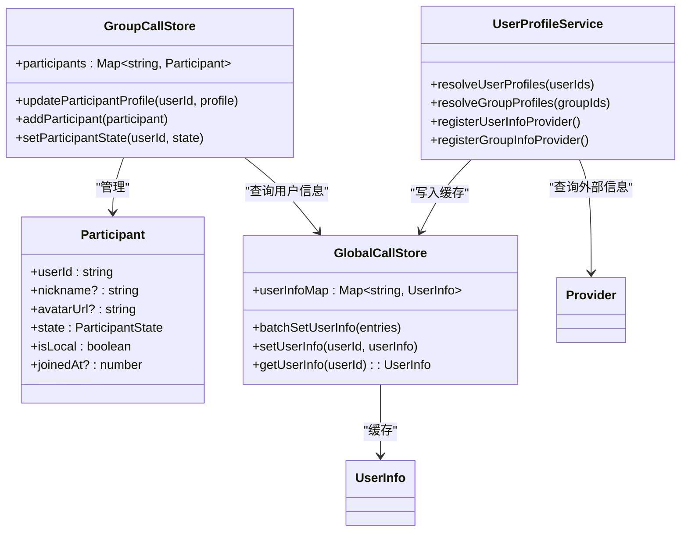

**图表来源**
- [GroupCallStore.ts:198-221](file://lib/modules/groupCall/viewModel/GroupCallStore.ts#L198-L221)
- [globalCall.ts:14-34](file://lib/store/globalCall.ts#L14-L34)
- [UserProfileService.ts:49-129](file://lib/services/UserProfileService.ts#L49-L129)

**章节来源**
- [GroupCallStore.ts:198-221](file://lib/modules/groupCall/viewModel/GroupCallStore.ts#L198-L221)
- [globalCall.ts:14-34](file://lib/store/globalCall.ts#L14-L34)

## 智能缓存机制

### 两层缓存策略

用户资料服务引入了智能缓存机制，采用两层缓存策略来优化性能：

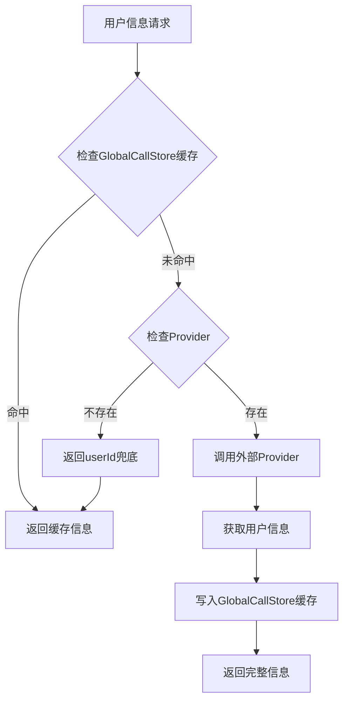

**图表来源**
- [UserProfileService.ts:49-110](file://lib/services/UserProfileService.ts#L49-L110)
- [globalCall.ts:14-34](file://lib/store/globalCall.ts#L14-L34)

### 批量解析优化

UserProfileService提供了高效的批量解析功能，支持一次性获取多个用户的信息：

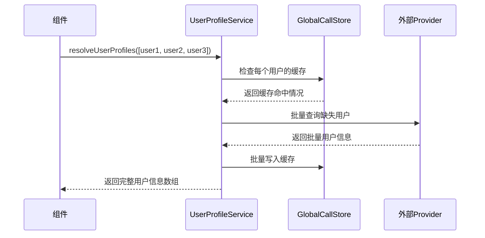

**图表来源**
- [UserProfileService.ts:49-110](file://lib/services/UserProfileService.ts#L49-L110)

### 缓存策略详解

智能缓存机制的核心特性：

1. **两层缓存架构**
   - 第一层：GlobalCallStore本地缓存（内存中，查询速度快）
   - 第二层：外部Provider缓存（数据库/服务器缓存）

2. **智能查询优化**
   - 批量查询用户信息，减少网络请求次数
   - 智能识别缓存命中情况，避免重复查询
   - 支持部分缓存命中，只查询缺失部分

3. **缓存更新机制**
   - 自动更新缓存中的用户信息
   - 支持批量设置用户信息
   - 提供缓存清理和重置功能

**章节来源**
- [UserProfileService.ts:49-110](file://lib/services/UserProfileService.ts#L49-L110)
- [globalCall.ts:25-34](file://lib/store/globalCall.ts#L25-L34)

## userInfo 参数主动传递机制

### 参数传递优先级

userInfo 参数提供了主动传递用户资料的能力，具有最高的优先级：

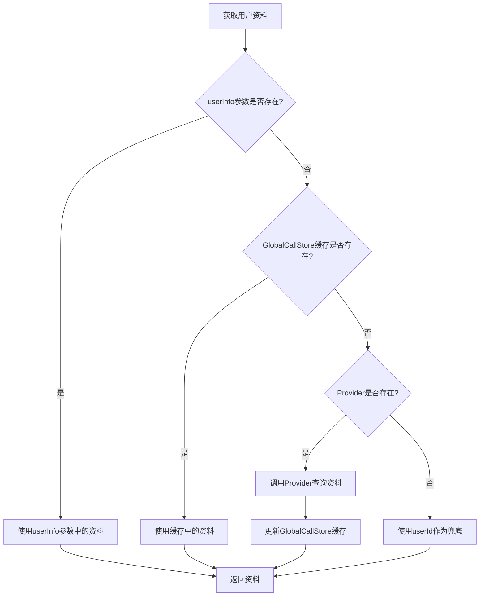

**图表来源**
- [ChatService.ts:64-101](file://lib/services/ChatService.ts#L64-101)
- [useCallKit.ts:22-43](file://lib/composables/useCallKit.ts#L22-43)

### 主动传递机制实现

userInfo 参数的实现机制确保了用户资料的准确性和及时性：

1. **参数优先级处理**
   - userInfo 参数优先级最高，直接覆盖其他来源
   - 支持部分字段传递，未传递的字段使用其他方式获取
   - 自动处理字段缺失的情况

2. **缓存策略**
   - 成功获取的用户资料会自动缓存到 GlobalCallStore
   - 缓存的资料可用于后续的快速访问
   - 支持批量缓存和单个缓存

3. **错误处理**
   - userInfo 参数传递失败不影响整体流程
   - 自动降级到其他获取方式
   - 记录详细的错误日志便于调试

**章节来源**
- [types.ts:65-80](file://lib/types.ts#L65-L80)
- [ChatService.ts:64-101](file://lib/services/ChatService.ts#L64-101)
- [useCallKit.ts:22-43](file://lib/composables/useCallKit.ts#L22-43)

## 自动用户资料解析功能

### 自动解析工作原理

系统在必要时会自动解析用户资料，确保在各种场景下都能提供准确的用户信息：

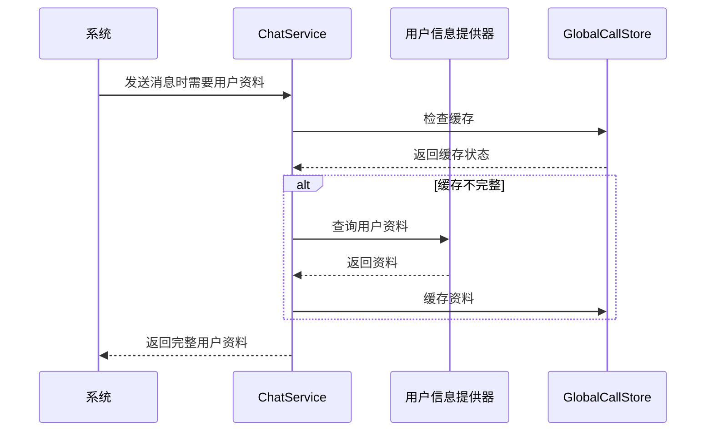

**图表来源**
- [ChatService.ts:64-101](file://lib/services/ChatService.ts#L64-101)
- [UserProfileService.ts:49-110](file://lib/services/UserProfileService.ts#L49-L110)

### 自动解析触发条件

自动用户资料解析在以下情况下会被触发：

1. **消息发送时**
   - 发送通话邀请消息时自动解析当前用户资料
   - 确保消息扩展字段包含完整的用户信息

2. **群组通话初始化**
   - 群组通话发起时自动解析被邀请成员资料
   - 为参与者列表提供准确的用户展示信息

3. **用户状态变化**
   - 用户资料发生变更时自动更新缓存
   - 确保后续操作使用最新的用户信息

4. **Provider可用时**
   - 当外部Provider可用时自动查询缺失的用户资料
   - 减少手动查询的需求

### 自动解析的优势

1. **透明性**
   - 开发者无需手动处理用户资料获取
   - 系统自动处理各种边界情况

2. **可靠性**
   - 多层缓存确保资料的可用性
   - Provider降级机制保证功能完整性

3. **性能优化**
   - 批量查询减少网络请求次数
   - 智能缓存避免重复查询

**章节来源**
- [ChatService.ts:64-101](file://lib/services/ChatService.ts#L64-101)
- [useCallKit.ts:73-79](file://lib/composables/useCallKit.ts#L73-79)
- [UserProfileService.ts:49-110](file://lib/services/UserProfileService.ts#L49-L110)

## 依赖关系分析

用户资料服务的依赖关系呈现清晰的层次结构：

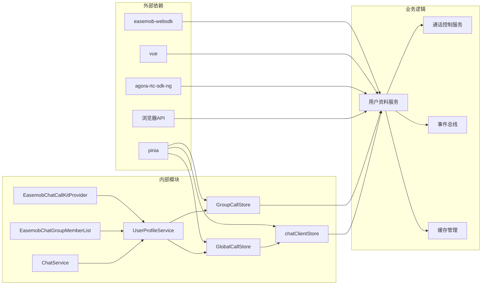

**图表来源**
- [package.json:47-51](file://package.json#L47-L51)
- [index.ts:1-90](file://lib/index.ts#L1-L90)
- [UserProfileService.ts:18-42](file://lib/services/UserProfileService.ts#L18-L42)

**章节来源**
- [package.json:47-51](file://package.json#L47-L51)
- [index.ts:1-90](file://lib/index.ts#L1-L90)

## 性能考虑

用户资料服务在设计时充分考虑了性能优化：

### 缓存策略
- **两层缓存架构**：GlobalCallStore本地缓存 + 外部Provider缓存，提供最佳查询性能
- **批量处理优化**：支持批量设置和批量查询用户信息，减少重复查询
- **智能缓存命中检测**：自动识别缓存命中情况，避免不必要的网络请求
- **响应式更新**：利用Vue的响应式系统，只更新发生变化的数据

### userInfo 参数性能优势
- **零网络开销**：主动传递的用户资料无需网络查询
- **即时可用**：userInfo 参数提供的资料立即可用，无需等待
- **减少缓存压力**：避免重复查询相同用户资料
- **提高准确性**：开发者可以提供最准确的用户资料

### 内存管理
- **弱引用模式**：用户信息以弱引用形式存储，避免内存泄漏
- **及时清理**：通话结束后自动清理相关用户信息缓存
- **状态重置**：提供完整的状态重置机制
- **缓存容量控制**：合理控制缓存大小，避免内存溢出

### 网络优化
- **去重请求**：避免对同一用户的重复信息查询
- **超时处理**：合理的网络请求超时机制
- **降级策略**：在网络异常时提供基础用户信息显示
- **批量请求优化**：合并多个用户查询为单个批量请求

### 性能监控
- **缓存命中率统计**：记录缓存命中情况，优化缓存策略
- **查询性能监控**：监控用户信息查询的响应时间
- **内存使用监控**：跟踪缓存占用的内存大小

## 故障排除指南

### 常见问题及解决方案

| 问题类型 | 症状描述 | 可能原因 | 解决方案 |
|----------|----------|----------|----------|
| 用户信息缺失 | 显示用户ID而非昵称 | 用户信息提供器未正确配置 | 检查ProviderConfig配置，确认getUserInfo函数实现 |
| 头像加载失败 | 显示默认头像 | avatarURL格式不正确 | 验证头像URL有效性，检查CDN访问权限 |
| userInfo 参数无效 | userInfo 参数未生效 | 参数格式不正确或优先级问题 | 检查userInfo参数格式，确认参数传递位置 |
| 缓存不同步 | 显示过期用户信息 | 缓存未及时更新 | 调用batchSetUserInfo批量更新，检查缓存更新逻辑 |
| 性能问题 | UI渲染卡顿 | 信息频繁更新导致重渲染 | 优化更新频率，使用防抖，检查缓存命中率 |
| 缓存污染 | 显示错误的用户信息 | 缓存数据损坏或过期 | 清理缓存，重新加载用户信息 |
| Provider异常 | 批量查询失败 | 外部Provider不可用 | 检查网络连接，验证Provider接口，实现降级策略 |

### userInfo 参数相关问题诊断

1. **参数传递验证**
   - 确认 userInfo 参数格式正确
   - 检查参数传递的位置和时机
   - 验证参数的生命周期

2. **优先级检查**
   - 确认 userInfo 参数确实具有最高优先级
   - 检查缓存和Provider的降级逻辑
   - 验证参数覆盖行为

3. **缓存影响分析**
   - 检查 userInfo 参数是否正确缓存
   - 验证缓存更新机制
   - 分析参数对后续查询的影响

### 调试建议

1. **启用详细日志**：在UserProfileService中启用调试模式，查看详细的缓存操作日志
2. **监控性能指标**：跟踪用户信息查询的响应时间和缓存命中率
3. **检查Provider实现**：验证getUserInfo和getGroupInfo函数的正确性
4. **测试批量查询**：验证批量解析功能的性能和准确性
5. **内存使用监控**：定期检查缓存占用的内存大小，避免内存泄漏
6. **userInfo 参数测试**：验证userInfo参数的传递和处理逻辑

**章节来源**
- [types.ts:5-19](file://lib/types.ts#L5-L19)
- [globalCall.ts:14-34](file://lib/store/globalCall.ts#L14-L34)
- [UserProfileService.ts:99-109](file://lib/services/UserProfileService.ts#L99-L109)

## 结论

用户资料服务作为Easemob CallKit Vue3项目的重要组成部分，通过模块化的设计和高效的缓存机制，为复杂的通话场景提供了可靠的用户信息管理能力。该服务不仅支持单人通话的基础需求，还能满足群组通话的复杂场景，包括实时用户状态更新、批量信息处理和性能优化。

**更新** 本次更新引入的 userInfo 参数主动传递机制和自动用户资料解析功能显著提升了用户资料服务的灵活性和效率。userInfo 参数提供了最高优先级的主动传递能力，而自动解析功能则确保了在各种场景下都能提供准确的用户信息。

这些增强功能的实现基于清晰的优先级处理机制和智能的缓存策略，既保证了性能优化，又提供了灵活的配置选项。开发者可以根据具体需求选择合适的资料提供方式，系统会在必要时自动处理各种边界情况。

通过标准化的用户信息提供器接口，开发者可以轻松集成自定义的用户信息源，同时保持系统的可扩展性和可维护性。响应式的设计确保了UI能够实时反映用户状态的变化，配合智能缓存机制和自动解析功能，进一步提升了整体的用户体验。

未来的发展方向包括进一步优化缓存策略、增强离线支持能力，以及提供更丰富的用户信息定制选项，以适应更多样化的应用场景。userInfo 参数主动传递机制和自动用户资料解析功能的成功实施为这些发展方向奠定了坚实的基础。