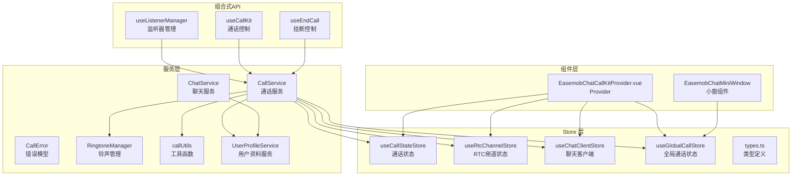
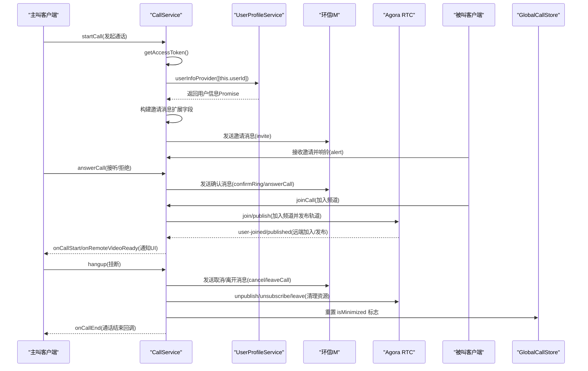
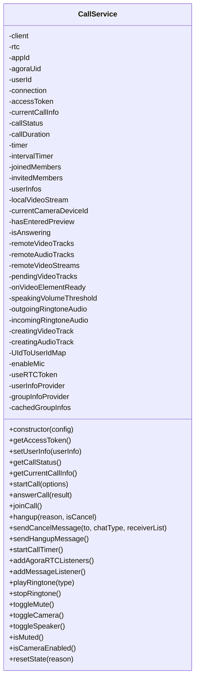
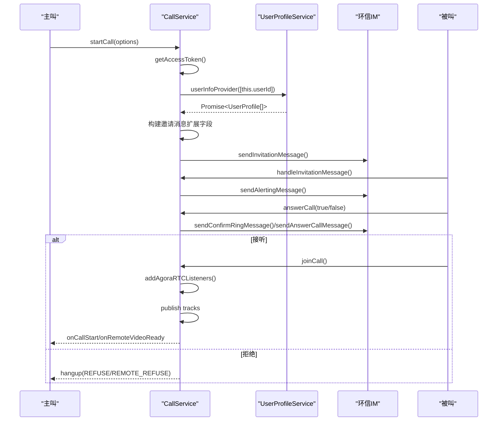
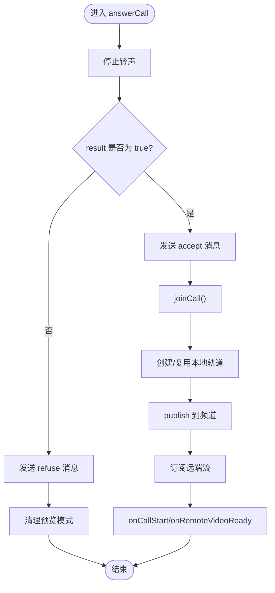
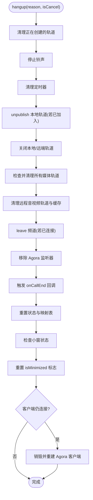
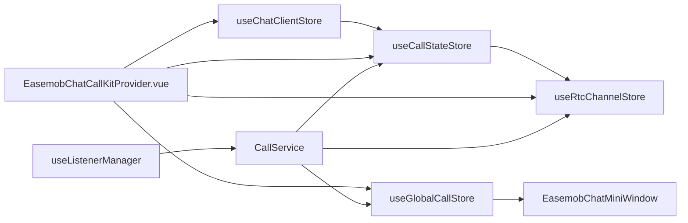
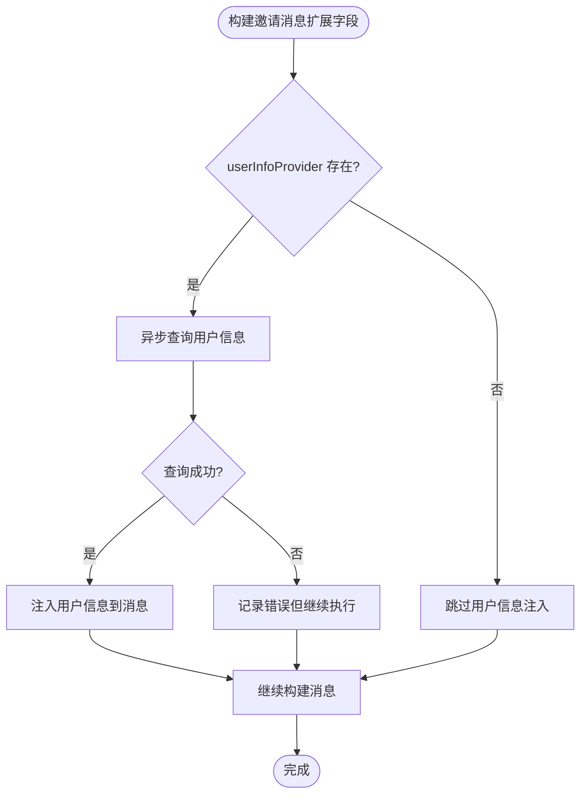
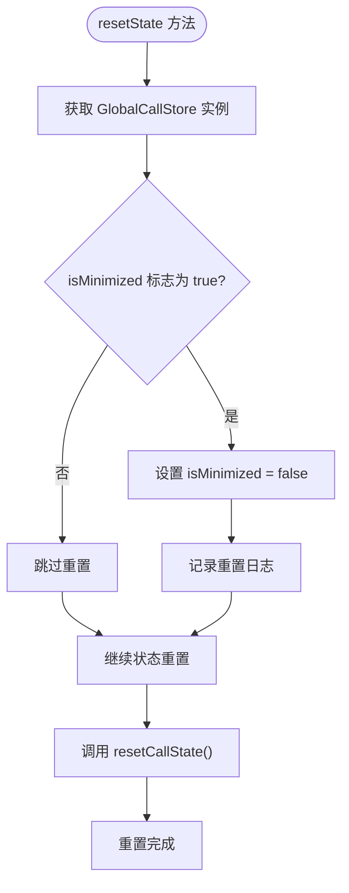
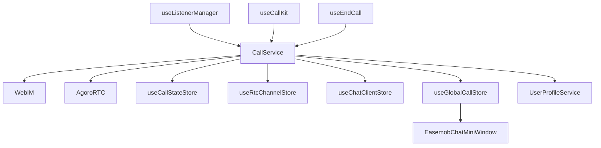

# 通话服务 (CallService)

<cite>
**本文档引用的文件**
- [CallService.ts](file://lib/services/CallService.ts)
- [CallError.ts](file://lib/services/CallError.ts)
- [ringtoneManager.ts](file://lib/utils/ringtoneManager.ts)
- [callUtils.ts](file://lib/utils/callUtils.ts)
- [callState.ts](file://lib/store/callState.ts)
- [rtcChannel.ts](file://lib/store/rtcChannel.ts)
- [chatClient.ts](file://lib/store/chatClient.ts)
- [globalCall.ts](file://lib/store/globalCall.ts)
- [types.ts](file://lib/store/types.ts)
- [useListenerManager.ts](file://lib/composables/useListenerManager.ts)
- [useCallKit.ts](file://lib/composables/useCallKit.ts)
- [useEndCall.ts](file://lib/composables/useEndCall.ts)
- [EasemobChatCallKitProvider.vue](file://lib/components/EasemobChatCallKitProvider.vue)
- [EasemobChatMiniWindow.vue](file://lib/components/EasemobChatMiniWindow.vue)
- [修复CallService中CallState store初始化检查问题.md](file://.trae/documents/修复CallService中CallState store初始化检查问题.md)
- [UserProfileService.ts](file://lib/services/UserProfileService.ts)
- [ChatService.ts](file://lib/services/ChatService.ts)
- [signal.types.ts](file://lib/types/signal.types.ts)
</cite>

## 更新摘要
**变更内容**
- 在 CallService.resetState 方法中新增小窗状态重置逻辑，确保在任何挂断场景下都会重置 isMinimized 标志
- 修复小窗状态管理不一致的问题，保证下次通话从大窗模式开始
- 新增对 useGlobalCallStore 的 isMinimized 字段检查和重置

## 目录
1. [简介](#简介)
2. [项目结构](#项目结构)
3. [核心组件](#核心组件)
4. [架构总览](#架构总览)
5. [详细组件分析](#详细组件分析)
6. [依赖关系分析](#依赖关系分析)
7. [性能考虑](#性能考虑)
8. [故障排除指南](#故障排除指南)
9. [结论](#结论)
10. [附录](#附录)

## 简介
本文件为 CallService 通话服务的深度技术文档，系统阐述其如何封装环信即时通讯 SDK 的通话相关能力，覆盖通话发起、接听、挂断等核心业务流程，以及状态管理、错误处理、挂断策略、与 Store 层的协作机制。文档还包含使用示例、最佳实践与常见问题排查建议，帮助开发者在复杂场景下稳定集成与扩展。

**更新** 本次更新增强了 `buildInviteMessageExt` 方法，支持异步调用和自动注入调用者信息，提升了通话邀请消息的完整性和可靠性。**新增**在 `resetState` 方法中添加了小窗状态重置逻辑，确保在任何挂断场景下都会重置 isMinimized 标志，解决小窗状态管理不一致的问题。

## 项目结构
该项目采用分层与模块化组织方式：
- 服务层：CallService 封装环信与 Agora 的通话逻辑
- Store 层：Pinia 状态管理，包含 CallStateStore、RtcChannelStore、ChatClientStore、GlobalCallStore
- 工具层：铃声管理、通话时长格式化、位置计算等
- 组合式 API：useListenerManager、useCallKit、useEndCall 等协调状态与事件
- 组件层：CallKit 提供 UI 与交互，包括小窗模式支持

**图表来源**
- [CallService.ts:116-285](file://lib/services/CallService.ts#L116-L285)
- [CallError.ts:1-43](file://lib/services/CallError.ts#L1-L43)
- [ringtoneManager.ts:1-138](file://lib/utils/ringtoneManager.ts#L1-L138)
- [callUtils.ts:1-85](file://lib/utils/callUtils.ts#L1-L85)
- [UserProfileService.ts:1-88](file://lib/services/UserProfileService.ts#L1-L88)
- [ChatService.ts:1-323](file://lib/services/ChatService.ts#L1-L323)
- [callState.ts:1-263](file://lib/store/callState.ts#L1-L263)
- [rtcChannel.ts:1-50](file://lib/store/rtcChannel.ts#L1-L50)
- [chatClient.ts:1-22](file://lib/store/chatClient.ts#L1-L22)
- [globalCall.ts:1-56](file://lib/store/globalCall.ts#L1-L56)
- [useListenerManager.ts:1-683](file://lib/composables/useListenerManager.ts#L1-L683)
- [useCallKit.ts:1-254](file://lib/composables/useCallKit.ts#L1-L254)
- [useEndCall.ts:1-131](file://lib/composables/useEndCall.ts#L1-L131)
- [EasemobChatCallKitProvider.vue:47-77](file://lib/components/EasemobChatCallKitProvider.vue#L47-L77)
- [EasemobChatMiniWindow.vue:1-380](file://lib/components/EasemobChatMiniWindow.vue#L1-L380)

**章节来源**
- [CallService.ts:116-285](file://lib/services/CallService.ts#L116-L285)
- [callState.ts:1-263](file://lib/store/callState.ts#L1-L263)
- [rtcChannel.ts:1-50](file://lib/store/rtcChannel.ts#L1-L50)
- [chatClient.ts:1-22](file://lib/store/chatClient.ts#L1-L22)
- [globalCall.ts:1-56](file://lib/store/globalCall.ts#L1-L56)
- [useListenerManager.ts:1-683](file://lib/composables/useListenerManager.ts#L1-L683)
- [useCallKit.ts:1-254](file://lib/composables/useCallKit.ts#L1-L254)
- [useEndCall.ts:1-131](file://lib/composables/useEndCall.ts#L1-L131)
- [EasemobChatCallKitProvider.vue:47-77](file://lib/components/EasemobChatCallKitProvider.vue#L47-L77)
- [EasemobChatMiniWindow.vue:1-380](file://lib/components/EasemobChatMiniWindow.vue#L1-L380)

## 核心组件
- CallService：封装环信与 Agora 的通话生命周期，负责邀请、响铃、确认、加入频道、发布/订阅、媒体控制、挂断与清理
- CallError：统一错误类型与错误码，便于上层捕获与处理
- RingtoneManager：统一管理外呼/来电铃声播放与停止
- callUtils：提供随机频道生成、通话时长格式化、安全位置计算等工具
- UserProfileService：提供用户和群组信息的异步查询服务，支持自动注入调用者信息
- ChatService：封装聊天相关操作，包括邀请消息扩展字段的构建
- Store 层：useCallStateStore、useRtcChannelStore、useChatClientStore、useGlobalCallStore 协同维护通话状态、频道状态、客户端上下文与全局窗口状态
- 组合式 API：useListenerManager、useCallKit、useEndCall 协调事件监听、服务访问与挂断控制
- EasemobChatMiniWindow：小窗组件，支持通话过程中的最小化显示

**章节来源**
- [CallService.ts:116-285](file://lib/services/CallService.ts#L116-L285)
- [CallError.ts:1-43](file://lib/services/CallError.ts#L1-L43)
- [ringtoneManager.ts:1-138](file://lib/utils/ringtoneManager.ts#L1-L138)
- [callUtils.ts:1-85](file://lib/utils/callUtils.ts#L1-L85)
- [UserProfileService.ts:1-88](file://lib/services/UserProfileService.ts#L1-L88)
- [ChatService.ts:1-323](file://lib/services/ChatService.ts#L1-L323)
- [callState.ts:1-263](file://lib/store/callState.ts#L1-L263)
- [rtcChannel.ts:1-50](file://lib/store/rtcChannel.ts#L1-L50)
- [chatClient.ts:1-22](file://lib/store/chatClient.ts#L1-L22)
- [globalCall.ts:1-56](file://lib/store/globalCall.ts#L1-L56)
- [useListenerManager.ts:1-683](file://lib/composables/useListenerManager.ts#L1-L683)
- [useCallKit.ts:1-254](file://lib/composables/useCallKit.ts#L1-L254)
- [useEndCall.ts:1-131](file://lib/composables/useEndCall.ts#L1-L131)
- [EasemobChatMiniWindow.vue:1-380](file://lib/components/EasemobChatMiniWindow.vue#L1-L380)

## 架构总览
CallService 通过环信 IM 发送信令消息，通过 Agora RTC 完成音视频传输。服务层与 Store 层解耦，通过回调与事件驱动的方式进行状态同步。新增的 UserProfileService 提供异步用户信息查询，支持自动注入调用者信息到邀请消息中。**新增**的 GlobalCallStore 管理跨通话的全局状态，包括小窗模式的 isMinimized 标志。

**图表来源**
- [CallService.ts:345-527](file://lib/services/CallService.ts#L345-L527)
- [CallService.ts:686-727](file://lib/services/CallService.ts#L686-L727)
- [CallService.ts:806-1358](file://lib/services/CallService.ts#L806-L1358)
- [CallService.ts:1360-1775](file://lib/services/CallService.ts#L1360-L1775)
- [CallService.ts:321-383](file://lib/services/CallService.ts#L321-L383)
- [UserProfileService.ts:48-61](file://lib/services/UserProfileService.ts#L48-L61)
- [useListenerManager.ts:629-677](file://lib/composables/useListenerManager.ts#L629-L677)
- [globalCall.ts:10-11](file://lib/store/globalCall.ts#L10-L11)

**章节来源**
- [CallService.ts:345-527](file://lib/services/CallService.ts#L345-L527)
- [CallService.ts:686-727](file://lib/services/CallService.ts#L686-L727)
- [CallService.ts:806-1358](file://lib/services/CallService.ts#L806-L1358)
- [CallService.ts:1360-1775](file://lib/services/CallService.ts#L1360-L1775)
- [CallService.ts:321-383](file://lib/services/CallService.ts#L321-L383)
- [UserProfileService.ts:48-61](file://lib/services/UserProfileService.ts#L48-L61)
- [useListenerManager.ts:629-677](file://lib/composables/useListenerManager.ts#L629-L677)
- [globalCall.ts:10-11](file://lib/store/globalCall.ts#L10-L11)

## 详细组件分析

### CallService 类与初始化流程
- 初始化要点
  - 从 WebIM connection 获取用户与设备信息，设置 Agora 客户端与角色
  - 注册消息监听器，处理文本消息与命令消息
  - 延迟初始化铃声，避免资源竞争
  - 通过 onRtcEngineCreated 回调暴露 Agora 客户端实例
  - 支持 userInfoProvider 和 groupInfoProvider 异步用户信息查询
- 关键状态
  - callStatus：CALL_STATUS 枚举，贯穿整个通话生命周期
  - currentCallInfo：当前通话的元数据（callId、channel、type、成员等）
  - 本地/远端媒体轨道缓存：避免重复创建与资源泄漏
  - 用户信息缓存：支持异步用户资料查询和缓存
  - **新增**：全局小窗状态：isMinimized 标志，控制小窗显示/隐藏
- 配置项
  - ringtone 配置、编码配置、音量阈值、RTC Token 使用开关等
  - userInfoProvider：异步用户信息提供者
  - groupInfoProvider：异步群组信息提供者

**图表来源**
- [CallService.ts:116-285](file://lib/services/CallService.ts#L116-L285)
- [CallService.ts:291-308](file://lib/services/CallService.ts#L291-L308)
- [CallService.ts:345-527](file://lib/services/CallService.ts#L345-L527)
- [CallService.ts:686-727](file://lib/services/CallService.ts#L686-L727)
- [CallService.ts:806-1358](file://lib/services/CallService.ts#L806-L1358)
- [CallService.ts:1360-1775](file://lib/services/CallService.ts#L1360-L1775)
- [CallService.ts:1777-1791](file://lib/services/CallService.ts#L1777-L1791)
- [CallService.ts:1793-2182](file://lib/services/CallService.ts#L1793-L2182)
- [CallService.ts:2225-2254](file://lib/services/CallService.ts#L2225-L2254)
- [CallService.ts:2400-3199](file://lib/services/CallService.ts#L2400-L3199)
- [CallService.ts:321-383](file://lib/services/CallService.ts#L321-L383)
- [CallService.ts:4376-4477](file://lib/services/CallService.ts#L4376-L4477)

**章节来源**
- [CallService.ts:116-285](file://lib/services/CallService.ts#L116-L285)
- [CallService.ts:291-308](file://lib/services/CallService.ts#L291-L308)
- [CallService.ts:345-527](file://lib/services/CallService.ts#L345-L527)
- [CallService.ts:686-727](file://lib/services/CallService.ts#L686-L727)
- [CallService.ts:806-1358](file://lib/services/CallService.ts#L806-L1358)
- [CallService.ts:1360-1775](file://lib/services/CallService.ts#L1360-L1775)
- [CallService.ts:1777-1791](file://lib/services/CallService.ts#L1777-L1791)
- [CallService.ts:1793-2182](file://lib/services/CallService.ts#L1793-L2182)
- [CallService.ts:2225-2254](file://lib/services/CallService.ts#L2225-L2254)
- [CallService.ts:2400-3199](file://lib/services/CallService.ts#L2400-L3199)
- [CallService.ts:321-383](file://lib/services/CallService.ts#L321-L383)
- [CallService.ts:4376-4477](file://lib/services/CallService.ts#L4376-L4477)

### 通话发起与邀请流程
- 主叫调用 startCall，生成 callId/channel，创建本地预览（1v1 视频），发送邀请消息
- 被叫收到邀请后，发送 alert/confirmRing，响铃并等待接听
- 超时处理：单人通话 30 秒，群组通话按需处理
- **增强功能**：自动注入调用者信息到邀请消息中，包括昵称和头像

**图表来源**
- [CallService.ts:345-527](file://lib/services/CallService.ts#L345-L527)
- [CallService.ts:529-684](file://lib/services/CallService.ts#L529-L684)
- [CallService.ts:686-727](file://lib/services/CallService.ts#L686-L727)
- [CallService.ts:729-762](file://lib/services/CallService.ts#L729-L762)
- [UserProfileService.ts:48-61](file://lib/services/UserProfileService.ts#L48-L61)
- [CallService.ts:2335-2366](file://lib/services/CallService.ts#L2335-L2366)
- [CallService.ts:2368-2446](file://lib/services/CallService.ts#L2368-L2446)

**章节来源**
- [CallService.ts:345-527](file://lib/services/CallService.ts#L345-L527)
- [CallService.ts:529-684](file://lib/services/CallService.ts#L529-L684)
- [CallService.ts:686-727](file://lib/services/CallService.ts#L686-L727)
- [CallService.ts:729-762](file://lib/services/CallService.ts#L729-L762)
- [UserProfileService.ts:48-61](file://lib/services/UserProfileService.ts#L48-L61)
- [CallService.ts:2335-2366](file://lib/services/CallService.ts#L2335-L2366)
- [CallService.ts:2368-2446](file://lib/services/CallService.ts#L2368-L2446)

### 接听与加入通话
- 被叫 answerCall：发送 accept/refuse，响铃停止，拒绝则清理预览并挂断
- joinCall：根据类型创建/复用本地轨道，发布到频道，订阅远端流，通知 UI

**图表来源**
- [CallService.ts:686-727](file://lib/services/CallService.ts#L686-L727)
- [CallService.ts:806-1358](file://lib/services/CallService.ts#L806-L1358)

**章节来源**
- [CallService.ts:686-727](file://lib/services/CallService.ts#L686-L727)
- [CallService.ts:806-1358](file://lib/services/CallService.ts#L806-L1358)

### 挂断策略与实现细节
- 普通挂断：发送 leaveCall 消息，取消发布本地轨道，停止远端轨道，离开频道，清理定时器与资源
- 取消呼叫：仅对群组场景，向未加入成员发送 cancel 消息
- 远程操作：收到 cancel/leaveCall/remote* 等原因，直接挂断并清理
- 资源清理：严格顺序 unpublish -> close track -> remove listeners -> leave channel，避免资源泄漏
- **新增**：小窗状态重置：在 resetState 方法中检查并重置 GlobalCallStore 的 isMinimized 标志，确保下次通话从大窗模式开始

**图表来源**
- [CallService.ts:1360-1683](file://lib/services/CallService.ts#L1360-L1683)
- [CallService.ts:1685-1775](file://lib/services/CallService.ts#L1685-L1775)
- [CallService.ts:321-383](file://lib/services/CallService.ts#L321-L383)

**章节来源**
- [CallService.ts:1360-1683](file://lib/services/CallService.ts#L1360-L1683)
- [CallService.ts:1685-1775](file://lib/services/CallService.ts#L1685-L1775)
- [CallService.ts:321-383](file://lib/services/CallService.ts#L321-L383)

### 与 Store 层的协作
- ChatClientStore：在设置 ChatClient 时初始化 CallStateStore
- CallStateStore：维护通话状态、邀请超时、用户信息映射、群组成员列表等
- RtcChannelStore：维护频道连接、本地/远端流、音视频开关、UID 映射等
- **新增**：GlobalCallStore：维护全局通话状态，包括小窗模式的 isMinimized 标志
- Provider：在 setup 顶层创建 listenerManager，合并全局配置，设置日志级别

**图表来源**
- [chatClient.ts:1-22](file://lib/store/chatClient.ts#L1-L22)
- [callState.ts:1-263](file://lib/store/callState.ts#L1-L263)
- [rtcChannel.ts:1-50](file://lib/store/rtcChannel.ts#L1-L50)
- [globalCall.ts:1-56](file://lib/store/globalCall.ts#L1-L56)
- [EasemobChatCallKitProvider.vue:47-77](file://lib/components/EasemobChatCallKitProvider.vue#L47-L77)
- [useListenerManager.ts:1-683](file://lib/composables/useListenerManager.ts#L1-L683)
- [EasemobChatMiniWindow.vue:67](file://lib/components/EasemobChatMiniWindow.vue#L67)

**章节来源**
- [chatClient.ts:1-22](file://lib/store/chatClient.ts#L1-L22)
- [callState.ts:1-263](file://lib/store/callState.ts#L1-L263)
- [rtcChannel.ts:1-50](file://lib/store/rtcChannel.ts#L1-L50)
- [globalCall.ts:1-56](file://lib/store/globalCall.ts#L1-L56)
- [EasemobChatCallKitProvider.vue:47-77](file://lib/components/EasemobChatCallKitProvider.vue#L47-L77)
- [useListenerManager.ts:1-683](file://lib/composables/useListenerManager.ts#L1-L683)
- [EasemobChatMiniWindow.vue:67](file://lib/components/EasemobChatMiniWindow.vue#L67)

### 错误处理与异常场景
- CallError：统一错误类型（CALLKIT/RTC/CHAT）与错误码，便于上抛与 UI 展示
- 信令错误：对未知 action 统一上报
- RTC 错误：join/publish/subscribe 失败时触发 onCallError 并挂断
- 聊天错误：发送消息失败时触发 onCallError 并回滚状态
- 超时与多端冲突：自动挂断或提示"其他设备已处理"

**章节来源**
- [CallError.ts:1-43](file://lib/services/CallError.ts#L1-L43)
- [CallService.ts:2359-2365](file://lib/services/CallService.ts#L2359-L2365)
- [CallService.ts:854-873](file://lib/services/CallService.ts#L854-L873)
- [CallService.ts:974-983](file://lib/services/CallService.ts#L974-L983)
- [CallService.ts:1157-1164](file://lib/services/CallService.ts#L1157-L1164)

### 铃声与媒体控制
- RingtoneManager：支持外呼/来电铃声配置、播放/停止、循环与音量控制
- CallService 内部也具备铃声播放/停止能力，优先级与配置项可定制
- 媒体控制：静音、摄像头开关、扬声器切换、音量指示、网络质量回调

**章节来源**
- [ringtoneManager.ts:1-138](file://lib/utils/ringtoneManager.ts#L1-L138)
- [CallService.ts:4376-4477](file://lib/services/CallService.ts#L4376-L4477)
- [CallService.ts:2679-2732](file://lib/services/CallService.ts#L2679-L2732)
- [CallService.ts:3129-3188](file://lib/services/CallService.ts#L3129-L3188)
- [CallService.ts:2150-2181](file://lib/services/CallService.ts#L2150-L2181)

### 用户信息自动注入机制
**新增功能**：CallService 现在支持自动注入调用者信息到邀请消息中，通过 userInfoProvider 异步获取用户资料。

- **异步调用支持**：userInfoProvider 是一个 Promise 函数，可以异步获取用户信息
- **自动注入**：在构建邀请消息扩展字段时，自动将用户昵称和头像注入到消息中
- **错误处理**：如果用户信息获取失败，会记录错误但不影响通话流程
- **缓存机制**：获取到的用户信息会被缓存，避免重复查询

**图表来源**
- [CallService.ts:570-595](file://lib/services/CallService.ts#L570-L595)
- [UserProfileService.ts:48-61](file://lib/services/UserProfileService.ts#L48-L61)

**章节来源**
- [CallService.ts:570-595](file://lib/services/CallService.ts#L570-L595)
- [UserProfileService.ts:48-61](file://lib/services/UserProfileService.ts#L48-L61)

### 小窗状态管理机制
**新增功能**：CallService.resetState 方法现在包含小窗状态重置逻辑，确保在任何挂断场景下都会重置 isMinimized 标志。

- **状态检查**：在 resetState 方法中检查 GlobalCallStore 的 isMinimized 标志
- **自动重置**：如果检测到 isMinimized 为 true，则将其重置为 false
- **一致性保证**：确保每次通话结束后，下次通话都从大窗模式开始
- **日志记录**：记录小窗状态重置的操作，便于调试和监控

**图表来源**
- [CallService.ts:321-383](file://lib/services/CallService.ts#L321-L383)
- [globalCall.ts:10-11](file://lib/store/globalCall.ts#L10-L11)
- [globalCall.ts:36-38](file://lib/store/globalCall.ts#L36-L38)

**章节来源**
- [CallService.ts:321-383](file://lib/services/CallService.ts#L321-L383)
- [globalCall.ts:10-11](file://lib/store/globalCall.ts#L10-L11)
- [globalCall.ts:36-38](file://lib/store/globalCall.ts#L36-L38)

## 依赖关系分析
- CallService 依赖 WebIM 与 AgoraRTC，通过 IM 传递信令，通过 RTC 传输媒体
- Store 层通过 Pinia 管理状态，相互解耦并通过回调与事件联动
- 组合式 API 将服务与状态封装为易用接口，降低上层耦合度
- **新增依赖**：UserProfileService 提供异步用户信息查询服务
- **新增依赖**：GlobalCallStore 管理全局通话状态，包括小窗模式控制

**图表来源**
- [CallService.ts:1-12](file://lib/services/CallService.ts#L1-L12)
- [UserProfileService.ts:1-88](file://lib/services/UserProfileService.ts#L1-L88)
- [globalCall.ts:1-56](file://lib/store/globalCall.ts#L1-L56)
- [useListenerManager.ts:1-683](file://lib/composables/useListenerManager.ts#L1-L683)
- [useCallKit.ts:1-254](file://lib/composables/useCallKit.ts#L1-L254)
- [useEndCall.ts:1-131](file://lib/composables/useEndCall.ts#L1-L131)
- [EasemobChatMiniWindow.vue:1-380](file://lib/components/EasemobChatMiniWindow.vue#L1-L380)

**章节来源**
- [CallService.ts:1-12](file://lib/services/CallService.ts#L1-L12)
- [UserProfileService.ts:1-88](file://lib/services/UserProfileService.ts#L1-L88)
- [globalCall.ts:1-56](file://lib/store/globalCall.ts#L1-L56)
- [useListenerManager.ts:1-683](file://lib/composables/useListenerManager.ts#L1-L683)
- [useCallKit.ts:1-254](file://lib/composables/useCallKit.ts#L1-L254)
- [useEndCall.ts:1-131](file://lib/composables/useEndCall.ts#L1-L131)
- [EasemobChatMiniWindow.vue:1-380](file://lib/components/EasemobChatMiniWindow.vue#L1-L380)

## 性能考虑
- 轨道复用与缓存：本地/远端轨道与视频流缓存，避免重复创建与资源浪费
- 连接状态检查：join 前后检查连接状态，必要时等待 CONNECTED 或主动重连
- 资源释放顺序：先 unpublish，再 close，最后 leave，确保无泄漏
- 音量指示与网络质量：仅在多人通话启用音量指示，减少不必要的计算
- Android 设备适配：切换摄像头前后等待设备资源释放，提升稳定性
- **异步查询优化**：用户信息查询采用 Promise 方式，避免阻塞主线程
- **小窗状态优化**：通过 resetState 自动重置小窗状态，避免状态污染影响下次通话

## 故障排除指南
- Store 初始化问题
  - 现象：取消通话时报"CallState store not properly initialized"
  - 原因：Pinia 未正确安装或 store 访问时机不当
  - 解决：确保 app.use(pinia) 安装，使用延迟访问与错误兜底
- 资源泄漏
  - 现象：多次通话后摄像头/麦克风占用
  - 原因：未正确 unpublish/close
  - 解决：严格遵循挂断流程，确保轨道与监听器清理
- 多端冲突
  - 现象：其他设备已接听/拒绝
  - 原因：多端设备处理同一通话
  - 解决：根据 calleeDevId 校验，收到"handled on other device"时自动挂断
- 铃声冲突
  - 现象：多个音频同时播放
  - 原因：未停止旧铃声
  - 解决：播放新铃声前停止当前播放
- **用户信息注入失败**
  - 现象：邀请消息中缺少调用者昵称或头像
  - 原因：userInfoProvider 未正确配置或查询失败
  - 解决：确保注册了正确的 userInfoProvider，并检查网络连接
- **小窗状态不一致**
  - 现象：通话结束后小窗仍然处于最小化状态
  - 原因：小窗状态未正确重置
  - 解决：检查 resetState 方法中的小窗状态重置逻辑，确保 isMinimized 标志被正确重置

**章节来源**
- [修复CallService中CallState store初始化检查问题.md:1-42](file://.trae/documents/修复CallService中CallState store初始化检查问题.md#L1-L42)
- [CallService.ts:1360-1683](file://lib/services/CallService.ts#L1360-L1683)
- [CallService.ts:4376-4477](file://lib/services/CallService.ts#L4376-L4477)
- [UserProfileService.ts:48-61](file://lib/services/UserProfileService.ts#L48-L61)
- [CallService.ts:321-383](file://lib/services/CallService.ts#L321-L383)

## 结论
CallService 通过清晰的生命周期管理、严谨的资源清理与完善的错误处理，实现了与环信与 Agora 的深度集成。配合 Store 层的状态抽象与组合式 API 的易用封装，能够满足从单人到群组的多种通话场景。**新增的异步用户信息注入功能**进一步提升了通话体验，使邀请消息更加完整和友好。**新增的小窗状态重置机制**解决了小窗状态管理不一致的问题，确保每次通话都能从正确的初始状态开始。建议在生产环境中重点关注多端冲突、资源释放与 Android 设备适配，以及用户信息提供者的正确配置，以获得更稳定的用户体验。

## 附录

### 使用示例与最佳实践
- 发起通话
  - 准备：确保 ChatClient 已初始化，CallStateStore 已建立
  - 调用：startCall，传入目标用户/群组、通话类型、扩展信息
  - 注意：1v1 视频通话会自动创建本地预览轨道
  - **新增**：确保正确配置 userInfoProvider，以便自动注入调用者信息
- 接听通话
  - 被叫收到邀请后，调用 answerCall(true) 接听，false 拒绝
  - 拒绝时会自动清理预览并挂断
- 加入通话
  - 被叫 answerCall 成功后，调用 joinCall，自动发布本地轨道并订阅远端
- 挂断与取消
  - 正常挂断：hangup(HANGUP_REASON.HANGUP)
  - 取消：hangup(reason, true)，群组场景仅对未加入成员发送取消
  - 远程取消/离开：自动处理并清理
  - **新增**：挂断后小窗状态会自动重置，下次通话从大窗模式开始
- 媒体控制
  - 静音/取消静音：toggleMute
  - 摄像头开关：toggleCamera（支持预览模式与通话中模式）
  - 扬声器切换：toggleSpeaker/setSpeakerVolume

**章节来源**
- [CallService.ts:345-527](file://lib/services/CallService.ts#L345-L527)
- [CallService.ts:686-727](file://lib/services/CallService.ts#L686-L727)
- [CallService.ts:806-1358](file://lib/services/CallService.ts#L806-L1358)
- [CallService.ts:1360-1775](file://lib/services/CallService.ts#L1360-L1775)
- [CallService.ts:2679-2732](file://lib/services/CallService.ts#L2679-L2732)
- [CallService.ts:2734-3127](file://lib/services/CallService.ts#L2734-L3127)
- [CallService.ts:321-383](file://lib/services/CallService.ts#L321-L383)

### 类型与状态参考
- CALL_STATUS/CALL_TYPE/HANGUP_REASON：通话状态、类型与挂断原因枚举
- CallState/RtcChannelState：Pinia 状态结构与 getter/actions
- **新增**：GlobalCallState：包含 isMinimized 标志的全局通话状态
- 类型定义：CallStateStore、RtcChannelStore、ChatClientStore、GlobalCallStore 的接口与约束
- **新增类型**：InviteSignalingExt：邀请消息扩展字段接口，包含完整的调用者信息

**章节来源**
- [CallService.ts:14-66](file://lib/services/CallService.ts#L14-L66)
- [callState.ts:1-263](file://lib/store/callState.ts#L1-L263)
- [rtcChannel.ts:1-50](file://lib/store/rtcChannel.ts#L1-L50)
- [globalCall.ts:1-56](file://lib/store/globalCall.ts#L1-L56)
- [types.ts:1-86](file://lib/store/types.ts#L1-L86)
- [signal.types.ts:68-122](file://lib/types/signal.types.ts#L68-L122)

### 配置与初始化指南
- **userInfoProvider 配置**：在 EasemobChatCallKitProvider.vue 中注册用户信息提供者
- **groupInfoProvider 配置**：可选配置，用于群组信息查询
- **异步查询优势**：避免阻塞主线程，支持批量用户信息查询
- **错误处理策略**：查询失败时记录日志但不影响通话流程
- **小窗状态配置**：通过 GlobalCallStore 的 isMinimized 标志控制小窗显示状态

**章节来源**
- [EasemobChatCallKitProvider.vue:110-120](file://lib/components/EasemobChatCallKitProvider.vue#L110-L120)
- [UserProfileService.ts:25-42](file://lib/services/UserProfileService.ts#L25-L42)
- [UserProfileService.ts:48-61](file://lib/services/UserProfileService.ts#L48-L61)
- [globalCall.ts:10-11](file://lib/store/globalCall.ts#L10-L11)
- [globalCall.ts:36-38](file://lib/store/globalCall.ts#L36-L38)