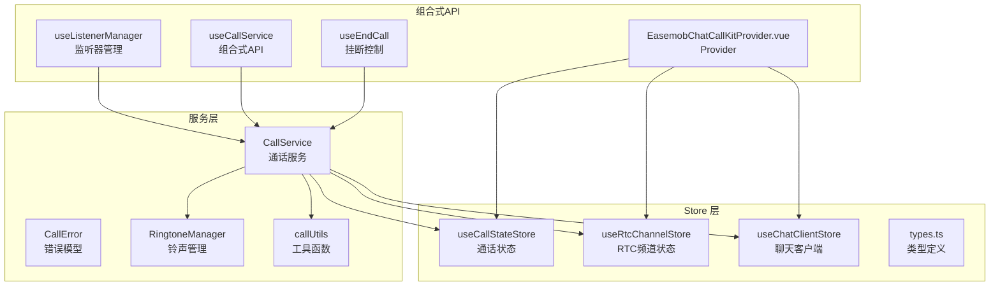
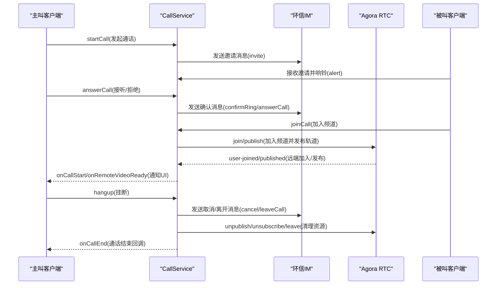
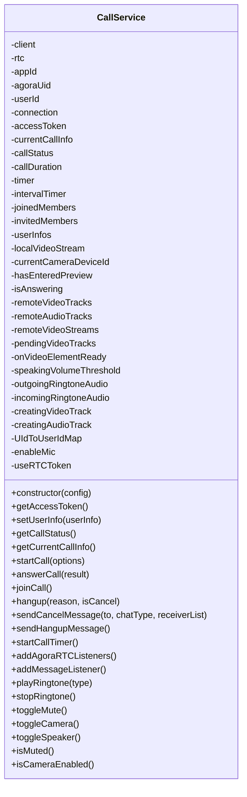
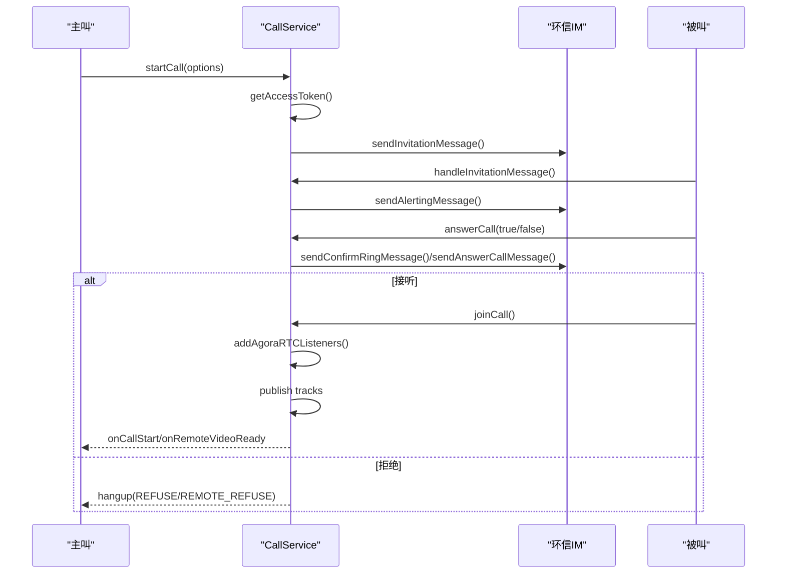
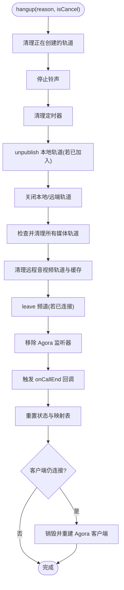
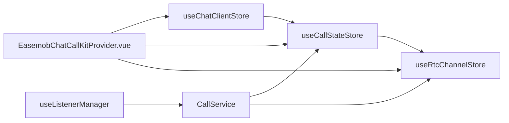
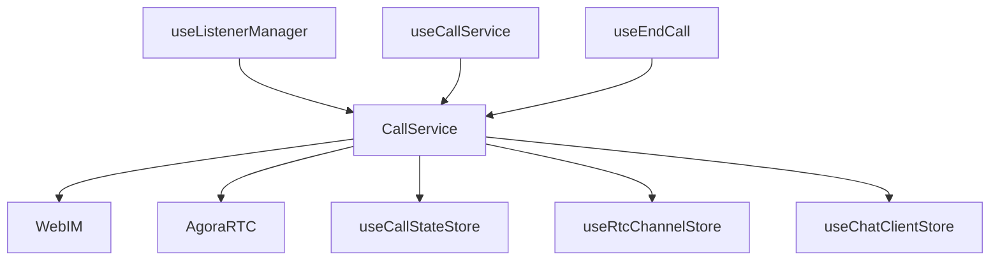

# 通话服务 (CallService)

<cite>
**本文档引用的文件**
- [CallService.ts](file://callkit/services/CallService.ts)
- [CallError.ts](file://callkit/services/CallError.ts)
- [ringtoneManager.ts](file://callkit/utils/ringtoneManager.ts)
- [callUtils.ts](file://callkit/utils/callUtils.ts)
- [callState.ts](file://lib/store/callState.ts)
- [rtcChannel.ts](file://lib/store/rtcChannel.ts)
- [chatClient.ts](file://lib/store/chatClient.ts)
- [types.ts](file://lib/store/types.ts)
- [useListenerManager.ts](file://lib/composables/useListenerManager.ts)
- [useCallService.ts](file://lib/composables/useCallService.ts)
- [EasemobChatCallKitProvider.vue](file://lib/components/EasemobChatCallKitProvider.vue)
- [useEndCall.ts](file://lib/composables/useEndCall.ts)
- [修复CallService中CallState store初始化检查问题.md](file://.trae/documents/修复CallService中CallState store初始化检查问题.md)
</cite>

## 目录
1. [简介](#简介)
2. [项目结构](#项目结构)
3. [核心组件](#核心组件)
4. [架构总览](#架构总览)
5. [详细组件分析](#详细组件分析)
6. [依赖关系分析](#依赖关系分析)
7. [性能考虑](#性能考虑)
8. [故障排除指南](#故障排除指南)
9. [结论](#结论)
10. [附录](#附录)

## 简介
本文件为 CallService 通话服务的深度技术文档，系统阐述其如何封装环信即时通讯 SDK 的通话相关能力，覆盖通话发起、接听、挂断等核心业务流程，以及状态管理、错误处理、挂断策略、与 Store 层的协作机制。文档还包含使用示例、最佳实践与常见问题排查建议，帮助开发者在复杂场景下稳定集成与扩展。

## 项目结构
该项目采用分层与模块化组织方式：
- 服务层：CallService 封装环信与 Agora 的通话逻辑
- Store 层：Pinia 状态管理，包含 CallStateStore、RtcChannelStore、ChatClientStore
- 工具层：铃声管理、通话时长格式化、位置计算等
- 组合式 API：useListenerManager、useCallService、useEndCall 等协调状态与事件
- 组件层：CallKit 提供 UI 与交互

**图表来源**
- [CallService.ts](file://callkit/services/CallService.ts#L116-L285)
- [CallError.ts](file://callkit/services/CallError.ts#L1-L43)
- [ringtoneManager.ts](file://callkit/utils/ringtoneManager.ts#L1-L138)
- [callUtils.ts](file://callkit/utils/callUtils.ts#L1-L85)
- [callState.ts](file://lib/store/callState.ts#L1-L263)
- [rtcChannel.ts](file://lib/store/rtcChannel.ts#L1-L50)
- [chatClient.ts](file://lib/store/chatClient.ts#L1-L22)
- [useListenerManager.ts](file://lib/composables/useListenerManager.ts#L1-L683)
- [useCallService.ts](file://lib/composables/useCallService.ts#L82-L123)
- [EasemobChatCallKitProvider.vue](file://lib/components/EasemobChatCallKitProvider.vue#L47-L77)

**章节来源**
- [CallService.ts](file://callkit/services/CallService.ts#L116-L285)
- [callState.ts](file://lib/store/callState.ts#L1-L263)
- [rtcChannel.ts](file://lib/store/rtcChannel.ts#L1-L50)
- [chatClient.ts](file://lib/store/chatClient.ts#L1-L22)
- [useListenerManager.ts](file://lib/composables/useListenerManager.ts#L1-L683)
- [useCallService.ts](file://lib/composables/useCallService.ts#L82-L123)
- [EasemobChatCallKitProvider.vue](file://lib/components/EasemobChatCallKitProvider.vue#L47-L77)

## 核心组件
- CallService：封装环信与 Agora 的通话生命周期，负责邀请、响铃、确认、加入频道、发布/订阅、媒体控制、挂断与清理
- CallError：统一错误类型与错误码，便于上层捕获与处理
- RingtoneManager：统一管理外呼/来电铃声播放与停止
- callUtils：提供随机频道生成、通话时长格式化、安全位置计算等工具
- Store 层：useCallStateStore、useRtcChannelStore、useChatClientStore 协同维护通话状态、频道状态与客户端上下文
- 组合式 API：useListenerManager、useCallService、useEndCall 协调事件监听、服务访问与挂断控制

**章节来源**
- [CallService.ts](file://callkit/services/CallService.ts#L116-L285)
- [CallError.ts](file://callkit/services/CallError.ts#L1-L43)
- [ringtoneManager.ts](file://callkit/utils/ringtoneManager.ts#L1-L138)
- [callUtils.ts](file://callkit/utils/callUtils.ts#L1-L85)
- [callState.ts](file://lib/store/callState.ts#L1-L263)
- [rtcChannel.ts](file://lib/store/rtcChannel.ts#L1-L50)
- [chatClient.ts](file://lib/store/chatClient.ts#L1-L22)
- [useListenerManager.ts](file://lib/composables/useListenerManager.ts#L1-L683)
- [useCallService.ts](file://lib/composables/useCallService.ts#L82-L123)
- [useEndCall.ts](file://lib/composables/useEndCall.ts#L100-L130)

## 架构总览
CallService 通过环信 IM 发送信令消息，通过 Agora RTC 完成音视频传输。服务层与 Store 层解耦，通过回调与事件驱动的方式进行状态同步。

**图表来源**
- [CallService.ts](file://callkit/services/CallService.ts#L345-L527)
- [CallService.ts](file://callkit/services/CallService.ts#L686-L727)
- [CallService.ts](file://callkit/services/CallService.ts#L806-L1358)
- [CallService.ts](file://callkit/services/CallService.ts#L1360-L1775)
- [useListenerManager.ts](file://lib/composables/useListenerManager.ts#L629-L677)

**章节来源**
- [CallService.ts](file://callkit/services/CallService.ts#L345-L527)
- [CallService.ts](file://callkit/services/CallService.ts#L686-L727)
- [CallService.ts](file://callkit/services/CallService.ts#L806-L1358)
- [CallService.ts](file://callkit/services/CallService.ts#L1360-L1775)
- [useListenerManager.ts](file://lib/composables/useListenerManager.ts#L629-L677)

## 详细组件分析

### CallService 类与初始化流程
- 初始化要点
  - 从 WebIM connection 获取用户与设备信息，设置 Agora 客户端与角色
  - 注册消息监听器，处理文本消息与命令消息
  - 延迟初始化铃声，避免资源竞争
  - 通过 onRtcEngineCreated 回调暴露 Agora 客户端实例
- 关键状态
  - callStatus：CALL_STATUS 枚举，贯穿整个通话生命周期
  - currentCallInfo：当前通话的元数据（callId、channel、type、成员等）
  - 本地/远端媒体轨道缓存：避免重复创建与资源泄漏
- 配置项
  - ringtone 配置、编码配置、音量阈值、RTC Token 使用开关等

**图表来源**
- [CallService.ts](file://callkit/services/CallService.ts#L116-L285)
- [CallService.ts](file://callkit/services/CallService.ts#L291-L308)
- [CallService.ts](file://callkit/services/CallService.ts#L345-L527)
- [CallService.ts](file://callkit/services/CallService.ts#L686-L727)
- [CallService.ts](file://callkit/services/CallService.ts#L806-L1358)
- [CallService.ts](file://callkit/services/CallService.ts#L1360-L1775)
- [CallService.ts](file://callkit/services/CallService.ts#L1777-L1791)
- [CallService.ts](file://callkit/services/CallService.ts#L1793-L2182)
- [CallService.ts](file://callkit/services/CallService.ts#L2225-L2254)
- [CallService.ts](file://callkit/services/CallService.ts#L2400-L3199)
- [CallService.ts](file://callkit/services/CallService.ts#L4376-L4477)

**章节来源**
- [CallService.ts](file://callkit/services/CallService.ts#L116-L285)
- [CallService.ts](file://callkit/services/CallService.ts#L291-L308)
- [CallService.ts](file://callkit/services/CallService.ts#L345-L527)
- [CallService.ts](file://callkit/services/CallService.ts#L686-L727)
- [CallService.ts](file://callkit/services/CallService.ts#L806-L1358)
- [CallService.ts](file://callkit/services/CallService.ts#L1360-L1775)
- [CallService.ts](file://callkit/services/CallService.ts#L1777-L1791)
- [CallService.ts](file://callkit/services/CallService.ts#L1793-L2182)
- [CallService.ts](file://callkit/services/CallService.ts#L2225-L2254)
- [CallService.ts](file://callkit/services/CallService.ts#L2400-L3199)
- [CallService.ts](file://callkit/services/CallService.ts#L4376-L4477)

### 通话发起与邀请流程
- 主叫调用 startCall，生成 callId/channel，创建本地预览（1v1 视频），发送邀请消息
- 被叫收到邀请后，发送 alert/confirmRing，响铃并等待接听
- 超时处理：单人通话 30 秒，群组通话按需处理

**图表来源**
- [CallService.ts](file://callkit/services/CallService.ts#L345-L527)
- [CallService.ts](file://callkit/services/CallService.ts#L529-L684)
- [CallService.ts](file://callkit/services/CallService.ts#L686-L727)
- [CallService.ts](file://callkit/services/CallService.ts#L729-L762)
- [CallService.ts](file://callkit/services/CallService.ts#L2335-L2366)
- [CallService.ts](file://callkit/services/CallService.ts#L2368-L2446)

**章节来源**
- [CallService.ts](file://callkit/services/CallService.ts#L345-L527)
- [CallService.ts](file://callkit/services/CallService.ts#L529-L684)
- [CallService.ts](file://callkit/services/CallService.ts#L686-L727)
- [CallService.ts](file://callkit/services/CallService.ts#L729-L762)
- [CallService.ts](file://callkit/services/CallService.ts#L2335-L2366)
- [CallService.ts](file://callkit/services/CallService.ts#L2368-L2446)

### 接听与加入通话
- 被叫 answerCall：发送 accept/refuse，响铃停止，拒绝则清理预览并挂断
- joinCall：根据类型创建/复用本地轨道，发布到频道，订阅远端流，通知 UI

**图表来源**
- [CallService.ts](file://callkit/services/CallService.ts#L686-L727)
- [CallService.ts](file://callkit/services/CallService.ts#L806-L1358)

**章节来源**
- [CallService.ts](file://callkit/services/CallService.ts#L686-L727)
- [CallService.ts](file://callkit/services/CallService.ts#L806-L1358)

### 挂断策略与实现细节
- 普通挂断：发送 leaveCall 消息，取消发布本地轨道，停止远端轨道，离开频道，清理定时器与资源
- 取消呼叫：仅对群组场景，向未加入成员发送 cancel 消息
- 远程操作：收到 cancel/leaveCall/remote* 等原因，直接挂断并清理
- 资源清理：严格顺序 unpublish -> close track -> remove listeners -> leave channel，避免资源泄漏

**图表来源**
- [CallService.ts](file://callkit/services/CallService.ts#L1360-L1683)
- [CallService.ts](file://callkit/services/CallService.ts#L1685-L1775)

**章节来源**
- [CallService.ts](file://callkit/services/CallService.ts#L1360-L1683)
- [CallService.ts](file://callkit/services/CallService.ts#L1685-L1775)

### 与 Store 层的协作
- ChatClientStore：在设置 ChatClient 时初始化 CallStateStore
- CallStateStore：维护通话状态、邀请超时、用户信息映射、群组成员列表等
- RtcChannelStore：维护频道连接、本地/远端流、音视频开关、UID 映射等
- Provider：在 setup 顶层创建 listenerManager，合并全局配置，设置日志级别

**图表来源**
- [chatClient.ts](file://lib/store/chatClient.ts#L1-L22)
- [callState.ts](file://lib/store/callState.ts#L1-L263)
- [rtcChannel.ts](file://lib/store/rtcChannel.ts#L1-L50)
- [EasemobChatCallKitProvider.vue](file://lib/components/EasemobChatCallKitProvider.vue#L47-L77)
- [useListenerManager.ts](file://lib/composables/useListenerManager.ts#L1-L683)

**章节来源**
- [chatClient.ts](file://lib/store/chatClient.ts#L1-L22)
- [callState.ts](file://lib/store/callState.ts#L1-L263)
- [rtcChannel.ts](file://lib/store/rtcChannel.ts#L1-L50)
- [EasemobChatCallKitProvider.vue](file://lib/components/EasemobChatCallKitProvider.vue#L47-L77)
- [useListenerManager.ts](file://lib/composables/useListenerManager.ts#L1-L683)

### 错误处理与异常场景
- CallError：统一错误类型（CALLKIT/RTC/CHAT）与错误码，便于上抛与 UI 展示
- 信令错误：对未知 action 统一上报
- RTC 错误：join/publish/subscribe 失败时触发 onCallError 并挂断
- 聊天错误：发送消息失败时触发 onCallError 并回滚状态
- 超时与多端冲突：自动挂断或提示“其他设备已处理”

**章节来源**
- [CallError.ts](file://callkit/services/CallError.ts#L1-L43)
- [CallService.ts](file://callkit/services/CallService.ts#L2359-L2365)
- [CallService.ts](file://callkit/services/CallService.ts#L854-L873)
- [CallService.ts](file://callkit/services/CallService.ts#L974-L983)
- [CallService.ts](file://callkit/services/CallService.ts#L1157-L1164)

### 铃声与媒体控制
- RingtoneManager：支持外呼/来电铃声配置、播放/停止、循环与音量控制
- CallService 内部也具备铃声播放/停止能力，优先级与配置项可定制
- 媒体控制：静音、摄像头开关、扬声器切换、音量指示、网络质量回调

**章节来源**
- [ringtoneManager.ts](file://callkit/utils/ringtoneManager.ts#L1-L138)
- [CallService.ts](file://callkit/services/CallService.ts#L4376-L4477)
- [CallService.ts](file://callkit/services/CallService.ts#L2679-L2732)
- [CallService.ts](file://callkit/services/CallService.ts#L3129-L3188)
- [CallService.ts](file://callkit/services/CallService.ts#L2150-L2181)

## 依赖关系分析
- CallService 依赖 WebIM 与 AgoraRTC，通过 IM 传递信令，通过 RTC 传输媒体
- Store 层通过 Pinia 管理状态，相互解耦并通过回调与事件联动
- 组合式 API 将服务与状态封装为易用接口，降低上层耦合度

**图表来源**
- [CallService.ts](file://callkit/services/CallService.ts#L1-L12)
- [useListenerManager.ts](file://lib/composables/useListenerManager.ts#L1-L683)
- [useCallService.ts](file://lib/composables/useCallService.ts#L82-L123)
- [useEndCall.ts](file://lib/composables/useEndCall.ts#L100-L130)

**章节来源**
- [CallService.ts](file://callkit/services/CallService.ts#L1-L12)
- [useListenerManager.ts](file://lib/composables/useListenerManager.ts#L1-L683)
- [useCallService.ts](file://lib/composables/useCallService.ts#L82-L123)
- [useEndCall.ts](file://lib/composables/useEndCall.ts#L100-L130)

## 性能考虑
- 轨道复用与缓存：本地/远端轨道与视频流缓存，避免重复创建与资源浪费
- 连接状态检查：join 前后检查连接状态，必要时等待 CONNECTED 或主动重连
- 资源释放顺序：先 unpublish，再 close，最后 leave，确保无泄漏
- 音量指示与网络质量：仅在多人通话启用音量指示，减少不必要的计算
- Android 设备适配：切换摄像头前后等待设备资源释放，提升稳定性

[本节为通用指导，无需具体文件引用]

## 故障排除指南
- Store 初始化问题
  - 现象：取消通话时报“CallState store not properly initialized”
  - 原因：Pinia 未正确安装或 store 访问时机不当
  - 解决：确保 app.use(pinia) 安装，使用延迟访问与错误兜底
- 资源泄漏
  - 现象：多次通话后摄像头/麦克风占用
  - 原因：未正确 unpublish/close
  - 解决：严格遵循挂断流程，确保轨道与监听器清理
- 多端冲突
  - 现象：其他设备已接听/拒绝
  - 原因：多端设备处理同一通话
  - 解决：根据 calleeDevId 校验，收到“handled on other device”时自动挂断
- 铃声冲突
  - 现象：多个音频同时播放
  - 原因：未停止旧铃声
  - 解决：播放新铃声前停止当前播放

**章节来源**
- [修复CallService中CallState store初始化检查问题.md](file://.trae/documents/修复CallService中CallState store初始化检查问题.md#L1-L42)
- [CallService.ts](file://callkit/services/CallService.ts#L1360-L1683)
- [CallService.ts](file://callkit/services/CallService.ts#L4376-L4477)

## 结论
CallService 通过清晰的生命周期管理、严谨的资源清理与完善的错误处理，实现了与环信与 Agora 的深度集成。配合 Store 层的状态抽象与组合式 API 的易用封装，能够满足从单人到群组的多种通话场景。建议在生产环境中重点关注多端冲突、资源释放与 Android 设备适配，以获得更稳定的用户体验。

[本节为总结，无需具体文件引用]

## 附录

### 使用示例与最佳实践
- 发起通话
  - 准备：确保 ChatClient 已初始化，CallStateStore 已建立
  - 调用：startCall，传入目标用户/群组、通话类型、扩展信息
  - 注意：1v1 视频通话会自动创建本地预览轨道
- 接听通话
  - 被叫收到邀请后，调用 answerCall(true) 接听，false 拒绝
  - 拒绝时会自动清理预览并挂断
- 加入通话
  - 被叫 answerCall 成功后，调用 joinCall，自动发布本地轨道并订阅远端
- 挂断与取消
  - 正常挂断：hangup(HANGUP_REASON.HANGUP)
  - 取消：hangup(reason, true)，群组场景仅对未加入成员发送取消
  - 远程取消/离开：自动处理并清理
- 媒体控制
  - 静音/取消静音：toggleMute
  - 摄像头开关：toggleCamera（支持预览模式与通话中模式）
  - 扬声器切换：toggleSpeaker/setSpeakerVolume

**章节来源**
- [CallService.ts](file://callkit/services/CallService.ts#L345-L527)
- [CallService.ts](file://callkit/services/CallService.ts#L686-L727)
- [CallService.ts](file://callkit/services/CallService.ts#L806-L1358)
- [CallService.ts](file://callkit/services/CallService.ts#L1360-L1775)
- [CallService.ts](file://callkit/services/CallService.ts#L2679-L2732)
- [CallService.ts](file://callkit/services/CallService.ts#L2734-L3127)

### 类型与状态参考
- CALL_STATUS/CALL_TYPE/HANGUP_REASON：通话状态、类型与挂断原因枚举
- CallState/RtcChannelState：Pinia 状态结构与 getter/actions
- 类型定义：CallStateStore、RtcChannelStore、ChatClientStore 的接口与约束

**章节来源**
- [CallService.ts](file://callkit/services/CallService.ts#L14-L66)
- [callState.ts](file://lib/store/callState.ts#L1-L263)
- [rtcChannel.ts](file://lib/store/rtcChannel.ts#L1-L50)
- [types.ts](file://lib/store/types.ts#L1-L86)