# 音视频服务 (RtcService)

<cite>
**本文档引用的文件**
- [lib/services/RtcService.ts](file://lib/services/RtcService.ts)
- [lib/store/rtcChannel.ts](file://lib/store/rtcChannel.ts)
- [callkit/services/CallService.ts](file://callkit/services/CallService.ts)
- [lib/types.ts](file://lib/types.ts)
- [lib/store/types.ts](file://lib/store/types.ts)
- [callkit/hooks/useCameraDevices.ts](file://callkit/hooks/useCameraDevices.ts)
- [callkit/components/CallControls.tsx](file://callkit/components/CallControls.tsx)
- [lib/composables/useRtcService.ts](file://lib/composables/useRtcService.ts)
</cite>

## 更新摘要
**变更内容**
- 更新了 RtcService 的状态管理模式，从直接写入 Pinia store 改为通过回调函数驱动的状态同步
- 新增了状态同步回调函数，包括 onAudioEnabledChange、onVideoEnabledChange、onLocalStreamChange 等
- 重构了用户状态同步机制，通过 onUidToUserIdMapping、onUserJoinedRtc、onUserLeftRtc 回调实现
- 改进了可测试性和可维护性，通过回调驱动的状态管理提升了代码的解耦程度

## 目录
1. [简介](#简介)
2. [项目结构](#项目结构)
3. [核心组件](#核心组件)
4. [架构概览](#架构概览)
5. [详细组件分析](#详细组件分析)
6. [依赖关系分析](#依赖关系分析)
7. [性能考虑](#性能考虑)
8. [故障排除指南](#故障排除指南)
9. [结论](#结论)
10. [附录](#附录)

## 简介

RtcService 是本项目中的核心音视频服务组件，负责封装 Agora RTC SDK 的音视频通话功能。该服务提供了完整的音视频通话生命周期管理，包括频道管理、设备控制和媒体流处理。

### 主要功能特性

- **频道管理**: 支持频道创建、加入、离开和状态监控
- **设备控制**: 音频设备、视频设备的动态切换和管理
- **媒体流处理**: 本地媒体轨道的发布和远程媒体流的订阅
- **连接状态管理**: 完整的连接状态跟踪和异常处理
- **音视频质量控制**: 网络质量监控和音量指示器
- **设备权限处理**: 摄像头和麦克风权限的获取和管理
- **回调驱动状态管理**: 通过回调函数实现状态同步，提升可测试性

## 项目结构

该项目采用模块化架构设计，主要分为以下几个核心模块：

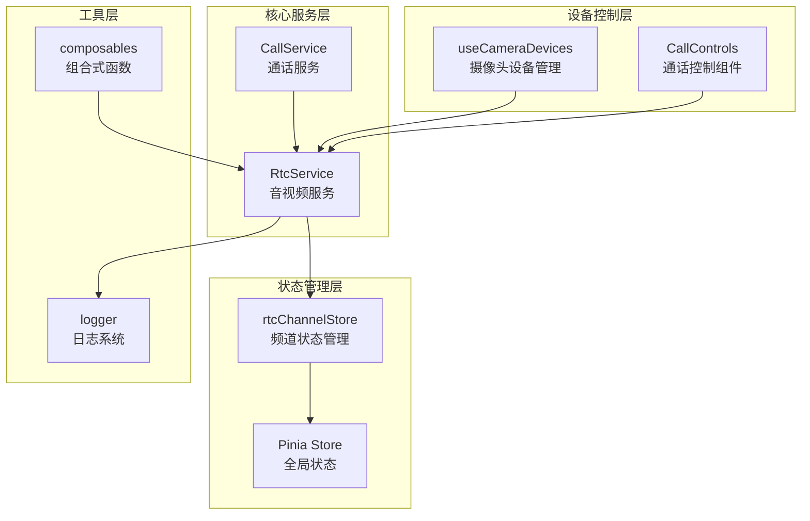

**图表来源**
- [lib/services/RtcService.ts:1-765](file://lib/services/RtcService.ts#L1-L765)
- [lib/store/rtcChannel.ts:1-261](file://lib/store/rtcChannel.ts#L1-L261)
- [callkit/services/CallService.ts:1-800](file://callkit/services/CallService.ts#L1-L800)

**章节来源**
- [lib/services/RtcService.ts:1-765](file://lib/services/RtcService.ts#L1-L765)
- [lib/store/rtcChannel.ts:1-261](file://lib/store/rtcChannel.ts#L1-L261)

## 核心组件

### RtcService 类

RtcService 是音视频服务的核心实现，提供了完整的 WebRTC 功能封装：

#### 核心职责
- 封装 Agora RTC SDK 的所有音视频操作
- 管理音视频设备的访问和控制
- 处理音视频流的发布和订阅
- 提供音视频质量控制和网络监控
- 通过回调函数驱动状态同步，提升可测试性

#### 主要配置选项
- `appId`: Agora 应用标识符
- `encoderConfig`: 视频编码配置预设
- `onNetworkQualityChange`: 网络质量变化回调
- `onUserJoined`: 用户加入回调
- `onUserLeft`: 用户离开回调
- `onUserPublished`: 用户发布媒体回调
- **新增**: `onAudioEnabledChange`: 音频状态变化回调
- **新增**: `onVideoEnabledChange`: 视频状态变化回调
- **新增**: `onLocalStreamChange`: 本地流变化回调
- **新增**: `onUidToUserIdMapping`: UID到用户ID映射回调
- **新增**: `onUserJoinedRtc`: 用户加入RTC回调
- **新增**: `onUserLeftRtc`: 用户离开RTC回调

**章节来源**
- [lib/services/RtcService.ts:29-48](file://lib/services/RtcService.ts#L29-L48)
- [lib/services/RtcService.ts:86-103](file://lib/services/RtcService.ts#L86-L103)

### rtcChannelStore 状态管理

rtcChannelStore 提供了完整的频道状态管理功能：

#### 核心状态属性
- `channels`: 存储所有 RTC 频道信息
- `activeChannelId`: 当前活跃频道标识
- `isConnected`: 连接状态标志
- `localStream`: 本地媒体流
- `remoteStreams`: 远程媒体流映射
- `audioEnabled`: 音频启用状态
- `videoEnabled`: 视频启用状态

#### 主要功能
- 频道创建和管理
- 用户加入/离开跟踪
- 媒体流状态同步
- 通话时长计时
- **新增**: 通过回调函数接收状态同步

**章节来源**
- [lib/store/rtcChannel.ts:12-22](file://lib/store/rtcChannel.ts#L12-L22)
- [lib/store/rtcChannel.ts:62-261](file://lib/store/rtcChannel.ts#L62-L261)

## 架构概览

### 系统架构图

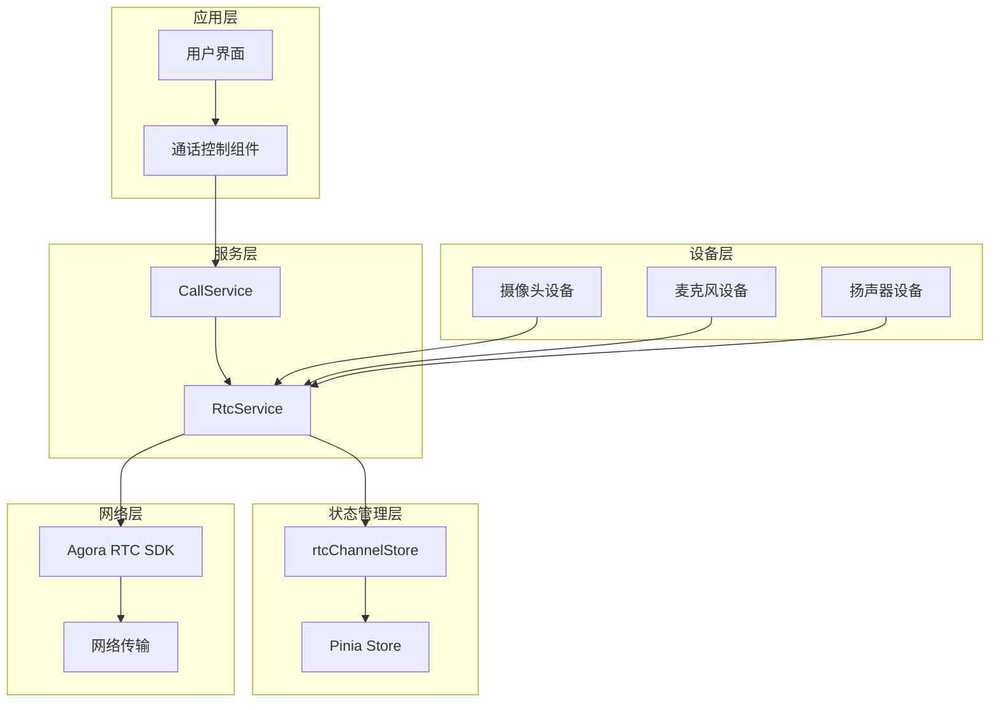

**图表来源**
- [lib/services/RtcService.ts:108-122](file://lib/services/RtcService.ts#L108-L122)
- [lib/store/rtcChannel.ts:80-101](file://lib/store/rtcChannel.ts#L80-L101)

### 数据流架构

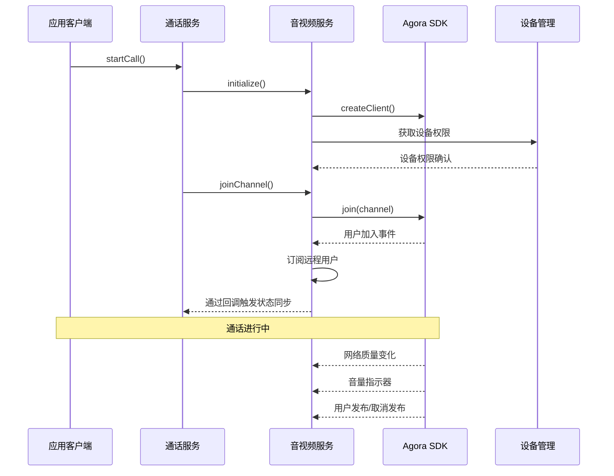

**图表来源**
- [callkit/services/CallService.ts:807-1358](file://callkit/services/CallService.ts#L807-L1358)
- [lib/services/RtcService.ts:143-172](file://lib/services/RtcService.ts#L143-L172)

## 详细组件分析

### RtcService 初始化流程

#### 初始化步骤

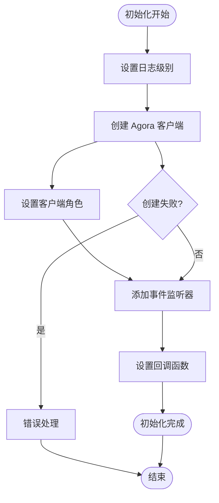

**图表来源**
- [lib/services/RtcService.ts:108-122](file://lib/services/RtcService.ts#L108-L122)

#### 核心初始化方法

初始化过程中，RtcService 执行以下关键操作：

1. **日志配置**: 设置 Agora RTC SDK 的日志级别为详细模式
2. **客户端创建**: 使用 live 模式和 h264 编码创建 RTC 客户端
3. **角色设置**: 将客户端设置为主播角色
4. **事件监听**: 注册所有必要的事件监听器
5. **回调设置**: 设置状态同步回调函数

**章节来源**
- [lib/services/RtcService.ts:108-122](file://lib/services/RtcService.ts#L108-L122)

### 频道管理功能

#### 频道加入流程

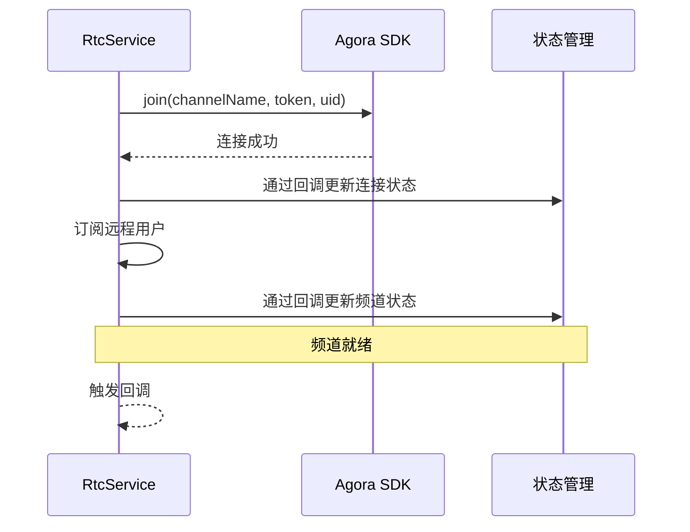

**图表来源**
- [lib/services/RtcService.ts:143-172](file://lib/services/RtcService.ts#L143-L172)

#### 频道离开流程

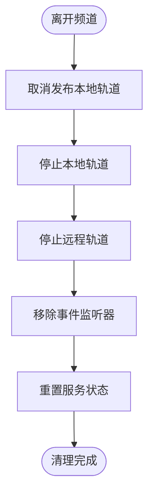

**图表来源**
- [lib/services/RtcService.ts:177-209](file://lib/services/RtcService.ts#L177-L209)

**章节来源**
- [lib/services/RtcService.ts:143-172](file://lib/services/RtcService.ts#L143-L172)
- [lib/services/RtcService.ts:177-209](file://lib/services/RtcService.ts#L177-L209)

### 设备控制功能

#### 摄像头设备管理

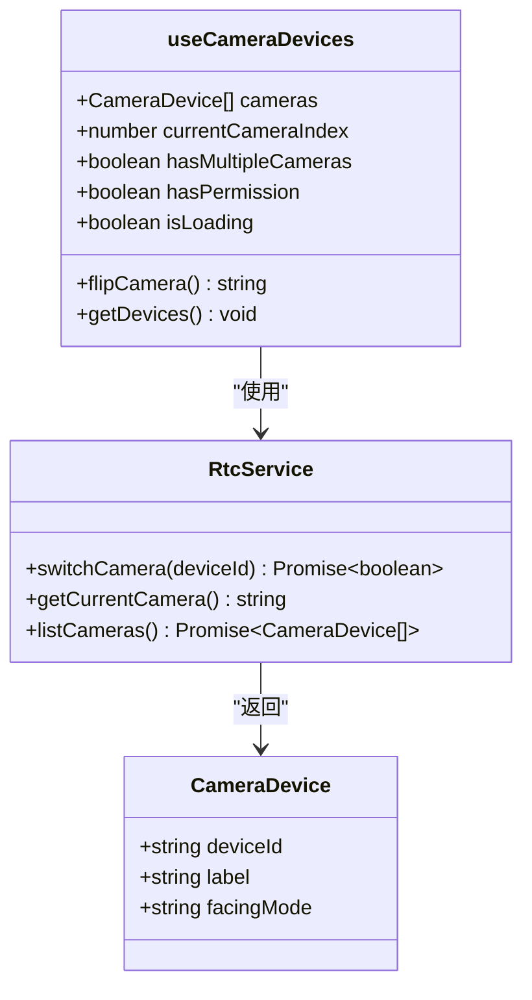

**图表来源**
- [callkit/hooks/useCameraDevices.ts:1-388](file://callkit/hooks/useCameraDevices.ts#L1-L388)
- [lib/services/RtcService.ts:397-413](file://lib/services/RtcService.ts#L397-L413)

#### 音频设备切换

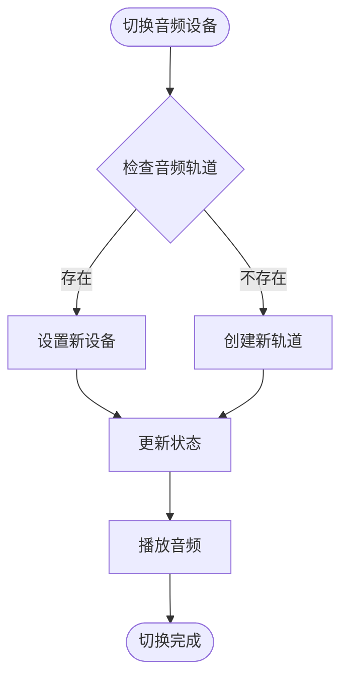

**图表来源**
- [lib/services/RtcService.ts:418-433](file://lib/services/RtcService.ts#L418-L433)

**章节来源**
- [callkit/hooks/useCameraDevices.ts:354-377](file://callkit/hooks/useCameraDevices.ts#L354-L377)
- [lib/services/RtcService.ts:397-433](file://lib/services/RtcService.ts#L397-L433)

### 媒体流处理

#### 本地媒体轨道管理

RtcService 提供了完整的本地媒体轨道管理功能：

1. **音频轨道**: 支持动态启用/禁用和设备切换
2. **视频轨道**: 支持摄像头切换和分辨率配置
3. **媒体流缓存**: 优化媒体流的创建和复用
4. **回调驱动**: 通过 onLocalStreamChange 回调通知状态变化

#### 远程媒体流订阅

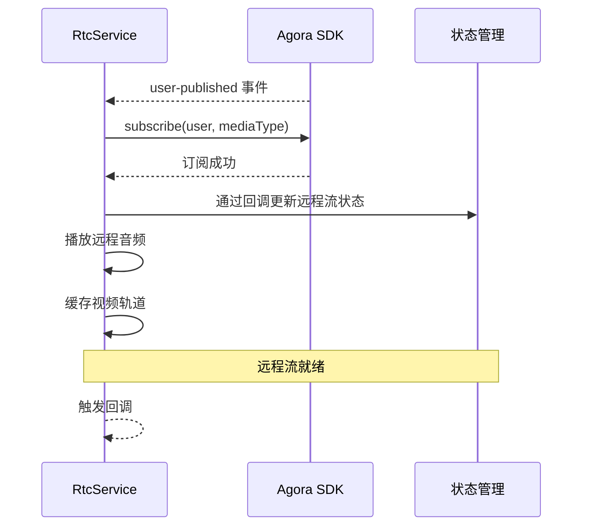

**图表来源**
- [lib/services/RtcService.ts:441-468](file://lib/services/RtcService.ts#L441-L468)

**章节来源**
- [lib/services/RtcService.ts:441-468](file://lib/services/RtcService.ts#L441-L468)

### 连接状态管理

#### 网络质量监控

RtcService 提供了实时的网络质量监控功能：

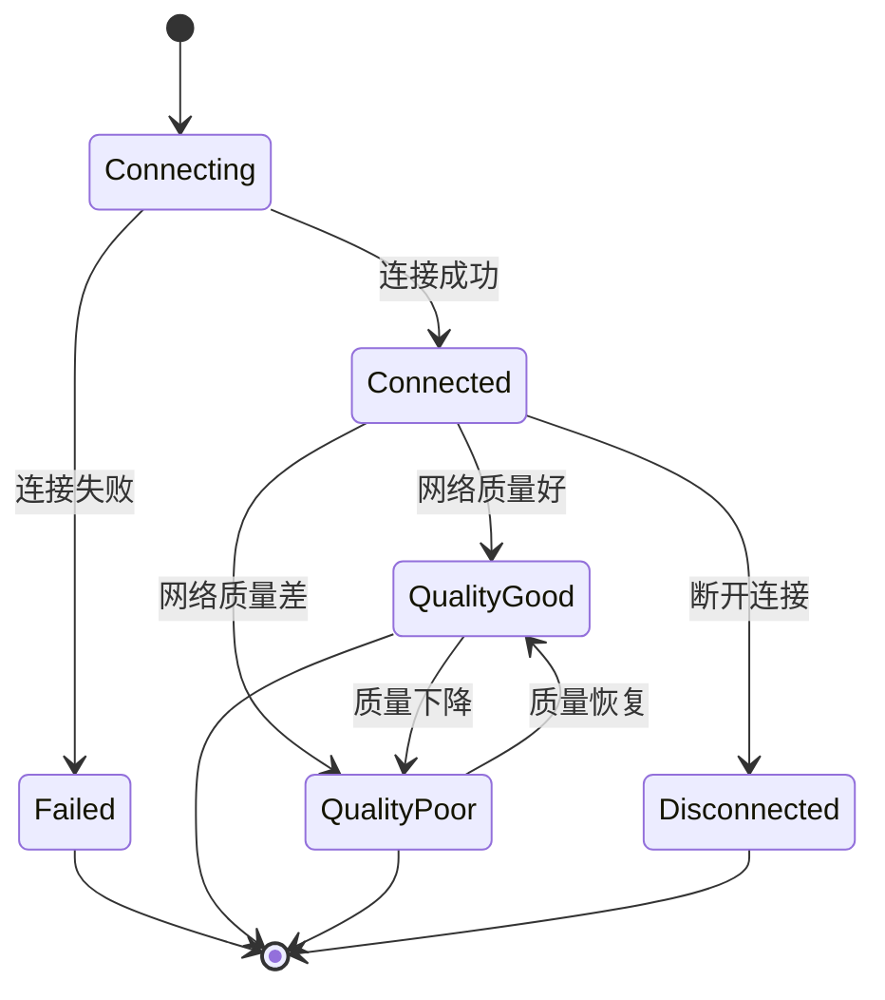

**图表来源**
- [lib/services/RtcService.ts:710-718](file://lib/services/RtcService.ts#L710-L718)

#### 异常断线处理

```mermaid
flowchart TD
Disconnect([检测到断线]) --> CheckReconnect{"检查重连配置"}
CheckReconnect --> |允许重连| AttemptReconnect["尝试重连"]
CheckReconnect --> |不允许重连| Cleanup["清理资源"]
AttemptReconnect --> ReconnectSuccess{"重连成功?"}
ReconnectSuccess --> |是| RestoreState["恢复通话状态"]
ReconnectSuccess --> |否| Cleanup
RestoreState --> ContinueCall["继续通话"]
Cleanup --> EndCall["结束通话"]
ContinueCall --> [*]
EndCall --> [*]
```

**图表来源**
- [lib/services/RtcService.ts:724-765](file://lib/services/RtcService.ts#L724-L765)

**章节来源**
- [lib/services/RtcService.ts:710-765](file://lib/services/RtcService.ts#L710-L765)

### 回调驱动状态管理

#### 状态同步机制

**更新** RtcService 现在采用回调驱动的状态管理模式，替代了直接写入 Pinia store 的方式：

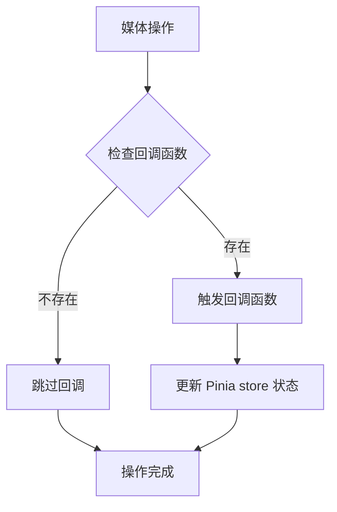

**图表来源**
- [lib/services/RtcService.ts:221-222](file://lib/services/RtcService.ts#L221-L222)
- [lib/services/RtcService.ts:245-246](file://lib/services/RtcService.ts#L245-L246)
- [lib/services/RtcService.ts:291-292](file://lib/services/RtcService.ts#L291-L292)

#### 状态同步回调函数

RtcService 提供了以下状态同步回调函数：

1. **音频状态回调**: `onAudioEnabledChange(enabled: boolean)`
2. **视频状态回调**: `onVideoEnabledChange(enabled: boolean)`
3. **本地流回调**: `onLocalStreamChange(stream: MediaStream | null)`
4. **用户映射回调**: `onUidToUserIdMapping(uid: string, userId: string)`
5. **用户加入RTC回调**: `onUserJoinedRtc(userId: string)`
6. **用户离开RTC回调**: `onUserLeftRtc(userId: string)`
7. **网络质量回调**: `onNetworkQualityChange(quality: any)`
8. **音量指示回调**: `onVolumeIndicator(volumes: any[])`

**章节来源**
- [lib/services/RtcService.ts:77-84](file://lib/services/RtcService.ts#L77-L84)
- [lib/services/RtcService.ts:221-222](file://lib/services/RtcService.ts#L221-L222)
- [lib/services/RtcService.ts:245-246](file://lib/services/RtcService.ts#L245-L246)
- [lib/services/RtcService.ts:291-292](file://lib/services/RtcService.ts#L291-L292)

## 依赖关系分析

### 核心依赖关系

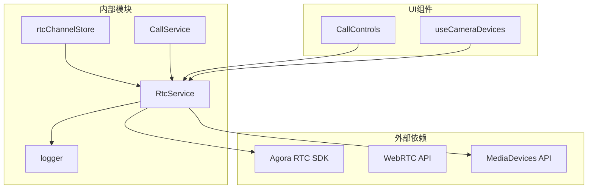

**图表来源**
- [lib/services/RtcService.ts:18-28](file://lib/services/RtcService.ts#L18-L28)
- [lib/store/rtcChannel.ts:3-5](file://lib/store/rtcChannel.ts#L3-L5)

### 状态依赖关系

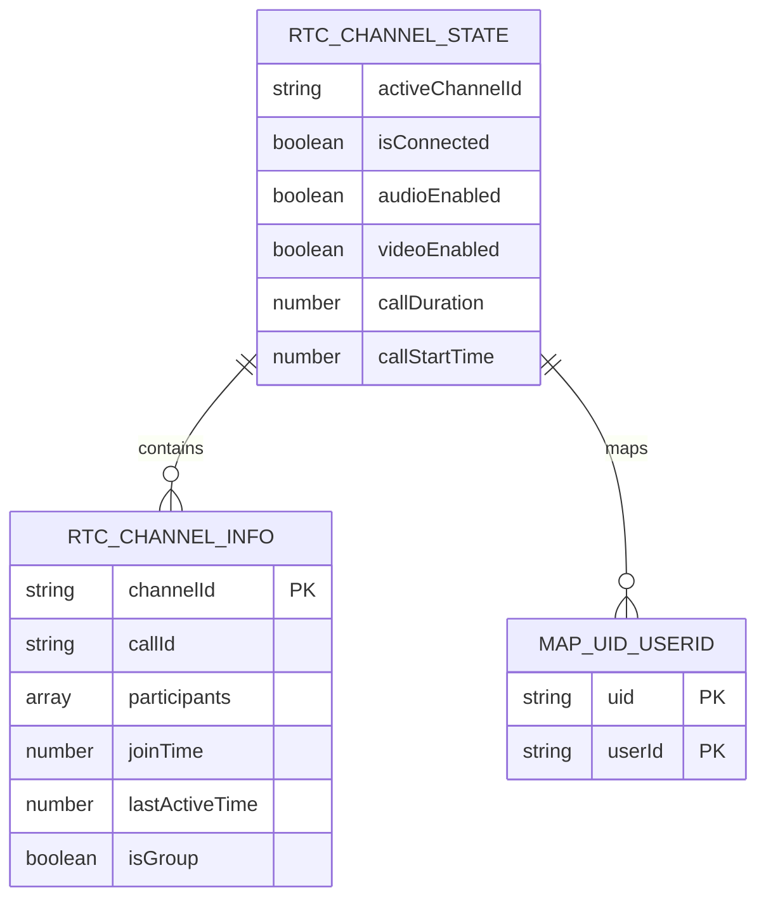

**图表来源**
- [lib/store/types.ts:54-75](file://lib/store/types.ts#L54-L75)
- [lib/store/types.ts:67-75](file://lib/store/types.ts#L67-L75)

**章节来源**
- [lib/store/types.ts:54-75](file://lib/store/types.ts#L54-L75)

## 性能考虑

### 优化策略

#### 资源管理优化
- **轨道复用**: 避免重复创建媒体轨道，使用缓存机制
- **内存清理**: 及时停止和清理不再使用的媒体轨道
- **设备资源**: 合理管理摄像头和麦克风的硬件资源
- **回调优化**: 通过回调函数减少不必要的状态同步

#### 网络优化
- **自适应码率**: 根据网络质量动态调整视频质量
- **缓冲策略**: 优化媒体流的缓冲和播放策略
- **连接池**: 复用 Agora 客户端连接

#### UI性能优化
- **懒加载**: 延迟加载远程用户的媒体流
- **虚拟化**: 对于大型会议使用虚拟化技术
- **批量更新**: 批量更新 UI 状态减少重绘
- **回调驱动**: 通过回调函数精确控制状态更新时机

### 性能监控指标

| 指标类型 | 目标值 | 监控方法 |
|---------|--------|----------|
| 音频延迟 | < 150ms | 音量指示器和网络质量 |
| 视频延迟 | < 300ms | 帧率和丢包率 |
| CPU 使用率 | < 80% | 浏览器性能 API |
| 内存使用 | < 512MB | 内存监控 API |

## 故障排除指南

### 常见问题及解决方案

#### 设备权限问题

**问题**: 摄像头或麦克风权限被拒绝
**解决方案**:
1. 检查浏览器权限设置
2. 确认 HTTPS 环境
3. 重新请求权限
4. 检查设备是否被其他应用占用

#### 连接失败问题

**问题**: 无法加入 RTC 频道
**解决方案**:
1. 验证 appId 和 token 配置
2. 检查网络连接状态
3. 确认用户身份验证
4. 查看 Agora 控制台状态

#### 音视频质量问题

**问题**: 音频卡顿或视频模糊
**解决方案**:
1. 降低视频分辨率
2. 关闭不必要的后台应用
3. 检查网络带宽
4. 调整编码参数

#### 性能问题

**问题**: 应用运行缓慢或崩溃
**解决方案**:
1. 检查内存泄漏
2. 优化媒体轨道管理
3. 减少并发连接数
4. 清理缓存数据

#### 回调函数问题

**问题**: 状态不同步或回调未触发
**解决方案**:
1. 检查回调函数是否正确设置
2. 确认回调函数的执行上下文
3. 验证回调函数的参数传递
4. 查看日志输出确认回调执行

**章节来源**
- [lib/services/RtcService.ts:177-209](file://lib/services/RtcService.ts#L177-L209)

### 调试技巧

#### 日志分析
- 启用详细日志模式
- 监控关键事件的时间戳
- 分析错误堆栈信息
- 跟踪状态变化轨迹

#### 性能分析
- 使用浏览器开发者工具
- 监控内存使用情况
- 分析网络请求
- 检查 GPU 使用率

#### 回调调试
- 在回调函数中添加日志输出
- 验证回调函数的执行顺序
- 检查回调函数的参数完整性
- 确认回调函数的异步处理

## 结论

RtcService 作为本项目的核心音视频服务，提供了完整而强大的 WebRTC 功能封装。通过模块化的设计和完善的错误处理机制，该服务能够满足各种复杂的音视频通话需求。

### 主要优势

1. **完整的功能覆盖**: 从设备管理到频道控制的全栈解决方案
2. **优秀的性能表现**: 通过多种优化策略确保流畅的用户体验
3. **健壮的错误处理**: 完善的异常处理和恢复机制
4. **灵活的配置选项**: 支持多种定制化需求
5. **清晰的架构设计**: 模块化结构便于维护和扩展
6. **回调驱动状态管理**: 通过回调函数实现状态同步，提升可测试性和可维护性

### 未来发展方向

1. **增强的网络适配**: 更智能的自适应码率算法
2. **更好的移动端支持**: 针对移动设备的优化
3. **AI 功能集成**: 集成 AI 增强功能如降噪、美颜等
4. **更丰富的 UI 组件**: 提供更多样化的界面组件
5. **回调函数优化**: 进一步完善回调驱动的状态管理模式

## 附录

### 集成示例

#### 基本集成步骤

```typescript
// 1. 初始化 RTC 服务
const rtcService = new RtcService({
  appId: 'your-app-id',
  onNetworkQualityChange: (quality) => console.log('网络质量:', quality),
  onUserJoined: (userId) => console.log('用户加入:', userId),
  onUserLeft: (userId) => console.log('用户离开:', userId),
  // 新增回调函数
  onAudioEnabledChange: (enabled) => console.log('音频状态:', enabled),
  onVideoEnabledChange: (enabled) => console.log('视频状态:', enabled),
  onLocalStreamChange: (stream) => console.log('本地流变化:', stream),
  onUidToUserIdMapping: (uid, userId) => console.log('用户映射:', uid, userId),
  onUserJoinedRtc: (userId) => console.log('用户加入RTC:', userId),
  onUserLeftRtc: (userId) => console.log('用户离开RTC:', userId)
});

await rtcService.initialize();

// 2. 加入频道
const uid = await rtcService.joinChannel(
  'channel-name',
  'token',
  12345
);

// 3. 管理媒体流
await rtcService.publishLocalAudio();
await rtcService.publishLocalVideo();

// 4. 处理远程用户
rtcService.onUserPublished = (user, mediaType) => {
  if (mediaType === 'video') {
    rtcService.subscribeRemoteUser(user, 'video');
  }
};
```

#### 高级配置选项

```typescript
const advancedConfig = {
  // 编码配置
  encoderConfig: '720p_3',
  
  // 网络优化
  onNetworkQualityChange: (quality) => {
    // 根据网络质量调整参数
    if (quality.downlinkNetworkQuality < 3) {
      // 降低视频质量
    }
  },
  
  // 设备管理
  onUserJoined: async (userId) => {
    // 自动检测设备能力
    const devices = await rtcService.listCameras();
    if (devices.length > 1) {
      // 提供设备切换选项
    }
  },
  
  // 状态同步
  onAudioEnabledChange: (enabled) => {
    // 同步音频状态到 UI
    updateAudioUI(enabled);
  },
  onVideoEnabledChange: (enabled) => {
    // 同步视频状态到 UI
    updateVideoUI(enabled);
  }
};
```

### API 参考

#### 核心方法

| 方法名 | 参数 | 返回值 | 描述 |
|--------|------|--------|------|
| initialize | config | Promise<void> | 初始化 RTC 服务 |
| joinChannel | channelName, token, uid | Promise<number\|string> | 加入 RTC 频道 |
| leaveChannel |  | Promise<void> | 离开当前频道 |
| publishLocalAudio |  | Promise<void> | 发布本地音频轨道 |
| publishLocalVideo |  | Promise<void> | 发布本地视频轨道 |
| subscribeRemoteUser | user, mediaType | Promise<void> | 订阅远程用户媒体流 |
| destroy |  | Promise<void> | 销毁 RTC 服务 |

#### 状态查询方法

| 方法名 | 返回值 | 描述 |
|--------|--------|------|
| isMuted | boolean | 检查音频是否静音 |
| isCameraEnabled | boolean | 检查摄像头是否开启 |
| getClient | IAgoraRTCClient | 获取 RTC 客户端实例 |
| getLocalVideoStream | MediaStream | 获取本地视频流 |

#### 回调函数配置

| 回调函数名 | 参数 | 描述 |
|------------|------|------|
| onNetworkQualityChange | quality: any | 网络质量变化回调 |
| onUserJoined | userId: string | 用户加入回调 |
| onUserLeft | userId: string | 用户离开回调 |
| onUserPublished | user: IAgoraRTCRemoteUser, mediaType: 'audio'\|'video' | 用户发布媒体回调 |
| onUserUnpublished | user: IAgoraRTCRemoteUser, mediaType: 'audio'\|'video' | 用户取消发布回调 |
| onVolumeIndicator | volumes: any[] | 音量指示器回调 |
| onAudioEnabledChange | enabled: boolean | 音频状态变化回调 |
| onVideoEnabledChange | enabled: boolean | 视频状态变化回调 |
| onLocalStreamChange | stream: MediaStream \| null | 本地流变化回调 |
| onUidToUserIdMapping | uid: string, userId: string | UID到用户ID映射回调 |
| onUserJoinedRtc | userId: string | 用户加入RTC回调 |
| onUserLeftRtc | userId: string | 用户离开RTC回调 |

**章节来源**
- [lib/services/RtcService.ts:29-48](file://lib/services/RtcService.ts#L29-L48)
- [lib/services/RtcService.ts:543-559](file://lib/services/RtcService.ts#L543-L559)
- [lib/services/RtcService.ts:724-765](file://lib/services/RtcService.ts#L724-L765)