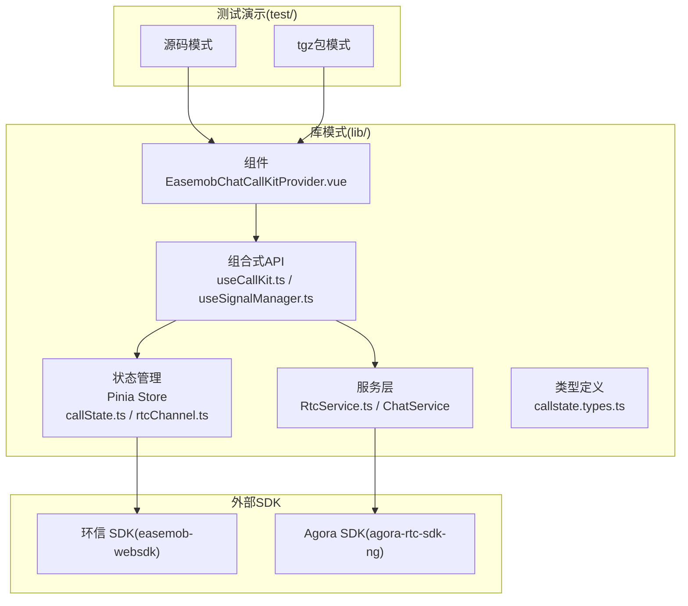
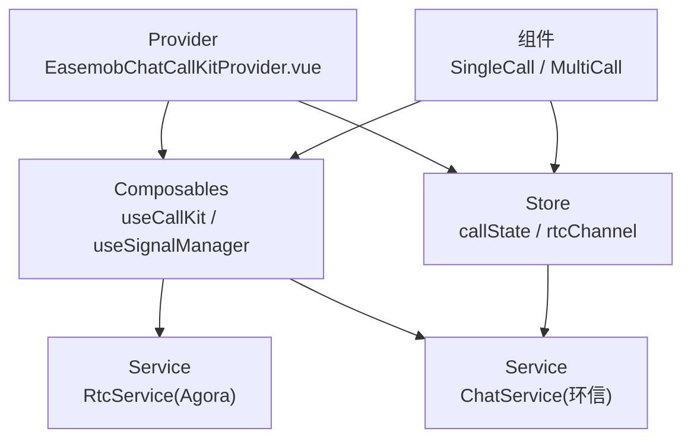
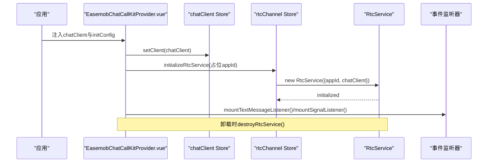
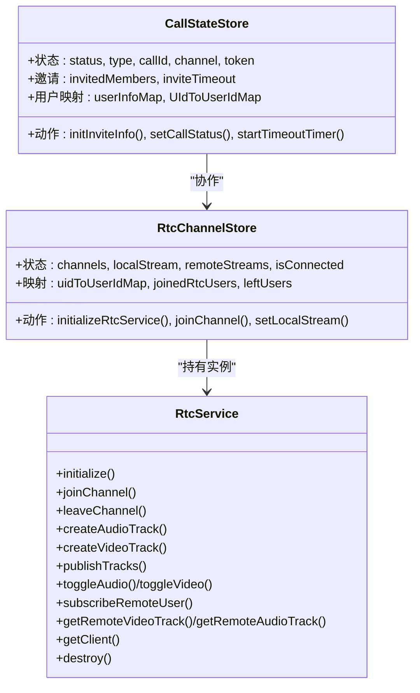
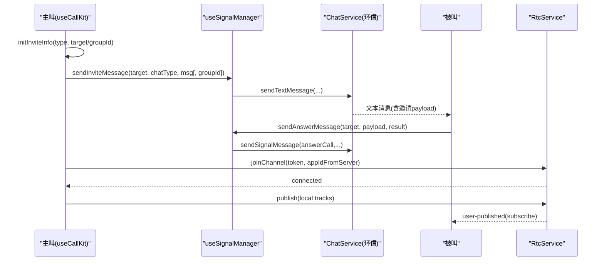
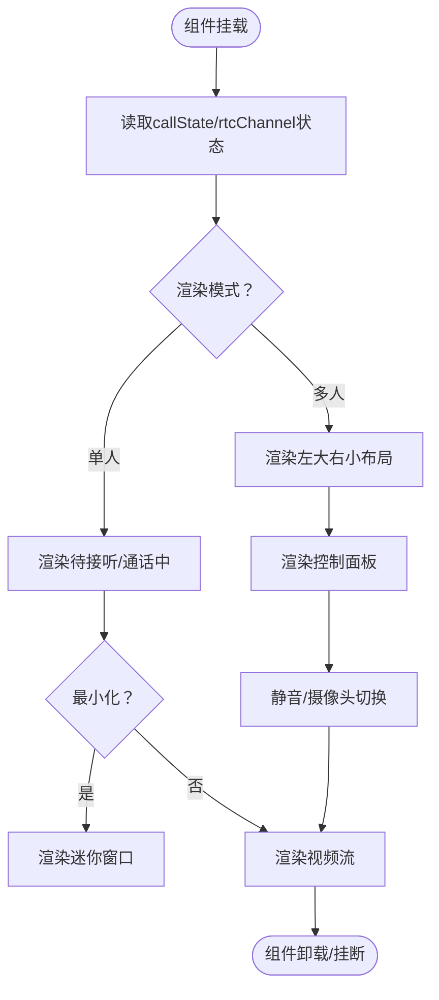
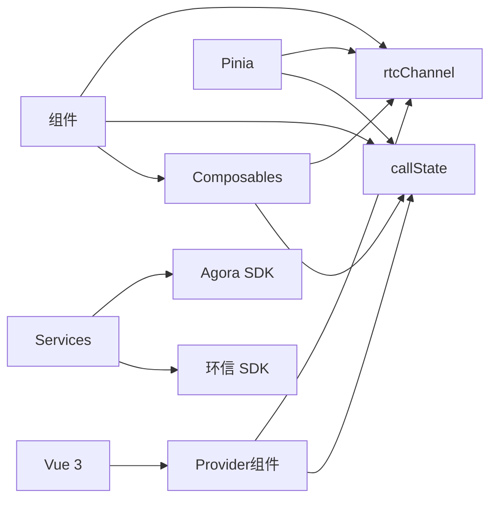

# 架构设计

<cite>
**本文档引用的文件**
- [README.md](file://README.md)
- [package.json](file://package.json)
- [lib/index.ts](file://lib/index.ts)
- [lib/components/EasemobChatCallKitProvider.vue](file://lib/components/EasemobChatCallKitProvider.vue)
- [lib/services/RtcService.ts](file://lib/services/RtcService.ts)
- [lib/store/callState.ts](file://lib/store/callState.ts)
- [lib/store/rtcChannel.ts](file://lib/store/rtcChannel.ts)
- [lib/composables/useCallKit.ts](file://lib/composables/useCallKit.ts)
- [lib/composables/useSignalManager.ts](file://lib/composables/useSignalManager.ts)
- [lib/types/callstate.types.ts](file://lib/types/callstate.types.ts)
- [lib/components/singleCall/EasemobChatSingleCall.vue](file://lib/components/singleCall/EasemobChatSingleCall.vue)
- [lib/components/multiCall/EasemobChatMultiCall.vue](file://lib/components/multiCall/EasemobChatMultiCall.vue)
</cite>

## 目录
1. [引言](#引言)
2. [项目结构](#项目结构)
3. [核心组件](#核心组件)
4. [架构总览](#架构总览)
5. [详细组件分析](#详细组件分析)
6. [依赖分析](#依赖分析)
7. [性能考量](#性能考量)
8. [故障排查指南](#故障排查指南)
9. [结论](#结论)
10. [附录](#附录)

## 引言
本项目为 Easemob Chat CallKit Vue3 插件，提供环信聊天与音视频通话能力的统一集成方案。系统采用 Provider-Consumer 模式与 Store-Service 分层架构，围绕 Pinia Store 管理全局状态，通过组合式 API（Composables）封装业务逻辑，结合环信 SDK 与 Agora RTC SDK 实现信令与媒体传输。本文档系统阐述整体架构、分层设计、核心理念、组件交互与数据流、系统边界、技术决策与权衡，并给出架构图与组件关系图，帮助开发者快速理解与扩展。

## 项目结构
项目采用“库模式”与“测试演示”双路径并行：
- 库模式：lib/ 为核心源码，提供 Vue 插件注册、Provider 组件、Store、Service、Composables、组件与类型定义。
- 测试演示：test/ 提供本地验证与 tgz 包模式的演示页面，支持源码模式与打包产物模式自动切换。
- 构建产物：release/dist/ 输出标准库产物，便于发布与集成。

**图表来源**
- [lib/index.ts](file://lib/index.ts#L45-L55)
- [lib/components/EasemobChatCallKitProvider.vue](file://lib/components/EasemobChatCallKitProvider.vue#L1-L115)
- [lib/services/RtcService.ts](file://lib/services/RtcService.ts#L1-L719)
- [lib/store/callState.ts](file://lib/store/callState.ts#L1-L263)
- [lib/store/rtcChannel.ts](file://lib/store/rtcChannel.ts#L1-L410)
- [lib/composables/useCallKit.ts](file://lib/composables/useCallKit.ts#L1-L123)
- [lib/composables/useSignalManager.ts](file://lib/composables/useSignalManager.ts#L1-L354)
- [package.json](file://package.json#L47-L51)

**章节来源**
- [README.md](file://README.md#L5-L31)
- [package.json](file://package.json#L1-L53)

## 核心组件
- Provider 组件：负责初始化与注入全局配置、聊天客户端、RTC 服务与事件监听器，确保应用上下文具备通话能力。
- 组合式 API：useCallKit、useSignalManager、useJoinChannel 等，封装发起/应答/挂断等业务流程与信令发送。
- 服务层：RtcService 封装 Agora WebRTC 能力；ChatService（由 useSignalManager 内部使用）封装环信文本/信令消息发送。
- 状态管理：Pinia Store 管理通话状态、邀请信息、用户映射、频道与媒体流等。
- 组件层：单人/多人通话 UI 组件，负责渲染视频流、控制面板与交互。

**章节来源**
- [lib/components/EasemobChatCallKitProvider.vue](file://lib/components/EasemobChatCallKitProvider.vue#L1-L115)
- [lib/composables/useCallKit.ts](file://lib/composables/useCallKit.ts#L1-L123)
- [lib/composables/useSignalManager.ts](file://lib/composables/useSignalManager.ts#L1-L354)
- [lib/services/RtcService.ts](file://lib/services/RtcService.ts#L1-L719)
- [lib/store/callState.ts](file://lib/store/callState.ts#L1-L263)
- [lib/store/rtcChannel.ts](file://lib/store/rtcChannel.ts#L1-L410)

## 架构总览
系统采用 Provider-Consumer 模式与 Store-Service 分层架构：
- Provider 负责装配全局依赖（聊天客户端、RTC 服务、事件监听器）。
- Composables 作为业务编排层，协调 Store 与 Service。
- Store 聚合状态并提供计算属性与动作，驱动 UI 与业务流程。
- Service 封装具体 SDK 能力，屏蔽平台差异。

**图表来源**
- [lib/components/EasemobChatCallKitProvider.vue](file://lib/components/EasemobChatCallKitProvider.vue#L59-L103)
- [lib/composables/useCallKit.ts](file://lib/composables/useCallKit.ts#L9-L123)
- [lib/composables/useSignalManager.ts](file://lib/composables/useSignalManager.ts#L50-L354)
- [lib/services/RtcService.ts](file://lib/services/RtcService.ts#L42-L77)
- [lib/store/callState.ts](file://lib/store/callState.ts#L7-L37)
- [lib/store/rtcChannel.ts](file://lib/store/rtcChannel.ts#L7-L28)

## 详细组件分析

### Provider-Consumer 模式
- Provider 负责：
  - 合并默认与用户配置，形成全局配置对象。
  - 初始化并注入聊天客户端到 Store。
  - 初始化 RTC 服务（占位 appId，实际由信令动态下发）。
  - 挂载文本消息与信令事件监听器。
  - 组件卸载时销毁 RTC 服务。
- Consumer（各业务组件与 Composables）通过 Store 与 Composables 获取上下文与能力。

**图表来源**
- [lib/components/EasemobChatCallKitProvider.vue](file://lib/components/EasemobChatCallKitProvider.vue#L19-L113)
- [lib/store/rtcChannel.ts](file://lib/store/rtcChannel.ts#L84-L121)

**章节来源**
- [lib/components/EasemobChatCallKitProvider.vue](file://lib/components/EasemobChatCallKitProvider.vue#L1-L115)

### Store-Service 分层架构
- Store 层：
  - callState：管理通话状态机、邀请信息、用户映射、超时计时等。
  - rtcChannel：管理频道、媒体流、UID/UserId 映射、计时器、加入/离开用户集合等。
- Service 层：
  - RtcService：封装 Agora WebRTC 客户端生命周期、轨道管理、订阅/发布、网络质量与音量指示。
  - ChatService：由 useSignalManager 使用，封装环信文本消息与信令消息发送。

**图表来源**
- [lib/store/callState.ts](file://lib/store/callState.ts#L7-L206)
- [lib/store/rtcChannel.ts](file://lib/store/rtcChannel.ts#L7-L410)
- [lib/services/RtcService.ts](file://lib/services/RtcService.ts#L42-L719)

**章节来源**
- [lib/store/callState.ts](file://lib/store/callState.ts#L1-L263)
- [lib/store/rtcChannel.ts](file://lib/store/rtcChannel.ts#L1-L410)
- [lib/services/RtcService.ts](file://lib/services/RtcService.ts#L1-L719)

### 信令实现机制
- useSignalManager 统一封装所有通话信令发送：
  - 邀请：sendInviteMessage（单聊/群聊）。
  - 应答：sendAnswerMessage（accept/refuse/busy）。
  - 取消/离开：sendCancelMessage/sendLeaveMessage。
  - 确认响铃/被叫状态：sendConfirmRingMessage/sendConfirmCalleeMessage。
- useCallKit 编排发起流程：初始化邀请信息 -> 发送邀请信令 -> 群呼场景立即加入频道。
- 信令承载于环信 SDK 文本消息通道，配合 RTC 频道令牌与 UID/UserId 映射完成端到端通话建立。

**图表来源**
- [lib/composables/useCallKit.ts](file://lib/composables/useCallKit.ts#L13-L117)
- [lib/composables/useSignalManager.ts](file://lib/composables/useSignalManager.ts#L73-L102)
- [lib/services/RtcService.ts](file://lib/services/RtcService.ts#L109-L138)

**章节来源**
- [lib/composables/useCallKit.ts](file://lib/composables/useCallKit.ts#L1-L123)
- [lib/composables/useSignalManager.ts](file://lib/composables/useSignalManager.ts#L1-L354)
- [lib/types/callstate.types.ts](file://lib/types/callstate.types.ts#L1-L93)

### 单人/多人通话组件交互
- 单人通话组件：
  - 根据状态渲染“待接听/通话中/最小化窗口”，通过 Store 管理 INVITING/IN_CALL 等状态。
  - 支持最小化与展开，展开后触发窗口扩展事件以恢复视频播放。
- 多人通话组件：
  - 左大右小布局，主视频与侧栏缩略图联动。
  - 邀请超时管理、远程用户轮询订阅、音频轨道检测、清屏模式等增强体验。
  - 通过 RtcService 渲染本地/远程视频流，支持静音/摄像头切换。

**图表来源**
- [lib/components/singleCall/EasemobChatSingleCall.vue](file://lib/components/singleCall/EasemobChatSingleCall.vue#L1-L134)
- [lib/components/multiCall/EasemobChatMultiCall.vue](file://lib/components/multiCall/EasemobChatMultiCall.vue#L1-L800)

**章节来源**
- [lib/components/singleCall/EasemobChatSingleCall.vue](file://lib/components/singleCall/EasemobChatSingleCall.vue#L1-L134)
- [lib/components/multiCall/EasemobChatMultiCall.vue](file://lib/components/multiCall/EasemobChatMultiCall.vue#L1-L800)

## 依赖分析
- 外部依赖：
  - Vue 3 生态：Vue、Pinia。
  - 环信 SDK：easemob-websdk，用于聊天与信令。
  - Agora SDK：agora-rtc-sdk-ng，用于音视频媒体传输。
- 内部模块耦合：
  - Provider 依赖 Store 与 Composables；Composables 依赖 Store 与 Service；Service 依赖 SDK。
  - Store 之间通过 getter/action 协作，避免循环依赖。

**图表来源**
- [package.json](file://package.json#L33-L51)
- [lib/index.ts](file://lib/index.ts#L1-L55)
- [lib/store/callState.ts](file://lib/store/callState.ts#L1-L263)
- [lib/store/rtcChannel.ts](file://lib/store/rtcChannel.ts#L1-L410)
- [lib/services/RtcService.ts](file://lib/services/RtcService.ts#L1-L719)

**章节来源**
- [package.json](file://package.json#L1-L53)
- [lib/index.ts](file://lib/index.ts#L1-L55)

## 性能考量
- 渲染优化：
  - 多人通话组件对视频元素去重渲染与渲染锁，避免并发更新导致的卡顿。
  - 防抖渲染函数 scheduleRender 控制渲染频率。
- 资源管理：
  - 组件卸载与挂断流程中，统一清理定时器、停止轨道、销毁 RTC 服务，防止内存泄漏。
- 状态粒度：
  - Store 将 UI 状态与业务状态分离，减少无关响应式更新。
- 网络与媒体：
  - RtcService 提供网络质量与音量指示回调，便于前端做降级策略（如降低分辨率）。

[本节为通用指导，不直接分析具体文件]

## 故障排查指南
- 无法发起通话：
  - 检查 Provider 是否注入 chatClient；确认 useCallKit 调用前 Provider 已挂载。
  - 查看信令发送日志，确认 sendInviteMessage 返回与消息 ID。
- 无法加入频道：
  - 确认信令已携带 token 与 appId（由服务端下发），RtcService.joinChannel 参数正确。
  - 检查 UID/UserId 映射是否建立，事件 user-joined 是否触发。
- 视频无法播放：
  - 检查本地/远程轨道是否存在，remoteUsers 是否已订阅。
  - 确认渲染函数已执行且 video 元素未重复设置 srcObject。
- 被叫无声音：
  - 检查远端音频轨道是否订阅成功，播放是否报错。
  - 确认 isMuted 与 isAudioEnabled 状态一致。

**章节来源**
- [lib/composables/useCallKit.ts](file://lib/composables/useCallKit.ts#L13-L50)
- [lib/composables/useSignalManager.ts](file://lib/composables/useSignalManager.ts#L73-L102)
- [lib/services/RtcService.ts](file://lib/services/RtcService.ts#L400-L488)
- [lib/components/multiCall/EasemobChatMultiCall.vue](file://lib/components/multiCall/EasemobChatMultiCall.vue#L459-L590)

## 结论
本架构以 Provider-Consumer 与 Store-Service 分层为核心，通过 Pinia 统一状态管理，用 Composables 编排业务流程，借助环信与 Agora SDK 实现可靠的信令与媒体传输。系统具备清晰的模块边界、良好的可扩展性与可观测性，适合在复杂业务场景中复用与演进。

[本节为总结性内容，不直接分析具体文件]

## 附录
- 系统边界：
  - 业务边界：通话发起、应答、挂断、邀请管理、UI 控制。
  - 技术边界：环信 SDK 负责消息与信令，Agora SDK 负责媒体传输。
- 技术决策与权衡：
  - 使用 Pinia 替代 Vuex，简化状态管理与 TS 支持。
  - 将 RTC 初始化占位 appId，运行时由信令动态替换，提升安全性与灵活性。
  - 多人通话采用“左大右小”布局与邀请超时管理，兼顾易用性与稳定性。

[本节为补充说明，不直接分析具体文件]