# 架构设计

<cite>
**本文档引用的文件**
- [README.md](file://README.md)
- [package.json](file://package.json)
- [lib/index.ts](file://lib/index.ts)
- [lib/components/EasemobChatCallKitProvider.vue](file://lib/components/EasemobChatCallKitProvider.vue)
- [lib/services/RtcService.ts](file://lib/services/RtcService.ts)
- [lib/store/callState.ts](file://lib/store/callState.ts)
- [lib/store/rtcChannel.ts](file://lib/store/rtcChannel.ts)
- [lib/composables/useCallKit.ts](file://lib/composables/useCallKit.ts)
- [lib/composables/useSignalManager.ts](file://lib/composables/useSignalManager.ts)
- [lib/composables/useListenerManager.ts](file://lib/composables/useListenerManager.ts)
- [lib/composables/useCallKitEvents.ts](file://lib/composables/useCallKitEvents.ts)
- [lib/signaling/SignalRouter.ts](file://lib/signaling/SignalRouter.ts)
- [lib/signaling/SingleCallSignalHandler.ts](file://lib/signaling/SingleCallSignalHandler.ts)
- [lib/signaling/GroupCallSignalHandler.ts](file://lib/signaling/GroupCallSignalHandler.ts)
- [lib/core/events/CallKitEventBus.ts](file://lib/core/events/CallKitEventBus.ts)
- [lib/core/events/helpers.ts](file://lib/core/events/helpers.ts)
- [lib/core/events/types.ts](file://lib/core/events/types.ts)
- [lib/store/globalCall.ts](file://lib/store/globalCall.ts)
- [lib/modules/groupCall/index.ts](file://lib/modules/groupCall/index.ts)
- [skills/callkit-architecture.md](file://skills/callkit-architecture.md)
</cite>

## 更新摘要
**变更内容**
- 新增多端一致性架构设计章节，涵盖设备标识校验、多端抢占处理
- 新增离线消息处理机制，包括时间戳过期过滤和重连状态恢复
- 新增事件系统设计，包括类型安全的事件总线和标准化事件负载
- 新增状态管理策略，涵盖单聊/群聊状态分离和全局状态共享
- 新增信令协议设计，包括设备标识字段和扩展字段预留
- 新增 RTC 服务抽象设计，包括服务去状态化和适配器模式
- 新增错误处理与降级策略，涵盖超时处理和异常恢复

## 目录
1. [引言](#引言)
2. [项目结构](#项目结构)
3. [核心组件](#核心组件)
4. [架构总览](#架构总览)
5. [详细组件分析](#详细组件分析)
6. [多端一致性架构](#多端一致性架构)
7. [离线消息处理机制](#离线消息处理机制)
8. [事件系统设计](#事件系统设计)
9. [状态管理策略](#状态管理策略)
10. [信令协议设计](#信令协议设计)
11. [RTC 服务抽象](#rtc-服务抽象)
12. [错误处理与降级](#错误处理与降级)
13. [依赖分析](#依赖分析)
14. [性能考量](#性能考量)
15. [故障排查指南](#故障排查指南)
16. [结论](#结论)
17. [附录](#附录)

## 引言
本项目为 Easemob Chat CallKit Vue3 插件，提供环信聊天与音视频通话能力的统一集成方案。系统采用 Provider-Consumer 模式与 Store-Service 分层架构，围绕 Pinia Store 管理全局状态，通过组合式 API（Composables）封装业务逻辑，结合环信 SDK 与 Agora RTC SDK 实现信令与媒体传输。

**更新** 本次更新重点反映了最新的架构设计决策，包括多端一致性、离线消息处理、事件系统设计等关键架构决策，这些决策直接影响系统的可靠性、可扩展性和用户体验。

## 项目结构
项目采用"库模式"与"测试演示"双路径并行：
- 库模式：lib/ 为核心源码，提供 Vue 插件注册、Provider 组件、Store、Service、Composables、组件与类型定义。
- 测试演示：test/ 提供本地验证与 tgz 包模式的演示页面，支持源码模式与打包产物模式自动切换。
- 构建产物：release/dist/ 输出标准库产物，便于发布与集成。
- 技术文档：skills/ 目录包含架构设计文档和集成指南。

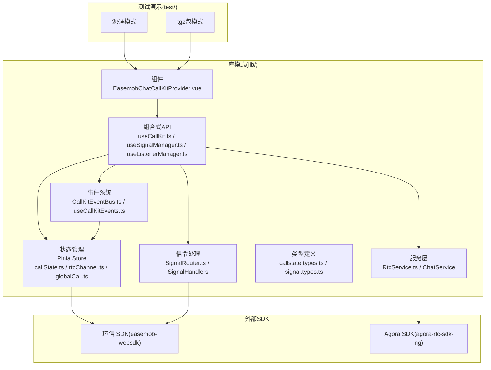

**图表来源**
- [lib/index.ts:45-55](file://lib/index.ts#L45-L55)
- [lib/components/EasemobChatCallKitProvider.vue:1-115](file://lib/components/EasemobChatCallKitProvider.vue#L1-L115)
- [lib/services/RtcService.ts:1-719](file://lib/services/RtcService.ts#L1-L719)
- [lib/store/callState.ts:1-263](file://lib/store/callState.ts#L1-L263)
- [lib/store/rtcChannel.ts:1-410](file://lib/store/rtcChannel.ts#L1-L410)
- [lib/composables/useCallKit.ts:1-123](file://lib/composables/useCallKit.ts#L1-L123)
- [lib/composables/useSignalManager.ts:1-354](file://lib/composables/useSignalManager.ts#L1-L354)
- [lib/composables/useListenerManager.ts:1-307](file://lib/composables/useListenerManager.ts#L1-L307)
- [lib/signaling/SignalRouter.ts:1-37](file://lib/signaling/SignalRouter.ts#L1-L37)
- [lib/core/events/CallKitEventBus.ts:1-112](file://lib/core/events/CallKitEventBus.ts#L1-L112)

**章节来源**
- [README.md:5-31](file://README.md#L5-L31)
- [package.json:1-53](file://package.json#L1-L53)

## 核心组件
- Provider 组件：负责初始化与注入全局配置、聊天客户端、RTC 服务与事件监听器，确保应用上下文具备通话能力。
- 组合式 API：useCallKit、useSignalManager、useListenerManager、useCallKitEvents 等，封装发起/应答/挂断等业务流程与信令发送。
- 服务层：RtcService 封装 Agora WebRTC 能力；ChatService（由 useSignalManager 内部使用）封装环信文本/信令消息发送。
- 状态管理：Pinia Store 管理通话状态、邀请信息、用户映射、频道与媒体流等。
- 信令处理：SignalRouter 路由器将信令分发给相应的处理器，支持单聊和群聊的不同处理逻辑。
- 事件系统：CallKitEventBus 提供类型安全的事件发布订阅机制，支持通话生命周期事件。

**章节来源**
- [lib/components/EasemobChatCallKitProvider.vue:1-115](file://lib/components/EasemobChatCallKitProvider.vue#L1-L115)
- [lib/composables/useCallKit.ts:1-123](file://lib/composables/useCallKit.ts#L1-L123)
- [lib/composables/useSignalManager.ts:1-354](file://lib/composables/useSignalManager.ts#L1-L354)
- [lib/composables/useListenerManager.ts:1-307](file://lib/composables/useListenerManager.ts#L1-L307)
- [lib/composables/useCallKitEvents.ts:1-213](file://lib/composables/useCallKitEvents.ts#L1-L213)
- [lib/services/RtcService.ts:1-719](file://lib/services/RtcService.ts#L1-L719)
- [lib/store/callState.ts:1-263](file://lib/store/callState.ts#L1-L263)
- [lib/store/rtcChannel.ts:1-410](file://lib/store/rtcChannel.ts#L1-L410)

## 架构总览
系统采用 Provider-Consumer 模式与 Store-Service 分层架构：
- Provider 负责装配全局依赖（聊天客户端、RTC 服务、事件监听器）。
- Composables 作为业务编排层，协调 Store 与 Service。
- Store 聚合状态并提供计算属性与动作，驱动 UI 与业务流程。
- Service 封装具体 SDK 能力，屏蔽平台差异。
- 信令处理采用路由器模式，将不同类型的信令分发给专门的处理器。
- 事件系统提供统一的生命周期事件管理。

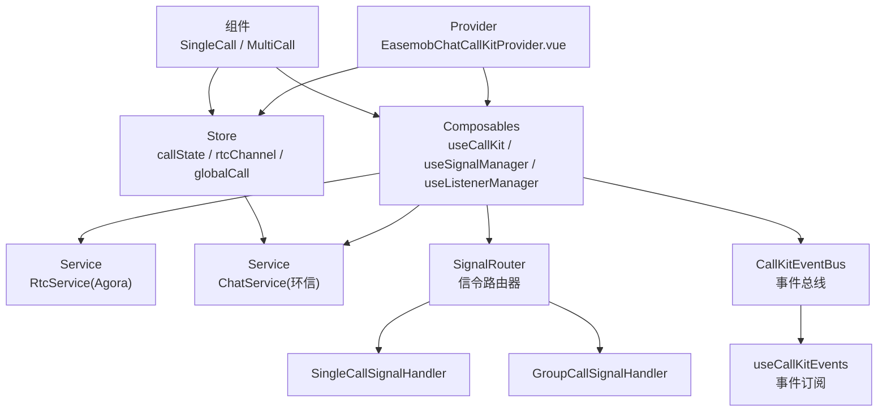

**图表来源**
- [lib/components/EasemobChatCallKitProvider.vue:59-103](file://lib/components/EasemobChatCallKitProvider.vue#L59-L103)
- [lib/composables/useCallKit.ts:9-123](file://lib/composables/useCallKit.ts#L9-L123)
- [lib/composables/useSignalManager.ts:50-354](file://lib/composables/useSignalManager.ts#L50-L354)
- [lib/composables/useListenerManager.ts:41-60](file://lib/composables/useListenerManager.ts#L41-L60)
- [lib/signaling/SignalRouter.ts:8-36](file://lib/signaling/SignalRouter.ts#L8-L36)
- [lib/core/events/CallKitEventBus.ts:8-112](file://lib/core/events/CallKitEventBus.ts#L8-L112)

## 详细组件分析

### Provider-Consumer 模式
- Provider 负责：
  - 合并默认与用户配置，形成全局配置对象。
  - 初始化并注入聊天客户端到 Store。
  - 初始化 RTC 服务（占位 appId，实际由信令动态下发）。
  - 挂载文本消息与信令事件监听器。
  - 组件卸载时销毁 RTC 服务。
- Consumer（各业务组件与 Composables）通过 Store 与 Composables 获取上下文与能力。

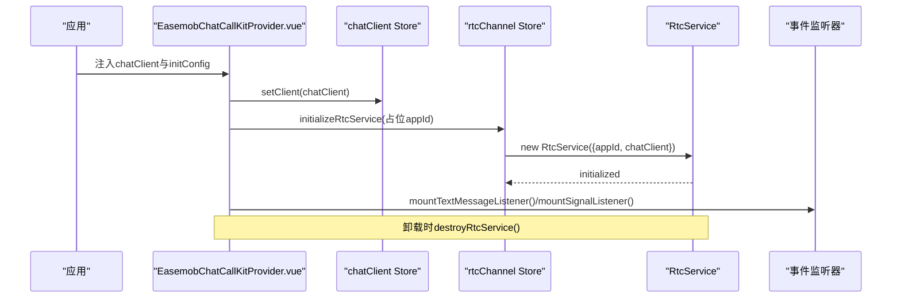

**图表来源**
- [lib/components/EasemobChatCallKitProvider.vue:19-113](file://lib/components/EasemobChatCallKitProvider.vue#L19-L113)
- [lib/store/rtcChannel.ts:84-121](file://lib/store/rtcChannel.ts#L84-L121)

**章节来源**
- [lib/components/EasemobChatCallKitProvider.vue:1-115](file://lib/components/EasemobChatCallKitProvider.vue#L1-L115)

### Store-Service 分层架构
- Store 层：
  - callState：管理通话状态机、邀请信息、用户映射、超时计时等。
  - rtcChannel：管理频道、媒体流、UID/UserId 映射、计时器、加入/离开用户集合等。
  - globalCall：管理跨域共享状态，如用户资料映射、窗口模式等。
- Service 层：
  - RtcService：封装 Agora WebRTC 客户端生命周期、轨道管理、订阅/发布、网络质量与音量指示。
  - ChatService：由 useSignalManager 使用，封装环信文本消息与信令消息发送。

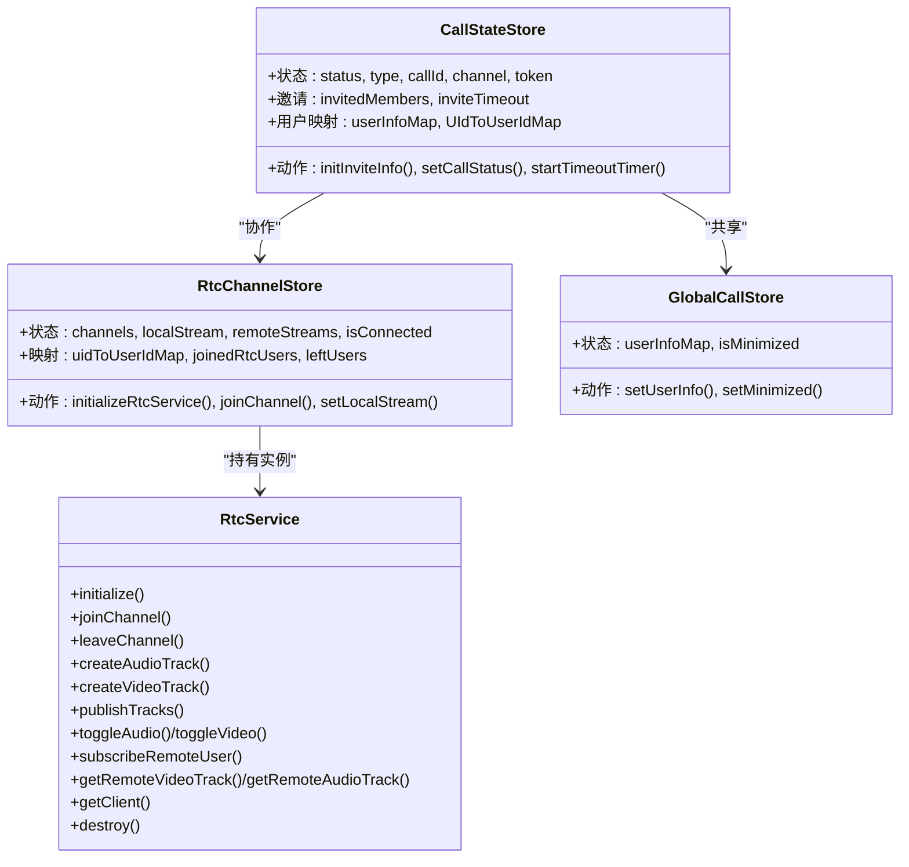

**图表来源**
- [lib/store/callState.ts:7-206](file://lib/store/callState.ts#L7-L206)
- [lib/store/rtcChannel.ts:7-410](file://lib/store/rtcChannel.ts#L7-L410)
- [lib/store/globalCall.ts:8-56](file://lib/store/globalCall.ts#L8-L56)
- [lib/services/RtcService.ts:42-719](file://lib/services/RtcService.ts#L42-L719)

**章节来源**
- [lib/store/callState.ts:1-263](file://lib/store/callState.ts#L1-L263)
- [lib/store/rtcChannel.ts:1-410](file://lib/store/rtcChannel.ts#L1-L410)
- [lib/store/globalCall.ts:1-56](file://lib/store/globalCall.ts#L1-L56)
- [lib/services/RtcService.ts:1-719](file://lib/services/RtcService.ts#L1-L719)

### 信令实现机制
- useSignalManager 统一封装所有通话信令发送：
  - 邀请：sendInviteMessage（单聊/群聊）。
  - 应答：sendAnswerMessage（accept/refuse/busy）。
  - 取消/离开：sendCancelMessage/sendLeaveMessage。
  - 确认响铃/被叫状态：sendConfirmRingMessage/sendConfirmCalleeMessage。
- useCallKit 编排发起流程：初始化邀请信息 -> 发送邀请信令 -> 群呼场景立即加入频道。
- 信令承载于环信 SDK 文本消息通道，配合 RTC 频道令牌与 UID/UserId 映射完成端到端通话建立。

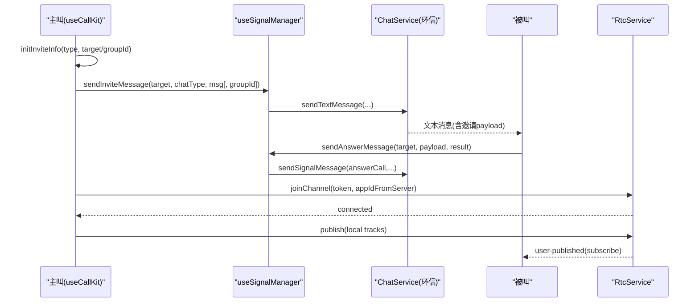

**图表来源**
- [lib/composables/useCallKit.ts:13-117](file://lib/composables/useCallKit.ts#L13-L117)
- [lib/composables/useSignalManager.ts:73-102](file://lib/composables/useSignalManager.ts#L73-L102)
- [lib/services/RtcService.ts:109-138](file://lib/services/RtcService.ts#L109-L138)

**章节来源**
- [lib/composables/useCallKit.ts:1-123](file://lib/composables/useCallKit.ts#L1-L123)
- [lib/composables/useSignalManager.ts:1-354](file://lib/composables/useSignalManager.ts#L1-L354)
- [lib/types/callstate.types.ts:1-93](file://lib/types/callstate.types.ts#L1-L93)

### 单人/多人通话组件交互
- 单人通话组件：
  - 根据状态渲染"待接听/通话中/最小化窗口"，通过 Store 管理 INVITING/IN_CALL 等状态。
  - 支持最小化与展开，展开后触发窗口扩展事件以恢复视频播放。
- 多人通话组件：
  - 左大右小布局，主视频与侧栏缩略图联动。
  - 邀请超时管理、远程用户轮询订阅、音频轨道检测、清屏模式等增强体验。
  - 通过 RtcService 渲染本地/远程视频流，支持静音/摄像头切换。

**图表来源**
- [lib/components/singleCall/EasemobChatSingleCall.vue:1-134](file://lib/components/singleCall/EasemobChatSingleCall.vue#L1-L134)
- [lib/components/multiCall/EasemobChatMultiCall.vue:1-800](file://lib/components/multiCall/EasemobChatMultiCall.vue#L1-L800)

**章节来源**
- [lib/components/singleCall/EasemobChatSingleCall.vue:1-134](file://lib/components/singleCall/EasemobChatSingleCall.vue#L1-L134)
- [lib/components/multiCall/EasemobChatMultiCall.vue:1-800](file://lib/components/multiCall/EasemobChatMultiCall.vue#L1-L800)

## 多端一致性架构

### 设备标识校验机制
系统实现了完善的多端一致性保障机制，通过设备标识（calleeDevId）确保信令的正确路由和处理。

**当前实践**：
- 发送 invite 时携带 `calleeDevId`（目标设备 resourceId）
- 接收 cmd 信令时校验 `calleeDevId === clientResource`
- 邀请文本消息入口处进行 `calleeDevId` 校验（Vue3 已修复）

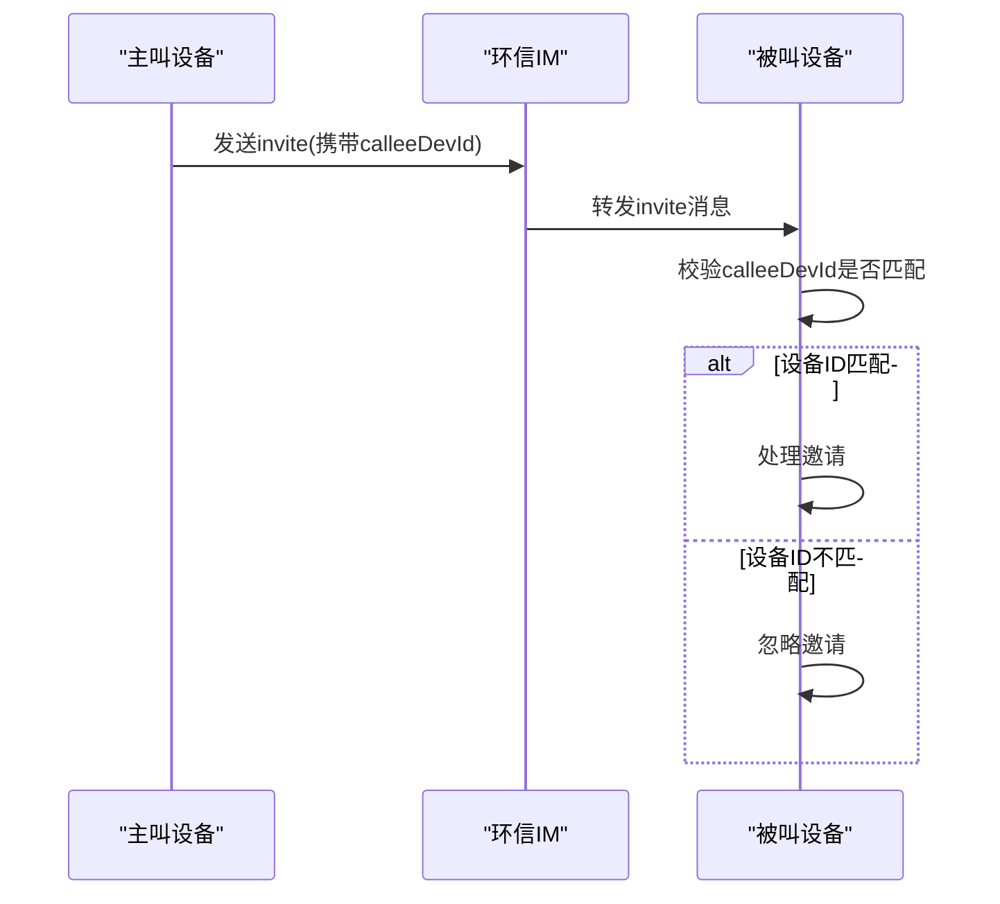

**图表来源**
- [lib/composables/useListenerManager.ts:107-116](file://lib/composables/useListenerManager.ts#L107-L116)
- [lib/signaling/SingleCallSignalHandler.ts:91-96](file://lib/signaling/SingleCallSignalHandler.ts#L91-L96)

**章节来源**
- [lib/composables/useListenerManager.ts:107-116](file://lib/composables/useListenerManager.ts#L107-L116)
- [lib/signaling/SingleCallSignalHandler.ts:91-96](file://lib/signaling/SingleCallSignalHandler.ts#L91-L96)

### 多端抢占处理
系统支持多端抢占场景，通过设备优先级和状态同步机制确保通话的一致性。

**设计考虑**：
- 多端抢占：A 设备接听后，B 设备应收到什么通知？是否需要主动拒绝 B 设备？
- 状态同步：通话中切换设备，如何恢复当前通话状态？

**当前实践**：
- answerCall 信令中包含 callerDevId 和 calleeDevId 校验
- 多端情况下，其他设备会收到"已被其他端处理"的通知

**章节来源**
- [lib/signaling/SingleCallSignalHandler.ts:202-220](file://lib/signaling/SingleCallSignalHandler.ts#L202-L220)

## 离线消息处理机制

### 时间戳过期过滤
系统实现了基于时间戳的消息过期过滤机制，防止重新登录后收到过期的离线消息。

**当前实践**：
- Vue3：增加 `isMessageExpired()` 基于消息时间戳过滤（invite 40s 阈值，cmd 60s 阈值）
- React：无任何过滤

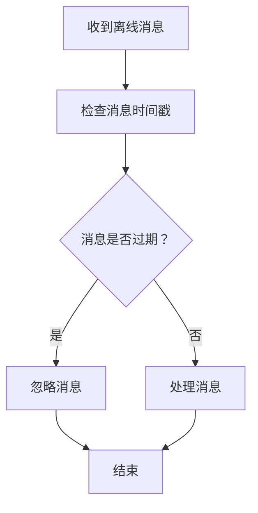

**图表来源**
- [lib/composables/useListenerManager.ts:118-124](file://lib/composables/useListenerManager.ts#L118-L124)
- [lib/core/events/helpers.ts:54-74](file://lib/core/events/helpers.ts#L54-L74)

**章节来源**
- [lib/composables/useListenerManager.ts:118-124](file://lib/composables/useListenerManager.ts#L118-L124)
- [lib/core/events/helpers.ts:54-74](file://lib/core/events/helpers.ts#L54-L74)

### 重连后状态恢复
系统提供了基本的重连状态恢复机制，但目前缺少跨 session 的状态持久化。

**设计考虑**：
- 重连后状态恢复：是否需要持久化通话状态到 localStorage？
- 服务端支持：IM 服务端是否支持"只投递未过期离线消息"？

**当前实践**：
- 基于时间戳的过期过滤
- 缺少跨 session 状态恢复（如通话中断后刷新页面）

**章节来源**
- [lib/core/events/helpers.ts:54-74](file://lib/core/events/helpers.ts#L54-L74)

## 事件系统设计

### 类型安全的事件总线
系统实现了类型安全的事件总线，提供统一的通话生命周期事件管理。

**当前实践**：
- Vue3：类型安全的 EventBus + `useCallKitEvents()` composable
- 事件 payload 包含 `conversationId`、`isLocal`、`localUserRole`、`endedBy`
- 提供 `getCallRecord()` API 自动生成标准化通话记录

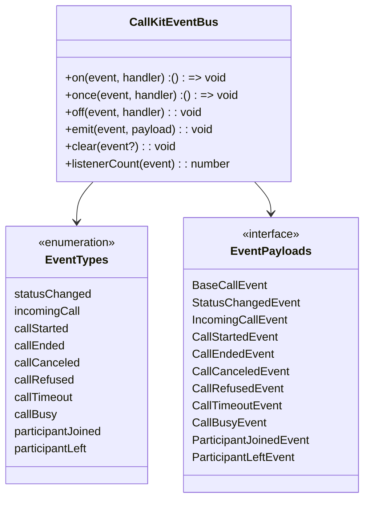

**图表来源**
- [lib/core/events/CallKitEventBus.ts:14-105](file://lib/core/events/CallKitEventBus.ts#L14-L105)
- [lib/core/events/types.ts:6-175](file://lib/core/events/types.ts#L6-L175)

**章节来源**
- [lib/core/events/CallKitEventBus.ts:1-112](file://lib/core/events/CallKitEventBus.ts#L1-L112)
- [lib/composables/useCallKitEvents.ts:1-213](file://lib/composables/useCallKitEvents.ts#L1-L213)
- [lib/core/events/types.ts:1-183](file://lib/core/events/types.ts#L1-L183)

### 事件负载标准化
系统提供了标准化的事件负载结构，确保不同平台间的一致性。

**事件负载包含的关键字段**：
- `conversationId`：会话标识符（单聊=对方用户ID，群聊=groupId）
- `isLocal`：是否由本端行为触发
- `localUserRole`：当前用户在通话中的角色
- `endedBy`：挂断方的 userId（可选）

**章节来源**
- [lib/core/events/helpers.ts:83-119](file://lib/core/events/helpers.ts#L83-L119)
- [lib/core/events/types.ts:26-39](file://lib/core/events/types.ts#L26-L39)

## 状态管理策略

### 单聊/群聊状态分离
系统采用了领域隔离的状态管理策略，单聊和群聊拥有独立的状态管理。

**当前实践**：
- `callStateStore`：单聊专用状态
- `GroupCallStore`：群聊专用状态（Pinia / Zustand）
- `GlobalCallStore`：跨域共享状态

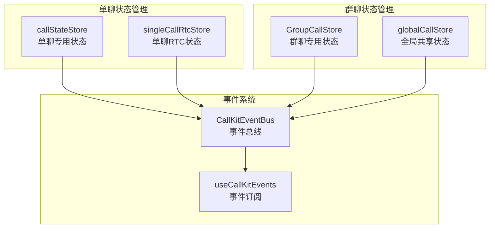

**图表来源**
- [lib/store/callState.ts:7-206](file://lib/store/callState.ts#L7-L206)
- [lib/modules/groupCall/index.ts:1-18](file://lib/modules/groupCall/index.ts#L1-L18)
- [lib/store/globalCall.ts:8-56](file://lib/store/globalCall.ts#L8-L56)

**章节来源**
- [lib/store/callState.ts:1-263](file://lib/store/callState.ts#L1-L263)
- [lib/modules/groupCall/index.ts:1-18](file://lib/modules/groupCall/index.ts#L1-L18)
- [lib/store/globalCall.ts:1-56](file://lib/store/globalCall.ts#L1-L56)

### 共享状态管理
系统通过 GlobalCallStore 管理跨域共享状态，如用户资料映射和窗口模式。

**共享状态包括**：
- `userInfoMap`：用户资料映射（昵称、头像）
- `isMinimized`：窗口模式状态

**章节来源**
- [lib/store/globalCall.ts:8-56](file://lib/store/globalCall.ts#L8-L56)

## 信令协议设计

### 设备标识字段
系统在信令协议中包含了必要的设备标识字段，确保多端场景下的正确处理。

**当前实践**：
- invite 文本消息 ext 包含：`callId`、`channelName`、`callerDevId`、`calleeDevId`、`type`、`ts`、`invitedMembers`
- cmd 消息 ext 包含：`action`、`callId`、`callerDevId`、`calleeDevId`、`result`

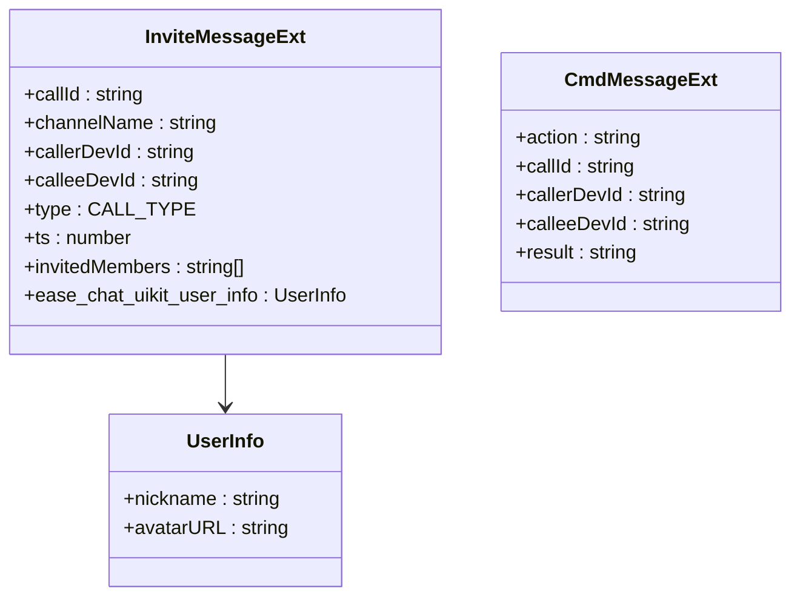

**图表来源**
- [lib/composables/useListenerManager.ts:149-160](file://lib/composables/useListenerManager.ts#L149-L160)
- [lib/signaling/SingleCallSignalHandler.ts:119-127](file://lib/signaling/SingleCallSignalHandler.ts#L119-L127)

**章节来源**
- [lib/composables/useListenerManager.ts:149-160](file://lib/composables/useListenerManager.ts#L149-L160)
- [lib/signaling/SingleCallSignalHandler.ts:119-127](file://lib/signaling/SingleCallSignalHandler.ts#L119-L127)

### 扩展字段预留
系统设计了灵活的扩展字段机制，为未来的功能扩展预留空间。

**扩展字段设计**：
- `ext` 对象的设计，预留扩展空间
- 版本兼容：信令协议升级后，旧版本客户端如何处理新字段

**章节来源**
- [lib/composables/useListenerManager.ts:79-85](file://lib/composables/useListenerManager.ts#L79-L85)

## RTC 服务抽象

### 服务去状态化设计
系统采用了服务去状态化的架构设计，RtcService 仅负责 SDK 封装，状态管理交由 Store 处理。

**目标设计**：
- `RtcService`：纯 SDK 封装，无状态，通过回调传出事件
- `SingleCallRtcAdapter` / `RtcMediaBridge`：消费回调，写回各自 Store
- `RtcJoinService`：无状态 joinChannel 原子操作

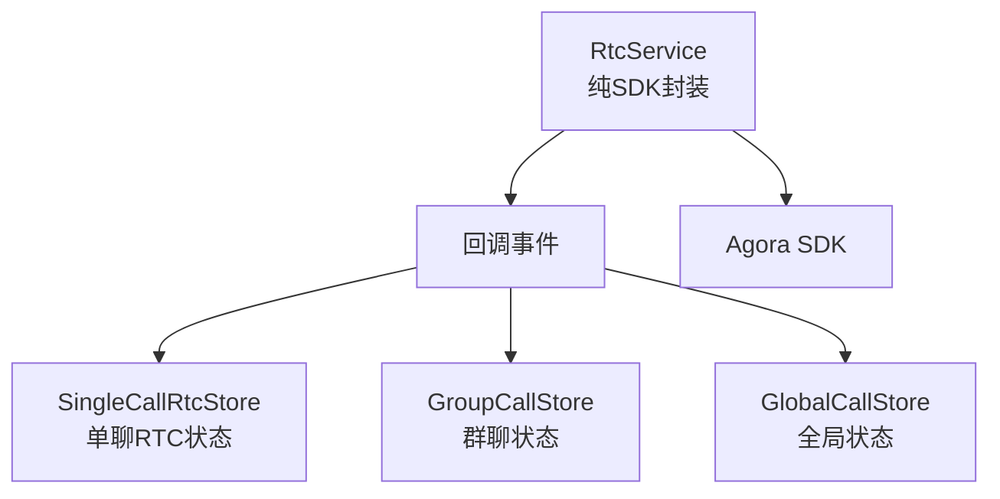

**图表来源**
- [lib/services/RtcService.ts:42-719](file://lib/services/RtcService.ts#L42-L719)

**章节来源**
- [lib/services/RtcService.ts:1-719](file://lib/services/RtcService.ts#L1-L719)

### 多频道支持
系统支持同时加入多个 RTC 频道，满足复杂的通话场景需求。

**多频道特性**：
- 每个通话会话独立管理频道状态
- 支持群聊场景下的多频道管理
- 频道令牌和 UID/UserId 映射的动态管理

**章节来源**
- [lib/store/rtcChannel.ts:1-410](file://lib/store/rtcChannel.ts#L1-L410)

## 错误处理与降级

### 超时处理机制
系统实现了完善的超时处理机制，确保通话流程的健壮性。

**当前实践**：
- invite 超时 30s 后自动取消
- 响铃超时后有 handleTimeout 处理
- 部分错误通过 `callKitEventBus` 的 `callEnded` 事件暴露给接入方

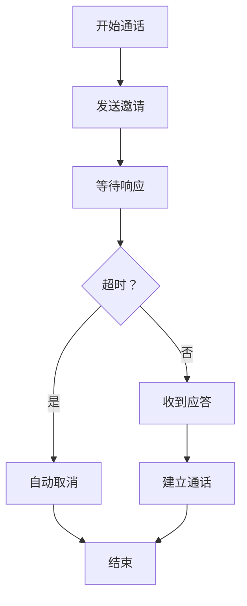

**图表来源**
- [lib/composables/useCallKit.ts:13-50](file://lib/composables/useCallKit.ts#L13-L50)
- [lib/signaling/SingleCallSignalHandler.ts:73-76](file://lib/signaling/SingleCallSignalHandler.ts#L73-L76)

**章节来源**
- [lib/composables/useCallKit.ts:13-50](file://lib/composables/useCallKit.ts#L13-L50)
- [lib/signaling/SingleCallSignalHandler.ts:73-76](file://lib/signaling/SingleCallSignalHandler.ts#L73-L76)

### 异常恢复策略
系统提供了多种异常恢复策略，确保在各种异常情况下能够优雅降级。

**异常处理**：
- 信令发送失败：是否重试？重试几次？
- RTC 加入失败：是否自动回退？如何通知用户？
- IM 连接断开：通话中 IM 断连，RTC 是否应该保持？

**章节来源**
- [lib/signaling/SingleCallSignalHandler.ts:318-320](file://lib/signaling/SingleCallSignalHandler.ts#L318-L320)

## 依赖分析
- 外部依赖：
  - Vue 3 生态：Vue、Pinia。
  - 环信 SDK：easemob-websdk，用于聊天与信令。
  - Agora SDK：agora-rtc-sdk-ng，用于音视频媒体传输。
- 内部模块耦合：
  - Provider 依赖 Store 与 Composables；Composables 依赖 Store 与 Service；Service 依赖 SDK。
  - Store 之间通过 getter/action 协作，避免循环依赖。
  - 信令处理采用路由器模式，支持模块间的松耦合。

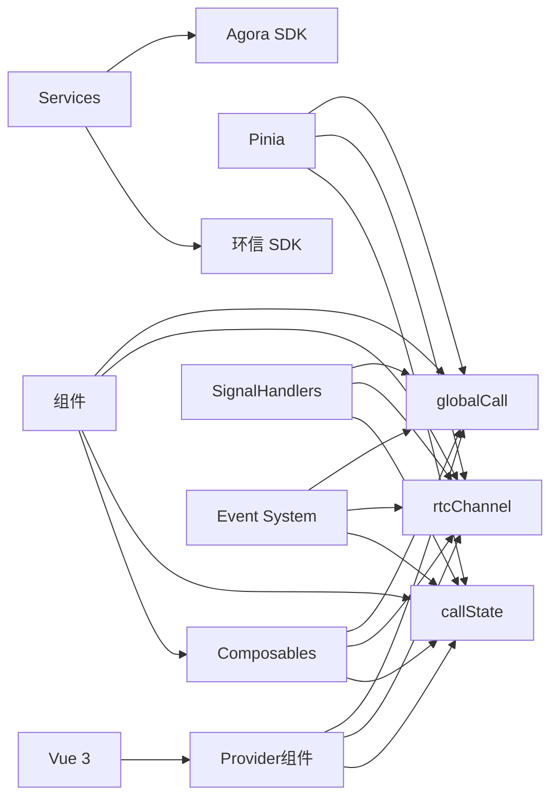

**图表来源**
- [package.json:33-51](file://package.json#L33-L51)
- [lib/index.ts:1-55](file://lib/index.ts#L1-L55)
- [lib/store/callState.ts:1-263](file://lib/store/callState.ts#L1-L263)
- [lib/store/rtcChannel.ts:1-410](file://lib/store/rtcChannel.ts#L1-L410)
- [lib/store/globalCall.ts:1-56](file://lib/store/globalCall.ts#L1-L56)
- [lib/services/RtcService.ts:1-719](file://lib/services/RtcService.ts#L1-L719)

**章节来源**
- [package.json:1-53](file://package.json#L1-L53)
- [lib/index.ts:1-55](file://lib/index.ts#L1-L55)

## 性能考量
- 渲染优化：
  - 多人通话组件对视频元素去重渲染与渲染锁，避免并发更新导致的卡顿。
  - 防抖渲染函数 scheduleRender 控制渲染频率。
- 资源管理：
  - 组件卸载与挂断流程中，统一清理定时器、停止轨道、销毁 RTC 服务，防止内存泄漏。
- 状态粒度：
  - Store 将 UI 状态与业务状态分离，减少无关响应式更新。
- 网络与媒体：
  - RtcService 提供网络质量与音量指示回调，便于前端做降级策略（如降低分辨率）。
- 事件系统优化：
  - 事件处理器异常被吞掉，避免一个 handler 异常影响其他 handler。
  - 事件订阅者数量统计，便于性能监控。

[本节为通用指导，不直接分析具体文件]

## 故障排查指南
- 无法发起通话：
  - 检查 Provider 是否注入 chatClient；确认 useCallKit 调用前 Provider 已挂载。
  - 查看信令发送日志，确认 sendInviteMessage 返回与消息 ID。
- 无法加入频道：
  - 确认信令已携带 token 与 appId（由服务端下发），RtcService.joinChannel 参数正确。
  - 检查 UID/UserId 映射是否建立，事件 user-joined 是否触发。
- 视频无法播放：
  - 检查本地/远程轨道是否存在，remoteUsers 是否已订阅。
  - 确认渲染函数已执行且 video 元素未重复设置 srcObject。
- 被叫无声音：
  - 检查远端音频轨道是否订阅成功，播放是否报错。
  - 确认 isMuted 与 isAudioEnabled 状态一致。
- 多端问题：
  - 检查 calleeDevId 是否匹配当前设备。
  - 确认 answerCall 信令中的设备标识校验。
- 离线消息问题：
  - 检查 isMessageExpired 过滤逻辑。
  - 确认消息时间戳格式（毫秒vs秒）。

**章节来源**
- [lib/composables/useCallKit.ts:13-50](file://lib/composables/useCallKit.ts#L13-L50)
- [lib/composables/useSignalManager.ts:73-102](file://lib/composables/useSignalManager.ts#L73-L102)
- [lib/services/RtcService.ts:400-488](file://lib/services/RtcService.ts#L400-L488)
- [lib/components/multiCall/EasemobChatMultiCall.vue:459-590](file://lib/components/multiCall/EasemobChatMultiCall.vue#L459-L590)
- [lib/composables/useListenerManager.ts:107-116](file://lib/composables/useListenerManager.ts#L107-L116)
- [lib/core/events/helpers.ts:54-74](file://lib/core/events/helpers.ts#L54-L74)

## 结论
本架构以 Provider-Consumer 与 Store-Service 分层为核心，通过 Pinia 统一状态管理，用 Composables 编排业务流程，借助环信与 Agora SDK 实现可靠的信令与媒体传输。系统具备清晰的模块边界、良好的可扩展性与可观测性，适合在复杂业务场景中复用与演进。

**更新** 最新的架构设计文档体现了系统在多端一致性、离线消息处理、事件系统设计等方面的关键决策，这些决策显著提升了系统的可靠性、用户体验和跨平台一致性。通过设备标识校验、时间戳过期过滤、类型安全的事件总线等机制，系统能够在复杂的多端环境中保持通话状态的一致性和用户体验的稳定性。

[本节为总结性内容，不直接分析具体文件]

## 附录
- 系统边界：
  - 业务边界：通话发起、应答、挂断、邀请管理、UI 控制。
  - 技术边界：环信 SDK 负责消息与信令，Agora SDK 负责媒体传输。
  - 事件边界：CallKitEventBus 提供统一的事件发布订阅接口。
- 技术决策与权衡：
  - 使用 Pinia 替代 Vuex，简化状态管理与 TS 支持。
  - 将 RTC 初始化占位 appId，运行时由信令动态替换，提升安全性与灵活性。
  - 多人通话采用"左大右小"布局与邀请超时管理，兼顾易用性与稳定性。
  - 采用服务去状态化设计，提升系统的可测试性和可维护性。
  - 实现类型安全的事件系统，减少运行时错误。
- 架构演进方向：
  - 信令路由拆分：把 monolithic listener 拆成 SignalRouter + Handler
  - RTC 服务去状态化：RtcService 纯回调，Store 消费回调
  - rtcChannelStore 拆解：彻底消除全局 RTC 状态池
  - 跨平台信令协议标准化：统一各平台的 invite/cmd 信令字段和校验逻辑

[本节为补充说明，不直接分析具体文件]