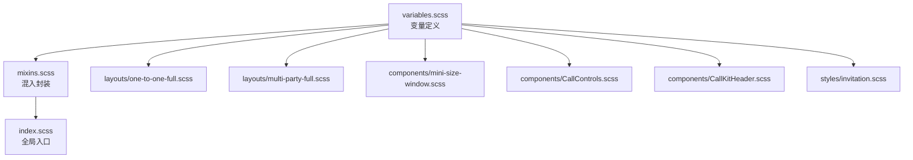
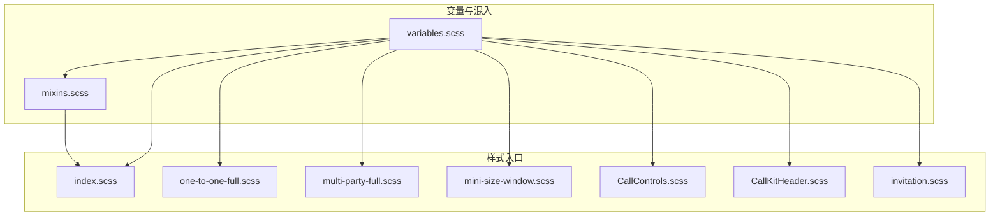
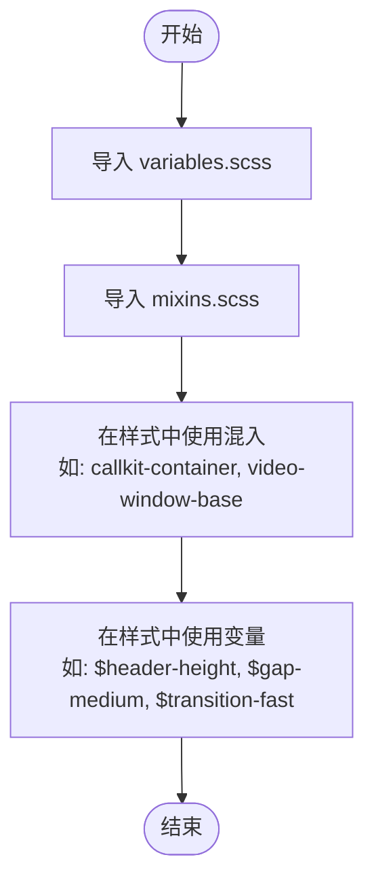
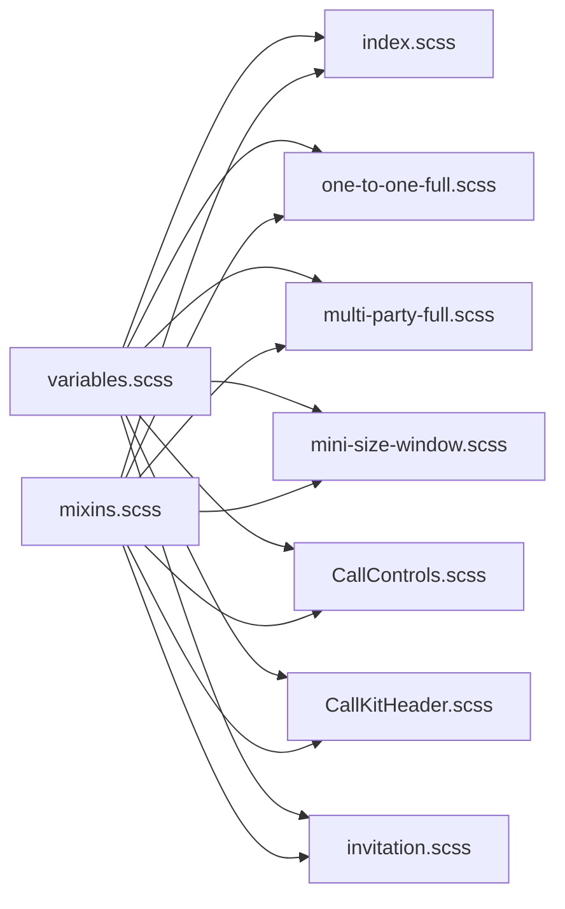

# 主题变量系统

<cite>
**本文引用的文件**
- [variables.scss](file://callkit/styles/variables.scss)
- [mixins.scss](file://callkit/styles/mixins.scss)
- [index.scss](file://callkit/styles/index.scss)
- [one-to-one-full.scss](file://callkit/styles/layouts/one-to-one-full.scss)
- [multi-party-full.scss](file://callkit/styles/layouts/multi-party-full.scss)
- [mini-size-window.scss](file://callkit/styles/components/mini-size-window.scss)
- [invitation.scss](file://callkit/styles/invitation.scss)
- [CallControls.scss](file://callkit/components/CallControls.scss)
- [CallKitHeader.scss](file://callkit/components/CallKitHeader.scss)
</cite>

## 目录
1. [简介](#简介)
2. [项目结构](#项目结构)
3. [核心组件](#核心组件)
4. [架构总览](#架构总览)
5. [详细组件分析](#详细组件分析)
6. [依赖关系分析](#依赖关系分析)
7. [性能考量](#性能考量)
8. [故障排查指南](#故障排查指南)
9. [结论](#结论)
10. [附录](#附录)

## 简介
本文件系统化梳理 EaseMob CallKit Vue3 组件库的主题变量体系，覆盖 CSS 变量与 SCSS 变量的定义、命名约定、分类规则、默认值参考与修改方法，并提供通过变量系统实现主题切换与品牌定制的实践建议。文档同时给出变量覆盖的最佳实践与注意事项，帮助在多品牌、多主题场景下稳定扩展。

## 项目结构
主题变量系统主要分布在样式层的统一入口与分模块样式文件中：
- 统一变量与混入：variables.scss、mixins.scss
- 全局样式入口：index.scss
- 布局样式：one-to-one-full.scss、multi-party-full.scss
- 组件样式：mini-size-window.scss、CallControls.scss、CallKitHeader.scss
- 邀请页样式：invitation.scss

图表来源
- [variables.scss](file://callkit/styles/variables.scss#L1-L49)
- [mixins.scss](file://callkit/styles/mixins.scss#L1-L216)
- [index.scss](file://callkit/styles/index.scss#L1-L10)
- [one-to-one-full.scss](file://callkit/styles/layouts/one-to-one-full.scss#L1-L5)
- [multi-party-full.scss](file://callkit/styles/layouts/multi-party-full.scss#L1-L5)
- [mini-size-window.scss](file://callkit/styles/components/mini-size-window.scss#L1-L5)
- [CallControls.scss](file://callkit/components/CallControls.scss#L1-L3)
- [CallKitHeader.scss](file://callkit/components/CallKitHeader.scss#L1-L3)
- [invitation.scss](file://callkit/styles/invitation.scss#L1-L3)

章节来源
- [variables.scss](file://callkit/styles/variables.scss#L1-L49)
- [mixins.scss](file://callkit/styles/mixins.scss#L1-L216)
- [index.scss](file://callkit/styles/index.scss#L1-L10)

## 核心组件
本节从“变量分类—命名约定—默认值—使用位置”的维度，系统梳理主题变量体系。

- 尺寸变量
  - 用途：统一容器、控件、视频窗口等尺寸规范
  - 关键变量：容器尺寸、内边距、圆角半径、视频窗口圆角与边框宽度、头像尺寸等
  - 默认值参考：见变量文件对应行号
  - 使用位置：index.scss、one-to-one-full.scss、multi-party-full.scss、mini-size-window.scss、CallControls.scss、CallKitHeader.scss

- 间距变量
  - 用途：统一组件之间的间距策略
  - 关键变量：小/中/大三档间距
  - 使用位置：index.scss、one-to-one-full.scss、mini-size-window.scss、CallControls.scss、CallKitHeader.scss

- 颜色变量
  - 用途：统一背景、边框、文本、占位图等色彩体系
  - 关键变量：背景色、窗口背景、占位图渐变、边框色、文本色、次级文本色、阴影色等
  - 注意：部分颜色变量在具体组件中直接硬编码，建议通过变量统一管理
  - 使用位置：variables.scss、index.scss、one-to-one-full.scss、mini-size-window.scss、invitation.scss

- 阴影变量
  - 用途：统一投影层级与视觉深度
  - 关键变量：轻/中/重阴影
  - 使用位置：index.scss、one-to-one-full.scss、mini-size-window.scss

- 动画变量
  - 用途：统一过渡时间与缓动曲线
  - 关键变量：快/中/慢三档过渡
  - 使用位置：mixins.scss、index.scss、one-to-one-full.scss、mini-size-window.scss

- z-index 层级
  - 用途：统一层级管理，避免覆盖冲突
  - 关键变量：头部、控制区、画中画、全屏等层级
  - 使用位置：variables.scss、index.scss、one-to-one-full.scss

- 响应式断点
  - 用途：移动端/平板/桌面端的断点控制
  - 关键变量：移动端、平板、桌面端断点
  - 使用位置：mixins.scss、index.scss、one-to-one-full.scss、multi-party-full.scss、mini-size-window.scss

章节来源
- [variables.scss](file://callkit/styles/variables.scss#L1-L49)
- [mixins.scss](file://callkit/styles/mixins.scss#L165-L192)
- [index.scss](file://callkit/styles/index.scss#L42-L534)
- [one-to-one-full.scss](file://callkit/styles/layouts/one-to-one-full.scss#L44-L98)
- [multi-party-full.scss](file://callkit/styles/layouts/multi-party-full.scss#L16-L62)
- [mini-size-window.scss](file://callkit/styles/components/mini-size-window.scss#L7-L96)
- [CallControls.scss](file://callkit/components/CallControls.scss#L17-L184)
- [CallKitHeader.scss](file://callkit/components/CallKitHeader.scss#L142-L196)
- [invitation.scss](file://callkit/styles/invitation.scss#L93-L120)

## 架构总览
变量系统采用“集中定义、按需导入、混入封装、样式层消费”的分层架构。统一变量与混入在入口文件中集中引入，各布局与组件样式文件通过 @import 引入变量与混入，形成一致的主题风格。

图表来源
- [index.scss](file://callkit/styles/index.scss#L1-L10)
- [one-to-one-full.scss](file://callkit/styles/layouts/one-to-one-full.scss#L1-L2)
- [multi-party-full.scss](file://callkit/styles/layouts/multi-party-full.scss#L1-L2)
- [mini-size-window.scss](file://callkit/styles/components/mini-size-window.scss#L1-L2)
- [CallControls.scss](file://callkit/components/CallControls.scss#L1-L2)
- [CallKitHeader.scss](file://callkit/components/CallKitHeader.scss#L1-L2)
- [invitation.scss](file://callkit/styles/invitation.scss#L1-L2)
- [variables.scss](file://callkit/styles/variables.scss#L1-L49)
- [mixins.scss](file://callkit/styles/mixins.scss#L1-L216)

## 详细组件分析

### 变量定义与混入使用
- 变量定义集中在 variables.scss，涵盖尺寸、间距、颜色、阴影、动画、z-index、响应式断点等
- 混入封装在 mixins.scss，提供容器、视频窗口、头像、占位符、全屏、响应式等通用样式模板
- 各样式文件通过 @import 引入变量与混入，减少重复定义，提升一致性

图表来源
- [variables.scss](file://callkit/styles/variables.scss#L1-L49)
- [mixins.scss](file://callkit/styles/mixins.scss#L2-L14)
- [index.scss](file://callkit/styles/index.scss#L23-L24)

章节来源
- [variables.scss](file://callkit/styles/variables.scss#L1-L49)
- [mixins.scss](file://callkit/styles/mixins.scss#L2-L14)
- [index.scss](file://callkit/styles/index.scss#L23-L24)

### 颜色变量体系
- 背景色与窗口背景：用于整体背景与视频窗口容器背景
- 占位图背景：线性渐变，适配不同主题
- 边框色与悬停色：区分本地/远端与交互状态
- 文本色与次级文本色：保证对比度与可读性
- 阴影色：统一投影强度与透明度

建议：
- 将硬编码颜色逐步替换为变量，便于主题切换
- 为深浅主题分别维护颜色变量集合，避免在组件中直接写死颜色

章节来源
- [variables.scss](file://callkit/styles/variables.scss#L14-L27)
- [index.scss](file://callkit/styles/index.scss#L42-L534)
- [one-to-one-full.scss](file://callkit/styles/layouts/one-to-one-full.scss#L12-L14)
- [mini-size-window.scss](file://callkit/styles/components/mini-size-window.scss#L12-L17)
- [invitation.scss](file://callkit/styles/invitation.scss#L28-L35)

### 尺寸与间距变量规范
- 容器尺寸：最大宽高、内边距、圆角半径
- 控件高度：头部、控制区高度
- 视频窗口：圆角、边框宽度、头像尺寸（含小尺寸）
- 间距：小/中/大三档，用于组件内外间距统一

建议：
- 在新增组件时优先使用现有变量，避免重复定义
- 对于特定场景的微调，可在局部作用域覆盖变量值

章节来源
- [variables.scss](file://callkit/styles/variables.scss#L1-L12)
- [index.scss](file://callkit/styles/index.scss#L42-L534)
- [one-to-one-full.scss](file://callkit/styles/layouts/one-to-one-full.scss#L44-L98)
- [mini-size-window.scss](file://callkit/styles/components/mini-size-window.scss#L302-L319)

### 动画变量配置
- 过渡时间：快/中/慢三档，用于 hover、激活、全屏等状态切换
- 动画曲线：统一 ease 缓动，保证流畅度
- 关键使用：视频窗口悬停、按钮交互、最小化状态、提示气泡等

建议：
- 在复杂交互中优先使用中/慢档过渡，避免过快导致眩晕
- 对高频触发的交互使用快档过渡，提升响应感

章节来源
- [variables.scss](file://callkit/styles/variables.scss#L29-L32)
- [mixins.scss](file://callkit/styles/mixins.scss#L33-L40)
- [mini-size-window.scss](file://callkit/styles/components/mini-size-window.scss#L253-L271)

### 响应式断点与布局
- 断点：移动端、平板、桌面端
- 响应式混入：在不同断点下调整头像尺寸、字体大小、间距等
- 布局文件：针对 1v1 与多人布局分别应用断点策略

建议：
- 在新增断点时，先评估是否已有变量覆盖，避免重复定义
- 优先使用响应式混入，减少媒体查询重复

章节来源
- [variables.scss](file://callkit/styles/variables.scss#L46-L49)
- [mixins.scss](file://callkit/styles/mixins.scss#L165-L192)
- [one-to-one-full.scss](file://callkit/styles/layouts/one-to-one-full.scss#L86-L98)
- [multi-party-full.scss](file://callkit/styles/layouts/multi-party-full.scss#L160-L195)

### z-index 层级管理
- 头部、控制区、画中画、全屏等层级明确分离
- 通过变量统一管理，避免层级冲突

建议：
- 在新增层级时，先评估现有层级范围，避免破坏既有层级关系
- 对外层弹层组件，建议通过 props 或上下文传入层级上限

章节来源
- [variables.scss](file://callkit/styles/variables.scss#L40-L44)
- [index.scss](file://callkit/styles/index.scss#L415-L426)

### 变量命名约定与分类规则
- 命名约定：采用语义化前缀（如 $header-, $controls-, $gap-, $video-, $avatar-, $shadow-, $transition-, $z-index-, $breakpoint-），辅以语义后缀（如 -height/-width/-radius/-color/-size/-large/-medium/-small）
- 分类规则：按功能域划分（尺寸、间距、颜色、阴影、动画、层级、断点）
- 建议：新增变量时遵循“前缀+语义+后缀”的命名，便于检索与维护

章节来源
- [variables.scss](file://callkit/styles/variables.scss#L1-L49)

### 默认变量值参考与修改方法
- 默认值参考：直接查看 variables.scss 中的变量赋值
- 修改方法：
  - 全局覆盖：在业务工程中重新定义同名变量，覆盖默认值
  - 局部覆盖：在组件样式文件中，于 @import 变量文件之前重新声明变量，仅影响当前文件作用域
  - 主题切换：通过构建期注入 CSS 变量或运行时切换样式类，结合变量实现主题切换

章节来源
- [variables.scss](file://callkit/styles/variables.scss#L1-L49)
- [index.scss](file://callkit/styles/index.scss#L1-L10)

### 通过变量系统实现主题切换与品牌定制
- 方案一：CSS 变量 + 类名切换
  - 在根节点切换主题类（如 .theme-dark/.theme-light），通过 CSS 变量映射不同颜色值
  - 在 SCSS 中通过变量映射到 CSS 变量，实现运行时切换
- 方案二：构建期主题打包
  - 为每套主题生成独立样式包，按需引入
  - 适用于品牌定制场景，避免运行时切换开销
- 方案三：组件级主题覆盖
  - 在业务组件中局部覆盖变量，实现品牌定制

最佳实践：
- 优先使用变量而非硬编码颜色
- 为每套主题维护变量映射表，避免遗漏
- 在组件中尽量通过变量消费，减少对默认值的依赖

章节来源
- [variables.scss](file://callkit/styles/variables.scss#L1-L49)
- [index.scss](file://callkit/styles/index.scss#L1-L10)

### 变量覆盖的最佳实践与注意事项
- 最佳实践
  - 在业务工程中统一入口处覆盖变量，避免散落各处
  - 对颜色变量进行分层管理（基础色板、语义色、反差色）
  - 对动画变量进行分级（交互反馈、页面切换、过渡动画）
- 注意事项
  - 避免在组件内硬编码颜色，不利于主题切换
  - 响应式断点与混入配合使用，避免媒体查询重复
  - z-index 层级变更需整体评估，避免层级冲突

章节来源
- [variables.scss](file://callkit/styles/variables.scss#L1-L49)
- [mixins.scss](file://callkit/styles/mixins.scss#L165-L192)
- [index.scss](file://callkit/styles/index.scss#L415-L426)

## 依赖关系分析
变量与混入在多个样式文件中被集中使用，形成强耦合关系。下图展示变量与混入在关键样式文件中的依赖关系：

图表来源
- [variables.scss](file://callkit/styles/variables.scss#L1-L49)
- [mixins.scss](file://callkit/styles/mixins.scss#L1-L216)
- [index.scss](file://callkit/styles/index.scss#L1-L10)
- [one-to-one-full.scss](file://callkit/styles/layouts/one-to-one-full.scss#L1-L2)
- [multi-party-full.scss](file://callkit/styles/layouts/multi-party-full.scss#L1-L2)
- [mini-size-window.scss](file://callkit/styles/components/mini-size-window.scss#L1-L2)
- [CallControls.scss](file://callkit/components/CallControls.scss#L1-L2)
- [CallKitHeader.scss](file://callkit/components/CallKitHeader.scss#L1-L2)
- [invitation.scss](file://callkit/styles/invitation.scss#L1-L2)

章节来源
- [variables.scss](file://callkit/styles/variables.scss#L1-L49)
- [mixins.scss](file://callkit/styles/mixins.scss#L1-L216)
- [index.scss](file://callkit/styles/index.scss#L1-L10)

## 性能考量
- 变量集中管理可减少重复计算与内存占用
- 使用 CSS 变量实现主题切换时，注意避免频繁重排与重绘
- 在动画中优先使用 transform 与 opacity，减少布局抖动
- 响应式断点应与媒体查询配合，避免过度使用复杂选择器

## 故障排查指南
- 颜色未生效
  - 检查变量是否被局部覆盖或硬编码颜色覆盖了变量
  - 确认变量文件是否正确 @import
- 响应式异常
  - 检查断点变量与媒体查询是否匹配
  - 确认响应式混入是否正确应用
- 层级冲突
  - 检查 z-index 变量是否合理分配
  - 确认新增层级是否超出预期范围

章节来源
- [variables.scss](file://callkit/styles/variables.scss#L40-L49)
- [mixins.scss](file://callkit/styles/mixins.scss#L165-L192)
- [index.scss](file://callkit/styles/index.scss#L415-L426)

## 结论
该主题变量系统通过集中定义、混入封装与样式层消费，实现了跨组件的一致性与可维护性。建议在后续迭代中进一步将硬编码颜色替换为变量，并完善 CSS 变量映射，以更好地支持主题切换与品牌定制。

## 附录
- 变量清单与默认值参考：见 variables.scss
- 混入清单与使用示例：见 mixins.scss
- 样式入口与关键使用位置：见 index.scss、one-to-one-full.scss、multi-party-full.scss、mini-size-window.scss、CallControls.scss、CallKitHeader.scss、invitation.scss