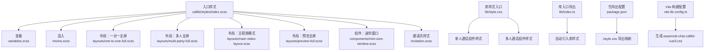
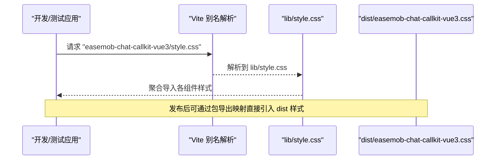
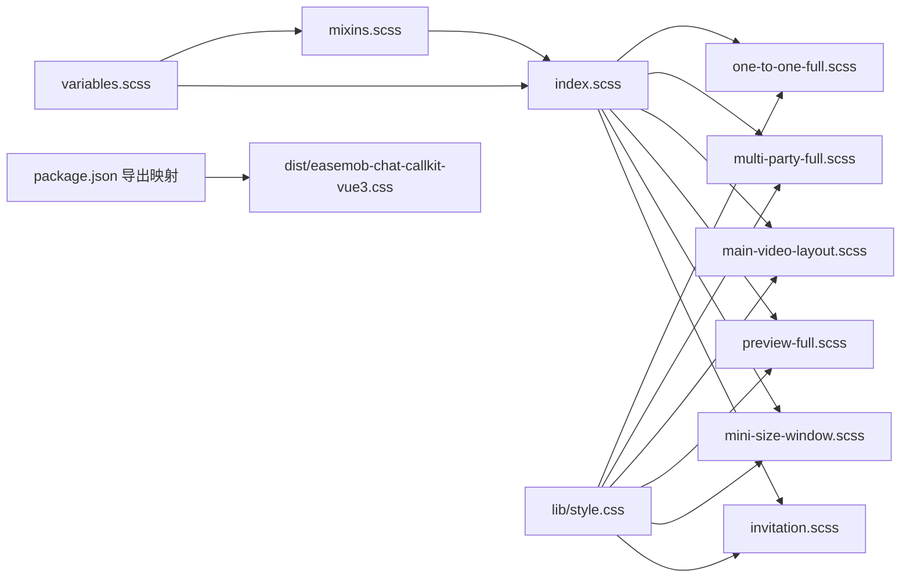

# 全局样式

<cite>
**本文引用的文件**
- [callkit/styles/index.scss](file://callkit/styles/index.scss)
- [callkit/styles/variables.scss](file://callkit/styles/variables.scss)
- [callkit/styles/mixins.scss](file://callkit/styles/mixins.scss)
- [callkit/styles/layouts/one-to-one-full.scss](file://callkit/styles/layouts/one-to-one-full.scss)
- [callkit/styles/layouts/multi-party-full.scss](file://callkit/styles/layouts/multi-party-full.scss)
- [callkit/styles/layouts/main-video-layout.scss](file://callkit/styles/layouts/main-video-layout.scss)
- [callkit/styles/layouts/preview-full.scss](file://callkit/styles/layouts/preview-full.scss)
- [callkit/styles/components/mini-size-window.scss](file://callkit/styles/components/mini-size-window.scss)
- [callkit/styles/invitation.scss](file://callkit/styles/invitation.scss)
- [lib/style.css](file://lib/style.css)
- [lib/index.ts](file://lib/index.ts)
- [package.json](file://package.json)
- [vite.lib.config.ts](file://vite.lib.config.ts)
- [vite.config.ts](file://vite.config.ts)
- [test/vite.config.source.ts](file://test/vite.config.source.ts)
</cite>

## 目录
1. [简介](#简介)
2. [项目结构](#项目结构)
3. [核心组件](#核心组件)
4. [架构总览](#架构总览)
5. [详细组件分析](#详细组件分析)
6. [依赖关系分析](#依赖关系分析)
7. [性能考量](#性能考量)
8. [故障排查指南](#故障排查指南)
9. [结论](#结论)
10. [附录](#附录)

## 简介
本文件系统化梳理该 Vue3 CallKit 组件库的全局样式体系，涵盖样式作用范围、组织结构、命名规范、导入方式、基础与重置样式、通用类名、优先级与冲突解决策略、调试技巧与浏览器兼容性，以及在不同项目中的集成方式。目标是帮助开发者快速理解并正确使用全局样式，避免样式冲突与性能问题。

## 项目结构
样式体系以 SCSS 为主，采用“入口聚合 + 分层模块”的组织方式：
- 入口聚合：统一在入口样式中按需导入各模块样式与变量/混入。
- 分层模块：按功能域拆分，如布局、组件、邀请页等，便于维护与复用。
- 构建产物：库打包时输出单一 CSS 文件，供外部项目直接引入。

**图表来源**
- [callkit/styles/index.scss](file://callkit/styles/index.scss#L1-L10)
- [callkit/styles/variables.scss](file://callkit/styles/variables.scss#L1-L49)
- [callkit/styles/mixins.scss](file://callkit/styles/mixins.scss#L1-L216)
- [callkit/styles/layouts/one-to-one-full.scss](file://callkit/styles/layouts/one-to-one-full.scss#L1-L298)
- [callkit/styles/layouts/multi-party-full.scss](file://callkit/styles/layouts/multi-party-full.scss#L1-L196)
- [callkit/styles/layouts/main-video-layout.scss](file://callkit/styles/layouts/main-video-layout.scss#L1-L418)
- [callkit/styles/layouts/preview-full.scss](file://callkit/styles/layouts/preview-full.scss#L1-L172)
- [callkit/styles/components/mini-size-window.scss](file://callkit/styles/components/mini-size-window.scss#L1-L346)
- [callkit/styles/invitation.scss](file://callkit/styles/invitation.scss#L1-L142)
- [lib/style.css](file://lib/style.css#L1-L15)
- [lib/index.ts](file://lib/index.ts#L1-L58)
- [package.json](file://package.json#L9-L19)
- [vite.lib.config.ts](file://vite.lib.config.ts#L37-L61)

**章节来源**
- [callkit/styles/index.scss](file://callkit/styles/index.scss#L1-L10)
- [lib/style.css](file://lib/style.css#L1-L15)
- [lib/index.ts](file://lib/index.ts#L1-L58)
- [package.json](file://package.json#L9-L19)
- [vite.lib.config.ts](file://vite.lib.config.ts#L37-L61)

## 核心组件
- 全局入口样式：集中导入变量、混入与各布局/组件样式，统一命名空间与基线样式。
- 变量与混入：提供尺寸、颜色、阴影、动画、响应式断点与常用布局混入，保证一致性与可维护性。
- 布局样式：针对不同场景（一对一全屏、多人全屏、主视频模式、预览全屏）提供独立样式模块。
- 组件样式：如迷你窗口、邀请页等，提供独立的类名体系与交互反馈。
- 库样式入口：打包时将各组件样式聚合为单一 CSS 文件，供外部项目直接引入。

**章节来源**
- [callkit/styles/index.scss](file://callkit/styles/index.scss#L11-L800)
- [callkit/styles/variables.scss](file://callkit/styles/variables.scss#L1-L49)
- [callkit/styles/mixins.scss](file://callkit/styles/mixins.scss#L1-L216)
- [callkit/styles/layouts/one-to-one-full.scss](file://callkit/styles/layouts/one-to-one-full.scss#L1-L298)
- [callkit/styles/layouts/multi-party-full.scss](file://callkit/styles/layouts/multi-party-full.scss#L1-L196)
- [callkit/styles/layouts/main-video-layout.scss](file://callkit/styles/layouts/main-video-layout.scss#L1-L418)
- [callkit/styles/layouts/preview-full.scss](file://callkit/styles/layouts/preview-full.scss#L1-L172)
- [callkit/styles/components/mini-size-window.scss](file://callkit/styles/components/mini-size-window.scss#L1-L346)
- [callkit/styles/invitation.scss](file://callkit/styles/invitation.scss#L1-L142)
- [lib/style.css](file://lib/style.css#L1-L15)

## 架构总览
全局样式的加载与使用路径如下：
- 开发/测试环境：通过 Vite 别名将 “easemob-chat-callkit-vue3/style.css” 指向 lib/style.css。
- 库打包：vite.lib.config.ts 输出单一 CSS 文件，文件名为 easemob-chat-callkit-vue3.css。
- 运行时引入：库入口 lib/index.ts 自动引入 lib/style.css；外部项目也可直接引入打包产物。

**图表来源**
- [vite.config.ts](file://vite.config.ts#L8-L19)
- [test/vite.config.source.ts](file://test/vite.config.source.ts#L13-L22)
- [lib/style.css](file://lib/style.css#L1-L15)
- [package.json](file://package.json#L14-L17)
- [vite.lib.config.ts](file://vite.lib.config.ts#L53-L58)

**章节来源**
- [vite.config.ts](file://vite.config.ts#L8-L19)
- [test/vite.config.source.ts](file://test/vite.config.source.ts#L13-L22)
- [lib/style.css](file://lib/style.css#L1-L15)
- [package.json](file://package.json#L14-L17)
- [vite.lib.config.ts](file://vite.lib.config.ts#L53-L58)

## 详细组件分析

### 命名规范与作用域
- 命名空间：统一使用前缀类名，结合变量生成稳定前缀，避免与业务样式冲突。
- 类名层级：采用 BEM 风格的层级命名，如 .callkit-header、.callkit-content 等，清晰表达父子关系。
- 组件前缀：各布局与组件样式均以统一前缀开头，配合命名空间减少全局污染。

**章节来源**
- [callkit/styles/index.scss](file://callkit/styles/index.scss#L11-L120)

### 变量与混入
- 变量：集中定义尺寸、间距、颜色、阴影、动画时长、视频窗口参数、z-index、响应式断点等。
- 混入：封装容器、空状态、视频窗口、视频容器、视频元素、占位符、头像、昵称、静音指示器、全屏、响应式布局、Flex 行/列、视频包装器等常用样式片段，提升复用性与一致性。

**章节来源**
- [callkit/styles/variables.scss](file://callkit/styles/variables.scss#L1-L49)
- [callkit/styles/mixins.scss](file://callkit/styles/mixins.scss#L1-L216)

### 布局样式
- 一对一全屏布局：提供主视频与画中画小窗的定位、尺寸与遮罩层，适配移动端与小屏设备。
- 多人全屏布局：顶部 Header、中间 Content、底部 Controls 的固定高度与弹性布局，支持最小化状态与全屏模式。
- 主视频模式：主视频区域与缩略图区域的组合，含返回按钮、滚动与滑动按钮、空状态与响应式适配。
- 预览全屏布局：顶部 Header、中间 Content、底部 Controls 的固定高度与弹性布局，带最小化状态与全屏模式。

**章节来源**
- [callkit/styles/layouts/one-to-one-full.scss](file://callkit/styles/layouts/one-to-one-full.scss#L1-L298)
- [callkit/styles/layouts/multi-party-full.scss](file://callkit/styles/layouts/multi-party-full.scss#L1-L196)
- [callkit/styles/layouts/main-video-layout.scss](file://callkit/styles/layouts/main-video-layout.scss#L1-L418)
- [callkit/styles/layouts/preview-full.scss](file://callkit/styles/layouts/preview-full.scss#L1-L172)

### 组件样式
- 迷你窗口：支持点击态、1v1 视频模式与普通模式、音频/视频类型区分、连接状态高亮、快速控制按钮、恢复提示等。
- 邀请页：邀请内容区、头像、信息区（来电者、描述、计时）、动作区（拒绝/接听），并提供深色模式支持。

**章节来源**
- [callkit/styles/components/mini-size-window.scss](file://callkit/styles/components/mini-size-window.scss#L1-L346)
- [callkit/styles/invitation.scss](file://callkit/styles/invitation.scss#L1-L142)

### 入口样式与导入顺序
- 入口样式按“主题/变量 → 混入 → 各布局 → 各组件 → 顶层命名空间样式”的顺序导入，确保变量与混入先于使用。
- 顶层命名空间包裹所有类名，统一 z-index、过渡动画、最小化状态、拖拽/调整大小状态等。

**章节来源**
- [callkit/styles/index.scss](file://callkit/styles/index.scss#L1-L10)
- [callkit/styles/index.scss](file://callkit/styles/index.scss#L23-L800)

## 依赖关系分析
- 入口样式依赖变量与混入，再依赖各布局与组件样式。
- 库样式入口聚合各组件样式，供运行时使用。
- 包导出映射将 “./style.css” 指向打包产物，简化外部引入。

**图表来源**
- [callkit/styles/index.scss](file://callkit/styles/index.scss#L1-L10)
- [callkit/styles/variables.scss](file://callkit/styles/variables.scss#L1-L49)
- [callkit/styles/mixins.scss](file://callkit/styles/mixins.scss#L1-L216)
- [callkit/styles/layouts/one-to-one-full.scss](file://callkit/styles/layouts/one-to-one-full.scss#L1-L298)
- [callkit/styles/layouts/multi-party-full.scss](file://callkit/styles/layouts/multi-party-full.scss#L1-L196)
- [callkit/styles/layouts/main-video-layout.scss](file://callkit/styles/layouts/main-video-layout.scss#L1-L418)
- [callkit/styles/layouts/preview-full.scss](file://callkit/styles/layouts/preview-full.scss#L1-L172)
- [callkit/styles/components/mini-size-window.scss](file://callkit/styles/components/mini-size-window.scss#L1-L346)
- [callkit/styles/invitation.scss](file://callkit/styles/invitation.scss#L1-L142)
- [lib/style.css](file://lib/style.css#L1-L15)
- [package.json](file://package.json#L14-L17)

**章节来源**
- [callkit/styles/index.scss](file://callkit/styles/index.scss#L1-L10)
- [lib/style.css](file://lib/style.css#L1-L15)
- [package.json](file://package.json#L14-L17)

## 性能考量
- 样式打包：库构建关闭 cssCodeSplit，合并为单一 CSS 文件，减少网络往返。
- 选择器复杂度：尽量使用扁平层级与稳定前缀，避免深层嵌套导致的匹配开销。
- 动画与过渡：统一使用变量控制时长与缓动，避免频繁重排。
- 响应式：在混入与布局中集中处理断点，减少重复媒体查询。

**章节来源**
- [vite.lib.config.ts](file://vite.lib.config.ts#L45-L46)
- [callkit/styles/mixins.scss](file://callkit/styles/mixins.scss#L165-L192)

## 故障排查指南
- 样式未生效
  - 确认已引入库样式入口或打包产物 CSS。
  - 检查 Vite 别名是否指向 lib/style.css 或 dist/easemob-chat-callkit-vue3.css。
- 样式冲突
  - 使用统一命名空间与稳定前缀，避免与业务样式重名。
  - 通过类名层级与局部作用域隔离，必要时使用 ::ng-deep（若在框架内支持）。
- 动画异常
  - 检查过渡时长与缓动变量是否一致。
  - 确认关键帧名称唯一且未被覆盖。
- 响应式问题
  - 核对断点变量与媒体查询是否符合预期。
  - 在混入中集中修改响应式规则，避免分散配置。

**章节来源**
- [vite.config.ts](file://vite.config.ts#L8-L19)
- [test/vite.config.source.ts](file://test/vite.config.source.ts#L13-L22)
- [callkit/styles/variables.scss](file://callkit/styles/variables.scss#L46-L49)
- [callkit/styles/mixins.scss](file://callkit/styles/mixins.scss#L165-L192)

## 结论
该全局样式体系通过“入口聚合 + 分层模块 + 变量/混入 + 命名空间”的设计，实现了高内聚、低耦合与强一致性的样式架构。遵循本文档的命名规范、导入方式与最佳实践，可在不同项目中稳定集成并扩展，同时兼顾性能与可维护性。

## 附录

### 样式文件组织与命名规范
- 组织结构
  - 入口样式：callkit/styles/index.scss
  - 变量：callkit/styles/variables.scss
  - 混入：callkit/styles/mixins.scss
  - 布局：callkit/styles/layouts/*.scss
  - 组件：callkit/styles/components/*.scss
  - 邀请页：callkit/styles/invitation.scss
  - 库样式入口：lib/style.css
- 命名规范
  - 统一前缀与层级命名，避免全局污染。
  - 使用语义化类名，明确父子关系与用途。

**章节来源**
- [callkit/styles/index.scss](file://callkit/styles/index.scss#L1-L10)
- [callkit/styles/variables.scss](file://callkit/styles/variables.scss#L1-L49)
- [callkit/styles/mixins.scss](file://callkit/styles/mixins.scss#L1-L216)
- [callkit/styles/layouts/one-to-one-full.scss](file://callkit/styles/layouts/one-to-one-full.scss#L1-L298)
- [callkit/styles/layouts/multi-party-full.scss](file://callkit/styles/layouts/multi-party-full.scss#L1-L196)
- [callkit/styles/layouts/main-video-layout.scss](file://callkit/styles/layouts/main-video-layout.scss#L1-L418)
- [callkit/styles/layouts/preview-full.scss](file://callkit/styles/layouts/preview-full.scss#L1-L172)
- [callkit/styles/components/mini-size-window.scss](file://callkit/styles/components/mini-size-window.scss#L1-L346)
- [callkit/styles/invitation.scss](file://callkit/styles/invitation.scss#L1-L142)
- [lib/style.css](file://lib/style.css#L1-L15)

### 样式优先级与冲突解决
- 优先级策略
  - 变量与混入优先于具体类名。
  - 命名空间包裹的顶层样式优先于布局与组件样式。
  - 响应式断点在混入中集中处理，避免重复覆盖。
- 冲突解决
  - 使用稳定前缀与层级命名，避免与第三方库冲突。
  - 通过类名组合与局部作用域隔离，减少全局影响。

**章节来源**
- [callkit/styles/index.scss](file://callkit/styles/index.scss#L11-L800)
- [callkit/styles/mixins.scss](file://callkit/styles/mixins.scss#L165-L192)

### 浏览器兼容性
- 媒体查询与断点：使用标准断点变量，适配移动端、平板与桌面端。
- 动画与过渡：统一使用 CSS 变量控制时长与缓动，确保跨浏览器一致性。
- 滚动条隐藏：提供 WebKit 与 Firefox 的兼容写法。

**章节来源**
- [callkit/styles/layouts/main-video-layout.scss](file://callkit/styles/layouts/main-video-layout.scss#L106-L112)
- [callkit/styles/variables.scss](file://callkit/styles/variables.scss#L46-L49)

### 正确引入与使用方式
- 开发/测试环境
  - 通过 Vite 别名将 “easemob-chat-callkit-vue3/style.css” 指向 lib/style.css。
- 生产环境
  - 通过包导出映射引入 dist/easemob-chat-callkit-vue3.css。
- 库入口
  - 库入口会自动引入 lib/style.css，简化外部使用。

**章节来源**
- [vite.config.ts](file://vite.config.ts#L8-L19)
- [test/vite.config.source.ts](file://test/vite.config.source.ts#L13-L22)
- [lib/style.css](file://lib/style.css#L1-L15)
- [lib/index.ts](file://lib/index.ts#L1-L58)
- [package.json](file://package.json#L14-L17)