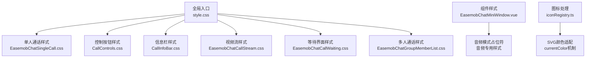
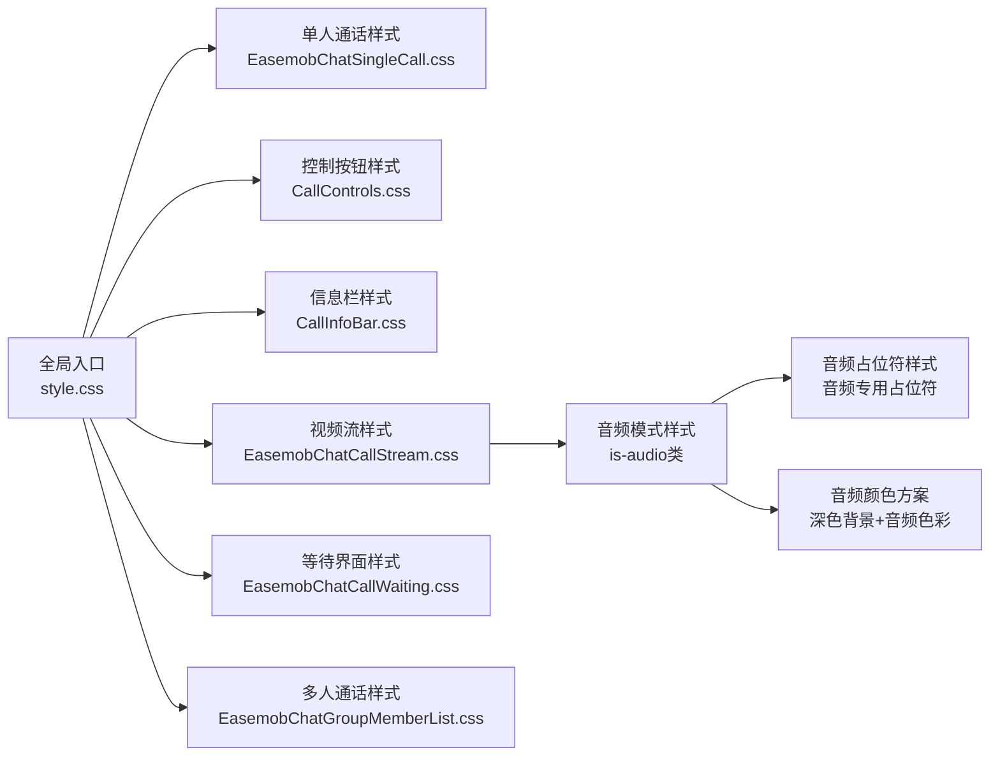
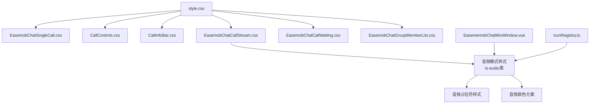

# 样式与定制

<cite>
**本文档引用的文件**
- [lib/style.css](file://lib/style.css)
- [lib/components/singleCall/styles/EasemobChatSingleCall.css](file://lib/components/singleCall/styles/EasemobChatSingleCall.css)
- [lib/components/singleCall/styles/CallControls.css](file://lib/components/singleCall/styles/CallControls.css)
- [lib/components/singleCall/styles/CallInfoBar.css](file://lib/components/singleCall/styles/CallInfoBar.css)
- [lib/components/singleCall/styles/EasemobChatCallStream.css](file://lib/components/singleCall/styles/EasemobChatCallStream.css)
- [lib/components/singleCall/styles/EasemobChatCallWaiting.css](file://lib/components/singleCall/styles/EasemobChatCallWaiting.css)
- [lib/components/multiCall/styles/EasemobChatGroupMemberList.css](file://lib/components/multiCall/styles/EasemobChatGroupMemberList.css)
- [lib/components/EasemobChatMiniWindow.vue](file://lib/components/EasemobChatMiniWindow.vue)
- [lib/modules/groupCall/components/iconRegistry.ts](file://lib/modules/groupCall/components/iconRegistry.ts)
- [lib/callkit-static-assets/README.md](file://lib/callkit-static-assets/README.md)
- [lib/config/README.md](file://lib/config/README.md)
</cite>

## 更新摘要
**变更内容**
- 新增完整的音频模式样式系统，包括深色背景、音频专用占位符、音频模式特定的颜色方案
- 更新了音频模式下的占位符样式，从视频占位符转换为音频专用占位符
- 新增音频模式的颜色变量和状态样式
- 更新了最小化窗口组件的音频模式支持
- 完善了图标颜色处理机制，支持音频模式下的颜色适配

## 目录
1. [简介](#简介)
2. [项目结构](#项目结构)
3. [核心组件](#核心组件)
4. [架构总览](#架构总览)
5. [详细组件分析](#详细组件分析)
6. [音频模式样式系统](#音频模式样式系统)
7. [依赖关系分析](#依赖关系分析)
8. [性能考量](#性能考量)
9. [故障排查指南](#故障排查指南)
10. [结论](#结论)
11. [附录](#附录)

## 简介
本指南聚焦于 EaseMoB CallKit Vue3 组件的样式系统与主题定制，涵盖 CSS 变量、SCSS 混合器、组件样式与布局样式；解释全局样式结构、主题变量定义、组件样式覆盖机制；提供从颜色系统、字体设置、间距规范到响应式设计的完整主题定制流程；并总结样式覆盖的最佳实践与注意事项，帮助开发者创建自定义主题以适配不同品牌风格，同时给出样式调试与维护建议。

**更新** 本次更新重点新增了完整的音频模式样式系统，包括深色背景、音频专用占位符、音频模式特定的颜色方案等，为音频通话提供了完整的视觉体验。

## 项目结构
样式系统采用"全局入口 + 单人通话样式 + 多人通话样式 + 组件样式"的组织方式：
- 全局入口：style.css 导入各组件样式，统一命名空间与动画。
- 单人通话样式：包含通话窗口、控制按钮、信息栏、视频流、等待界面等完整样式体系。
- 多人通话样式：群组成员列表的完整样式实现。
- 组件样式：最小化窗口、邀请通知等辅助组件样式。
- 图标处理：统一的 SVG 图标颜色处理机制。



**图表来源**
- [lib/style.css:1-12](file://lib/style.css#L1-L12)
- [lib/components/singleCall/styles/EasemobChatSingleCall.css:1-79](file://lib/components/singleCall/styles/EasemobChatSingleCall.css#L1-L79)
- [lib/components/singleCall/styles/CallControls.css:1-115](file://lib/components/singleCall/styles/CallControls.css#L1-L115)
- [lib/components/singleCall/styles/CallInfoBar.css:1-46](file://lib/components/singleCall/styles/CallInfoBar.css#L1-L46)
- [lib/components/singleCall/styles/EasemobChatCallStream.css:1-175](file://lib/components/singleCall/styles/EasemobChatCallStream.css#L1-L175)
- [lib/components/singleCall/styles/EasemobChatCallWaiting.css:1-94](file://lib/components/singleCall/styles/EasemobChatCallWaiting.css#L1-L94)
- [lib/components/multiCall/styles/EasemobChatGroupMemberList.css:1-347](file://lib/components/multiCall/styles/EasemobChatGroupMemberList.css#L1-L347)
- [lib/components/EasemobChatMiniWindow.vue:344-378](file://lib/components/EasemobChatMiniWindow.vue#L344-L378)
- [lib/modules/groupCall/components/iconRegistry.ts:16-34](file://lib/modules/groupCall/components/iconRegistry.ts#L16-L34)

## 核心组件
- 全局样式入口：统一导入变量、混合器与各模块样式，定义命名空间与通用动画。
- 单人通话样式：完整的通话界面样式，包括窗口容器、控制按钮、信息栏、视频流等。
- 多人通话样式：群组通话的完整样式实现，包括成员列表、滚动条、状态指示等。
- 组件样式：最小化窗口、邀请通知等辅助组件样式。
- 图标处理：统一的 SVG 图标颜色处理机制，支持通过 CSS 修改颜色。

**更新** 核心组件现在包括完整的音频模式支持，为音频通话提供了专门的样式系统。

**章节来源**
- [lib/style.css:1-12](file://lib/style.css#L1-L12)
- [lib/components/singleCall/styles/EasemobChatSingleCall.css:1-79](file://lib/components/singleCall/styles/EasemobChatSingleCall.css#L1-L79)
- [lib/components/singleCall/styles/CallControls.css:1-115](file://lib/components/singleCall/styles/CallControls.css#L1-L115)
- [lib/components/singleCall/styles/CallInfoBar.css:1-46](file://lib/components/singleCall/styles/CallInfoBar.css#L1-L46)
- [lib/components/singleCall/styles/EasemobChatCallStream.css:1-175](file://lib/components/singleCall/styles/EasemobChatCallStream.css#L1-L175)
- [lib/components/multiCall/styles/EasemobChatGroupMemberList.css:1-347](file://lib/components/multiCall/styles/EasemobChatGroupMemberList.css#L1-L347)

## 架构总览
样式系统围绕"全局入口—单人通话—多人通话—组件样式"四层展开，形成完整的样式体系。音频模式作为单人通话样式的重要组成部分，提供了专门的视觉体验。



**图表来源**
- [lib/style.css:1-12](file://lib/style.css#L1-L12)
- [lib/components/singleCall/styles/EasemobChatCallStream.css:13-46](file://lib/components/singleCall/styles/EasemobChatCallStream.css#L13-L46)
- [lib/components/EasemobChatMiniWindow.vue:344-378](file://lib/components/EasemobChatMiniWindow.vue#L344-L378)

## 详细组件分析

### 全局样式与命名空间
- 全局入口导入单人通话和多人通话的所有样式文件，定义组件前缀与通用动画。
- 通过命名空间类名包裹，避免样式冲突；同时提供过渡与交互动画。

**章节来源**
- [lib/style.css:1-12](file://lib/style.css#L1-L12)

### 单人通话样式系统
- 通话窗口容器：仿微信比例的360x640尺寸，支持拖拽、模糊背景、圆角边框等。
- 控制按钮区域：底部居中的控制按钮布局，支持激活、禁用、加载等状态。
- 信息栏：顶部的通话状态和时长显示，支持动画效果。
- 视频流区域：远程视频和本地小窗的完整布局。
- 等待界面：来电等待时的完整界面样式。

**更新** 单人通话样式系统现在包含完整的音频模式支持，通过 `is-audio` 类实现音频通话的专门样式。

**章节来源**
- [lib/components/singleCall/styles/EasemobChatSingleCall.css:1-79](file://lib/components/singleCall/styles/EasemobChatSingleCall.css#L1-L79)
- [lib/components/singleCall/styles/CallControls.css:1-115](file://lib/components/singleCall/styles/CallControls.css#L1-L115)
- [lib/components/singleCall/styles/CallInfoBar.css:1-46](file://lib/components/singleCall/styles/CallInfoBar.css#L1-L46)
- [lib/components/singleCall/styles/EasemobChatCallStream.css:1-175](file://lib/components/singleCall/styles/EasemobChatCallStream.css#L1-L175)
- [lib/components/singleCall/styles/EasemobChatCallWaiting.css:1-94](file://lib/components/singleCall/styles/EasemobChatCallWaiting.css#L1-L94)

### 多人通话样式系统
- 遮罩层：全屏背景遮罩，支持模糊效果和淡入动画。
- 容器：360px宽度的成员列表容器，支持最大高度限制。
- 成员列表：完整的成员列表样式，包括头像、名称、状态等。
- 滚动条：自定义滚动条样式，支持主题一致性。
- 状态指示：邀请状态、加载状态、空状态的完整样式实现。

**更新** 多人通话样式系统现在支持音频模式下的成员列表显示，音频通话时会显示相应的成员信息。

**章节来源**
- [lib/components/multiCall/styles/EasemobChatGroupMemberList.css:1-347](file://lib/components/multiCall/styles/EasemobChatGroupMemberList.css#L1-L347)

### 组件样式与交互态
- 最小化窗口：支持视频和音频两种模式，状态边框、动画与响应式。
- 邀请通知：完整的邀请通知样式，支持多种状态和交互。
- 图标处理：统一的SVG图标颜色处理，支持currentColor机制。

**更新** 最小化窗口现在支持音频模式，音频通话时会显示音频专用的占位符和样式。

**章节来源**
- [lib/components/EasemobChatMiniWindow.vue:344-378](file://lib/components/EasemobChatMiniWindow.vue#L344-L378)

### 图标颜色处理机制
- SVG图标统一处理：通过正则表达式替换固定颜色为currentColor。
- 支持fill和stroke属性的动态颜色适配。
- 为音频模式提供专门的颜色方案支持。

**更新** 图标处理机制现在支持音频模式下的颜色适配，确保图标在音频模式下有正确的视觉效果。

**章节来源**
- [lib/modules/groupCall/components/iconRegistry.ts:16-34](file://lib/modules/groupCall/components/iconRegistry.ts#L16-L34)

## 音频模式样式系统

### 音频模式核心特性
音频模式通过 `is-audio` 类实现，为音频通话提供专门的视觉体验：
- 深色背景：使用 `#1a1a2e` 作为音频模式的主背景色
- 音频专用占位符：从视频占位符转换为音频专用的圆形占位符
- 颜色方案适配：音频模式下的所有文本、图标、状态指示的颜色调整
- 占位符样式：音频模式下的头像占位符使用更深的背景色和边框

### 音频模式样式实现

#### 深色背景系统
音频模式的核心是深色背景系统，提供舒适的音频通话视觉体验：
```css
.call-stream-container.is-audio {
  background: #1a1a2e;
}

.is-audio .remote-video-container {
  background: #1a1a2e;
}
```

#### 音频专用占位符
音频模式使用专门的占位符样式，替代视频模式的占位符：
```css
.is-audio .remote-placeholder {
  color: #fff;
}

.is-audio .avatar-placeholder {
  width: 160px;
  height: 160px;
  background: #2d2d44;
  border: 3px solid rgba(255, 255, 255, 0.15);
  backdrop-filter: none;
}

.is-audio .user-icon {
  color: rgba(255, 255, 255, 0.8);
}
```

#### 音频模式颜色方案
音频模式下的完整颜色方案适配：
- 文本颜色：白色(#fff)用于主要文本，半透明白色(rgba(255,255,255,0.6))用于次要文本
- 状态指示：音频模式下的状态文本使用半透明白色
- 头像占位符：使用更深的背景色(#2d2d44)和更明显的边框
- 用户名称：使用较大的字体尺寸(28px)突出显示

#### 音频模式状态样式
音频模式下的状态指示和交互样式：
- 连接状态：使用半透明白色(#fff)的连接文本
- 呼叫状态：音频模式下的状态文本使用半透明白色(rgba(255,255,255,0.6))
- 动画效果：音频模式下的脉冲动画使用白色透明度效果

**章节来源**
- [lib/components/singleCall/styles/EasemobChatCallStream.css:13-46](file://lib/components/singleCall/styles/EasemobChatCallStream.css#L13-L46)
- [lib/components/EasemobChatMiniWindow.vue:344-378](file://lib/components/EasemobChatMiniWindow.vue#L344-L378)

### 音频模式与最小化窗口集成
音频模式不仅影响主通话界面，还会影响最小化窗口的显示：
- 最小化窗口在音频模式下显示音频专用的占位符
- 音频模式下的最小化窗口使用深色背景和合适的对比度
- 音频模式下的计时器显示使用半透明白色，确保可读性

**章节来源**
- [lib/components/EasemobChatMiniWindow.vue:344-378](file://lib/components/EasemobChatMiniWindow.vue#L344-L378)

## 依赖关系分析
- 全局入口依赖各个组件样式文件，形成完整的样式体系。
- 音频模式样式依赖于单人通话样式的基础结构。
- 最小化窗口样式与音频模式样式相互独立但可以同时存在。
- 图标处理机制为音频模式提供颜色适配支持。



**图表来源**
- [lib/style.css:1-12](file://lib/style.css#L1-L12)
- [lib/components/singleCall/styles/EasemobChatCallStream.css:13-46](file://lib/components/singleCall/styles/EasemobChatCallStream.css#L13-L46)
- [lib/components/EasemobChatMiniWindow.vue:344-378](file://lib/components/EasemobChatMiniWindow.vue#L344-L378)
- [lib/modules/groupCall/components/iconRegistry.ts:16-34](file://lib/modules/groupCall/components/iconRegistry.ts#L16-L34)

## 性能考量
- 使用CSS类选择器而非内联样式，提高样式复用效率。
- 音频模式使用单一的 `is-audio` 类，避免复杂的样式计算。
- 图标颜色处理通过正则表达式一次性完成，减少运行时开销。
- 响应式设计使用媒体查询，确保在不同设备上的性能表现。

**更新** 音频模式样式系统经过优化，使用高效的CSS类选择器和单一的音频模式标识，确保性能表现。

## 故障排查指南
- 音频模式样式未生效
  - 检查 `is-audio` 类是否正确添加到 `.call-stream-container` 元素上
  - 确认音频模式的CSS规则是否正确编译和加载
  - 验证音频模式下的颜色对比度是否符合可访问性要求
- 音频占位符显示异常
  - 检查音频模式下的占位符CSS规则是否正确
  - 确认音频模式下的头像占位符尺寸和样式设置
  - 验证音频模式下的用户图标颜色是否正确
- 图标颜色不正确
  - 检查SVG图标是否正确处理为currentColor
  - 确认音频模式下的图标颜色适配是否正常
  - 验证图标的fill和stroke属性是否被正确替换

**更新** 故障排查现在包括音频模式相关的专门问题，如音频模式样式未生效、音频占位符显示异常等。

**章节来源**
- [lib/components/singleCall/styles/EasemobChatCallStream.css:13-46](file://lib/components/singleCall/styles/EasemobChatCallStream.css#L13-L46)
- [lib/modules/groupCall/components/iconRegistry.ts:16-34](file://lib/modules/groupCall/components/iconRegistry.ts#L16-L34)

## 结论
该样式系统通过"全局入口—单人通话—多人通话—组件样式"的分层设计，实现了完整的音频模式支持。音频模式样式系统提供了专门的深色背景、音频专用占位符、完整的颜色方案适配，为音频通话提供了优质的视觉体验。遵循本文档的主题定制流程与最佳实践，可以在不破坏原有结构的前提下，灵活创建自定义主题并适配不同品牌风格。

**更新** 本次更新特别关注了音频模式样式系统的完整实现，包括深色背景、音频专用占位符、颜色方案适配等特性，为音频通话提供了专业的视觉体验。

## 附录

### 主题定制流程（颜色系统、字体、间距、响应式）
- 颜色系统
  - 在音频模式下，使用深色背景(#1a1a2e)和深色占位符(#2d2d44)提供舒适的视觉体验
  - 文本颜色使用白色(#fff)和半透明白色(rgba(255,255,255,0.6))确保可读性
  - 状态指示使用半透明白色，与深色背景形成良好对比
  - 音频模式下的图标颜色通过currentColor机制自动适配
- 字体设置
  - 音频模式下的用户名称使用28px字体大小，突出显示通话对象
  - 状态文本使用14px字体大小，保持适当的可读性
  - 所有文本使用无衬线字体，确保在深色背景下的清晰度
- 间距规范
  - 音频模式下的占位符使用160px×160px的尺寸，提供充足的视觉焦点
  - 头像占位符使用3px边框，与深色背景形成明显区分
  - 文本间距使用标准的垂直间距，确保信息层次清晰
- 响应式设计
  - 音频模式下的占位符在移动设备上自动调整为120px×120px
  - 音频模式下的用户名称在小屏幕上自动调整为24px字体大小

**更新** 颜色系统现在包含完整的音频模式支持，字体设置考虑了音频通话的特殊需求。

**章节来源**
- [lib/components/singleCall/styles/EasemobChatCallStream.css:13-46](file://lib/components/singleCall/styles/EasemobChatCallStream.css#L13-L46)
- [lib/components/EasemobChatMiniWindow.vue:344-378](file://lib/components/EasemobChatMiniWindow.vue#L344-L378)

### 样式覆盖最佳实践与注意事项
- 优先使用CSS类选择器而非内联样式，确保音频模式的可维护性
- 通过 `is-audio` 类实现音频模式的样式覆盖，避免样式冲突
- 音频模式下的颜色对比度必须符合WCAG 2.1 AA标准
- 图标颜色处理通过currentColor机制实现，确保主题一致性
- 音频模式的占位符尺寸和颜色必须与整体设计语言保持一致
- 音频模式下的动画效果应该适度，避免分散用户注意力

**更新** 样式覆盖现在包括音频模式的专门最佳实践，确保音频通话的视觉体验质量。

**章节来源**
- [lib/components/singleCall/styles/EasemobChatCallStream.css:13-46](file://lib/components/singleCall/styles/EasemobChatCallStream.css#L13-L46)
- [lib/modules/groupCall/components/iconRegistry.ts:16-34](file://lib/modules/groupCall/components/iconRegistry.ts#L16-L34)
- [lib/callkit-static-assets/README.md:225-230](file://lib/callkit-static-assets/README.md#L225-L230)