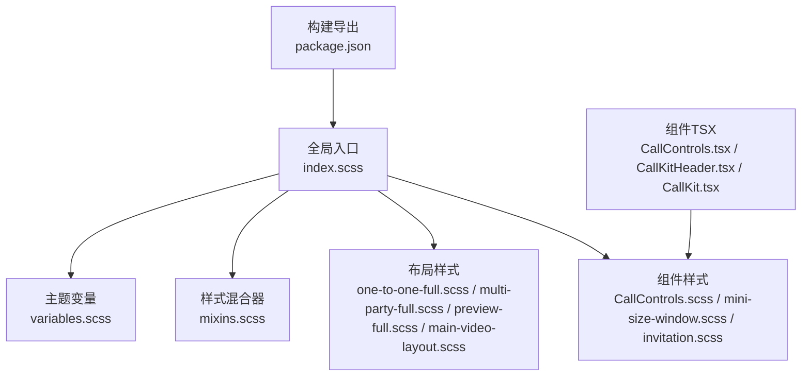
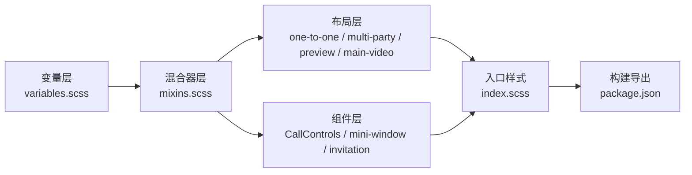
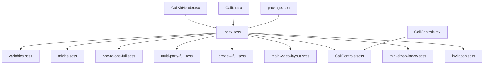

# 样式与定制

<cite>
**本文档引用的文件**
- [callkit/styles/index.scss](file://callkit/styles/index.scss)
- [callkit/styles/variables.scss](file://callkit/styles/variables.scss)
- [callkit/styles/mixins.scss](file://callkit/styles/mixins.scss)
- [callkit/styles/invitation.scss](file://callkit/styles/invitation.scss)
- [callkit/styles/components/mini-size-window.scss](file://callkit/styles/components/mini-size-window.scss)
- [callkit/styles/layouts/one-to-one-full.scss](file://callkit/styles/layouts/one-to-one-full.scss)
- [callkit/styles/layouts/multi-party-full.scss](file://callkit/styles/layouts/multi-party-full.scss)
- [callkit/styles/layouts/preview-full.scss](file://callkit/styles/layouts/preview-full.scss)
- [callkit/styles/layouts/main-video-layout.scss](file://callkit/styles/layouts/main-video-layout.scss)
- [callkit/components/CallControls.scss](file://callkit/components/CallControls.scss)
- [callkit/components/CallControls.tsx](file://callkit/components/CallControls.tsx)
- [callkit/components/CallKitHeader.tsx](file://callkit/components/CallKitHeader.tsx)
- [callkit/CallKit.tsx](file://callkit/CallKit.tsx)
- [package.json](file://package.json)
</cite>

## 更新摘要
**变更内容**
- 更新了可访问性改进部分，包括深色文本颜色和主题一致性
- 新增了视觉反馈增强的详细说明
- 更新了滚动条处理和主题一致性的相关内容
- 完善了样式覆盖的最佳实践

## 目录
1. [简介](#简介)
2. [项目结构](#项目结构)
3. [核心组件](#核心组件)
4. [架构总览](#架构总览)
5. [详细组件分析](#详细组件分析)
6. [依赖关系分析](#依赖关系分析)
7. [性能考量](#性能考量)
8. [故障排查指南](#故障排查指南)
9. [结论](#结论)
10. [附录](#附录)

## 简介
本指南聚焦于 EaseMoB CallKit Vue3 组件的样式系统与主题定制，涵盖 CSS 变量、SCSS 混合器、组件样式与布局样式；解释全局样式结构、主题变量定义、组件样式覆盖机制；提供从颜色系统、字体设置、间距规范到响应式设计的完整主题定制流程；并总结样式覆盖的最佳实践与注意事项，帮助开发者创建自定义主题以适配不同品牌风格，同时给出样式调试与维护建议。

**更新** 本次更新重点关注UI样式改进，包括更好的可访问性（深色文本颜色）、主题一致性（暗色滚动条）和视觉反馈增强。

## 项目结构
样式系统采用"全局变量 + 混合器 + 分层布局 + 组件局部样式"的组织方式：
- 全局入口：index.scss 导入变量、混合器与各布局/组件样式，统一命名空间与动画。
- 主题变量：variables.scss 定义尺寸、颜色、阴影、动画、视频窗口、z-index、断点等。
- 混合器：mixins.scss 抽象容器、视频窗口、头像、指示器、全屏、响应式等常用样式片段。
- 布局样式：按场景拆分（单人全屏、多人全屏、预览全屏、主视频模式），便于按需引入。
- 组件样式：CallControls.scss 等组件局部样式，配合 TSX 组件实现交互状态与视觉反馈。
- 导出与打包：package.json 暴露样式资源路径，构建产物包含样式文件。

**图表来源**
- [callkit/styles/index.scss](file://callkit/styles/index.scss#L1-L10)
- [callkit/styles/variables.scss](file://callkit/styles/variables.scss#L1-L49)
- [callkit/styles/mixins.scss](file://callkit/styles/mixins.scss#L1-L216)
- [callkit/styles/layouts/one-to-one-full.scss](file://callkit/styles/layouts/one-to-one-full.scss#L1-L298)
- [callkit/styles/layouts/multi-party-full.scss](file://callkit/styles/layouts/multi-party-full.scss#L1-L196)
- [callkit/styles/layouts/preview-full.scss](file://callkit/styles/layouts/preview-full.scss#L1-L172)
- [callkit/styles/layouts/main-video-layout.scss](file://callkit/styles/layouts/main-video-layout.scss#L1-L418)
- [callkit/components/CallControls.scss](file://callkit/components/CallControls.scss#L1-L218)
- [callkit/styles/components/mini-size-window.scss](file://callkit/styles/components/mini-size-window.scss#L1-L346)
- [callkit/styles/invitation.scss](file://callkit/styles/invitation.scss#L1-L142)
- [package.json](file://package.json#L9-L18)

**章节来源**
- [callkit/styles/index.scss](file://callkit/styles/index.scss#L1-L10)
- [package.json](file://package.json#L9-L18)

## 核心组件
- 全局样式入口：统一导入变量、混合器与各模块样式，定义命名空间与通用动画。
- 主题变量：集中定义尺寸、颜色、阴影、动画、视频窗口、z-index、断点等，便于主题切换。
- 混合器：封装容器、视频窗口、头像、指示器、全屏、响应式等可复用样式片段。
- 布局样式：按场景拆分，覆盖单人全屏、多人全屏、预览全屏、主视频模式等。
- 组件样式：如 CallControls.scss，负责控制按钮的视觉状态与响应式适配。
- 组件 TSX：通过类名与状态驱动样式，实现交互态与视觉反馈。

**更新** 核心组件现在包括更好的可访问性和视觉反馈增强特性。

**章节来源**
- [callkit/styles/index.scss](file://callkit/styles/index.scss#L11-L800)
- [callkit/styles/variables.scss](file://callkit/styles/variables.scss#L1-L49)
- [callkit/styles/mixins.scss](file://callkit/styles/mixins.scss#L1-L216)
- [callkit/styles/layouts/one-to-one-full.scss](file://callkit/styles/layouts/one-to-one-full.scss#L1-L298)
- [callkit/styles/layouts/multi-party-full.scss](file://callkit/styles/layouts/multi-party-full.scss#L1-L196)
- [callkit/styles/layouts/preview-full.scss](file://callkit/styles/layouts/preview-full.scss#L1-L172)
- [callkit/styles/layouts/main-video-layout.scss](file://callkit/styles/layouts/main-video-layout.scss#L1-L418)
- [callkit/components/CallControls.scss](file://callkit/components/CallControls.scss#L1-L218)

## 架构总览
样式系统围绕"变量—混合器—布局—组件"四层展开，形成可组合、可覆盖、可扩展的主题体系。全局入口统一命名空间，混合器抽象通用样式，布局样式按场景组织，组件样式负责交互态与细节。

**图表来源**
- [callkit/styles/variables.scss](file://callkit/styles/variables.scss#L1-L49)
- [callkit/styles/mixins.scss](file://callkit/styles/mixins.scss#L1-L216)
- [callkit/styles/index.scss](file://callkit/styles/index.scss#L1-L10)
- [package.json](file://package.json#L9-L18)

## 详细组件分析

### 全局样式与命名空间
- 全局入口导入变量、混合器与各布局/组件样式，定义组件前缀与通用动画。
- 通过命名空间类名包裹，避免样式冲突；同时提供过渡与交互动画。

**更新** 全局样式现在包含更好的可访问性支持，使用深色文本颜色确保在深色背景下有足够的对比度。

**章节来源**
- [callkit/styles/index.scss](file://callkit/styles/index.scss#L1-L10)
- [callkit/styles/index.scss](file://callkit/styles/index.scss#L11-L800)

### 主题变量与颜色系统
- 尺寸变量：容器尺寸、内边距、圆角等。
- 间距变量：小、中、大三档间距，统一布局一致性。
- 颜色变量：背景、窗口背景、占位渐变、边框、文本、阴影等。
- 动画变量：快、中、慢三档过渡时间。
- 视频窗口变量：圆角、边框宽度、头像尺寸等。
- z-index 层级：头部、控制区、画中画、全屏等层级划分。
- 响应式断点：移动端、平板、桌面端断点。

**更新** 颜色系统现在包含更好的可访问性支持，使用高对比度的深色文本颜色（#F9FAFA）和半透明文本颜色（rgba(255, 255, 255, 0.6)）。

**章节来源**
- [callkit/styles/variables.scss](file://callkit/styles/variables.scss#L1-L49)

### SCSS 混合器与通用样式
- 容器混合器：统一容器尺寸、方向、溢出策略。
- 空状态混合器：统一空状态文案与透明度。
- 视频窗口基础/本地：统一窗口圆角、悬停边框、本地镜像处理。
- 视频容器/元素：统一填充策略与镜像处理。
- 头像/占位符/昵称/静音指示器：统一尺寸、定位与背景。
- 全屏模式：固定视口尺寸与层级。
- 响应式布局：按断点调整头像、昵称等细节。

**更新** 混合器现在包含更好的可访问性支持，确保在各种状态下都有足够的颜色对比度。

**章节来源**
- [callkit/styles/mixins.scss](file://callkit/styles/mixins.scss#L1-L216)

### 布局样式与场景覆盖
- 单人全屏布局：主视频占满、画中画悬浮、渐变遮罩提升可读性、浮动 Header/Controls。
- 多人全屏布局：顶部/底部固定区，空状态提示，最小化控制区与快速控制按钮。
- 预览全屏布局：顶部/底部固定区，最小化控制区与快速控制按钮。
- 主视频模式：主视频与缩略图列表，返回按钮、滚动容器、滑动按钮、空状态与动画。

**更新** 主视频模式现在包含暗色滚动条处理，通过 `display: none` 和 `scrollbar-width: none` 实现主题一致性。

**章节来源**
- [callkit/styles/layouts/one-to-one-full.scss](file://callkit/styles/layouts/one-to-one-full.scss#L1-L298)
- [callkit/styles/layouts/multi-party-full.scss](file://callkit/styles/layouts/multi-party-full.scss#L1-L196)
- [callkit/styles/layouts/preview-full.scss](file://callkit/styles/layouts/preview-full.scss#L1-L172)
- [callkit/styles/layouts/main-video-layout.scss](file://callkit/styles/layouts/main-video-layout.scss#L1-L418)

### 组件样式与交互态
- 控制按钮组件：统一按钮尺寸、文本标签、激活/禁用/加载态、挂断/接听/共享等状态样式；响应式断点适配。
- 邀请页样式：头像、名称、描述、计时器、接受/拒绝按钮，深色模式支持。
- 最小化窗口组件：视频/音频两种模式、状态边框、动画与响应式。

**更新** 控制按钮组件现在包含更好的视觉反馈，包括深色文本颜色（#F9FAFA）和增强的激活状态样式。

**章节来源**
- [callkit/components/CallControls.scss](file://callkit/components/CallControls.scss#L1-L218)
- [callkit/styles/invitation.scss](file://callkit/styles/invitation.scss#L1-L142)
- [callkit/styles/components/mini-size-window.scss](file://callkit/styles/components/mini-size-window.scss#L1-L346)

### 组件与样式的联动
- CallControls.tsx：通过类名与状态（激活/禁用/加载）驱动样式；支持自定义图标与渲染器；响应式断点适配。
- CallKitHeader.tsx：右侧操作按钮与状态切换；与布局层的 Header/Controls 区域联动。
- CallKit.tsx：主组件负责状态管理与布局切换，样式由布局层与组件层共同实现。

**章节来源**
- [callkit/components/CallControls.tsx](file://callkit/components/CallControls.tsx#L1-L800)
- [callkit/components/CallKitHeader.tsx](file://callkit/components/CallKitHeader.tsx#L1-L179)
- [callkit/CallKit.tsx](file://callkit/CallKit.tsx#L1-L800)

## 依赖关系分析
- 全局入口依赖变量与混合器，再按需导入布局与组件样式。
- 组件 TSX 通过类名与状态影响样式，形成"状态 → 类名 → 样式"的数据流。
- 构建导出通过 package.json 暴露样式资源路径，便于应用侧直接引入。

**图表来源**
- [callkit/styles/index.scss](file://callkit/styles/index.scss#L1-L10)
- [callkit/styles/variables.scss](file://callkit/styles/variables.scss#L1-L49)
- [callkit/styles/mixins.scss](file://callkit/styles/mixins.scss#L1-L216)
- [callkit/styles/layouts/one-to-one-full.scss](file://callkit/styles/layouts/one-to-one-full.scss#L1-L298)
- [callkit/styles/layouts/multi-party-full.scss](file://callkit/styles/layouts/multi-party-full.scss#L1-L196)
- [callkit/styles/layouts/preview-full.scss](file://callkit/styles/layouts/preview-full.scss#L1-L172)
- [callkit/styles/layouts/main-video-layout.scss](file://callkit/styles/layouts/main-video-layout.scss#L1-L418)
- [callkit/components/CallControls.scss](file://callkit/components/CallControls.scss#L1-L218)
- [callkit/styles/components/mini-size-window.scss](file://callkit/styles/components/mini-size-window.scss#L1-L346)
- [callkit/styles/invitation.scss](file://callkit/styles/invitation.scss#L1-L142)
- [callkit/components/CallControls.tsx](file://callkit/components/CallControls.tsx#L1-L800)
- [callkit/components/CallKitHeader.tsx](file://callkit/components/CallKitHeader.tsx#L1-L179)
- [callkit/CallKit.tsx](file://callkit/CallKit.tsx#L1-L800)
- [package.json](file://package.json#L9-L18)

## 性能考量
- 使用混合器与变量减少重复样式，提高维护效率。
- 布局层按场景拆分，按需引入，避免不必要的样式体积。
- 组件层通过状态类名驱动样式，避免频繁 DOM 操作。
- 响应式断点集中管理，减少重复媒体查询。

**更新** 性能考量现在包括更好的可访问性优化，深色文本颜色减少了视觉疲劳，同时保持了良好的对比度。

## 故障排查指南
- 样式未生效
  - 检查全局入口是否正确导入变量、混合器与布局/组件样式。
  - 确认组件类名与命名空间一致，避免选择器优先级不足。
  - 验证构建导出路径是否正确，应用侧是否正确引入样式资源。
- 交互态异常
  - 检查组件 TSX 是否正确传递状态类名（激活/禁用/加载）。
  - 确认组件样式中对应状态的选择器是否匹配。
- 响应式问题
  - 核对断点变量与媒体查询是否符合预期。
  - 在移动端/平板端验证关键元素尺寸与间距。

**更新** 故障排查现在包括可访问性相关的问题，如文本颜色对比度不足等。

**章节来源**
- [callkit/styles/index.scss](file://callkit/styles/index.scss#L1-L10)
- [callkit/components/CallControls.tsx](file://callkit/components/CallControls.tsx#L1-L800)
- [package.json](file://package.json#L9-L18)

## 结论
该样式系统通过"变量—混合器—布局—组件"的分层设计，实现了主题变量集中管理、通用样式可复用、场景化布局可组合与组件交互态可视化。遵循本文档的主题定制流程与最佳实践，可在不破坏原有结构的前提下，灵活创建自定义主题并适配不同品牌风格。

**更新** 本次更新特别关注了UI样式改进，包括更好的可访问性、主题一致性和视觉反馈增强，这些改进确保了用户在各种使用场景下都能获得良好的视觉体验。

## 附录

### 主题定制流程（颜色系统、字体、间距、响应式）
- 颜色系统
  - 在变量层统一修改背景、窗口背景、边框、文本、占位渐变等颜色变量。
  - 如需强调色，建议通过变量映射到组件状态类名，保证一致性。
  - **新增**：确保文本颜色具有足够的对比度，特别是在深色背景下使用高对比度文本颜色。
- 字体设置
  - 在混合器与组件样式中统一字体族、字号、字重与阴影，避免散落定义。
  - **新增**：考虑可访问性要求，确保字体大小和行高适合长时间阅读。
- 间距规范
  - 使用变量层的间距变量统一控制组件内外边距与行间距。
- 响应式设计
  - 在混合器与组件样式中统一断点与媒体查询，确保在各终端表现一致。

**更新** 颜色系统现在包含可访问性优化，字体设置考虑了长时间阅读的需求。

**章节来源**
- [callkit/styles/variables.scss](file://callkit/styles/variables.scss#L1-L49)
- [callkit/styles/mixins.scss](file://callkit/styles/mixins.scss#L165-L192)
- [callkit/components/CallControls.scss](file://callkit/components/CallControls.scss#L189-L218)

### 样式覆盖最佳实践与注意事项
- 优先使用变量与混合器，避免硬编码值。
- 通过命名空间与层级控制，避免样式冲突。
- 组件状态类名与样式一一对应，保持一致性。
- 响应式断点集中管理，避免重复定义。
- 构建导出路径清晰，应用侧按需引入。

**更新** 样式覆盖现在包括可访问性最佳实践，确保所有用户都能获得良好的视觉体验。

- **新增**：深色滚动条处理，使用 `display: none` 和 `scrollbar-width: none` 实现主题一致性。
- **新增**：文本颜色对比度优化，确保在深色背景下有足够的可读性。
- **新增**：视觉反馈增强，包括按钮状态的颜色变化和动画效果。

**章节来源**
- [callkit/styles/index.scss](file://callkit/styles/index.scss#L11-L800)
- [callkit/styles/mixins.scss](file://callkit/styles/mixins.scss#L1-L216)
- [callkit/styles/layouts/main-video-layout.scss](file://callkit/styles/layouts/main-video-layout.scss#L105-L112)
- [callkit/styles/variables.scss](file://callkit/styles/variables.scss#L21-L22)
- [package.json](file://package.json#L9-L18)