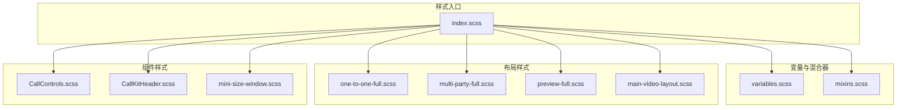
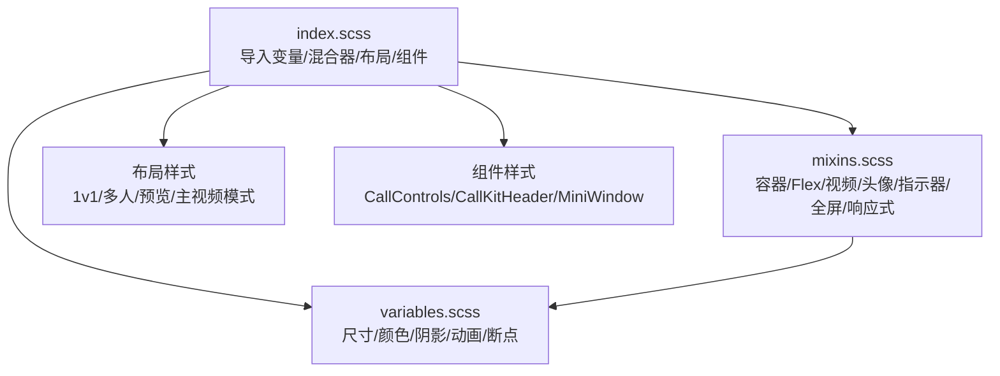
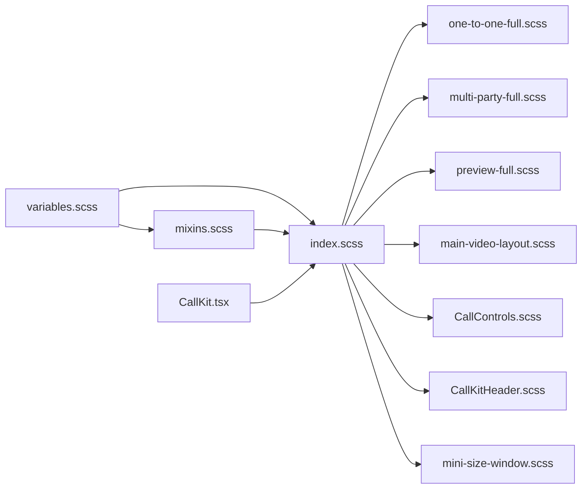

# 混合器与辅助工具

<cite>
**本文引用的文件**
- [mixins.scss](file://callkit/styles/mixins.scss)
- [variables.scss](file://callkit/styles/variables.scss)
- [index.scss](file://callkit/styles/index.scss)
- [mini-size-window.scss](file://callkit/styles/components/mini-size-window.scss)
- [one-to-one-full.scss](file://callkit/styles/layouts/one-to-one-full.scss)
- [multi-party-full.scss](file://callkit/styles/layouts/multi-party-full.scss)
- [preview-full.scss](file://callkit/styles/layouts/preview-full.scss)
- [main-video-layout.scss](file://callkit/styles/layouts/main-video-layout.scss)
- [CallControls.scss](file://callkit/components/CallControls.scss)
- [CallKitHeader.scss](file://callkit/components/CallKitHeader.scss)
- [CallKit.tsx](file://callkit/CallKit.tsx)
</cite>

## 目录
1. [简介](#简介)
2. [项目结构](#项目结构)
3. [核心组件](#核心组件)
4. [架构总览](#架构总览)
5. [详细组件分析](#详细组件分析)
6. [依赖关系分析](#依赖关系分析)
7. [性能考量](#性能考量)
8. [故障排查指南](#故障排查指南)
9. [结论](#结论)
10. [附录](#附录)

## 简介
本文件系统性梳理了 CallKit 项目中的 SCSS 混合器与辅助工具，涵盖布局混合器、响应式混合器、动画混合器的使用方法与参数配置，并总结常见样式模式的封装与复用策略。文档同时提供调用示例路径、最佳实践、扩展与自定义建议，以及提升样式开发效率的技巧。

## 项目结构
样式体系采用“变量 + 混合器 + 布局样式 + 组件样式”的分层组织方式：
- 变量层：统一管理尺寸、颜色、阴影、动画时长、断点等基础常量
- 混合器层：封装通用布局、容器、视频窗口、头像、指示器、全屏、响应式等可复用样式片段
- 布局层：按场景划分的一整套布局样式（1v1 完整布局、多人完整布局、预览完整布局、主视频模式）
- 组件层：独立组件的样式文件（如控制按钮、头部）

图表来源
- [index.scss](file://callkit/styles/index.scss#L1-L10)
- [variables.scss](file://callkit/styles/variables.scss#L1-L49)
- [mixins.scss](file://callkit/styles/mixins.scss#L1-L216)
- [one-to-one-full.scss](file://callkit/styles/layouts/one-to-one-full.scss#L1-L298)
- [multi-party-full.scss](file://callkit/styles/layouts/multi-party-full.scss#L1-L196)
- [preview-full.scss](file://callkit/styles/layouts/preview-full.scss#L1-L172)
- [main-video-layout.scss](file://callkit/styles/layouts/main-video-layout.scss#L1-L418)
- [CallControls.scss](file://callkit/components/CallControls.scss#L1-L218)
- [CallKitHeader.scss](file://callkit/components/CallKitHeader.scss#L1-L259)
- [mini-size-window.scss](file://callkit/styles/components/mini-size-window.scss#L1-L346)

章节来源
- [index.scss](file://callkit/styles/index.scss#L1-L10)

## 核心组件
本项目通过 SCSS 混合器与变量实现高度模块化的样式复用，核心能力包括：

- 容器与布局
  - 容器混合器：统一容器宽高、内边距、圆角、定位、flex 布局与溢出控制
  - Flex 行/列混合器：快速生成对齐与间距一致的 flex 容器
  - 视频包装器：控制视频元素的伸缩行为
- 视频与媒体
  - 视频窗口基础：统一窗口容器的圆角、溢出、过渡与悬停边框
  - 本地视频窗口：强调本地视频的边框颜色
  - 视频容器与元素：统一视频填充、镜像处理与容器翻转修复
  - 视频占位符：统一占位符尺寸与居中布局
- 用户界面
  - 头像图片与占位符：统一尺寸、圆角与占位符样式
  - 昵称标签与静音指示器：统一定位、背景、模糊与字体
- 布局与响应式
  - 全屏模式：固定视口、层级与圆角清零
  - 响应式布局：移动端、平板、桌面端的尺寸与字号微调
- 动画与过渡
  - 动画变量：统一快/中/慢三档过渡时长与缓动
  - 关键帧：等待动画、预览脉冲、进入/退出动画、视频出现动画等

章节来源
- [mixins.scss](file://callkit/styles/mixins.scss#L1-L216)
- [variables.scss](file://callkit/styles/variables.scss#L1-L49)

## 架构总览
CallKit 的样式架构遵循“入口导入 + 混合器复用 + 场景化布局”的设计，组件样式通过类名前缀与混合器组合，形成稳定且可扩展的样式体系。

图表来源
- [index.scss](file://callkit/styles/index.scss#L1-L10)
- [variables.scss](file://callkit/styles/variables.scss#L1-L49)
- [mixins.scss](file://callkit/styles/mixins.scss#L1-L216)
- [one-to-one-full.scss](file://callkit/styles/layouts/one-to-one-full.scss#L1-L298)
- [multi-party-full.scss](file://callkit/styles/layouts/multi-party-full.scss#L1-L196)
- [preview-full.scss](file://callkit/styles/layouts/preview-full.scss#L1-L172)
- [main-video-layout.scss](file://callkit/styles/layouts/main-video-layout.scss#L1-L418)
- [CallControls.scss](file://callkit/components/CallControls.scss#L1-L218)
- [CallKitHeader.scss](file://callkit/components/CallKitHeader.scss#L1-L259)
- [mini-size-window.scss](file://callkit/styles/components/mini-size-window.scss#L1-L346)

## 详细组件分析

### 布局混合器
- 容器混合器
  - 作用：统一容器宽高、盒模型、圆角、相对定位、flex 布局与溢出控制
  - 使用场景：CallKit 主容器、内容区、控制区等
  - 示例路径：[容器混合器](file://callkit/styles/mixins.scss#L2-L14)，[入口使用](file://callkit/styles/index.scss#L24)
- Flex 行/列混合器
  - 作用：快速生成水平/垂直居中、间距继承、收缩与最小高度控制
  - 使用场景：多人布局行容器、预览容器等
  - 示例路径：[Flex 行](file://callkit/styles/mixins.scss#L195-L202)，[Flex 列](file://callkit/styles/mixins.scss#L205-L210)，[多人布局行](file://callkit/styles/index.scss#L131-L133)
- 视频包装器
  - 作用：控制视频元素的伸缩行为，避免布局抖动
  - 使用场景：多人布局视频包装器
  - 示例路径：[视频包装器](file://callkit/styles/mixins.scss#L213-L216)，[多人布局包装器](file://callkit/styles/index.scss#L136-L138)

章节来源
- [mixins.scss](file://callkit/styles/mixins.scss#L1-L216)
- [index.scss](file://callkit/styles/index.scss#L125-L220)

### 响应式混合器
- 响应式布局
  - 作用：在移动端、平板、桌面端分别调整头像尺寸、昵称字号、内边距等
  - 断点：移动端、平板、桌面端
  - 示例路径：[响应式混合器](file://callkit/styles/mixins.scss#L165-L192)，[入口使用](file://callkit/styles/index.scss#L534)

章节来源
- [mixins.scss](file://callkit/styles/mixins.scss#L165-L192)
- [variables.scss](file://callkit/styles/variables.scss#L46-L49)
- [index.scss](file://callkit/styles/index.scss#L534)

### 动画混合器
- 动画变量
  - 作用：统一快/中/慢三档过渡时长与缓动
  - 示例路径：[动画变量](file://callkit/styles/variables.scss#L29-L32)
- 关键帧
  - 等待动画：等待状态的缩放动画
  - 预览脉冲：预览模式的边框脉冲
  - 进入/退出动画：主视频与缩略图的淡入淡出与位移
  - 视频出现动画：统一的视频窗口入场缩放
  - 示例路径：[等待动画](file://callkit/styles/index.scss#L14-L21)，[预览脉冲](file://callkit/styles/index.scss#L353-L366)，[进入/退出动画](file://callkit/styles/layouts/main-video-layout.scss#L320-L364)，[视频出现动画](file://callkit/styles/layouts/main-video-layout.scss#L404-L413)

章节来源
- [variables.scss](file://callkit/styles/variables.scss#L29-L32)
- [index.scss](file://callkit/styles/index.scss#L14-L21)
- [main-video-layout.scss](file://callkit/styles/layouts/main-video-layout.scss#L320-L364)

### 视频与媒体混合器
- 视频窗口基础
  - 作用：统一圆角、溢出、过渡与悬停边框
  - 本地视频镜像修复：通过数据属性与类名实现镜像
  - 示例路径：[视频窗口基础](file://callkit/styles/mixins.scss#L27-L47)，[入口使用](file://callkit/styles/index.scss#L77-L89)
- 视频容器
  - 作用：统一容器尺寸与居中，修复本地视频容器翻转
  - 示例路径：[视频容器](file://callkit/styles/mixins.scss#L59-L73)，[入口使用](file://callkit/styles/index.scss#L92-L94)
- 视频元素
  - 作用：统一填充模式、背景与镜像处理
  - 示例路径：[视频元素](file://callkit/styles/mixins.scss#L76-L91)，[入口使用](file://callkit/styles/index.scss#L97-L99)
- 视频占位符
  - 作用：统一尺寸、居中与占位符样式
  - 示例路径：[视频占位符](file://callkit/styles/mixins.scss#L94-L101)，[入口使用](file://callkit/styles/index.scss#L102-L104)

章节来源
- [mixins.scss](file://callkit/styles/mixins.scss#L27-L101)
- [index.scss](file://callkit/styles/index.scss#L77-L104)

### 用户界面混合器
- 头像图片与占位符
  - 作用：统一尺寸、圆角、裁剪与占位符样式
  - 示例路径：[头像图片](file://callkit/styles/mixins.scss#L104-L109)，[头像占位符](file://callkit/styles/mixins.scss#L112-L123)，[入口使用](file://callkit/styles/index.scss#L107-L113)
- 昵称标签与静音指示器
  - 作用：统一定位、背景、模糊与字体
  - 示例路径：[昵称标签](file://callkit/styles/mixins.scss#L126-L136)，[静音指示器](file://callkit/styles/mixins.scss#L139-L149)，[入口使用](file://callkit/styles/index.scss#L116-L123)

章节来源
- [mixins.scss](file://callkit/styles/mixins.scss#L104-L149)
- [index.scss](file://callkit/styles/index.scss#L107-L123)

### 全屏与最小化混合器
- 全屏模式
  - 作用：固定视口、层级与圆角清零
  - 示例路径：[全屏模式](file://callkit/styles/mixins.scss#L152-L162)，[入口使用](file://callkit/styles/index.scss#L415-L426)
- 最小化布局
  - 作用：最小化时的尺寸、圆角、背景与控制按钮简化
  - 示例路径：[最小化样式](file://callkit/styles/index.scss#L537-L694)

章节来源
- [mixins.scss](file://callkit/styles/mixins.scss#L152-L162)
- [index.scss](file://callkit/styles/index.scss#L415-L694)

### 布局场景与组件样式
- 1v1 完整布局
  - 作用：主视频背景、画中画小窗、渐变遮罩、浮动 Header/Controls、最小化控制与信息区域
  - 示例路径：[1v1 完整布局](file://callkit/styles/layouts/one-to-one-full.scss#L7-L298)
- 多人完整布局
  - 作用：顶部 Header、中间内容区、底部 Controls、空状态、最小化控制与信息区域
  - 示例路径：[多人完整布局](file://callkit/styles/layouts/multi-party-full.scss#L7-L196)
- 预览完整布局
  - 作用：顶部 Header、中间内容区、底部 Controls、最小化控制与信息区域
  - 示例路径：[预览完整布局](file://callkit/styles/layouts/preview-full.scss#L7-L172)
- 主视频模式
  - 作用：主视频区域、缩略图区域、返回按钮、空状态、进入/退出动画
  - 示例路径：[主视频模式](file://callkit/styles/layouts/main-video-layout.scss#L7-L418)
- 控制按钮组件
  - 作用：统一按钮尺寸、状态（启用/禁用/激活）、文本与图标样式
  - 示例路径：[CallControls](file://callkit/components/CallControls.scss#L1-L218)
- 头部组件
  - 作用：左侧群组信息、头像容器、信息区域、右侧操作按钮
  - 示例路径：[CallKitHeader](file://callkit/components/CallKitHeader.scss#L1-L259)
- 最小化窗口组件
  - 作用：最小化窗口容器、信息区、状态图标、控制按钮、恢复提示与动画
  - 示例路径：[mini-size-window](file://callkit/styles/components/mini-size-window.scss#L7-L346)

章节来源
- [one-to-one-full.scss](file://callkit/styles/layouts/one-to-one-full.scss#L7-L298)
- [multi-party-full.scss](file://callkit/styles/layouts/multi-party-full.scss#L7-L196)
- [preview-full.scss](file://callkit/styles/layouts/preview-full.scss#L7-L172)
- [main-video-layout.scss](file://callkit/styles/layouts/main-video-layout.scss#L7-L418)
- [CallControls.scss](file://callkit/components/CallControls.scss#L1-L218)
- [CallKitHeader.scss](file://callkit/components/CallKitHeader.scss#L1-L259)
- [mini-size-window.scss](file://callkit/styles/components/mini-size-window.scss#L7-L346)

## 依赖关系分析
- 变量依赖：所有混合器与布局样式均依赖 variables.scss 中的断点、尺寸、颜色与动画变量
- 混合器依赖：index.scss 导入 mixins.scss 并在全局类名中调用混合器；各布局与组件样式同样导入 mixins.scss
- 组件依赖：CallKit.tsx 作为主组件引入 index.scss，从而获得全部样式能力

图表来源
- [variables.scss](file://callkit/styles/variables.scss#L1-L49)
- [mixins.scss](file://callkit/styles/mixins.scss#L1-L216)
- [index.scss](file://callkit/styles/index.scss#L1-L10)
- [one-to-one-full.scss](file://callkit/styles/layouts/one-to-one-full.scss#L1-L298)
- [multi-party-full.scss](file://callkit/styles/layouts/multi-party-full.scss#L1-L196)
- [preview-full.scss](file://callkit/styles/layouts/preview-full.scss#L1-L172)
- [main-video-layout.scss](file://callkit/styles/layouts/main-video-layout.scss#L1-L418)
- [CallControls.scss](file://callkit/components/CallControls.scss#L1-L218)
- [CallKitHeader.scss](file://callkit/components/CallKitHeader.scss#L1-L259)
- [mini-size-window.scss](file://callkit/styles/components/mini-size-window.scss#L1-L346)
- [CallKit.tsx](file://callkit/CallKit.tsx#L38)

章节来源
- [index.scss](file://callkit/styles/index.scss#L1-L10)
- [CallKit.tsx](file://callkit/CallKit.tsx#L38)

## 性能考量
- 使用混合器减少重复样式，提高维护效率
- 合理利用动画变量与关键帧，避免过度复杂动画造成卡顿
- 在多人布局中，通过 JS 计算尺寸并配合混合器，减少 CSS 计算开销
- 响应式断点集中管理，避免重复定义导致的样式体积膨胀

## 故障排查指南
- 视频镜像异常
  - 现象：本地视频镜像方向错误
  - 处理：确认混合器中本地镜像与容器翻转修复逻辑是否生效
  - 参考路径：[视频元素镜像](file://callkit/styles/mixins.scss#L83-L90)，[视频容器翻转修复](file://callkit/styles/mixins.scss#L69-L72)
- 悬停边框未显示
  - 现象：视频窗口悬停无边框变化
  - 处理：检查 hover 状态与过渡时长配置
  - 参考路径：[视频窗口基础 hover](file://callkit/styles/mixins.scss#L37-L40)
- 最小化状态样式错乱
  - 现象：最小化时内容区与控制区布局异常
  - 处理：核对最小化布局的尺寸、圆角与背景配置
  - 参考路径：[最小化布局](file://callkit/styles/index.scss#L537-L694)
- 响应式断点不生效
  - 现象：移动端/平板样式未按预期变化
  - 处理：检查断点变量与媒体查询顺序
  - 参考路径：[响应式混合器](file://callkit/styles/mixins.scss#L165-L192)，[断点变量](file://callkit/styles/variables.scss#L46-L49)

章节来源
- [mixins.scss](file://callkit/styles/mixins.scss#L37-L40)
- [mixins.scss](file://callkit/styles/mixins.scss#L69-L90)
- [index.scss](file://callkit/styles/index.scss#L537-L694)
- [variables.scss](file://callkit/styles/variables.scss#L46-L49)

## 结论
通过变量与混合器的模块化设计，CallKit 的样式体系实现了高复用、低耦合与强一致性。结合场景化布局与组件样式，开发者可以快速构建稳定的 UI，并在不牺牲性能的前提下实现丰富的交互与动画效果。

## 附录

### 常用调用示例路径
- 容器混合器：[容器混合器](file://callkit/styles/mixins.scss#L2-L14)，[入口使用](file://callkit/styles/index.scss#L24)
- Flex 行/列：[Flex 行](file://callkit/styles/mixins.scss#L195-L202)，[Flex 列](file://callkit/styles/mixins.scss#L205-L210)，[多人布局行](file://callkit/styles/index.scss#L131-L133)
- 视频窗口基础：[视频窗口基础](file://callkit/styles/mixins.scss#L27-L47)，[入口使用](file://callkit/styles/index.scss#L77-L89)
- 视频容器/元素：[视频容器](file://callkit/styles/mixins.scss#L59-L73)，[视频元素](file://callkit/styles/mixins.scss#L76-L91)，[入口使用](file://callkit/styles/index.scss#L92-L99)
- 头像与占位符：[头像图片](file://callkit/styles/mixins.scss#L104-L109)，[头像占位符](file://callkit/styles/mixins.scss#L112-L123)，[入口使用](file://callkit/styles/index.scss#L107-L113)
- 昵称与静音指示器：[昵称标签](file://callkit/styles/mixins.scss#L126-L136)，[静音指示器](file://callkit/styles/mixins.scss#L139-L149)，[入口使用](file://callkit/styles/index.scss#L116-L123)
- 全屏模式：[全屏模式](file://callkit/styles/mixins.scss#L152-L162)，[入口使用](file://callkit/styles/index.scss#L415-L426)
- 响应式布局：[响应式混合器](file://callkit/styles/mixins.scss#L165-L192)，[入口使用](file://callkit/styles/index.scss#L534)
- 动画变量与关键帧：[动画变量](file://callkit/styles/variables.scss#L29-L32)，[等待动画](file://callkit/styles/index.scss#L14-L21)，[预览脉冲](file://callkit/styles/index.scss#L353-L366)，[进入/退出动画](file://callkit/styles/layouts/main-video-layout.scss#L320-L364)，[视频出现动画](file://callkit/styles/layouts/main-video-layout.scss#L404-L413)

### 最佳实践
- 优先使用混合器封装可复用样式，避免重复编写
- 将断点与尺寸集中管理，便于统一调整
- 在多人布局中，尽量通过 JS 计算尺寸，CSS 仅负责样式与过渡
- 对动画与过渡进行统一变量管理，保证交互一致性

### 扩展与自定义建议
- 新增混合器：在 mixins.scss 中新增混合器，并在 index.scss 或场景样式中按需引入
- 自定义断点：在 variables.scss 中新增断点变量，配合响应式混合器使用
- 组件样式扩展：在对应组件样式文件中复用现有混合器，避免破坏既有样式体系