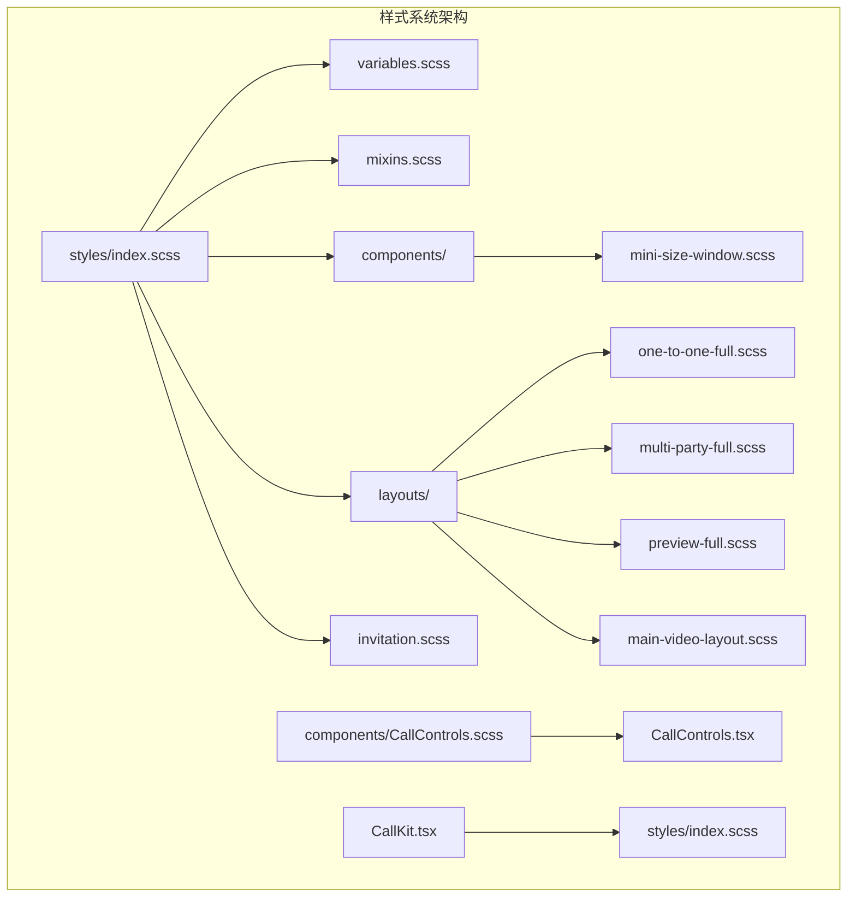
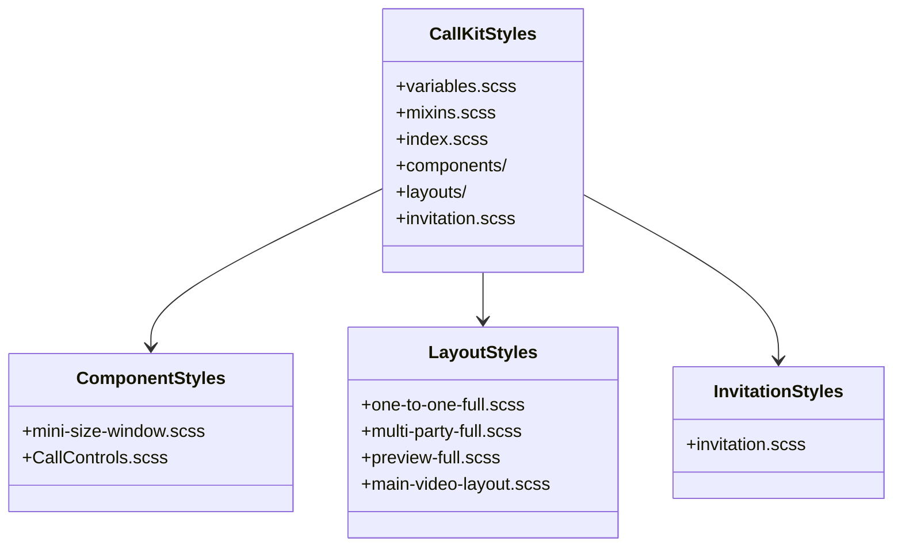
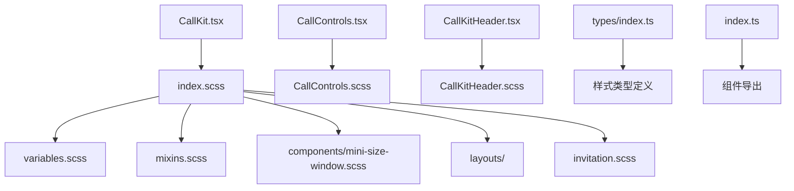

# 组件样式系统

<cite>
**本文档引用的文件**
- [callkit/styles/index.scss](file://callkit/styles/index.scss)
- [callkit/styles/variables.scss](file://callkit/styles/variables.scss)
- [callkit/styles/mixins.scss](file://callkit/styles/mixins.scss)
- [callkit/styles/invitation.scss](file://callkit/styles/invitation.scss)
- [callkit/styles/components/mini-size-window.scss](file://callkit/styles/components/mini-size-window.scss)
- [callkit/styles/layouts/one-to-one-full.scss](file://callkit/styles/layouts/one-to-one-full.scss)
- [callkit/styles/layouts/multi-party-full.scss](file://callkit/styles/layouts/multi-party-full.scss)
- [callkit/styles/layouts/preview-full.scss](file://callkit/styles/layouts/preview-full.scss)
- [callkit/styles/layouts/main-video-layout.scss](file://callkit/styles/layouts/main-video-layout.scss)
- [callkit/components/CallControls.scss](file://callkit/components/CallControls.scss)
- [callkit/CallKit.tsx](file://callkit/CallKit.tsx)
- [callkit/components/CallControls.tsx](file://callkit/components/CallControls.tsx)
- [callkit/components/CallKitHeader.tsx](file://callkit/components/CallKitHeader.tsx)
- [callkit/types/index.ts](file://callkit/types/index.ts)
- [callkit/index.ts](file://callkit/index.ts)
</cite>

## 目录
1. [简介](#简介)
2. [项目结构](#项目结构)
3. [核心组件](#核心组件)
4. [架构概览](#架构概览)
5. [详细组件分析](#详细组件分析)
6. [依赖关系分析](#依赖关系分析)
7. [性能考虑](#性能考虑)
8. [故障排除指南](#故障排除指南)
9. [结论](#结论)

## 简介

Easemob CallKit Vue3 组件样式系统是一个高度模块化的样式架构，专为音视频通话场景设计。该系统采用 BEM 命名约定和 SCSS 模块化结构，提供了完整的样式定制能力和作用域隔离机制。

系统的核心特点包括：
- **命名空间隔离**：使用 `$cui-prefix` 前缀确保样式不冲突
- **模块化组织**：按功能和组件类型分离样式文件
- **响应式设计**：内置移动端、平板和桌面端适配
- **主题变量系统**：统一的颜色、尺寸和动画变量管理
- **混合器模式**：可复用的样式组合模式

## 项目结构



**图表来源**
- [callkit/styles/index.scss](file://callkit/styles/index.scss#L1-L10)
- [callkit/styles/variables.scss](file://callkit/styles/variables.scss#L1-L49)
- [callkit/styles/mixins.scss](file://callkit/styles/mixins.scss#L1-L216)

**章节来源**
- [callkit/styles/index.scss](file://callkit/styles/index.scss#L1-L815)
- [callkit/styles/variables.scss](file://callkit/styles/variables.scss#L1-L49)
- [callkit/styles/mixins.scss](file://callkit/styles/mixins.scss#L1-L216)

## 核心组件

### 样式命名空间系统

系统采用统一的命名空间前缀 `$cui-prefix` 来确保样式隔离：

```scss
$cui-prefix: 'cui';
$callkit-prefix-cls: #{$cui-prefix}-callkit;
```

这种设计确保了：
- **全局唯一性**：避免与其他组件库样式冲突
- **作用域隔离**：每个组件都有独立的样式命名空间
- **维护便利性**：便于查找和修改特定组件的样式

### 变量管理系统

系统使用 SCSS 变量集中管理所有样式参数：

**尺寸变量**
- `$header-height`: 60px - 顶部栏高度
- `$controls-height`: 60px - 控制按钮区域高度
- `$container-max-width/height`: 748px/530px - 最大容器尺寸
- `$container-padding`: 8px - 容器内边距

**颜色变量**
- `$background-color`: #000 - 主背景色
- `$window-background`: #1a1a1a - 视频窗口背景
- `$border-color-hover`: #33B1FF - 悬停边框色
- `$border-color-local`: #1890ff - 本地视频边框色

**响应式断点**
- `$breakpoint-mobile`: 480px
- `$breakpoint-tablet`: 768px
- `$breakpoint-desktop`: 1024px

**章节来源**
- [callkit/styles/variables.scss](file://callkit/styles/variables.scss#L1-L49)

### 混合器系统

混合器提供了可复用的样式组合模式：

**容器混合器**
```scss
@mixin callkit-container {
  width: 100%;
  height: 100%;
  border-radius: $container-border-radius;
  display: flex;
  flex-direction: column;
  overflow: hidden;
}
```

**视频窗口基础样式**
```scss
@mixin video-window-base {
  position: relative;
  background: $window-background;
  border-radius: $video-border-radius;
  cursor: pointer;
  transition: all $transition-fast;
}
```

**响应式布局混合器**
```scss
@mixin responsive-layout {
  @media (max-width: $breakpoint-mobile) {
    padding: 4px;
  }
  @media (min-width: $breakpoint-mobile) and (max-width: $breakpoint-tablet) {
    padding: 6px;
  }
}
```

**章节来源**
- [callkit/styles/mixins.scss](file://callkit/styles/mixins.scss#L1-L216)

## 架构概览



**图表来源**
- [callkit/styles/index.scss](file://callkit/styles/index.scss#L1-L10)
- [callkit/styles/components/mini-size-window.scss](file://callkit/styles/components/mini-size-window.scss#L1-L346)
- [callkit/styles/layouts/one-to-one-full.scss](file://callkit/styles/layouts/one-to-one-full.scss#L1-L298)

## 详细组件分析

### CallKit 主样式系统

CallKit 的主样式系统位于 `index.scss`，采用 BEM 命名约定和嵌套结构：

```scss
.#{$callkit-prefix-cls} {
  // 容器基础样式
  &-header { /* 顶部栏样式 */ }
  &-content { /* 内容区域样式 */ }
  &-controls { /* 控制按钮区域样式 */ }
  &-window { /* 视频窗口基础样式 */ }
  &-video-container { /* 视频容器样式 */ }
  &-video { /* 视频元素样式 */ }
}
```

**布局系统**

系统支持多种布局模式，每种布局都有对应的样式文件：

**1v1 画中画布局**
- 主视频：占满整个容器
- 画中画视频：右上角浮动定位
- 渐变遮罩：增强文字可读性

**多人网格布局**
- 动态行列计算
- 响应式间距调整
- 最小化模式支持

**预览布局**
- 竖屏优化
- 占位符样式
- 提示信息展示

**章节来源**
- [callkit/styles/index.scss](file://callkit/styles/index.scss#L23-L786)

### CallControls 控制按钮样式

CallControls 组件提供了完整的通话控制界面，包含以下样式结构：

```scss
.#{$call-controls-prefix-cls} {
  display: flex;
  justify-content: center;
  align-items: center;
  
  &-button {
    width: 36px;
    height: 36px;
    border-radius: 50%;
    background: rgba(255, 255, 255, 0.2);
    
    &-active { /* 激活状态 */ }
    &-disabled { /* 禁用状态 */ }
    &-hangup { /* 挂断按钮 */ }
    &-accept { /* 接听按钮 */ }
  }
}
```

**状态管理样式**
- 激活状态：绿色背景，白色图标
- 禁用状态：半透明背景，灰色图标
- 加载状态：旋转动画效果
- 悬停效果：缩放和颜色变化

**响应式适配**
- 桌面端：按钮尺寸 36px
- 平板端：按钮尺寸 44px
- 移动端：按钮尺寸 40px

**章节来源**
- [callkit/components/CallControls.scss](file://callkit/components/CallControls.scss#L1-L218)

### MiniSizeWindow 最小化窗口样式

最小化窗口是 CallKit 的重要特性，提供紧凑的通话状态显示：

```scss
.#{$callkit-prefix-cls}-mini-window {
  position: relative;
  display: flex;
  flex-direction: column;
  padding: 8px;
  border-radius: 8px;
  
  &.#{$callkit-prefix-cls}-mini-window-video {
    width: 108px;
    height: 192px;
    border: none;
    padding: 0;
  }
  
  &.#{$callkit-prefix-cls}-mini-window-audio {
    border-left: 3px solid #1890ff;
  }
}
```

**通话状态指示**
- 连接中：橙色左侧边框
- 响铃中：紫色左侧边框 + 脉冲动画
- 已连接：绿色左侧边框

**交互效果**
- 悬停放大效果
- 点击反馈动画
- 恢复提示显示

**章节来源**
- [callkit/styles/components/mini-size-window.scss](file://callkit/styles/components/mini-size-window.scss#L1-L346)

### 邀请内容样式

邀请内容组件提供了完整的来电显示界面：

```scss
.cui-callkit-invitation-content {
  display: flex;
  align-items: center;
  gap: 8px;
  
  .cui-callkit-invitation-avatar {
    position: relative;
    width: 60px;
    height: 60px;
    border-radius: 50%;
  }
  
  .cui-callkit-invitation-info {
    flex: 1;
    min-width: 0;
  }
  
  .cui-callkit-invitation-actions {
    display: flex;
    gap: 16px;
  }
}
```

**深色模式支持**
- 自动检测系统偏好
- 对比度优化
- 颜色方案适配

**章节来源**
- [callkit/styles/invitation.scss](file://callkit/styles/invitation.scss#L1-L142)

## 依赖关系分析



**图表来源**
- [callkit/CallKit.tsx](file://callkit/CallKit.tsx#L38-L38)
- [callkit/components/CallControls.tsx](file://callkit/components/CallControls.tsx#L7-L7)
- [callkit/components/CallKitHeader.tsx](file://callkit/components/CallKitHeader.tsx#L4-L4)

**章节来源**
- [callkit/CallKit.tsx](file://callkit/CallKit.tsx#L1-L800)
- [callkit/components/CallControls.tsx](file://callkit/components/CallControls.tsx#L1-L800)
- [callkit/types/index.ts](file://callkit/types/index.ts#L1-L356)

## 性能考虑

### 样式优化策略

**CSS 作用域隔离**
- 使用 BEM 命名约定避免样式冲突
- 通过前缀确保全局唯一性
- 模块化导入减少不必要的样式加载

**响应式性能**
- 媒体查询优化移动设备性能
- 避免过度的盒阴影和模糊效果
- 使用 transform 替代改变布局属性

**动画性能**
- 使用 CSS3 硬件加速属性
- 限制动画复杂度和频率
- 合理使用 will-change 属性

### 样式覆盖最佳实践

**推荐的覆盖顺序**
1. 变量覆盖 → 2. 混合器扩展 → 3. 组件样式覆盖 → 4. 特殊状态样式

**覆盖技巧**
- 使用 !important 仅在必要时
- 避免深层嵌套选择器
- 利用 CSS 自定义属性实现动态样式

**性能监控**
- 使用浏览器开发者工具分析样式重绘
- 监控关键渲染路径中的样式计算
- 定期审查未使用的样式规则

## 故障排除指南

### 常见样式冲突问题

**问题：样式被其他组件覆盖**
```scss
// 解决方案：提高选择器特异性
.cui-callkit-root {
  .cui-call-controls {
    // 确保足够的特异性
  }
}
```

**问题：响应式样式不生效**
- 检查媒体查询断点设置
- 确认 CSS 加载顺序
- 验证容器尺寸计算

**问题：动画性能问题**
- 检查硬件加速属性
- 优化动画复杂度
- 使用 requestAnimationFrame

### 调试技巧

**样式检查工具**
- 使用浏览器开发者工具查看计算样式
- 检查 CSS 优先级和特异性
- 分析样式表加载和执行顺序

**性能分析**
- 监控样式计算时间和重绘次数
- 使用 Chrome DevTools 的 Rendering 面板
- 分析关键渲染路径中的样式阻塞

**章节来源**
- [callkit/styles/index.scss](file://callkit/styles/index.scss#L788-L800)

## 结论

Easemob CallKit Vue3 组件样式系统展现了现代前端工程的最佳实践：

**架构优势**
- 模块化设计确保了良好的可维护性
- 命名空间隔离提供了强大的作用域保护
- 混合器系统实现了样式的高度复用

**定制能力**
- 完善的变量系统支持深度定制
- 响应式设计覆盖多端场景
- 状态样式系统支持丰富的交互效果

**性能表现**
- 优化的选择器结构提升渲染效率
- 合理的动画策略保证流畅体验
- 深入的性能监控机制

该样式系统为音视频通话场景提供了坚实的技术基础，既满足了复杂的业务需求，又保持了良好的开发体验和维护性。通过遵循本文档的指导原则，开发者可以安全地定制和扩展样式系统，而不会破坏现有的功能和性能表现。