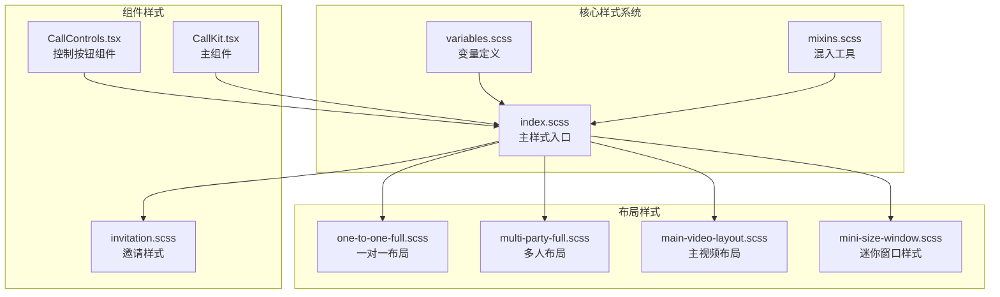
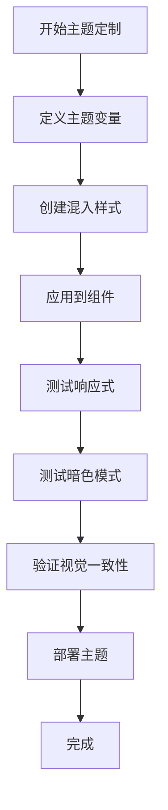
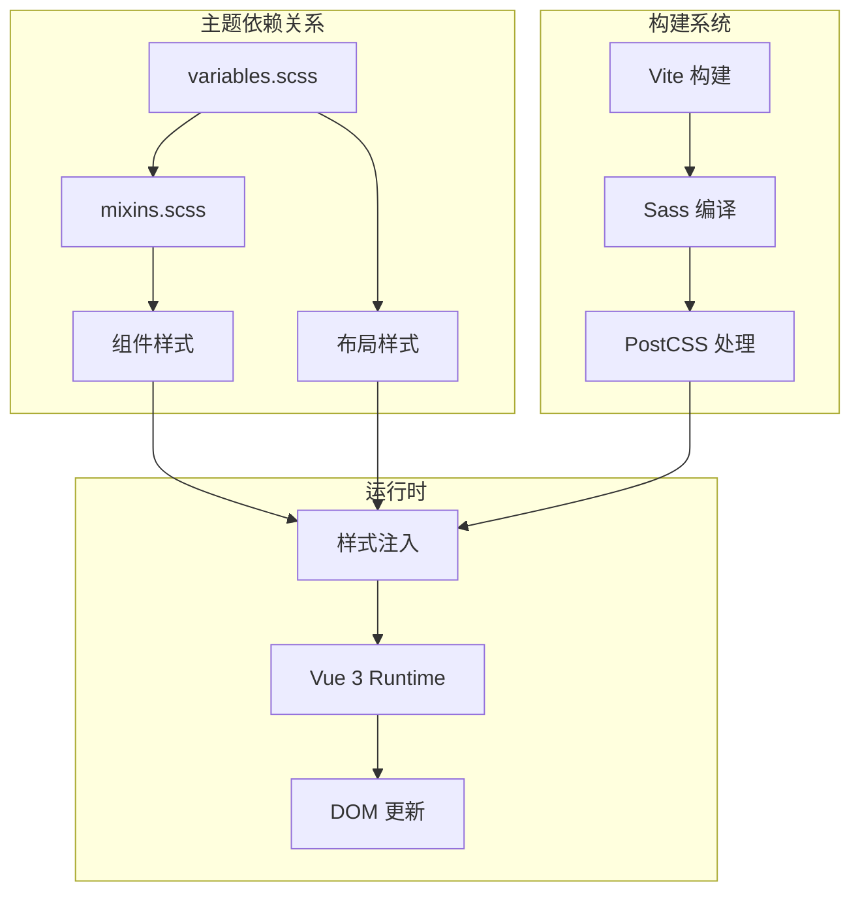
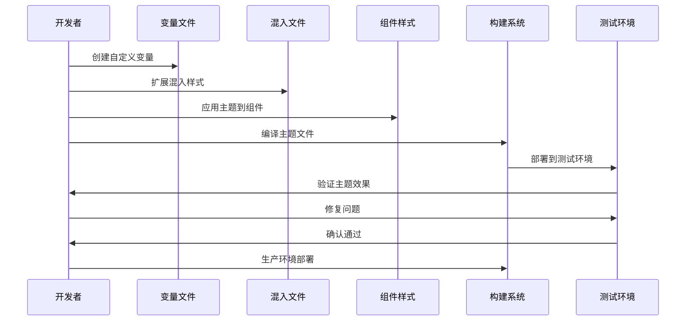

# 自定义主题指南

<cite>
**本文档引用的文件**
- [callkit/styles/index.scss](file://callkit/styles/index.scss)
- [callkit/styles/variables.scss](file://callkit/styles/variables.scss)
- [callkit/styles/mixins.scss](file://callkit/styles/mixins.scss)
- [callkit/styles/components/mini-size-window.scss](file://callkit/styles/components/mini-size-window.scss)
- [callkit/styles/layouts/main-video-layout.scss](file://callkit/styles/layouts/main-video-layout.scss)
- [callkit/styles/layouts/one-to-one-full.scss](file://callkit/styles/layouts/one-to-one-full.scss)
- [callkit/styles/layouts/multi-party-full.scss](file://callkit/styles/layouts/multi-party-full.scss)
- [callkit/styles/invitation.scss](file://callkit/styles/invitation.scss)
- [callkit/CallKit.tsx](file://callkit/CallKit.tsx)
- [callkit/components/CallControls.tsx](file://callkit/components/CallControls.tsx)
- [package.json](file://package.json)
- [README.md](file://README.md)
- [USAGE.md](file://USAGE.md)
- [test/package.json](file://test/package.json)
</cite>

## 目录
1. [简介](#简介)
2. [项目结构](#项目结构)
3. [核心组件](#核心组件)
4. [架构概览](#架构概览)
5. [详细组件分析](#详细组件分析)
6. [依赖关系分析](#依赖关系分析)
7. [性能考虑](#性能考虑)
8. [故障排除指南](#故障排除指南)
9. [结论](#结论)
10. [附录](#附录)

## 简介

Easemob Chat CallKit Vue3 是一个基于 Vue3 的音视频通话 UI 组件库，集成了环信 IM 信令与声网 RTC 能力。本指南专注于帮助开发者创建和定制自定义主题，涵盖从零开始的主题创建流程、设计原则、色彩搭配规范、视觉一致性要求，以及完整的主题变量覆盖步骤。

## 项目结构

该项目采用模块化的组织方式，主要分为以下几个核心部分：



**图表来源**
- [callkit/styles/index.scss](file://callkit/styles/index.scss#L1-L10)
- [callkit/styles/variables.scss](file://callkit/styles/variables.scss#L1-L49)
- [callkit/styles/mixins.scss](file://callkit/styles/mixins.scss#L1-L216)

**章节来源**
- [README.md](file://README.md#L5-L31)
- [package.json](file://package.json#L1-L53)

## 核心组件

### 主题变量系统

主题系统的核心是变量定义和混入工具，提供了完整的样式定制能力：

**颜色变量体系**
- 背景色系：`$background-color`, `$window-background`, `$placeholder-background`
- 文字颜色：`$text-color`, `$text-color-secondary`
- 边框颜色：`$border-color`, `$border-color-hover`, `$border-color-local`
- 阴影系统：`$shadow-light`, `$shadow-medium`, `$shadow-heavy`

**尺寸和间距**
- 容器尺寸：`$container-max-width`, `$container-max-height`, `$container-padding`
- 间距系统：`$gap-small`, `$gap-medium`, `$gap-large`
- 圆角半径：`$video-border-radius`

**响应式断点**
- 移动端：`$breakpoint-mobile: 480px`
- 平板端：`$breakpoint-tablet: 768px`
- 桌面端：`$breakpoint-desktop: 1024px`

**章节来源**
- [callkit/styles/variables.scss](file://callkit/styles/variables.scss#L1-L49)

### 混入工具系统

混入工具提供了可复用的样式模板：

**容器混入**
```scss
@include callkit-container {
  // 标准容器样式
}
```

**视频相关混入**
- `video-window-base`: 视频窗口基础样式
- `video-container`: 视频容器样式
- `video-element`: 视频元素样式
- `avatar-image`: 头像样式

**布局混入**
- `flex-row`: Flex 行布局
- `flex-column`: Flex 列布局
- `responsive-layout`: 响应式布局

**章节来源**
- [callkit/styles/mixins.scss](file://callkit/styles/mixins.scss#L1-L216)

## 架构概览

主题系统的整体架构采用"变量驱动 + 混入复用"的设计模式：



**图表来源**
- [callkit/styles/index.scss](file://callkit/styles/index.scss#L1-L10)
- [callkit/styles/variables.scss](file://callkit/styles/variables.scss#L1-L49)

## 详细组件分析

### 主题变量覆盖流程

#### 第一步：创建自定义变量文件

创建一个新的 SCSS 文件来覆盖默认变量：

```scss
// custom-theme.scss
@import '~easemob-chat-callkit-vue3/callkit/styles/variables.scss';

// 覆盖颜色变量
$background-color: #ffffff;
$text-color: #333333;
$border-color-hover: #007bff;

// 覆盖尺寸变量
$container-max-width: 800px;
$container-max-height: 600px;

// 覆盖响应式断点
$breakpoint-mobile: 576px;
$breakpoint-tablet: 992px;
$breakpoint-desktop: 1200px;
```

#### 第二步：导入自定义变量

在主样式文件中替换默认变量导入：

```scss
// 替换这行
// @import './variables.scss';

// 为
@import './custom-theme.scss';
```

#### 第三步：创建主题混入

```scss
// custom-mixins.scss
@import '~easemob-chat-callkit-vue3/callkit/styles/mixins.scss';

// 扩展视频窗口样式
@mixin custom-video-window-base {
  @include video-window-base;
  border: 2px solid $border-color-hover;
  box-shadow: 0 4px 12px rgba(0, 123, 255, 0.15);
  
  &:hover {
    border-color: $border-color-local;
    transform: scale(1.02);
  }
}
```

**章节来源**
- [callkit/styles/index.scss](file://callkit/styles/index.scss#L1-L10)
- [callkit/styles/variables.scss](file://callkit/styles/variables.scss#L1-L49)
- [callkit/styles/mixins.scss](file://callkit/styles/mixins.scss#L26-L47)

### 响应式主题适配

#### 移动端适配策略

```scss
// 在混入中添加移动端适配
@include responsive-layout {
  // 移动端样式
  @media (max-width: $breakpoint-mobile) {
    .cui-callkit-avatar,
    .cui-callkit-avatar-placeholder {
      width: $avatar-size-small;
      height: $avatar-size-small;
    }
  }
}
```

#### 平板端适配

```scss
@media (min-width: $breakpoint-mobile) and (max-width: $breakpoint-tablet) {
  padding: 6px;
  // 平板端特定样式
}
```

#### 桌面端适配

```scss
@media (min-width: $breakpoint-desktop) {
  // 桌面端特定样式
}
```

**章节来源**
- [callkit/styles/mixins.scss](file://callkit/styles/mixins.scss#L164-L192)

### 暗色模式支持

#### 基础暗色模式实现

```scss
@media (prefers-color-scheme: dark) {
  .cui-callkit-invitation-content {
    .cui-callkit-invitation-avatar-placeholder {
      background: #3a3a3a;
      color: #ccc;
    }
  }
}
```

#### 主题变量的暗色模式覆盖

```scss
// 在自定义主题中添加
$background-color-dark: #1a1a1a;
$text-color-dark: #ffffff;
$border-color-dark: #404040;

// 在媒体查询中使用
@media (prefers-color-scheme: dark) {
  $background-color: $background-color-dark;
  $text-color: $text-color-dark;
  $border-color: $border-color-dark;
}
```

**章节来源**
- [callkit/styles/invitation.scss](file://callkit/styles/invitation.scss#L124-L142)

### 品牌化主题创建

#### 品牌色彩系统

```scss
// 品牌主色调
$brand-primary: #007bff;
$brand-secondary: #6c757d;
$brand-success: #28a745;
$brand-warning: #ffc107;
$brand-danger: #dc3545;

// 品牌辅助色
$brand-info: #17a2b8;
$brand-light: #f8f9fa;
$brand-dark: #343a40;

// 覆盖默认品牌色
$border-color-hover: $brand-primary;
$border-color-local: $brand-success;
```

#### 品牌字体系统

```scss
// 品牌字体族
$brand-font-family: 'Helvetica Neue', Arial, sans-serif;
$brand-font-size-base: 16px;

// 在组件中使用
.cui-callkit-header {
  font-family: $brand-font-family;
  font-size: $brand-font-size-base;
}
```

**章节来源**
- [callkit/styles/variables.scss](file://callkit/styles/variables.scss#L14-L22)

### 多主题切换功能

#### 主题切换实现方案

```javascript
// theme-manager.js
export class ThemeManager {
  constructor() {
    this.themes = {
      light: {
        variables: require('./themes/light.scss'),
        mixins: require('./themes/light-mixins.scss')
      },
      dark: {
        variables: require('./themes/dark.scss'),
        mixins: require('./themes/dark-mixins.scss')
      },
      brand: {
        variables: require('./themes/brand.scss'),
        mixins: require('./themes/brand-mixins.scss')
      }
    };
  }

  applyTheme(themeName) {
    const theme = this.themes[themeName];
    if (!theme) {
      throw new Error(`Theme ${themeName} not found`);
    }

    // 动态导入主题样式
    import(`./themes/${themeName}.scss`).then(() => {
      // 触发样式更新
      this.updateThemeClasses(themeName);
    });
  }

  updateThemeClasses(themeName) {
    // 移除旧主题类
    document.body.classList.remove('theme-light', 'theme-dark', 'theme-brand');
    // 添加新主题类
    document.body.classList.add(`theme-${themeName}`);
  }
}
```

#### CSS 主题切换

```scss
// 基础样式
body.theme-light {
  @import './themes/light.scss';
}

body.theme-dark {
  @import './themes/dark.scss';
}

body.theme-brand {
  @import './themes/brand.scss';
}
```

**章节来源**
- [callkit/CallKit.tsx](file://callkit/CallKit.tsx#L1-L800)
- [callkit/components/CallControls.tsx](file://callkit/components/CallControls.tsx#L1-L800)

## 依赖关系分析



**图表来源**
- [package.json](file://package.json#L23-L32)
- [vite.config.ts](file://vite.config.ts)
- [vite.lib.config.ts](file://vite.lib.config.ts)

**章节来源**
- [package.json](file://package.json#L1-L53)
- [test/package.json](file://test/package.json#L1-L29)

## 性能考虑

### 样式优化策略

1. **变量复用**：通过变量系统减少重复定义
2. **混入复用**：使用混入避免样式重复编写
3. **条件编译**：按需编译主题文件
4. **缓存策略**：利用浏览器缓存机制

### 主题性能最佳实践

```scss
// 使用 CSS 变量进行主题切换
:root {
  --primary-color: #007bff;
  --secondary-color: #6c757d;
}

// 在组件中使用
.component {
  color: var(--primary-color);
}

// 切换主题时只需修改 CSS 变量
.theme-dark {
  --primary-color: #0d6efd;
  --secondary-color: #adb5bd;
}
```

## 故障排除指南

### 常见主题定制问题

#### 问题1：主题变量未生效

**症状**：自定义变量没有反映在最终样式中

**解决方案**：
1. 确保自定义变量文件在导入顺序上位于默认变量之后
2. 检查变量名称拼写是否正确
3. 验证变量作用域是否正确

#### 问题2：响应式样式冲突

**症状**：在某些设备上样式显示异常

**解决方案**：
1. 检查断点值设置是否合理
2. 确保媒体查询的优先级正确
3. 验证移动优先的样式组织

#### 问题3：暗色模式适配问题

**症状**：暗色模式下文字难以阅读

**解决方案**：
1. 确保对比度符合 WCAG 标准
2. 为不同组件提供专门的暗色模式样式
3. 测试各种暗色模式场景

**章节来源**
- [callkit/styles/invitation.scss](file://callkit/styles/invitation.scss#L124-L142)
- [callkit/styles/mixins.scss](file://callkit/styles/mixins.scss#L164-L192)

## 结论

通过本指南，您已经了解了如何从零开始创建和定制 Easemob Chat CallKit Vue3 的自定义主题。主题系统的核心在于：

1. **变量驱动**：通过合理的变量组织实现主题的模块化
2. **混入复用**：利用混入工具提高样式的可维护性
3. **响应式适配**：确保在各种设备上的良好体验
4. **暗色模式支持**：提供完整的暗色模式适配
5. **品牌化定制**：支持企业品牌色彩和设计规范

建议在实际项目中：
- 建立完整的主题变量文档
- 制定设计系统规范
- 建立主题测试流程
- 持续优化主题性能

## 附录

### 主题开发工作流程



### 主题测试清单

- [ ] 变量覆盖验证
- [ ] 响应式样式测试
- [ ] 暗色模式适配
- [ ] 跨浏览器兼容性
- [ ] 性能基准测试
- [ ] 无障碍性检查