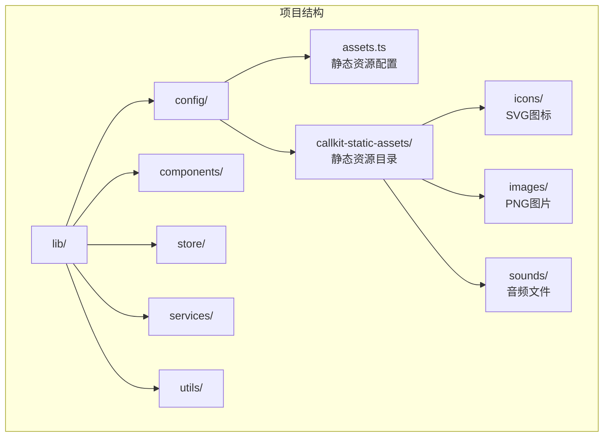
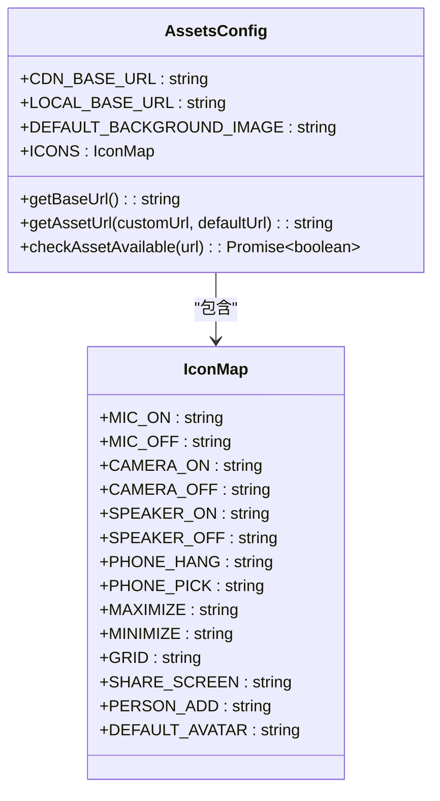
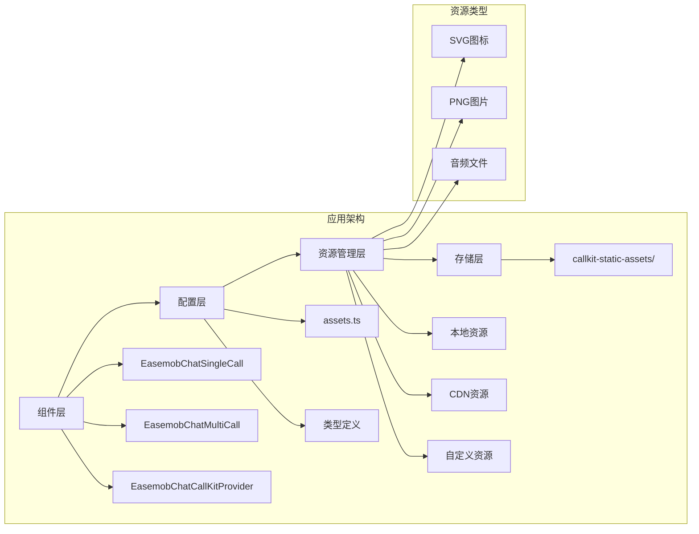
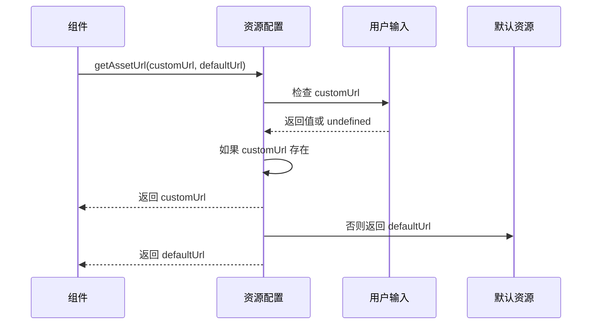
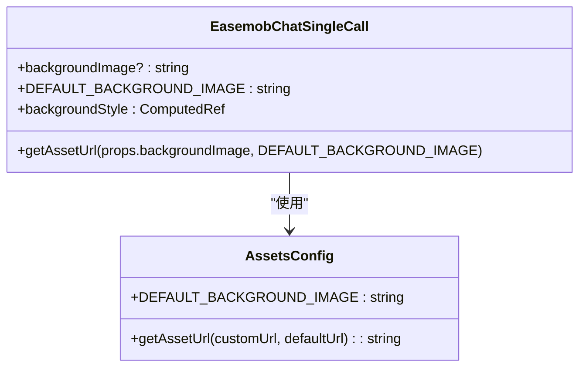
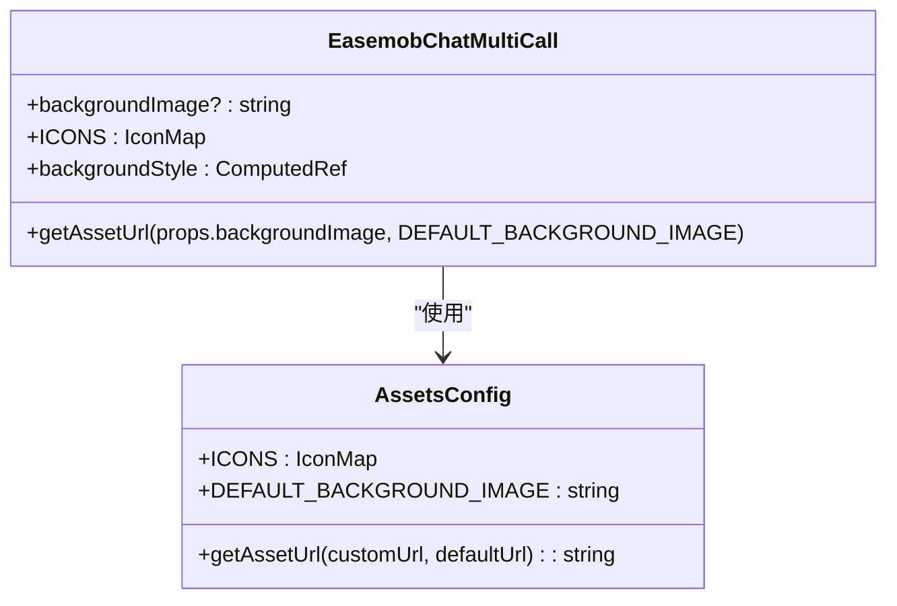
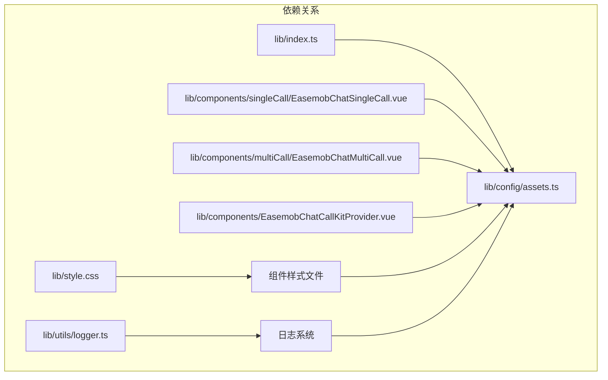
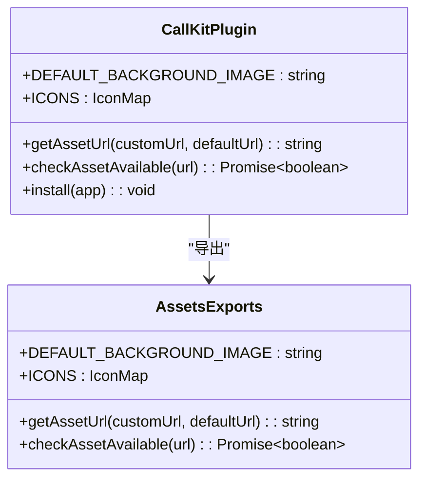

# 静态资源配置系统

<cite>
**本文档引用的文件**
- [README.md](file://README.md)
- [package.json](file://package.json)
- [lib/index.ts](file://lib/index.ts)
- [lib/config/assets.ts](file://lib/config/assets.ts)
- [lib/style.css](file://lib/style.css)
- [lib/components/EasemobChatCallKitProvider.vue](file://lib/components/EasemobChatCallKitProvider.vue)
- [lib/components/singleCall/EasemobChatSingleCall.vue](file://lib/components/singleCall/EasemobChatSingleCall.vue)
- [lib/components/multiCall/EasemobChatMultiCall.vue](file://lib/components/multiCall/EasemobChatMultiCall.vue)
- [lib/utils/logger.ts](file://lib/utils/logger.ts)
</cite>

## 目录
1. [简介](#简介)
2. [项目结构](#项目结构)
3. [核心组件](#核心组件)
4. [架构概览](#架构概览)
5. [详细组件分析](#详细组件分析)
6. [依赖关系分析](#依赖关系分析)
7. [性能考虑](#性能考虑)
8. [故障排除指南](#故障排除指南)
9. [结论](#结论)

## 简介

静态资源配置系统是 EaseMob Chat CallKit Vue3 插件的重要组成部分，负责管理应用中的所有静态资源（图标、图片、背景等）。该系统提供了灵活的资源加载机制，支持本地资源、CDN 资源和用户自定义资源的统一管理。

系统采用模块化设计，通过集中式的资源配置文件统一管理所有静态资源，确保资源的一致性和可维护性。支持多种资源类型，包括 SVG 图标、PNG 图片和音频文件，并提供了完整的资源可用性检查机制。

## 项目结构

项目采用清晰的分层架构，静态资源配置系统位于 lib/config 目录下，与业务逻辑和其他功能模块分离：



**图表来源**
- [lib/config/assets.ts](file://lib/config/assets.ts#L1-L75)
- [lib/index.ts](file://lib/index.ts#L1-L61)

**章节来源**
- [README.md](file://README.md#L5-L31)
- [package.json](file://package.json#L1-L53)

## 核心组件

### 静态资源配置核心

静态资源配置系统的核心是 `assets.ts` 文件，它提供了完整的资源管理功能：

#### 资源基础配置
- **CDN 基础路径**：支持自定义 CDN 配置，优先级最高
- **本地资源路径**：默认使用 `/callkit-static-assets` 本地路径
- **动态路径解析**：根据配置自动选择资源加载路径

#### 资源类型定义
系统预定义了完整的资源类型集合：



**图表来源**
- [lib/config/assets.ts](file://lib/config/assets.ts#L10-L51)

#### 资源加载策略

系统实现了智能的资源加载策略，支持三种加载方式：

1. **用户自定义资源**：优先使用用户传入的自定义 URL
2. **默认资源**：使用系统内置的默认资源路径
3. **CDN 资源**：自动检测并使用配置的 CDN 路径

**章节来源**
- [lib/config/assets.ts](file://lib/config/assets.ts#L1-L75)

## 架构概览

静态资源配置系统在整个应用架构中扮演着关键角色，通过统一的接口为各个组件提供资源访问能力：



**图表来源**
- [lib/index.ts](file://lib/index.ts#L48-L49)
- [lib/config/assets.ts](file://lib/config/assets.ts#L36-L51)

## 详细组件分析

### 资源配置管理器

#### getBaseUrl 函数分析
该函数实现了资源路径的智能选择逻辑：

```mermaid
flowchart TD
A[调用 getBaseUrl] --> B{检查 CDN 配置}
B --> |存在CDN| C[返回 CDN_BASE_URL]
B --> |不存在CDN| D[返回 LOCAL_BASE_URL]
E[DEFAULT_BACKGROUND_IMAGE] --> F[使用 getBaseUrl + "/images/callkit_bg.png"]
G[ICONS 对象] --> H{遍历所有图标}
H --> I[每个图标使用 getBaseUrl + "/icons/[icon_name].svg"]
```

**图表来源**
- [lib/config/assets.ts](file://lib/config/assets.ts#L19-L26)
- [lib/config/assets.ts](file://lib/config/assets.ts#L31-L51)

#### getAssetUrl 函数实现
提供资源 URL 的回退机制：



**图表来源**
- [lib/config/assets.ts](file://lib/config/assets.ts#L59-L61)

**章节来源**
- [lib/config/assets.ts](file://lib/config/assets.ts#L19-L61)

### 组件集成分析

#### 单人通话组件集成
单人通话组件通过 `DEFAULT_BACKGROUND_IMAGE` 和 `getAssetUrl` 实现背景图的灵活配置：



**图表来源**
- [lib/components/singleCall/EasemobChatSingleCall.vue](file://lib/components/singleCall/EasemobChatSingleCall.vue#L58-L59)
- [lib/components/singleCall/EasemobChatSingleCall.vue](file://lib/components/singleCall/EasemobChatSingleCall.vue#L179-L184)

#### 群组通话组件集成
群组通话组件同样集成了静态资源配置系统：



**图表来源**
- [lib/components/multiCall/EasemobChatMultiCall.vue](file://lib/components/multiCall/EasemobChatMultiCall.vue#L181-L182)
- [lib/components/multiCall/EasemobChatMultiCall.vue](file://lib/components/multiCall/EasemobChatMultiCall.vue#L450-L468)

**章节来源**
- [lib/components/singleCall/EasemobChatSingleCall.vue](file://lib/components/singleCall/EasemobChatSingleCall.vue#L43-L44)
- [lib/components/multiCall/EasemobChatMultiCall.vue](file://lib/components/multiCall/EasemobChatMultiCall.vue#L156-L157)

### 资源可用性检查

系统提供了完整的资源可用性检查机制，用于调试和故障排除：

#### checkAssetAvailable 函数
实现了异步的资源可用性检测：

```mermaid
flowchart TD
A[调用 checkAssetAvailable] --> B[创建 Image 对象]
B --> C[设置 onload 回调]
B --> D[设置 onerror 回调]
B --> E[设置 img.src = url]
C --> F[资源加载成功]
D --> G[资源加载失败]
F --> H[返回 Promise.resolve(true)]
G --> I[返回 Promise.resolve(false)]
```

**图表来源**
- [lib/config/assets.ts](file://lib/config/assets.ts#L67-L74)

**章节来源**
- [lib/config/assets.ts](file://lib/config/assets.ts#L67-L74)

## 依赖关系分析

静态资源配置系统与其他模块的依赖关系如下：



**图表来源**
- [lib/index.ts](file://lib/index.ts#L48-L49)
- [lib/components/singleCall/EasemobChatSingleCall.vue](file://lib/components/singleCall/EasemobChatSingleCall.vue#L43-L44)
- [lib/components/multiCall/EasemobChatMultiCall.vue](file://lib/components/multiCall/EasemobChatMultiCall.vue#L156-L157)

### 导出接口分析

系统通过 `lib/index.ts` 统一导出静态资源配置：



**图表来源**
- [lib/index.ts](file://lib/index.ts#L48-L49)
- [lib/index.ts](file://lib/index.ts#L51-L60)

**章节来源**
- [lib/index.ts](file://lib/index.ts#L48-L60)

## 性能考虑

### 资源加载优化

1. **缓存策略**：系统通过浏览器缓存机制自动缓存静态资源
2. **CDN 优化**：支持 CDN 加速，减少资源加载时间
3. **按需加载**：组件只加载当前需要的资源
4. **资源复用**：多个组件共享相同的资源配置

### 内存管理

1. **资源清理**：组件卸载时自动清理资源引用
2. **垃圾回收**：及时释放不再使用的资源对象
3. **内存监控**：提供资源可用性检查功能

## 故障排除指南

### 常见问题及解决方案

#### 资源加载失败
- **症状**：图标显示为默认占位符
- **原因**：资源路径配置错误或网络问题
- **解决**：检查 CDN 配置或使用本地资源

#### 背景图显示异常
- **症状**：背景图拉伸或显示不完整
- **原因**：CSS 样式覆盖或资源尺寸不匹配
- **解决**：检查组件样式配置

#### 资源可用性检查
使用 `checkAssetAvailable` 函数进行调试：

```typescript
// 示例：检查资源可用性
const isAvailable = await checkAssetAvailable('/callkit-static-assets/icons/mic_on.svg');
console.log('资源可用性:', isAvailable);
```

**章节来源**
- [lib/config/assets.ts](file://lib/config/assets.ts#L67-L74)

## 结论

静态资源配置系统通过模块化的架构设计，为 EaseMob Chat CallKit Vue3 插件提供了强大而灵活的资源管理能力。系统支持多种资源类型和加载策略，具有良好的扩展性和维护性。

主要特点包括：
- **统一管理**：集中式资源配置，便于维护
- **灵活加载**：支持本地、CDN 和自定义资源
- **类型安全**：完整的 TypeScript 类型定义
- **调试友好**：提供资源可用性检查功能
- **性能优化**：智能缓存和按需加载机制

该系统为整个插件提供了坚实的基础，确保了资源的一致性和可靠性，为开发者提供了良好的开发体验。