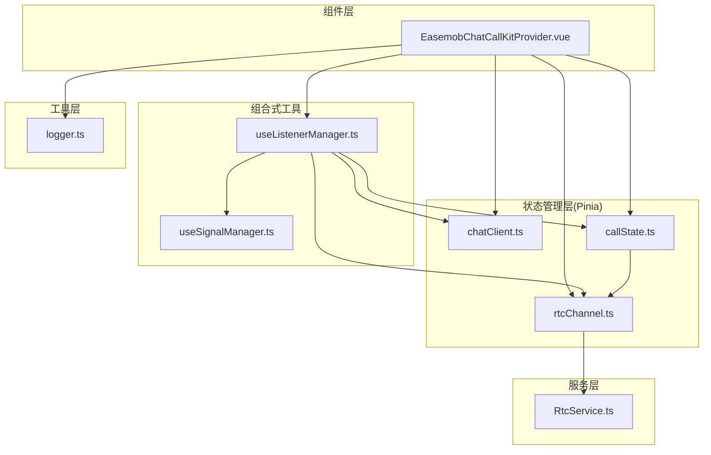
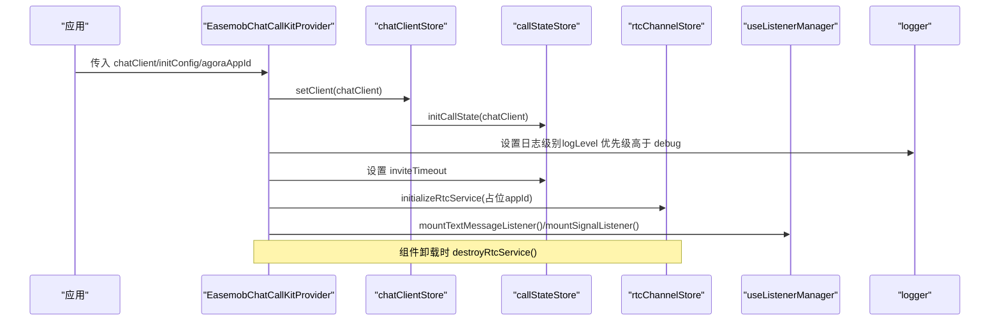
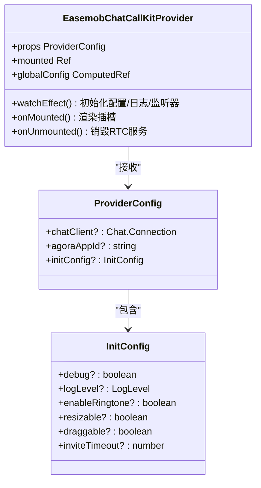
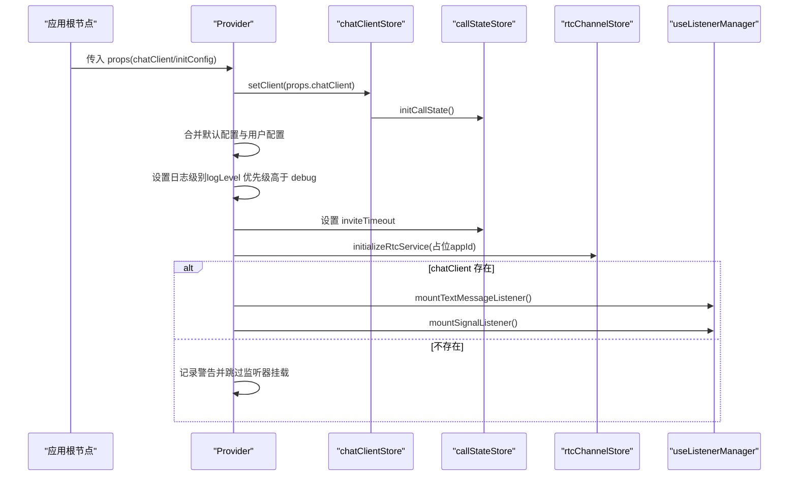
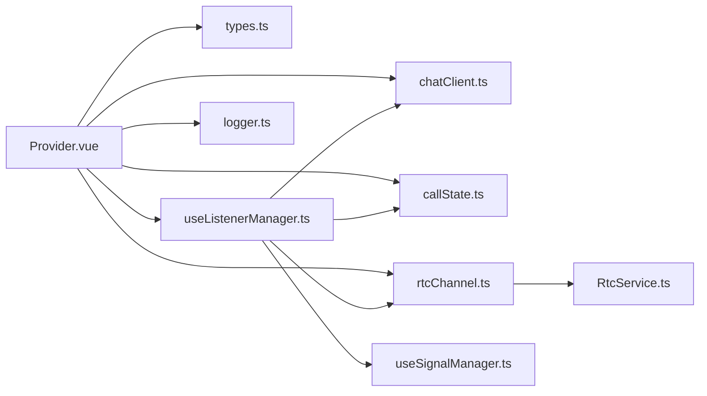

# Provider 组件

<cite>
**本文档引用的文件**
- [lib/components/EasemobChatCallKitProvider.vue](file://lib/components/EasemobChatCallKitProvider.vue)
- [lib/types.ts](file://lib/types.ts)
- [lib/store/chatClient.ts](file://lib/store/chatClient.ts)
- [lib/store/callState.ts](file://lib/store/callState.ts)
- [lib/store/rtcChannel.ts](file://lib/store/rtcChannel.ts)
- [lib/composables/useListenerManager.ts](file://lib/composables/useListenerManager.ts)
- [lib/composables/useSignalManager.ts](file://lib/composables/useSignalManager.ts)
- [lib/services/RtcService.ts](file://lib/services/RtcService.ts)
- [lib/utils/logger.ts](file://lib/utils/logger.ts)
- [USAGE.md](file://USAGE.md)
</cite>

## 更新摘要
**变更内容**
- ProviderConfig 新增 logLevel 配置选项，替代之前的 debug 标志
- 提供更精确的日志级别控制，支持 ERROR、WARN、INFO、DEBUG、VERBOSE 五级日志
- logLevel 优先级高于 debug，实现更精细的日志管理
- 更新日志系统初始化逻辑，确保在 RTC 初始化之前设置日志级别

## 目录
1. [简介](#简介)
2. [项目结构](#项目结构)
3. [核心组件](#核心组件)
4. [架构总览](#架构总览)
5. [详细组件分析](#详细组件分析)
6. [依赖关系分析](#依赖关系分析)
7. [性能考虑](#性能考虑)
8. [故障排查指南](#故障排查指南)
9. [结论](#结论)
10. [附录](#附录)

## 简介
EasemobChatCallKitProvider 是 CallKit 的根组件，负责：
- 全局配置管理：合并默认配置与用户配置，暴露响应式全局配置
- 状态初始化：初始化并注入 Pinia Store（聊天客户端、通话状态、RTC 频道）
- 事件监听器挂载：在环信客户端可用时挂载文本消息与信令监听器
- 生命周期管理：组件挂载后渲染子树；组件卸载时销毁 RTC 服务，释放媒体资源

该组件是所有通话相关组件的上下文容器，确保环信 IM 信令与声网 RTC 能力在应用层面正确初始化与协同工作。

## 项目结构
Provider 组件位于 lib/components 目录，配合 lib/store、lib/composables、lib/services、lib/utils 等模块共同构成完整的通话上下文生态。

**图表来源**
- [lib/components/EasemobChatCallKitProvider.vue:1-119](file://lib/components/EasemobChatCallKitProvider.vue#L1-L119)
- [lib/store/chatClient.ts:1-23](file://lib/store/chatClient.ts#L1-L23)
- [lib/store/callState.ts:1-263](file://lib/store/callState.ts#L1-L263)
- [lib/store/rtcChannel.ts:1-410](file://lib/store/rtcChannel.ts#L1-L410)
- [lib/composables/useListenerManager.ts:1-684](file://lib/composables/useListenerManager.ts#L1-L684)
- [lib/composables/useSignalManager.ts:1-200](file://lib/composables/useSignalManager.ts#L1-L200)
- [lib/services/RtcService.ts:1-719](file://lib/services/RtcService.ts#L1-L719)
- [lib/utils/logger.ts:1-231](file://lib/utils/logger.ts#L1-L231)

**章节来源**
- [lib/components/EasemobChatCallKitProvider.vue:1-119](file://lib/components/EasemobChatCallKitProvider.vue#L1-L119)
- [lib/types.ts:36-49](file://lib/types.ts#L36-L49)

## 核心组件
- Provider 组件职责
  - 接收 chatClient（环信客户端实例）、agoraAppId（兼容参数）、initConfig（运行期配置）
  - 合并默认配置与用户配置，创建响应式全局配置
  - 初始化并注入 Pinia Store（聊天客户端、通话状态、RTC 频道）
  - 在环信客户端就绪时挂载文本消息与信令监听器
  - 组件卸载时销毁 RTC 服务，释放媒体资源

- Provider 配置项
  - chatClient：环信 WebSDK 实例（必填）
  - agoraAppId：声网 App ID（已废弃，仅用于向后兼容）
  - initConfig：运行期配置对象
    - debug：开启调试模式（等价于 logLevel: LogLevel.VERBOSE）
    - logLevel：日志输出级别（0=ERROR, 1=WARN, 2=INFO, 3=DEBUG, 4=VERBOSE），优先级高于 debug
    - enableRingtone：开启铃声
    - resizable：开启可调整大小
    - draggable：开启可拖动
    - inviteTimeout：邀请超时时间（毫秒）

**更新** 新增 logLevel 配置选项，提供更精确的日志级别控制

**章节来源**
- [lib/components/EasemobChatCallKitProvider.vue:19-57](file://lib/components/EasemobChatCallKitProvider.vue#L19-L57)
- [lib/types.ts:38-49](file://lib/types.ts#L38-L49)

## 架构总览
Provider 作为根组件，串联 IM 信令与 RTC 能力，形成"信令驱动状态 + RTC 驱动媒体"的双通道架构。

**图表来源**
- [lib/components/EasemobChatCallKitProvider.vue:30-107](file://lib/components/EasemobChatCallKitProvider.vue#L30-L107)
- [lib/store/chatClient.ts:10-16](file://lib/store/chatClient.ts#L10-L16)
- [lib/store/callState.ts:44-48](file://lib/store/callState.ts#L44-L48)
- [lib/store/rtcChannel.ts:84-109](file://lib/store/rtcChannel.ts#L84-L109)
- [lib/composables/useListenerManager.ts:620-677](file://lib/composables/useListenerManager.ts#L620-L677)
- [lib/utils/logger.ts:91-94](file://lib/utils/logger.ts#L91-L94)

## 详细组件分析

### Provider 组件类图

**图表来源**
- [lib/components/EasemobChatCallKitProvider.vue:19-57](file://lib/components/EasemobChatCallKitProvider.vue#L19-L57)
- [lib/types.ts:38-49](file://lib/types.ts#L38-L49)

**章节来源**
- [lib/components/EasemobChatCallKitProvider.vue:1-119](file://lib/components/EasemobChatCallKitProvider.vue#L1-L119)
- [lib/types.ts:38-49](file://lib/types.ts#L38-L49)

### Provider 初始化流程时序

**图表来源**
- [lib/components/EasemobChatCallKitProvider.vue:30-107](file://lib/components/EasemobChatCallKitProvider.vue#L30-L107)
- [lib/store/chatClient.ts:10-16](file://lib/store/chatClient.ts#L10-L16)
- [lib/store/callState.ts:44-48](file://lib/store/callState.ts#L44-L48)
- [lib/store/rtcChannel.ts:84-109](file://lib/store/rtcChannel.ts#L84-L109)
- [lib/composables/useListenerManager.ts:620-677](file://lib/composables/useListenerManager.ts#L620-L677)

**章节来源**
- [lib/components/EasemobChatCallKitProvider.vue:65-107](file://lib/components/EasemobChatCallKitProvider.vue#L65-L107)

### 事件监听器挂载流程
- 文本消息监听：监听环信文本消息，识别 action=invite 的通话邀请，更新通话状态并发送 alert 信令
- 信令监听：监听 rtcCall 类型的命令消息，分发到具体信令处理器（alert/confirmRing/answerCall/confirmCallee/cancelCall/leaveCall）
- 监听器挂载条件：仅在 chatClient 存在时进行挂载，否则记录警告

**章节来源**
- [lib/composables/useListenerManager.ts:620-677](file://lib/composables/useListenerManager.ts#L620-L677)
- [lib/composables/useListenerManager.ts:141-173](file://lib/composables/useListenerManager.ts#L141-L173)

### RTC 服务初始化与销毁
- 初始化：Provider 在首次 watchEffect 中检测 rtcService 未初始化时，使用占位 appId 调用 initializeRtcService
- 销毁：组件卸载时调用 destroyRtcService，停止本地/远程轨道，清理事件监听与定时器

**章节来源**
- [lib/components/EasemobChatCallKitProvider.vue:83-107](file://lib/components/EasemobChatCallKitProvider.vue#L83-L107)
- [lib/store/rtcChannel.ts:114-121](file://lib/store/rtcChannel.ts#L114-L121)
- [lib/services/RtcService.ts:678-719](file://lib/services/RtcService.ts#L678-L719)

### 通话状态与超时机制
- 初始化通话状态：根据 chatClient 上下文填充 callerDevId、callerUserId、token
- 邀请超时：根据 initConfig.inviteTimeout 设置定时器；单人通话超时后自动回到 IDLE；多人通话保持界面等待用户手动挂断

**章节来源**
- [lib/store/callState.ts:44-48](file://lib/store/callState.ts#L44-L48)
- [lib/store/callState.ts:89-131](file://lib/store/callState.ts#L89-L131)

### 日志系统与调试模式
- Logger 提供 ERROR/WARN/INFO/DEBUG/VERBOSE 五级日志
- Provider 在初始化阶段根据 logLevel 优先级设置日志级别，若 logLevel 未设置则回退到 debug
- 通过日志定位监听器挂载、RTC 初始化、信令处理等关键路径

**更新** 新增 logLevel 配置选项，提供更精确的日志级别控制

**章节来源**
- [lib/utils/logger.ts:91-94](file://lib/utils/logger.ts#L91-L94)
- [lib/components/EasemobChatCallKitProvider.vue:65-81](file://lib/components/EasemobChatCallKitProvider.vue#L65-L81)

## 依赖关系分析
Provider 与各模块的耦合关系如下：

**图表来源**
- [lib/components/EasemobChatCallKitProvider.vue:8-14](file://lib/components/EasemobChatCallKitProvider.vue#L8-L14)
- [lib/types.ts:1-81](file://lib/types.ts#L1-L81)
- [lib/composables/useListenerManager.ts:1-684](file://lib/composables/useListenerManager.ts#L1-L684)
- [lib/services/RtcService.ts:1-719](file://lib/services/RtcService.ts#L1-L719)

**章节来源**
- [lib/components/EasemobChatCallKitProvider.vue:8-14](file://lib/components/EasemobChatCallKitProvider.vue#L8-L14)
- [lib/composables/useListenerManager.ts:1-684](file://lib/composables/useListenerManager.ts#L1-L684)

## 性能考虑
- 配置合并与响应式：通过 computed 暴露全局配置，避免重复计算与无效更新
- 监听器挂载时机：仅在 chatClient 就绪时挂载，减少无效监听
- RTC 资源管理：组件卸载时统一销毁，防止内存泄漏与媒体资源占用
- 日志级别控制：logLevel 优先级高于 debug，生产环境建议使用 LogLevel.ERROR，降低控制台输出开销

**更新** 新增 logLevel 配置选项，提供更精确的日志级别控制

## 故障排查指南
- 未挂载事件监听器
  - 现象：Provider 输出"未挂载事件监听器：缺少环信客户端实例"
  - 排查：确认在 Provider 外层已传入 chatClient，且在 Provider 挂载后再设置
  - 参考：[lib/components/EasemobChatCallKitProvider.vue:104-106](file://lib/components/EasemobChatCallKitProvider.vue#L104-L106)

- RTC 初始化失败
  - 现象：日志报错"RTC服务初始化失败"
  - 排查：确认环信客户端已登录并可获取 userId 映射；检查占位 appId 的使用是否符合预期
  - 参考：[lib/store/rtcChannel.ts:105-108](file://lib/store/rtcChannel.ts#L105-L108)

- 邀请超时行为异常
  - 现象：多人通话超时后界面未自动隐藏
  - 说明：多人通话场景下超时后保持界面等待用户手动挂断，属设计行为
  - 参考：[lib/store/callState.ts:118-127](file://lib/store/callState.ts#L118-L127)

- 日志级别不符合预期
  - 现象：日志过多或过少
  - 排查：确认 initConfig.logLevel 或 initConfig.debug 设置；Provider 会在初始化阶段优先使用 logLevel
  - 参考：[lib/components/EasemobChatCallKitProvider.vue:70-75](file://lib/components/EasemobChatCallKitProvider.vue#L70-L75)

- 组件卸载后仍有媒体占用
  - 现象：页面切换后摄像头/麦克风仍被占用
  - 排查：确认 Provider 已正确卸载；RtcService.destroy 会停止所有轨道并清理事件
  - 参考：[lib/services/RtcService.ts:678-719](file://lib/services/RtcService.ts#L678-L719)

**更新** 新增 logLevel 配置选项相关的故障排查

**章节来源**
- [lib/components/EasemobChatCallKitProvider.vue:104-107](file://lib/components/EasemobChatCallKitProvider.vue#L104-L107)
- [lib/store/rtcChannel.ts:105-108](file://lib/store/rtcChannel.ts#L105-L108)
- [lib/store/callState.ts:118-127](file://lib/store/callState.ts#L118-L127)
- [lib/utils/logger.ts:91-94](file://lib/utils/logger.ts#L91-L94)
- [lib/services/RtcService.ts:678-719](file://lib/services/RtcService.ts#L678-L719)

## 结论
EasemobChatCallKitProvider 作为 CallKit 的根组件，承担了全局配置、状态初始化与事件监听的关键职责。通过与 Pinia Store、监听器管理器、RTC 服务的协作，实现了 IM 信令与 RTC 能力的无缝集成。新增的 logLevel 配置选项提供了更精确的日志级别控制，替代了之前的 debug 标志，使开发者能够更好地管理不同环境下的日志输出。遵循本文档的最佳实践与排障建议，可确保在复杂场景下稳定运行。

## 附录

### Provider 配置项详解
- chatClient
  - 类型：环信 WebSDK Connection 实例
  - 必填：是
  - 作用：作为 IM 信令与 RTC 用户映射的基础
- agoraAppId
  - 类型：字符串
  - 必填：否（已废弃，仅用于向后兼容）
  - 说明：实际 appId 将在加入频道时从环信服务器动态获取
- initConfig
  - debug：开启调试模式，等价于 logLevel: LogLevel.VERBOSE
  - logLevel：日志输出级别，0=ERROR, 1=WARN, 2=INFO, 3=DEBUG, 4=VERBOSE，优先级高于 debug
  - enableRingtone：是否启用来电/响铃提示音
  - resizable：是否允许调整通话窗口大小
  - draggable：是否允许拖动通话窗口
  - inviteTimeout：邀请超时时间（毫秒），默认 30000

**更新** 新增 logLevel 配置选项，提供更精确的日志级别控制

### 完整配置示例与最佳实践
- 示例参考：[USAGE.md:80-89](file://USAGE.md#L80-L89)
- 最佳实践
  - 在应用根组件中放置 Provider，并传入已登录的 chatClient
  - 生产环境使用 LogLevel.ERROR，开发环境使用 LogLevel.VERBOSE
  - logLevel 优先级高于 debug，建议优先使用 logLevel 进行配置
  - inviteTimeout 根据业务场景调整，多人通话建议适当延长
  - 确保在 Provider 卸载前完成所有通话资源清理

**更新** 新增 logLevel 配置选项的最佳实践

**章节来源**
- [USAGE.md:80-89](file://USAGE.md#L80-L89)
- [lib/types.ts:38-49](file://lib/types.ts#L38-L49)
- [lib/components/EasemobChatCallKitProvider.vue:19-26](file://lib/components/EasemobChatCallKitProvider.vue#L19-L26)