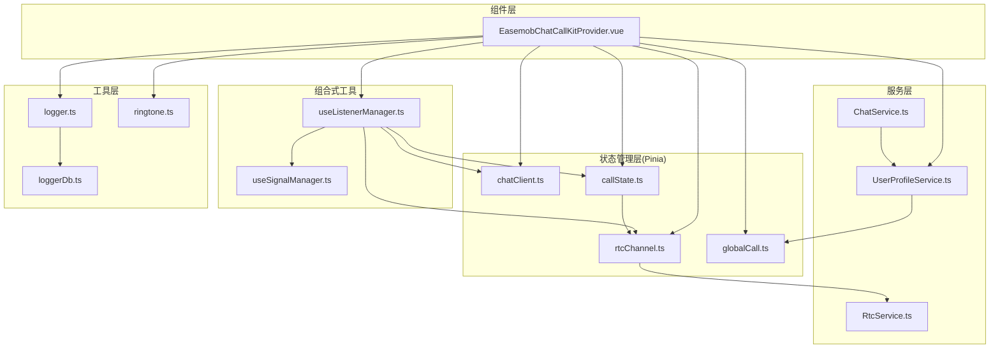
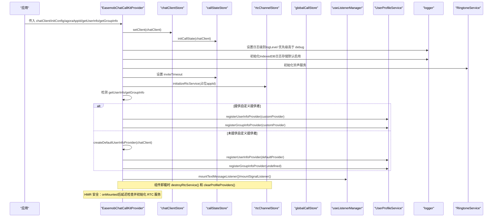
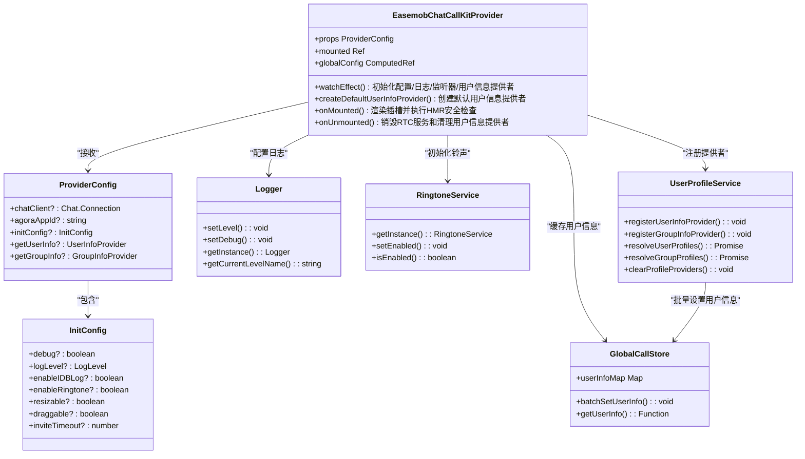
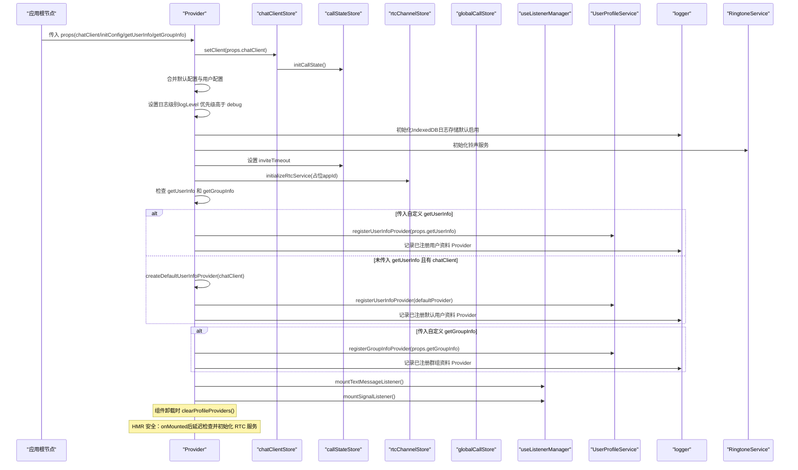
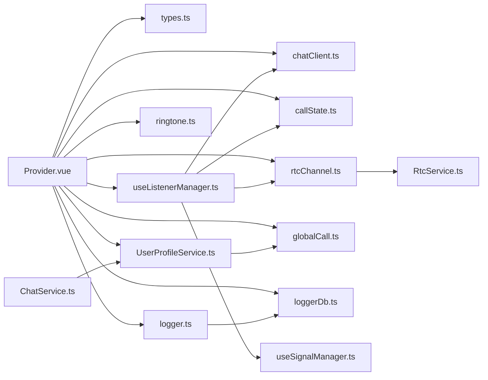

# Provider 组件

<cite>
**本文档引用的文件**
- [lib/components/EasemobChatCallKitProvider.vue](file://lib/components/EasemobChatCallKitProvider.vue)
- [lib/types.ts](file://lib/types.ts)
- [lib/services/UserProfileService.ts](file://lib/services/UserProfileService.ts)
- [lib/store/globalCall.ts](file://lib/store/globalCall.ts)
- [lib/services/ChatService.ts](file://lib/services/ChatService.ts)
- [lib/store/chatClient.ts](file://lib/store/chatClient.ts)
- [lib/store/callState.ts](file://lib/store/callState.ts)
- [lib/store/rtcChannel.ts](file://lib/store/rtcChannel.ts)
- [lib/composables/useListenerManager.ts](file://lib/composables/useListenerManager.ts)
- [lib/composables/useSignalManager.ts](file://lib/composables/useSignalManager.ts)
- [lib/services/RtcService.ts](file://lib/services/RtcService.ts)
- [lib/utils/logger.ts](file://lib/utils/logger.ts)
- [lib/utils/ringtone.ts](file://lib/utils/ringtone.ts)
- [lib/utils/loggerDb.ts](file://lib/utils/loggerDb.ts)
- [USAGE.md](file://USAGE.md)
</cite>

## 更新摘要
**变更内容**
- Provider 组件新增自动初始化IndexedDB日志存储功能，支持持久化日志记录
- 新增 RingtoneService初始化功能，提供铃声播放服务（当前为桩函数占位）
- 增强日志状态显示，提供更详细的配置验证和错误处理机制
- 优化 HMR 安全改进：新增延迟初始化检查机制，解决 webpack HMR 时的时机问题
- 新增 onMounted 生命周期钩子中的延迟初始化逻辑，确保 HMR 后 RTC 服务的正确初始化
- 增强组件挂载后的稳定性，避免旧组件销毁与新组件初始化之间的竞态条件
- 优化 HMR 场景下的资源管理和状态同步

## 目录
1. [简介](#简介)
2. [项目结构](#项目结构)
3. [核心组件](#核心组件)
4. [架构总览](#架构总览)
5. [详细组件分析](#详细组件分析)
6. [依赖关系分析](#依赖关系分析)
7. [性能考虑](#性能考虑)
8. [故障排查指南](#故障排查指南)
9. [结论](#结论)
10. [附录](#附录)

## 简介
EasemobChatCallKitProvider 是 CallKit 的根组件，负责：
- 全局配置管理：合并默认配置与用户配置，暴露响应式全局配置
- 状态初始化：初始化并注入 Pinia Store（聊天客户端、通话状态、RTC 频道）
- 事件监听器挂载：在环信客户端可用时挂载文本消息与信令监听器
- 用户信息提供者：注册用户和群组信息查询 Provider，支持批量用户信息获取
- **新增** 自动初始化IndexedDB日志存储：提供持久化的日志记录能力，支持按通话维度还原
- **新增** RingtoneService初始化：提供铃声播放服务（当前为桩函数占位）
- **新增** 增强的日志状态显示：提供详细的日志配置和状态信息
- **新增** 配置验证和错误处理：增强配置验证和错误处理机制
- **新增** HMR 安全改进：新增延迟初始化检查机制，解决 webpack HMR 时的时机问题
- 生命周期管理：组件挂载后渲染子树；组件卸载时销毁 RTC 服务和清理用户信息提供者

该组件是所有通话相关组件的上下文容器，确保环信 IM 信令与声网 RTC 能力在应用层面正确初始化与协同工作，同时提供完善的用户信息管理机制和强大的日志记录能力。

## 项目结构
Provider 组件位于 lib/components 目录，配合 lib/store、lib/composables、lib/services、lib/utils 等模块共同构成完整的通话上下文生态。

**图表来源**
- [lib/components/EasemobChatCallKitProvider.vue:1-206](file://lib/components/EasemobChatCallKitProvider.vue#L1-L206)
- [lib/store/chatClient.ts:1-23](file://lib/store/chatClient.ts#L1-L23)
- [lib/store/callState.ts:1-215](file://lib/store/callState.ts#L1-L215)
- [lib/store/rtcChannel.ts:1-264](file://lib/store/rtcChannel.ts#L1-L264)
- [lib/store/globalCall.ts:1-56](file://lib/store/globalCall.ts#L1-L56)
- [lib/services/UserProfileService.ts:1-137](file://lib/services/UserProfileService.ts#L1-L137)
- [lib/services/ChatService.ts:64-101](file://lib/services/ChatService.ts#L64-L101)
- [lib/composables/useListenerManager.ts:1-262](file://lib/composables/useListenerManager.ts#L1-L262)
- [lib/composables/useSignalManager.ts:1-200](file://lib/composables/useSignalManager.ts#L1-L200)
- [lib/services/RtcService.ts:1-771](file://lib/services/RtcService.ts#L1-L771)
- [lib/utils/logger.ts:1-484](file://lib/utils/logger.ts#L1-L484)
- [lib/utils/ringtone.ts:1-47](file://lib/utils/ringtone.ts#L1-L47)
- [lib/utils/loggerDb.ts:1-103](file://lib/utils/loggerDb.ts#L1-L103)

**章节来源**
- [lib/components/EasemobChatCallKitProvider.vue:1-206](file://lib/components/EasemobChatCallKitProvider.vue#L1-L206)
- [lib/types.ts:39-72](file://lib/types.ts#L39-L72)

## 核心组件
- Provider 组件职责
  - 接收 chatClient（环信客户端实例）、agoraAppId（兼容参数）、initConfig（运行期配置）
  - 接收 getUserInfo 和 getGroupInfo（用户信息提供者函数）
  - 合并默认配置与用户配置，创建响应式全局配置
  - 初始化并注入 Pinia Store（聊天客户端、通话状态、RTC 频道、全局通话状态）
  - 在环信客户端就绪时挂载文本消息与信令监听器
  - 注册用户信息提供者，支持智能选择自定义提供者或默认基于环信 SDK 的实现
  - **新增** 自动初始化IndexedDB日志存储：提供持久化的日志记录能力，支持按通话维度还原
  - **新增** RingtoneService初始化：提供铃声播放服务（当前为桩函数占位）
  - **新增** 增强的日志状态显示：提供详细的日志配置和状态信息
  - **新增** HMR 安全改进：在组件挂载后进行延迟初始化检查，确保 HMR 时 RTC 服务的正确初始化
  - 组件卸载时销毁 RTC 服务，清理用户信息提供者和缓存

- Provider 配置项
  - chatClient：环信 WebSDK 实例（必填）
  - agoraAppId：声网 App ID（已废弃，仅用于向后兼容）
  - initConfig：运行期配置对象
    - debug：开启调试模式（等价于 logLevel: LogLevel.VERBOSE）
    - logLevel：日志输出级别（0=ERROR, 1=WARN, 2=INFO, 3=DEBUG, 4=VERBOSE），优先级高于 debug
    - enableIDBLog：启用IndexedDB日志存储，默认 true
    - enableRingtone：开启铃声
    - resizable：开启可调整大小
    - draggable：开启可拖动
    - inviteTimeout：邀请超时时间（毫秒）
  - getUserInfo：用户信息查询 Provider，支持批量用户信息获取
  - getGroupInfo：群组信息查询 Provider，支持批量群组信息获取

**更新** 新增自动初始化IndexedDB日志存储、RingtoneService初始化、增强的日志状态显示、配置验证和错误处理功能

**章节来源**
- [lib/components/EasemobChatCallKitProvider.vue:29-65](file://lib/components/EasemobChatCallKitProvider.vue#L29-L65)
- [lib/types.ts:39-72](file://lib/types.ts#L39-L72)

## 架构总览
Provider 作为根组件，串联 IM 信令与 RTC 能力，形成"信令驱动状态 + RTC 驱动媒体 + 用户信息驱动展示 + 日志驱动调试"的四通道架构。

**图表来源**
- [lib/components/EasemobChatCallKitProvider.vue:127-206](file://lib/components/EasemobChatCallKitProvider.vue#L127-L206)
- [lib/store/chatClient.ts:10-16](file://lib/store/chatClient.ts#L10-L16)
- [lib/store/callState.ts:68-76](file://lib/store/callState.ts#L68-L76)
- [lib/store/rtcChannel.ts:84-101](file://lib/store/rtcChannel.ts#L84-L101)
- [lib/store/globalCall.ts:8-56](file://lib/store/globalCall.ts#L8-L56)
- [lib/services/UserProfileService.ts:25-42](file://lib/services/UserProfileService.ts#L25-L42)
- [lib/composables/useListenerManager.ts:201-255](file://lib/composables/useListenerManager.ts#L201-L255)
- [lib/utils/logger.ts:91-94](file://lib/utils/logger.ts#L91-L94)

## 详细组件分析

### Provider 组件类图

**图表来源**
- [lib/components/EasemobChatCallKitProvider.vue:29-65](file://lib/components/EasemobChatCallKitProvider.vue#L29-L65)
- [lib/types.ts:39-72](file://lib/types.ts#L39-L72)
- [lib/utils/logger.ts:56-95](file://lib/utils/logger.ts#L56-L95)
- [lib/utils/ringtone.ts:8-46](file://lib/utils/ringtone.ts#L8-L46)
- [lib/services/UserProfileService.ts:15-42](file://lib/services/UserProfileService.ts#L15-L42)
- [lib/store/globalCall.ts:8-56](file://lib/store/globalCall.ts#L8-L56)

**章节来源**
- [lib/components/EasemobChatCallKitProvider.vue:1-206](file://lib/components/EasemobChatCallKitProvider.vue#L1-L206)
- [lib/types.ts:39-72](file://lib/types.ts#L39-L72)
- [lib/services/UserProfileService.ts:1-137](file://lib/services/UserProfileService.ts#L1-L137)
- [lib/store/globalCall.ts:1-56](file://lib/store/globalCall.ts#L1-L56)

### Provider 初始化流程时序

**图表来源**
- [lib/components/EasemobChatCallKitProvider.vue:127-206](file://lib/components/EasemobChatCallKitProvider.vue#L127-L206)
- [lib/store/chatClient.ts:10-16](file://lib/store/chatClient.ts#L10-L16)
- [lib/store/callState.ts:68-76](file://lib/store/callState.ts#L68-L76)
- [lib/store/rtcChannel.ts:84-101](file://lib/store/rtcChannel.ts#L84-L101)
- [lib/services/UserProfileService.ts:25-42](file://lib/services/UserProfileService.ts#L25-L42)
- [lib/composables/useListenerManager.ts:201-255](file://lib/composables/useListenerManager.ts#L201-L255)

**章节来源**
- [lib/components/EasemobChatCallKitProvider.vue:65-206](file://lib/components/EasemobChatCallKitProvider.vue#L65-L206)

### 自动IndexedDB日志存储初始化
- **自动初始化**：在 watchEffect 中检测 enableIDBLog 配置，自动初始化 IndexedDB 日志存储
- **默认启用**：enableIDBLog 默认为 true，提供持久化的日志记录能力
- **容量控制**：支持最大容量限制（默认20MB），超出时自动清理最旧日志
- **级别独立**：IDB 日志级别独立于控制台级别，默认 VERBOSE 级别
- **维度支持**：支持按通话维度（callId）关联日志，便于问题复现
- **错误处理**：初始化失败时提供友好的错误提示，不影响主流程
- **性能优化**：异步写入，不阻塞业务逻辑

**更新** 新增自动IndexedDB日志存储初始化功能

**章节来源**
- [lib/components/EasemobChatCallKitProvider.vue:80-101](file://lib/components/EasemobChatCallKitProvider.vue#L80-L101)
- [lib/utils/logger.ts:196-240](file://lib/utils/logger.ts#L196-L240)
- [lib/utils/loggerDb.ts:32-103](file://lib/utils/loggerDb.ts#L32-L103)

### RingtoneService初始化与管理
- **服务初始化**：在 watchEffect 中调用 RingtoneService.getInstance().setEnabled() 初始化铃声服务
- **桩函数占位**：当前为桩函数实现，仅在控制台打印 debug 日志，不实际播放音频
- **配置管理**：支持通过 enableRingtone 配置控制铃声服务的启用状态
- **扩展准备**：为后续接入实际音频资源预留接口，当前行为明确标注 TODO
- **错误处理**：初始化过程包含完整的错误捕获和日志记录

**更新** 新增RingtoneService初始化功能

**章节来源**
- [lib/components/EasemobChatCallKitProvider.vue:103-105](file://lib/components/EasemobChatCallKitProvider.vue#L103-L105)
- [lib/utils/ringtone.ts:1-47](file://lib/utils/ringtone.ts#L1-L47)

### 增强的日志状态显示
- **详细配置信息**：提供完整的配置合并和当前状态显示
- **级别名称获取**：通过 getCurrentLevelName() 获取当前日志级别名称
- **结构化日志**：支持信号、状态、RTC等结构化日志记录
- **会话关联**：支持通过 setSessionId() 关联通话会话ID
- **导出功能**：支持按会话、时间范围导出日志，便于问题排查

**更新** 新增增强的日志状态显示功能

**章节来源**
- [lib/components/EasemobChatCallKitProvider.vue:108-111](file://lib/components/EasemobChatCallKitProvider.vue#L108-L111)
- [lib/utils/logger.ts:315-323](file://lib/utils/logger.ts#L315-L323)
- [lib/utils/logger.ts:325-368](file://lib/utils/logger.ts#L325-L368)

### HMR 安全改进机制
- **延迟初始化检查**：在 onMounted 生命周期钩子中，使用 setTimeout 延迟 50ms 检查 RTC 服务状态
- **HMR 时机问题解决**：解决 webpack/vue-cli HMR 时旧组件的 async destroyRtcService 可能在新组件 mount 后才完成的问题
- **竞态条件避免**：防止 watchEffect 中的条件判断为 false（RtcService 当时还存在），之后被销毁却不再触发初始化
- **自动恢复机制**：如果检测到 RTC 服务缺失，自动重新初始化占位 appId 的 RTC 服务
- **错误处理**：包含完整的错误捕获和日志记录，便于问题排查

**更新** 新增 HMR 安全改进功能，增强组件挂载后的稳定性

**章节来源**
- [lib/components/EasemobChatCallKitProvider.vue:182-198](file://lib/components/EasemobChatCallKitProvider.vue#L182-L198)

### 自动默认用户信息提供者注册与使用流程
- **智能提供者选择**：在 watchEffect 中检测 getUserInfo 和 getGroupInfo，优先使用用户传入的自定义提供者
- **默认提供者创建**：当未传入 getUserInfo 且存在 chatClient 时，自动创建基于环信 SDK 的默认实现
- **默认提供者实现**：createDefaultUserInfoProvider 使用 chatClient.fetchUserInfoById 获取用户昵称和头像
- **用户信息获取**：通过 resolveUserProfiles 执行批量用户信息查询，失败时返回 userId 兜底
- **群组信息获取**：通过 resolveGroupProfiles 执行批量群组信息查询，失败时返回 groupId 兜底
- **缓存管理**：用户信息提供者查询结果会缓存到 GlobalCallStore，支持批量设置和查询
- **自动清理**：组件卸载时调用 clearProfileProviders 清理已注册的 Provider

**更新** 新增自动默认用户信息提供者注册功能，支持智能选择提供者实现

**章节来源**
- [lib/components/EasemobChatCallKitProvider.vue:151-179](file://lib/components/EasemobChatCallKitProvider.vue#L151-L179)
- [lib/services/UserProfileService.ts:25-137](file://lib/services/UserProfileService.ts#L25-L137)
- [lib/store/globalCall.ts:14-54](file://lib/store/globalCall.ts#L14-L54)

### 事件监听器挂载流程
- 文本消息监听：监听环信文本消息，识别 action=invite 的通话邀请，更新通话状态并发送 alert 信令
- 信令监听：监听 rtcCall 类型的命令消息，分发到具体信令处理器（alert/confirmRing/answerCall/confirmCallee/cancelCall/leaveCall）
- 监听器挂载条件：仅在 chatClient 存在时进行挂载，否则记录警告

**章节来源**
- [lib/composables/useListenerManager.ts:201-255](file://lib/composables/useListenerManager.ts#L201-L255)
- [lib/composables/useListenerManager.ts:230-255](file://lib/composables/useListenerManager.ts#L230-L255)

### RTC 服务初始化与销毁
- 初始化：Provider 在首次 watchEffect 中检测 rtcService 未初始化时，使用占位 appId 调用 initializeRtcService
- 销毁：组件卸载时调用 destroyRtcService，停止本地/远程轨道，清理事件监听与定时器
- **新增** HMR 安全：onMounted 后延迟检查并自动恢复 RTC 服务初始化

**章节来源**
- [lib/components/EasemobChatCallKitProvider.vue:113-130](file://lib/components/EasemobChatCallKitProvider.vue#L113-L130)
- [lib/store/rtcChannel.ts:114-121](file://lib/store/rtcChannel.ts#L114-L121)
- [lib/services/RtcService.ts:730-771](file://lib/services/RtcService.ts#L730-L771)

### 通话状态与超时机制
- 初始化通话状态：根据 chatClient 上下文填充 callerDevId、callerUserId、token
- 邀请超时：根据 initConfig.inviteTimeout 设置定时器；单人通话超时后自动回到 IDLE；多人通话保持界面等待用户手动挂断

**章节来源**
- [lib/store/callState.ts:68-76](file://lib/store/callState.ts#L68-L76)
- [lib/store/callState.ts:89-131](file://lib/store/callState.ts#L89-L131)

### 日志系统与调试模式
- Logger 提供 ERROR/WARN/INFO/DEBUG/VERBOSE 五级日志
- Provider 在初始化阶段根据 logLevel 优先级设置日志级别，若 logLevel 未设置则回退到 debug
- **新增** 自动IndexedDB日志存储：提供持久化的日志记录能力，支持按通话维度还原
- **新增** RingtoneService初始化：提供铃声播放服务（当前为桩函数占位）
- **新增** 增强的日志状态显示：提供详细的日志配置和状态信息
- 通过日志定位监听器挂载、RTC 初始化、信令处理、用户信息提供者注册等关键路径
- **新增** HMR 安全改进相关的日志记录，包括延迟初始化检查和 RTC 服务恢复

**更新** 新增用户信息提供者相关的日志记录

**章节来源**
- [lib/utils/logger.ts:91-94](file://lib/utils/logger.ts#L91-L94)
- [lib/components/EasemobChatCallKitProvider.vue:67-111](file://lib/components/EasemobChatCallKitProvider.vue#L67-L111)

## 依赖关系分析
Provider 与各模块的耦合关系如下：

**图表来源**
- [lib/components/EasemobChatCallKitProvider.vue:8-16](file://lib/components/EasemobChatCallKitProvider.vue#L8-L16)
- [lib/types.ts:1-110](file://lib/types.ts#L1-L110)
- [lib/composables/useListenerManager.ts:1-262](file://lib/composables/useListenerManager.ts#L1-L262)
- [lib/services/RtcService.ts:1-771](file://lib/services/RtcService.ts#L1-L771)
- [lib/services/UserProfileService.ts:1-137](file://lib/services/UserProfileService.ts#L1-L137)

**章节来源**
- [lib/components/EasemobChatCallKitProvider.vue:8-16](file://lib/components/EasemobChatCallKitProvider.vue#L8-L16)
- [lib/composables/useListenerManager.ts:1-262](file://lib/composables/useListenerManager.ts#L1-L262)

## 性能考虑
- 配置合并与响应式：通过 computed 暴露全局配置，避免重复计算与无效更新
- 监听器挂载时机：仅在 chatClient 就绪时挂载，减少无效监听
- 用户信息缓存：通过 GlobalCallStore 缓存用户信息，避免重复查询
- 批量用户信息获取：UserProfileService 支持批量用户信息查询，提高查询效率
- **新增** 智能提供者选择：自动选择自定义提供者或默认实现，减少不必要的配置
- **新增** 默认提供者优化：基于环信 SDK 的默认实现，利用 SDK 内置缓存机制
- **新增** 用户信息缓存机制：通过 GlobalCallStore 的 userInfoMap 提升查询性能
- **新增** HMR 安全改进：延迟初始化检查机制，避免 HMR 时的竞态条件和资源冲突
- **新增** 轻量级延迟检查：50ms 延迟对用户体验影响极小，但能有效解决 HMR 时机问题
- **新增** IndexedDB日志存储：异步写入，不阻塞业务逻辑，支持容量控制
- **新增** RingtoneService优化：桩函数实现，无额外性能开销
- Provider 清理机制：组件卸载时统一清理用户信息提供者，防止内存泄漏
- RTC 资源管理：组件卸载时统一销毁，防止内存泄漏与媒体资源占用
- 日志级别控制：logLevel 优先级高于 debug，生产环境建议使用 LogLevel.ERROR，降低控制台输出开销
- **新增** 日志导出优化：支持按会话和时间范围导出，便于问题排查

**更新** 新增 HMR 安全改进和日志存储相关的性能优化措施

## 故障排查指南
- 未挂载事件监听器
  - 现象：Provider 输出"未挂载事件监听器：缺少环信客户端实例"
  - 排查：确认在 Provider 外层已传入 chatClient，且在 Provider 挂载后再设置
  - 参考：[lib/components/EasemobChatCallKitProvider.vue:138-141](file://lib/components/EasemobChatCallKitProvider.vue#L138-141)

- RTC 初始化失败
  - 现象：日志报错"RTC服务初始化失败"
  - 排查：确认环信客户端已登录并可获取 userId 映射；检查占位 appId 的使用是否符合预期
  - 参考：[lib/store/rtcChannel.ts:97-100](file://lib/store/rtcChannel.ts#L97-100)

- **新增** HMR 后 RTC 服务丢失
  - 现象：热更新后通话功能异常，RTC 服务不可用
  - 排查：确认 onMounted 生命周期钩子中的延迟初始化检查是否正常执行；检查控制台是否有"HMR 后 RtcService 延迟初始化"相关日志
  - 说明：这是 HMR 安全改进功能的预期行为，会自动恢复 RTC 服务
  - 参考：[lib/components/EasemobChatCallKitProvider.vue:187-197](file://lib/components/EasemobChatCallKitProvider.vue#L187-197)

- **新增** HMR 初始化失败
  - 现象：热更新后 RTC 服务恢复失败，控制台显示"HMR 后 RtcService 延迟初始化失败"
  - 排查：检查 chatClient 是否仍然有效；确认 agoraAppId 或外部 Agora 客户端实例是否正确传递
  - 参考：[lib/components/EasemobChatCallKitProvider.vue:193-195](file://lib/components/EasemobChatCallKitProvider.vue#L193-195)

- **新增** IndexedDB日志存储初始化失败
  - 现象：控制台显示"IndexedDB 日志存储初始化失败"
  - 排查：确认浏览器支持 IndexedDB；检查浏览器隐私设置是否阻止了 IndexedDB；确认磁盘空间充足
  - 说明：初始化失败不会影响主功能，日志仍会输出到控制台
  - 参考：[lib/components/EasemobChatCallKitProvider.vue:89-95](file://lib/components/EasemobChatCallKitProvider.vue#L89-95)

- **新增** RingtoneService初始化异常
  - 现象：铃声服务未按预期工作
  - 排查：确认 enableRingtone 配置是否正确；检查 RingtoneService 的 isEnabled() 返回值
  - 说明：当前为桩函数实现，仅在控制台输出日志
  - 参考：[lib/components/EasemobChatCallKitProvider.vue:104](file://lib/components/EasemobChatCallKitProvider.vue#L104)

- **新增** 用户信息提供者未生效
  - 现象：通话界面显示用户 ID 而非昵称和头像
  - 排查：确认 getUserInfo 和 getGroupInfo 函数已正确传入 Provider；检查用户信息提供者返回的数据格式
  - **新增** 检查是否正确传入 getUserInfo，如果未传入且 chatClient 不存在，将无法注册默认提供者
  - 参考：[lib/components/EasemobChatCallKitProvider.vue:165-179](file://lib/components/EasemobChatCallKitProvider.vue#L165-179)

- **新增** 默认用户信息提供者创建失败
  - 现象：未传入 getUserInfo 时，用户信息仍显示为 ID
  - 排查：确认 chatClient 已正确初始化；检查 chatClient.fetchUserInfoById 接口是否可用
  - **新增** 确认 Provider 能够访问 chatClientStore.getChatClient
  - 参考：[lib/components/EasemobChatCallKitProvider.vue:169-173](file://lib/components/EasemobChatCallKitProvider.vue#L169-173)

- **新增** 用户信息缓存异常
  - 现象：用户信息显示不一致或更新不及时
  - 排查：确认 GlobalCallStore 的用户信息缓存机制正常工作；检查用户信息提供者查询结果
  - 参考：[lib/store/globalCall.ts:14-54](file://lib/store/globalCall.ts#L14-54)

- Provider 内存泄漏
  - 现象：组件卸载后内存占用不降或用户信息提供者仍然存在
  - 排查：确认 Provider 组件正确执行了 onUnmounted 钩子；检查 clearProfileProviders 是否被调用
  - 参考：[lib/components/EasemobChatCallKitProvider.vue:200-204](file://lib/components/EasemobChatCallKitProvider.vue#L200-204)

- 邀请超时行为异常
  - 现象：多人通话超时后界面未自动隐藏
  - 说明：多人通话场景下超时后保持界面等待用户手动挂断，属设计行为
  - 参考：[lib/store/callState.ts:99-101](file://lib/store/callState.ts#L99-101)

- 日志级别不符合预期
  - 现象：日志过多或过少
  - 排查：确认 initConfig.logLevel 或 initConfig.debug 设置；Provider 会在初始化阶段优先使用 logLevel
  - 参考：[lib/components/EasemobChatCallKitProvider.vue:73-78](file://lib/components/EasemobChatCallKitProvider.vue#L73-78)

- 组件卸载后仍有媒体占用
  - 现象：页面切换后摄像头/麦克风仍被占用
  - 排查：确认 Provider 已正确卸载；RtcService.destroy 会停止所有轨道并清理事件
  - 参考：[lib/services/RtcService.ts:730-771](file://lib/services/RtcService.ts#L730-771)

**更新** 新增 HMR、IndexedDB日志存储、RingtoneService和用户信息提供者相关的故障排查指南

**章节来源**
- [lib/components/EasemobChatCallKitProvider.vue:138-141](file://lib/components/EasemobChatCallKitProvider.vue#L138-141)
- [lib/store/rtcChannel.ts:97-100](file://lib/store/rtcChannel.ts#L97-100)
- [lib/store/globalCall.ts:14-54](file://lib/store/globalCall.ts#L14-54)
- [lib/store/callState.ts:99-101](file://lib/store/callState.ts#L99-101)
- [lib/utils/logger.ts:91-94](file://lib/utils/logger.ts#L91-94)
- [lib/services/RtcService.ts:730-771](file://lib/services/RtcService.ts#L730-771)

## 结论
EasemobChatCallKitProvider 作为 CallKit 的根组件，承担了全局配置、状态初始化、事件监听和用户信息管理的关键职责。通过与 Pinia Store、监听器管理器、RTC 服务、用户信息提供者、日志系统和铃声服务的协作，实现了 IM 信令与 RTC 能力的无缝集成，同时提供了完善的用户信息管理机制和强大的日志记录能力。

**新增的自动IndexedDB日志存储功能**显著提升了问题排查和调试能力。通过持久化的日志记录和按通话维度的关联，开发者可以轻松地还原完整的通话流程，包括信令交互、状态变化和媒体事件。容量控制和异步写入机制确保了日志功能的性能和可靠性。

**新增的RingtoneService初始化功能**为未来的铃声播放能力做好了充分准备。虽然当前为桩函数实现，但清晰的接口设计和完整的生命周期管理为后续接入实际音频资源奠定了坚实基础。

**新增的增强日志状态显示功能**提供了更详细的配置信息和状态反馈，包括当前日志级别名称、结构化日志分类和会话关联能力，大大提升了调试体验。

**新增的 HMR 安全改进功能**显著提升了组件在开发环境中的稳定性。通过延迟初始化检查机制，有效解决了 webpack HMR 时旧组件销毁与新组件初始化之间的竞态条件问题，确保组件挂载后的 RTC 服务能够正确初始化，避免了因时机不当导致的功能异常。

**新增的自动默认用户信息提供者注册功能**同样显著提升了用户体验，通过智能选择自定义提供者或默认基于环信 SDK 的实现，减少了用户的配置负担。这一功能确保了即使用户未提供自定义的用户信息获取逻辑，系统也能自动提供基本的用户信息展示能力。

遵循本文档的最佳实践与排障建议，可确保在复杂场景下稳定运行，特别是在使用热更新开发模式时的稳定性表现。

## 附录

### Provider 配置项详解
- chatClient
  - 类型：环信 WebSDK Connection 实例
  - 必填：是
  - 作用：作为 IM 信令与 RTC 用户映射的基础
- agoraAppId
  - 类型：字符串
  - 必填：否（已废弃，仅用于向后兼容）
  - 说明：实际 appId 将在加入频道时从环信服务器动态获取
- initConfig
  - debug：开启调试模式，等价于 logLevel: LogLevel.VERBOSE
  - logLevel：日志输出级别，0=ERROR, 1=WARN, 2=INFO, 3=DEBUG, 4=VERBOSE，优先级高于 debug
  - enableIDBLog：启用IndexedDB日志存储，默认 true
  - enableRingtone：是否启用来电/响铃提示音
  - resizable：是否允许调整通话窗口大小
  - draggable：是否允许拖动通话窗口
  - inviteTimeout：邀请超时时间（毫秒），默认 30000
- getUserInfo
  - 类型：`(userIds: string[]) => Promise<UserProfile[]>`
  - 必填：否
  - 作用：批量获取用户信息，支持昵称和头像查询
  - **新增**：未提供时将自动创建基于环信 SDK 的默认实现
- getGroupInfo
  - 类型：`(groupIds: string[]) => Promise<GroupProfile[]>`
  - 必填：否
  - 作用：批量获取群组信息，支持群组名称和头像查询

**更新** 新增自动初始化IndexedDB日志存储、RingtoneService初始化、增强的日志状态显示、配置验证和错误处理功能

### 用户信息提供者接口规范
- UserProfile 接口
  - userId: string - 用户唯一标识
  - nickname?: string - 用户昵称
  - avatarUrl?: string - 用户头像 URL
- GroupProfile 接口
  - groupId: string - 群组唯一标识
  - groupName?: string - 群组名称
  - groupAvatar?: string - 群组头像 URL

### HMR 安全改进实现细节
- **延迟初始化检查**：在 onMounted 钩子中使用 setTimeout(50) 延迟检查 RTC 服务状态
- **竞态条件避免**：解决 webpack HMR 时旧组件 async destroyRtcService 可能在新组件 mount 后才完成的问题
- **自动恢复机制**：检测到 RTC 服务缺失时自动重新初始化占位 appId 的 RTC 服务
- **错误处理**：包含完整的错误捕获和日志记录，便于问题排查
- **性能影响**：50ms 延迟对用户体验影响极小，但能有效解决 HMR 时机问题

### 自动默认用户信息提供者实现
- **默认提供者创建**：当未传入 getUserInfo 且存在 chatClient 时，自动创建基于 chatClient.fetchUserInfoById 的默认实现
- **默认提供者功能**：支持批量获取用户昵称和头像信息
- **默认提供者优势**：利用环信 SDK 内置的用户信息缓存机制，提升性能和可靠性
- **默认提供者限制**：仅在 chatClient 可用时自动创建，否则需要用户手动提供自定义实现

### 自动IndexedDB日志存储实现
- **自动初始化**：检测 enableIDBLog 配置，自动初始化 IndexedDB 日志存储
- **容量控制**：默认最大容量 20MB，超出时自动清理最旧日志
- **级别独立**：IDB 日志级别独立于控制台级别，默认 VERBOSE 级别
- **维度支持**：支持按通话维度（callId）关联日志
- **异步写入**：不阻塞业务逻辑，确保性能
- **错误处理**：初始化失败时提供友好提示

### RingtoneService实现细节
- **桩函数占位**：当前为桩函数实现，仅在控制台打印 debug 日志
- **配置管理**：通过 enableRingtone 配置控制启用状态
- **扩展准备**：为后续接入实际音频资源预留完整接口
- **错误处理**：包含完整的错误捕获和日志记录

### 完整配置示例与最佳实践
- 示例参考：[USAGE.md:62-91](file://USAGE.md#L62-L91)
- 最佳实践
  - 在应用根组件中放置 Provider，并传入已登录的 chatClient
  - 生产环境使用 LogLevel.ERROR，开发环境使用 LogLevel.VERBOSE
  - logLevel 优先级高于 debug，建议优先使用 logLevel 进行配置
  - inviteTimeout 根据业务场景调整，多人通话建议适当延长
  - **新增** enableIDBLog 默认启用，生产环境可根据需要调整容量限制
  - **新增** RingtoneService 当前为桩函数，实际使用时需配置音频资源
  - **新增** getUserInfo 和 getGroupInfo 应支持批量查询，提高性能
  - **新增** 未提供自定义提供者时，系统将自动创建基于环信 SDK 的默认实现
  - **新增** 确保在 Provider 卸载前完成所有通话资源清理
  - **新增** 用户信息提供者应处理查询失败的情况，返回兜底数据
  - **新增** 开发模式下使用热更新时，HMR 安全改进功能会自动处理 RTC 服务恢复
  - **新增** 日志导出功能可用于问题排查和性能分析

**更新** 新增 HMR 安全改进、IndexedDB日志存储、RingtoneService和用户信息提供者配置的最佳实践

**章节来源**
- [USAGE.md:62-91](file://USAGE.md#L62-L91)
- [lib/types.ts:39-72](file://lib/types.ts#L39-L72)
- [lib/components/EasemobChatCallKitProvider.vue:29-65](file://lib/components/EasemobChatCallKitProvider.vue#L29-L65)
- [lib/components/EasemobChatCallKitProvider.vue:151-198](file://lib/components/EasemobChatCallKitProvider.vue#L151-L198)