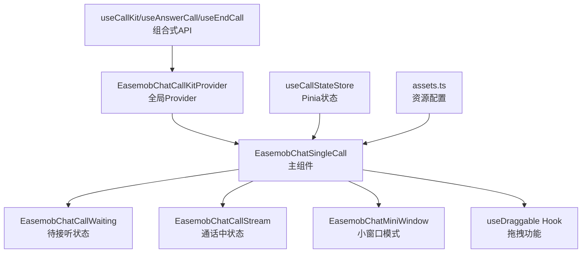
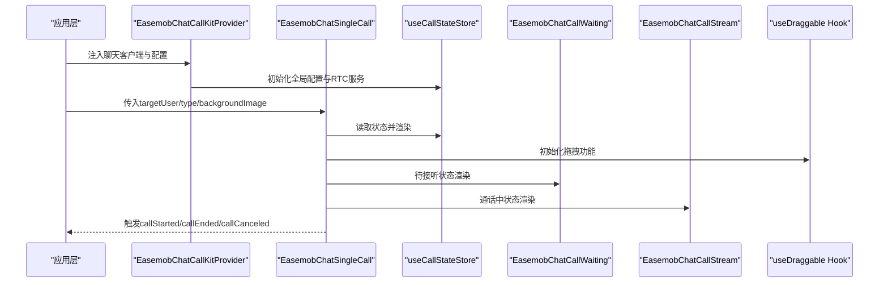
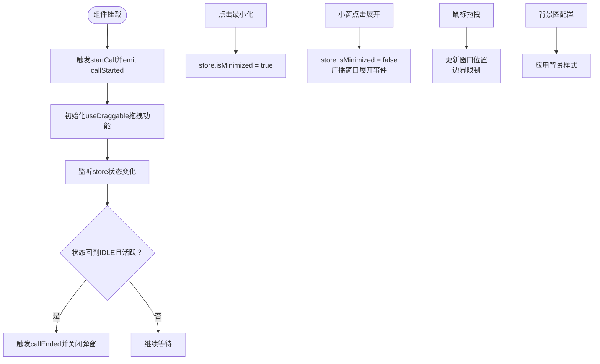
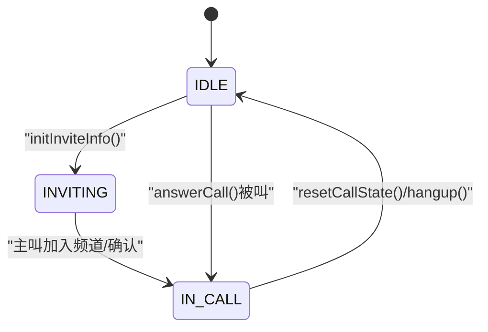
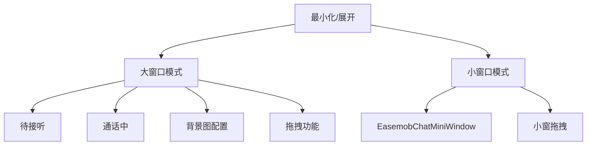
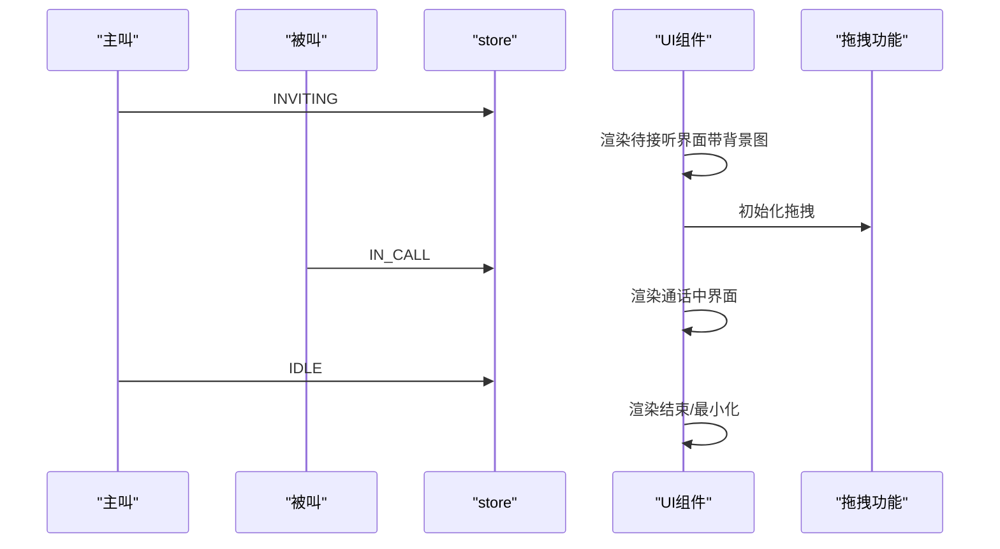
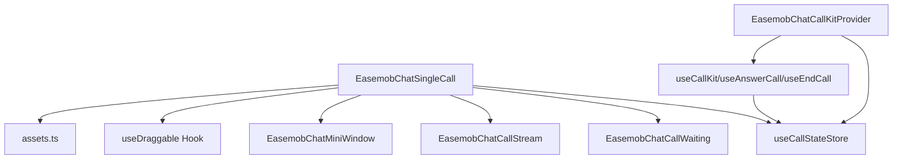

# 主组件 EasemobChatSingleCall

<cite>
**本文档引用的文件**
- [lib/components/singleCall/EasemobChatSingleCall.vue](file://lib/components/singleCall/EasemobChatSingleCall.vue)
- [lib/store/callState.ts](file://lib/store/callState.ts)
- [lib/types/callstate.types.ts](file://lib/types/callstate.types.ts)
- [lib/components/singleCall/EasemobChatCallWaiting.vue](file://lib/components/singleCall/EasemobChatCallWaiting.vue)
- [lib/components/singleCall/EasemobChatCallStream.vue](file://lib/components/singleCall/EasemobChatCallStream.vue)
- [lib/components/EasemobChatMiniWindow.vue](file://lib/components/EasemobChatMiniWindow.vue)
- [lib/composables/useCallKit.ts](file://lib/composables/useCallKit.ts)
- [lib/composables/useAnswerCall.ts](file://lib/composables/useAnswerCall.ts)
- [lib/composables/useEndCall.ts](file://lib/composables/useEndCall.ts)
- [lib/components/EasemobChatCallKitProvider.vue](file://lib/components/EasemobChatCallKitProvider.vue)
- [lib/config/assets.ts](file://lib/config/assets.ts)
- [lib/components/singleCall/styles/EasemobChatSingleCall.css](file://lib/components/singleCall/styles/EasemobChatSingleCall.css)
- [lib/composables/useDraggable.ts](file://lib/composables/useDraggable.ts)
- [test/src/App.vue](file://test/src/App.vue)
</cite>

## 更新摘要
**变更内容**
- 拖拽功能重构：原组件内的拖拽逻辑已被替换为新的 useDraggable 组合式 API，提供更统一和可复用的拖拽解决方案
- 新增背景图配置选项，支持自定义背景图片
- 优化最小化按钮的UI样式和交互体验
- 改进小窗口模式的拖拽功能
- 新增 useDraggable 组合式API用于拖拽操作
- 增强组件的视觉效果和用户体验

## 目录
1. [简介](#简介)
2. [项目结构](#项目结构)
3. [核心组件](#核心组件)
4. [架构总览](#架构总览)
5. [详细组件分析](#详细组件分析)
6. [依赖关系分析](#依赖关系分析)
7. [性能考虑](#性能考虑)
8. [故障排查指南](#故障排查指南)
9. [结论](#结论)
10. [附录](#附录)

## 简介
本文件面向主组件 EasemobChatSingleCall，系统性阐述其整体架构、一对一音视频通话的完整实现流程、状态管理机制（INVITING、CALLING 等状态切换）、布局结构（大窗口与小窗口模式切换）、属性配置项（targetUser、type、enableRingtone、backgroundImage 等）、事件系统（callStarted、callEnded、callCanceled 等），并提供完整的使用示例与最佳实践。

**更新** 本版本新增了拖拽功能、背景图配置、UI改进和最小化按钮优化等重大功能增强。拖拽功能已重构为统一的 useDraggable 组合式 API，提供更好的可复用性和一致性。

## 项目结构
EasemobChatSingleCall 位于 Vue3 版本的组件库中，采用 Pinia 状态管理与组合式 API 设计，配合 Provider 组件完成全局配置注入与事件监听挂载。组件通过 store 管理通话状态，通过子组件分别承载"待接听"和"通话中"的 UI 逻辑，并支持小窗口模式的最小化与拖拽交互。



**图表来源**
- [lib/components/EasemobChatCallKitProvider.vue](file://lib/components/EasemobChatCallKitProvider.vue#L1-L115)
- [lib/components/singleCall/EasemobChatSingleCall.vue](file://lib/components/singleCall/EasemobChatSingleCall.vue#L1-L178)
- [lib/store/callState.ts](file://lib/store/callState.ts#L1-L263)
- [lib/composables/useCallKit.ts](file://lib/composables/useCallKit.ts#L1-L123)
- [lib/composables/useAnswerCall.ts](file://lib/composables/useAnswerCall.ts#L1-L168)
- [lib/composables/useEndCall.ts](file://lib/composables/useEndCall.ts#L1-L131)
- [lib/config/assets.ts](file://lib/config/assets.ts#L1-L75)
- [lib/composables/useDraggable.ts](file://lib/composables/useDraggable.ts#L1-L320)

**章节来源**
- [lib/components/EasemobChatCallKitProvider.vue](file://lib/components/EasemobChatCallKitProvider.vue#L1-L115)
- [lib/components/singleCall/EasemobChatSingleCall.vue](file://lib/components/singleCall/EasemobChatSingleCall.vue#L1-L178)
- [lib/store/callState.ts](file://lib/store/callState.ts#L1-L263)

## 核心组件
- EasemobChatSingleCall：主组件，负责根据通话状态渲染"待接听"或"通话中"界面，控制大/小窗口切换，触发事件并暴露属性。**新增拖拽功能和背景图配置**。
- EasemobChatCallWaiting：待接听状态子组件，展示目标用户、通话类型、等待计时与取消/切换按钮。
- EasemobChatCallStream：通话中状态子组件，负责远程/本地视频播放、通话信息栏与控制按钮。
- EasemobChatMiniWindow：小窗口模式组件，支持拖拽、展开、关闭，音频/群组模式仅显示时长，视频模式显示远程视频。**优化了拖拽交互和UI样式**。
- useCallStateStore：Pinia 状态存储，管理通话状态、邀请超时、用户信息、窗口模式等。
- useCallKit/useAnswerCall/useEndCall：组合式 API，封装发起/应答/结束通话的业务逻辑。
- EasemobChatCallKitProvider：全局 Provider，注入聊天客户端、初始化 RTC 服务、挂载事件监听器。
- **新增** useDraggable：拖拽功能组合式 API，提供拖拽状态管理和事件处理。
- **新增** assets.ts：资源配置管理，支持背景图和图标资源的统一管理。

**章节来源**
- [lib/components/singleCall/EasemobChatSingleCall.vue](file://lib/components/singleCall/EasemobChatSingleCall.vue#L1-L178)
- [lib/components/singleCall/EasemobChatCallWaiting.vue](file://lib/components/singleCall/EasemobChatCallWaiting.vue#L1-L89)
- [lib/components/singleCall/EasemobChatCallStream.vue](file://lib/components/singleCall/EasemobChatCallStream.vue#L1-L322)
- [lib/components/EasemobChatMiniWindow.vue](file://lib/components/EasemobChatMiniWindow.vue#L1-L425)
- [lib/store/callState.ts](file://lib/store/callState.ts#L1-L263)
- [lib/composables/useCallKit.ts](file://lib/composables/useCallKit.ts#L1-L123)
- [lib/composables/useAnswerCall.ts](file://lib/composables/useAnswerCall.ts#L1-L168)
- [lib/composables/useEndCall.ts](file://lib/composables/useEndCall.ts#L1-L131)
- [lib/components/EasemobChatCallKitProvider.vue](file://lib/components/EasemobChatCallKitProvider.vue#L1-L115)
- [lib/config/assets.ts](file://lib/config/assets.ts#L1-L75)
- [lib/composables/useDraggable.ts](file://lib/composables/useDraggable.ts#L1-L320)

## 架构总览
EasemobChatSingleCall 采用"状态驱动 UI"的架构：组件通过计算属性读取 Pinia 状态（如当前通话状态、是否最小化），根据状态切换渲染不同的子组件；同时通过事件发射器向外抛出 callStarted、callEnded、callCanceled 等事件，供上层应用处理。

**更新** 新增拖拽功能和背景图配置，增强了组件的交互性和个性化定制能力。拖拽功能已重构为统一的 useDraggable 组合式 API，提供更好的可复用性和一致性。



**图表来源**
- [lib/components/EasemobChatCallKitProvider.vue](file://lib/components/EasemobChatCallKitProvider.vue#L1-L115)
- [lib/components/singleCall/EasemobChatSingleCall.vue](file://lib/components/singleCall/EasemobChatSingleCall.vue#L1-L178)
- [lib/store/callState.ts](file://lib/store/callState.ts#L1-L263)
- [lib/components/singleCall/EasemobChatCallWaiting.vue](file://lib/components/singleCall/EasemobChatCallWaiting.vue#L1-L89)
- [lib/components/singleCall/EasemobChatCallStream.vue](file://lib/components/singleCall/EasemobChatCallStream.vue#L1-L322)
- [lib/composables/useDraggable.ts](file://lib/composables/useDraggable.ts#L1-L320)

## 详细组件分析

### EasemobChatSingleCall 组件
- 功能职责
  - 根据通话状态（INVITING/IN_CALL 等）渲染"待接听"或"通话中"界面。
  - 控制大窗口与小窗口模式切换，支持最小化与展开。
  - **新增** 支持拖拽功能，允许用户拖拽通话窗口。
  - **新增** 支持背景图配置，可自定义通话窗口背景。
  - 触发 callStarted、callEnded、callCanceled 事件，供外层处理。
  - 读取 store 状态决定是否最小化，以及通话类型（音频/视频）。
- 关键属性
  - targetUser：目标用户 ID。
  - type：通话类型，'audio' | 'video'。
  - enableRingtone：是否启用铃声（默认启用）。
  - **新增** backgroundImage：自定义背景图 URL，支持本地路径或 CDN。
- 事件
  - callStarted：开始通话时触发。
  - callEnded：通话结束时触发。
  - callCanceled：取消通话时触发。
- 状态与行为
  - 通过 store.$subscribe 监听状态变化，当状态回到 IDLE 且仍处于活跃通话时，自动触发 callEnded 并关闭弹窗。
  - 小窗口模式通过 store.isMinimized 控制，展开时向父组件广播窗口展开事件以便重新播放远程视频。
  - **新增** 拖拽功能：通过 useDraggable 组合式 API 提供统一的拖拽解决方案，支持边界限制和视觉反馈。



**图表来源**
- [lib/components/singleCall/EasemobChatSingleCall.vue](file://lib/components/singleCall/EasemobChatSingleCall.vue#L120-L178)
- [lib/store/callState.ts](file://lib/store/callState.ts#L142-L151)
- [lib/config/assets.ts](file://lib/config/assets.ts#L59-L61)

**章节来源**
- [lib/components/singleCall/EasemobChatSingleCall.vue](file://lib/components/singleCall/EasemobChatSingleCall.vue#L1-L178)

### 状态管理机制（useCallStateStore）
- 状态字段
  - status：当前通话状态（IDLE、INVITING、ALERTING、CONFIRM_RING、RECEIVED_CONFIRM_RING、ANSWER_CALL、CONFIRM_CALLEE、IN_CALL）。
  - type：通话类型（AUDIO_1V1、VIDEO_1V1、VIDEO_MULTI、AUDIO_MULTI）。
  - isMinimized：是否为小窗口模式。
  - inviteTimeout：邀请超时时间（毫秒）。
  - userInfoMap/UIdToUserIdMap：用户信息映射。
- 关键动作
  - initInviteInfo：初始化邀请信息并设置状态为 INVITING，启动超时计时。
  - setCallStatus：设置状态并清空 leftUsers（新通话开始）。
  - startTimeoutTimer/clearTimeoutTimer/handleTimeout：邀请超时逻辑（多人通话不自动隐藏界面）。
  - resetCallState：重置所有通话状态。
- 计算属性
  - isInviting/isInCall/getIsMinimized：基于状态派生的布尔值。



**图表来源**
- [lib/store/callState.ts](file://lib/store/callState.ts#L44-L188)
- [lib/types/callstate.types.ts](file://lib/types/callstate.types.ts#L13-L22)

**章节来源**
- [lib/store/callState.ts](file://lib/store/callState.ts#L1-L263)
- [lib/types/callstate.types.ts](file://lib/types/callstate.types.ts#L1-L93)

### 布局结构与窗口模式
- 大窗口模式
  - 待接听：渲染 EasemobChatCallWaiting。
  - 通话中：渲染 EasemobChatCallStream。
  - **新增** 支持背景图配置，可通过 backgroundImage 属性自定义背景。
  - **新增** 支持拖拽功能，用户可拖拽窗口移动。
- 小窗口模式
  - 通过 EasemobChatMiniWindow 实现，支持拖拽、展开、关闭。
  - 音频/群组模式仅显示时长；视频模式显示远程视频。
  - **优化** 最小化按钮样式，提升视觉效果和交互体验。
- 切换机制
  - 通过 store.isMinimized 控制；展开时向父组件广播窗口展开事件，以便重新播放远程视频。



**图表来源**
- [lib/components/singleCall/EasemobChatSingleCall.vue](file://lib/components/singleCall/EasemobChatSingleCall.vue#L1-L26)
- [lib/components/EasemobChatMiniWindow.vue](file://lib/components/EasemobChatMiniWindow.vue#L1-L425)

**章节来源**
- [lib/components/singleCall/EasemobChatSingleCall.vue](file://lib/components/singleCall/EasemobChatSingleCall.vue#L1-L178)
- [lib/components/EasemobChatMiniWindow.vue](file://lib/components/EasemobChatMiniWindow.vue#L1-L425)

### 属性配置选项
- targetUser：目标用户 ID（必填）。
- type：通话类型 'audio' | 'video'。
- enableRingtone：是否启用铃声（默认 true）。
- **新增** backgroundImage：自定义背景图 URL，支持本地路径如 '/callkit-static-assets/images/callkit_bg.png' 或 CDN 地址。
- 其他通用配置（由 Provider 注入）
  - chatClient：环信客户端实例（必填）。
  - agoraAppId：Agora 应用 ID（Provider 初始化时使用占位值，实际 appId 在加入频道时动态获取）。
  - initConfig：包含 debug、enableRingtone、resizable、draggable、inviteTimeout 等默认配置。

**章节来源**
- [lib/components/singleCall/EasemobChatSingleCall.vue](file://lib/components/singleCall/EasemobChatSingleCall.vue#L49-L63)
- [lib/components/EasemobChatCallKitProvider.vue](file://lib/components/EasemobChatCallKitProvider.vue#L19-L57)
- [lib/config/assets.ts](file://lib/config/assets.ts#L59-L61)

### 事件系统
- 组件事件
  - callStarted：开始通话时触发。
  - callEnded：通话结束时触发。
  - callCanceled：取消通话时触发。
- 组合式 API 事件
  - useCallKit：发起单人/群组通话，内部通过信令发送邀请并更新状态。
  - useAnswerCall：被叫应答/拒绝/忙碌拒绝，发送 answerCall 信令并更新状态。
  - useEndCall：挂断/取消/远程取消/远程拒绝/异常结束，统一调用 CallService 执行。

```mermaid
sequenceDiagram
participant App as "应用层"
participant Single as "EasemobChatSingleCall"
participant CallKit as "useCallKit"
participant Answer as "useAnswerCall"
participant End as "useEndCall"
participant Store as "useCallStateStore"
App->>Single : 传入targetUser/type/backgroundImage
Single->>CallKit : startSingleCall()
CallKit->>Store : initInviteInfo() + INVITING
Note over Single,Store : 待接听界面渲染带背景图
App->>Answer : 被叫应答
Answer->>Store : setCallStatus(ANSWER_CALL/IN_CALL)
App->>End : 用户挂断
End->>Store : resetCallState() + IDLE
Single-->>App : emit callEnded
```

**图表来源**
- [lib/components/singleCall/EasemobChatSingleCall.vue](file://lib/components/singleCall/EasemobChatSingleCall.vue#L120-L178)
- [lib/composables/useCallKit.ts](file://lib/composables/useCallKit.ts#L13-L50)
- [lib/composables/useAnswerCall.ts](file://lib/composables/useAnswerCall.ts#L28-L76)
- [lib/composables/useEndCall.ts](file://lib/composables/useEndCall.ts#L18-L56)
- [lib/store/callState.ts](file://lib/store/callState.ts#L142-L151)

**章节来源**
- [lib/components/singleCall/EasemobChatSingleCall.vue](file://lib/components/singleCall/EasemobChatSingleCall.vue#L65-L69)
- [lib/composables/useCallKit.ts](file://lib/composables/useCallKit.ts#L1-L123)
- [lib/composables/useAnswerCall.ts](file://lib/composables/useAnswerCall.ts#L1-L168)
- [lib/composables/useEndCall.ts](file://lib/composables/useEndCall.ts#L1-L131)

### 一对一音视频通话完整流程
- 发起阶段
  - 应用层调用 useCallKit.startSingleCall(targetUser, type)。
  - 组件渲染待接听界面，store 状态为 INVITING。
  - **新增** 应用背景图配置，提升视觉效果。
- 应答阶段
  - 被叫侧 useAnswerCall.acceptCall() 发送 answerCall 信令，store 状态更新为 IN_CALL。
- 通话阶段
  - 组件渲染通话中界面，播放远程/本地视频，提供静音/摄像头切换/挂断等控制。
  - **新增** 支持拖拽功能，用户可拖拽窗口移动。
- 结束阶段
  - 任一方调用 useEndCall.hangupCall()，store 状态回到 IDLE，组件 emit callEnded。



**图表来源**
- [lib/composables/useCallKit.ts](file://lib/composables/useCallKit.ts#L27-L50)
- [lib/composables/useAnswerCall.ts](file://lib/composables/useAnswerCall.ts#L66-L76)
- [lib/composables/useEndCall.ts](file://lib/composables/useEndCall.ts#L34-L42)
- [lib/store/callState.ts](file://lib/store/callState.ts#L142-L151)
- [lib/components/singleCall/EasemobChatSingleCall.vue](file://lib/components/singleCall/EasemobChatSingleCall.vue#L88-L102)

### **新增** 拖拽功能实现
EasemobChatSingleCall 组件集成了拖拽功能，提供流畅的窗口移动体验。拖拽功能已重构为统一的 useDraggable 组合式 API：

- **拖拽初始化**：通过 useDraggable 组合式 API 初始化拖拽功能，支持居中定位和边界限制。
- **拖拽过程**：使用 Vue 响应式系统管理拖拽状态，实时更新窗口位置。
- **拖拽结束**：自动清理事件监听器，恢复默认样式。
- **边界限制**：确保窗口不会被拖出视口，保留至少 20px 可见区域。
- **视觉反馈**：拖拽时改变鼠标样式和阴影效果，提供更好的用户体验。
- **统一接口**：提供 elementRef、style、startDrag 等统一的 API 接口。

**章节来源**
- [lib/components/singleCall/EasemobChatSingleCall.vue](file://lib/components/singleCall/EasemobChatSingleCall.vue#L88-L102)
- [lib/composables/useDraggable.ts](file://lib/composables/useDraggable.ts#L78-L260)

### **新增** 背景图配置系统
组件支持灵活的背景图配置，满足不同场景的视觉需求：

- **默认背景**：使用 DEFAULT_BACKGROUND_IMAGE 常量提供的默认背景图。
- **自定义背景**：通过 backgroundImage 属性传入自定义 URL。
- **资源管理**：通过 getAssetUrl 函数统一管理资源 URL，支持本地路径和 CDN。
- **样式应用**：通过 backgroundStyle 计算属性动态应用背景样式。

**章节来源**
- [lib/components/singleCall/EasemobChatSingleCall.vue](file://lib/components/singleCall/EasemobChatSingleCall.vue#L146-L151)
- [lib/config/assets.ts](file://lib/config/assets.ts#L59-L61)

### **新增** useDraggable 组合式 API
新增的 useDraggable hook 提供了统一的拖拽功能：

- **状态管理**：使用 Vue 响应式系统管理拖拽状态、位置和偏移量。
- **事件处理**：处理 mousedown、mousemove、mouseup 等事件，支持鼠标和触摸事件。
- **边界检测**：智能检测拖拽区域，避免误触。
- **性能优化**：使用 ref 和 computed 优化性能，避免不必要的重渲染。
- **生命周期管理**：自动清理事件监听器，防止内存泄漏。
- **多种定位方式**：支持居中定位、固定位置、角落定位等多种定位方式。

**章节来源**
- [lib/composables/useDraggable.ts](file://lib/composables/useDraggable.ts#L1-L320)

## 依赖关系分析
- 组件耦合
  - EasemobChatSingleCall 依赖 useCallStateStore 与子组件（CallWaiting/CallStream/MiniWindow）。
  - **新增** 依赖 useDraggable hook 提供拖拽功能。
  - **新增** 依赖 assets.ts 提供背景图配置。
  - Provider 作为全局入口，注入 chatClient、初始化 RTC 服务并挂载监听。
- 外部依赖
  - Agora RTC SDK（通过 RtcChannelStore 与 RtcService 间接使用）。
  - 环信 IM SDK（通过 Provider 注入 chatClient）。
- 组合式 API
  - useCallKit/useAnswerCall/useEndCall 封装业务逻辑，降低组件复杂度。
  - **新增** useDraggable 提供通用拖拽功能。



**图表来源**
- [lib/components/singleCall/EasemobChatSingleCall.vue](file://lib/components/singleCall/EasemobChatSingleCall.vue#L1-L178)
- [lib/components/EasemobChatCallKitProvider.vue](file://lib/components/EasemobChatCallKitProvider.vue#L1-L115)
- [lib/composables/useCallKit.ts](file://lib/composables/useCallKit.ts#L1-L123)
- [lib/composables/useAnswerCall.ts](file://lib/composables/useAnswerCall.ts#L1-L168)
- [lib/composables/useEndCall.ts](file://lib/composables/useEndCall.ts#L1-L131)
- [lib/composables/useDraggable.ts](file://lib/composables/useDraggable.ts#L1-L320)
- [lib/config/assets.ts](file://lib/config/assets.ts#L1-L75)

**章节来源**
- [lib/components/singleCall/EasemobChatSingleCall.vue](file://lib/components/singleCall/EasemobChatSingleCall.vue#L1-L178)
- [lib/components/EasemobChatCallKitProvider.vue](file://lib/components/EasemobChatCallKitProvider.vue#L1-L115)
- [lib/composables/useCallKit.ts](file://lib/composables/useCallKit.ts#L1-L123)
- [lib/composables/useAnswerCall.ts](file://lib/composables/useAnswerCall.ts#L1-L168)
- [lib/composables/useEndCall.ts](file://lib/composables/useEndCall.ts#L1-L131)

## 性能考虑
- 状态订阅与响应式
  - 通过 store.$subscribe 监听状态变化，避免不必要的重渲染。
- 小窗视频轨道管理
  - 小窗隐藏时停止远程视频轨道播放，释放资源；展开时重试播放，提升稳定性。
- 本地/远程视频播放
  - 通话中组件监听本地流变化与远程用户发布事件，按需更新播放源，减少无效操作。
- 超时与定时器
  - 邀请超时使用一次性定时器，避免重复计时导致的内存泄漏。
- **新增** 拖拽性能优化
  - 使用 Vue 响应式系统优化拖拽性能，避免频繁的 DOM 操作。
  - 使用 CSS3 transform 进行位置更新，利用硬件加速。
  - 自动清理事件监听器，防止内存泄漏。
- **新增** 背景图优化
  - 使用 CSS 背景图而非内联图片，减少 HTTP 请求。
  - 支持缓存机制，避免重复加载相同资源。

## 故障排查指南
- 无法发起通话
  - 检查 Provider 是否注入 chatClient；确认 useCallKit 调用路径。
- 待接听界面不消失
  - 确认 store 状态是否回到 IDLE；检查超时配置与定时器是否被清理。
- 通话中无视频
  - 检查 RtcService 是否初始化；确认远程用户已发布视频并订阅成功；小窗模式下展开后重试播放。
- 小窗无法拖拽/展开
  - 检查鼠标事件绑定与窗口边界限制逻辑；确认点击事件未被拖拽标记屏蔽。
- 铃声未播放
  - 检查 enableRingtone 配置与 Provider 初始化配置。
- **新增** 拖拽功能异常
  - 检查 useDraggable 组合式 API 是否正确初始化；确认边界限制算法。
  - 验证事件监听器是否正确绑定，检查 hasDragged 状态。
- **新增** 背景图不显示
  - 检查 backgroundImage URL 是否正确；验证资源可访问性。
  - 确认 CSS 样式是否正确应用，检查 z-index 层级。

**章节来源**
- [lib/components/EasemobChatCallKitProvider.vue](file://lib/components/EasemobChatCallKitProvider.vue#L81-L92)
- [lib/components/singleCall/EasemobChatCallStream.vue](file://lib/components/singleCall/EasemobChatCallStream.vue#L146-L190)
- [lib/components/EasemobChatMiniWindow.vue](file://lib/components/EasemobChatMiniWindow.vue#L114-L174)
- [lib/components/singleCall/EasemobChatSingleCall.vue](file://lib/components/singleCall/EasemobChatSingleCall.vue#L88-L102)
- [lib/config/assets.ts](file://lib/config/assets.ts#L67-L74)

## 结论
EasemobChatSingleCall 通过清晰的状态驱动与模块化的子组件设计，实现了从"待接听"到"通话中"的完整流程，并提供了大/小窗口模式的灵活交互。**最新版本新增的拖拽功能、背景图配置、UI改进和最小化按钮优化**进一步提升了用户体验和组件的个性化定制能力。拖拽功能已重构为统一的 useDraggable 组合式 API，提供更好的可复用性和一致性。结合 Provider 的全局配置与组合式 API 的业务封装，开发者可快速集成一对一音视频通话能力，并在复杂场景中保持良好的可维护性与扩展性。

## 附录

### 使用示例（Vue 项目）
- 在应用根部注册 Provider 并注入 chatClient。
- 在需要发起通话的位置，使用 EasemobChatSingleCall 组件并传入 targetUser 与 type。
- **新增** 可选传入 backgroundImage 参数自定义背景图。
- 监听 callStarted/callEnded/callCanceled 事件以控制弹窗与后续流程。

**更新** 基于最新的功能增强，提供更丰富的使用示例：

```typescript
// 基础使用
<EasemobChatSingleCall 
  :target-user="targetUserId" 
  :type="callType"
  @call-started="handleCallStart"
  @call-ended="handleCallEnd"
/>

// 带背景图的使用
<EasemobChatSingleCall 
  :target-user="targetUserId" 
  :type="callType"
  :background-image="customBgImage"
  @call-started="handleCallStart"
  @call-ended="handleCallEnd"
/>
```

**章节来源**
- [test/src/App.vue](file://test/src/App.vue#L45-L46)
- [lib/components/EasemobChatCallKitProvider.vue](file://lib/components/EasemobChatCallKitProvider.vue#L12-L12)
- [lib/components/singleCall/EasemobChatSingleCall.vue](file://lib/components/singleCall/EasemobChatSingleCall.vue#L49-L63)
- [lib/config/assets.ts](file://lib/config/assets.ts#L59-L61)