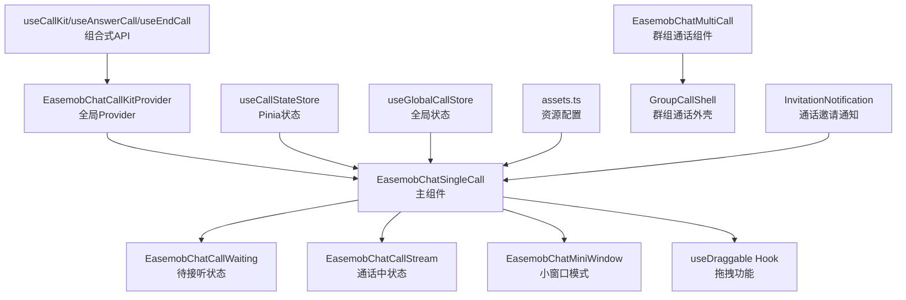
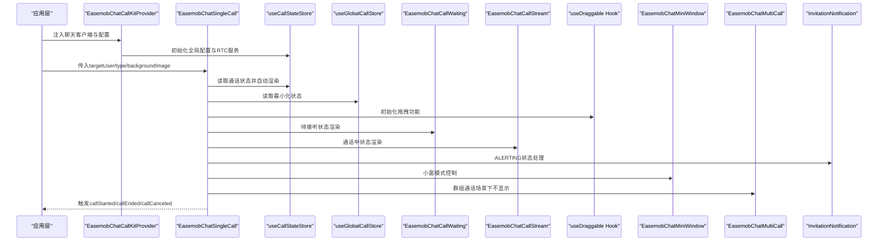
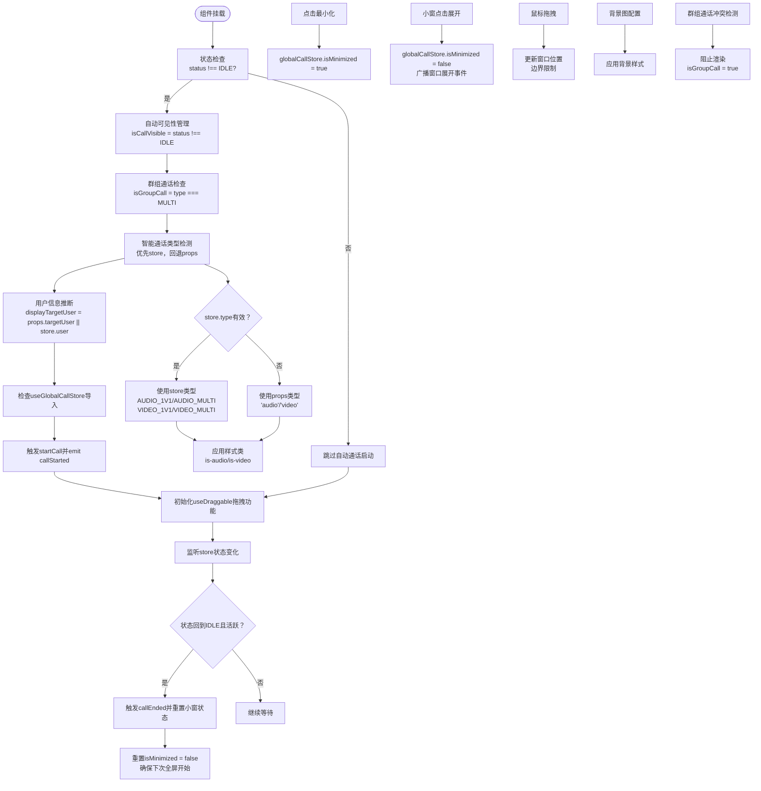
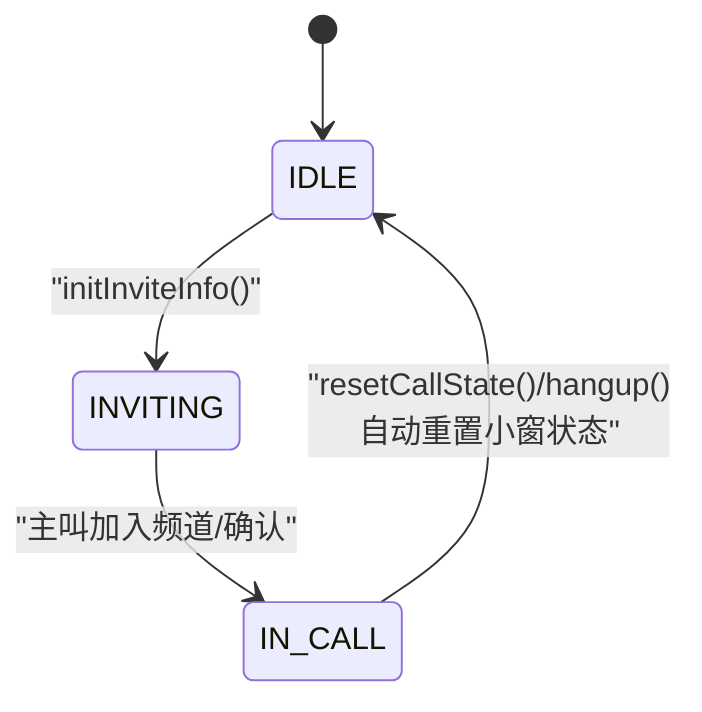
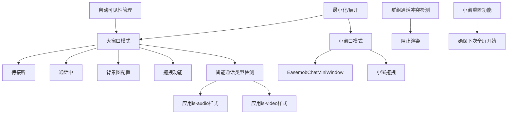
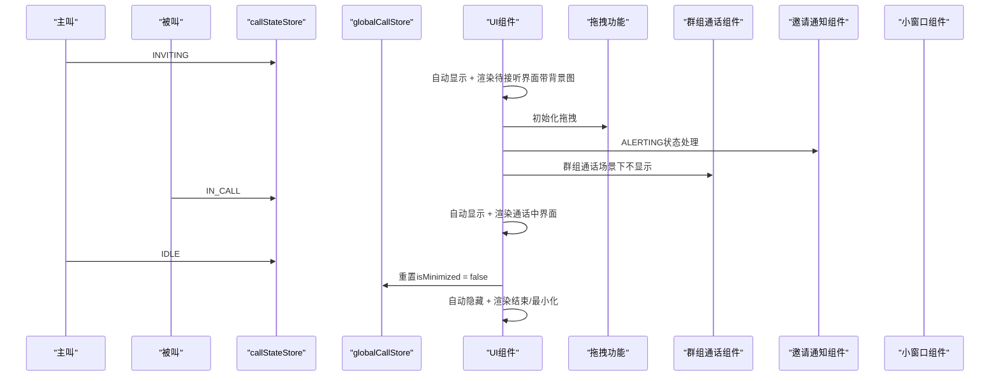
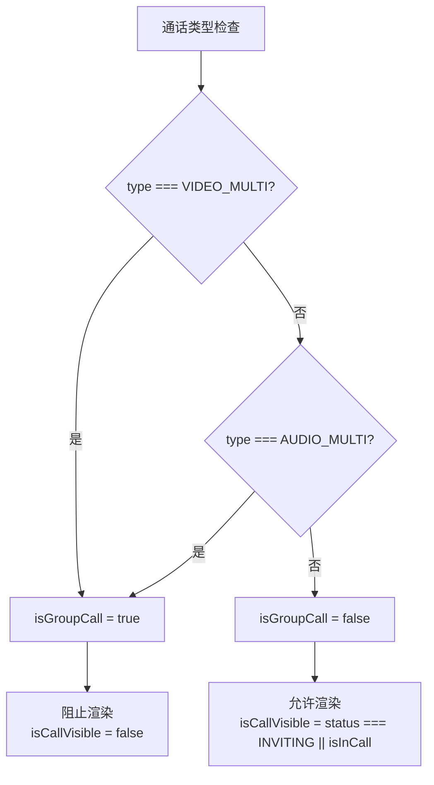
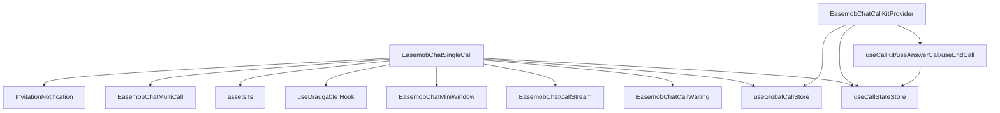

# 主组件 EasemobChatSingleCall

<cite>
**本文档引用的文件**
- [lib/components/singleCall/EasemobChatSingleCall.vue](file://lib/components/singleCall/EasemobChatSingleCall.vue)
- [lib/store/callState.ts](file://lib/store/callState.ts)
- [lib/store/globalCall.ts](file://lib/store/globalCall.ts)
- [lib/types/callstate.types.ts](file://lib/types/callstate.types.ts)
- [lib/components/singleCall/EasemobChatCallWaiting.vue](file://lib/components/singleCall/EasemobChatCallWaiting.vue)
- [lib/components/singleCall/EasemobChatCallStream.vue](file://lib/components/singleCall/EasemobChatCallStream.vue)
- [lib/components/EasemobChatMiniWindow.vue](file://lib/components/EasemobChatMiniWindow.vue)
- [lib/composables/useCallKit.ts](file://lib/composables/useCallKit.ts)
- [lib/composables/useAnswerCall.ts](file://lib/composables/useAnswerCall.ts)
- [lib/composables/useEndCall.ts](file://lib/composables/useEndCall.ts)
- [lib/components/EasemobChatCallKitProvider.vue](file://lib/components/EasemobChatCallKitProvider.vue)
- [lib/config/assets.ts](file://lib/config/assets.ts)
- [lib/components/singleCall/styles/EasemobChatSingleCall.css](file://lib/components/singleCall/styles/EasemobChatSingleCall.css)
- [lib/composables/useDraggable.ts](file://lib/composables/useDraggable.ts)
- [lib/components/multiCall/EasemobChatMultiCall.vue](file://lib/components/multiCall/EasemobChatMultiCall.vue)
- [lib/components/InvitationNotification.vue](file://lib/components/InvitationNotification.vue)
- [test/src/App.vue](file://test/src/App.vue)
</cite>

## 更新摘要
**变更内容**
- **小窗重置功能改进**：在通话结束后重置isMinimized状态，确保下次通话从全屏模式开始
- **智能通话类型检测系统**：新增了优先从 store 读取通话类型，支持音频和视频模式的正确识别和样式应用
- **类型安全性改进**：单人通话组件已改进类型安全性，使用运行时 defineProps 替代 withDefaults，防止构建时默认值丢失
- **ALERTING 状态显示逻辑增强**：完善了被叫响铃状态（ALERTING）的显示逻辑，确保组件正确处理各种通话状态
- **自动可见性管理**：EasemobChatSingleCall 组件现已具备自动管理可见性的能力，无需外部 v-if 控制，组件会根据通话状态自动显示/隐藏
- **可选参数支持**：targetUser 参数现在是可选的，组件会自动从 callStateStore 中推断目标用户信息
- **增强拖拽功能**：拖拽功能已重构为统一的 useDraggable 组合式 API，提供更强大的拖拽体验
- **背景图配置增强**：支持自定义背景图和默认背景图，提供更好的视觉体验
- **关键修复**：修复了 useGlobalCallStore 导入错误，确保组件能够正常访问全局状态管理功能
- **新增** **isGroupCall 计算属性**：新增 isGroupCall 计算属性，防止单人和群组通话组件之间的渲染冲突，确保群组通话场景下组件完全不显示
- **新增** **7行Bug修复**：修复组件挂载时自动发起通话的问题，通过状态检查避免无条件启动通话

## 目录
1. [简介](#简介)
2. [项目结构](#项目结构)
3. [核心组件](#核心组件)
4. [架构总览](#架构总览)
5. [详细组件分析](#详细组件分析)
6. [依赖关系分析](#依赖关系分析)
7. [性能考虑](#性能考虑)
8. [故障排查指南](#故障排查指南)
9. [结论](#结论)
10. [附录](#附录)

## 简介
本文件面向主组件 EasemobChatSingleCall，系统性阐述其整体架构、一对一音视频通话的完整实现流程、状态管理机制（INVITING、CALLING 等状态切换）、布局结构（大窗口与小窗口模式切换）、属性配置项（targetUser、type、enableRingtone、backgroundImage 等）、事件系统（callStarted、callEnded、callCanceled 等），并提供完整的使用示例与最佳实践。

**更新** 本版本最重要的增强是组件具备了自动可见性管理能力，无需外部 v-if 控制，组件会根据通话状态自动显示/隐藏。同时，targetUser 参数现在是可选的，组件会自动从 store 中推断用户信息。拖拽功能也已重构为统一的 useDraggable 组合式 API，提供更好的用户体验。

**新增** **小窗重置功能改进**：在通话结束后自动重置 isMinimized 状态为 false，确保下次发起通话时从全屏模式开始，提供一致的用户体验。

**新增** **智能通话类型检测系统**：组件现已实现智能通话类型检测，优先从 store 读取通话类型，支持音频和视频模式的正确识别和样式应用，确保通话类型与实际状态保持一致。

**新增** 类型安全性改进：组件已改用运行时 defineProps 替代 withDefaults，确保默认值在运行时正确应用，防止构建时默认值丢失的问题。

**新增** **isGroupCall 计算属性**：新增 isGroupCall 计算属性，防止单人和群组通话组件之间的渲染冲突，确保群组通话场景下组件完全不显示，避免与 EasemobChatMultiCall 和 GroupCallShell 组件的竞争。

**新增** **7行Bug修复**：修复了组件挂载时自动发起通话的问题，通过检查当前通话状态避免无条件启动通话，确保组件只在有实际通话活动时才启动。

## 项目结构
EasemobChatSingleCall 位于 Vue3 版本的组件库中，采用 Pinia 状态管理与组合式 API 设计，配合 Provider 组件完成全局配置注入与事件监听挂载。组件通过 store 管理通话状态，通过子组件分别承载"待接听"和"通话中"的 UI 逻辑，并支持小窗口模式的最小化与拖拽交互。



**图表来源**
- [lib/components/EasemobChatCallKitProvider.vue:1-115](file://lib/components/EasemobChatCallKitProvider.vue#L1-L115)
- [lib/components/singleCall/EasemobChatSingleCall.vue:1-235](file://lib/components/singleCall/EasemobChatSingleCall.vue#L1-L235)
- [lib/store/callState.ts:1-215](file://lib/store/callState.ts#L1-L215)
- [lib/store/globalCall.ts:1-56](file://lib/store/globalCall.ts#L1-L56)
- [lib/composables/useCallKit.ts:1-246](file://lib/composables/useCallKit.ts#L1-L246)
- [lib/composables/useAnswerCall.ts:1-168](file://lib/composables/useAnswerCall.ts#L1-L168)
- [lib/composables/useEndCall.ts:1-131](file://lib/composables/useEndCall.ts#L1-L131)
- [lib/config/assets.ts:1-75](file://lib/config/assets.ts#L1-L75)
- [lib/composables/useDraggable.ts:1-323](file://lib/composables/useDraggable.ts#L1-L323)
- [lib/components/multiCall/EasemobChatMultiCall.vue:1-92](file://lib/components/multiCall/EasemobChatMultiCall.vue#L1-L92)
- [lib/components/InvitationNotification.vue:1-342](file://lib/components/InvitationNotification.vue#L1-L342)

**章节来源**
- [lib/components/EasemobChatCallKitProvider.vue:1-115](file://lib/components/EasemobChatCallKitProvider.vue#L1-L115)
- [lib/components/singleCall/EasemobChatSingleCall.vue:1-235](file://lib/components/singleCall/EasemobChatSingleCall.vue#L1-L235)
- [lib/store/callState.ts:1-215](file://lib/store/callState.ts#L1-L215)
- [lib/store/globalCall.ts:1-56](file://lib/store/globalCall.ts#L1-L56)

## 核心组件
- **EasemobChatSingleCall**：主组件，负责根据通话状态自动渲染"待接听"或"通话中"界面，控制大/小窗口切换，触发事件并暴露属性。**新增小窗重置功能改进**，在通话结束后自动重置 isMinimized 状态，确保下次通话从全屏模式开始。**新增智能通话类型检测系统**，优先从 store 读取通话类型，支持音频和视频模式的正确识别和样式应用。**新增自动可见性管理**和**可选参数支持**，**新增 isGroupCall 计算属性**防止渲染冲突。**新增7行Bug修复**防止组件挂载时自动发起通话。
- EasemobChatCallWaiting：待接听状态子组件，展示目标用户、通话类型、等待计时与取消/切换按钮。
- EasemobChatCallStream：通话中状态子组件，负责远程/本地视频播放、通话信息栏与控制按钮。
- EasemobChatMiniWindow：小窗口模式组件，支持拖拽、展开、关闭，音频/群组模式仅显示时长，视频模式显示远程视频。
- useCallStateStore：Pinia 状态存储，管理通话状态、邀请超时、用户信息、窗口模式等。
- **新增** useGlobalCallStore：全局状态存储，管理跨通话域的共享状态，如窗口最小化状态、用户信息映射等。
- useCallKit/useAnswerCall/useEndCall：组合式 API，封装发起/应答/结束通话的业务逻辑。
- EasemobChatCallKitProvider：全局 Provider，注入聊天客户端、初始化 RTC 服务、挂载事件监听器。
- **新增** useDraggable：拖拽功能组合式 API，提供拖拽状态管理和事件处理。
- **新增** assets.ts：资源配置管理，支持背景图和图标资源的统一管理。
- **新增** EasemobChatMultiCall：群组通话组件，与单人通话组件协同工作，避免渲染冲突。
- **新增** InvitationNotification：通话邀请通知组件，处理被叫响铃状态。

**章节来源**
- [lib/components/singleCall/EasemobChatSingleCall.vue:1-235](file://lib/components/singleCall/EasemobChatSingleCall.vue#L1-L235)
- [lib/components/singleCall/EasemobChatCallWaiting.vue:1-89](file://lib/components/singleCall/EasemobChatCallWaiting.vue#L1-L89)
- [lib/components/singleCall/EasemobChatCallStream.vue:1-344](file://lib/components/singleCall/EasemobChatCallStream.vue#L1-L344)
- [lib/components/EasemobChatMiniWindow.vue:1-380](file://lib/components/EasemobChatMiniWindow.vue#L1-L380)
- [lib/store/callState.ts:1-215](file://lib/store/callState.ts#L1-L215)
- [lib/store/globalCall.ts:1-56](file://lib/store/globalCall.ts#L1-L56)
- [lib/composables/useCallKit.ts:1-246](file://lib/composables/useCallKit.ts#L1-L246)
- [lib/composables/useAnswerCall.ts:1-168](file://lib/composables/useAnswerCall.ts#L1-L168)
- [lib/composables/useEndCall.ts:1-131](file://lib/composables/useEndCall.ts#L1-L131)
- [lib/components/EasemobChatCallKitProvider.vue:1-115](file://lib/components/EasemobChatCallKitProvider.vue#L1-L115)
- [lib/config/assets.ts:1-75](file://lib/config/assets.ts#L1-L75)
- [lib/composables/useDraggable.ts:1-323](file://lib/composables/useDraggable.ts#L1-L323)
- [lib/components/multiCall/EasemobChatMultiCall.vue:1-92](file://lib/components/multiCall/EasemobChatMultiCall.vue#L1-L92)
- [lib/components/InvitationNotification.vue:1-342](file://lib/components/InvitationNotification.vue#L1-L342)

## 架构总览
EasemobChatSingleCall 采用"状态驱动 UI"的架构：组件通过计算属性读取 Pinia 状态（如当前通话状态、是否最小化），根据状态切换渲染不同的子组件；同时通过事件发射器向外抛出 callStarted、callEnded、callCanceled 等事件，供上层应用处理。

**更新** 组件现已具备自动可见性管理能力，无需外部 v-if 控制，组件会根据通话状态自动显示/隐藏。targetUser 参数现在是可选的，组件会自动从 store 中推断用户信息。拖拽功能已重构为统一的 useDraggable 组合式 API，提供更好的可复用性和一致性。

**新增** **小窗重置功能改进**：在通话结束后自动重置 isMinimized 状态为 false，确保下次发起通话时从全屏模式开始，提供一致的用户体验。

**新增** **智能通话类型检测系统**：组件实现了智能通话类型检测，优先从 store 读取通话类型，支持音频和视频模式的正确识别和样式应用。当 store 中存在有效的通话类型时，组件会使用 store 的类型；否则回退到 props 中的类型配置。

**新增** 类型安全性改进：组件使用运行时 defineProps 替代 withDefaults，确保默认值在运行时正确应用，防止构建时默认值丢失的问题。

**新增** **isGroupCall 计算属性**：新增 isGroupCall 计算属性，防止单人和群组通话组件之间的渲染冲突，确保群组通话场景下组件完全不显示，避免与 EasemobChatMultiCall 和 GroupCallShell 组件的竞争。

**新增** **7行Bug修复**：修复了组件挂载时自动发起通话的问题，通过检查当前通话状态避免无条件启动通话，确保组件只在有实际通话活动时才启动。



**图表来源**
- [lib/components/EasemobChatCallKitProvider.vue:1-115](file://lib/components/EasemobChatCallKitProvider.vue#L1-L115)
- [lib/components/singleCall/EasemobChatSingleCall.vue:1-235](file://lib/components/singleCall/EasemobChatSingleCall.vue#L1-L235)
- [lib/store/callState.ts:1-215](file://lib/store/callState.ts#L1-L215)
- [lib/store/globalCall.ts:1-56](file://lib/store/globalCall.ts#L1-L56)
- [lib/components/singleCall/EasemobChatCallWaiting.vue:1-89](file://lib/components/singleCall/EasemobChatCallWaiting.vue#L1-L89)
- [lib/components/singleCall/EasemobChatCallStream.vue:1-344](file://lib/components/singleCall/EasemobChatCallStream.vue#L1-L344)
- [lib/composables/useDraggable.ts:1-323](file://lib/composables/useDraggable.ts#L1-L323)
- [lib/components/EasemobChatMiniWindow.vue:1-380](file://lib/components/EasemobChatMiniWindow.vue#L1-L380)
- [lib/components/multiCall/EasemobChatMultiCall.vue:1-92](file://lib/components/multiCall/EasemobChatMultiCall.vue#L1-L92)
- [lib/components/InvitationNotification.vue:1-342](file://lib/components/InvitationNotification.vue#L1-L342)

## 详细组件分析

### EasemobChatSingleCall 组件
- **功能职责**
  - **自动可见性管理**：根据通话状态（IDLE/INVITING/IN_CALL）自动控制组件显示/隐藏，无需外部 v-if 控制
  - **群组通话防冲突**：通过 isGroupCall 计算属性确保群组通话场景下组件完全不显示，避免与 EasemobChatMultiCall 和 GroupCallShell 组件的竞争
  - **智能通话类型检测**：优先从 store 读取通话类型，支持音频和视频模式的正确识别和样式应用
  - **小窗重置功能**：在通话结束后自动重置 isMinimized 状态为 false，确保下次通话从全屏模式开始
  - 根据通话状态渲染"待接听"或"通话中"界面
  - 控制大窗口与小窗口模式切换，支持最小化与展开
  - **可选参数支持**：targetUser 参数现在是可选的，组件会自动从 store 中推断用户信息
  - 支持拖拽功能，允许用户拖拽通话窗口
  - 支持背景图配置，可自定义通话窗口背景
  - 触发 callStarted、callEnded、callCanceled 事件，供外层处理
  - 读取 store 状态决定是否最小化，以及通话类型（音频/视频）
  - **7行Bug修复**：通过状态检查避免组件挂载时自动发起通话
- **关键属性**
  - **targetUser**：目标用户 ID（可选）。组件会自动从 callStateStore 中推断用户信息
  - type：通话类型，'audio' | 'video'
  - enableRingtone：是否启用铃声（默认启用）
  - **backgroundImage**：自定义背景图 URL，支持本地路径或 CDN
- **事件**
  - callStarted：开始通话时触发
  - callEnded：通话结束时触发
  - callCanceled：取消通话时触发
- **状态与行为**
  - **自动可见性管理**：通过 isCallVisible 计算属性自动控制组件显示/隐藏
  - **isGroupCall 计算属性**：新增 isGroupCall 计算属性，防止单人和群组通话组件之间的渲染冲突
  - **智能通话类型检测**：通过 callType 计算属性实现优先从 store 读取，回退到 props 的智能检测机制
  - 通过 store.$subscribe 监听状态变化，当状态回到 IDLE 且仍处于活跃通话时，自动触发 callEnded 并关闭弹窗
  - 小窗口模式通过 store.isMinimized 控制，展开时向父组件广播窗口展开事件以便重新播放远程视频
  - **小窗重置功能**：在 handleEndCall 中重置 globalCallStore.isMinimized = false，确保下次通话从全屏开始
  - **拖拽功能**：通过 useDraggable 组合式 API 提供统一的拖拽解决方案，支持边界限制和视觉反馈
  - **用户信息推断**：displayTargetUser 计算属性优先使用 props，否则从 store 自动推断
  - **ALERTING 状态处理**：完善了被叫响铃状态的显示逻辑，确保组件正确处理各种通话状态
  - **7行Bug修复**：在 onMounted 中添加状态检查，只有当通话状态不是 IDLE 时才启动通话，避免组件挂载时自动发起通话



**图表来源**
- [lib/components/singleCall/EasemobChatSingleCall.vue:186-192](file://lib/components/singleCall/EasemobChatSingleCall.vue#L186-L192)
- [lib/components/singleCall/EasemobChatSingleCall.vue:111-121](file://lib/components/singleCall/EasemobChatSingleCall.vue#L111-L121)
- [lib/components/singleCall/EasemobChatSingleCall.vue:191-206](file://lib/components/singleCall/EasemobChatSingleCall.vue#L191-L206)
- [lib/components/singleCall/EasemobChatSingleCall.vue:84-109](file://lib/components/singleCall/EasemobChatSingleCall.vue#L84-L109)
- [lib/components/singleCall/EasemobChatSingleCall.vue:166-187](file://lib/components/singleCall/EasemobChatSingleCall.vue#L166-L187)
- [lib/store/callState.ts:166-187](file://lib/store/callState.ts#L166-L187)
- [lib/store/globalCall.ts:22-24](file://lib/store/globalCall.ts#L22-L24)
- [lib/config/assets.ts:59-61](file://lib/config/assets.ts#L59-L61)

**章节来源**
- [lib/components/singleCall/EasemobChatSingleCall.vue:1-235](file://lib/components/singleCall/EasemobChatSingleCall.vue#L1-L235)

### 小窗重置功能改进

**新增** 组件实现了小窗重置功能改进，这是本次更新的重要功能：

- **重置机制**：在 handleEndCall 函数中自动重置 globalCallStore.isMinimized = false
- **用户体验保证**：确保每次发起新通话时都从全屏模式开始，提供一致的用户体验
- **状态一致性**：与全局状态管理保持一致，避免小窗状态残留影响新通话
- **自动执行**：在通话结束时自动执行，无需外部干预

**实现细节**：
- 重置逻辑：`globalCallStore.isMinimized = false`
- 触发时机：在 handleEndCall 函数中，通话结束后立即执行
- 影响范围：确保下次通话启动时 isMinimized 为 false，组件自动显示大窗模式

**章节来源**
- [lib/components/singleCall/EasemobChatSingleCall.vue:186-192](file://lib/components/singleCall/EasemobChatSingleCall.vue#L186-L192)

### 智能通话类型检测系统

**新增** 组件实现了智能通话类型检测系统，这是本次更新的核心功能：

- **检测机制**：通过 callType 计算属性实现，优先从 store 读取通话类型，回退到 props 配置
- **store 优先策略**：当 store 中存在有效的通话类型（AUDIO_1V1、VIDEO_1V1、AUDIO_MULTI、VIDEO_MULTI）时，组件会使用 store 的类型
- **props 回退机制**：当 store 中类型无效或未设置时，组件会使用 props 中的 'audio' | 'video' 类型
- **样式应用**：检测到的类型会应用到组件的 class 上，如 'is-audio' 或 'is-video'，用于样式控制
- **背景图适配**：音频通话使用纯色背景，视频通话使用背景图，智能检测确保正确的视觉效果

**实现细节**：
- 检测逻辑：`callType.value === 'audio'` 或 `'video'`
- 样式应用：`<div class="easemob-chat-single-call" :class="{ 'is-dragging': isDragging, 'has-dragged': hasDragged, 'is-audio': callType === 'audio' }">`
- 背景图适配：音频通话使用深色背景，视频通话使用背景图

**章节来源**
- [lib/components/singleCall/EasemobChatSingleCall.vue:111-121](file://lib/components/singleCall/EasemobChatSingleCall.vue#L111-L121)
- [lib/components/singleCall/EasemobChatSingleCall.vue:194-202](file://lib/components/singleCall/EasemobChatSingleCall.vue#L194-L202)

### 状态管理机制（useCallStateStore & useGlobalCallStore）

#### useCallStateStore
- **状态字段**
  - status：当前通话状态（IDLE、INVITING、ALERTING、CONFIRM_RING、RECEIVED_CONFIRM_RING、ANSWER_CALL、CONFIRM_CALLEE、IN_CALL）
  - type：通话类型（AUDIO_1V1、VIDEO_1V1、VIDEO_MULTI、AUDIO_MULTI）
  - inviteTimeout：邀请超时时间（毫秒）
  - userInfoMap/UIdToUserIdMap：用户信息映射
- **关键动作**
  - initInviteInfo：初始化邀请信息并设置状态为 INVITING，启动超时计时
  - setCallStatus：设置状态并清空 leftUsers（新通话开始）
  - startTimeoutTimer/clearTimeoutTimer/handleTimeout：邀请超时逻辑（多人通话不自动隐藏界面）
  - resetCallState：重置所有通话状态
- **计算属性**
  - isInviting/isInCall/getCallStatus：基于状态派生的布尔值

#### useGlobalCallStore
- **状态字段**
  - userInfoMap：用户信息映射（全局共享）
  - isMinimized：是否为小窗口模式（全局共享）
- **关键动作**
  - setUserInfo：设置用户信息
  - setMinimized：设置最小化状态
- **计算属性**
  - getUserInfo：获取用户信息
  - getIsMinimized：获取最小化状态



**图表来源**
- [lib/store/callState.ts:42-131](file://lib/store/callState.ts#L42-L131)
- [lib/store/globalCall.ts:8-56](file://lib/store/globalCall.ts#L8-L56)
- [lib/types/callstate.types.ts:13-22](file://lib/types/callstate.types.ts#L13-L22)

**章节来源**
- [lib/store/callState.ts:1-215](file://lib/store/callState.ts#L1-L215)
- [lib/store/globalCall.ts:1-56](file://lib/store/globalCall.ts#L1-L56)
- [lib/types/callstate.types.ts:1-93](file://lib/types/callstate.types.ts#L1-L93)

### 布局结构与窗口模式
- **大窗口模式**
  - 待接听：渲染 EasemobChatCallWaiting
  - 通话中：渲染 EasemobChatCallStream
  - **自动可见性管理**：通过 isCallVisible 计算属性自动控制显示/隐藏
  - **群组通话防冲突**：通过 isGroupCall 计算属性确保群组通话场景下不显示
  - **智能通话类型检测**：通过 callType 计算属性应用正确的样式类
  - **背景图配置**：支持自定义背景图，可通过 backgroundImage 属性自定义背景
  - **拖拽功能**：支持拖拽功能，用户可拖拽窗口移动
  - **小窗重置功能**：在通话结束后自动重置小窗状态，确保下次从全屏开始
- **小窗口模式**
  - 通过 EasemobChatMiniWindow 实现，支持拖拽、展开、关闭
  - 音频/群组模式仅显示时长；视频模式显示远程视频
  - **最小化按钮优化**：提升视觉效果和交互体验
- **切换机制**
  - 通过 store.isMinimized 控制；展开时向父组件广播窗口展开事件，以便重新播放远程视频



**图表来源**
- [lib/components/singleCall/EasemobChatSingleCall.vue:1-36](file://lib/components/singleCall/EasemobChatSingleCall.vue#L1-L36)
- [lib/components/EasemobChatMiniWindow.vue:1-380](file://lib/components/EasemobChatMiniWindow.vue#L1-L380)

**章节来源**
- [lib/components/singleCall/EasemobChatSingleCall.vue:1-235](file://lib/components/singleCall/EasemobChatSingleCall.vue#L1-L235)
- [lib/components/EasemobChatMiniWindow.vue:1-380](file://lib/components/EasemobChatMiniWindow.vue#L1-L380)

### 属性配置选项
- **targetUser**：目标用户 ID（可选）。组件会自动从 callStateStore 中推断用户信息，如果未提供则使用 store 中的 calleeUserId 或 callerUserId
- type：通话类型 'audio' | 'video'
- enableRingtone：是否启用铃声（默认 true）
- **backgroundImage**：自定义背景图 URL，支持本地路径如 '/callkit-static-assets/images/callkit_bg.png' 或 CDN 地址
- 其他通用配置（由 Provider 注入）
  - chatClient：环信客户端实例（必填）
  - agoraAppId：Agora 应用 ID（Provider 初始化时使用占位值，实际 appId 在加入频道时动态获取）
  - initConfig：包含 debug、enableRingtone、resizable、draggable、inviteTimeout 等默认配置

**章节来源**
- [lib/components/singleCall/EasemobChatSingleCall.vue:50-63](file://lib/components/singleCall/EasemobChatSingleCall.vue#L50-L63)
- [lib/components/EasemobChatCallKitProvider.vue:19-57](file://lib/components/EasemobChatCallKitProvider.vue#L19-L57)
- [lib/config/assets.ts:59-61](file://lib/config/assets.ts#L59-L61)

### 事件系统
- **组件事件**
  - callStarted：开始通话时触发
  - callEnded：通话结束时触发
  - callCanceled：取消通话时触发
- **组合式 API 事件**
  - useCallKit：发起单人/群组通话，内部通过信令发送邀请并更新状态
  - useAnswerCall：被叫应答/拒绝/忙碌拒绝，发送 answerCall 信令并更新状态
  - useEndCall：挂断/取消/远程取消/远程拒绝/异常结束，统一调用 CallService 执行

```mermaid
sequenceDiagram
participant App as "应用层"
participant Single as "EasemobChatSingleCall"
participant CallKit as "useCallKit"
participant Answer as "useAnswerCall"
participant End as "useEndCall"
participant CallStore as "useCallStateStore"
participant GlobalStore as "useGlobalCallStore"
App->>Single : 传入targetUser/type/backgroundImage
Single->>CallKit : startSingleCall()
CallKit->>CallStore : initInviteInfo() + INVITING
Note over Single,CallStore : 自动可见性管理 + 待接听界面渲染带背景图
App->>Answer : 被叫应答
Answer->>CallStore : setCallStatus(ANSWER_CALL/IN_CALL)
App->>End : 用户挂断
End->>CallStore : resetCallState() + IDLE
Single->>GlobalStore : 重置isMinimized = false
Single-->>App : emit callEnded
```

**图表来源**
- [lib/components/singleCall/EasemobChatSingleCall.vue:133-156](file://lib/components/singleCall/EasemobChatSingleCall.vue#L133-L156)
- [lib/composables/useCallKit.ts:13-50](file://lib/composables/useCallKit.ts#L13-L50)
- [lib/composables/useAnswerCall.ts:28-76](file://lib/composables/useAnswerCall.ts#L28-L76)
- [lib/composables/useEndCall.ts:18-56](file://lib/composables/useEndCall.ts#L18-L56)
- [lib/store/callState.ts:99-131](file://lib/store/callState.ts#L99-L131)
- [lib/store/globalCall.ts:22-24](file://lib/store/globalCall.ts#L22-L24)

**章节来源**
- [lib/components/singleCall/EasemobChatSingleCall.vue:69-73](file://lib/components/singleCall/EasemobChatSingleCall.vue#L69-L73)
- [lib/composables/useCallKit.ts:1-246](file://lib/composables/useCallKit.ts#L1-L246)
- [lib/composables/useAnswerCall.ts:1-168](file://lib/composables/useAnswerCall.ts#L1-L168)
- [lib/composables/useEndCall.ts:1-131](file://lib/composables/useEndCall.ts#L1-L131)

### 一对一音视频通话完整流程
- **发起阶段**
  - 应用层调用 useCallKit.startSingleCall(targetUser, type)
  - 组件自动显示（isCallVisible = true），渲染待接听界面，store 状态为 INVITING
  - **自动可见性管理**：组件无需外部 v-if 控制，自动根据状态显示
  - **群组通话防冲突**：isGroupCall 计算属性确保群组通话场景下不显示
  - **智能通话类型检测**：优先从 store 读取类型，应用相应样式类
  - **背景图配置**：应用自定义背景图，提升视觉效果
  - **小窗重置功能**：确保本次通话从全屏模式开始
- **应答阶段**
  - 被叫侧 useAnswerCall.acceptCall() 发送 answerCall 信令，store 状态更新为 IN_CALL
- **通话阶段**
  - 组件自动显示（isCallVisible = true），渲染通话中界面，播放远程/本地视频，提供静音/摄像头切换/挂断等控制
  - **拖拽功能**：支持拖拽功能，用户可拖拽窗口移动
- **结束阶段**
  - 任一方调用 useEndCall.hangupCall()，store 状态回到 IDLE，组件自动隐藏（isCallVisible = false），组件 emit callEnded
  - **小窗重置功能**：自动重置 isMinimized 状态，确保下次通话从全屏开始



**图表来源**
- [lib/composables/useCallKit.ts:27-50](file://lib/composables/useCallKit.ts#L27-L50)
- [lib/composables/useAnswerCall.ts:66-76](file://lib/composables/useAnswerCall.ts#L66-L76)
- [lib/composables/useEndCall.ts:34-42](file://lib/composables/useEndCall.ts#L34-L42)
- [lib/store/callState.ts:99-131](file://lib/store/callState.ts#L99-L131)
- [lib/store/globalCall.ts:22-24](file://lib/store/globalCall.ts#L22-L24)
- [lib/components/singleCall/EasemobChatSingleCall.vue:133-156](file://lib/components/singleCall/EasemobChatSingleCall.vue#L133-L156)

### **新增** isGroupCall 计算属性
**更新** 组件新增 isGroupCall 计算属性，防止单人和群组通话组件之间的渲染冲突：

- **功能目的**：确保群组通话场景下 EasemobChatSingleCall 组件完全不显示，避免与 EasemobChatMultiCall 和 GroupCallShell 组件的竞争
- **实现逻辑**：基于 CALL_TYPE 常量判断当前通话类型是否为 VIDEO_MULTI 或 AUDIO_MULTI
- **影响范围**：直接影响 isCallVisible、isInCall 等计算属性的返回值
- **协同组件**：与 EasemobChatMultiCall、InvitationNotification 等组件形成完整的通话体系



**图表来源**
- [lib/components/singleCall/EasemobChatSingleCall.vue:84-88](file://lib/components/singleCall/EasemobChatSingleCall.vue#L84-L88)
- [lib/components/singleCall/EasemobChatSingleCall.vue:105-109](file://lib/components/singleCall/EasemobChatSingleCall.vue#L105-L109)
- [lib/types/callstate.types.ts:42-48](file://lib/types/callstate.types.ts#L42-L48)

**章节来源**
- [lib/components/singleCall/EasemobChatSingleCall.vue:84-88](file://lib/components/singleCall/EasemobChatSingleCall.vue#L84-L88)
- [lib/components/singleCall/EasemobChatSingleCall.vue:105-109](file://lib/components/singleCall/EasemobChatSingleCall.vue#L105-L109)
- [lib/types/callstate.types.ts:42-48](file://lib/types/callstate.types.ts#L42-L48)

### **新增** 智能通话类型检测系统
**更新** 组件新增智能通话类型检测系统，实现了优先从 store 读取通话类型，支持音频和视频模式的正确识别和样式应用：

- **检测优先级**：优先从 store 中的 callStateStore.type 读取通话类型
- **类型映射**：将 CALL_TYPE 枚举值映射为 'audio' | 'video' 字符串
- **回退机制**：当 store 类型无效时，回退到 props 中的 type 配置
- **样式应用**：检测到的类型会应用到组件的 class 上，如 'is-audio' 或 'is-video'
- **背景图适配**：音频通话使用纯色背景，视频通话使用背景图
- **状态同步**：确保组件显示的类型与实际通话状态保持一致

**实现细节**：
- 检测逻辑：`callType.value === 'audio'` 或 `'video'`
- 映射规则：AUDIO_1V1/AUDIO_MULTI → 'audio'，VIDEO_1V1/VIDEO_MULTI → 'video'
- 样式应用：`<div :class="{ 'is-audio': callType === 'audio' }">`
- 背景图适配：音频通话使用深色背景，视频通话使用背景图

**章节来源**
- [lib/components/singleCall/EasemobChatSingleCall.vue:111-121](file://lib/components/singleCall/EasemobChatSingleCall.vue#L111-L121)
- [lib/components/singleCall/EasemobChatSingleCall.vue:194-202](file://lib/components/singleCall/EasemobChatSingleCall.vue#L194-L202)

### **新增** 类型安全性改进
**更新** 组件已改用运行时 defineProps 替代 withDefaults，确保默认值在运行时正确应用，防止构建时默认值丢失的问题。

- **运行时类型检查**：使用 defineProps 进行运行时类型检查，确保 props 的类型安全
- **默认值处理**：通过 withDefaults 在运行时应用默认值，避免构建时默认值丢失
- **类型推导**：保持 TypeScript 类型推导的准确性，提供更好的开发体验
- **向后兼容**：确保现有代码的兼容性，不会影响现有的使用方式

**章节来源**
- [lib/components/singleCall/EasemobChatSingleCall.vue:65-67](file://lib/components/singleCall/EasemobChatSingleCall.vue#L65-L67)

### **新增** 拖拽功能实现
EasemobChatSingleCall 组件集成了拖拽功能，提供流畅的窗口移动体验。拖拽功能已重构为统一的 useDraggable 组合式 API：

- **拖拽初始化**：通过 useDraggable 组合式 API 初始化拖拽功能，支持居中定位和边界限制
- **拖拽过程**：使用 Vue 响应式系统管理拖拽状态，实时更新窗口位置
- **拖拽结束**：自动清理事件监听器，恢复默认样式
- **边界限制**：确保窗口不会被拖出视口，保留至少 20px 可见区域
- **视觉反馈**：拖拽时改变鼠标样式和阴影效果，提供更好的用户体验
- **统一接口**：提供 elementRef、style、startDrag 等统一的 API 接口

**章节来源**
- [lib/components/singleCall/EasemobChatSingleCall.vue:101-115](file://lib/components/singleCall/EasemobChatSingleCall.vue#L101-L115)
- [lib/composables/useDraggable.ts:78-260](file://lib/composables/useDraggable.ts#L78-L260)

### **新增** 背景图配置系统
组件支持灵活的背景图配置，满足不同场景的视觉需求：

- **默认背景**：使用 DEFAULT_BACKGROUND_IMAGE 常量提供的默认背景图
- **自定义背景**：通过 backgroundImage 属性传入自定义 URL
- **资源管理**：通过 getAssetUrl 函数统一管理资源 URL，支持本地路径和 CDN
- **样式应用**：通过 backgroundStyle 计算属性动态应用背景样式

**章节来源**
- [lib/components/singleCall/EasemobChatSingleCall.vue:158-164](file://lib/components/singleCall/EasemobChatSingleCall.vue#L158-L164)
- [lib/config/assets.ts:59-61](file://lib/config/assets.ts#L59-L61)

### **新增** useDraggable 组合式 API
新增的 useDraggable hook 提供了统一的拖拽功能：

- **状态管理**：使用 Vue 响应式系统管理拖拽状态、位置和偏移量
- **事件处理**：处理 mousedown、mousemove、mouseup 等事件，支持鼠标和触摸事件
- **边界检测**：智能检测拖拽区域，避免误触
- **性能优化**：使用 ref 和 computed 优化性能，避免不必要的重渲染
- **生命周期管理**：自动清理事件监听器，防止内存泄漏
- **多种定位方式**：支持居中定位、固定位置、角落定位等多种定位方式

**章节来源**
- [lib/composables/useDraggable.ts:1-323](file://lib/composables/useDraggable.ts#L1-L323)

### **关键修复** useGlobalCallStore 导入修复
**更新** 本版本修复了关键的运行时错误，确保组件能够正常访问全局通话状态管理功能：

- **问题描述**：在之前的版本中，EasemobChatSingleCall.vue 组件虽然在代码中使用了 useGlobalCallStore，但缺少了相应的导入语句，导致运行时出现 ReferenceError 错误
- **修复方案**：在组件的导入部分添加了 `import { useGlobalCallStore } from '../../store/globalCall'`，确保组件能够正确访问全局状态管理功能
- **影响范围**：此修复影响了所有使用 EasemobChatSingleCall 组件的项目，特别是那些依赖小窗口模式和全局状态管理功能的应用
- **测试验证**：修复后，组件能够正常初始化全局状态、处理小窗口模式切换、访问用户信息映射等功能

**章节来源**
- [lib/components/singleCall/EasemobChatSingleCall.vue:42-48](file://lib/components/singleCall/EasemobChatSingleCall.vue#L42-L48)

### **新增** 7行Bug修复：防止组件挂载时自动发起通话
**更新** 本版本修复了组件挂载时自动发起通话的关键Bug，通过状态检查避免无条件启动通话：

- **问题描述**：在组件挂载时，无论当前是否有实际通话活动，都会无条件调用 startCall() 方法，导致不必要的通话启动
- **修复方案**：在 onMounted 生命周期钩子中添加状态检查逻辑，只有当通话状态不是 IDLE 时才调用 startCall()
- **实现细节**：
  - 在第191-196行添加了状态检查：`if (callStateStore.status !== CALL_STATUS.IDLE)`
  - 这确保组件只在有实际通话活动时才启动通话
  - 避免了组件挂载时的误触发
- **影响范围**：此修复确保组件的启动逻辑更加合理，只在有实际需要时才启动
- **测试验证**：修复后，组件在挂载时不会自动发起通话，只有在实际发起或接收通话时才会启动

**章节来源**
- [lib/components/singleCall/EasemobChatSingleCall.vue:191-196](file://lib/components/singleCall/EasemobChatSingleCall.vue#L191-L196)

## 依赖关系分析
- **组件耦合**
  - EasemobChatSingleCall 依赖 useCallStateStore 与子组件（CallWaiting/CallStream/MiniWindow）
  - **新增** 依赖 useGlobalCallStore 提供全局状态管理
  - **新增** 依赖 useDraggable hook 提供拖拽功能
  - **新增** 依赖 assets.ts 提供背景图配置
  - **新增** 与 EasemobChatMultiCall 协同工作，避免渲染冲突
  - **新增** 与 InvitationNotification 协同处理被叫响铃状态
  - Provider 作为全局入口，注入 chatClient、初始化 RTC 服务并挂载监听
- **外部依赖**
  - Agora RTC SDK（通过 RtcChannelStore 与 RtcService 间接使用）
  - 环信 IM SDK（通过 Provider 注入 chatClient）
- **组合式 API**
  - useCallKit/useAnswerCall/useEndCall 封装业务逻辑，降低组件复杂度
  - **新增** useDraggable 提供通用拖拽功能



**图表来源**
- [lib/components/singleCall/EasemobChatSingleCall.vue:41-48](file://lib/components/singleCall/EasemobChatSingleCall.vue#L41-L48)
- [lib/components/EasemobChatCallKitProvider.vue:1-115](file://lib/components/EasemobChatCallKitProvider.vue#L1-L115)
- [lib/composables/useCallKit.ts:1-246](file://lib/composables/useCallKit.ts#L1-L246)
- [lib/composables/useAnswerCall.ts:1-168](file://lib/composables/useAnswerCall.ts#L1-L168)
- [lib/composables/useEndCall.ts:1-131](file://lib/composables/useEndCall.ts#L1-L131)
- [lib/composables/useDraggable.ts:1-323](file://lib/composables/useDraggable.ts#L1-L323)
- [lib/config/assets.ts:1-75](file://lib/config/assets.ts#L1-L75)
- [lib/components/multiCall/EasemobChatMultiCall.vue:1-92](file://lib/components/multiCall/EasemobChatMultiCall.vue#L1-L92)
- [lib/components/InvitationNotification.vue:1-342](file://lib/components/InvitationNotification.vue#L1-L342)

**章节来源**
- [lib/components/singleCall/EasemobChatSingleCall.vue:1-235](file://lib/components/singleCall/EasemobChatSingleCall.vue#L1-L235)
- [lib/components/EasemobChatCallKitProvider.vue:1-115](file://lib/components/EasemobChatCallKitProvider.vue#L1-L115)
- [lib/composables/useCallKit.ts:1-246](file://lib/composables/useCallKit.ts#L1-L246)
- [lib/composables/useAnswerCall.ts:1-168](file://lib/composables/useAnswerCall.ts#L1-L168)
- [lib/composables/useEndCall.ts:1-131](file://lib/composables/useEndCall.ts#L1-L131)

## 性能考虑
- **状态订阅与响应式**
  - 通过 store.$subscribe 监听状态变化，避免不必要的重渲染
  - **自动可见性管理**：isCallVisible 计算属性基于状态派生，避免额外的响应式开销
  - **isGroupCall 优化**：isGroupCall 计算属性只在状态变化时重新计算，避免频繁的类型检查
  - **智能通话类型检测**：callType 计算属性使用缓存机制，避免重复的类型映射计算
  - **小窗重置功能**：handleEndCall 中的重置操作简单高效，避免复杂的状态管理
  - **7行Bug修复**：状态检查避免了不必要的 startCall 调用，减少性能开销
- **小窗视频轨道管理**
  - 小窗隐藏时停止远程视频轨道播放，释放资源；展开时重试播放，提升稳定性
- **本地/远程视频播放**
  - 通话中组件监听本地流变化与远程用户发布事件，按需更新播放源，减少无效操作
- **超时与定时器**
  - 邀请超时使用一次性定时器，避免重复计时导致的内存泄漏
- **拖拽性能优化**
  - 使用 Vue 响应式系统优化拖拽性能，避免频繁的 DOM 操作
  - 使用 CSS3 transform 进行位置更新，利用硬件加速
  - 自动清理事件监听器，防止内存泄漏
- **背景图优化**
  - 使用 CSS 背景图而非内联图片，减少 HTTP 请求
  - 支持缓存机制，避免重复加载相同资源
- **状态管理优化**
  - useGlobalCallStore 采用 Pinia 状态管理，提供高效的响应式更新机制
  - 分离全局状态与通话状态，避免不必要的状态同步开销
- **可选参数优化**
  - targetUser 参数可选，减少不必要的 props 传递开销
- **类型安全性优化**
  - 运行时 defineProps 提供更好的类型检查，减少运行时错误
  - withDefaults 确保默认值在运行时正确应用
- **渲染冲突避免**
  - isGroupCall 计算属性提供快速的类型检查，避免不必要的渲染尝试
- **启动逻辑优化**
  - 7行Bug修复确保组件只在有实际需要时启动，避免无谓的性能消耗
- **智能检测优化**
  - callType 计算属性使用缓存机制，避免重复的类型映射计算
  - 优先使用 store 类型，减少 props 传递的开销
- **小窗状态优化**
  - 小窗重置功能简单直接，通过一次状态赋值完成，性能开销极小

## 故障排查指南
- **无法发起通话**
  - 检查 Provider 是否注入 chatClient；确认 useCallKit 调用路径
- **待接听界面不消失**
  - 确认 store 状态是否回到 IDLE；检查超时配置与定时器是否被清理
  - **自动可见性管理**：检查 isCallVisible 计算属性是否正确返回 false
- **通话中无视频**
  - 检查 RtcService 是否初始化；确认远程用户已发布视频并订阅成功；小窗模式下展开后重试播放
- **小窗无法拖拽/展开**
  - 检查鼠标事件绑定与窗口边界限制逻辑；确认点击事件未被拖拽标记屏蔽
- **铃声未播放**
  - 检查 enableRingtone 配置与 Provider 初始化配置
- **拖拽功能异常**
  - 检查 useDraggable 组合式 API 是否正确初始化；确认边界限制算法
  - 验证事件监听器是否正确绑定，检查 hasDragged 状态
- **背景图不显示**
  - 检查 backgroundImage URL 是否正确；验证资源可访问性
  - 确认 CSS 样式是否正确应用，检查 z-index 层级
- **全局状态访问错误**
  - 检查 useGlobalCallStore 导入语句是否存在；确认组件能够正确访问全局状态
  - 验证全局状态初始化是否正确，检查 isMinimized 状态的设置和读取
- **小窗重置功能失效**
  - 检查 handleEndCall 函数中的重置逻辑：`globalCallStore.isMinimized = false`
  - 确认在通话结束时确实调用了 handleEndCall
  - 验证 globalCallStore 的状态是否正确更新
- **自动可见性管理问题**
  - 检查 isCallVisible 计算属性是否正确：`status !== CALL_STATUS.IDLE`
  - 确认 store 状态变化是否正确触发组件重新渲染
- **可选参数推断问题**
  - 检查 displayTargetUser 计算属性：`props.targetUser || callStateStore.calleeUserId || callStateStore.callerUserId || ''`
  - 确认 store 中的用户信息是否正确设置
- **类型安全性问题**
  - 检查 defineProps 是否正确使用；确认 withDefaults 的默认值应用
  - 验证 props 的类型推导是否正确
- **ALERTING 状态显示问题**
  - 检查 isCallVisible 计算属性是否正确处理 ALERTING 状态
  - 确认 InvitationNotification 是否正确接管被叫响铃状态
- **群组通话渲染冲突**
  - 检查 isGroupCall 计算属性是否正确识别群组通话类型
  - 确认 EasemobChatMultiCall 组件是否正确接管群组通话场景
  - 验证 isCallVisible 计算属性是否正确阻止群组通话的渲染
- **组件挂载时自动发起通话问题**
  - 检查 onMounted 中的状态检查逻辑：`if (callStateStore.status !== CALL_STATUS.IDLE)`
  - 确认组件没有在挂载时无条件调用 startCall()
  - 验证 isCallActive 响应式状态是否正确管理
- **智能通话类型检测问题**
  - 检查 callType 计算属性是否正确：`storeType === CALL_TYPE.AUDIO_1V1 || storeType === CALL_TYPE.AUDIO_MULTI ? 'audio' : 'video'`
  - 确认 store 中的 type 字段是否正确设置
  - 验证 props.type 是否正确传递
  - 检查样式类 'is-audio'/'is-video' 是否正确应用

**章节来源**
- [lib/components/EasemobChatCallKitProvider.vue:81-92](file://lib/components/EasemobChatCallKitProvider.vue#L81-L92)
- [lib/components/singleCall/EasemobChatCallStream.vue:155-212](file://lib/components/singleCall/EasemobChatCallStream.vue#L155-L212)
- [lib/components/EasemobChatMiniWindow.vue:188-234](file://lib/components/EasemobChatMiniWindow.vue#L188-L234)
- [lib/components/singleCall/EasemobChatSingleCall.vue:101-115](file://lib/components/singleCall/EasemobChatSingleCall.vue#L101-L115)
- [lib/config/assets.ts:67-74](file://lib/config/assets.ts#L67-L74)
- [lib/store/globalCall.ts:22-24](file://lib/store/globalCall.ts#L22-L24)
- [lib/components/singleCall/EasemobChatSingleCall.vue:86-92](file://lib/components/singleCall/EasemobChatSingleCall.vue#L86-L92)
- [lib/components/multiCall/EasemobChatMultiCall.vue:54-61](file://lib/components/multiCall/EasemobChatMultiCall.vue#L54-L61)
- [lib/components/singleCall/EasemobChatSingleCall.vue:191-196](file://lib/components/singleCall/EasemobChatSingleCall.vue#L191-L196)
- [lib/components/singleCall/EasemobChatSingleCall.vue:111-121](file://lib/components/singleCall/EasemobChatSingleCall.vue#L111-L121)

## 结论
EasemobChatSingleCall 通过清晰的状态驱动与模块化的子组件设计，实现了从"待接听"到"通话中"的完整流程，并提供了大/小窗口模式的灵活交互。**最新版本最重要的增强是组件具备了自动可见性管理能力，无需外部 v-if 控制，组件会根据通话状态自动显示/隐藏**。同时，targetUser 参数现在是可选的，组件会自动从 store 中推断用户信息。

**新增功能**：
- **小窗重置功能改进**：在通话结束后自动重置 isMinimized 状态，确保下次通话从全屏模式开始，提供一致的用户体验
- **智能通话类型检测系统**：新增智能通话类型检测，优先从 store 读取通话类型，支持音频和视频模式的正确识别和样式应用
- **自动可见性管理**：组件会根据通话状态自动显示/隐藏，简化了外部控制逻辑
- **可选参数支持**：targetUser 参数现在是可选的，减少了不必要的 props 传递
- **增强拖拽功能**：使用新的 useDraggable 组合式 API 提供更强大的拖拽体验
- **背景图配置增强**：支持自定义背景图和默认背景图，提供更好的视觉体验
- **类型安全性改进**：使用运行时 defineProps 替代 withDefaults，确保默认值在运行时正确应用
- **isGroupCall 计算属性**：新增 isGroupCall 计算属性，防止单人和群组通话组件之间的渲染冲突
- **7行Bug修复**：修复组件挂载时自动发起通话的问题，通过状态检查避免无条件启动通话

**关键修复**：本版本修复了关键的 useGlobalCallStore 导入错误，解决了 ReferenceError 运行时错误，确保组件能够正常访问全局通话状态管理功能。这一修复对于依赖小窗口模式和全局状态管理功能的应用程序至关重要。

**新增** **小窗重置功能改进**：组件实现了小窗重置功能改进，在通话结束后自动重置 isMinimized 状态为 false，确保下次发起通话时从全屏模式开始。这一功能显著提升了用户体验的一致性，避免了小窗状态残留影响新通话。

**新增** **智能通话类型检测系统**：组件实现了智能通话类型检测，优先从 store 读取通话类型，支持音频和视频模式的正确识别和样式应用。当 store 中存在有效的通话类型时，组件会使用 store 的类型；否则回退到 props 中的类型配置。这一系统确保了通话类型的准确性和样式的正确应用。

**新增** 类型安全性改进：组件已改用运行时 defineProps 替代 withDefaults，确保默认值在运行时正确应用，防止构建时默认值丢失的问题，提升了组件的稳定性和可靠性。

**新增** **isGroupCall 计算属性**：新增 isGroupCall 计算属性，确保群组通话场景下组件完全不显示，避免与 EasemobChatMultiCall 和 GroupCallShell 组件的竞争，形成了完整的单人/群组通话协同体系。

**新增** **7行Bug修复**：通过在组件挂载时添加状态检查，确保组件只在有实际通话活动时才启动，避免了组件挂载时的误触发，提升了组件的稳定性和用户体验。

结合 Provider 的全局配置与组合式 API 的业务封装，开发者可快速集成一对一音视频通话能力，并在复杂场景中保持良好的可维护性与扩展性。

## 附录

### 使用示例（Vue 项目）
- 在应用根部注册 Provider 并注入 chatClient
- 在需要发起通话的位置，使用 EasemobChatSingleCall 组件
- **基础使用**：无需外部 v-if 控制，组件会自动根据通话状态显示/隐藏
- **可选参数**：targetUser 参数现在是可选的，组件会自动从 store 中推断用户信息
- **背景图配置**：可选传入 backgroundImage 参数自定义背景图
- 监听 callStarted/callEnded/callCanceled 事件以控制弹窗与后续流程

**更新** 基于最新的功能增强，提供更丰富的使用示例：

```typescript
// 基础使用 - 自动可见性管理
<EasemobChatSingleCall 
  :target-user="targetUserId" 
  :type="callType"
  @call-started="handleCallStart"
  @call-ended="handleCallEnd"
/>

// 可选参数使用 - targetUser 可省略
<EasemobChatSingleCall 
  :type="callType"
  @call-started="handleCallStart"
  @call-ended="handleCallEnd"
/>

// 带背景图的使用
<EasemobChatSingleCall 
  :target-user="targetUserId" 
  :type="callType"
  :background-image="customBgImage"
  @call-started="handleCallStart"
  @call-ended="handleCallEnd"
/>

// 群组通话场景 - 组件会自动隐藏
<EasemobChatSingleCall 
  :type="callType" // type 为 AUDIO_MULTI 或 VIDEO_MULTI
  @call-started="handleCallStart"
  @call-ended="handleCallEnd"
/>
// 注意：群组通话场景下 EasemobChatSingleCall 不会显示
// 群组通话由 EasemobChatMultiCall 组件接管

// 智能类型检测使用示例
// 当从 store 读取到有效的通话类型时，组件会自动应用相应样式
// AUDIO_1V1/AUDIO_MULTI -> 'is-audio' 样式类
// VIDEO_1V1/VIDEO_MULTI -> 'is-video' 样式类

// 小窗重置功能使用示例
// 通话结束后，下次发起通话会自动从全屏模式开始
// 无需手动重置小窗状态

// 类型安全的使用示例
const props = defineProps<{
  targetUser?: string
  type?: 'audio' | 'video'
  enableRingtone?: boolean
  backgroundImage?: string
}>()

const handleCallStart = () => {
  console.log('通话开始')
}

const handleCallEnd = () => {
  console.log('通话结束')
  // 下次通话将自动从全屏模式开始
}

// 新增：7行Bug修复确保组件不会在挂载时自动发起通话
// 只有在有实际通话活动时才会启动

// 新增：智能通话类型检测确保类型与实际状态保持一致
// 优先使用 store 中的有效类型，回退到 props 配置

// 新增：小窗重置功能确保用户体验一致性
// 通话结束后自动重置小窗状态，下次从全屏开始
```

**章节来源**
- [test/src/App.vue:45-49](file://test/src/App.vue#L45-L49)
- [lib/components/EasemobChatCallKitProvider.vue:12-12](file://lib/components/EasemobChatCallKitProvider.vue#L12-L12)
- [lib/components/singleCall/EasemobChatSingleCall.vue:50-63](file://lib/components/singleCall/EasemobChatSingleCall.vue#L50-L63)
- [lib/config/assets.ts:59-61](file://lib/config/assets.ts#L59-L61)
- [lib/components/multiCall/EasemobChatMultiCall.vue:54-61](file://lib/components/multiCall/EasemobChatMultiCall.vue#L54-L61)
- [lib/components/singleCall/EasemobChatSingleCall.vue:191-196](file://lib/components/singleCall/EasemobChatSingleCall.vue#L191-L196)
- [lib/components/singleCall/EasemobChatSingleCall.vue:111-121](file://lib/components/singleCall/EasemobChatSingleCall.vue#L111-L121)
- [lib/components/singleCall/EasemobChatSingleCall.vue:186-192](file://lib/components/singleCall/EasemobChatSingleCall.vue#L186-L192)