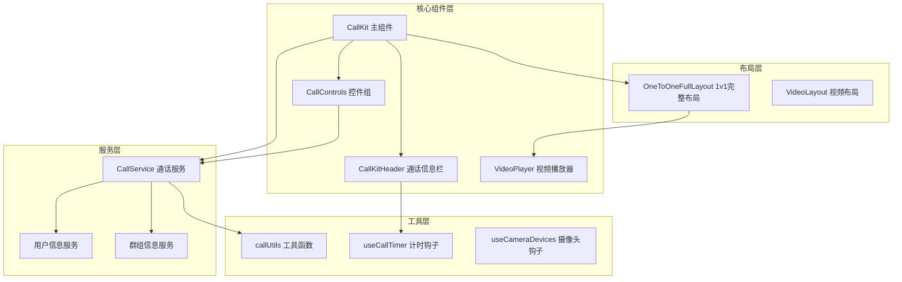
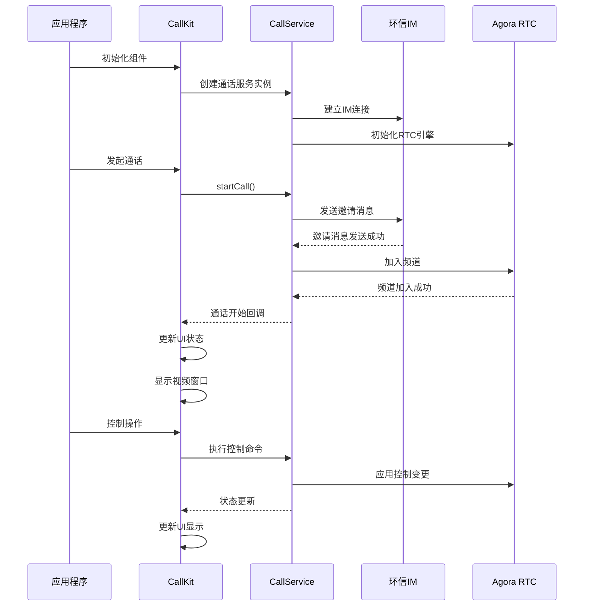
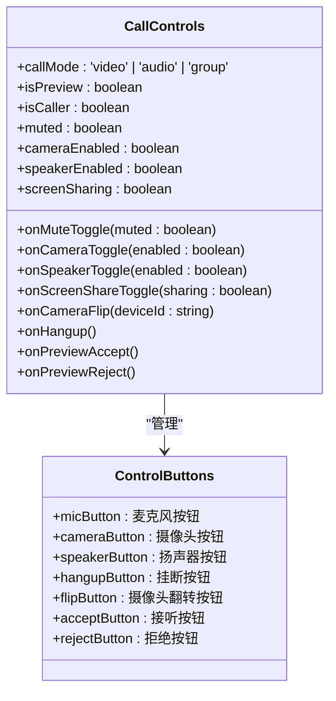
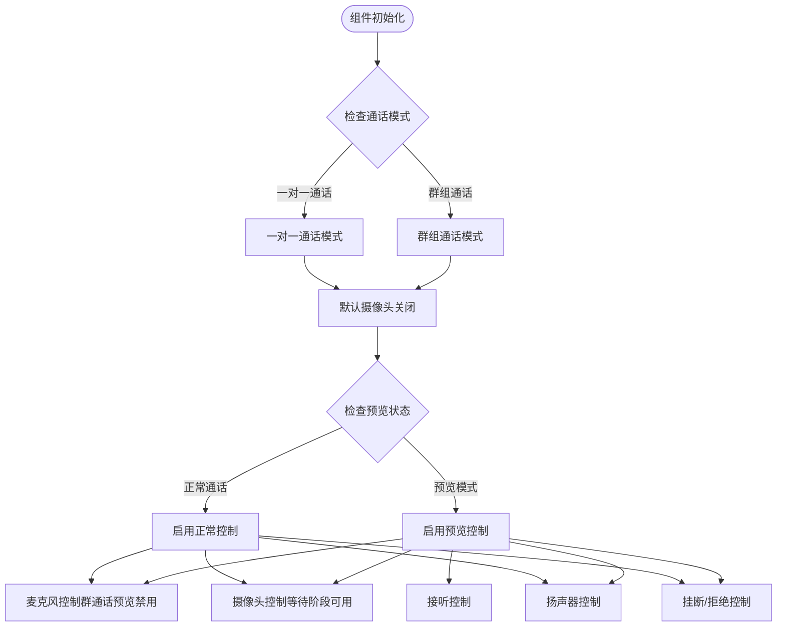
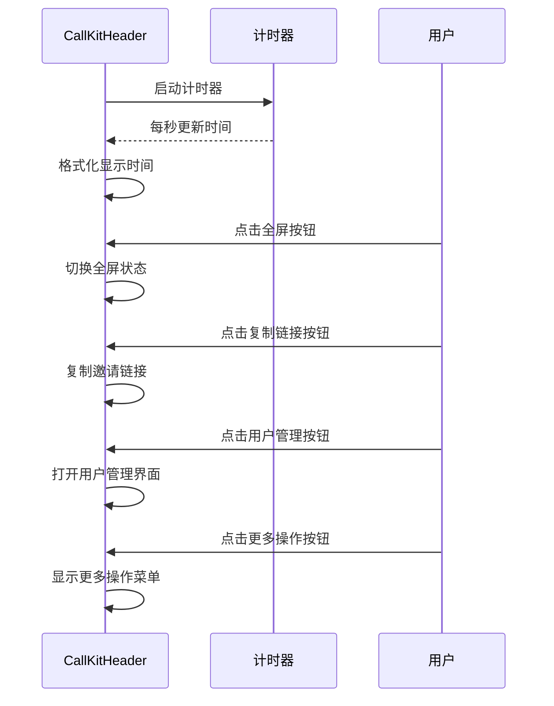
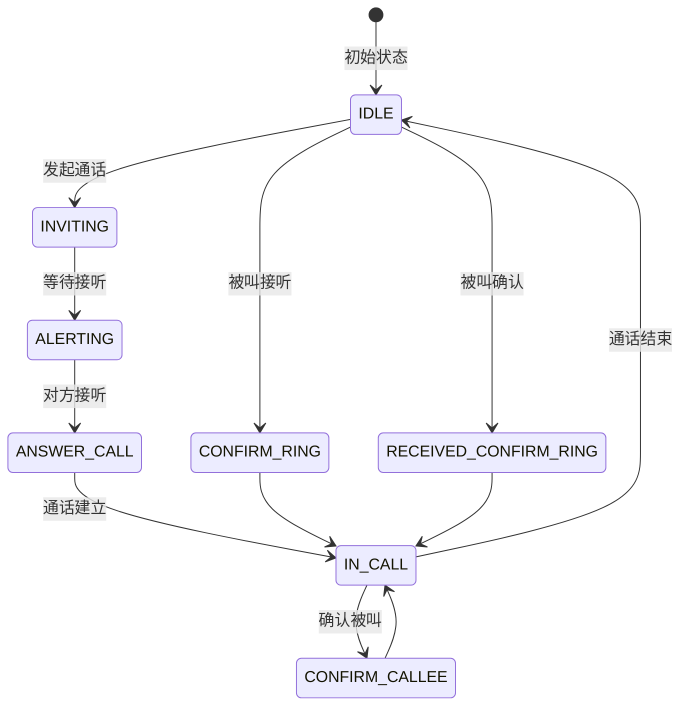
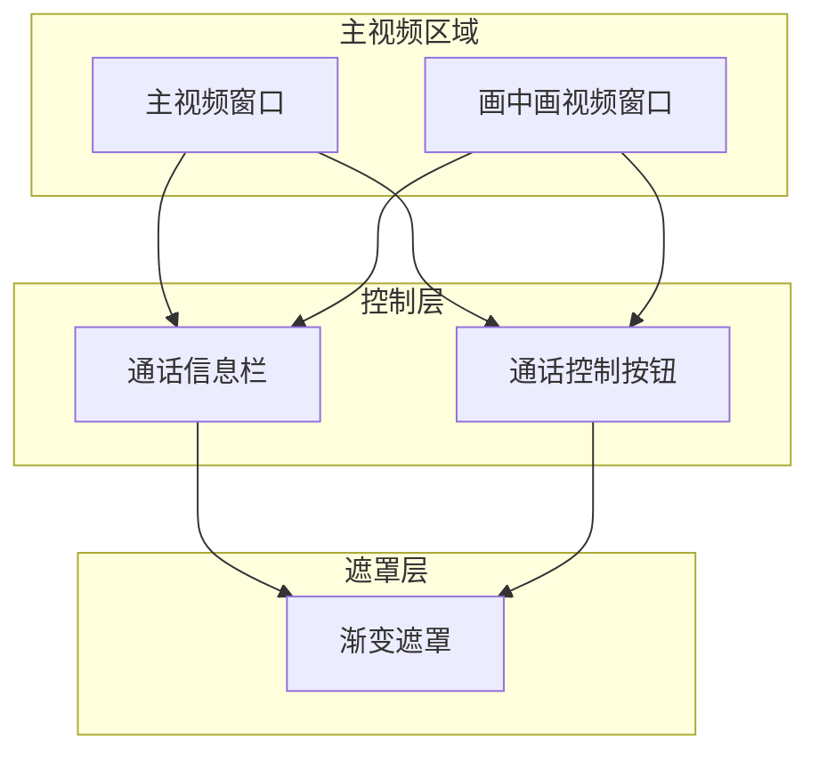
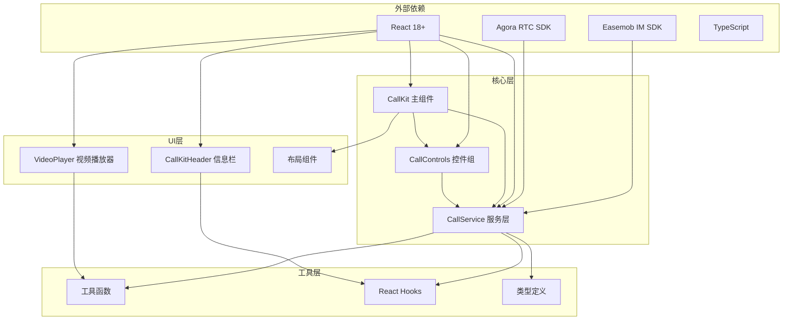

# 单人通话组件

<cite>
**本文档引用的文件**
- [CallKit.tsx](file://callkit/CallKit.tsx)
- [CallControls.tsx](file://callkit/components/CallControls.tsx)
- [CallKitHeader.tsx](file://callkit/components/CallKitHeader.tsx)
- [CallService.ts](file://callkit/services/CallService.ts)
- [useCallTimer.ts](file://callkit/hooks/useCallTimer.ts)
- [OneToOneFullLayout.tsx](file://callkit/layouts/OneToOneFullLayout.tsx)
- [VideoPlayer.tsx](file://callkit/components/VideoPlayer.tsx)
- [VideoLayout.tsx](file://callkit/VideoLayout.tsx)
- [index.ts](file://callkit/types/index.ts)
- [callUtils.ts](file://callkit/utils/callUtils.ts)
- [quickstart.md](file://callkit/docs/quickstart.md)
- [integration.md](file://callkit/docs/integration.md)
- [customization.md](file://callkit/docs/customization.md)
- [CallKit.stories.tsx](file://callkit/CallKit.stories.tsx)
</cite>

## 目录
1. [简介](#简介)
2. [项目结构](#项目结构)
3. [核心组件](#核心组件)
4. [架构概览](#架构概览)
5. [详细组件分析](#详细组件分析)
6. [依赖关系分析](#依赖关系分析)
7. [性能考量](#性能考量)
8. [故障排除指南](#故障排除指南)
9. [结论](#结论)
10. [附录](#附录)

## 简介

EasemobChatSingleCall 是一个基于环信即时通讯SDK和Agora实时音视频SDK构建的单人通话组件。该组件实现了完整的音视频通话功能，包括一对一视频通话、一对一语音通话以及群组通话。组件采用现代化的React Hooks架构，提供了丰富的自定义能力和良好的用户体验。

该组件的核心特性包括：
- 支持一对一视频通话和语音通话
- 完整的通话控制功能（静音、摄像头切换、扬声器控制、挂断）
- 实时通话信息显示（通话时长、连接状态、网络质量）
- 灵活的布局管理和响应式设计
- 丰富的自定义选项和插槽机制
- 完善的错误处理和状态管理

## 项目结构

该项目采用模块化的设计，主要分为以下几个核心部分：



**图表来源**
- [CallKit.tsx](file://callkit/CallKit.tsx#L1-L800)
- [CallControls.tsx](file://callkit/components/CallControls.tsx#L1-L800)
- [CallService.ts](file://callkit/services/CallService.ts#L1-L800)

**章节来源**
- [CallKit.tsx](file://callkit/CallKit.tsx#L1-L800)
- [CallControls.tsx](file://callkit/components/CallControls.tsx#L1-L800)
- [CallService.ts](file://callkit/services/CallService.ts#L1-L800)

## 核心组件

### CallKit 主组件

CallKit 是整个通话系统的主控制器，负责协调各个子组件的工作。它实现了完整的通话生命周期管理，包括通话邀请、建立连接、通话控制和结束通话等功能。

主要功能特性：
- **通话状态管理**：维护通话的完整生命周期状态
- **视频流管理**：处理本地和远程视频流的显示
- **用户交互**：提供统一的用户交互接口
- **事件回调**：暴露丰富的事件回调机制
- **配置管理**：支持灵活的组件配置选项

### CallControls 控件组

CallControls 提供了完整的通话控制功能，包括：
- **麦克风控制**：静音/取消静音切换
- **摄像头控制**：摄像头开启/关闭和前后摄像头切换
- **扬声器控制**：扬声器开启/关闭
- **挂断控制**：结束通话
- **预览控制**：通话邀请的接听/拒绝

### CallKitHeader 通话信息栏

CallKitHeader 负责显示通话相关的实时信息：
- **通话时长**：显示当前通话持续时间
- **连接状态**：显示网络连接状态
- **参与者信息**：显示通话参与者的相关信息
- **操作按钮**：提供全屏、最小化等操作

**章节来源**
- [CallKit.tsx](file://callkit/CallKit.tsx#L1-L800)
- [CallControls.tsx](file://callkit/components/CallControls.tsx#L1-L800)
- [CallKitHeader.tsx](file://callkit/components/CallKitHeader.tsx#L1-L179)

## 架构概览

该组件采用了分层架构设计，确保了良好的模块化和可维护性：



**图表来源**
- [CallKit.tsx](file://callkit/CallKit.tsx#L685-L758)
- [CallService.ts](file://callkit/services/CallService.ts#L345-L527)

**章节来源**
- [CallKit.tsx](file://callkit/CallKit.tsx#L685-L758)
- [CallService.ts](file://callkit/services/CallService.ts#L345-L527)

## 详细组件分析

### CallControls 控件组详解

CallControls 是单人通话组件中最核心的交互组件，提供了完整的通话控制功能：

#### 按钮功能说明



**图表来源**
- [CallControls.tsx](file://callkit/components/CallControls.tsx#L11-L63)

#### 预览模式与正常模式的区别

| 功能 | 预览模式 | 正常通话模式 |
|------|----------|-------------|
| 麦克风控制 | 可用（群通话预览禁用） | 可用 |
| 摄像头控制 | 可用（群通话等待阶段可用） | 可用 |
| 扬声器控制 | 可用 | 可用 |
| 挂断按钮 | 主叫方显示挂断，被叫方显示拒绝 | 显示挂断 |
| 接听按钮 | 被叫方显示接听 | 不显示 |
| 摄像头翻转 | 多于2个摄像头时可用 | 多于2个摄像头时可用 |

#### 状态管理机制

CallControls 采用了智能的状态管理机制：



**图表来源**
- [CallControls.tsx](file://callkit/components/CallControls.tsx#L132-L149)

**章节来源**
- [CallControls.tsx](file://callkit/components/CallControls.tsx#L1-L800)

### CallKitHeader 通话信息栏

CallKitHeader 提供了实时的通话信息显示功能：

#### 信息显示内容

| 信息类型 | 显示内容 | 更新频率 |
|----------|----------|----------|
| 通话时长 | HH:MM:SS 或 MM:SS 格式 | 每秒更新一次 |
| 参与者数量 | 当前通话中的参与者数量 | 实时更新 |
| 群组名称 | 群组名称或默认名称 | 初始化时设置 |
| 群组头像 | 群组头像或占位符 | 初始化时设置 |

#### 交互功能



**图表来源**
- [CallKitHeader.tsx](file://callkit/components/CallKitHeader.tsx#L52-L81)

**章节来源**
- [CallKitHeader.tsx](file://callkit/components/CallKitHeader.tsx#L1-L179)

### CallService 通话服务

CallService 是整个通话系统的核心服务层，负责处理复杂的通话逻辑：

#### 通话状态管理



**图表来源**
- [CallService.ts](file://callkit/services/CallService.ts#L14-L32)

#### 音视频轨道管理

CallService 负责管理音视频轨道的创建、销毁和状态同步：

| 轨道类型 | 管理职责 | 状态同步 |
|----------|----------|----------|
| 本地音频轨道 | 创建、销毁、静音控制 | 与CallControls同步 |
| 本地视频轨道 | 创建、销毁、摄像头控制 | 与CallControls同步 |
| 远程音频轨道 | 接收、播放、音量控制 | 与远端用户同步 |
| 远程视频轨道 | 接收、播放、显示控制 | 与远端用户同步 |

**章节来源**
- [CallService.ts](file://callkit/services/CallService.ts#L1-L800)

### 布局管理系统

组件提供了灵活的布局管理能力，支持多种布局模式：

#### OneToOneFullLayout 1v1完整布局

OneToOneFullLayout 实现了1v1通话的完整布局，包括主视频和画中画视频的智能切换：



**图表来源**
- [OneToOneFullLayout.tsx](file://callkit/layouts/OneToOneFullLayout.tsx#L246-L469)

**章节来源**
- [OneToOneFullLayout.tsx](file://callkit/layouts/OneToOneFullLayout.tsx#L1-L470)

## 依赖关系分析

组件之间的依赖关系体现了清晰的分层架构：



**图表来源**
- [CallKit.tsx](file://callkit/CallKit.tsx#L19-L40)
- [CallControls.tsx](file://callkit/components/CallControls.tsx#L1-L10)

**章节来源**
- [CallKit.tsx](file://callkit/CallKit.tsx#L19-L40)
- [CallControls.tsx](file://callkit/components/CallControls.tsx#L1-L10)

## 性能考量

组件在设计时充分考虑了性能优化：

### 视频渲染优化

- **React.memo 优化**：VideoPlayer 使用 React.memo 避免不必要的重新渲染
- **流对象缓存**：使用 arePropsEqual 函数比较避免频繁的流对象更新
- **镜像处理**：本地视频自动镜像处理，提升用户体验

### 状态管理优化

- **Hook 优化**：useCallTimer、useCameraDevices 等 Hook 提供高效的状态管理
- **防抖机制**：CallControls 实现了防抖机制，避免频繁的操作触发
- **内存管理**：及时清理视频元素和媒体流，防止内存泄漏

### 网络优化

- **网络质量监控**：实时监控网络质量并提供反馈
- **资源预加载**：提前加载必要的资源，减少等待时间
- **错误恢复**：完善的错误处理和自动重试机制

## 故障排除指南

### 常见问题及解决方案

#### 权限问题

| 问题类型 | 症状 | 解决方案 |
|----------|------|----------|
| 摄像头权限 | 无法看到本地视频 | 检查浏览器摄像头权限设置 |
| 麦克风权限 | 无法听到声音 | 检查浏览器麦克风权限设置 |
| 悬浮窗权限 | 无法显示通话窗口 | 允许浏览器显示悬浮窗 |

#### 连接问题

| 问题类型 | 症状 | 解决方案 |
|----------|------|----------|
| IM连接失败 | 无法发起通话 | 检查App Key和Token配置 |
| RTC连接失败 | 通话无法建立 | 检查网络连接和防火墙设置 |
| 邀请消息发送失败 | 对方无法收到邀请 | 检查IM SDK初始化状态 |

#### 性能问题

| 问题类型 | 症状 | 解决方案 |
|----------|------|----------|
| 视频卡顿 | 画面不流畅 | 降低视频分辨率或码率 |
| 延迟过高 | 通话有明显延迟 | 检查网络质量，使用有线连接 |
| CPU占用过高 | 设备发热严重 | 关闭不必要的应用程序 |

**章节来源**
- [quickstart.md](file://callkit/docs/quickstart.md#L611-L617)

## 结论

EasemobChatSingleCall 组件是一个功能完整、架构清晰的单人通话解决方案。它成功地整合了环信即时通讯和Agora实时音视频技术，提供了稳定可靠的音视频通话功能。

组件的主要优势包括：
- **完整的功能覆盖**：从通话邀请到结束通话的完整流程
- **优秀的用户体验**：直观的界面设计和流畅的交互体验
- **强大的扩展性**：丰富的配置选项和自定义能力
- **稳定的性能表现**：经过优化的代码结构和资源管理

对于开发者而言，该组件提供了清晰的API接口和完善的文档支持，能够快速集成到各种应用场景中。

## 附录

### 使用示例

#### 基本集成示例

```typescript
// 基本的CallKit集成
import { CallKit, Provider, rootStore } from "easemob-chat-uikit";

const App = () => {
  const callKitRef = useRef<CallKitRef>(null);
  
  return (
    <Provider initConfig={{ appKey: "your_app_key" }}>
      <CallKit
        ref={callKitRef}
        chatClient={rootStore.client}
        userInfoProvider={userInfoProvider}
        groupInfoProvider={groupInfoProvider}
      />
    </Provider>
  );
};
```

#### 发起一对一通话

```typescript
// 发起一对一视频通话
const startVideoCall = async () => {
  await callKitRef.current?.startSingleCall({
    to: "target_user_id",
    callType: "video",
    msg: "邀请你进行视频通话",
  });
};

// 发起一对一语音通话
const startAudioCall = async () => {
  await callKitRef.current?.startSingleCall({
    to: "target_user_id",
    callType: "audio",
    msg: "邀请你进行语音通话",
  });
};
```

### 配置选项

#### CallControls 配置

| 属性 | 类型 | 默认值 | 描述 |
|------|------|--------|------|
| callMode | 'video' \| 'audio' \| 'group' | 'video' | 通话模式 |
| isPreview | boolean | false | 是否为预览模式 |
| isCaller | boolean | false | 是否为主叫方 |
| muted | boolean | false | 是否静音 |
| cameraEnabled | boolean | true | 摄像头是否开启 |
| speakerEnabled | boolean | true | 扬声器是否开启 |
| screenSharing | boolean | false | 是否屏幕共享 |

#### CallKit 配置

| 属性 | 类型 | 默认值 | 描述 |
|------|------|--------|------|
| showControls | boolean | true | 是否显示控制按钮 |
| resizable | boolean | false | 是否可调整大小 |
| draggable | boolean | false | 是否可拖拽 |
| enableRingtone | boolean | true | 是否启用铃声 |
| autoRejectTime | number | 30 | 自动拒绝时间（秒） |
| speakingVolumeThreshold | number | 60 | 音量阈值 |

**章节来源**
- [integration.md](file://callkit/docs/integration.md#L274-L312)
- [customization.md](file://callkit/docs/customization.md#L1-L82)