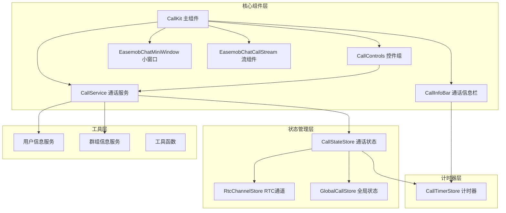
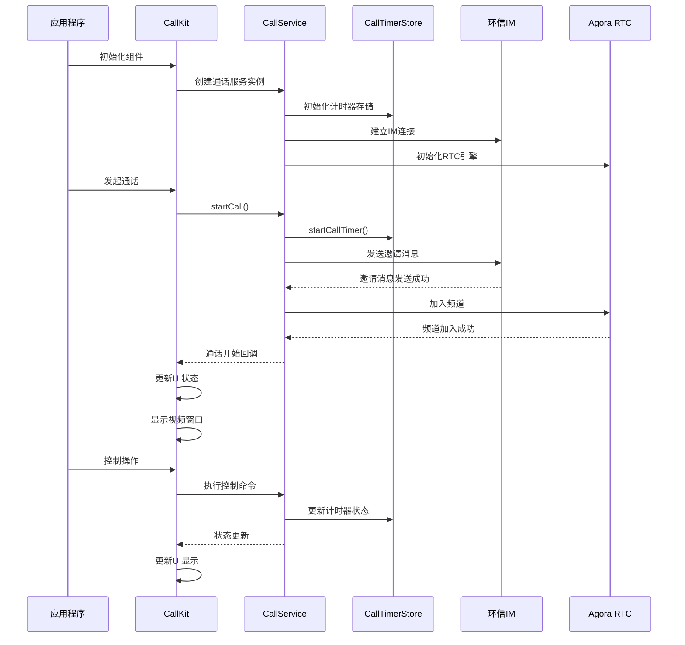
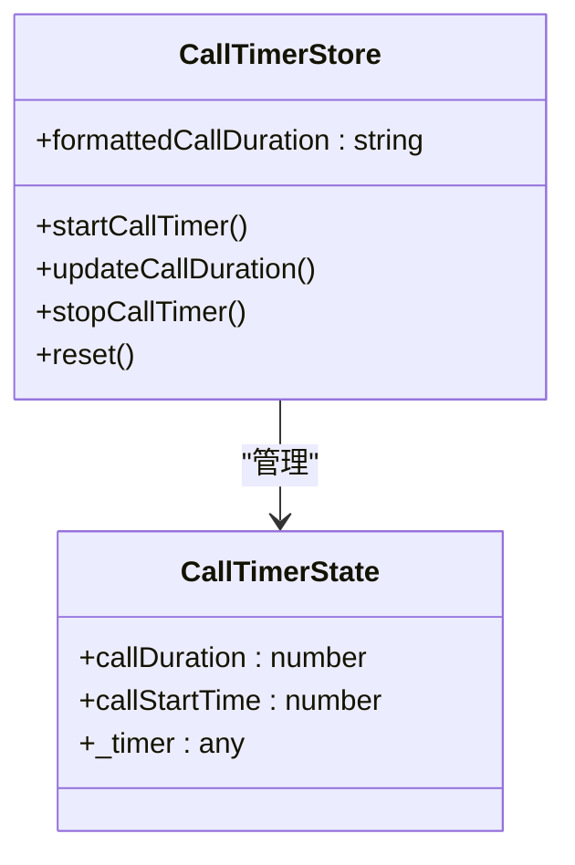
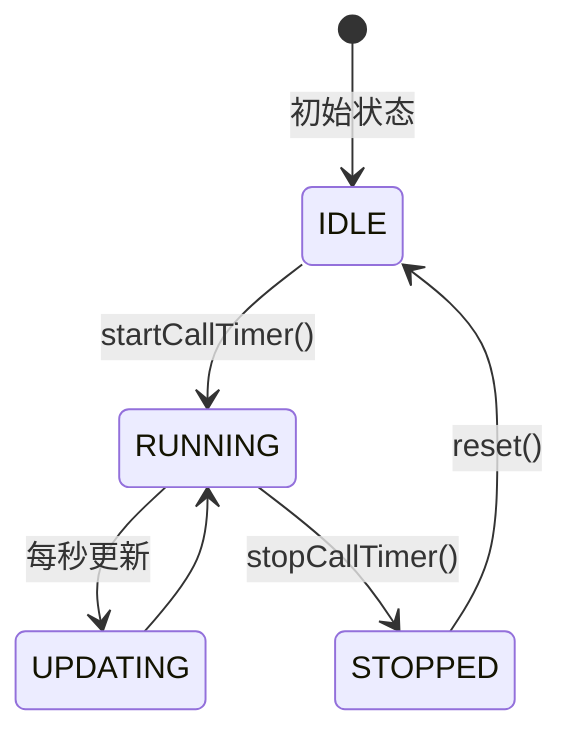
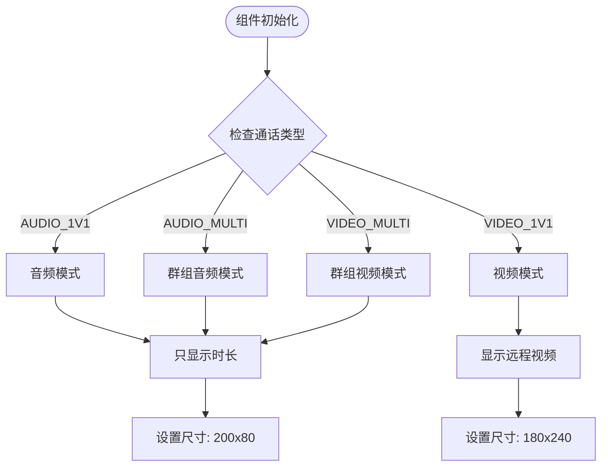
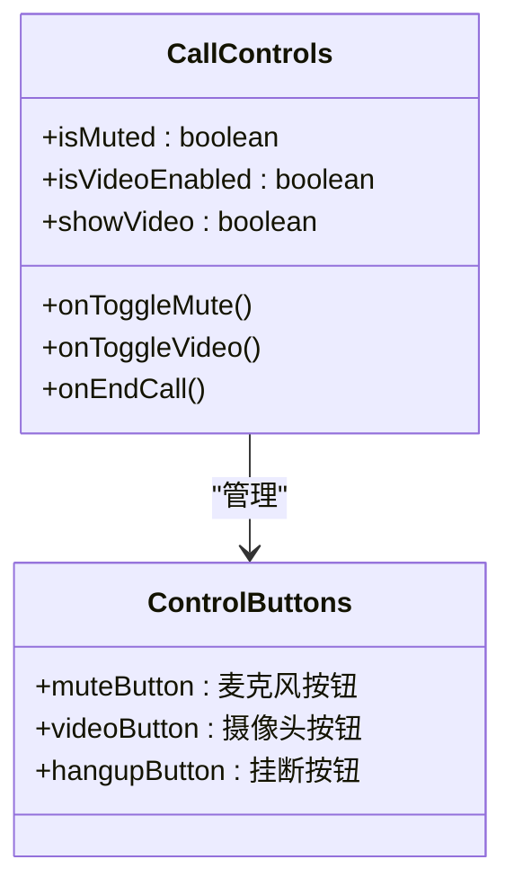
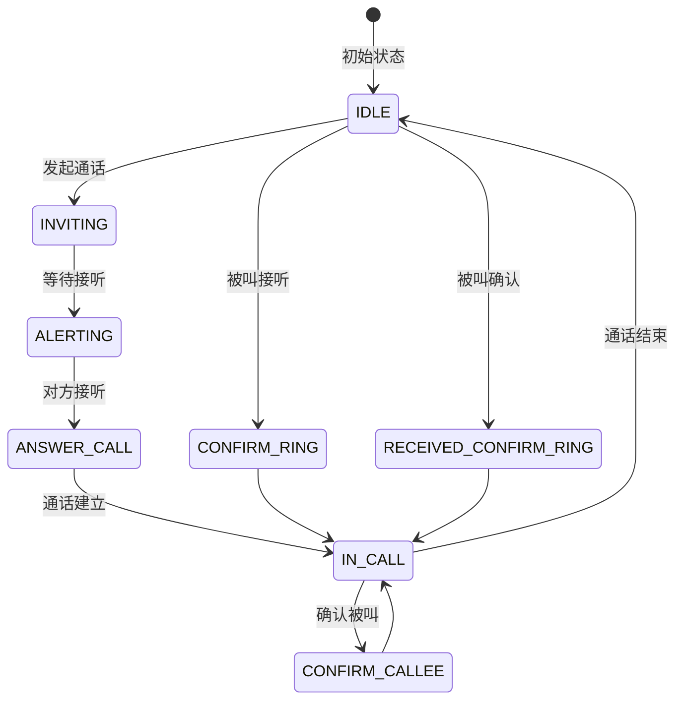
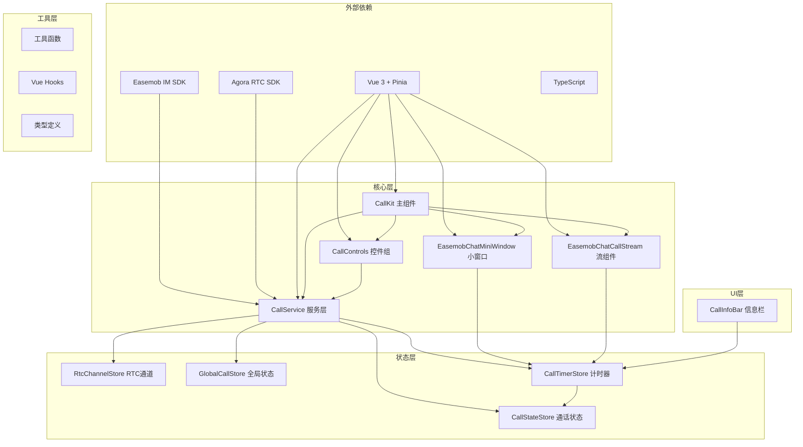

# 单人通话组件

<cite>
**本文档引用的文件**
- [EasemobChatMiniWindow.vue](file://lib/components/EasemobChatMiniWindow.vue)
- [EasemobChatCallStream.vue](file://lib/components/singleCall/EasemobChatCallStream.vue)
- [callTimer.ts](file://lib/store/callTimer.ts)
- [CallInfoBar.vue](file://lib/components/singleCall/CallInfoBar.vue)
- [CallControls.vue](file://lib/components/singleCall/CallControls.vue)
- [CallService.ts](file://lib/services/CallService.ts)
- [useCallTimer.ts](file://callkit/hooks/useCallTimer.ts)
</cite>

## 更新摘要
**所做更改**
- 更新了 CallTimerStore 的使用方式，从 React Hook 迁移到 Vue Pinia Store
- 新增了 EasemobChatMiniWindow.vue 中对 CallTimerStore 的集成
- 更新了 EasemobChatCallStream.vue 中的计时器显示逻辑
- 完善了单人通话组件的计时器状态管理

## 目录
1. [简介](#简介)
2. [项目结构](#项目结构)
3. [核心组件](#核心组件)
4. [架构概览](#架构概览)
5. [详细组件分析](#详细组件分析)
6. [依赖关系分析](#依赖关系分析)
7. [性能考量](#性能考量)
8. [故障排除指南](#故障排除指南)
9. [结论](#结论)
10. [附录](#附录)

## 简介

EasemobChatSingleCall 是一个基于环信即时通讯SDK和Agora实时音视频SDK构建的单人通话组件。该组件实现了完整的音视频通话功能，包括一对一视频通话、一对一语音通话以及群组通话。组件采用现代化的Vue 3 + Pinia架构，提供了丰富的自定义能力和良好的用户体验。

该组件的核心特性包括：
- 支持一对一视频通话和语音通话
- 完整的通话控制功能（静音、摄像头切换、扬声器控制、挂断）
- 实时通话信息显示（通话时长、连接状态、网络质量）
- 灵活的布局管理和响应式设计
- 丰富的自定义选项和插槽机制
- 完善的错误处理和状态管理

## 项目结构

该项目采用模块化的设计，主要分为以下几个核心部分：



**图表来源**
- [EasemobChatMiniWindow.vue:37-55](file://lib/components/EasemobChatMiniWindow.vue#L37-L55)
- [EasemobChatCallStream.vue:47-74](file://lib/components/singleCall/EasemobChatCallStream.vue#L47-L74)
- [callTimer.ts:15-20](file://lib/store/callTimer.ts#L15-L20)

**章节来源**
- [EasemobChatMiniWindow.vue:37-55](file://lib/components/EasemobChatMiniWindow.vue#L37-L55)
- [EasemobChatCallStream.vue:47-74](file://lib/components/singleCall/EasemobCallStream.vue#L47-L74)
- [callTimer.ts:15-20](file://lib/store/callTimer.ts#L15-L20)

## 核心组件

### CallKit 主组件

CallKit 是整个通话系统的主控制器，负责协调各个子组件的工作。它实现了完整的通话生命周期管理，包括通话邀请、建立连接、通话控制和结束通话等功能。

主要功能特性：
- **通话状态管理**：维护通话的完整生命周期状态
- **视频流管理**：处理本地和远程视频流的显示
- **用户交互**：提供统一的用户交互接口
- **事件回调**：暴露丰富的事件回调机制
- **配置管理**：支持灵活的组件配置选项

### CallControls 控件组

CallControls 提供了完整的通话控制功能，包括：
- **麦克风控制**：静音/取消静音切换
- **摄像头控制**：摄像头开启/关闭和前后摄像头切换
- **扬声器控制**：扬声器开启/关闭
- **挂断控制**：结束通话
- **预览控制**：通话邀请的接听/拒绝

### CallInfoBar 通话信息栏

CallInfoBar 负责显示通话相关的实时信息：
- **通话时长**：显示当前通话持续时间（格式化字符串）
- **连接状态**：显示网络连接状态
- **参与者信息**：显示通话参与者的相关信息

### EasemobChatMiniWindow 小窗口

EasemobChatMiniWindow 提供了悬浮的小窗口显示功能：
- **音频模式显示**：只显示通话时长和状态
- **视频模式显示**：显示远程视频流和通话时长
- **拖拽功能**：支持窗口拖拽和位置调整
- **自动展开**：点击小窗口自动展开到全屏

### EasemobChatCallStream 流组件

EasemobChatCallStream 是通话流的主要容器组件：
- **远程视频显示**：全屏显示远程视频流
- **本地视频显示**：悬浮显示本地视频流
- **通话信息栏**：显示通话时长和状态
- **控制按钮**：提供完整的通话控制功能

**章节来源**
- [EasemobChatMiniWindow.vue:1-380](file://lib/components/EasemobChatMiniWindow.vue#L1-L380)
- [EasemobChatCallStream.vue:1-344](file://lib/components/singleCall/EasemobChatCallStream.vue#L1-L344)
- [CallInfoBar.vue:1-19](file://lib/components/singleCall/CallInfoBar.vue#L1-L19)
- [CallControls.vue:1-64](file://lib/components/singleCall/CallControls.vue#L1-L64)

## 架构概览

该组件采用了分层架构设计，确保了良好的模块化和可维护性：



**图表来源**
- [EasemobChatCallStream.vue:83-84](file://lib/components/singleCall/EasemobChatCallStream.vue#L83-L84)
- [callTimer.ts:42-52](file://lib/store/callTimer.ts#L42-L52)

**章节来源**
- [EasemobChatCallStream.vue:83-84](file://lib/components/singleCall/EasemobChatCallStream.vue#L83-L84)
- [callTimer.ts:42-52](file://lib/store/callTimer.ts#L42-L52)

## 详细组件分析

### CallTimerStore 计时器状态管理

**新增** CallTimerStore 是基于 Pinia 的计时器状态管理，专门用于一对一通话的时长计算：

#### 状态结构



**图表来源**
- [callTimer.ts:4-8](file://lib/store/callTimer.ts#L4-L8)
- [callTimer.ts:15-20](file://lib/store/callTimer.ts#L15-L20)

#### 格式化时长计算

计时器提供了智能的时长格式化功能：
- **小时格式**：当通话时长超过1小时时，显示 `HH:MM:SS` 格式
- **分钟格式**：当通话时长小于1小时时，显示 `MM:SS` 格式
- **自动补零**：确保时间显示的数字格式一致

#### 计时器生命周期



**图表来源**
- [callTimer.ts:42-52](file://lib/store/callTimer.ts#L42-L52)
- [callTimer.ts:66-74](file://lib/store/callTimer.ts#L66-L74)

**章节来源**
- [callTimer.ts:1-84](file://lib/store/callTimer.ts#L1-L84)

### EasemobChatMiniWindow 小窗口组件

EasemobChatMiniWindow 实现了智能的小窗口显示功能：

#### 模式切换逻辑



**图表来源**
- [EasemobChatMiniWindow.vue:73-85](file://lib/components/EasemobChatMiniWindow.vue#L73-L85)

#### 远程视频播放机制

小窗口组件实现了智能的远程视频播放逻辑：
- **延迟播放**：确保DOM渲染完成后再尝试播放视频
- **重试机制**：最多重试5次，间隔1秒
- **事件监听**：监听用户发布/取消发布的事件
- **资源清理**：组件销毁时自动清理视频轨道

**章节来源**
- [EasemobChatMiniWindow.vue:120-186](file://lib/components/EasemobChatMiniWindow.vue#L120-L186)

### EasemobChatCallStream 流组件

EasemobChatCallStream 是通话流的主要容器组件：

#### 通话时长显示

组件通过 CallTimerStore 获取格式化的时长字符串：
- **实时更新**：每秒自动更新显示的时长
- **格式化处理**：自动处理小时和分钟的显示格式
- **响应式绑定**：使用 computed 属性确保数据同步

#### 远程视频播放

实现了完整的远程视频播放逻辑：
- **轨道检测**：自动检测远程视频轨道是否存在
- **兜底订阅**：如果轨道不存在，自动尝试订阅
- **重试机制**：最多重试5次，间隔500毫秒
- **事件驱动**：监听用户发布事件自动播放

**章节来源**
- [EasemobChatCallStream.vue:83-84](file://lib/components/singleCall/EasemobChatCallStream.vue#L83-L84)
- [EasemobChatCallStream.vue:155-212](file://lib/components/singleCall/EasemobChatCallStream.vue#L155-L212)

### CallControls 控件组详解

CallControls 提供了完整的通话控制功能：

#### 按钮功能说明



**图表来源**
- [CallControls.vue:44-60](file://lib/components/singleCall/CallControls.vue#L44-L60)

#### 状态管理机制

控件组采用了智能的状态管理：
- **静音状态**：根据 isMuted 属性动态切换图标和标签
- **摄像头状态**：根据 isVideoEnabled 属性控制按钮显示
- **条件渲染**：showVideo 属性控制摄像头按钮的显示

**章节来源**
- [CallControls.vue:1-64](file://lib/components/singleCall/CallControls.vue#L1-L64)

### CallInfoBar 通话信息栏

CallInfoBar 提供了简洁的通话信息显示：

#### 信息显示内容

| 信息类型 | 显示内容 | 更新频率 |
|----------|----------|----------|
| 通话时长 | 格式化的时间字符串（如 05:30 或 01:20:15） | 每秒更新一次 |
| 连接状态 | 实心圆点表示连接状态 | 实时更新 |

#### 响应式设计

信息栏采用了简洁的响应式设计：
- **紧凑布局**：适合在通话界面顶部显示
- **状态指示**：使用圆点表示连接状态
- **时间显示**：使用等宽字体确保时间对齐

**章节来源**
- [CallInfoBar.vue:1-19](file://lib/components/singleCall/CallInfoBar.vue#L1-L19)

### CallService 通话服务

CallService 是整个通话系统的核心服务层，负责处理复杂的通话逻辑：

#### 通话状态管理



**图表来源**
- [CallService.ts:10-32](file://lib/services/CallService.ts#L10-L32)

#### 计时器集成

CallService 与 CallTimerStore 的集成：
- **计时器启动**：在通话建立时启动计时器
- **计时器停止**：在通话结束时停止计时器
- **状态同步**：确保计时器状态与通话状态同步

**章节来源**
- [CallService.ts:1-360](file://lib/services/CallService.ts#L1-L360)

## 依赖关系分析

组件之间的依赖关系体现了清晰的分层架构：



**图表来源**
- [EasemobChatMiniWindow.vue:37-55](file://lib/components/EasemobChatMiniWindow.vue#L37-L55)
- [EasemobChatCallStream.vue:47-74](file://lib/components/singleCall/EasemobChatCallStream.vue#L47-L74)

**章节来源**
- [EasemobChatMiniWindow.vue:37-55](file://lib/components/EasemobChatMiniWindow.vue#L37-L55)
- [EasemobChatCallStream.vue:47-74](file://lib/components/singleCall/EasemobChatCallStream.vue#L47-L74)

## 性能考量

组件在设计时充分考虑了性能优化：

### 状态管理优化

- **Pinia Store**：使用 Pinia 替代 React Hook，提供更好的响应式性能
- **状态分离**：将计时器状态独立管理，避免不必要的组件重渲染
- **computed 缓存**：使用 computed 属性缓存格式化后的时长字符串

### 视频渲染优化

- **条件渲染**：根据通话类型动态渲染不同的UI组件
- **懒加载**：远程视频采用延迟播放和重试机制
- **资源清理**：组件销毁时自动清理视频轨道和定时器

### 网络优化

- **事件驱动**：通过RTC事件自动处理视频流的播放和停止
- **错误处理**：完善的重试机制和错误日志记录
- **内存管理**：及时清理DOM引用和事件监听器

## 故障排除指南

### 常见问题及解决方案

#### 计时器相关问题

| 问题类型 | 症状 | 解决方案 |
|----------|------|----------|
| 计时器不更新 | 通话时长保持不变 | 检查 CallTimerStore 的 startCallTimer 是否正确调用 |
| 计时器重复启动 | 时长显示异常增长 | 确保每次通话开始前调用 reset 方法 |
| 计时器内存泄漏 | 页面刷新后时长仍然存在 | 检查组件卸载时是否正确清理定时器 |

#### 视频播放问题

| 问题类型 | 症状 | 解决方案 |
|----------|------|----------|
| 远程视频不显示 | 小窗口只显示占位符 | 检查 Agora SDK 初始化和频道加入状态 |
| 视频播放失败 | 控制台报错 | 确认远程用户轨道存在且可播放 |
| 视频闪烁 | 画面不稳定 | 检查网络连接质量和带宽限制 |

#### 小窗口显示问题

| 问题类型 | 症状 | 解决方案 |
|----------|------|----------|
| 小窗口不显示 | 悬浮窗不可见 | 检查全局状态中的 isMinimized 标志 |
| 拖拽失效 | 窗口无法移动 | 确认拖拽 Hook 的初始化和事件绑定 |
| 点击无效 | 点击无法展开 | 检查 hasDragged 状态和事件处理逻辑 |

**章节来源**
- [EasemobChatMiniWindow.vue:174-185](file://lib/components/EasemobChatMiniWindow.vue#L174-L185)
- [EasemobChatCallStream.vue:200-211](file://lib/components/singleCall/EasemobChatCallStream.vue#L200-L211)

## 结论

EasemobChatSingleCall 组件是一个功能完整、架构清晰的单人通话解决方案。通过引入 CallTimerStore 和优化组件结构，组件在性能和用户体验方面都有了显著提升。

组件的主要优势包括：
- **统一的计时器管理**：通过 CallTimerStore 提供一致的时长计算逻辑
- **智能的组件切换**：根据通话类型自动切换显示模式
- **完善的错误处理**：多重重试机制确保视频播放的稳定性
- **优秀的性能表现**：优化的状态管理和资源清理机制

对于开发者而言，该组件提供了清晰的API接口和完善的文档支持，能够快速集成到各种应用场景中。

## 附录

### 使用示例

#### 基本集成示例

```typescript
// 基本的CallKit集成
import { CallKit, Provider, rootStore } from "easemob-chat-uikit";

const App = () => {
  const callKitRef = useRef<CallKitRef>(null);
  
  return (
    <Provider initConfig={{ appKey: "your_app_key" }}>
      <CallKit
        ref={callKitRef}
        chatClient={rootStore.client}
        userInfoProvider={userInfoProvider}
        groupInfoProvider={groupInfoProvider}
      />
    </Provider>
  );
};
```

#### 发起一对一通话

```typescript
// 发起一对一视频通话
const startVideoCall = async () => {
  await callKitRef.current?.startSingleCall({
    to: "target_user_id",
    callType: "video",
    msg: "邀请你进行视频通话",
  });
};

// 发起一对一语音通话
const startAudioCall = async () => {
  await callKitRef.current?.startSingleCall({
    to: "target_user_id",
    callType: "audio",
    msg: "邀请你进行语音通话",
  });
};
```

### 配置选项

#### CallControls 配置

| 属性 | 类型 | 默认值 | 描述 |
|------|------|--------|------|
| isMuted | boolean | false | 是否静音状态 |
| isVideoEnabled | boolean | true | 摄像头是否开启 |
| showVideo | boolean | true | 是否显示摄像头按钮 |

#### CallTimerStore 配置

| 方法 | 参数 | 返回值 | 描述 |
|------|------|--------|------|
| startCallTimer | 无 | void | 启动通话计时器 |
| stopCallTimer | 无 | void | 停止通话计时器 |
| reset | 无 | void | 重置计时器状态 |
| formattedCallDuration | 无 | string | 获取格式化的时间字符串 |

**章节来源**
- [CallControls.vue:44-60](file://lib/components/singleCall/CallControls.vue#L44-L60)
- [callTimer.ts:38-82](file://lib/store/callTimer.ts#L38-L82)