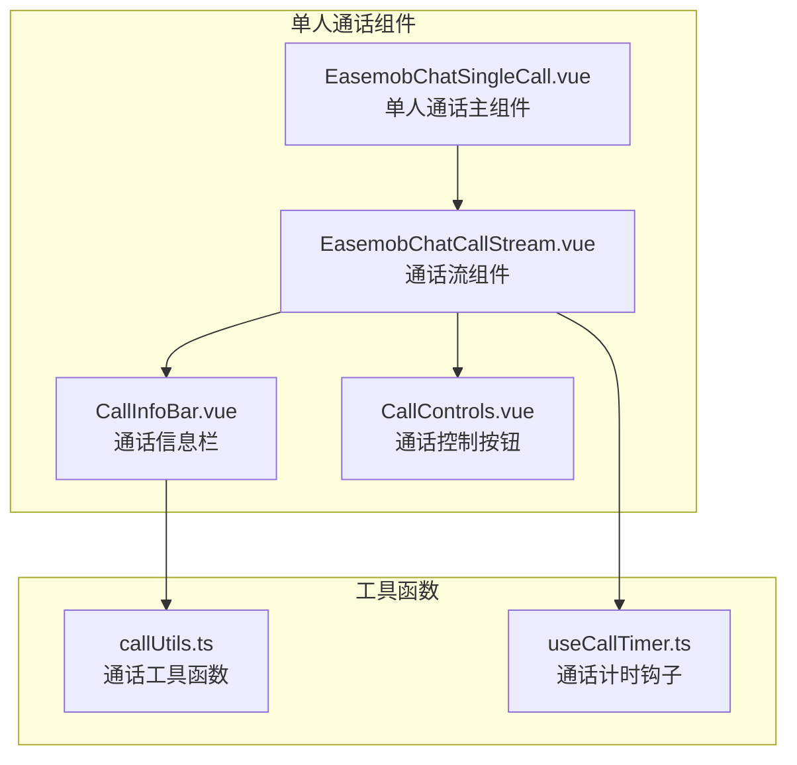
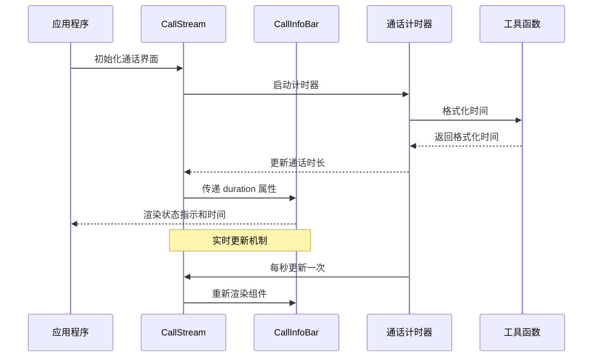
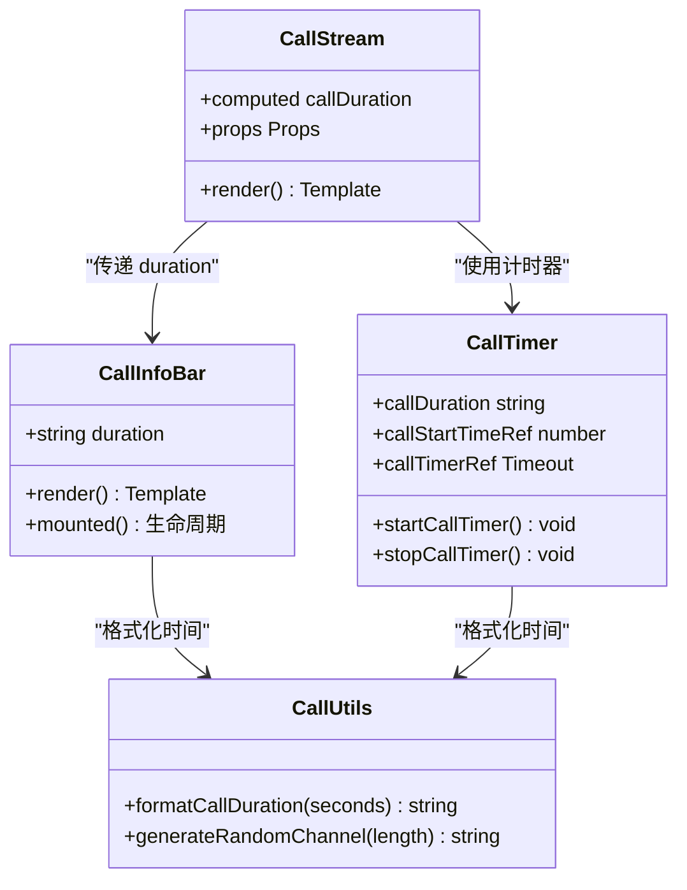
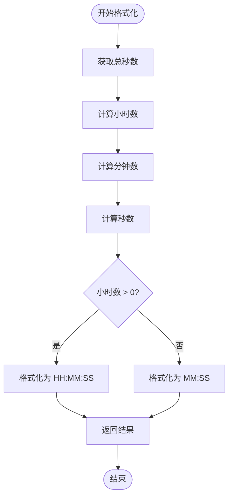
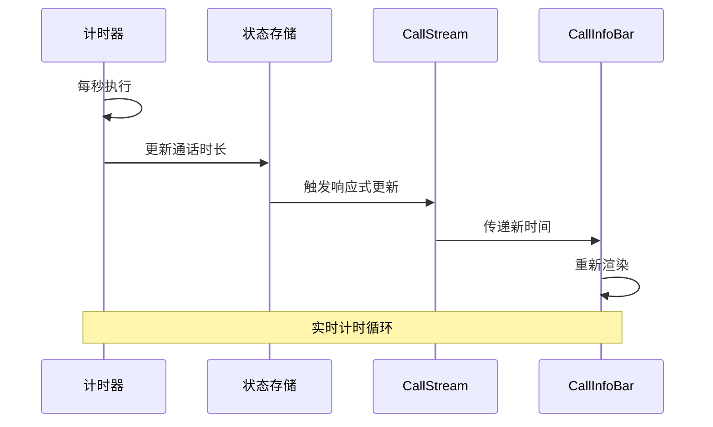
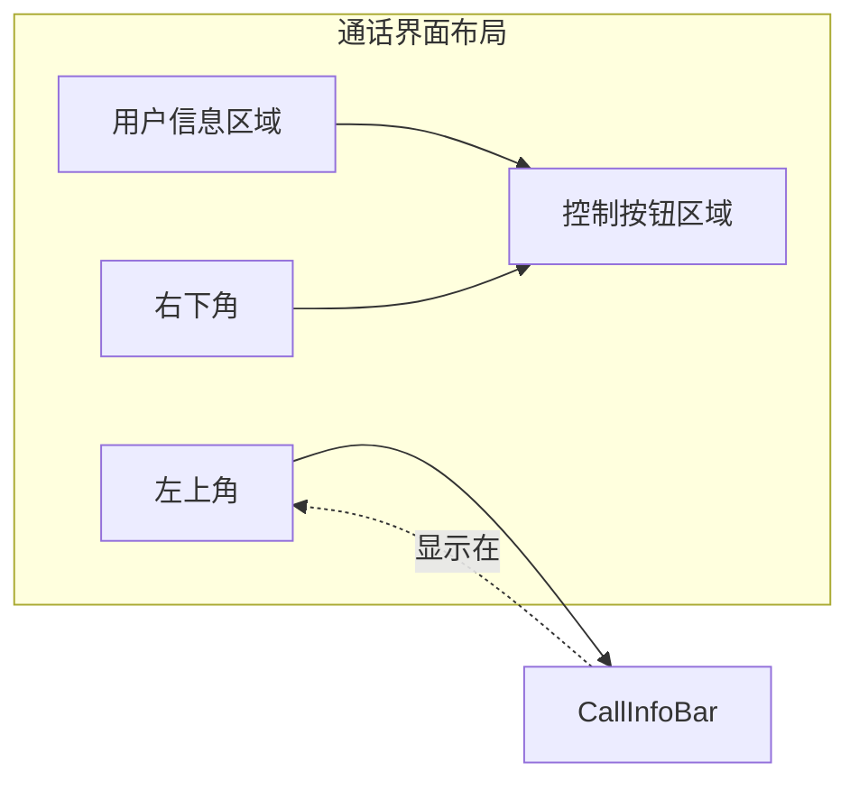
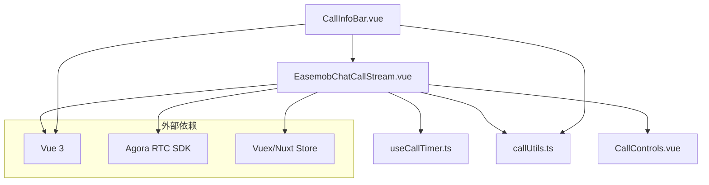
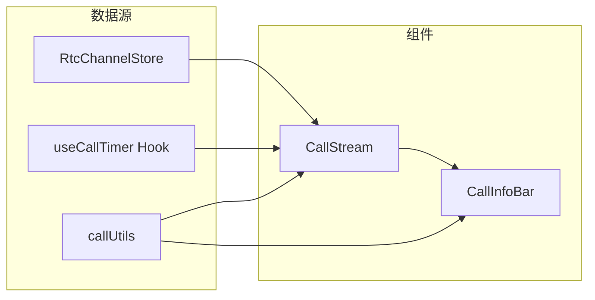

# 通话信息栏 CallInfoBar

<cite>
**本文档引用的文件**
- [CallInfoBar.vue](file://lib/components/singleCall/CallInfoBar.vue)
- [CallInfoBar.css](file://lib/components/singleCall/styles/CallInfoBar.css)
- [EasemobChatCallStream.vue](file://lib/components/singleCall/EasemobChatCallStream.vue)
- [useCallTimer.ts](file://callkit/hooks/useCallTimer.ts)
- [callUtils.ts](file://lib/utils/callUtils.ts)
- [EasemobChatSingleCall.vue](file://lib/components/singleCall/EasemobChatSingleCall.vue)
- [CallControls.vue](file://lib/components/singleCall/CallControls.vue)
</cite>

## 目录
1. [简介](#简介)
2. [项目结构](#项目结构)
3. [核心组件](#核心组件)
4. [架构概览](#架构概览)
5. [详细组件分析](#详细组件分析)
6. [依赖关系分析](#依赖关系分析)
7. [性能考虑](#性能考虑)
8. [故障排除指南](#故障排除指南)
9. [结论](#结论)
10. [附录](#附录)

## 简介

通话信息栏 CallInfoBar 是一个专门用于显示通话状态信息的 Vue 3 组件，主要负责展示通话时长和连接状态指示器。该组件采用简洁的设计理念，通过状态点和时间显示来直观地传达通话的实时状态。

## 项目结构

CallInfoBar 组件位于单人通话功能模块中，与 CallStream 组件协同工作，为用户提供完整的通话界面体验。



**图表来源**
- [CallInfoBar.vue](file://lib/components/singleCall/CallInfoBar.vue#L1-L19)
- [EasemobChatCallStream.vue](file://lib/components/singleCall/EasemobChatCallStream.vue#L1-L322)
- [useCallTimer.ts](file://callkit/hooks/useCallTimer.ts#L1-L49)

**章节来源**
- [CallInfoBar.vue](file://lib/components/singleCall/CallInfoBar.vue#L1-L19)
- [EasemobChatCallStream.vue](file://lib/components/singleCall/EasemobChatCallStream.vue#L1-L322)

## 核心组件

### CallInfoBar 组件

CallInfoBar 是一个轻量级的 Vue 3 组件，仅包含两个核心元素：

1. **状态指示器**：绿色脉冲圆点，表示通话正在进行中
2. **通话时长显示**：格式化的 HH:MM:SS 或 MM:SS 时间显示

组件采用 TypeScript 接口定义，确保类型安全性和开发体验。

**章节来源**
- [CallInfoBar.vue](file://lib/components/singleCall/CallInfoBar.vue#L10-L16)

## 架构概览

CallInfoBar 在整个通话系统中的位置和交互关系如下：



**图表来源**
- [EasemobChatCallStream.vue](file://lib/components/singleCall/EasemobChatCallStream.vue#L74-L75)
- [useCallTimer.ts](file://callkit/hooks/useCallTimer.ts#L18-L24)
- [callUtils.ts](file://lib/utils/callUtils.ts#L24-L37)

## 详细组件分析

### 组件结构分析



**图表来源**
- [CallInfoBar.vue](file://lib/components/singleCall/CallInfoBar.vue#L10-L16)
- [EasemobChatCallStream.vue](file://lib/components/singleCall/EasemobChatCallStream.vue#L74-L75)
- [useCallTimer.ts](file://callkit/hooks/useCallTimer.ts#L4-L49)
- [callUtils.ts](file://lib/utils/callUtils.ts#L24-L37)

### 通话时长显示机制

#### 时间格式化算法

通话时长的格式化遵循以下规则：



**图表来源**
- [callUtils.ts](file://lib/utils/callUtils.ts#L24-L37)

#### 实时更新机制



**图表来源**
- [useCallTimer.ts](file://callkit/hooks/useCallTimer.ts#L18-L24)
- [EasemobChatCallStream.vue](file://lib/components/singleCall/EasemobChatCallStream.vue#L74-L75)

### 连接状态指示器

#### 状态点设计

CallInfoBar 使用一个绿色脉冲圆点作为连接状态指示器：

- **颜色**：#4ade80（明亮绿色）
- **尺寸**：8px × 8px
- **动画效果**：2秒周期的脉冲动画
- **定位**：与时间文本垂直居中对齐

#### 动画实现

```mermaid
stateDiagram-v2
[*] --> 明亮状态
明亮状态 --> 暗淡状态 : 1秒后
暗淡状态 --> 明亮状态 : 1秒后
note right of 明亮状态 : 透明度 : 1.0
note right of 暗淡状态 : 透明度 : 0.3
```

**图表来源**
- [CallInfoBar.css](file://lib/components/singleCall/styles/CallInfoBar.css#L19-L30)

### 用户信息展示区域

虽然 CallInfoBar 本身不直接显示用户信息，但其在整体通话界面中的位置和作用：



**图表来源**
- [CallInfoBar.css](file://lib/components/singleCall/styles/CallInfoBar.css#L2-L7)

### 设备状态指示

CallInfoBar 专注于显示通话状态，具体的设备状态（麦克风、摄像头）通过其他组件显示：

- **麦克风状态**：通过 CallControls 中的静音按钮状态显示
- **摄像头状态**：通过 CallControls 中的摄像头按钮状态显示
- **网络质量**：通过 CallStream 的占位符和重试机制间接反映

**章节来源**
- [CallControls.vue](file://lib/components/singleCall/CallControls.vue#L4-L17)
- [EasemobChatCallStream.vue](file://lib/components/singleCall/EasemobChatCallStream.vue#L18-L25)

### 布局设计和信息排列规则

#### 绝对定位系统

CallInfoBar 采用绝对定位策略：

- **位置**：距离容器顶部 24px，左侧 24px
- **响应式调整**：在 768px 以下屏幕下调至 16px
- **层级**：z-index: 10，确保覆盖在视频内容之上

#### 内容排列

- **方向**：水平排列（flex-direction: row）
- **对齐**：垂直居中（align-items: center）
- **间距**：8px 的间隙（gap: 8px）
- **内边距**：10px × 16px 的圆角背景

**章节来源**
- [CallInfoBar.css](file://lib/components/singleCall/styles/CallInfoBar.css#L2-L17)

### 样式定制选项和主题适配

#### 主题变量

组件支持以下主题定制：

```css
/* 背景透明度和模糊效果 */
background: rgba(0, 0, 0, 0.4); /* 可调整透明度 */
backdrop-filter: blur(10px);   /* 可调整模糊程度 */

/* 圆角大小 */
border-radius: 20px;           /* 可调整圆角半径 */

/* 状态点样式 */
.status-dot {
    width: 8px;
    height: 8px;
    background: #4ade80;       /* 可修改颜色 */
    border-radius: 50%;        /* 圆形不变 */
}

/* 文本样式 */
.call-duration {
    font-size: 14px;           /* 可调整字体大小 */
    font-weight: 600;          /* 可调整字重 */
    color: white;              /* 可修改颜色 */
    font-variant-numeric: tabular-nums; /* 数字等宽显示 */
}
```

#### 响应式适配

```css
@media (max-width: 768px) {
    .call-info-bar {
        top: 16px;    /* 减少上边距 */
        left: 16px;   /* 减少左边距 */
    }
}
```

**章节来源**
- [CallInfoBar.css](file://lib/components/singleCall/styles/CallInfoBar.css#L1-L46)

## 依赖关系分析

### 组件间依赖



**图表来源**
- [CallInfoBar.vue](file://lib/components/singleCall/CallInfoBar.vue#L49-L50)
- [EasemobChatCallStream.vue](file://lib/components/singleCall/EasemobChatCallStream.vue#L42-L50)
- [useCallTimer.ts](file://callkit/hooks/useCallTimer.ts#L1-L2)

### 数据流依赖



**图表来源**
- [EasemobChatCallStream.vue](file://lib/components/singleCall/EasemobChatCallStream.vue#L63-L75)
- [useCallTimer.ts](file://callkit/hooks/useCallTimer.ts#L4-L49)

**章节来源**
- [EasemobChatCallStream.vue](file://lib/components/singleCall/EasemobChatCallStream.vue#L42-L50)
- [useCallTimer.ts](file://callkit/hooks/useCallTimer.ts#L1-L49)

## 性能考虑

### 渲染优化

1. **响应式更新**：使用 Vue 3 的响应式系统，仅在状态变化时重新渲染
2. **最小化 DOM 操作**：组件结构简单，DOM 层级浅
3. **内存管理**：计时器在组件卸载时自动清理

### 性能监控建议

- **渲染频率**：每秒更新一次，性能开销极小
- **内存泄漏防护**：确保计时器正确清理
- **样式重绘**：使用 transform 和 opacity 动画，避免强制同步布局

## 故障排除指南

### 常见问题及解决方案

#### 通话时长不更新

**症状**：时间显示固定不变

**可能原因**：
1. 计时器未启动
2. 状态存储未更新
3. 组件未接收到新属性

**解决步骤**：
1. 检查 CallStream 中的计时器启动逻辑
2. 验证 RtcChannelStore 的 formattedCallDuration 计算属性
3. 确认 CallInfoBar 的 duration 属性绑定

#### 状态点不闪烁

**症状**：绿色圆点保持常亮

**可能原因**：
1. CSS 动画未加载
2. 浏览器不支持动画
3. 样式被覆盖

**解决步骤**：
1. 检查 CallInfoBar.css 文件是否正确引入
2. 验证浏览器兼容性
3. 检查是否有其他样式覆盖

#### 位置显示异常

**症状**：组件位置不正确

**可能原因**：
1. 容器定位不正确
2. CSS 未正确加载
3. 响应式断点问题

**解决步骤**：
1. 确认父容器具有相对定位
2. 检查 CSS 文件路径
3. 验证媒体查询条件

**章节来源**
- [CallInfoBar.vue](file://lib/components/singleCall/CallInfoBar.vue#L1-L19)
- [CallInfoBar.css](file://lib/components/singleCall/styles/CallInfoBar.css#L1-L46)

## 结论

CallInfoBar 作为一个专门的通话状态显示组件，虽然功能相对简单，但在整个通话系统中发挥着重要作用。其设计体现了现代前端组件开发的最佳实践：

1. **单一职责原则**：专注于通话状态显示
2. **响应式设计**：支持多种屏幕尺寸
3. **性能优化**：最小化渲染开销
4. **可维护性**：清晰的代码结构和类型定义

通过与其他组件的协作，CallInfoBar 为用户提供了直观、实时的通话状态反馈，是构建高质量通话体验的重要组成部分。

## 附录

### 使用示例

#### 基本使用

```vue
<!-- 在通话界面中使用 -->
<template>
  <EasemobChatCallStream>
    <CallInfoBar :duration="callDuration" />
  </EasemobChatCallStream>
</template>
```

#### 自定义样式

```css
/* 覆盖默认样式 */
.custom-info-bar {
  top: 30px !important;
  left: 30px !important;
}

.custom-info-bar .call-duration {
  color: #ffffff;
  font-size: 16px;
}
```

### 集成指南

1. **安装依赖**：确保已安装 Vue 3 和相关依赖
2. **导入组件**：从 `lib/components/singleCall/` 导入 CallInfoBar
3. **配置样式**：确保 CSS 文件正确加载
4. **传递属性**：向组件传递格式化后的通话时长
5. **响应式更新**：在状态变化时及时更新 duration 属性

### 扩展建议

1. **添加更多状态指示**：可以考虑添加网络质量图标
2. **增强动画效果**：增加更丰富的视觉反馈
3. **国际化支持**：支持多语言时间格式
4. **无障碍访问**：添加适当的 ARIA 标签