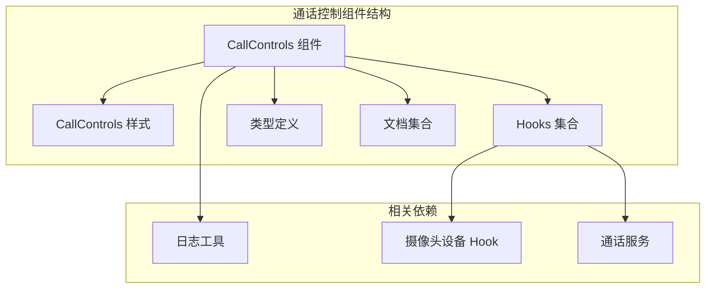
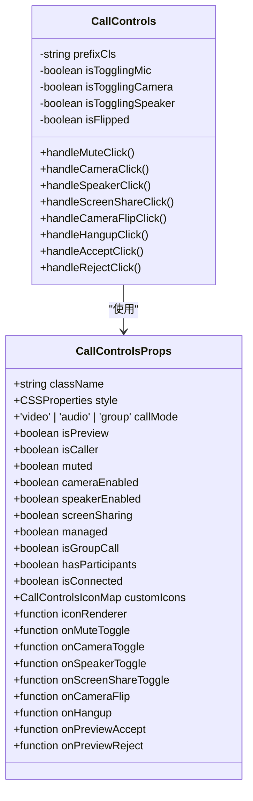
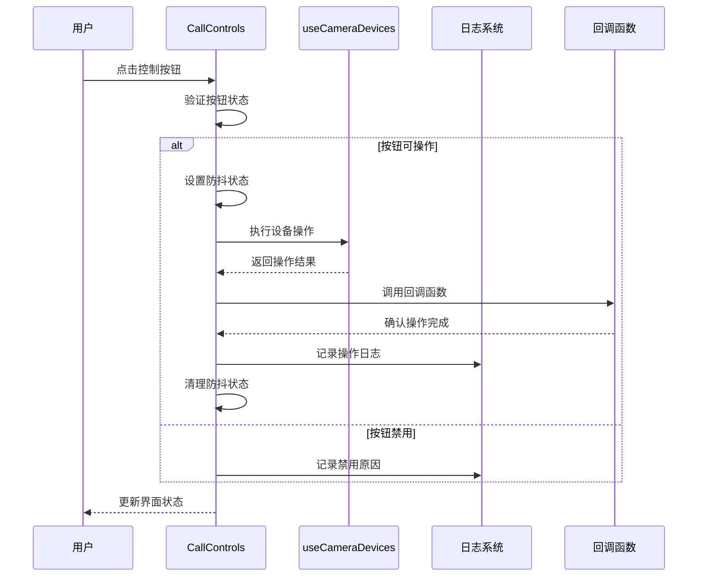
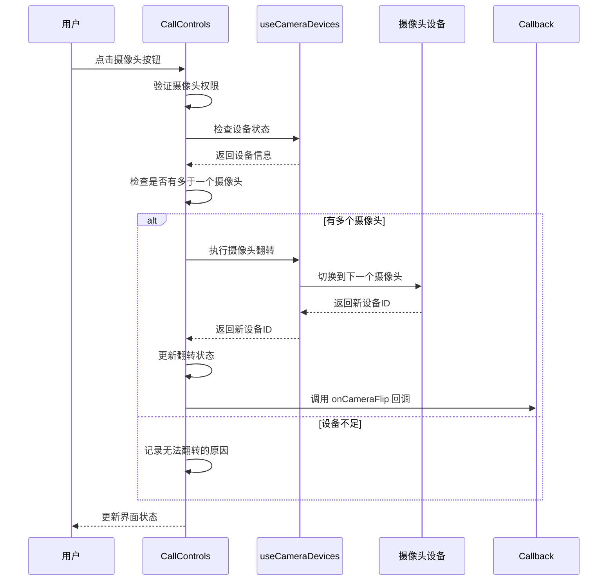
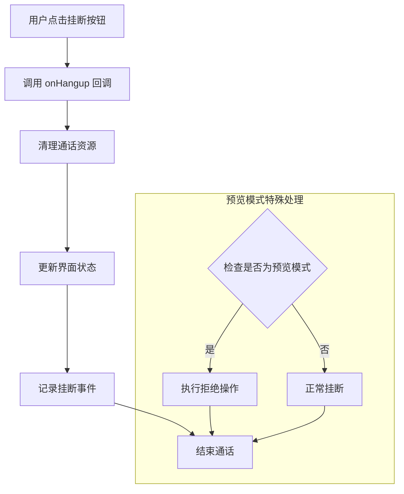
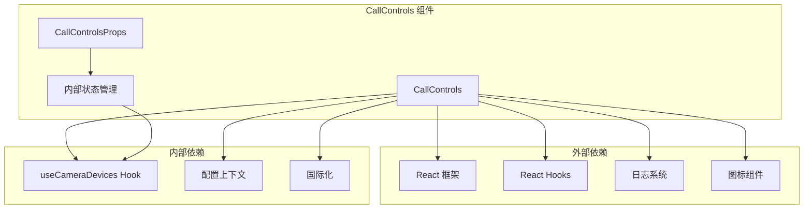
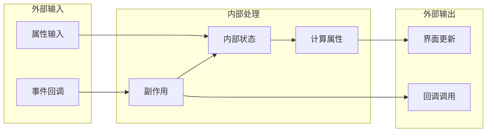

# 通话控制组件 CallControls

<cite>
**本文档引用的文件**
- [CallControls.tsx](file://callkit/components/CallControls.tsx)
- [CallControls.scss](file://callkit/components/CallControls.scss)
- [useCameraDevices.ts](file://callkit/hooks/useCameraDevices.ts)
- [logger.ts](file://callkit/utils/logger.ts)
- [CallControls.storieshide.tsx](file://callkit/components/CallControls.storieshide.tsx)
- [integration.md](file://callkit/docs/integration.md)
- [customization.md](file://callkit/docs/customization.md)
- [quickstart.md](file://callkit/docs/quickstart.md)
- [CallKit.stories.tsx](file://callkit/CallKit.stories.tsx)
- [index.ts](file://callkit/index.ts)
</cite>

## 目录
1. [简介](#简介)
2. [项目结构](#项目结构)
3. [核心组件](#核心组件)
4. [架构概览](#架构概览)
5. [详细组件分析](#详细组件分析)
6. [依赖关系分析](#依赖关系分析)
7. [性能考量](#性能考量)
8. [故障排除指南](#故障排除指南)
9. [结论](#结论)
10. [附录](#附录)

## 简介
CallControls 是环信 Web CallKit 音视频通话系统中的核心控制面板组件，负责提供用户在通话过程中的所有关键操作入口。该组件实现了完整的通话控制功能，包括麦克风静音/取消静音、摄像头开启/关闭、前后摄像头切换、扬声器控制、挂断电话以及屏幕共享等核心功能。

该组件采用现代化的 React 架构设计，支持受控和非受控两种模式，具备完善的错误处理机制和用户反馈系统。通过灵活的配置选项和样式定制能力，能够适应各种不同的应用场景和设计需求。

## 项目结构
CallControls 组件位于 callkit/components 目录下，与相关的样式文件、Hooks 和文档共同构成了完整的通话控制解决方案。



**图表来源**
- [CallControls.tsx](file://callkit/components/CallControls.tsx#L1-L808)
- [CallControls.scss](file://callkit/components/CallControls.scss#L1-L218)

**章节来源**
- [CallControls.tsx](file://callkit/components/CallControls.tsx#L1-L808)
- [CallControls.scss](file://callkit/components/CallControls.scss#L1-L218)

## 核心组件
CallControls 组件提供了完整的通话控制功能，支持多种通话模式和丰富的交互体验。

### 主要功能特性
- **麦克风控制**：支持静音/取消静音状态切换，具备状态指示和用户反馈
- **摄像头控制**：支持开启/关闭摄像头，前后摄像头自动切换
- **扬声器控制**：支持音频输出控制，适用于免提通话场景
- **挂断电话**：一键结束通话，支持多种挂断场景
- **屏幕共享**：支持屏幕共享功能（可扩展）
- **预览模式**：支持通话前的设备预览和控制

### 核心配置选项
组件支持丰富的配置选项，包括通话模式、状态控制、回调事件等：



**图表来源**
- [CallControls.tsx](file://callkit/components/CallControls.tsx#L11-L63)

**章节来源**
- [CallControls.tsx](file://callkit/components/CallControls.tsx#L11-L63)

## 架构概览
CallControls 采用了模块化的架构设计，通过 Hooks 和上下文管理实现松耦合的组件结构。



**图表来源**
- [CallControls.tsx](file://callkit/components/CallControls.tsx#L262-L426)
- [useCameraDevices.ts](file://callkit/hooks/useCameraDevices.ts#L353-L377)

## 详细组件分析

### 麦克风控制功能
麦克风控制是通话中最常用的功能之一，具备完整的状态管理和用户反馈机制。

#### 功能实现流程


**图表来源**
- [CallControls.tsx](file://callkit/components/CallControls.tsx#L262-L311)

#### 状态管理机制
- **防抖控制**：200ms 防抖延迟，防止频繁点击导致的状态冲突
- **并发保护**：使用 `isTogglingMic` 状态防止同时进行多个操作
- **受控模式**：支持外部状态管理，通过 `propMuted` 接收外部状态
- **非受控模式**：组件内部维护状态，通过 `defaultMuted` 设置初始状态

**章节来源**
- [CallControls.tsx](file://callkit/components/CallControls.tsx#L262-L311)

### 摄像头控制功能
摄像头控制功能支持摄像头的开启/关闭以及前后摄像头的自动切换。

#### 摄像头切换流程


**图表来源**
- [CallControls.tsx](file://callkit/components/CallControls.tsx#L440-L458)
- [useCameraDevices.ts](file://callkit/hooks/useCameraDevices.ts#L353-L377)

#### 摄像头设备管理
- **设备检测**：自动检测系统中的摄像头设备
- **权限管理**：检查摄像头访问权限
- **设备缓存**：使用 localStorage 缓存设备信息，提高性能
- **多语言支持**：支持多种语言的摄像头标签识别

**章节来源**
- [useCameraDevices.ts](file://callkit/hooks/useCameraDevices.ts#L1-L388)

### 扬声器控制功能
扬声器控制功能负责管理音频输出，支持免提通话场景。

#### 扬声器切换机制
- **防抖处理**：100ms 防抖延迟，确保操作稳定性
- **状态同步**：支持受控和非受控两种模式
- **用户反馈**：通过视觉反馈显示当前状态
- **错误处理**：完善的异常捕获和状态恢复机制

**章节来源**
- [CallControls.tsx](file://callkit/components/CallControls.tsx#L377-L426)

### 挂断电话功能
挂断电话是最关键的操作之一，需要确保通话的正常结束。

#### 挂断流程


**图表来源**
- [CallControls.tsx](file://callkit/components/CallControls.tsx#L460-L470)

**章节来源**
- [CallControls.tsx](file://callkit/components/CallControls.tsx#L460-L470)

### 预览模式控制
预览模式为用户提供通话前的设备检查和控制功能。

#### 预览模式特性
- **主叫方界面**：显示挂断按钮和摄像头控制
- **被叫方界面**：显示接听和拒绝按钮
- **设备控制**：支持摄像头翻转和静音控制
- **状态同步**：与正式通话模式保持一致的控制逻辑

**章节来源**
- [CallControls.tsx](file://callkit/components/CallControls.tsx#L474-L636)

## 依赖关系分析

### 组件依赖关系


**图表来源**
- [CallControls.tsx](file://callkit/components/CallControls.tsx#L1-L10)
- [useCameraDevices.ts](file://callkit/hooks/useCameraDevices.ts#L1-L3)

### 数据流分析
组件采用单向数据流设计，确保状态管理的清晰性和可预测性。



**图表来源**
- [CallControls.tsx](file://callkit/components/CallControls.tsx#L187-L229)

**章节来源**
- [CallControls.tsx](file://callkit/components/CallControls.tsx#L187-L229)

## 性能考量
CallControls 组件在设计时充分考虑了性能优化，采用了多种策略来确保流畅的用户体验。

### 性能优化策略
- **防抖机制**：对所有状态切换操作实施防抖，减少不必要的重渲染
- **状态缓存**：使用 useMemo 和 useCallback 优化计算属性和回调函数
- **条件渲染**：根据通话模式动态渲染按钮，避免不必要的 DOM 元素
- **懒加载**：摄像头设备信息使用缓存机制，避免频繁的设备枚举操作

### 内存管理
- **定时器清理**：组件卸载时自动清理所有定时器和监听器
- **事件监听器**：使用 React 的 useEffect 清理机制管理设备变化监听
- **资源释放**：确保摄像头和麦克风权限的正确释放

**章节来源**
- [CallControls.tsx](file://callkit/components/CallControls.tsx#L124-L130)
- [useCameraDevices.ts](file://callkit/hooks/useCameraDevices.ts#L332-L344)

## 故障排除指南

### 常见问题及解决方案

#### 摄像头权限问题
**问题描述**：用户点击摄像头按钮无反应
**可能原因**：
- 浏览器未授予摄像头权限
- 系统摄像头设备不可用
- 多个应用程序占用摄像头

**解决方案**：
1. 检查浏览器权限设置
2. 确认摄像头设备正常工作
3. 关闭其他占用摄像头的应用程序

#### 麦克风权限问题
**问题描述**：麦克风无法正常工作
**可能原因**：
- 浏览器未授予麦克风权限
- 系统音频设备配置错误
- 麦克风硬件故障

**解决方案**：
1. 检查系统音频设备设置
2. 更新浏览器到最新版本
3. 重新插拔麦克风设备

#### 网络连接问题
**问题描述**：通话质量差或频繁断线
**可能原因**：
- 网络带宽不足
- 网络延迟过高
- 服务器连接不稳定

**解决方案**：
1. 检查网络连接质量
2. 关闭其他占用带宽的应用
3. 尝试切换到更稳定的网络

### 调试工具和日志
组件内置了完整的日志系统，可以帮助开发者诊断问题：

#### 日志级别
- **ERROR**：严重错误，影响功能正常使用
- **WARN**：警告信息，需要注意但不影响功能
- **INFO**：一般信息，用于跟踪功能执行
- **DEBUG**：调试信息，详细的功能执行过程
- **VERBOSE**：详细日志，包含所有调试信息

**章节来源**
- [logger.ts](file://callkit/utils/logger.ts#L1-L181)

## 结论
CallControls 组件作为环信 Web CallKit 的核心控制面板，提供了完整而强大的通话控制功能。通过精心设计的架构和完善的错误处理机制，该组件能够满足各种复杂的通话场景需求。

### 主要优势
- **功能完整性**：涵盖通话控制的所有核心功能
- **用户体验优秀**：提供直观的界面和及时的用户反馈
- **性能优化到位**：采用多种策略确保流畅的用户体验
- **可扩展性强**：支持丰富的自定义选项和样式定制
- **错误处理完善**：具备完整的异常捕获和恢复机制

### 技术特点
- 采用现代 React 架构设计
- 支持受控和非受控两种模式
- 内置完整的日志系统
- 提供丰富的配置选项
- 具备良好的响应式设计

该组件为构建高质量的音视频通话应用奠定了坚实的基础，开发者可以根据具体需求进行进一步的定制和扩展。

## 附录

### 使用示例
以下是一个基本的 CallControls 使用示例：

```typescript
import { CallControls } from 'easemob-chat-uikit';

// 基本使用
<CallControls
  muted={false}
  cameraEnabled={true}
  speakerEnabled={true}
  onMuteToggle={(muted) => console.log('静音状态:', muted)}
  onCameraToggle={(enabled) => console.log('摄像头状态:', enabled)}
  onSpeakerToggle={(enabled) => console.log('扬声器状态:', enabled)}
  onHangup={() => console.log('挂断通话')}
/>

// 预览模式使用
<CallControls
  isPreview={true}
  isCaller={true}
  onPreviewAccept={() => console.log('接听通话')}
  onPreviewReject={() => console.log('拒绝通话')}
/>
```

### 集成指南
CallControls 组件可以轻松集成到现有的 React 应用中：

1. **安装依赖**：`npm install easemob-chat-uikit`
2. **导入组件**：`import { CallControls } from 'easemob-chat-uikit'`
3. **配置样式**：导入必要的 CSS 文件
4. **使用组件**：在应用中直接使用 CallControls 组件

### 自定义配置
组件支持丰富的自定义选项，包括：

- **样式定制**：通过 className 和 style 属性自定义外观
- **图标定制**：支持自定义所有控制按钮的图标
- **行为定制**：通过回调函数定制各种操作的行为
- **国际化**：支持多语言界面

**章节来源**
- [integration.md](file://callkit/docs/integration.md#L1-L417)
- [customization.md](file://callkit/docs/customization.md#L1-L82)
- [quickstart.md](file://callkit/docs/quickstart.md#L1-L617)