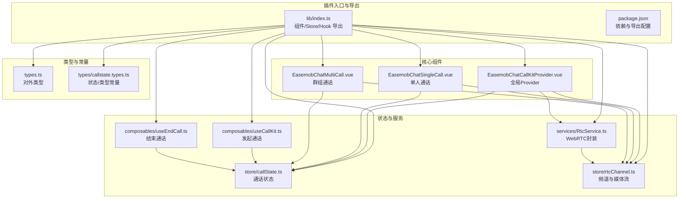
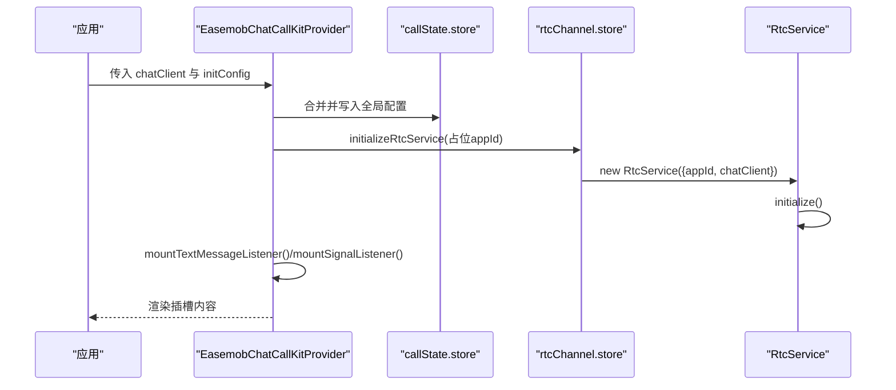
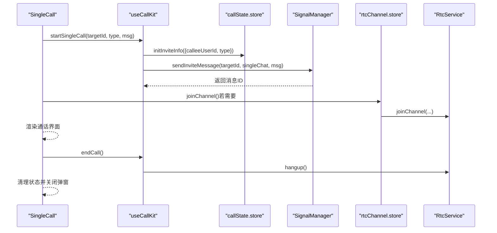
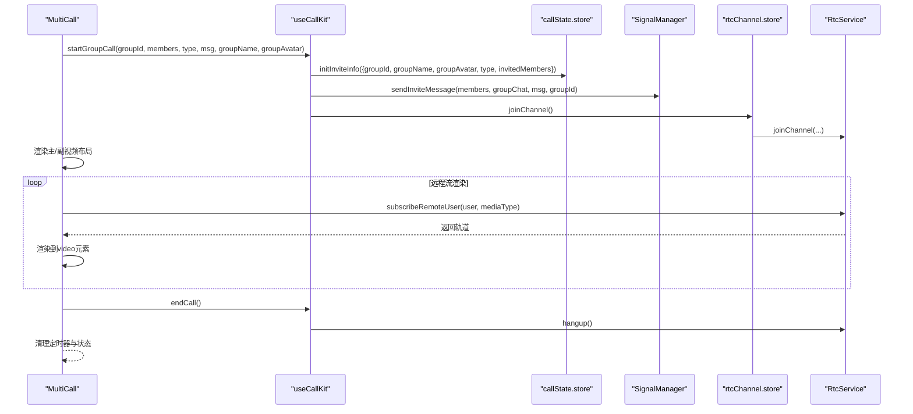

# 核心组件

<cite>
**本文档引用的文件**
- [lib/index.ts](file://lib/index.ts)
- [lib/components/EasemobChatCallKitProvider.vue](file://lib/components/EasemobChatCallKitProvider.vue)
- [lib/components/singleCall/EasemobChatSingleCall.vue](file://lib/components/singleCall/EasemobChatSingleCall.vue)
- [lib/components/multiCall/EasemobChatMultiCall.vue](file://lib/components/multiCall/EasemobChatMultiCall.vue)
- [lib/types.ts](file://lib/types.ts)
- [lib/types/callstate.types.ts](file://lib/types/callstate.types.ts)
- [lib/store/callState.ts](file://lib/store/callState.ts)
- [lib/store/rtcChannel.ts](file://lib/store/rtcChannel.ts)
- [lib/composables/useCallKit.ts](file://lib/composables/useCallKit.ts)
- [lib/composables/useEndCall.ts](file://lib/composables/useEndCall.ts)
- [lib/services/RtcService.ts](file://lib/services/RtcService.ts)
- [package.json](file://package.json)
</cite>

## 目录
1. [简介](#简介)
2. [项目结构](#项目结构)
3. [核心组件](#核心组件)
4. [架构总览](#架构总览)
5. [组件详解](#组件详解)
6. [依赖关系分析](#依赖关系分析)
7. [性能与可用性建议](#性能与可用性建议)
8. [故障排查指南](#故障排查指南)
9. [结论](#结论)
10. [附录](#附录)

## 简介
本文件面向 Easemob Chat CallKit Vue3 插件的核心组件，系统梳理 Provider 组件、单人通话组件与群组通话组件的功能、API、状态管理、生命周期与协作关系。文档提供属性清单、事件定义、插槽说明与典型使用场景，帮助开发者快速集成与定制。

## 项目结构
该插件采用 Vue3 + Pinia 架构，核心组件位于 lib/components 下，配合 store、composables、services 与类型定义共同构成完整的通话能力体系。



图表来源
- [lib/index.ts](file://lib/index.ts#L1-L58)
- [lib/components/EasemobChatCallKitProvider.vue](file://lib/components/EasemobChatCallKitProvider.vue#L1-L115)
- [lib/components/singleCall/EasemobChatSingleCall.vue](file://lib/components/singleCall/EasemobChatSingleCall.vue#L1-L134)
- [lib/components/multiCall/EasemobChatMultiCall.vue](file://lib/components/multiCall/EasemobChatMultiCall.vue#L1-L800)
- [lib/store/callState.ts](file://lib/store/callState.ts#L1-L263)
- [lib/store/rtcChannel.ts](file://lib/store/rtcChannel.ts#L1-L410)
- [lib/composables/useCallKit.ts](file://lib/composables/useCallKit.ts#L1-L123)
- [lib/composables/useEndCall.ts](file://lib/composables/useEndCall.ts#L1-L131)
- [lib/services/RtcService.ts](file://lib/services/RtcService.ts#L1-L719)
- [lib/types.ts](file://lib/types.ts#L1-L91)
- [lib/types/callstate.types.ts](file://lib/types/callstate.types.ts#L1-L93)

章节来源
- [lib/index.ts](file://lib/index.ts#L1-L58)
- [package.json](file://package.json#L1-L53)

## 核心组件
- Provider 组件：负责全局初始化、聊天客户端注入、RTC 服务初始化、事件监听挂载与日志配置，确保后续组件在统一上下文中运行。
- 单人通话组件：面向一对一语音/视频通话，负责待接/通话中状态渲染、最小化窗口切换、与状态/RTC的联动。
- 群组通话组件：面向多人音视频通话，负责主/副视频布局、成员邀请/超时管理、远程流渲染、控制条与头部信息展示。

章节来源
- [lib/components/EasemobChatCallKitProvider.vue](file://lib/components/EasemobChatCallKitProvider.vue#L1-L115)
- [lib/components/singleCall/EasemobChatSingleCall.vue](file://lib/components/singleCall/EasemobChatSingleCall.vue#L1-L134)
- [lib/components/multiCall/EasemobChatMultiCall.vue](file://lib/components/multiCall/EasemobChatMultiCall.vue#L1-L800)

## 架构总览
整体采用“Provider 上下文 + 组件 + Store + Composables + Service”的分层设计，Provider 负责初始化与全局配置；组件通过 Pinia 管理通话状态与频道；Composables 封装业务动作；Service 封装底层 WebRTC 能力。

```mermaid
classDiagram
class Provider {
+props : ProviderConfig
+watchEffect(chatClient)
+watchEffect(initConfig)
+initializeRtcService()
+mountListeners()
}
class SingleCall {
+props : {targetUser, type, enableRingtone?}
+emits : callStarted, callEnded, callCanceled
+computed : callStatus, isMinimized
+methods : startCall(), handleMinimize(), handleExpand(), handleEndCall()
}
class MultiCall {
+props : {groupId?, groupName?, groupAvatar?, participants?, type, maxParticipants?, backgroundImage?, currentUserId?, autoShow?}
+emits : callStarted, callEnded, addParticipant, participantTimeout, userLeft, userJoined, error
+computed : isVisible, participants, mainParticipant, sideParticipants, callDuration
+methods : startCall(), toggleMute(), toggleVideo(), endCall(), handleAddParticipant(), handleInviteMembers()
}
class CallStateStore {
+state : status, type, callId, channel, token, groupId, groupName, groupAvatar, invitedMembers, joinedMembers, isMinimized
+actions : initInviteInfo(), setCallStatus(), resetCallState(), startTimeoutTimer(), clearTimeoutTimer()
+getters : getCallStatus, getCallState, isInviting, isInCall, getInvitedMembers, getIsMinimized
}
class RtcChannelStore {
+state : channels, activeChannelId, isConnected, localStream, remoteStreams, audioEnabled, videoEnabled, rtcService, agoraAppId, callDuration, uidToUserIdMap, joinedRtcUsers, pendingUserIds, leftUsers
+actions : initializeRtcService(), destroyRtcService(), joinChannel(), leaveChannel(), setLocalStream(), setAudioEnabled(), setVideoEnabled(), startCallTimer(), stopCallTimer(), setUidToUserIdMapping(), markUserJoinedRtc(), markUserLeftRtc(), clearLeftUsers()
+getters : activeChannel, activeChannelParticipantCount, channelIds, getRtcService, formattedCallDuration
}
class RtcService {
+initialize()
+joinChannel(channelName, token, uid, appId?)
+leaveChannel()
+createAudioTrack()
+createVideoTrack()
+publishTracks(tracks)
+toggleAudio(enabled)
+toggleVideo(enabled)
+switchCamera(deviceId)
+switchMicrophone(deviceId)
+subscribeRemoteUser(user, mediaType)
+getLocalVideoStream()
+getRemoteVideoTrack(userId)
+getRemoteAudioTrack(userId)
+getClient()
+destroy()
}
Provider --> CallStateStore : "写入全局配置"
Provider --> RtcChannelStore : "初始化RTC服务"
Provider --> RtcService : "创建实例"
SingleCall --> CallStateStore : "读取状态"
SingleCall --> RtcChannelStore : "读取媒体状态"
MultiCall --> CallStateStore : "读取状态"
MultiCall --> RtcChannelStore : "读取媒体状态"
MultiCall --> RtcService : "发布/订阅/切换"
```

图表来源
- [lib/components/EasemobChatCallKitProvider.vue](file://lib/components/EasemobChatCallKitProvider.vue#L1-L115)
- [lib/components/singleCall/EasemobChatSingleCall.vue](file://lib/components/singleCall/EasemobChatSingleCall.vue#L1-L134)
- [lib/components/multiCall/EasemobChatMultiCall.vue](file://lib/components/multiCall/EasemobChatMultiCall.vue#L1-L800)
- [lib/store/callState.ts](file://lib/store/callState.ts#L1-L263)
- [lib/store/rtcChannel.ts](file://lib/store/rtcChannel.ts#L1-L410)
- [lib/services/RtcService.ts](file://lib/services/RtcService.ts#L1-L719)

## 组件详解

### Provider 组件（EasemobChatCallKitProvider）
- 作用
  - 注入聊天客户端实例，建立 Provider 上下文；
  - 合并并应用初始化配置（如调试、铃声、可拖拽、可调整大小、邀请超时等）；
  - 初始化 RTC 服务（占位 appId，实际由信令动态下发），并挂载文本消息与信令事件监听；
  - 提供全局日志开关与调试信息输出。
- 关键配置项（ProviderConfig）
  - chatClient: 可选，支持延迟注入；Provider 会将其保存到 store 并在后续组件中使用。
  - agoraAppId: 已废弃，仅保留向后兼容；实际 appId 由信令动态获取。
  - initConfig: 
    - debug: 是否开启调试日志
    - enableRingtone: 是否启用铃声
    - resizable: 是否允许调整大小
    - draggable: 是否允许拖动
    - inviteTimeout: 邀请超时时间（毫秒）
- 生命周期
  - onMounted: 标记组件已挂载，渲染插槽内容；
  - onUnmounted: 销毁 RTC 服务，释放资源。
- 与 Store/Service 的协作
  - 写入全局配置到 callState.store；
  - 初始化 rtcChannel.store 并创建 RtcService；
  - 挂载文本消息与信令监听器，驱动后续组件状态变更。

章节来源
- [lib/components/EasemobChatCallKitProvider.vue](file://lib/components/EasemobChatCallKitProvider.vue#L1-L115)
- [lib/store/callState.ts](file://lib/store/callState.ts#L1-L263)
- [lib/store/rtcChannel.ts](file://lib/store/rtcChannel.ts#L1-L410)
- [lib/services/RtcService.ts](file://lib/services/RtcService.ts#L1-L719)

### 单人通话组件（EasemobChatSingleCall）
- 用途
  - 一对一语音/视频通话的 UI 与交互载体；
  - 支持最小化窗口与展开恢复；
  - 与全局状态联动，自动监听状态变化并关闭弹窗。
- 属性（Props）
  - targetUser: 对方用户 ID
  - type: 'audio' | 'video'
  - enableRingtone?: 是否启用铃声（默认启用）
- 事件（Emits）
  - callStarted: 通话开始
  - callEnded: 通话结束
  - callCanceled: 呼叫被取消
- 插槽
  - 无内置插槽；通过状态与 store 控制显示内容。
- 行为与状态
  - 通过 store 读取当前通话状态与最小化状态；
  - 在挂载时触发 startCall；
  - 监听 store 状态变化，当回到 IDLE 且处于通话中时自动结束并关闭弹窗；
  - 最小化/展开通过 store.isMinimized 控制。
- 与 Provider/Store 的协作
  - 依赖 Provider 注入的聊天客户端与 RTC 服务；
  - 通过 store 管理通话状态、邀请超时与 UI 状态。

章节来源
- [lib/components/singleCall/EasemobChatSingleCall.vue](file://lib/components/singleCall/EasemobChatSingleCall.vue#L1-L134)
- [lib/store/callState.ts](file://lib/store/callState.ts#L1-L263)
- [lib/store/rtcChannel.ts](file://lib/store/rtcChannel.ts#L1-L410)

### 群组通话组件（EasemobChatMultiCall）
- 用途
  - 多人音视频通话的主界面，支持主/副视频布局、成员列表、邀请管理、控制条与头部信息。
- 属性（Props）
  - groupId?: 群组 ID（可选，内部也可从 store 获取）
  - groupName?: 群组名称
  - groupAvatar?: 群组头像
  - participants?: 参与者数组（可选，内部自动管理）
  - type: 'audio' | 'video'
  - maxParticipants?: 最大参与者数（默认 18）
  - backgroundImage?: 背景图
  - currentUserId?: 当前用户 ID
  - autoShow?: 是否自动显示/隐藏（默认启用）
- 事件（Emits）
  - callStarted: 通话开始
  - callEnded: 通话结束
  - addParticipant: 点击“添加参与者”
  - participantTimeout: 邀请超时（传出被超时的用户 ID）
  - userLeft: 用户离开（已内部自动处理，不强制监听）
  - userJoined: 用户视频已播放（已内部自动处理，不强制监听）
  - error: 发生错误
- 插槽
  - 无内置插槽；通过内部模板与 store 控制显示。
- 关键行为
  - 自动显示/隐藏：仅在群组通话且状态为 INVITING/IN_CALL 时显示；
  - 主/副视频布局：左侧主视频，右侧缩略列表；
  - 成员邀请：通过信令发送邀请消息，并设置邀请超时定时器；
  - 远程流渲染：自动订阅并渲染远程视频/音频轨道；
  - 控制条：静音/摄像头/挂断；
  - 小窗口：最小化后显示迷你窗口，支持展开与关闭。
- 与 Provider/Store/Service 的协作
  - 依赖 Provider 初始化的聊天客户端与 RTC 服务；
  - 通过 store 管理通话状态、参与者、邀请超时、UI 状态；
  - 通过 RtcService 管理本地/远程轨道、发布/订阅、设备切换与网络质量。

章节来源
- [lib/components/multiCall/EasemobChatMultiCall.vue](file://lib/components/multiCall/EasemobChatMultiCall.vue#L1-L800)
- [lib/store/callState.ts](file://lib/store/callState.ts#L1-L263)
- [lib/store/rtcChannel.ts](file://lib/store/rtcChannel.ts#L1-L410)
- [lib/services/RtcService.ts](file://lib/services/RtcService.ts#L1-L719)

### Provider 组件的配置与初始化流程


图表来源
- [lib/components/EasemobChatCallKitProvider.vue](file://lib/components/EasemobChatCallKitProvider.vue#L1-L115)
- [lib/store/callState.ts](file://lib/store/callState.ts#L1-L263)
- [lib/store/rtcChannel.ts](file://lib/store/rtcChannel.ts#L1-L410)
- [lib/services/RtcService.ts](file://lib/services/RtcService.ts#L1-L719)

### 单人通话发起与结束流程


图表来源
- [lib/components/singleCall/EasemobChatSingleCall.vue](file://lib/components/singleCall/EasemobChatSingleCall.vue#L1-L134)
- [lib/composables/useCallKit.ts](file://lib/composables/useCallKit.ts#L1-L123)
- [lib/store/callState.ts](file://lib/store/callState.ts#L1-L263)
- [lib/store/rtcChannel.ts](file://lib/store/rtcChannel.ts#L1-L410)
- [lib/services/RtcService.ts](file://lib/services/RtcService.ts#L1-L719)

### 群组通话邀请与渲染流程


图表来源
- [lib/components/multiCall/EasemobChatMultiCall.vue](file://lib/components/multiCall/EasemobChatMultiCall.vue#L1-L800)
- [lib/composables/useCallKit.ts](file://lib/composables/useCallKit.ts#L1-L123)
- [lib/store/callState.ts](file://lib/store/callState.ts#L1-L263)
- [lib/store/rtcChannel.ts](file://lib/store/rtcChannel.ts#L1-L410)
- [lib/services/RtcService.ts](file://lib/services/RtcService.ts#L1-L719)

## 依赖关系分析
- 组件依赖
  - Provider 依赖 chatClient 与 initConfig，初始化 rtcChannel.store 与 RtcService；
  - Single/Multi 依赖 callState.store 与 rtcChannel.store，通过 store 管理状态与媒体流；
  - Composables 封装业务动作，减少组件耦合。
- 外部依赖
  - Vue3、Pinia、agora-rtc-sdk-ng、easemob-websdk；
  - package.json 中声明 peerDependencies 与 dependencies。

章节来源
- [package.json](file://package.json#L1-L53)
- [lib/index.ts](file://lib/index.ts#L1-L58)

## 性能与可用性建议
- 邀请超时与定时器管理：合理设置 inviteTimeout，避免长时间占用 UI；及时清理定时器，防止内存泄漏。
- 远程流渲染去重：对同一 video 元素避免重复渲染，减少不必要的 play/attach 操作。
- 视频轨道复用与重建：在摄像头切换/重启时避免重复发布，必要时重建轨道并同步本地流。
- 网络质量与音量指示：利用 RtcService 的回调，结合 store 状态更新 UI 指示。
- 小窗口模式：最小化后延迟触发展开事件，确保视频流恢复播放。

[本节为通用建议，不直接分析具体文件]

## 故障排查指南
- Provider 未注入 chatClient
  - 现象：组件报“ChatClient未初始化，请确保在Provider内使用”；
  - 处理：确保在 Provider 内传入 chatClient，并等待 Provider 初始化完成。
- RTC 服务未初始化
  - 现象：joinChannel 报错或无法发布/订阅；
  - 处理：确认 Provider 已调用 initializeRtcService，且 appId 已由信令动态下发。
- 远程用户无流
  - 现象：remoteUsers 存在但无轨道；
  - 处理：检查 user-published 回调是否触发自动订阅，必要时手动 subscribeRemoteUser。
- 邀请超时未生效
  - 现象：邀请超时后 UI 未正确清理；
  - 处理：确认 store 中 inviteTimeoutTimer 是否启动，以及 handleTimeout 的分支逻辑。
- 挂断后仍显示“邀请中”
  - 现象：用户已离开但仍显示邀请中；
  - 处理：确认 leftUsers 清理逻辑与 isUserInRtc 判定。

章节来源
- [lib/components/EasemobChatCallKitProvider.vue](file://lib/components/EasemobChatCallKitProvider.vue#L1-L115)
- [lib/store/callState.ts](file://lib/store/callState.ts#L1-L263)
- [lib/store/rtcChannel.ts](file://lib/store/rtcChannel.ts#L1-L410)
- [lib/services/RtcService.ts](file://lib/services/RtcService.ts#L1-L719)

## 结论
Easemob Chat CallKit Vue3 通过 Provider 统一上下文，结合 Pinia 状态与 RtcService 能力，为单人与群组通话提供了清晰、可扩展的组件体系。遵循本文档的配置、状态与流程说明，可在多数场景下快速集成并定制通话体验。

[本节为总结，不直接分析具体文件]

## 附录

### 类型与常量速览
- 通话状态与类型
  - CALL_STATUS: IDLE, INVITING, ALERTING, CONFIRM_RING, RECEIVED_CONFIRM_RING, ANSWER_CALL, CONFIRM_CALLEE, IN_CALL
  - CALL_TYPE: AUDIO_1V1, VIDEO_1V1, VIDEO_MULTI, AUDIO_MULTI
  - HANGUP_REASON: hangup, cancel, remoteCancel, refuse, remoteRefuse, busy, noResponse, remoteNoResponse, handleOnOtherDevice, abnormalEnd
- ProviderConfig
  - chatClient?: Chat.Connection
  - agoraAppId?: string（已废弃）
  - initConfig?: { debug?, enableRingtone?, resizable?, draggable?, inviteTimeout? }
- UseCallKitReturn
  - startSingleCall(targetId, type, msg)
  - startGroupCall(groupId, members, type, msg, groupName?, groupAvatar?)
- UseEndCallReturn
  - hangup(reason?), hangupCall(), cancelCall(), handleRemoteCancel(), handleRemoteRefuse(), handleAbnormalEnd(), canHangup(), canCancel()

章节来源
- [lib/types/callstate.types.ts](file://lib/types/callstate.types.ts#L1-L93)
- [lib/types.ts](file://lib/types.ts#L1-L91)