# CSS 架构重构

<cite>
**本文档引用的文件**
- [README.md](file://README.md)
- [package.json](file://package.json)
- [lib/index.ts](file://lib/index.ts)
- [lib/style.css](file://lib/style.css)
- [lib/types.ts](file://lib/types.ts)
- [lib/store/types.ts](file://lib/store/types.ts)
- [lib/store/callState.ts](file://lib/store/callState.ts)
- [lib/services/CallService.ts](file://lib/services/CallService.ts)
- [lib/components/EasemobChatCallKitProvider.vue](file://lib/components/EasemobChatCallKitProvider.vue)
- [lib/types/callstate.types.ts](file://lib/types/callstate.types.ts)
- [lib/utils/logger.ts](file://lib/utils/logger.ts)
- [lib/ARCHITECTURE.md](file://lib/ARCHITECTURE.md)
- [lib/components/singleCall/styles/EasemobChatCallStream.css](file://lib/components/singleCall/styles/EasemobChatCallStream.css)
- [lib/components/multiCall/styles/EasemobChatMultiCall.css](file://lib/components/multiCall/styles/EasemobChatMultiCall.css)
- [lib/components/multiCall/styles/CallHeader.css](file://lib/components/multiCall/styles/CallHeader.css)
- [lib/modules/groupCall/components/MainVideoLayout.vue](file://lib/modules/groupCall/components/MainVideoLayout.vue)
- [lib/modules/groupCall/components/ParticipantTile.css](file://lib/modules/groupCall/components/ParticipantTile.css)
- [lib/modules/groupCall/components/VideoGrid.css](file://lib/modules/groupCall/components/VideoGrid.css)
- [lib/modules/groupCall/components/GroupCallShell.css](file://lib/modules/groupCall/components/GroupCallShell.css)
</cite>

## 更新摘要
**所做更改**
- 新增主视频模式专用样式的详细说明
- 添加响应式缩略图导航系统的完整分析
- 补充视频尺寸强制约束的技术实现细节
- 更新样式架构重构的整体设计理念
- 增强新样式系统的模块化组织结构说明

## 目录
1. [项目简介](#项目简介)
2. [项目结构](#项目结构)
3. [核心组件](#核心组件)
4. [架构概览](#架构概览)
5. [详细组件分析](#详细组件分析)
6. [CSS 架构重构详解](#css-架构重构详解)
7. [依赖关系分析](#依赖关系分析)
8. [性能考虑](#性能考虑)
9. [故障排除指南](#故障排除指南)
10. [结论](#结论)

## 项目简介

Easemob Chat CallKit Vue3 是一个专为 Vue3 设计的即时通讯和音视频通话插件。该项目采用现代化的前端架构，集成了环信聊天服务和 Agora 实时通信技术，为开发者提供完整的音视频通话解决方案。

该插件具有以下核心特性：
- 基于 Vue3 Composition API 的现代化架构
- 完整的 TypeScript 类型支持
- 响应式状态管理（Pinia）
- 组件化设计，支持灵活的 UI 定制
- 支持一对一和群组音视频通话
- 完善的日志系统和错误处理机制

## 项目结构

项目采用模块化的目录结构，主要分为以下几个核心区域：

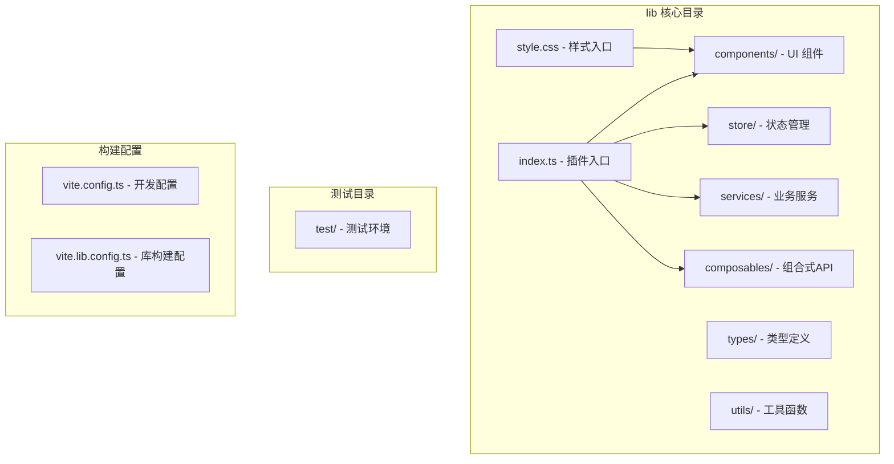

**图表来源**
- [lib/index.ts:1-67](file://lib/index.ts#L1-L67)
- [lib/style.css:1-15](file://lib/style.css#L1-L15)

**章节来源**
- [README.md:5-31](file://README.md#L5-L31)
- [lib/index.ts:1-67](file://lib/index.ts#L1-L67)

## 核心组件

### 插件入口与导出系统

插件通过统一的入口文件管理所有导出组件和服务：

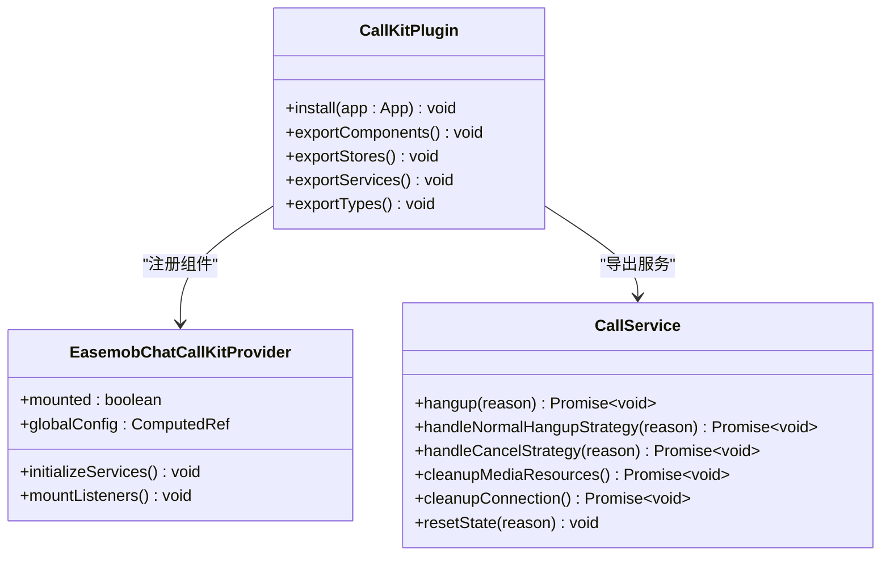

**图表来源**
- [lib/index.ts:56-67](file://lib/index.ts#L56-L67)
- [lib/components/EasemobChatCallKitProvider.vue:1-115](file://lib/components/EasemobChatCallKitProvider.vue#L1-L115)
- [lib/services/CallService.ts:9-359](file://lib/services/CallService.ts#L9-L359)

### 响应式状态管理

项目采用 Pinia 进行状态管理，实现了清晰的状态分离和响应式更新：

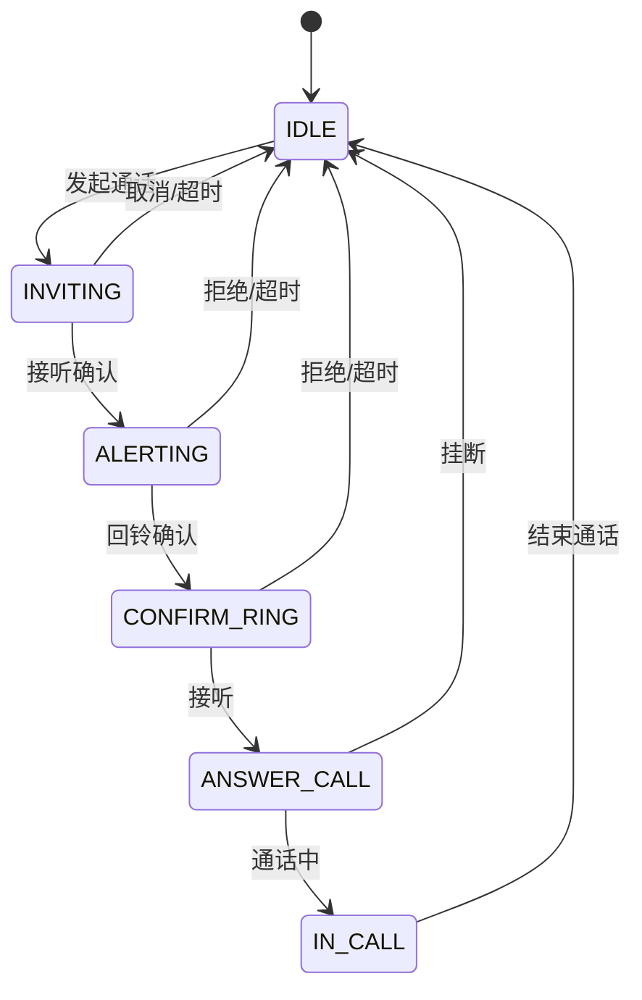

**图表来源**
- [lib/store/callState.ts:142-151](file://lib/store/callState.ts#L142-L151)
- [lib/types/callstate.types.ts:13-22](file://lib/types/callstate.types.ts#L13-L22)

**章节来源**
- [lib/store/callState.ts:1-263](file://lib/store/callState.ts#L1-L263)
- [lib/types/callstate.types.ts:1-93](file://lib/types/callstate.types.ts#L1-L93)

## 架构概览

### 整体架构设计

项目采用了清晰的分层架构，每层都有明确的职责分工：

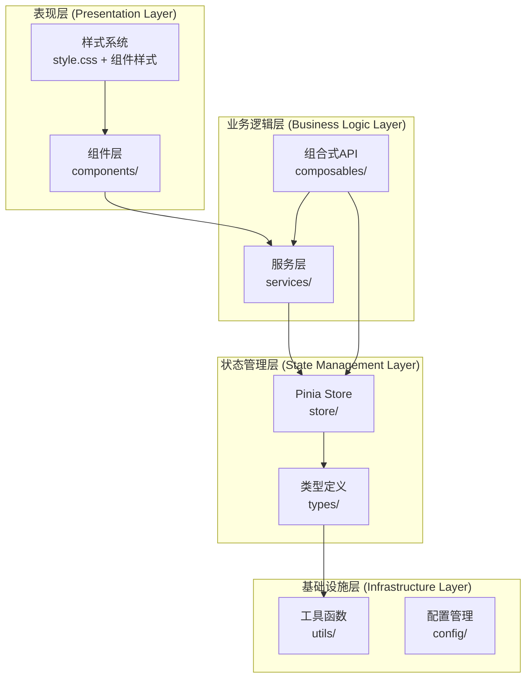

**图表来源**
- [lib/ARCHITECTURE.md:5-13](file://lib/ARCHITECTURE.md#L5-L13)
- [lib/index.ts:19-36](file://lib/index.ts#L19-L36)

### 样式架构重构

项目实施了统一的样式管理策略，通过样式入口文件集中管理所有组件样式：

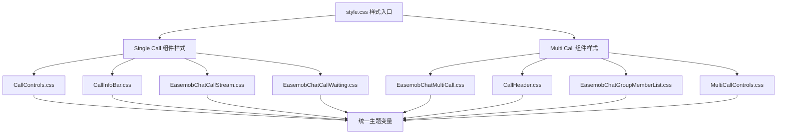

**图表来源**
- [lib/style.css:3-15](file://lib/style.css#L3-L15)

**章节来源**
- [lib/style.css:1-15](file://lib/style.css#L1-L15)
- [lib/ARCHITECTURE.md:1-190](file://lib/ARCHITECTURE.md#L1-L190)

## 详细组件分析

### CallService 通话服务

CallService 是项目的核心业务逻辑组件，负责处理所有通话相关的操作：

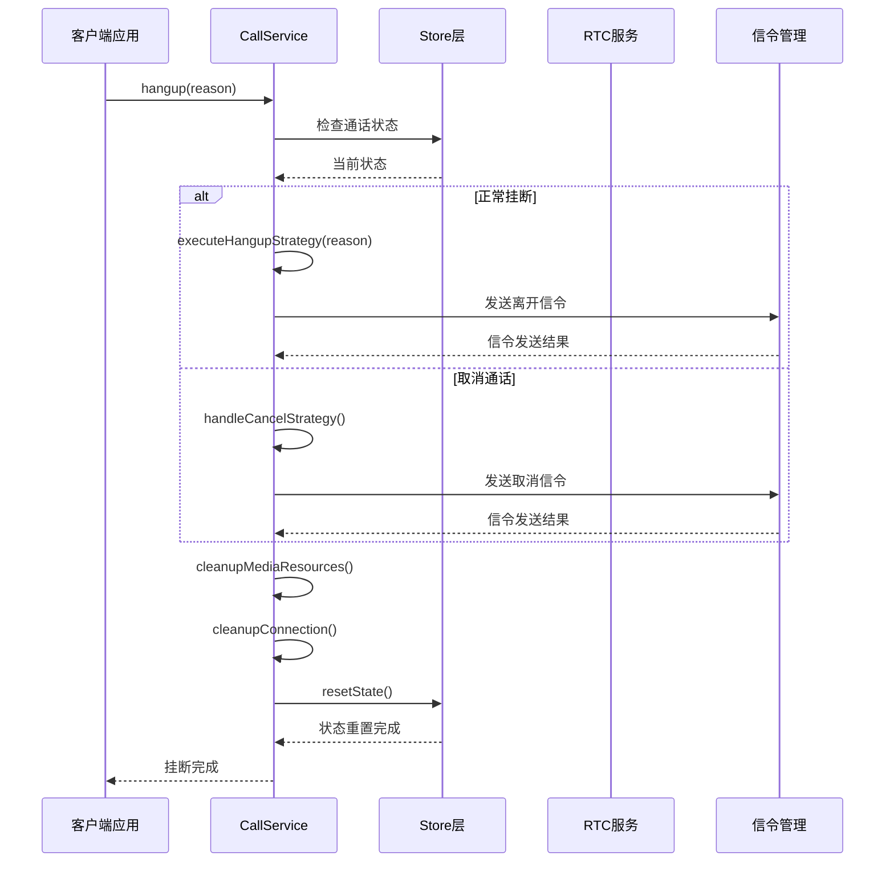

**图表来源**
- [lib/services/CallService.ts:25-72](file://lib/services/CallService.ts#L25-L72)
- [lib/services/CallService.ts:101-180](file://lib/services/CallService.ts#L101-L180)

#### 关键特性分析

1. **状态检查机制**：在执行任何操作前，CallService 会检查 Pinia Store 的初始化状态，确保组件正确挂载
2. **策略模式**：根据不同的挂断原因（正常挂断、取消、远程操作等）执行相应的处理策略
3. **资源清理**：确保在通话结束后正确清理媒体资源和 RTC 连接
4. **错误处理**：即使在清理过程中出现错误，也会尽力重置基础状态

**章节来源**
- [lib/services/CallService.ts:1-359](file://lib/services/CallService.ts#L1-L359)

### EasemobChatCallKitProvider 组件

Provider 组件作为整个插件的根组件，负责初始化和管理全局状态：

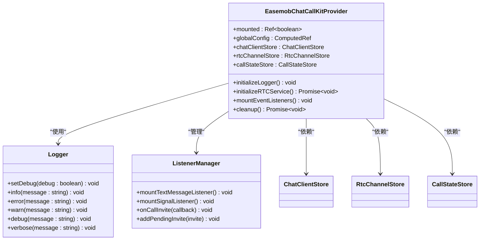

**图表来源**
- [lib/components/EasemobChatCallKitProvider.vue:8-115](file://lib/components/EasemobChatCallKitProvider.vue#L8-L115)
- [lib/utils/logger.ts:50-231](file://lib/utils/logger.ts#L50-L231)

#### 初始化流程

Provider 组件遵循严格的初始化顺序：

1. **配置合并**：合并默认配置和用户配置
2. **日志系统**：设置日志级别和调试模式
3. **RTC 服务**：初始化实时通信服务
4. **事件监听**：挂载聊天和信令监听器
5. **组件渲染**：确保所有依赖都准备就绪后渲染子组件

**章节来源**
- [lib/components/EasemobChatCallKitProvider.vue:1-115](file://lib/components/EasemobChatCallKitProvider.vue#L1-L115)
- [lib/utils/logger.ts:1-231](file://lib/utils/logger.ts#L1-L231)

### 状态管理架构

项目的状态管理采用了"接口定义 + 响应式实现"的分离模式：

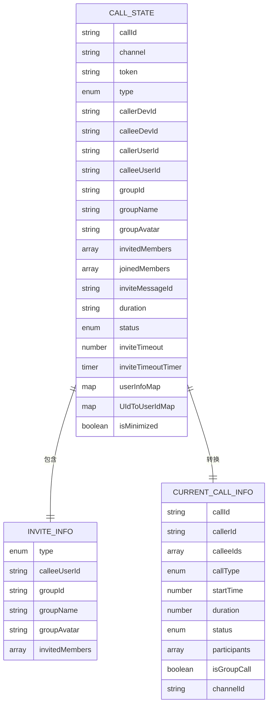

**图表来源**
- [lib/store/types.ts:23-55](file://lib/store/types.ts#L23-L55)
- [lib/store/types.ts:35-42](file://lib/store/types.ts#L35-L42)
- [lib/store/types.ts:23-34](file://lib/store/types.ts#L23-L34)

**章节来源**
- [lib/store/types.ts:1-86](file://lib/store/types.ts#L1-L86)
- [lib/store/callState.ts:11-37](file://lib/store/callState.ts#L11-L37)

## CSS 架构重构详解

### 主视频模式专用样式系统

**更新** 新增主视频模式专用样式的完整实现分析

项目引入了全新的主视频模式（Main Video Mode），专门用于突出显示当前选中的参与者，提供沉浸式的视频观看体验：

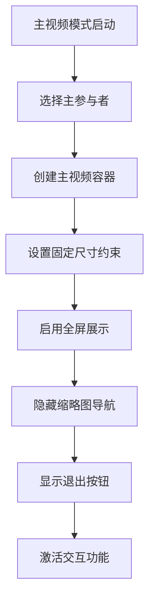

**图表来源**
- [lib/modules/groupCall/components/MainVideoLayout.vue:120-173](file://lib/modules/groupCall/components/MainVideoLayout.vue#L120-L173)

#### 核心特性实现

1. **固定尺寸约束**：主视频区域采用固定的宽高比（16:9），确保视频内容不会变形
2. **智能缩放策略**：根据容器大小自动调整视频尺寸，优先保证宽度再保证高度
3. **无缝切换机制**：支持点击主视频区域循环切换下一个参与者
4. **优雅退出功能**：提供专门的退出按钮回到九宫格视图

**章节来源**
- [lib/modules/groupCall/components/MainVideoLayout.vue:1-291](file://lib/modules/groupCall/components/MainVideoLayout.vue#L1-L291)

### 响应式缩略图导航系统

**更新** 新增响应式缩略图导航系统的详细技术实现

项目实现了智能化的缩略图导航系统，支持水平滚动和动态显示：

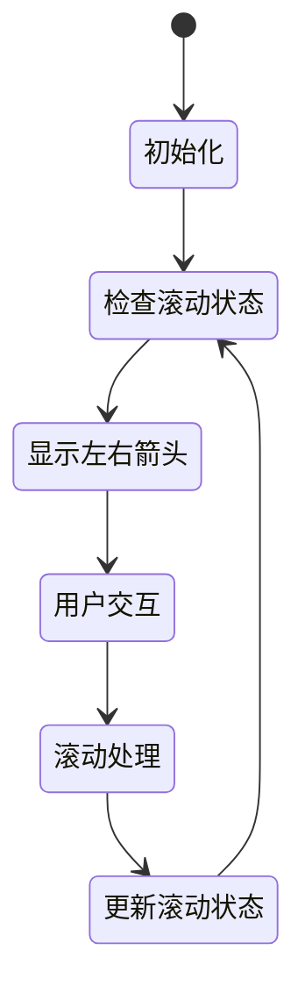

**图表来源**
- [lib/modules/groupCall/components/MainVideoLayout.vue:79-113](file://lib/modules/groupCall/components/MainVideoLayout.vue#L79-L113)

#### 关键技术实现

1. **智能滚动检测**：实时监控滚动位置，动态显示/隐藏左右滚动箭头
2. **平滑滚动体验**：使用 CSS scroll-behavior: smooth 实现流畅的滚动效果
3. **响应式尺寸适配**：根据屏幕宽度自动调整缩略图尺寸（120px → 108px → 96px）
4. **视觉反馈机制**：当前选中项显示蓝色边框高亮效果

**章节来源**
- [lib/modules/groupCall/components/MainVideoLayout.vue:175-290](file://lib/modules/groupCall/components/MainVideoLayout.vue#L175-L290)

### 视频尺寸强制约束系统

**更新** 新增视频尺寸强制约束的技术规范和实现细节

项目建立了严格的视频尺寸约束体系，确保所有视频元素在不同设备上都能保持一致的显示效果：

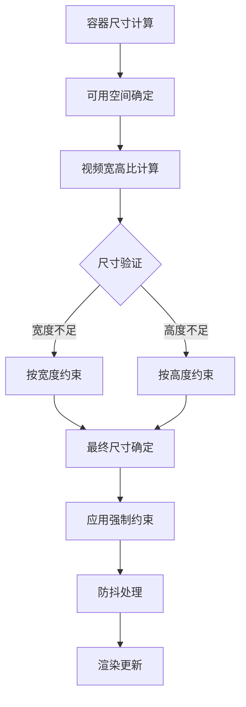

**图表来源**
- [lib/modules/groupCall/components/MainVideoLayout.vue:258-307](file://lib/modules/groupCall/components/MainVideoLayout.vue#L258-L307)

#### 约束规则设计

1. **最小尺寸保护**：所有视频元素最小宽度不低于100px，确保可识别性
2. **宽高比保持**：严格维持16:9的视频宽高比，避免内容变形
3. **溢出控制策略**：当视频尺寸过大时，优先保证宽度再保证高度
4. **边界值处理**：设置合理的最大和最小尺寸边界，防止极端情况

**章节来源**
- [lib/modules/groupCall/components/MainVideoLayout.vue:258-307](file://lib/modules/groupCall/components/MainVideoLayout.vue#L258-L307)

### 新样式系统模块化组织

**更新** 新增样式系统模块化组织结构的详细说明

项目采用模块化的样式组织方式，将不同功能的样式文件进行分类管理：

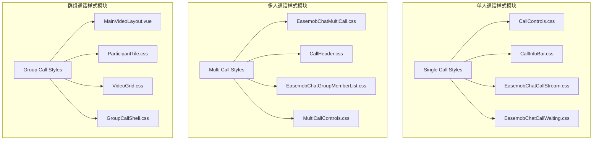

**图表来源**
- [lib/style.css:3-15](file://lib/style.css#L3-L15)

#### 模块化优势

1. **职责分离**：每个样式文件专注于特定的功能领域
2. **维护便利**：修改某个功能的样式不影响其他模块
3. **复用性强**：组件级别的样式可以在多个场景中复用
4. **命名规范**：采用统一的命名约定，提高代码可读性

**章节来源**
- [lib/style.css:1-15](file://lib/style.css#L1-L15)

## 依赖关系分析

### 核心依赖关系

项目的主要依赖关系如下：

```mermaid
graph LR
subgraph "运行时依赖"
A[pinia ^3.0.3]
B[easemob-websdk ^4.16.0]
C[agora-rtc-sdk-ng ^4.24.2]
D[vue ^3.5.18]
end
subgraph "开发依赖"
E[@vitejs/plugin-vue]
F[typescript ~5.8.3]
G[vite ^7.1.2]
H[vite-plugin-dts]
I[vue-tsc ^3.0.5]
end
subgraph "插件内部"
J[CallService]
K[Store层]
L[组件层]
M[组合式API]
end
J --> K
K --> L
L --> M
M --> J
A --> K
B --> J
C --> J
D --> L
```

**图表来源**
- [package.json:47-51](file://package.json#L47-L51)
- [package.json:36-45](file://package.json#L36-L45)

### 版本兼容性

项目在依赖版本管理上采用了严格的兼容性策略：

- **Vue 3.x**：完全兼容 Vue 3.0+ 版本
- **Pinia**：使用最新稳定版本确保响应式状态管理
- **Agora SDK**：支持 4.x 版本的实时通信功能
- **环信 SDK**：兼容 4.16+ 版本的聊天功能

**章节来源**
- [package.json:1-53](file://package.json#L1-L53)

## 性能考虑

### 响应式更新优化

项目在性能优化方面采用了多项策略：

1. **懒加载 Store 实例**：CallService 使用 getter 方式延迟获取 Store 实例，确保在 Pinia 激活后使用
2. **状态重置机制**：在通话结束后及时清理状态，避免内存泄漏
3. **定时器管理**：统一管理超时定时器，防止重复计时和内存泄漏
4. **条件渲染**：Provider 组件使用 mounted 标志确保组件正确挂载后再渲染

### 资源管理

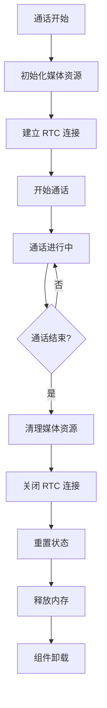

**图表来源**
- [lib/services/CallService.ts:251-337](file://lib/services/CallService.ts#L251-L337)

### 样式性能优化

**更新** 新增样式系统性能优化的具体措施

1. **CSS 变量缓存**：统一管理主题变量，减少重复计算
2. **选择器优化**：采用高效的 CSS 选择器，避免深层嵌套
3. **动画性能**：使用 transform 和 opacity 属性触发硬件加速
4. **响应式媒体查询**：合理使用媒体查询，避免过度重绘

## 故障排除指南

### 常见问题及解决方案

#### 1. Store 初始化问题

**问题症状**：CallService 报告 "CallState store not properly initialized"

**解决方案**：
- 确保在使用 CallService 前已经正确初始化 Provider 组件
- 检查 Pinia 是否正确安装和配置
- 验证组件是否在正确的生命周期阶段使用

#### 2. RTC 连接失败

**问题症状**：通话无法建立或频繁断开

**解决方案**：
- 检查 Agora App ID 配置
- 验证网络连接和防火墙设置
- 确认浏览器权限（摄像头/麦克风）

#### 3. 样式冲突问题

**问题症状**：组件样式异常或覆盖

**解决方案**：
- 检查样式优先级和作用域
- 确保正确引入样式文件
- 验证 CSS 变量的定义和使用

#### 4. 主视频模式显示异常

**问题症状**：主视频区域显示不正确或尺寸异常

**解决方案**：
- 检查容器尺寸计算逻辑
- 验证视频宽高比约束设置
- 确认响应式媒体查询生效

**章节来源**
- [lib/services/CallService.ts:34-47](file://lib/services/CallService.ts#L34-L47)
- [lib/utils/logger.ts:148-186](file://lib/utils/logger.ts#L148-L186)

## 结论

Easemob Chat CallKit Vue3 插件展现了现代前端架构的最佳实践，通过清晰的分层设计、完善的类型系统和响应式状态管理，为开发者提供了强大而灵活的音视频通话解决方案。

### 主要优势

1. **架构清晰**：分层设计使得代码职责明确，易于维护和扩展
2. **类型安全**：完整的 TypeScript 支持提供了良好的开发体验
3. **性能优化**：合理的资源管理和状态清理机制
4. **可扩展性**：模块化设计支持功能的灵活扩展
5. **测试友好**：清晰的职责分离便于单元测试和集成测试

### 技术亮点

- **响应式状态管理**：基于 Pinia 的现代化状态管理
- **组合式 API**：充分利用 Vue3 的 Composition API 特性
- **日志系统**：完善的日志记录和调试支持
- **错误处理**：健壮的错误处理和恢复机制
- **样式架构**：统一的样式管理和主题系统

**更新** CSS 架构重构显著提升了用户体验，通过主视频模式、响应式缩略图导航和视频尺寸强制约束等新样式系统改进，为音视频通话功能提供了更加专业和用户友好的界面体验。

该插件为音视频通话功能的集成提供了完整的解决方案，既适合快速开发，也适合深度定制和扩展。