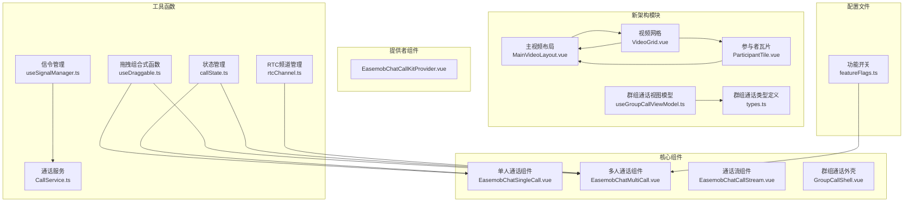
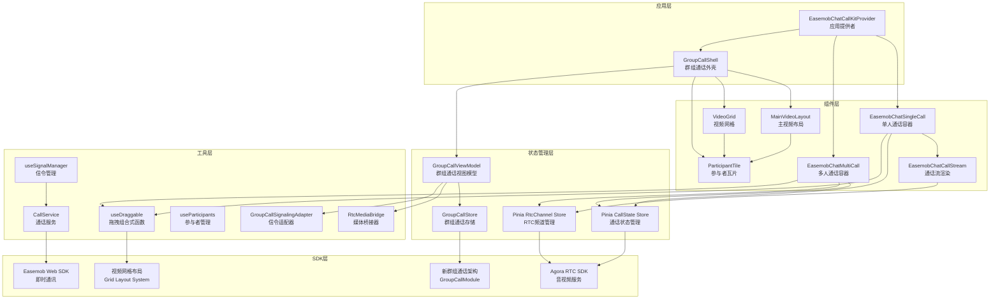
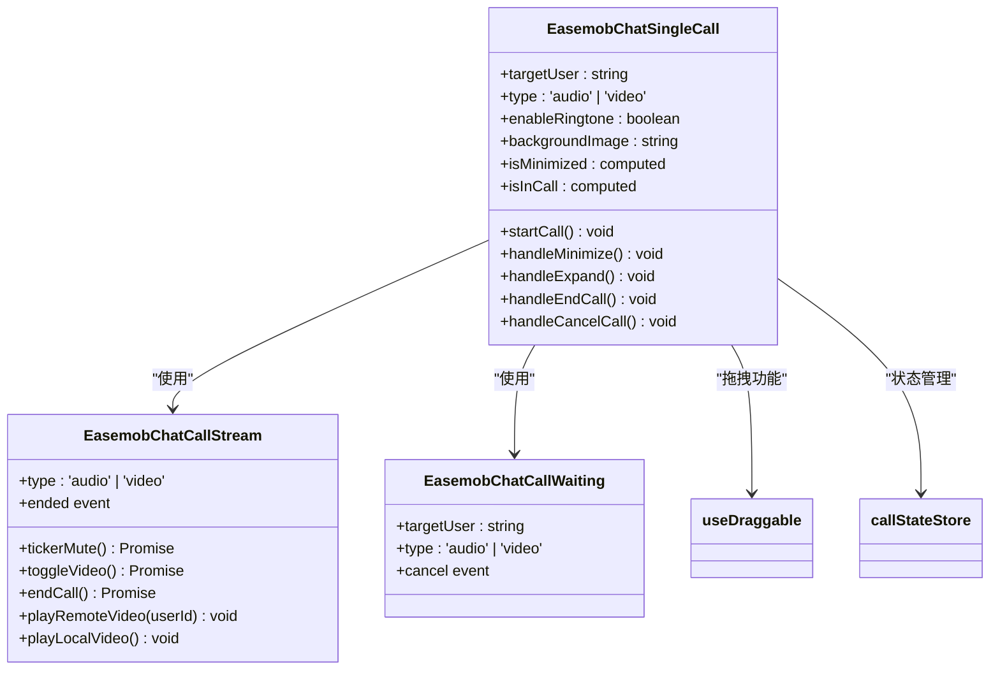
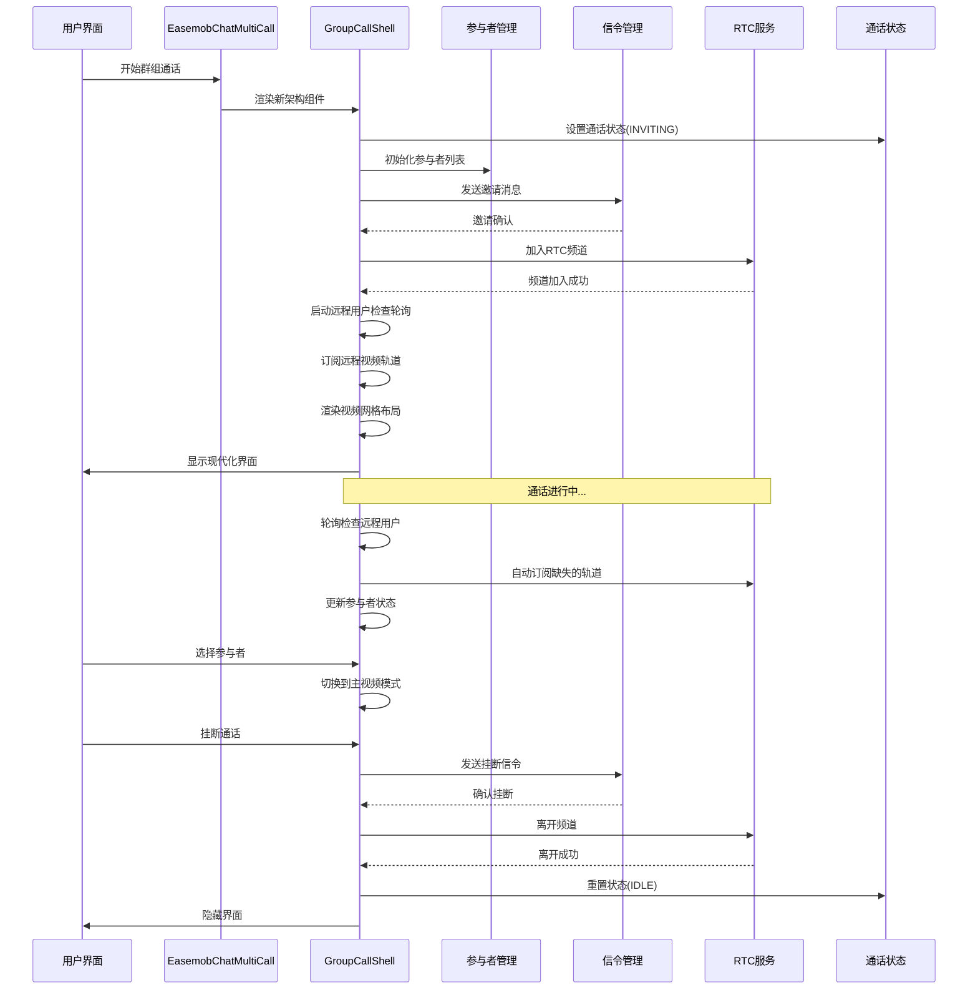
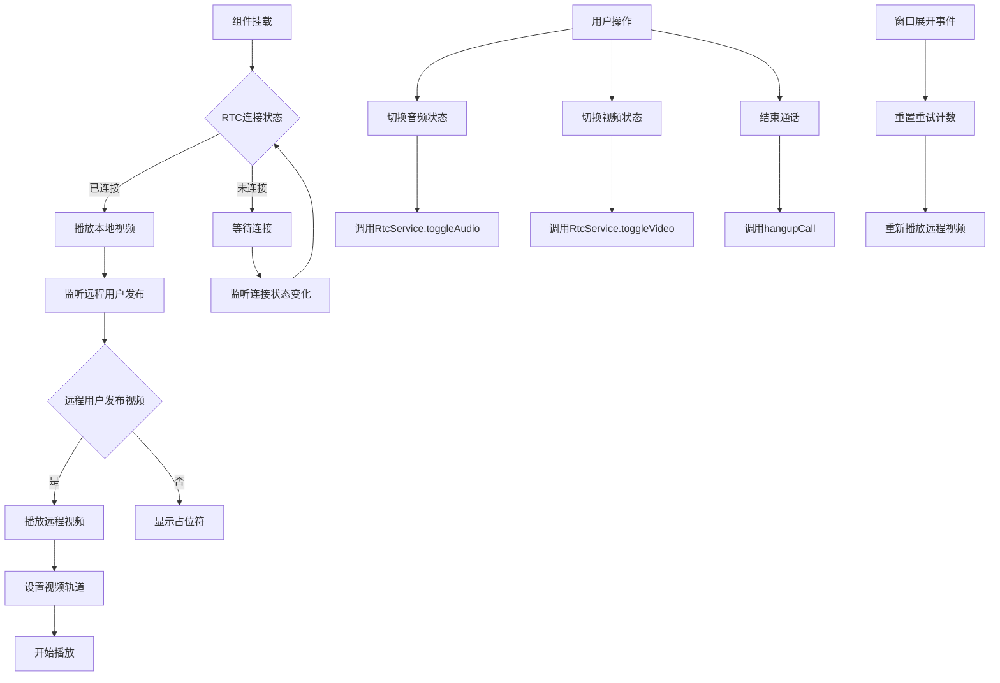
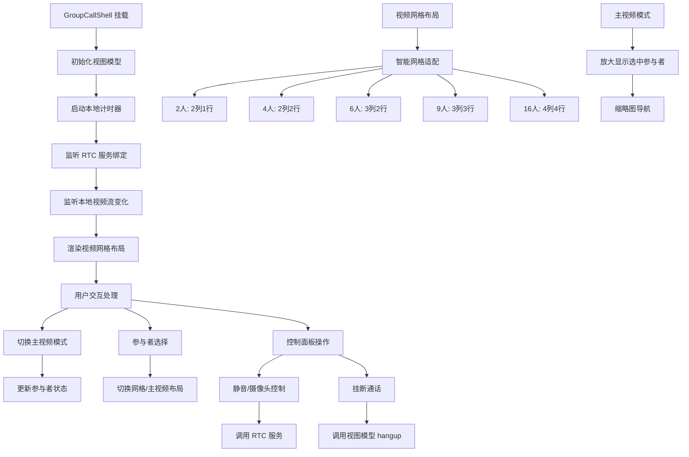
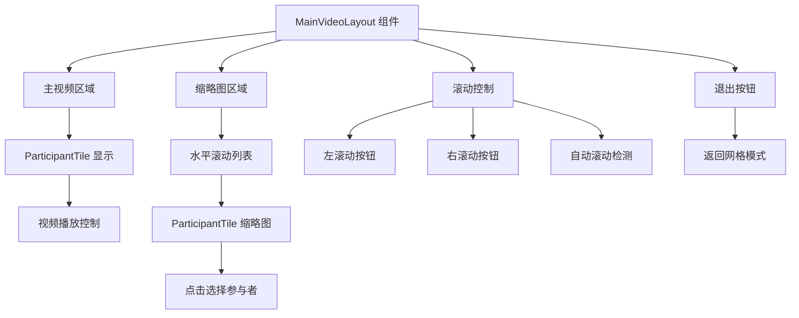
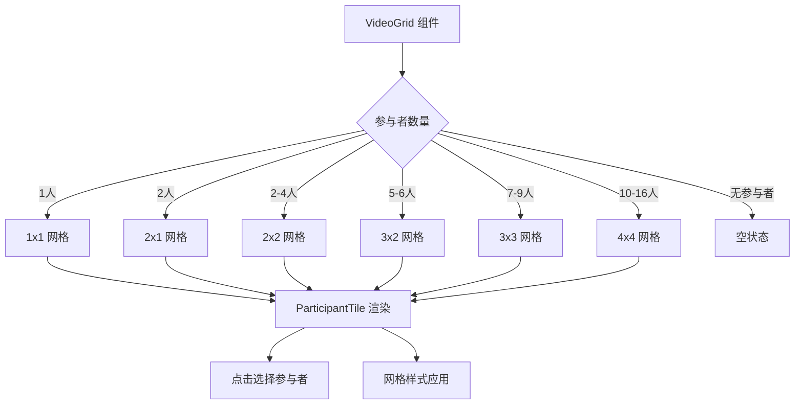
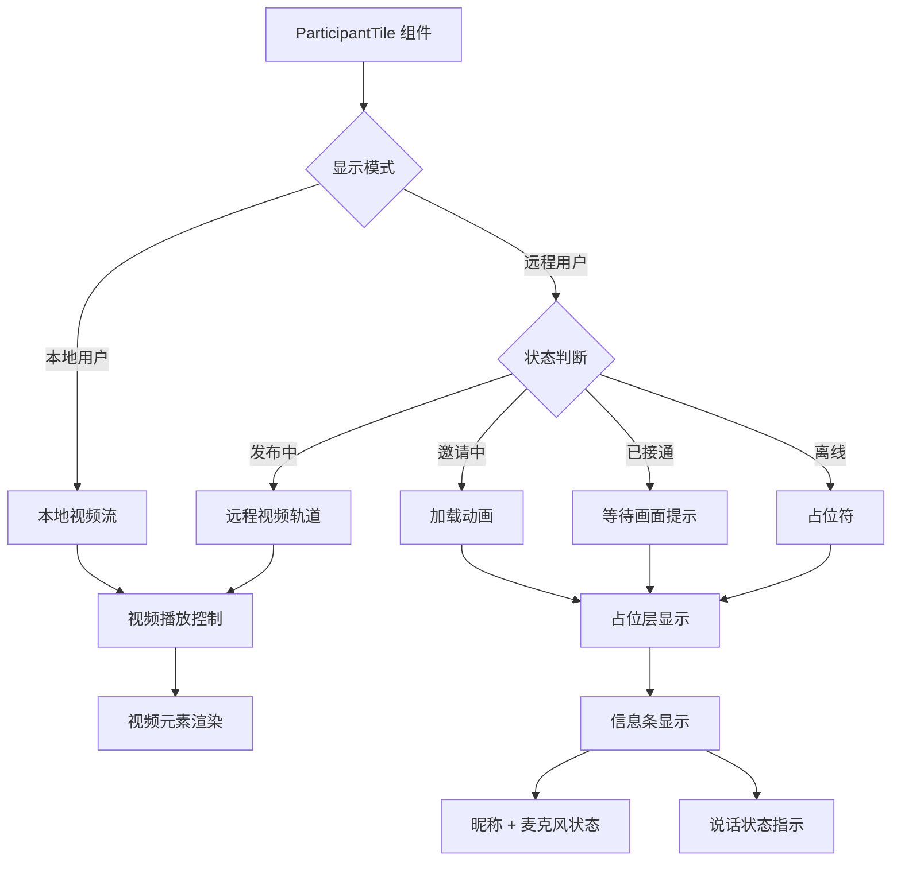
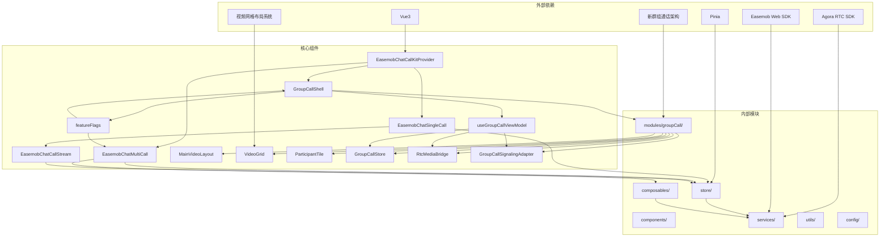

# 主视频布局组件

<cite>
**本文档引用的文件**
- [README.md](file://README.md)
- [package.json](file://package.json)
- [EasemobChatCallKitProvider.vue](file://lib/components/EasemobChatCallKitProvider.vue)
- [EasemobChatSingleCall.vue](file://lib/components/singleCall/EasemobChatSingleCall.vue)
- [EasemobChatCallStream.vue](file://lib/components/singleCall/EasemobChatCallStream.vue)
- [EasemobChatMultiCall.vue](file://lib/components/multiCall/EasemobChatMultiCall.vue)
- [CallHeader.vue](file://lib/components/multiCall/CallHeader.vue)
- [MultiCallControls.vue](file://lib/components/multiCall/MultiCallControls.vue)
- [callState.ts](file://lib/store/callState.ts)
- [rtcChannel.ts](file://lib/store/rtcChannel.ts)
- [useDraggable.ts](file://lib/composables/useDraggable.ts)
- [CallService.ts](file://lib/services/CallService.ts)
- [useSignalManager.ts](file://lib/composables/useSignalManager.ts)
- [GroupCallShell.vue](file://lib/modules/groupCall/components/GroupCallShell.vue)
- [MainVideoLayout.vue](file://lib/modules/groupCall/components/MainVideoLayout.vue)
- [VideoGrid.vue](file://lib/modules/groupCall/components/VideoGrid.vue)
- [ParticipantTile.vue](file://lib/modules/groupCall/components/ParticipantTile.vue)
- [featureFlags.ts](file://lib/config/featureFlags.ts)
- [types.ts](file://lib/modules/groupCall/types.ts)
- [useGroupCallViewModel.ts](file://lib/modules/groupCall/viewModel/useGroupCallViewModel.ts)
</cite>

## 更新摘要
**变更内容**
- 新架构：视频网格布局替代原有的左右双列布局，提供更灵活的参与者管理方式
- 新增群组通话新架构支持，启用 USE_NEW_GROUP_CALL 功能开关
- 增强视频播放可靠性，实现远程用户检查轮询机制
- 优化计时器准确性，提供精确的通话时长计算
- 改进UI响应性，增强拖拽功能和窗口交互体验
- 完善错误处理机制，增加重试和状态恢复能力
- 新增 GroupCallShell 组件，提供现代化群组通话界面

## 目录
1. [简介](#简介)
2. [项目结构](#项目结构)
3. [核心组件](#核心组件)
4. [架构概览](#架构概览)
5. [详细组件分析](#详细组件分析)
6. [依赖关系分析](#依赖关系分析)
7. [性能考虑](#性能考虑)
8. [故障排除指南](#故障排除指南)
9. [结论](#结论)

## 简介

主视频布局组件是 Easemob Chat CallKit Vue3 插件的核心组成部分，负责提供高质量的音视频通话界面体验。该组件系统支持单人通话和多人群组通话两种模式，具备拖拽定位、最小化窗口、实时视频流渲染等功能。

**更新** 项目现已支持全新的群组通话架构，通过 USE_NEW_GROUP_CALL 功能开关启用现代化的 GroupCallShell 组件，提供更可靠的视频播放和更准确的计时器管理。新架构采用视频网格布局替代原有的左右双列布局，为参与者管理提供了更大的灵活性。

该项目基于 Vue3 和 TypeScript 构建，集成了环信聊天 SDK 和 Agora RTC SDK，为开发者提供了完整的音视频通话解决方案。

## 项目结构

项目采用模块化的组织方式，主要分为以下几个核心目录：

**图表来源**
- [EasemobChatCallKitProvider.vue:1-115](file://lib/components/EasemobChatCallKitProvider.vue#L1-L115)
- [EasemobChatMultiCall.vue:1-95](file://lib/components/multiCall/EasemobChatMultiCall.vue#L1-L95)
- [GroupCallShell.vue:1-300](file://lib/modules/groupCall/components/GroupCallShell.vue#L1-L300)
- [featureFlags.ts:1-10](file://lib/config/featureFlags.ts#L1-L10)

**章节来源**
- [README.md:5-31](file://README.md#L5-L31)
- [package.json:1-53](file://package.json#L1-L53)

## 核心组件

### 主要组件概述

项目包含四个核心视频布局组件，其中新增了现代化的群组通话架构：

1. **单人通话组件** (`EasemobChatSingleCall.vue`)
   - 支持一对一音视频通话
   - 提供等待界面和通话界面
   - 支持最小化窗口模式
   - **增强**：改进窗口展开时的视频重播机制

2. **多人通话组件** (`EasemobChatMultiCall.vue`)
   - 支持群组音视频通话
   - **更新**：通过 GroupCallShell 组件提供新架构支持
   - 实现左右布局的主视频和侧边列表
   - 提供成员管理和邀请功能
   - **增强**：新增远程用户检查轮询机制，自动订阅视频轨道

3. **通话流组件** (`EasemobChatCallStream.vue`)
   - 负责视频流的渲染和播放
   - 管理本地和远程视频轨道
   - 处理音频和视频状态切换
   - **增强**：完善重试机制和错误处理

4. **群组通话外壳** (`GroupCallShell.vue`)
   - **新增**：现代化群组通话界面
   - 提供网格布局和主视频模式
   - 集成精确的计时器管理
   - 支持实时参与者状态跟踪
   - **更新**：采用新的视频网格布局架构

**章节来源**
- [EasemobChatSingleCall.vue:1-178](file://lib/components/singleCall/EasemobChatSingleCall.vue#L1-L178)
- [EasemobChatMultiCall.vue:1-95](file://lib/components/multiCall/EasemobChatMultiCall.vue#L1-L95)
- [EasemobChatCallStream.vue:1-340](file://lib/components/singleCall/EasemobChatCallStream.vue#L1-L340)
- [GroupCallShell.vue:1-300](file://lib/modules/groupCall/components/GroupCallShell.vue#L1-L300)

## 架构概览

系统采用分层架构设计，各组件职责明确，通过 Pinia 状态管理和组合式函数实现松耦合设计。**更新** 新架构采用视频网格布局替代原有的左右双列布局，提供更灵活的参与者管理方式。

**图表来源**
- [EasemobChatCallKitProvider.vue:1-115](file://lib/components/EasemobChatCallKitProvider.vue#L1-L115)
- [GroupCallShell.vue:89-300](file://lib/modules/groupCall/components/GroupCallShell.vue#L89-L300)
- [featureFlags.ts:9-9](file://lib/config/featureFlags.ts#L9-L9)

## 详细组件分析

### 单人通话组件分析

单人通话组件实现了完整的 1v1 通话体验，包括等待界面、通话界面和最小化窗口模式。

**图表来源**
- [EasemobChatSingleCall.vue:1-178](file://lib/components/singleCall/EasemobChatSingleCall.vue#L1-L178)
- [EasemobChatCallStream.vue:1-340](file://lib/components/singleCall/EasemobChatCallStream.vue#L1-L340)

#### 核心特性

1. **拖拽定位功能**
   - 使用 `useDraggable` 组合式函数实现窗口拖拽
   - 支持居中定位和边界限制
   - 提供拖拽状态反馈

2. **双模式界面**
   - 大窗口模式：完整通话界面
   - 小窗口模式：最小化悬浮窗

3. **状态管理**
   - 通过 Pinia store 管理通话状态
   - 自动监听状态变化并更新界面

**章节来源**
- [EasemobChatSingleCall.vue:39-178](file://lib/components/singleCall/EasemobChatSingleCall.vue#L39-L178)
- [useDraggable.ts:78-263](file://lib/composables/useDraggable.ts#L78-L263)

### 多人通话组件分析

多人通话组件支持群组音视频通话，采用左右布局设计，左侧为主视频，右侧为参与者列表。**更新** 通过 GroupCallShell 组件提供新架构支持，采用视频网格布局替代原有的左右双列布局。

**图表来源**
- [EasemobChatMultiCall.vue:164-95](file://lib/components/multiCall/EasemobChatMultiCall.vue#L164-L95)

#### 核心功能

1. **现代化布局切换**
   - **更新**：通过 GroupCallShell 提供视频网格布局
   - **更新**：支持主视频模式和网格模式自由切换
   - **更新**：智能布局适配不同参与者数量

2. **参与者管理**
   - 实时跟踪参与者状态
   - 处理邀请超时机制
   - 支持成员邀请功能

3. **音频状态指示**
   - 显示麦克风状态图标
   - 标识静音用户
   - 实时音频轨道检测

4. **远程用户检查轮询**
   - **新增**：每秒检查远程用户状态
   - **新增**：自动订阅缺失的视频和音频轨道
   - **新增**：最多30次检查后停止轮询

**章节来源**
- [EasemobChatMultiCall.vue:332-421](file://lib/components/multiCall/EasemobChatMultiCall.vue#L332-L421)
- [EasemobChatMultiCall.vue:414-421](file://lib/components/multiCall/EasemobChatMultiCall.vue#L414-L421)

### 通话流组件分析

通话流组件负责视频流的渲染和播放，是音视频通话的核心处理单元。**更新** 完善了重试机制和窗口展开时的视频重播功能。

**图表来源**
- [EasemobChatCallStream.vue:47-340](file://lib/components/singleCall/EasemobChatCallStream.vue#L47-L340)

#### 技术实现

1. **视频流渲染**
   - 自动检测和播放远程视频轨道
   - 处理本地视频流的循环播放
   - 实现视频轨道的动态更新

2. **音频控制**
   - 音频状态的实时切换
   - 静音状态的视觉反馈
   - 音频轨道的生命周期管理

3. **错误处理**
   - 视频轨道缺失的重试机制
   - 连接异常的降级处理
   - 资源清理的完整性保证

4. **窗口交互优化**
   - **新增**：窗口展开时的视频重播
   - **新增**：重试计数器管理
   - **新增**：事件监听器的生命周期管理

**章节来源**
- [EasemobChatCallStream.vue:1-340](file://lib/components/singleCall/EasemobChatCallStream.vue#L1-L340)

### 群组通话外壳组件分析

**新增** GroupCallShell 组件提供了现代化的群组通话界面，支持网格布局和主视频模式。**更新** 采用全新的视频网格布局架构，替代原有的左右双列布局。

**图表来源**
- [GroupCallShell.vue:89-300](file://lib/modules/groupCall/components/GroupCallShell.vue#L89-L300)

#### 核心特性

1. **现代化界面设计**
   - **更新**：采用视频网格布局替代左右双列布局
   - **更新**：智能网格适配不同参与者数量
   - **更新**：支持主视频模式和网格模式自由切换
   - 实时参与者状态跟踪
   - 精确的通话时长显示

2. **智能布局切换**
   - **新增**：根据参与者数量自动调整网格布局
   - **新增**：支持2人到16人的智能网格适配
   - **新增**：流畅的布局切换动画
   - **新增**：主视频模式下的放大显示

3. **精确计时器管理**
   - **新增**：独立的本地计时器
   - **新增**：每秒更新的格式化时间显示
   - **新增**：计时器的生命周期管理

4. **参与者管理**
   - 实时状态同步（邀请中、已接受、已加入等）
   - 支持动态添加成员
   - 完整的参与者生命周期管理

**章节来源**
- [GroupCallShell.vue:1-300](file://lib/modules/groupCall/components/GroupCallShell.vue#L1-L300)

### 主视频布局组件分析

**新增** MainVideoLayout 组件是新架构的核心组件，提供主视频模式的布局管理。

**图表来源**
- [MainVideoLayout.vue:1-291](file://lib/modules/groupCall/components/MainVideoLayout.vue#L1-L291)

#### 核心功能

1. **主视频显示**
   - **新增**：全屏主视频显示当前选中参与者
   - **新增**：支持点击主视频区域切换参与者
   - **新增**：悬停显示退出按钮

2. **缩略图导航**
   - **新增**：底部水平滚动缩略图区域
   - **新增**：智能滚动控制（左/右按钮）
   - **新增**：当前选中项的视觉高亮

3. **参与者管理**
   - **新增**：实时参与者状态跟踪
   - **新增**：动态缩略图更新
   - **新增**：点击选择功能

**章节来源**
- [MainVideoLayout.vue:1-291](file://lib/modules/groupCall/components/MainVideoLayout.vue#L1-L291)

### 视频网格组件分析

**新增** VideoGrid 组件提供智能的视频网格布局管理。

**图表来源**
- [VideoGrid.vue:1-95](file://lib/modules/groupCall/components/VideoGrid.vue#L1-L95)

#### 核心功能

1. **智能网格适配**
   - **新增**：根据参与者数量自动选择最优网格布局
   - **新增**：支持2人到16人的智能适配
   - **新增**：动态网格样式计算

2. **布局切换**
   - **新增**：当有选中参与者时显示主视频模式
   - **新增**：当无选中参与者时显示网格模式
   - **新增**：平滑的布局切换动画

3. **参与者交互**
   - **新增**：点击网格中的参与者进行选择
   - **新增**：支持主视频模式下的参与者切换

**章节来源**
- [VideoGrid.vue:1-95](file://lib/modules/groupCall/components/VideoGrid.vue#L1-L95)

### 参与者瓦片组件分析

**新增** ParticipantTile 组件提供统一的参与者视频显示组件。

**图表来源**
- [ParticipantTile.vue:1-195](file://lib/modules/groupCall/components/ParticipantTile.vue#L1-L195)

#### 核心功能

1. **智能显示控制**
   - **新增**：根据参与者状态自动选择显示模式
   - **新增**：本地用户使用视频轨道播放
   - **新增**：远程用户根据状态显示不同内容

2. **视频播放优化**
   - **新增**：安全的视频播放机制
   - **新增**：多层尺寸强制覆盖
   - **新增**：组件卸载时的资源清理

3. **用户界面**
   - **新增**：占位符头像生成（基于用户ID哈希）
   - **新增**：状态提示信息显示
   - **新增**：悬停效果和点击反馈

**章节来源**
- [ParticipantTile.vue:1-195](file://lib/modules/groupCall/components/ParticipantTile.vue#L1-L195)

## 依赖关系分析

系统采用模块化依赖设计，各组件间通过清晰的接口进行通信。**更新** 新架构显著改变了组件间的依赖关系，采用视频网格布局替代原有的左右双列布局。

**图表来源**
- [package.json:47-51](file://package.json#L47-L51)
- [EasemobChatCallKitProvider.vue:1-115](file://lib/components/EasemobChatCallKitProvider.vue#L1-L115)
- [featureFlags.ts:9-9](file://lib/config/featureFlags.ts#L9-L9)

### 核心依赖关系

1. **状态管理依赖**
   - 所有组件都依赖 Pinia store 进行状态共享
   - 通话状态和 RTC 状态分离管理
   - **新增**：群组通话视图模型独立管理
   - **新增**：视频网格布局状态管理

2. **SDK 集成**
   - Agora RTC SDK 负责音视频传输
   - 环信 Web SDK 处理即时通讯功能
   - **新增**：新群组通话架构集成
   - **新增**：RtcMediaBridge 媒体桥接

3. **组合式函数复用**
   - `useDraggable` 提供拖拽功能
   - `useSignalManager` 处理信令通信
   - **新增**：`useParticipants` 管理参与者列表
   - **新增**：`useGroupCallViewModel` 管理群组通话状态
   - **新增**：`useGroupCallStore` 管理群组通话存储

4. **功能开关控制**
   - **新增**：USE_NEW_GROUP_CALL 功能开关
   - **新增**：条件性组件渲染逻辑
   - **新增**：视频网格布局系统

**章节来源**
- [package.json:47-51](file://package.json#L47-L51)
- [callState.ts:1-263](file://lib/store/callState.ts#L1-L263)
- [featureFlags.ts:9-9](file://lib/config/featureFlags.ts#L9-L9)

## 性能考虑

### 优化策略

1. **渲染性能优化**
   - 使用虚拟滚动处理大量参与者列表
   - 实现视频元素的懒加载机制
   - 优化重绘和重排操作
   - **新增**：防抖渲染函数减少不必要的重绘
   - **新增**：智能网格布局计算优化

2. **内存管理**
   - 及时清理视频轨道和媒体流
   - 管理定时器和事件监听器
   - 避免内存泄漏
   - **新增**：完善的事件监听器清理机制
   - **新增**：组件卸载时的资源清理

3. **网络优化**
   - 智能的视频质量自适应
   - 延迟敏感的音频处理
   - 网络状态的实时监控
   - **新增**：远程用户检查轮询的节流控制
   - **新增**：视频网格布局的性能优化

4. **计时器优化**
   - **新增**：精确的通话时长计算
   - **新增**：计时器的生命周期管理
   - **新增**：避免重复计时器创建

### 性能监控

系统内置了详细的日志记录机制，便于性能问题的诊断和优化。

**章节来源**
- [EasemobChatMultiCall.vue:332-421](file://lib/components/multiCall/EasemobChatMultiCall.vue#L332-L421)
- [EasemobChatCallStream.vue:278-331](file://lib/components/singleCall/EasemobChatCallStream.vue#L278-L331)
- [GroupCallShell.vue:128-160](file://lib/modules/groupCall/components/GroupCallShell.vue#L128-L160)

## 故障排除指南

### 常见问题及解决方案

1. **视频无法播放**
   - 检查浏览器权限设置
   - 验证摄像头设备可用性
   - 确认网络连接稳定性
   - **新增**：检查远程用户检查轮询状态
   - **新增**：验证视频轨道订阅状态
   - **新增**：检查视频网格布局渲染

2. **音频无声**
   - 检查麦克风权限
   - 验证音频轨道状态
   - 确认静音状态设置
   - **新增**：检查音频轨道的自动订阅
   - **新增**：验证主视频模式下的音频状态

3. **通话连接失败**
   - 验证 Agora App ID 配置
   - 检查网络防火墙设置
   - 确认 Token 有效性
   - **新增**：检查 USE_NEW_GROUP_CALL 功能开关
   - **新增**：验证新架构组件的正确加载

4. **计时器不准确**
   - **新增**：检查本地计时器状态
   - **新增**：验证计时器生命周期管理
   - **新增**：确认计时器的启动和停止时机

5. **视频网格布局问题**
   - **新增**：检查参与者数量是否超出支持范围
   - **新增**：验证网格样式计算逻辑
   - **新增**：确认主视频模式切换功能

### 调试工具

系统提供了丰富的调试信息和错误处理机制：

- 详细的日志记录系统
- 状态变更的可视化追踪
- 网络连接状态监控
- 资源使用情况统计
- **新增**：远程用户检查轮询的调试信息
- **新增**：群组通话状态的详细日志
- **新增**：视频网格布局的性能监控

**章节来源**
- [EasemobChatMultiCall.vue:758-800](file://lib/components/multiCall/EasemobChatMultiCall.vue#L758-L800)
- [EasemobChatCallStream.vue:134-149](file://lib/components/singleCall/EasemobChatCallStream.vue#L134-L149)
- [GroupCallShell.vue:196-229](file://lib/modules/groupCall/components/GroupCallShell.vue#L196-L229)

## 结论

主视频布局组件系统为音视频通话提供了完整而灵活的解决方案。通过模块化的设计和清晰的组件职责划分，系统实现了高可维护性和良好的扩展性。

**更新** 新架构显著提升了系统的可靠性、性能和用户体验。关键改进包括：

### 主要优势

1. **架构清晰**：分层设计使得各组件职责明确，易于维护
2. **功能完整**：支持单人和多人通话，满足不同使用场景
3. **性能优化**：采用多种优化策略确保流畅的用户体验
4. **错误处理**：完善的错误处理和恢复机制
5. **现代化界面**：GroupCallShell 提供了更直观的群组通话体验
6. **精确计时**：独立的计时器确保通话时长的准确性
7. **可靠视频播放**：自动轮询机制确保视频轨道的稳定订阅
8. **灵活布局**：视频网格布局替代原有的左右双列布局，提供更灵活的参与者管理方式

### 新架构特色

1. **视频网格布局**
   - 智能适配不同参与者数量（2-16人）
   - 支持主视频模式和网格模式自由切换
   - 流畅的布局切换动画

2. **参与者管理优化**
   - 统一的 ParticipantTile 组件
   - 实时状态跟踪和更新
   - 智能缩略图导航

3. **性能提升**
   - 优化的渲染机制
   - 更好的内存管理
   - 改进的网络处理

### 未来发展方向

1. **移动端适配**：增强移动端的用户体验
2. **功能扩展**：支持更多音视频通话特性
3. **性能提升**：持续优化渲染和网络性能
4. **兼容性改进**：扩大浏览器和设备兼容范围
5. **AI辅助功能**：集成智能音频降噪和视频优化
6. **云端录制**：支持会议录制和回放

该组件系统为开发者提供了一个强大而易用的音视频通话基础框架，可以快速集成到各种应用场景中。新架构的引入进一步巩固了其在音视频通话领域的领先地位。