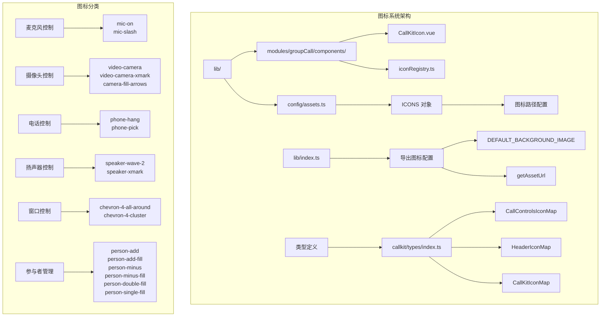
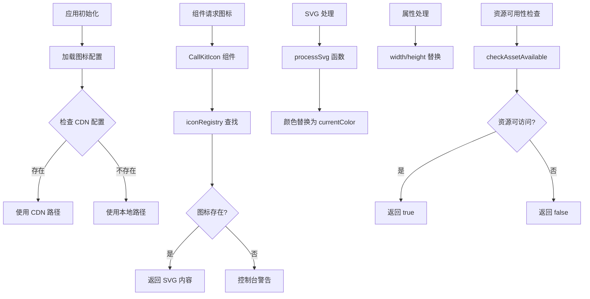
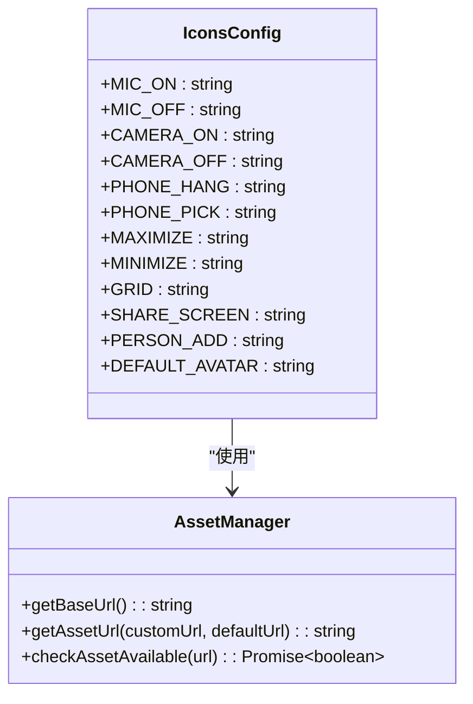
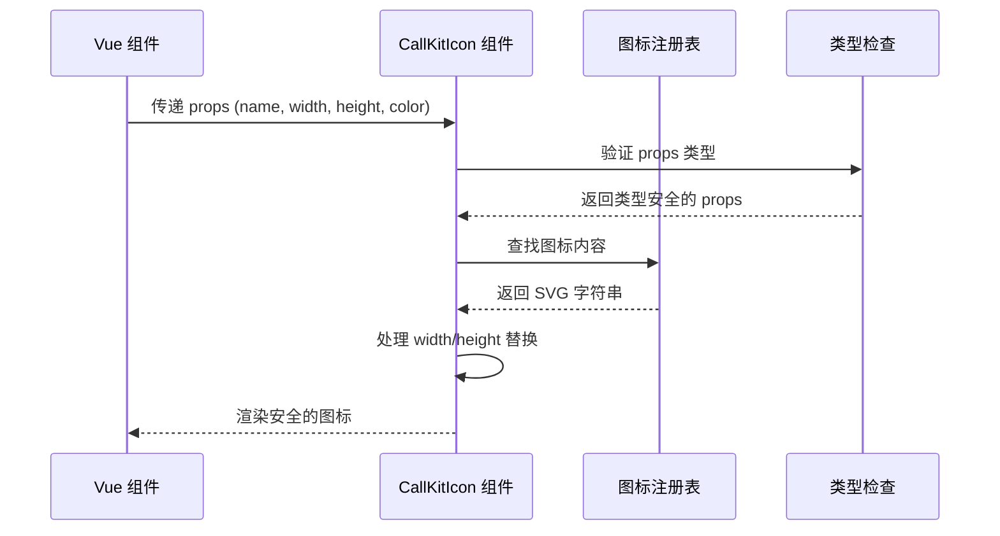
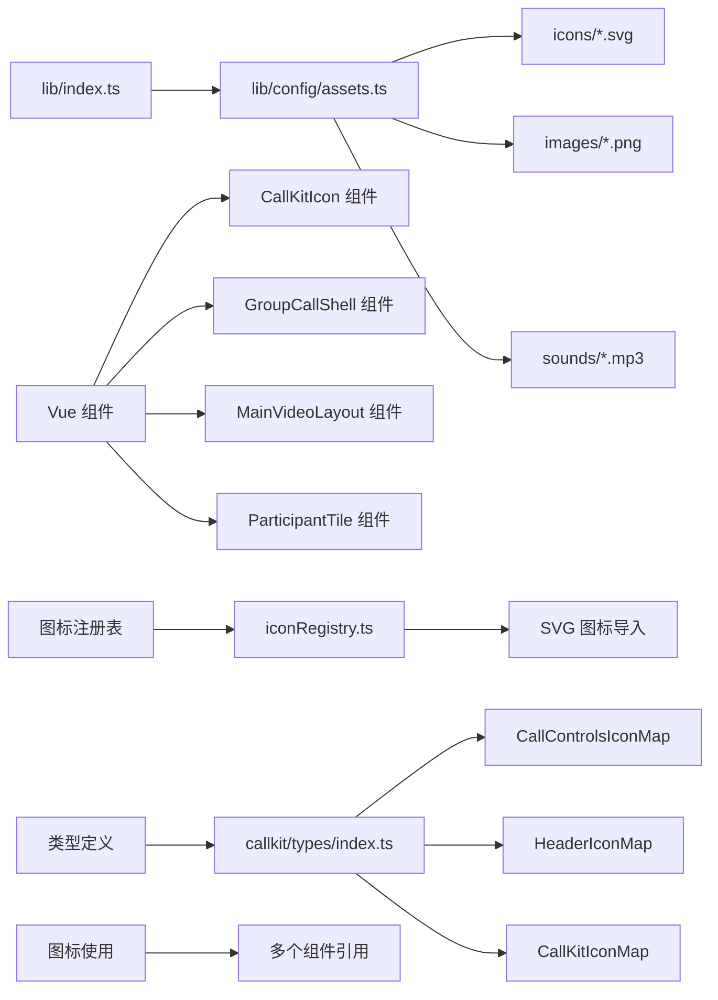

# 图标系统

<cite>
**本文档引用的文件**
- [README.md](file://README.md)
- [package.json](file://package.json)
- [lib/index.ts](file://lib/index.ts)
- [lib/config/assets.ts](file://lib/config/assets.ts)
- [lib/modules/groupCall/components/CallKitIcon.vue](file://lib/modules/groupCall/components/CallKitIcon.vue)
- [lib/modules/groupCall/components/iconRegistry.ts](file://lib/modules/groupCall/components/iconRegistry.ts)
- [lib/modules/groupCall/components/GroupCallShell.vue](file://lib/modules/groupCall/components/GroupCallShell.vue)
- [lib/modules/groupCall/components/MainVideoLayout.vue](file://lib/modules/groupCall/components/MainVideoLayout.vue)
- [lib/modules/groupCall/components/ParticipantTile.vue](file://lib/modules/groupCall/components/ParticipantTile.vue)
- [lib/callkit-static-assets/README.md](file://lib/callkit-static-assets/README.md)
- [callkit/types/index.ts](file://callkit/types/index.ts)
</cite>

## 更新摘要
**所做更改**
- 新增基于运行时 defineProps 的类型安全图标组件分析
- 更新 CallKitIcon 组件的类型定义和属性验证机制
- 增强图标注册表的类型安全性和 IDE 支持
- 完善图标系统的 TypeScript 类型定义和接口规范

## 目录
1. [简介](#简介)
2. [项目结构](#项目结构)
3. [核心组件](#核心组件)
4. [架构概览](#架构概览)
5. [详细组件分析](#详细组件分析)
6. [类型安全增强](#类型安全增强)
7. [依赖分析](#依赖分析)
8. [性能考虑](#性能考虑)
9. [故障排除指南](#故障排除指南)
10. [结论](#结论)

## 简介

图标系统是 Easemob Chat CallKit Vue3 插件的重要组成部分，负责提供高质量的 SVG 图标资源和静态资产管理系统。该系统提供了完整的音视频通话界面所需的图标集合，包括麦克风、摄像头、扬声器、电话控制等各类操作图标。

**更新** 图标系统已增强类型安全性，使用运行时 defineProps 定义 props，提供更好的类型安全性和 IDE 支持。

## 项目结构



**图表来源**
- [lib/modules/groupCall/components/CallKitIcon.vue:1-54](file://lib/modules/groupCall/components/CallKitIcon.vue#L1-L54)
- [lib/modules/groupCall/components/iconRegistry.ts:1-61](file://lib/modules/groupCall/components/iconRegistry.ts#L1-L61)
- [lib/config/assets.ts:1-75](file://lib/config/assets.ts#L1-L75)
- [callkit/types/index.ts:321-355](file://callkit/types/index.ts#L321-L355)

**章节来源**
- [README.md:5-31](file://README.md#L5-L31)
- [package.json:1-53](file://package.json#L1-L53)

## 核心组件

### 图标资源配置

图标系统的核心是 `assets.ts` 文件中的配置模块，它提供了统一的图标资源管理：

- **CDN 支持**：支持通过 CDN 基础路径配置，实现资源的远程托管
- **本地资源**：默认使用 `/callkit-static-assets/` 本地路径
- **动态路径解析**：根据配置自动选择合适的资源路径

### 图标类型定义

系统定义了完整的图标类型枚举，涵盖所有通话相关的操作：

| 功能类别 | 图标类型 | 文件名 | 用途描述 |
|---------|---------|--------|----------|
| 麦克风控制 | MIC_ON/MIC_OFF | mic_on.svg, mic_slash.svg | 音频输入开关控制 |
| 摄像头控制 | CAMERA_ON/CAMERA_OFF | video_camera.svg, video_camera_slash.svg | 视频输入开关控制 |
| 扬声器控制 | SPEAKER_ON/SPEAKER_OFF | speaker_wave_2.svg, speaker_xmark.svg | 音频输出开关控制 |
| 电话控制 | PHONE_HANG/PHONE_PICK | phone_hang.svg, phone_pick.svg | 通话挂断和接听控制 |
| 窗口控制 | MAXIMIZE/MINIMIZE | chevron_4_all_around.svg, chevron_4_cluster.svg | 窗口最大化和最小化 |
| 布局控制 | GRID/SHARE_SCREEN | boxes.svg, arrow_right_square_fill.svg | 网格布局和屏幕共享 |
| 参与者管理 | PERSON_ADD/PERSON_MINUS | person_add_fill.svg, person_minus_fill.svg | 成员添加和移除 |

**章节来源**
- [lib/config/assets.ts:36-51](file://lib/config/assets.ts#L36-L51)
- [lib/callkit-static-assets/README.md:198-212](file://lib/callkit-static-assets/README.md#L198-L212)

## 架构概览



**图表来源**
- [lib/config/assets.ts:19-26](file://lib/config/assets.ts#L19-L26)
- [lib/modules/groupCall/components/CallKitIcon.vue:22-32](file://lib/modules/groupCall/components/CallKitIcon.vue#L22-L32)
- [lib/modules/groupCall/components/iconRegistry.ts:23-34](file://lib/modules/groupCall/components/iconRegistry.ts#L23-L34)
- [lib/config/assets.ts:67-74](file://lib/config/assets.ts#L67-L74)

## 详细组件分析

### 资源路径管理系统

图标系统实现了灵活的资源路径管理机制：

#### 基础路径配置
- **CDN_BASE_URL**：可选的 CDN 基础路径配置
- **LOCAL_BASE_URL**：默认本地资源路径 `/callkit-static-assets`
- **getBaseUrl 函数**：智能路径选择逻辑

#### 图标映射系统
通过 `ICONS` 对象提供统一的图标访问接口：



**图表来源**
- [lib/config/assets.ts:36-51](file://lib/config/assets.ts#L36-L51)
- [lib/config/assets.ts:19-26](file://lib/config/assets.ts#L19-L26)

#### 资源可用性检测

系统提供了完善的资源检测机制：

- **异步检测**：使用 `Image.onload` 和 `Image.onerror` 事件
- **Promise 返回**：标准化的异步处理接口
- **调试支持**：便于开发过程中检测资源加载问题

**章节来源**
- [lib/config/assets.ts:59-74](file://lib/config/assets.ts#L59-L74)

### 图标分类详解

#### 麦克风控制图标
- **开启状态**：`mic-on` - 表示音频输入正常工作
- **关闭状态**：`mic-slash` - 表示音频输入被静音或禁用

#### 摄像头控制图标
- **基本摄像头**：`video-camera` - 标准摄像头图标
- **摄像头关闭**：`video-camera-xmark` - 摄像头被禁用状态
- **摄像头切换**：`camera-fill-arrows` - 摄像头切换操作

#### 电话控制图标
- **接听图标**：`phone-pick` - 通话接听操作
- **挂断图标**：`phone-hang` - 通话结束操作

#### 界面控制图标
- **最大化**：`chevron-4-all-around` - 全屏显示
- **最小化**：`chevron-4-cluster` - 退出全屏
- **网格布局**：`boxes` - 网格视图模式
- **屏幕共享**：`arrow-right-square-fill` - 屏幕共享功能

**章节来源**
- [lib/callkit-static-assets/README.md:15-47](file://lib/callkit-static-assets/README.md#L15-L47)

## 类型安全增强

**更新** 图标系统已显著增强类型安全性，主要体现在以下几个方面：

### 运行时 defineProps 类型定义

#### CallKitIcon 组件类型安全
```typescript
interface Props {
  name: string
  width?: number | string
  height?: number | string
  color?: string
}

const props = withDefaults(defineProps<Props>(), {
  width: 24,
  height: 24,
  color: 'currentColor',
})
```

#### 图标注册表类型安全
```typescript
export const iconRegistry: Record<string, string> = {
  'arrow-right-square-fill': processSvg(arrowRightSquareFill),
  'boxes': processSvg(boxes),
  'camera-fill-arrows': processSvg(cameraFillArrows),
  // ... 更多图标
}

export const iconNames = Object.keys(iconRegistry) as string[]
```

### React 组件类型定义

#### 自定义图标组件类型
```typescript
export interface CallControlsIconMap {
  micOn?: CustomIconComponent;
  micOff?: CustomIconComponent;
  cameraOn?: CustomIconComponent;
  cameraOff?: CustomIconComponent;
  cameraFlip?: CustomIconComponent;
  speakerOn?: CustomIconComponent;
  speakerOff?: CustomIconComponent;
  hangup?: CustomIconComponent;
  accept?: CustomIconComponent;
  reject?: CustomIconComponent;
  screenShare?: CustomIconComponent;
  screenShareStop?: CustomIconComponent;
}
```

### 类型安全的图标渲染流程



**图表来源**
- [lib/modules/groupCall/components/CallKitIcon.vue:9-20](file://lib/modules/groupCall/components/CallKitIcon.vue#L9-L20)
- [lib/modules/groupCall/components/iconRegistry.ts:36-61](file://lib/modules/groupCall/components/iconRegistry.ts#L36-L61)

**章节来源**
- [lib/modules/groupCall/components/CallKitIcon.vue:5-42](file://lib/modules/groupCall/components/CallKitIcon.vue#L5-L42)
- [lib/modules/groupCall/components/iconRegistry.ts:1-61](file://lib/modules/groupCall/components/iconRegistry.ts#L1-L61)
- [callkit/types/index.ts:321-355](file://callkit/types/index.ts#L321-L355)

## 依赖分析



**图表来源**
- [lib/index.ts:1-66](file://lib/index.ts#L1-L66)
- [lib/config/assets.ts:1-75](file://lib/config/assets.ts#L1-L75)
- [lib/modules/groupCall/components/CallKitIcon.vue:1-54](file://lib/modules/groupCall/components/CallKitIcon.vue#L1-L54)

### 外部依赖关系

图标系统主要依赖于以下外部资源：

- **SVG 图标文件**：21个高质量的矢量图标
- **PNG 背景图片**：默认通话背景图
- **MP3 音频文件**：来电和呼出铃声（需要用户自备）

### 内部耦合度分析

- **低耦合设计**：图标配置与业务逻辑分离
- **高内聚模块**：资源管理功能集中在单一文件
- **清晰接口**：通过导出函数和对象提供统一访问
- **类型安全**：完整的 TypeScript 类型定义确保编译时检查

**章节来源**
- [lib/index.ts:53-54](file://lib/index.ts#L53-L54)
- [lib/config/assets.ts:36-51](file://lib/config/assets.ts#L36-L51)

## 性能考虑

### 资源优化策略

1. **SVG 矢量格式**：所有图标采用 SVG 格式，支持任意缩放且文件体积小
2. **按需加载**：通过配置系统实现资源的延迟加载
3. **缓存友好**：静态资源路径便于浏览器缓存
4. **运行时类型检查**：减少运行时错误，提高应用稳定性

### 加载性能指标

- **图标文件大小**：所有 SVG 图标总大小约 20KB
- **背景图片**：`callkit_bg.png` 大小为 71.8KB
- **内存占用**：SVG 图标无需额外内存渲染
- **类型检查开销**：运行时 defineProps 类型检查对性能影响微乎其微

## 故障排除指南

### 常见问题及解决方案

#### 图标无法显示
1. **检查资源路径**：确认 CDN 配置或本地路径设置正确
2. **验证文件存在**：检查对应 SVG 文件是否存在于指定目录
3. **网络连接**：如果是 CDN 资源，检查网络连接状态
4. **类型检查**：确认传入的图标名称在 iconRegistry 中存在

#### 资源加载失败
1. **使用检测函数**：调用 `checkAssetAvailable` 函数验证资源可访问性
2. **检查 MIME 类型**：确保服务器正确配置 SVG 文件的 MIME 类型
3. **跨域问题**：CDN 资源需要正确的 CORS 配置

#### 自定义图标不生效
1. **URL 格式**：确保自定义 URL 格式正确且可访问
2. **路径解析**：确认 `getAssetUrl` 函数正确处理了自定义参数
3. **缓存清理**：清除浏览器缓存重新加载资源
4. **类型安全**：确认自定义图标组件符合 CustomIconComponent 类型定义

#### 类型错误处理
1. **Props 类型**：检查传入 CallKitIcon 的 props 是否符合定义
2. **图标名称**：确认图标名称字符串与 iconRegistry 键名匹配
3. **默认值**：验证 withDefaults 设置的默认值是否合理

**章节来源**
- [lib/config/assets.ts:67-74](file://lib/config/assets.ts#L67-L74)
- [lib/config/assets.ts:59-61](file://lib/config/assets.ts#L59-L61)
- [lib/modules/groupCall/components/CallKitIcon.vue:22-27](file://lib/modules/groupCall/components/CallKitIcon.vue#L22-L27)

## 结论

图标系统通过精心设计的资源配置和管理机制，为音视频通话界面提供了完整而高效的图标解决方案。系统具有以下优势：

1. **灵活性强**：支持本地和 CDN 两种资源管理模式
2. **维护简单**：统一的配置接口便于管理和扩展
3. **性能优秀**：SVG 格式图标保证了良好的视觉质量和加载性能
4. **易于集成**：清晰的 API 设计降低了集成复杂度
5. **类型安全**：完整的 TypeScript 类型定义提供编译时安全保障
6. **IDE 支持**：运行时 defineProps 提供优秀的开发体验

**更新** 新的类型安全增强使图标系统在保持原有优势的基础上，进一步提升了开发效率和应用稳定性。运行时类型检查确保了 props 的正确性，而完整的类型定义为开发者提供了更好的 IDE 支持和代码提示。

该系统为开发者提供了可靠的图标资源管理基础，能够满足各种音视频通话应用场景的需求，并为未来的功能扩展奠定了坚实的技术基础。