# 群组通话模块

<cite>
**本文档引用的文件**
- [README.md](file://README.md)
- [index.ts](file://lib/index.ts)
- [types.ts](file://lib/types.ts)
- [groupCall/index.ts](file://lib/modules/groupCall/index.ts)
- [EasemobChatMultiCall.vue](file://lib/components/multiCall/EasemobChatMultiCall.vue)
- [useParticipants.ts](file://lib/composables/useParticipants.ts)
- [callState.ts](file://lib/store/callState.ts)
- [GroupCallStore.ts](file://lib/modules/groupCall/viewModel/GroupCallStore.ts)
- [GroupCallShell.vue](file://lib/modules/groupCall/components/GroupCallShell.vue)
- [useGroupCallViewModel.ts](file://lib/modules/groupCall/viewModel/useGroupCallViewModel.ts)
- [CallService.ts](file://lib/services/CallService.ts)
- [useSignalManager.ts](file://lib/composables/useSignalManager.ts)
- [callstate.types.ts](file://lib/types/callstate.types.ts)
- [groupCall/types.ts](file://lib/modules/groupCall/types.ts)
- [featureFlags.ts](file://lib/config/featureFlags.ts)
- [RtcMediaBridge.ts](file://lib/modules/groupCall/media/RtcMediaBridge.ts)
- [RtcService.ts](file://lib/services/RtcService.ts)
- [CallKitIcon.vue](file://lib/modules/groupCall/components/CallKitIcon.vue)
- [iconRegistry.ts](file://lib/modules/groupCall/components/iconRegistry.ts)
- [MainVideoLayout.vue](file://lib/modules/groupCall/components/MainVideoLayout.vue)
- [VideoGrid.vue](file://lib/modules/groupCall/components/VideoGrid.vue)
- [ParticipantTile.vue](file://lib/modules/groupCall/components/ParticipantTile.vue)
- [GroupCallShell.css](file://lib/modules/groupCall/components/GroupCallShell.css)
- [VideoGrid.css](file://lib/modules/groupCall/components/VideoGrid.css)
- [ParticipantTile.css](file://lib/modules/groupCall/components/ParticipantTile.css)
- [useDraggable.ts](file://lib/composables/useDraggable.ts)
</cite>

## 更新摘要
**所做更改**
- 新增了完整的图标系统文档，包括 CallKitIcon 组件和 iconRegistry 的实现
- 新增了拖拽定位功能，GroupCallShell 集成 useDraggable 组合式函数实现可拖拽窗口
- 新增了主视频布局组件 MainVideoLayout 的详细说明
- 新增了 CSS 文件重构的完整分析，涵盖三个核心样式文件
- 扩展了状态管理部分，增加了新的 GroupCallStore 功能
- 更新了 UI 组件架构，展示了新的双模式布局系统
- 新增了本地通话计时器系统，提供精确的通话时长统计
- 优化了视频播放系统，增强了视频渲染和播放的稳定性
- 改进了样式系统，支持响应式设计和主题定制

## 目录
1. [简介](#简介)
2. [项目结构](#项目结构)
3. [核心组件](#核心组件)
4. [架构概览](#架构概览)
5. [详细组件分析](#详细组件分析)
6. [依赖关系分析](#依赖关系分析)
7. [性能考虑](#性能考虑)
8. [故障排除指南](#故障排除指南)
9. [结论](#结论)

## 简介

群组通话模块是 Easemob Chat CallKit Vue3 插件的核心功能之一，提供了完整的多人音视频通话解决方案。该模块支持音频和视频两种模式的群组通话，具备智能参与者管理、实时状态同步、信令传输等功能。

模块采用现代化的 Vue3 组合式 API 架构，结合 Pinia 状态管理，实现了高可维护性和扩展性的设计。通过新的群组通话模块架构，系统能够更好地处理复杂的多人通话场景，提供流畅的用户体验。

**更新** 新增媒体桥接组件的清理程序改进，确保群组通话销毁时不会永久禁用自动订阅状态，并优化了用户发布事件处理机制。同时，模块经历了全面的 UI 重新设计，包括全新的图标系统、主视频布局和 CSS 文件重构。新增的本地通话计时器系统提供了精确的通话时长统计功能，视频播放系统得到了显著优化，样式系统支持响应式设计和主题定制。**新增** GroupCallShell 组件集成了 useDraggable 组合式函数，实现了可拖拽的窗口定位功能，包括拖拽检测系统、居中定位、视觉反馈增强等新特性。

## 项目结构

项目采用模块化组织方式，主要包含以下核心目录：

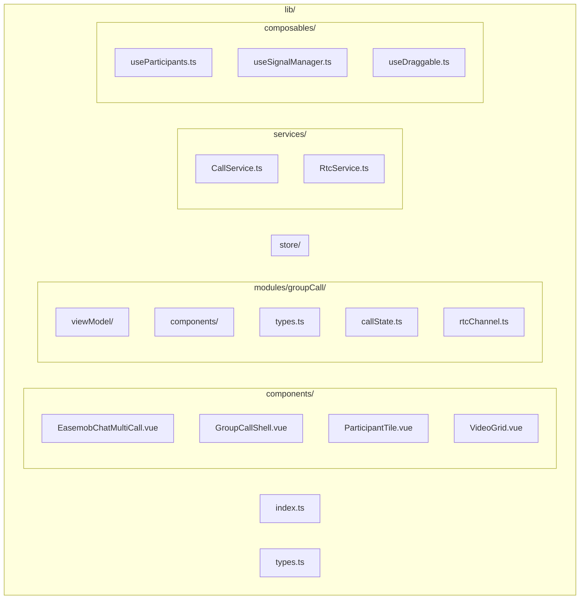

**图表来源**
- [index.ts:1-67](file://lib/index.ts#L1-L67)
- [groupCall/index.ts:1-18](file://lib/modules/groupCall/index.ts#L1-L18)

**章节来源**
- [README.md:5-31](file://README.md#L5-L31)
- [index.ts:1-67](file://lib/index.ts#L1-L67)

## 核心组件

### 群组通话外壳组件

GroupCallShell 是新架构的核心组件，负责管理整个群组通话的界面和交互逻辑：

```mermaid
classDiagram
class GroupCallShell {
+groupId : string
+groupName : string
+currentUserId : string
+rtcService : RtcService
+participants : Participant[]
+localParticipant : Participant
+formattedDuration : string
+shellRef : Ref<HTMLElement>
+isDragging : Ref<boolean>
+hasDragged : Ref<boolean>
+startSession(payload)
+addRemoteParticipant()
+markRemoteAccepted()
+bindRtcService()
+unbindRtcService()
+sendInvite()
+toggleMute()
+toggleCamera()
+handleHangup()
}
class VideoGrid {
+participants : Participant[]
+renderVideoTiles()
}
class ParticipantTile {
+participant : Participant
+renderParticipantInfo()
+renderAudioIndicator()
}
class DraggableHook {
+elementRef : Ref<HTMLElement>
+isDragging : Ref<boolean>
+hasDragged : Ref<boolean>
+position : Ref<{x, y}>
+style : Ref<CSSProperties>
+startDrag(e)
+stopDrag()
}
GroupCallShell --> VideoGrid : "包含"
GroupCallShell --> DraggableHook : "集成"
VideoGrid --> ParticipantTile : "渲染"
```

**更新** GroupCallShell 现在集成了 useDraggable 组合式函数，提供了完整的拖拽定位功能，包括拖拽检测、位置跟踪和视觉反馈。

**图表来源**
- [GroupCallShell.vue:46-175](file://lib/modules/groupCall/components/GroupCallShell.vue#L46-L175)
- [GroupCallStore.ts:10-223](file://lib/modules/groupCall/viewModel/GroupCallStore.ts#L10-L223)
- [useDraggable.ts:78-263](file://lib/composables/useDraggable.ts#L78-L263)

### 拖拽定位系统

**新增** GroupCallShell 集成了 useDraggable 组合式函数，实现了完整的拖拽定位系统：

```mermaid
classDiagram
class useDraggable {
+options : DraggableOptions
+elementRef : Ref<HTMLElement>
+isDragging : Ref<boolean>
+hasDragged : Ref<boolean>
+position : Ref<{x, y}>
+style : Ref<CSSProperties>
+startDrag(e)
+stopDrag()
+getCenterPosition()
+clampPosition(x, y)
+handleMove(e)
+handleResize()
}
class DraggableOptions {
+initialX : number
+initialY : number
+centered : boolean
+width : number
+height : number
+boundary : boolean
+boundaryPadding : number
+onDragStart : Function
+onDragEnd : Function
}
class DraggableReturn {
+elementRef : Ref<HTMLElement>
+isDragging : Ref<boolean>
+hasDragged : Ref<boolean>
+position : Ref<{x, y}>
+style : Ref<CSSProperties>
+startDrag : Function
+stopDrag : Function
}
useDraggable --> DraggableOptions : "配置"
useDraggable --> DraggableReturn : "返回"
```

**更新** 新的拖拽系统支持居中定位、边界限制、触摸事件支持、窗口大小变化处理等高级功能。

**图表来源**
- [useDraggable.ts:3-39](file://lib/composables/useDraggable.ts#L3-L39)
- [useDraggable.ts:78-263](file://lib/composables/useDraggable.ts#L78-L263)

### 群组通话存储管理

新的群组通话模块引入了专门的状态管理 store：

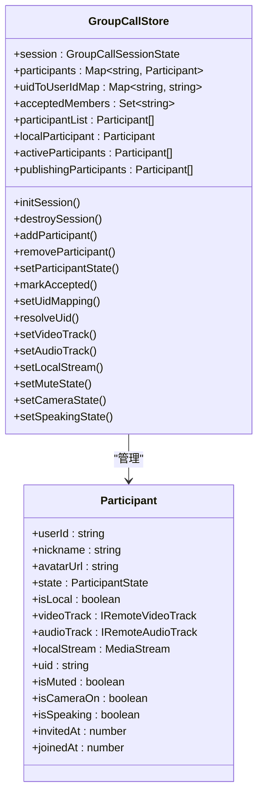

**图表来源**
- [GroupCallStore.ts:10-223](file://lib/modules/groupCall/viewModel/GroupCallStore.ts#L10-L223)
- [groupCall/types.ts:16-40](file://lib/modules/groupCall/types.ts#L16-L40)

### 媒体桥接组件

**新增** 媒体桥接组件是群组通话模块的关键组件，负责监听 Agora 事件、订阅远程流并将 track 写入 GroupCallStore：

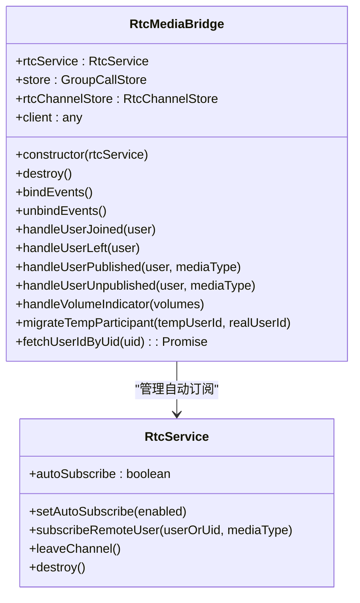

**更新** 媒体桥接组件的 `destroy()` 方法现在包含显式的自动订阅状态恢复，确保群组通话销毁时不会永久禁用自动订阅状态。

**图表来源**
- [RtcMediaBridge.ts:13-33](file://lib/modules/groupCall/media/RtcMediaBridge.ts#L13-L33)
- [RtcMediaBridge.ts:29-33](file://lib/modules/groupCall/media/RtcMediaBridge.ts#L29-L33)
- [RtcService.ts:108-113](file://lib/services/RtcService.ts#L108-L113)

### 全新的图标系统

**新增** 模块引入了完整的图标系统，提供统一的图标管理和渲染机制：

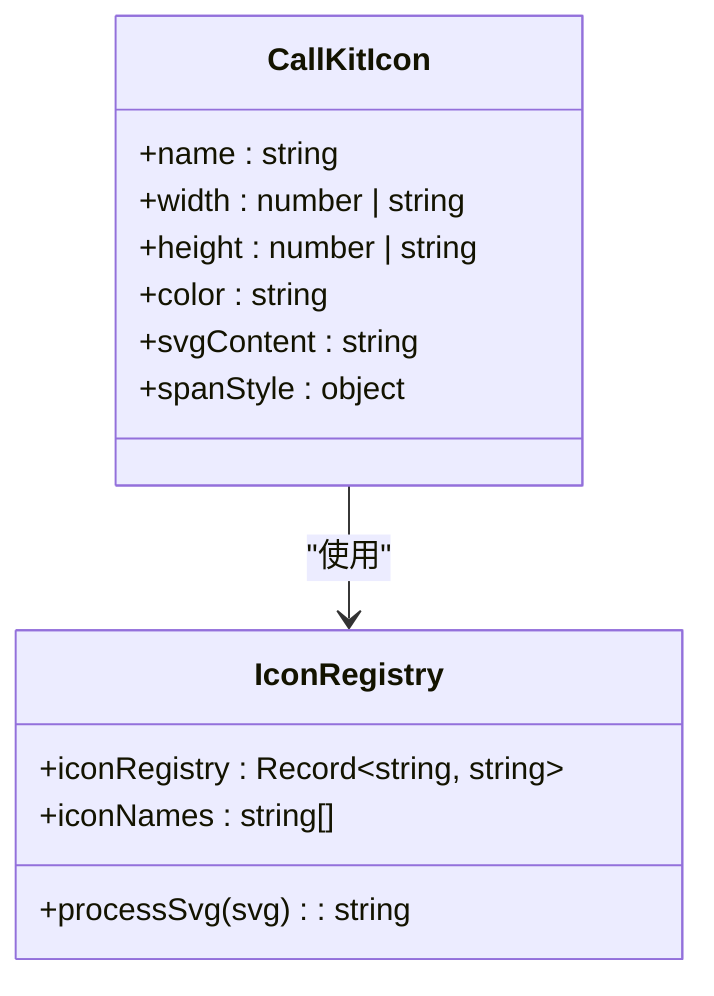

**图表来源**
- [CallKitIcon.vue:1-54](file://lib/modules/groupCall/components/CallKitIcon.vue#L1-L54)
- [iconRegistry.ts:1-61](file://lib/modules/groupCall/components/iconRegistry.ts#L1-L61)

### 主视频布局组件

**新增** 主视频布局组件提供了专业的主视频模式，支持缩略图导航和流畅的切换体验：

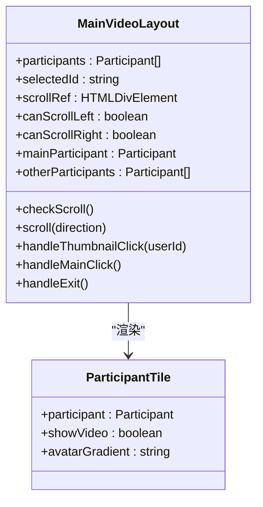

**图表来源**
- [MainVideoLayout.vue:1-118](file://lib/modules/groupCall/components/MainVideoLayout.vue#L1-L118)
- [ParticipantTile.vue:1-139](file://lib/modules/groupCall/components/ParticipantTile.vue#L1-L139)

### CSS 文件重构

**新增** 模块完成了全面的 CSS 文件重构，包含三个核心样式文件：

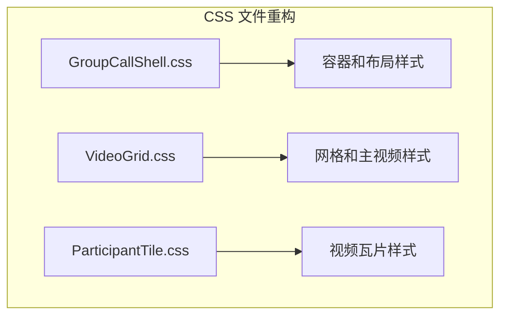

**图表来源**
- [GroupCallShell.css:1-258](file://lib/modules/groupCall/components/GroupCallShell.css#L1-L258)
- [VideoGrid.css:1-171](file://lib/modules/groupCall/components/VideoGrid.css#L1-L171)
- [ParticipantTile.css:1-169](file://lib/modules/groupCall/components/ParticipantTile.css#L1-L169)

### 本地通话计时器系统

**新增** 模块引入了精确的本地通话计时器系统，提供实时的通话时长统计：

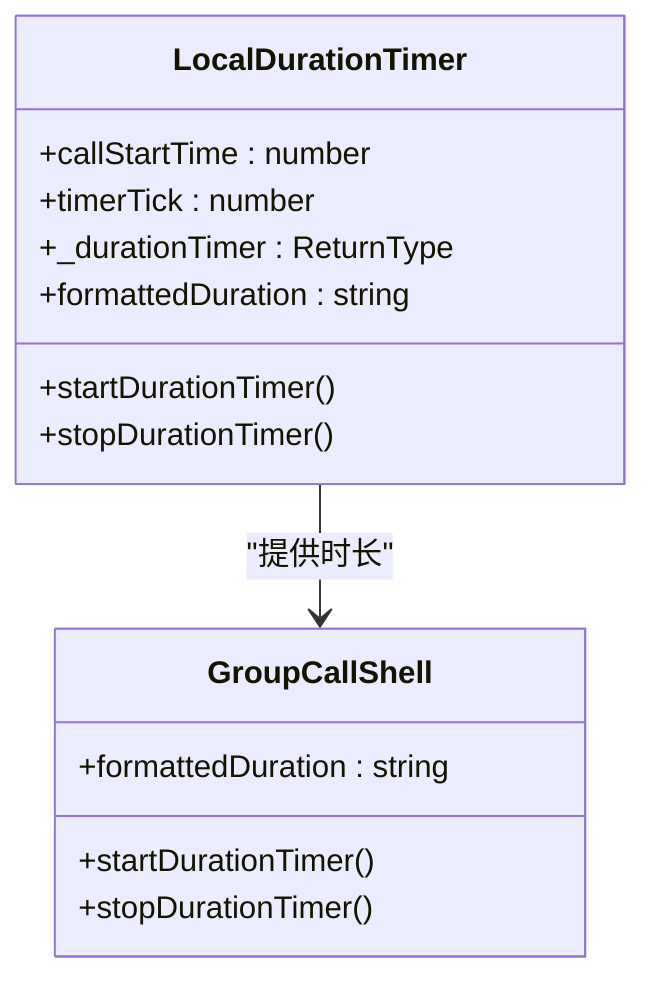

**更新** 新增的本地计时器系统独立于 ViewModel，确保计时器的精确性和稳定性。

**图表来源**
- [GroupCallShell.vue:128-160](file://lib/modules/groupCall/components/GroupCallShell.vue#L128-L160)
- [useGroupCallViewModel.ts:61-76](file://lib/modules/groupCall/viewModel/useGroupCallViewModel.ts#L61-L76)

### 视频播放系统优化

**新增** 视频播放系统经过重大优化，增强了视频渲染和播放的稳定性：

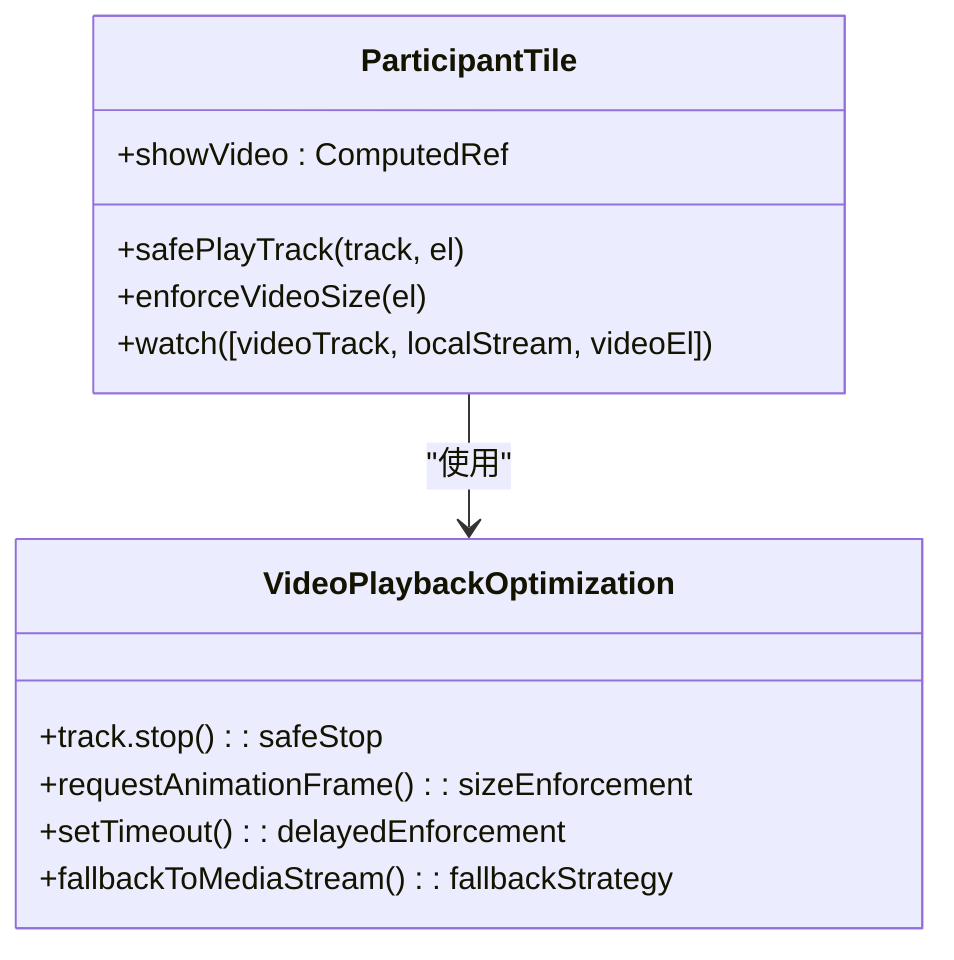

**更新** 新的视频播放系统支持多种播放策略，包括 Agora track.play() 和 MediaStream 回退方案，确保在各种环境下都能稳定播放视频。

**图表来源**
- [ParticipantTile.vue:101-171](file://lib/modules/groupCall/components/ParticipantTile.vue#L101-L171)

**章节来源**
- [GroupCallShell.vue:1-300](file://lib/modules/groupCall/components/GroupCallShell.vue#L1-L300)
- [GroupCallStore.ts:1-223](file://lib/modules/groupCall/viewModel/GroupCallStore.ts#L1-L223)
- [RtcMediaBridge.ts:1-282](file://lib/modules/groupCall/media/RtcMediaBridge.ts#L1-L282)
- [CallKitIcon.vue:1-54](file://lib/modules/groupCall/components/CallKitIcon.vue#L1-L54)
- [MainVideoLayout.vue:1-118](file://lib/modules/groupCall/components/MainVideoLayout.vue#L1-L118)
- [GroupCallShell.css:1-258](file://lib/modules/groupCall/components/GroupCallShell.css#L1-L258)
- [GroupCallShell.vue:128-160](file://lib/modules/groupCall/components/GroupCallShell.vue#L128-L160)
- [ParticipantTile.vue:101-171](file://lib/modules/groupCall/components/ParticipantTile.vue#L101-L171)
- [useDraggable.ts:78-263](file://lib/composables/useDraggable.ts#L78-L263)

## 架构概览

群组通话模块采用了分层架构设计，确保各层职责清晰分离：

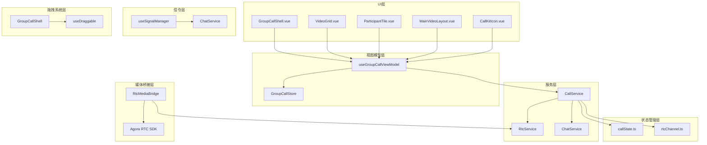

**更新** 新增了拖拽系统层，GroupCallShell 通过 useDraggable 组合式函数实现可拖拽窗口定位功能。

**图表来源**
- [index.ts:1-67](file://lib/index.ts#L1-L67)
- [CallService.ts:9-359](file://lib/services/CallService.ts#L9-L359)
- [useSignalManager.ts:50-354](file://lib/composables/useSignalManager.ts#L50-L354)
- [RtcMediaBridge.ts:1-282](file://lib/modules/groupCall/media/RtcMediaBridge.ts#L1-L282)
- [useDraggable.ts:78-263](file://lib/composables/useDraggable.ts#L78-L263)

## 详细组件分析

### 通话状态管理

通话状态管理是整个群组通话系统的核心，负责维护通话的生命周期和状态转换：

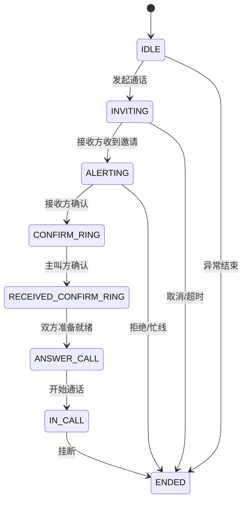

**图表来源**
- [callstate.types.ts:12-22](file://lib/types/callstate.types.ts#L12-L22)
- [callState.ts:11-37](file://lib/store/callState.ts#L11-L37)

### 信令传输流程

群组通话的信令传输采用统一的管理器模式，确保各种信令的标准化处理：

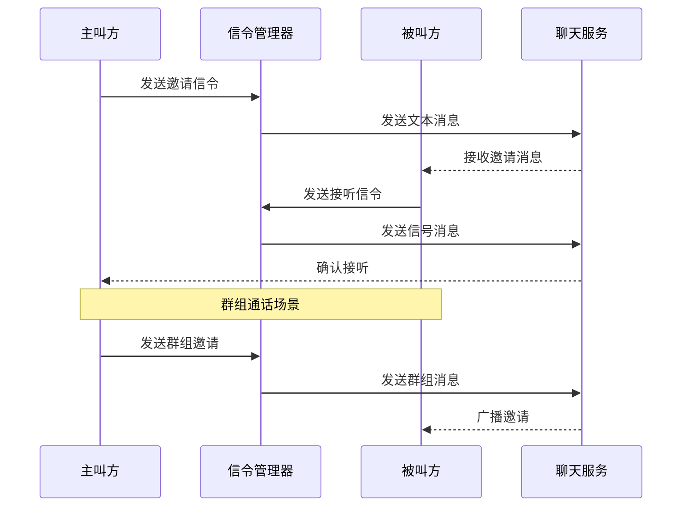

**图表来源**
- [useSignalManager.ts:73-102](file://lib/composables/useSignalManager.ts#L73-L102)
- [CallService.ts:112-180](file://lib/services/CallService.ts#L112-L180)

### 参与者管理机制

新架构引入了智能的参与者管理机制，能够自动处理参与者的加入、离开和状态变化：

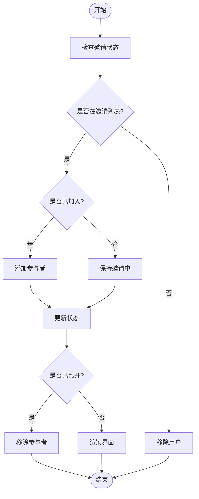

**图表来源**
- [useParticipants.ts:29-116](file://lib/composables/useParticipants.ts#L29-L116)
- [GroupCallStore.ts:59-92](file://lib/modules/groupCall/viewModel/GroupCallStore.ts#L59-L92)

### 拖拽定位系统实现

**新增** GroupCallShell 集成了 useDraggable 组合式函数，实现了完整的拖拽定位系统：

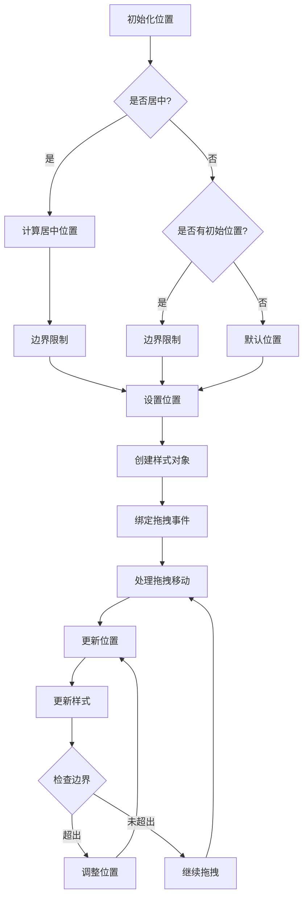

**更新** 新的拖拽系统支持居中定位、边界限制、触摸事件、窗口大小变化处理等高级功能，提供了流畅的用户体验。

**图表来源**
- [useDraggable.ts:98-145](file://lib/composables/useDraggable.ts#L98-L145)
- [useDraggable.ts:174-190](file://lib/composables/useDraggable.ts#L174-L190)
- [useDraggable.ts:229-241](file://lib/composables/useDraggable.ts#L229-L241)

### 媒体桥接清理程序改进

**新增** 媒体桥接组件的清理程序经过重要改进，确保在销毁时正确恢复自动订阅状态：

```mermaid
flowchart TD
Destroy[destroy() 调用] --> UnbindEvents[解绑事件监听]
UnbindEvents --> RestoreAutoSubscribe[恢复自动订阅状态]
RestoreAutoSubscribe --> SetAutoSubscribeTrue[调用 setAutoSubscribe(true)]
SetAutoSubscribeTrue --> PreventPermanentDisable[防止永久禁用自动订阅]
PreventPermanentDisable --> End([完成清理])
```

**更新** 新的清理程序确保群组通话媒体桥接销毁时不会永久禁用自动订阅状态，避免影响单聊等旧流程。

**图表来源**
- [RtcMediaBridge.ts:29-33](file://lib/modules/groupCall/media/RtcMediaBridge.ts#L29-L33)
- [RtcService.ts:108-113](file://lib/services/RtcService.ts#L108-L113)

### 增强的用户发布事件处理

**新增** 媒体桥接组件还包括增强的用户发布事件处理，传递原始 UID 而非用户对象：

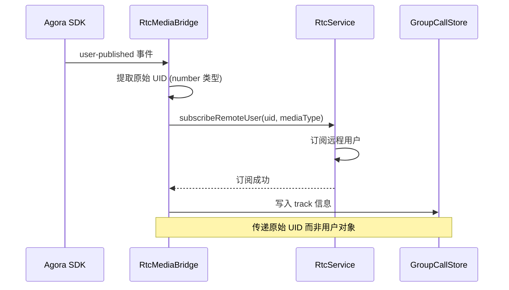

**更新** 用户发布事件处理现在传递原始 UID 而非用户对象，与服务层变更保持一致，避免 SDK 内部引用不匹配导致的问题。

**图表来源**
- [RtcMediaBridge.ts:134-155](file://lib/modules/groupCall/media/RtcMediaBridge.ts#L134-L155)
- [RtcService.ts:416-443](file://lib/services/RtcService.ts#L416-L443)

### 图标系统实现

**新增** 完整的图标系统实现了统一的图标管理和渲染机制：

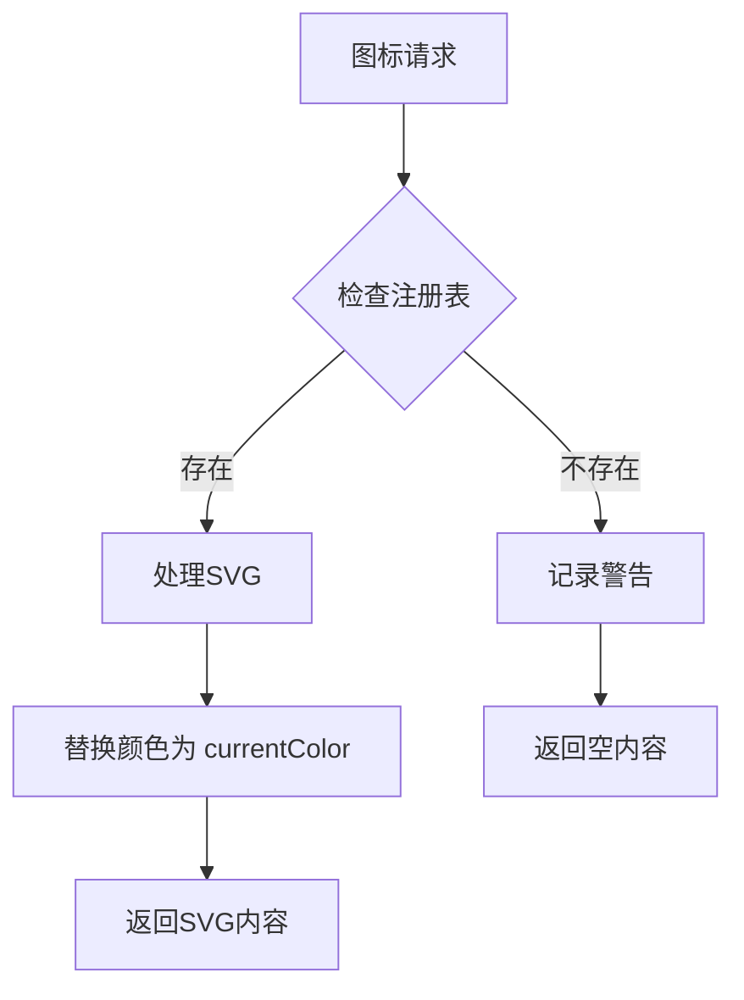

**更新** 图标系统支持动态颜色替换，所有图标都使用 currentColor 以便于主题定制。

**图表来源**
- [CallKitIcon.vue:22-32](file://lib/modules/groupCall/components/CallKitIcon.vue#L22-L32)
- [iconRegistry.ts:26-34](file://lib/modules/groupCall/components/iconRegistry.ts#L26-L34)

### 主视频布局功能

**新增** 主视频布局提供了专业的视频切换和导航功能：

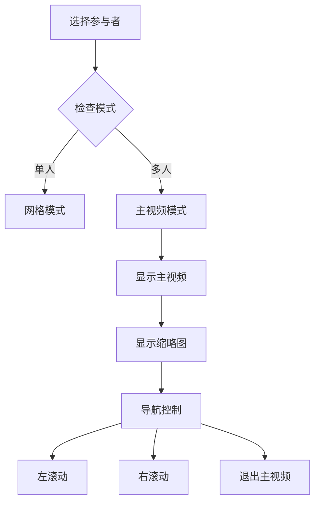

**更新** 主视频布局支持平滑的缩略图滚动和一键退出功能。

**图表来源**
- [MainVideoLayout.vue:71-108](file://lib/modules/groupCall/components/MainVideoLayout.vue#L71-L108)
- [VideoGrid.vue:3-20](file://lib/modules/groupCall/components/VideoGrid.vue#L3-L20)

### CSS 样式系统重构

**新增** 全面的 CSS 重构提供了现代化的样式系统：

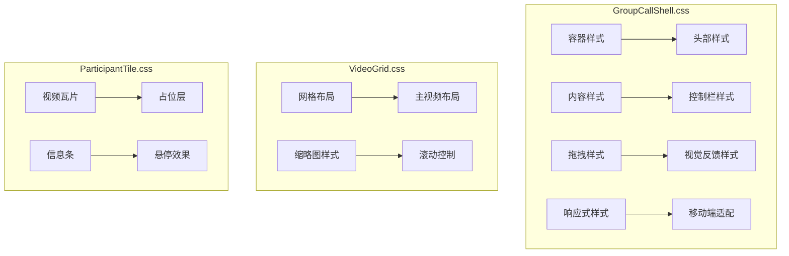

**更新** 新的样式系统采用现代化的设计语言，支持深色主题和响应式布局，**新增** 拖拽状态的视觉反馈样式。

**图表来源**
- [GroupCallShell.css:1-258](file://lib/modules/groupCall/components/GroupCallShell.css#L1-L258)
- [VideoGrid.css:1-171](file://lib/modules/groupCall/components/VideoGrid.css#L1-L171)
- [ParticipantTile.css:1-169](file://lib/modules/groupCall/components/ParticipantTile.css#L1-L169)

### 本地通话计时器系统

**新增** 精确的本地通话计时器系统提供了实时的通话时长统计：

```mermaid
flowchart TD
StartTimer[startDurationTimer] --> ClearTimer[清除现有定时器]
ClearTimer --> SetStartTime[设置开始时间]
SetStartTime --> StartInterval[启动1秒定时器]
StartInterval --> UpdateTick[更新计数器]
UpdateTick --> ComputeDuration[计算通话时长]
ComputeDuration --> FormatTime[格式化时间显示]
FormatTime --> UpdateComputed[更新computed属性]
UpdateComputed --> WaitNextTick[等待下一次tick]
WaitNextTick --> StartInterval
StopTimer[stopDurationTimer] --> ClearInterval[清除定时器]
ClearInterval --> ResetValues[重置时间和计数器]
ResetValues --> End([结束])
```

**更新** 新的计时器系统独立于 ViewModel，确保计时器的精确性和稳定性，避免与其他组件的相互影响。

**图表来源**
- [GroupCallShell.vue:128-160](file://lib/modules/groupCall/components/GroupCallShell.vue#L128-L160)
- [useGroupCallViewModel.ts:61-76](file://lib/modules/groupCall/viewModel/useGroupCallViewModel.ts#L61-L76)

### 视频播放系统优化

**新增** 视频播放系统经过重大优化，增强了视频渲染和播放的稳定性：

```mermaid
flowchart TD
WatchTrack[watch(videoTrack, localStream, videoEl)] --> CheckLocal{是否本地用户?}
CheckLocal --> |是| CheckTrack{是否有videoTrack?}
CheckLocal --> |否| CheckRemoteTrack{是否有remote videoTrack?}
CheckTrack --> |是| SafePlayTrack[调用safePlayTrack]
SafePlayTrack --> EnforceSize[强制设置视频尺寸]
EnforceSize --> RequestAnimFrame[requestAnimationFrame]
RequestAnimFrame --> SetTimeout[setTimeout多次强制]
SetTimeout --> End([完成])
CheckTrack --> |否| CheckLocalStream{是否有localStream?}
CheckLocalStream --> |是| UseMediaStream[使用MediaStream]
UseMediaStream --> PlayVideo[播放视频]
PlayVideo --> EnforceSize
CheckLocalStream --> |否| End
CheckRemoteTrack --> |是| SafePlayTrack
SafePlayTrack --> EnforceSize
CheckRemoteTrack --> |否| StopVideo[停止视频播放]
StopVideo --> End
```

**更新** 新的视频播放系统支持多种播放策略，包括 Agora track.play() 和 MediaStream 回退方案，确保在各种环境下都能稳定播放视频。

**图表来源**
- [ParticipantTile.vue:101-171](file://lib/modules/groupCall/components/ParticipantTile.vue#L101-L171)

### 拖拽检测系统

**新增** 拖拽检测系统提供了精确的拖拽状态跟踪和视觉反馈：

```mermaid
flowchart TD
MouseDown[鼠标按下] --> CheckButton{是否左键?}
CheckButton --> |否| Ignore[忽略事件]
CheckButton --> |是| SetDragging[设置拖拽状态]
SetDragging --> CalcOffset[计算拖拽偏移]
CalcOffset --> BindEvents[绑定全局事件]
BindEvents --> MouseMove[鼠标移动]
MouseMove --> UpdatePosition[更新位置]
UpdatePosition --> CheckBoundary{检查边界}
CheckBoundary --> |超出| AdjustPosition[调整位置]
CheckBoundary --> |未超出| ContinueMove[继续移动]
AdjustPosition --> UpdatePosition
ContinueMove --> MouseMove
MouseUp[鼠标抬起] --> StopDragging[停止拖拽]
StopDragging --> UnbindEvents[解绑事件]
UnbindEvents --> End([完成])
```

**更新** 新的拖拽检测系统支持触摸事件、边界限制、拖拽偏移计算等高级功能，提供了流畅的拖拽体验。

**图表来源**
- [useDraggable.ts:192-227](file://lib/composables/useDraggable.ts#L192-L227)
- [useDraggable.ts:174-190](file://lib/composables/useDraggable.ts#L174-L190)

**章节来源**
- [callState.ts:1-263](file://lib/store/callState.ts#L1-L263)
- [useSignalManager.ts:1-354](file://lib/composables/useSignalManager.ts#L1-L354)
- [useParticipants.ts:1-122](file://lib/composables/useParticipants.ts#L1-L122)
- [RtcMediaBridge.ts:1-282](file://lib/modules/groupCall/media/RtcMediaBridge.ts#L1-L282)
- [RtcService.ts:108-113](file://lib/services/RtcService.ts#L108-L113)
- [CallKitIcon.vue:1-54](file://lib/modules/groupCall/components/CallKitIcon.vue#L1-L54)
- [iconRegistry.ts:1-61](file://lib/modules/groupCall/components/iconRegistry.ts#L1-L61)
- [MainVideoLayout.vue:1-118](file://lib/modules/groupCall/components/MainVideoLayout.vue#L1-L118)
- [GroupCallShell.css:1-258](file://lib/modules/groupCall/components/GroupCallShell.css#L1-L258)
- [GroupCallShell.vue:128-160](file://lib/modules/groupCall/components/GroupCallShell.vue#L128-L160)
- [ParticipantTile.vue:101-171](file://lib/modules/groupCall/components/ParticipantTile.vue#L101-L171)
- [useDraggable.ts:78-263](file://lib/composables/useDraggable.ts#L78-L263)

## 依赖关系分析

群组通话模块的依赖关系体现了清晰的分层设计：

```mermaid
graph LR
subgraph "外部依赖"
A[Agora RTC SDK]
B[Vue 3]
C[Pinia]
D[环信 IM SDK]
E[SVG Icons]
F[useDraggable Hook]
end
subgraph "内部模块"
G[GroupCallShell]
H[GroupCallStore]
I[CallService]
J[useSignalManager]
K[useParticipants]
L[RtcMediaBridge]
M[RtcService]
N[CallKitIcon]
O[MainVideoLayout]
P[VideoGrid]
Q[ParticipantTile]
end
subgraph "工具类"
R[logger]
S[utils]
T[iconRegistry]
U[拖拽系统]
end
A --> G
B --> G
C --> H
D --> J
E --> N
F --> U
G --> H
G --> U
G --> I
H --> I
I --> J
J --> K
L --> M
M --> R
S --> G
T --> N
U --> useDraggable
```

**更新** 新增了拖拽系统依赖，GroupCallShell 通过 useDraggable 组合式函数实现拖拽功能。

**图表来源**
- [index.ts:1-67](file://lib/index.ts#L1-L67)
- [GroupCallShell.vue:46-70](file://lib/modules/groupCall/components/GroupCallShell.vue#L46-L70)

### 核心依赖特性

1. **状态管理分离**：新的群组通话模块将状态管理从组件中抽离，通过独立的 store 管理
2. **服务层抽象**：CallService 和 RtcService 提供了清晰的服务边界
3. **组合式 API**：充分利用 Vue3 的组合式 API 提升代码复用性
4. **类型安全**：完整的 TypeScript 类型定义确保开发时的类型安全
5. **媒体桥接优化**：新增的媒体桥接组件提供更精确的媒体流控制
6. **图标系统统一**：全新的图标管理系统提供一致的视觉体验
7. **布局模式切换**：支持网格模式和主视频模式的智能切换
8. **样式系统重构**：现代化的 CSS 架构支持响应式设计
9. **本地计时器系统**：独立的计时器提供精确的通话时长统计
10. **视频播放优化**：增强的视频播放系统确保稳定的视频渲染
11. **拖拽定位系统**：**新增** 完整的拖拽定位系统，支持居中定位、边界限制、视觉反馈
12. **触摸事件支持**：**新增** 全面的触摸事件处理，支持移动设备拖拽
13. **窗口自适应**：**新增** 窗口大小变化时的自动调整机制
14. **拖拽检测**：**新增** 精确的拖拽状态检测和视觉反馈

**章节来源**
- [index.ts:1-67](file://lib/index.ts#L1-L67)
- [types.ts:1-91](file://lib/types.ts#L1-L91)

## 性能考虑

群组通话模块在设计时充分考虑了性能优化：

### 渲染优化
- 使用虚拟滚动技术处理大量参与者
- 智能的视频流渲染策略，避免不必要的重绘
- 组件级别的懒加载和按需渲染
- **新增** 主视频模式的优化渲染策略
- **新增** 视频播放系统的多重播放策略，提升播放稳定性
- **新增** 拖拽系统的高性能实现，使用 requestAnimationFrame 优化拖拽流畅度

### 状态管理优化
- 响应式状态的细粒度更新，减少不必要的组件重渲染
- 使用 computed 属性缓存计算结果
- 智能的参与者列表更新机制
- **新增** GroupCallStore 的集中状态管理
- **新增** 本地计时器系统的独立运行，避免与其他组件的性能竞争
- **新增** 拖拽状态的精确跟踪，避免不必要的样式更新

### 网络通信优化
- 信令消息的批量处理和去重
- 智能的重连机制和错误恢复
- 基于 WebSocket 的高效通信

### 媒体流优化
**新增** 媒体桥接组件的优化包括：
- 自动订阅状态的精确控制，避免重复订阅
- 原始 UID 的传递机制，提高订阅准确性
- 完善的清理程序，确保资源正确释放

### 图标系统优化
**新增** 图标系统的性能优化：
- SVG 图标的内联渲染，避免额外的 HTTP 请求
- 动态颜色替换的高效实现
- 图标缓存机制，避免重复处理

### 样式系统优化
**新增** 样式系统的性能优化：
- CSS 变量的使用，支持主题快速切换
- 响应式样式的条件加载
- 组件样式的作用域隔离
- **新增** 拖拽状态的 CSS 过渡动画，提供流畅的视觉反馈

### 计时器系统优化
**新增** 本地计时器系统的性能优化：
- 独立的计时器实例，避免与其他组件的相互影响
- 精确的定时器管理，确保计时精度
- 合理的内存管理，避免内存泄漏

### 视频播放系统优化
**新增** 视频播放系统的性能优化：
- 多种播放策略的智能选择
- 播放前的安全停止机制
- 多次尺寸强制设置确保视频正确渲染
- 组件卸载时的资源清理

### 拖拽系统优化
**新增** 拖拽系统的性能优化：
- 使用 transform 属性进行拖拽移动，避免重排重绘
- 拖拽时禁用 CSS 过渡，提供即时响应
- 精确的位置计算和边界检测
- 触摸事件的被动监听，提升移动设备性能
- 窗口大小变化时的智能调整，避免频繁重计算

## 故障排除指南

### 常见问题及解决方案

#### 1. 邀请超时问题
**症状**：群组通话邀请发送后无响应
**解决方案**：
- 检查网络连接状态
- 验证被邀请用户的在线状态
- 查看信令发送日志

#### 2. 视频流播放失败
**症状**：远程视频无法正常播放
**解决方案**：
- 检查浏览器权限设置
- 验证 Agora SDK 初始化状态
- 确认网络带宽充足
- **新增** 检查视频播放系统的多重播放策略
- **新增** 验证 track.play() 和 MediaStream 的回退机制

#### 3. 参与者状态不同步
**症状**：UI 显示的参与者状态与实际不符
**解决方案**：
- 检查信令传输是否正常
- 验证状态更新的时序
- 查看日志中的状态变更记录

#### 4. 自动订阅状态异常
**症状**：群组通话结束后自动订阅功能失效
**解决方案**：
- 检查媒体桥接组件的清理程序
- 验证 `destroy()` 方法是否正确调用
- 确认 `setAutoSubscribe(true)` 是否被执行

#### 5. 用户发布事件处理错误
**症状**：用户发布事件无法正确识别用户身份
**解决方案**：
- 检查传递给订阅函数的参数类型
- 验证 UID 映射是否正确建立
- 确认事件回调中的用户对象引用一致性

#### 6. 图标显示异常
**症状**：图标无法正确显示或颜色不正确
**解决方案**：
- 检查 iconRegistry 中的图标定义
- 验证 SVG 图标的格式和内容
- 确认颜色替换机制是否正常工作

#### 7. 主视频布局切换问题
**症状**：主视频模式无法正常切换或缩略图滚动异常
**解决方案**：
- 检查主视频布局组件的状态管理
- 验证参与者选择逻辑
- 确认滚动事件的处理机制

#### 8. 样式冲突问题
**症状**：组件样式与其他样式发生冲突
**解决方案**：
- 检查 CSS 作用域的隔离机制
- 验证样式优先级的设置
- 确认响应式样式的加载顺序

#### 9. 计时器显示异常
**症状**：通话时长显示不正确或停止更新
**解决方案**：
- 检查本地计时器的启动和停止逻辑
- 验证定时器实例的管理
- 确认 computed 属性的依赖关系

#### 10. 视频播放卡顿问题
**症状**：视频播放出现卡顿或延迟
**解决方案**：
- 检查网络带宽和延迟
- 验证视频播放策略的选择
- 确认多次尺寸强制设置的效果

#### 11. 拖拽功能异常
**症状**：GroupCallShell 无法正常拖拽或定位异常
**解决方案**：
- **新增** 检查 useDraggable 组合式函数的配置参数
- **新增** 验证拖拽事件监听器的绑定和解绑
- **新增** 确认边界限制和居中定位的计算逻辑
- **新增** 检查拖拽状态的视觉反馈样式
- **新增** 验证触摸事件的处理机制

#### 12. 拖拽边界问题
**症状**：拖拽时窗口超出屏幕边界或无法到达期望位置
**解决方案**：
- **新增** 检查边界参数的设置和计算
- **新增** 验证窗口尺寸和边界内边距的配置
- **新增** 确认窗口大小变化时的边界调整逻辑

#### 13. 拖拽性能问题
**症状**：拖拽过程中出现卡顿或延迟
**解决方案**：
- **新增** 检查拖拽事件的处理效率
- **新增** 验证 CSS 过渡动画的性能影响
- **新增** 确认 requestAnimationFrame 的使用是否正确

#### 14. 拖拽状态同步问题
**症状**：拖拽状态与视觉反馈不一致
**解决方案**：
- **新增** 检查 isDragging 和 hasDragged 状态的更新时机
- **新增** 验证拖拽样式类的绑定逻辑
- **新增** 确认拖拽状态变化的事件传播

**章节来源**
- [EasemobChatMultiCall.vue:438-461](file://lib/components/multiCall/EasemobChatMultiCall.vue#L438-L461)
- [CallService.ts:251-314](file://lib/services/CallService.ts#L251-L314)
- [RtcMediaBridge.ts:29-33](file://lib/modules/groupCall/media/RtcMediaBridge.ts#L29-L33)
- [RtcMediaBridge.ts:134-155](file://lib/modules/groupCall/media/RtcMediaBridge.ts#L134-L155)
- [CallKitIcon.vue:22-32](file://lib/modules/groupCall/components/CallKitIcon.vue#L22-L32)
- [MainVideoLayout.vue:79-108](file://lib/modules/groupCall/components/MainVideoLayout.vue#L79-L108)
- [GroupCallShell.vue:128-160](file://lib/modules/groupCall/components/GroupCallShell.vue#L128-L160)
- [ParticipantTile.vue:101-171](file://lib/modules/groupCall/components/ParticipantTile.vue#L101-L171)
- [useDraggable.ts:192-227](file://lib/composables/useDraggable.ts#L192-L227)

## 结论

群组通话模块展现了现代前端音视频应用的最佳实践，通过模块化设计、清晰的分层架构和完善的错误处理机制，为用户提供了稳定可靠的多人通话体验。

新架构的核心优势包括：
- **可维护性**：清晰的职责分离和模块化设计
- **可扩展性**：灵活的插件机制和配置选项
- **稳定性**：完善的错误处理和状态管理
- **性能**：优化的渲染策略和资源管理
- **可靠性**：改进的媒体桥接清理程序和事件处理机制
- **用户体验**：全新的图标系统和现代化的 UI 设计
- **响应式设计**：完整的 CSS 重构支持多设备适配
- **精确计时**：独立的本地计时器系统提供准确的通话时长统计
- **稳定播放**：优化的视频播放系统确保视频渲染的稳定性
- **主题定制**：支持响应式设计和主题定制的样式系统
- **拖拽定位**：**新增** 完整的拖拽定位系统，支持居中定位、边界限制、视觉反馈
- **触摸支持**：**新增** 全面的触摸事件处理，支持移动设备拖拽
- **窗口自适应**：**新增** 窗口大小变化时的自动调整机制
- **性能优化**：**新增** 高性能的拖拽系统，提供流畅的用户体验

**更新** 最新的清理程序改进确保群组通话销毁时不会永久禁用自动订阅状态，增强了系统的可靠性和兼容性。增强的用户发布事件处理机制提高了媒体流订阅的准确性和稳定性。全新的图标系统和主视频布局提供了更加专业和美观的用户界面。全面的 CSS 重构确保了现代化的设计语言和良好的响应式体验。新增的本地通话计时器系统提供了精确的通话时长统计功能，视频播放系统得到了显著优化，确保在各种环境下都能稳定播放视频。**新增** GroupCallShell 组件集成的 useDraggable 组合式函数实现了完整的拖拽定位功能，包括拖拽检测系统、居中定位、视觉反馈增强等新特性，为用户提供了更加直观和便捷的操作体验。

该模块为环信聊天系统的音视频通话功能提供了坚实的技术基础，支持未来功能的持续扩展和优化。