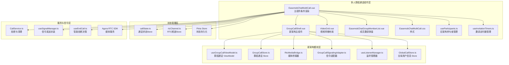
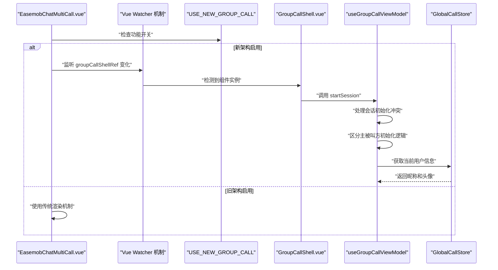
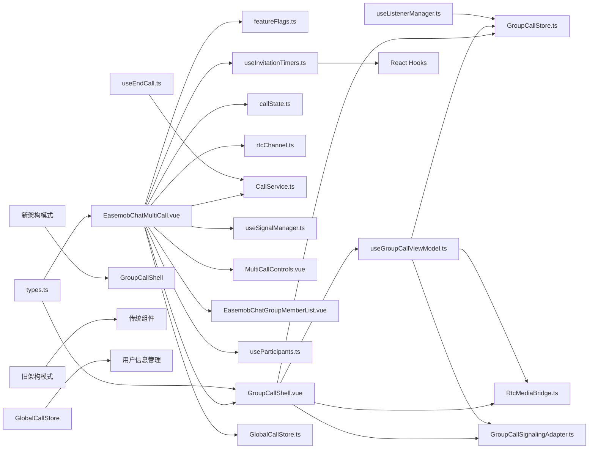

# 主组件 EasemobChatMultiCall

<cite>
**本文档引用的文件**
- [EasemobChatMultiCall.vue](file://lib/components/multiCall/EasemobChatMultiCall.vue)
- [GroupCallShell.vue](file://lib/modules/groupCall/components/GroupCallShell.vue)
- [featureFlags.ts](file://lib/config/featureFlags.ts)
- [useGroupCallViewModel.ts](file://lib/modules/groupCall/viewModel/useGroupCallViewModel.ts)
- [GroupCallStore.ts](file://lib/modules/groupCall/viewModel/GroupCallStore.ts)
- [RtcMediaBridge.ts](file://lib/modules/groupCall/media/RtcMediaBridge.ts)
- [GroupCallSignalingAdapter.ts](file://lib/modules/groupCall/signaling/GroupCallSignalingAdapter.ts)
- [VideoGrid.vue](file://lib/modules/groupCall/components/VideoGrid.vue)
- [useInvitationTimers.ts](file://callkit/hooks/useInvitationTimers.ts)
- [EasemobChatMultiCall.css](file://lib/components/multiCall/styles/EasemobChatMultiCall.css)
- [callState.ts](file://lib/store/callState.ts)
- [rtcChannel.ts](file://lib/store/rtcChannel.ts)
- [CallService.ts](file://lib/services/CallService.ts)
- [useSignalManager.ts](file://lib/composables/useSignalManager.ts)
- [useListenerManager.ts](file://lib/composables/useListenerManager.ts)
- [useEndCall.ts](file://lib/composables/useEndCall.ts)
- [useDraggable.ts](file://lib/composables/useDraggable.ts)
- [useParticipants.ts](file://lib/composables/useParticipants.ts)
- [callstate.types.ts](file://lib/types/callstate.types.ts)
- [README.md](file://README.md)
- [package.json](file://package.json)
- [globalCall.ts](file://lib/store/globalCall.ts)
- [types.ts](file://lib/modules/groupCall/types.ts)
</cite>

## 更新摘要
**变更内容**
- **重大改进**：autoShow 属性默认值处理优化
  - autoShow 属性默认值从 undefined 改为 true，提供更明确的显示控制
  - isVisible 计算属性的逻辑增强，支持更灵活的组件显示控制
- **架构重构**：EasemobChatMultiCall.vue 已重构为条件渲染组件，集成新的 GroupCallShell 组件
- **用户信息获取优化**：组件现在使用 GlobalCallStore 获取当前用户的昵称和头像信息，移除了对 callStateStore 的直接依赖
- **群组信息管理增强**：新增 effectiveGroupId、effectiveGroupName、effectiveGroupAvatar 计算属性，提供更灵活的群组信息获取机制
- **功能开关**：通过 USE_NEW_GROUP_CALL 功能开关控制新旧架构切换
- **Vue watcher 机制**：新增被邀请参与者会话初始化时机处理
- **会话初始化冲突**：useGroupCallViewModel.ts 中完善 startSession 逻辑
- **参与者管理优化**：增强 addRemoteParticipant/markRemoteAccepted 状态流转
- **邀请定时器管理**：useInvitationTimers.ts 提供完整的邀请超时定时器生命周期管理

## 目录
1. [简介](#简介)
2. [项目结构](#项目结构)
3. [核心组件](#核心组件)
4. [架构总览](#架构总览)
5. [详细组件分析](#详细组件分析)
6. [新架构集成](#新架构集成)
7. [Vue Watcher 机制](#vue-watcher-机制)
8. [会话初始化冲突处理](#会话初始化冲突处理)
9. [参与者管理逻辑优化](#参与者管理逻辑优化)
10. [邀请定时器管理系统](#邀请定时器管理系统)
11. [类型安全性改进](#类型安全性改进)
12. [依赖关系分析](#依赖关系分析)
13. [性能考虑](#性能考虑)
14. [故障排查指南](#故障排查指南)
15. [结论](#结论)
16. [附录](#附录)

## 简介
EasemobChatMultiCall 是环信聊天与音视频通话集成方案中的群组通话主组件，负责多参与者的视频布局管理、主视频与侧边栏视频的双列布局设计、参与者状态管理以及视频流渲染机制。组件采用左右双列布局：左侧为主视频区域，右侧为参与者缩略列表；支持清屏模式、最小化窗口、邀请成员、音频/视频开关、挂断等核心交互。

**更新** 该组件现已实现重大架构升级：通过条件渲染逻辑集成新的 GroupCallShell 组件，实现新旧架构的平滑过渡。当 USE_NEW_GROUP_CALL = true 时，组件将使用全新的 GroupCallShell 替代传统渲染机制，提供更强大的视频网格布局和参与者管理能力。新增的 Vue watcher 机制有效解决了被邀请参与者会话初始化时机问题，重构的会话初始化冲突处理确保了主被叫方的不同初始化需求，改进的参与者管理逻辑提升了系统的稳定性和用户体验。

**更新** 最新重构中，组件现在使用 GlobalCallStore 获取当前用户的昵称和头像信息，移除了对 callStateStore 的直接依赖，实现了更清晰的用户信息管理。群组 ID 和名称现在通过 GroupCallStore 获取，确保了数据的一致性和可维护性。

**更新** **重大增强**：新增 effectiveGroupId、effectiveGroupName、effectiveGroupAvatar 三个计算属性，提供更灵活的群组信息获取机制。这些计算属性遵循"外部传入优先，内部兜底"的原则，支持多种场景下的群组信息显示需求。

**更新** 类型安全性方面，EasemobChatMultiCall.vue 已更新为使用运行时 defineProps 定义 props，提供更好的类型安全性和开发体验。同时，GroupCallShell.vue 新增了 Array.isArray 防御性检查，确保 participants 始终返回纯数组，避免 Pinia computed 解包不一致导致的问题。

## 项目结构
该组件位于 lib/components/multiCall 目录，配合新的 groupCall 模块协同工作，形成完整的群组通话 UI 与业务闭环。

**图表来源**
- [EasemobChatMultiCall.vue:1-92](file://lib/components/multiCall/EasemobChatMultiCall.vue#L1-L92)
- [GroupCallShell.vue:1-304](file://lib/modules/groupCall/components/GroupCallShell.vue#L1-L304)
- [useGroupCallViewModel.ts:1-295](file://lib/modules/groupCall/viewModel/useGroupCallViewModel.ts#L1-L295)
- [GroupCallStore.ts:1-223](file://lib/modules/groupCall/viewModel/GroupCallStore.ts#L1-L223)
- [useInvitationTimers.ts:1-70](file://callkit/hooks/useInvitationTimers.ts#L1-L70)
- [globalCall.ts:1-42](file://lib/store/globalCall.ts#L1-L42)

## 核心组件
- **主组件**：EasemobChatMultiCall.vue
  - **新增**：条件渲染逻辑，支持新旧架构切换
  - **重大更新**：autoShow 属性默认值从 undefined 改为 true，提供更明确的显示控制
  - **重大更新**：isVisible 计算属性逻辑增强，支持更灵活的组件显示控制
  - **新增**：groupCallShellRef 引用，管理新架构组件实例
  - **新增**：Vue watcher 机制，处理被邀请参与者会话初始化时机
  - **重大更新**：当 USE_NEW_GROUP_CALL = true 时，渲染 GroupCallShell 替代传统 UI
  - **更新**：使用 GlobalCallStore 获取当前用户的昵称和头像信息
  - **更新**：移除对 callStateStore 的直接依赖
  - **更新**：使用运行时 defineProps 定义 props，提供更好的类型安全性
  - **重大增强**：新增 effectiveGroupId、effectiveGroupName、effectiveGroupAvatar 计算属性，提供灵活的群组信息获取机制
- **新架构组件**：GroupCallShell.vue
  - **全新**：基于 ViewModel 的现代化群组通话组件
  - **全新**：提供视频网格布局和智能参与者管理
  - **全新**：内置邀请成员弹窗和控制面板
  - **全新**：支持延迟渲染后的自动初始化
  - **新增**：Array.isArray 防御性检查，确保 participants 返回纯数组
- **视频网格组件**：VideoGrid.vue
  - **全新**：智能网格布局，支持 2-16 人的动态网格
  - **全新**：主视频模式与网格模式自动切换
  - **全新**：响应式布局，适应不同屏幕尺寸
- **控制条**：MultiCallControls.vue
  - 提供静音、摄像头开关、挂断按钮的 UI 与事件
- **成员列表**：EasemobChatGroupMemberList.vue
  - 群组成员选择与邀请弹窗，支持批量邀请
- **旧架构参与者管理**：useParticipants.ts
  - **保留**：仅在旧架构模式下使用
  - 自动生成参与者列表，内部处理 leftUsers 逻辑
- **新架构 ViewModel**：useGroupCallViewModel.ts
  - **全新**：连接 Store、MediaBridge、SignalingAdapter
  - **重构**：完善会话初始化冲突处理逻辑
  - 提供完整的群组通话状态管理
- **新架构 Store**：GroupCallStore.ts
  - **全新**：单一事实源，替代旧架构分散逻辑
  - 使用 Map 结构优化内存管理
  - **增强**：支持状态流转和生命周期管理
- **新架构媒体桥接**：RtcMediaBridge.ts
  - **全新**：监听 Agora 事件，统一处理订阅逻辑
  - 避免重复订阅导致的 INVALID_REMOTE_USER 错误
- **新架构信令适配**：GroupCallSignalingAdapter.ts
  - **全新**：严格复用现有 CallKit 的信令实现
  - 不新增/修改任何 IM 消息格式
- **邀请定时器管理**：useInvitationTimers.ts
  - **全新**：提供完整的邀请超时定时器生命周期管理
  - 支持单个用户定时器设置、清理和批量清理
  - 自动处理组件卸载时的资源清理
- **全局用户信息 Store**：GlobalCallStore.ts
  - **全新**：跨通话域的共享状态管理
  - 存储用户资料映射，支持单聊/群聊共用
  - 提供用户信息获取和窗口模式管理
- **核心类型定义**：types.ts
  - **全新**：定义参与者状态、会话状态等核心类型
  - 提供完整的类型安全保障

**章节来源**
- [EasemobChatMultiCall.vue:25-32](file://lib/components/multiCall/EasemobChatMultiCall.vue#L25-L32)
- [GroupCallShell.vue:148-152](file://lib/modules/groupCall/components/GroupCallShell.vue#L148-L152)
- [GroupCallShell.vue:100-107](file://lib/modules/groupCall/components/GroupCallShell.vue#L100-L107)
- [useGroupCallViewModel.ts:44-181](file://lib/modules/groupCall/viewModel/useGroupCallViewModel.ts#L44-L181)
- [GroupCallStore.ts:10-223](file://lib/modules/groupCall/viewModel/GroupCallStore.ts#L10-L223)
- [useInvitationTimers.ts:1-70](file://callkit/hooks/useInvitationTimers.ts#L1-L70)
- [globalCall.ts:1-42](file://lib/store/globalCall.ts#L1-L42)
- [types.ts:1-56](file://lib/modules/groupCall/types.ts#L1-L56)

## 架构总览
组件采用"条件渲染 + 新旧架构并存 + Vue watcher 机制"的分层架构：
- **组件层**：EasemobChatMultiCall.vue 根据 USE_NEW_GROUP_CALL 决定渲染模式
- **监听层**：Vue watcher 机制处理被邀请参与者会话初始化时机
- **新架构层**：GroupCallShell.vue + ViewModel + Store + MediaBridge + SignalingAdapter + GlobalCallStore
- **旧架构层**：传统的 MultiCallControls + useParticipants + rtcChannel Store
- **服务层**：CallService 负责挂断流程与资源清理
- **信令层**：useSignalManager 封装环信信令发送，useListenerManager 实现智能信令监听

**更新** 架构中新增了 Vue watcher 机制，专门处理被邀请参与者会话初始化时机问题；同时保留旧架构以确保向后兼容性。最新重构中，GlobalCallStore 提供了统一的用户信息管理，简化了组件间的依赖关系。

**图表来源**
- [EasemobChatMultiCall.vue:2-16](file://lib/components/multiCall/EasemobChatMultiCall.vue#L2-L16)
- [featureFlags.ts:9](file://lib/config/featureFlags.ts#L9)
- [GroupCallShell.vue:70-112](file://lib/modules/groupCall/components/GroupCallShell.vue#L70-L112)
- [EasemobChatMultiCall.vue:964-972](file://lib/components/multiCall/EasemobChatMultiCall.vue#L964-L972)
- [globalCall.ts:27-40](file://lib/store/globalCall.ts#L27-L40)

## 详细组件分析

### 主组件 EasemobChatMultiCall.vue（条件渲染）
- **新增**：条件渲染逻辑
  - `<GroupCallShell v-if="isVisible"`：新架构渲染
  - 支持动态切换新旧架构模式
- **重大更新**：autoShow 属性默认值处理
  - autoShow 属性默认值从 undefined 改为 true，提供更明确的显示控制
  - isVisible 计算属性逻辑增强，支持更灵活的组件显示控制
- **重大更新**：isVisible 计算属性逻辑增强
  - 当 props.autoShow === false 时，直接返回 true，绕过状态检查
  - 仅在群组通话且 IN_CALL 或 INVITING 状态时显示
  - 支持 autoShow 属性控制是否启用自动显示
- **新增**：groupCallShellRef 引用
  - 管理 GroupCallShell 组件实例
  - 提供 startSession 等方法调用
- **新增**：Vue watcher 机制
  - 监听 groupCallShellRef 变化，处理延迟渲染场景
  - 被邀请方可能因 v-if 延迟渲染，通过 ref 变化自动补初始化
- **重大更新**：内部参与者管理短路
  - 新架构下 internalParticipants 直接返回空数组
  - 避免后台计算和日志噪音
- **重大更新**：渲染逻辑短路
  - 新架构下 renderVideoStreams 和 scheduleRender 直接返回
  - 所有旧架构的 watch 监听均被短路处理
- **更新**：用户信息获取优化
  - 使用 `globalCallStore.getUserInfo(chatClientStore.getChatClient?.user)?.nickname` 获取昵称
  - 使用 `globalCallStore.getUserInfo(chatClientStore.getChatClient?.user)?.avatarURL` 获取头像
  - 移除了对 callStateStore 的直接依赖
- **更新**：群组信息管理
  - 群组 ID 和名称通过 props 传递给 GroupCallShell
  - GroupCallShell 内部通过 GroupCallStore 管理群组状态
- **更新**：类型安全性改进
  - 使用运行时 defineProps 定义 props，提供更好的类型安全性和开发体验
  - 明确指定 groupId、groupName、groupAvatar、type、currentUserId、autoShow 的类型和默认值
- **重大增强**：群组信息计算属性增强
  - **新增** effectiveGroupId：优先使用 props.groupId，否则使用 calleeUserId，再否则使用 GroupCallStore.session.groupId
  - **新增** effectiveGroupName：优先使用 props.groupName，否则使用 GroupCallStore.session.groupName
  - **新增** effectiveGroupAvatar：优先使用 props.groupAvatar，否则使用空字符串
  - 这些计算属性确保了群组信息的灵活性和容错性

**章节来源**
- [EasemobChatMultiCall.vue:2-16](file://lib/components/multiCall/EasemobChatMultiCall.vue#L2-L16)
- [EasemobChatMultiCall.vue:249-263](file://lib/components/multiCall/EasemobChatMultiCall.vue#L249-L263)
- [EasemobChatMultiCall.vue:241-244](file://lib/components/multiCall/EasemobChatMultiCall.vue#L241-L244)
- [EasemobChatMultiCall.vue:554-556](file://lib/components/multiCall/EasemobChatMultiCall.vue#L554-L556)
- [EasemobChatMultiCall.vue:892-947](file://lib/components/multiCall/EasemobChatMultiCall.vue#L892-L947)
- [EasemobChatMultiCall.vue:964-972](file://lib/components/multiCall/EasemobChatMultiCall.vue#L964-L972)
- [EasemobChatMultiCall.vue:25-32](file://lib/components/multiCall/EasemobChatMultiCall.vue#L25-L32)
- [EasemobChatMultiCall.vue:63-70](file://lib/components/multiCall/EasemobChatMultiCall.vue#L63-L70)

### 新架构 GroupCallShell 组件
- **全新**：基于 ViewModel 的现代化组件
  - 使用 useGroupCallViewModel 管理完整状态
  - 提供 startSession、addRemoteParticipant、sendInvite 等方法
  - **增强**：支持延迟渲染后的自动初始化
- **全新**：视频网格布局
  - 使用 VideoGrid 组件渲染参与者网格
  - 支持动态布局调整和响应式设计
- **全新**：内置功能
  - 邀请成员弹窗（EasemobChatGroupMemberList）
  - 通话控制面板（静音、摄像头、挂断）
  - 实时通话时长显示
- **全新**：媒体流管理
  - 通过 RtcMediaBridge 统一处理媒体事件
  - 自动订阅远程用户流
  - 智能音量检测和说话人检测
- **更新**：用户信息获取
  - 通过 props 接收当前用户的昵称和头像
  - 作为后备方案，使用 userId 作为默认昵称
- **新增**：参与者数据防御性检查
  - 新增 Array.isArray 检查，确保 participants 始终返回纯数组
  - 避免 Pinia computed 解包不一致导致的问题
  - 通过 participants 计算属性提供防御性包装

**章节来源**
- [GroupCallShell.vue:1-304](file://lib/modules/groupCall/components/GroupCallShell.vue#L1-L304)
- [GroupCallShell.vue:70-112](file://lib/modules/groupCall/components/GroupCallShell.vue#L70-L112)
- [GroupCallShell.vue:127-137](file://lib/modules/groupCall/components/GroupCallShell.vue#L127-L137)
- [GroupCallShell.vue:148-152](file://lib/modules/groupCall/components/GroupCallShell.vue#L148-L152)

### 新架构 ViewModel（useGroupCallViewModel）
- **全新**：连接多个模块的桥梁
  - 连接 GroupCallStore、RtcMediaBridge、GroupCallSignalingAdapter
  - 提供统一的 API 接口
- **重构**：会话管理逻辑
  - **增强**：startSession 完善会话初始化冲突处理
  - 区分全新会话（主叫方）与被邀请方会话初始化
  - 确保本地用户始终存在，支持主被叫双方
- **增强**：参与者管理
  - addRemoteParticipant：添加远程参与者，初始状态为 invited
  - markRemoteAccepted：标记参与者接受邀请，状态流转到 accepted
  - 支持状态机：invited → accepted → joinedRtc → publishing → left
- **全新**：媒体控制
  - bindRtcService/unbindRtcService：绑定/解绑 RTC 服务
  - setLocalStream/setLocalMute/setLocalCamera：本地媒体控制
- **全新**：信令处理
  - sendInvite：发送邀请（复用 useSignalManager）
  - hangup：挂断通话（复用 CallService）

**章节来源**
- [useGroupCallViewModel.ts:44-181](file://lib/modules/groupCall/viewModel/useGroupCallViewModel.ts#L44-L181)
- [useGroupCallViewModel.ts:83-125](file://lib/modules/groupCall/viewModel/useGroupCallViewModel.ts#L83-L125)
- [useGroupCallViewModel.ts:127-145](file://lib/modules/groupCall/viewModel/useGroupCallViewModel.ts#L127-L145)

### 新架构 Store（GroupCallStore）
- **全新**：单一事实源
  - 替代旧架构中的 useParticipants + rtcChannelStore 分散逻辑
  - 使用 Map 结构优化内存管理
- **增强**：参与者管理
  - addParticipant/removeParticipant：添加/移除参与者
  - setParticipantState：设置参与者状态，支持完整状态机
  - setUidMapping/resolveUid：UID 映射和解析，支持多种解析策略
- **增强**：状态追踪
  - participantList：参与者列表（排序），本地用户优先
  - activeParticipants/publishingParticipants：活跃参与者过滤
  - acceptedMembers：接受邀请的成员集合，支持去重
- **新增**：生命周期管理
  - initSession/destroySession：会话初始化和销毁
  - 支持会话级别的状态重置

**章节来源**
- [GroupCallStore.ts:10-223](file://lib/modules/groupCall/viewModel/GroupCallStore.ts#L10-L223)
- [GroupCallStore.ts:43-57](file://lib/modules/groupCall/viewModel/GroupCallStore.ts#L43-L57)
- [GroupCallStore.ts:78-92](file://lib/modules/groupCall/viewModel/GroupCallStore.ts#L78-L92)

### 新架构媒体桥接（RtcMediaBridge）
- **全新**：统一媒体事件处理
  - 监听 user-joined/user-left/user-published/user-unpublished 事件
  - 关闭 RtcService 内部自动订阅，避免重复订阅
- **增强**：智能订阅逻辑
  - handleUserPublished：主动订阅远程用户流
  - 处理 INVALID_REMOTE_USER 错误，支持 publish 比 joined 先到的场景
  - 支持 UID 解析和映射，包括临时占位和数据迁移
- **增强**：UID 解析策略
  - 优先级：GroupCallStore → RtcChannelStore → API 查询
  - 支持临时占位用户（__pending_uid）的自动迁移
  - 提供 confidence 级别的解析结果

**章节来源**
- [RtcMediaBridge.ts:13-282](file://lib/modules/groupCall/media/RtcMediaBridge.ts#L13-L282)
- [RtcMediaBridge.ts:134-204](file://lib/modules/groupCall/media/RtcMediaBridge.ts#L134-L204)
- [RtcMediaBridge.ts:238-262](file://lib/modules/groupCall/media/RtcMediaBridge.ts#L238-L262)

### 新架构信令适配（GroupCallSignalingAdapter）
- **全新**：严格复用现有实现
  - prepareSession：初始化群组通话状态
  - sendInvite：发送邀请（复用 useSignalManager）
  - hangup：挂断通话（复用 CallService）
- **全新**：不改变 IM 消息格式
  - 保持与现有 CallKit 的兼容性
  - 不新增/修改任何消息格式

**章节来源**
- [GroupCallSignalingAdapter.ts:13-96](file://lib/modules/groupCall/signaling/GroupCallSignalingAdapter.ts#L13-L96)

### 全局用户信息 Store（GlobalCallStore）
- **全新**：跨通话域的共享状态管理
  - 存储用户资料映射，支持单聊/群聊共用
  - 提供用户信息获取和窗口模式管理
- **增强**：用户信息管理
  - setUserInfo：设置用户信息（昵称、头像）
  - getUserInfo：获取用户信息，支持默认值
  - getIsMinimized：获取窗口最小化状态
- **应用场景**
  - 为群组通话提供当前用户的昵称和头像
  - 支持被邀请用户的信息展示
  - 统一管理跨组件的用户信息

**章节来源**
- [globalCall.ts:1-42](file://lib/store/globalCall.ts#L1-L42)

### 核心类型定义（types.ts）
- **全新**：定义参与者状态类型
  - ParticipantState：'invited' | 'accepted' | 'joinedRtc' | 'publishing' | 'left'
  - Participant：包含用户 ID、昵称、头像、状态、本地标识等属性
  - GroupCallSessionState：群组通话会话状态
  - UidResolution：UID 解析结果
- **全新**：类型安全保障
  - 为参与者生命周期状态提供完整的类型约束
  - 确保 UI 和媒体层的数据结构一致性
  - 支持状态驱动的媒体控制

**章节来源**
- [types.ts:1-56](file://lib/modules/groupCall/types.ts#L1-L56)

## 新架构集成

### 功能开关配置
- **新增**：USE_NEW_GROUP_CALL 功能开关
  - 默认值：true（启用新架构）
  - 通过 featureFlags.ts 配置
  - 支持运行时切换新旧架构

**章节来源**
- [featureFlags.ts:9](file://lib/config/featureFlags.ts#L9)

### 条件渲染机制
- **新增**：三段式渲染逻辑
  - 第一段：新架构渲染（条件满足时）
  - 第二段：旧架构渲染（条件满足时）
  - 第三段：隐藏（条件不满足时）
- **重大更新**：isVisible 计算属性逻辑增强
  - 当 props.autoShow === false 时，直接返回 true，绕过状态检查
  - 仅在群组通话且通话状态有效时显示
  - 支持 autoShow 属性控制

**章节来源**
- [EasemobChatMultiCall.vue:2-16](file://lib/components/multiCall/EasemobChatMultiCall.vue#L2-L16)
- [EasemobChatMultiCall.vue:249-263](file://lib/components/multiCall/EasemobChatMultiCall.vue#L249-L263)

### 迁移机制
- **新增**：渐进式迁移
  - 新架构完全接管渲染和状态管理
  - 旧架构逻辑被短路处理
  - 信令和资源清理通过 CallService 统一处理
- **新增**：向后兼容
  - 旧架构的 API 和事件仍可使用
  - 逐步替换内部实现而非接口变更

**章节来源**
- [EasemobChatMultiCall.vue:892-1138](file://lib/components/multiCall/EasemobChatMultiCall.vue#L892-L1138)

## Vue Watcher 机制

### 被邀请参与者会话初始化时机处理
- **新增**：Vue watcher 监听机制
  - 监听 groupCallShellRef 引用变化，处理延迟渲染场景
  - 被邀请方可能因 v-if 延迟渲染，通过 ref 变化自动补初始化
- **新增**：初始化补救机制
  - 首次尝试失败时，通过 nextTick 重试
  - 监听 ref 变化，一旦组件实例可用立即初始化
- **新增**：防抖初始化逻辑
  - 避免重复初始化，确保只在必要时进行
  - 支持多次渲染场景下的稳定性

**章节来源**
- [EasemobChatMultiCall.vue:946-975](file://lib/components/multiCall/EasemobChatMultiCall.vue#L946-L975)
- [EasemobChatMultiCall.vue:964-972](file://lib/components/multiCall/EasemobChatMultiCall.vue#L964-L972)

### 会话初始化冲突处理
- **新增**：startSession 逻辑重构
  - 区分全新会话（主叫方）与被邀请方会话初始化
  - 全新会话：清空并初始化，设置 isActive 和 startTime
  - 被邀请方：保留远程参与者，只更新会话元数据
- **新增**：本地用户一致性保证
  - 确保本地用户始终存在，支持主被叫双方
  - 统一设置本地用户状态和媒体权限
- **新增**：状态机支持
  - 支持完整的参与者生命周期状态管理
  - 从 invited → accepted → joinedRtc → publishing → left 的完整流转

**章节来源**
- [useGroupCallViewModel.ts:83-125](file://lib/modules/groupCall/viewModel/useGroupCallViewModel.ts#L83-L125)

## 会话初始化冲突处理

### 主被叫方初始化差异
- **主叫方初始化**
  - 创建全新会话，清空所有参与者
  - 设置会话状态为 ACTIVE，记录开始时间
  - 添加本地用户，状态为 joinedRtc
  - 初始化通话时长计时器
- **被叫方初始化**
  - 会话已由监听器提前初始化
  - 保留远程参与者列表，只更新会话元数据
  - 维护参与者状态的连续性
  - 继续通话时长计时

### 本地用户管理
- **统一处理**：无论主被叫方，都确保本地用户存在
- **状态设置**：本地用户初始状态为 joinedRtc
- **媒体权限**：根据通话类型设置摄像头状态
- **跟踪机制**：通过 isLocal 标识本地用户

**章节来源**
- [useGroupCallViewModel.ts:91-121](file://lib/modules/groupCall/viewModel/useGroupCallViewModel.ts#L91-L121)

## 参与者管理逻辑优化

### 状态流转机制
- **邀请阶段**：addRemoteParticipant 创建参与者，状态为 invited
- **接受阶段**：markRemoteAccepted 更新状态为 accepted
- **加入阶段**：RtcMediaBridge 处理 user-joined，状态转为 joinedRtc
- **发布阶段**：handleUserPublished 处理流发布，状态转为 publishing
- **离开阶段**：user-left 触发，状态转为 left 并延迟移除

### 会话状态管理
- **通话时长**：startDurationTimer 提供实时通话时长显示
- **状态同步**：所有状态变更通过 Store 统一管理
- **响应式更新**：Vue3 响应式系统自动更新 UI
- **内存优化**：Map 结构替代数组，避免重复设置

**章节来源**
- [useGroupCallViewModel.ts:61-76](file://lib/modules/groupCall/viewModel/useGroupCallViewModel.ts#L61-L76)
- [useGroupCallViewModel.ts:127-145](file://lib/modules/groupCall/viewModel/useGroupCallViewModel.ts#L127-L145)

## 邀请定时器管理系统

### 完整生命周期管理
- **定时器设置**：setInvitationTimer 为指定用户设置超时定时器
  - 先清理已存在的定时器，避免重复设置
  - 添加到 invitedMembers 集合，跟踪被邀请用户
  - 设置超时回调，处理邀请超时场景
- **定时器清理**：clearInvitationTimer 和 clearAllInvitationTimers
  - 支持单个用户清理和批量清理
  - 组件卸载时自动清理所有定时器
- **用户加入处理**：handleUserJoined 自动清理对应定时器

### 业务场景支持
- **邀请超时**：自动取消未接受的邀请
- **用户加入**：及时清理相关定时器
- **组件卸载**：防止内存泄漏和定时器泄漏
- **状态同步**：与 GroupCallStore 状态保持一致

**章节来源**
- [useInvitationTimers.ts:25-45](file://callkit/hooks/useInvitationTimers.ts#L25-L45)
- [useInvitationTimers.ts:47-54](file://callkit/hooks/useInvitationTimers.ts#L47-L54)
- [useInvitationTimers.ts:56-61](file://callkit/hooks/useInvitationTimers.ts#L56-L61)

## 类型安全性改进

### 运行时 defineProps 定义
- **新增**：使用 defineProps 定义组件 props
  - 提供更好的类型安全性和编译时检查
  - 明确指定每个 prop 的类型、默认值和验证规则
  - 支持复杂的类型约束，如联合类型 'audio' | 'video'
- **重大更新**：autoShow 属性默认值处理
  - autoShow：Boolean 类型，默认为 true（从 undefined 改变）
  - 提供更明确的显示控制行为
- **新增**：类型定义改进
  - groupId：String 类型，默认为空字符串
  - groupName：String 类型，默认为空字符串
  - groupAvatar：String 类型，默认为空字符串
  - type：'audio' | 'video' 联合类型，默认为 'video'
  - currentUserId：String 类型，默认为空字符串
  - autoShow：Boolean 类型，默认为 true
- **新增**：事件发射类型安全
  - 使用 defineEmits 定义事件发射器
  - 提供完整的事件参数类型检查
  - 支持 callStarted、callEnded、addParticipant、participantTimeout、error 等事件

**章节来源**
- [EasemobChatMultiCall.vue:25-45](file://lib/components/multiCall/EasemobChatMultiCall.vue#L25-L45)

### 参与者数据防御性检查
- **新增**：Array.isArray 防御性检查
  - 确保 participants 始终返回纯数组
  - 避免 Pinia computed 解包不一致导致的问题
  - 通过 participants 计算属性提供防御性包装
- **新增**：类型安全的参与者访问
  - 使用 Array.isArray 检查返回值类型
  - 如果不是数组，返回空数组作为后备
  - 确保下游组件始终接收期望的数据结构
- **应用场景**
  - VideoGrid 组件始终接收参与者数组
  - 避免类型不匹配导致的渲染错误
  - 提供稳定的 API 接口

**章节来源**
- [GroupCallShell.vue:148-152](file://lib/modules/groupCall/components/GroupCallShell.vue#L148-L152)

## 群组信息计算属性增强

### effectiveGroupId 计算属性
- **新增**：灵活的群组 ID 获取机制
  - 优先使用外部传入的 props.groupId
  - 若无外部传入，则使用被叫方 ID（calleeUserId）
  - 若仍无，则使用 GroupCallStore.session.groupId
  - 最终兜底为空字符串
- **应用场景**
  - 主叫方场景：使用 props.groupId 作为主要来源
  - 被叫方场景：自动使用 calleeUserId 作为群组 ID
  - 会话恢复场景：使用 GroupCallStore.session.groupId 作为后备
- **优势**
  - 支持多种调用场景
  - 提供完善的容错机制
  - 确保群组 ID 的一致性

### effectiveGroupName 计算属性
- **新增**：智能的群组名称获取逻辑
  - 优先使用外部传入的 props.groupName
  - 若无外部传入，则使用 GroupCallStore.session.groupName
  - 最终兜底为空字符串
- **应用场景**
  - 主叫方场景：使用 props.groupName 作为主要来源
  - 被叫方场景：使用 GroupCallStore.session.groupName 作为后备
  - 会话恢复场景：确保群组名称的完整性
- **优势**
  - 支持外部配置优先
  - 提供会话状态兜底
  - 确保 UI 显示的准确性

### effectiveGroupAvatar 计算属性
- **新增**：简化的群组头像获取机制
  - 优先使用外部传入的 props.groupAvatar
  - 若无外部传入，则使用空字符串
- **应用场景**
  - 主叫方场景：使用 props.groupAvatar 作为主要来源
  - 被叫方场景：使用空字符串作为后备（使用默认头像）
- **优势**
  - 简化头像处理逻辑
  - 提供明确的兜底策略
  - 确保 UI 渲染的稳定性

**章节来源**
- [EasemobChatMultiCall.vue:63-70](file://lib/components/multiCall/EasemobChatMultiCall.vue#L63-L70)

## 依赖关系分析

**图表来源**
- [EasemobChatMultiCall.vue:172-179](file://lib/components/multiCall/EasemobChatMultiCall.vue#L172-L179)
- [useGroupCallViewModel.ts:4-7](file://lib/modules/groupCall/viewModel/useGroupCallViewModel.ts#L4-L7)
- [useInvitationTimers.ts:1](file://callkit/hooks/useInvitationTimers.ts#L1)
- [globalCall.ts:1-42](file://lib/store/globalCall.ts#L1-L42)
- [types.ts:1-56](file://lib/modules/groupCall/types.ts#L1-L56)

**章节来源**
- [EasemobChatMultiCall.vue:172-179](file://lib/components/multiCall/EasemobChatMultiCall.vue#L172-L179)
- [useGroupCallViewModel.ts:4-7](file://lib/modules/groupCall/viewModel/useGroupCallViewModel.ts#L4-L7)

## 性能考虑
- **重大优化**：新架构内存管理
  - GroupCallStore 使用 Map 结构替代数组
  - 避免重复设置同一元素
  - 更高效的视频元素查找和管理
- **重大优化**：条件渲染减少计算
  - 新架构下短路所有旧架构计算逻辑
  - 避免后台无意义的参与者管理
- **重大优化**：统一媒体处理
  - RtcMediaBridge 避免重复订阅
  - 统一处理 INVALID_REMOTE_USER 错误
- **重大更新**：autoShow 属性默认值优化
  - autoShow 默认值从 undefined 改为 true，提供更明确的显示控制
  - isVisible 计算属性逻辑增强，支持更灵活的组件显示控制
- **新增**：Vue watcher 优化
  - 防止重复初始化，提高初始化效率
  - 延迟渲染场景下的自动补救机制
- **新增**：智能显示控制
  - isVisible 计算属性避免不必要的渲染
  - autoShow 属性减少组件加载开销
- **新增**：渐进式迁移
  - 逐步替换旧架构逻辑
  - 保持现有功能的同时提升性能
- **更新**：用户信息缓存优化
  - GlobalCallStore 缓存用户信息，避免重复查询
  - 减少组件间的数据传输开销
- **新增**：类型安全性优化
  - 运行时 defineProps 提供更好的编译时检查
  - 减少运行时类型转换错误
  - 提升开发体验和代码质量
- **重大增强**：群组信息计算属性优化
  - effectiveGroupId/effectiveGroupName/effectiveGroupAvatar 提供高效的群组信息获取
  - 避免重复计算和状态同步问题
  - 支持多种场景下的灵活配置

## 故障排查指南
- **新架构切换问题**
  - 检查 USE_NEW_GROUP_CALL 是否正确设置
  - 确认 GroupCallShell 组件是否正常渲染
  - 验证 featureFlags.ts 配置
- **Vue watcher 机制问题**
  - 检查 groupCallShellRef 引用是否正确设置
  - 确认 watcher 监听逻辑是否正常触发
  - 验证延迟渲染场景下的自动补救机制
- **会话初始化冲突**
  - 检查 startSession 逻辑是否正确区分主被叫方
  - 确认本地用户是否始终存在
  - 验证会话状态是否正确流转
- **参与者管理异常**
  - 检查 GroupCallStore 的状态机是否正常工作
  - 确认状态流转是否符合预期
  - 验证 UID 解析和映射是否正确
- **邀请定时器问题**
  - 检查定时器设置和清理逻辑
  - 确认用户加入时是否正确清理定时器
  - 验证组件卸载时的资源清理
- **媒体流问题**
  - 检查 RtcMediaBridge 的订阅逻辑
  - 确认 UID 解析和映射是否正确
  - 验证 INVALID_REMOTE_USER 错误处理
- **用户信息获取问题**
  - 检查 GlobalCallStore 是否正确缓存用户信息
  - 确认 getUserInfo 方法的返回值
  - 验证用户信息的更新和同步机制
- **群组信息管理问题**
  - 检查 GroupCallStore 的会话初始化
  - 确认群组 ID 和名称的传递和存储
  - 验证群组状态的生命周期管理
- **群组信息计算属性问题**
  - 检查 effectiveGroupId/effectiveGroupName/effectiveGroupAvatar 的计算逻辑
  - 确认外部传入参数的优先级处理
  - 验证兜底机制的正确性
- **类型安全问题**
  - 检查 defineProps 类型定义是否正确
  - 确认事件发射器的类型安全
  - 验证参与者数据的防御性检查
- **参与者数据问题**
  - 检查 Array.isArray 检查逻辑
  - 确认 participants 计算属性的返回值
  - 验证下游组件的数据接收
- **autoShow 属性问题**
  - 检查 autoShow 属性默认值是否为 true
  - 确认 isVisible 计算属性逻辑是否正确处理 autoShow === false 的情况
  - 验证组件显示控制行为是否符合预期

**章节来源**
- [EasemobChatMultiCall.vue:249-263](file://lib/components/multiCall/EasemobChatMultiCall.vue#L249-L263)
- [RtcMediaBridge.ts:134-200](file://lib/modules/groupCall/media/RtcMediaBridge.ts#L134-L200)
- [GroupCallSignalingAdapter.ts:13-88](file://lib/modules/groupCall/signaling/GroupCallSignalingAdapter.ts#L13-L88)
- [useInvitationTimers.ts:56-61](file://callkit/hooks/useInvitationTimers.ts#L56-L61)
- [globalCall.ts:27-40](file://lib/store/globalCall.ts#L27-L40)
- [GroupCallShell.vue:148-152](file://lib/modules/groupCall/components/GroupCallShell.vue#L148-L152)
- [EasemobChatMultiCall.vue:63-70](file://lib/components/multiCall/EasemobChatMultiCall.vue#L63-L70)

## 结论
EasemobChatMultiCall 通过条件渲染机制成功集成了全新的 GroupCallShell 组件，实现了新旧架构的平滑过渡。新增的 Vue watcher 机制有效解决了被邀请参与者会话初始化时机问题，重构的会话初始化冲突处理确保了主被叫方的不同初始化需求得到正确满足。改进的参与者管理逻辑提升了系统的稳定性和用户体验，而完整的邀请定时器管理系统进一步增强了系统的健壮性。

**更新** 最新重构中，组件使用 GlobalCallStore 获取当前用户的昵称和头像信息，移除了对 callStateStore 的直接依赖，实现了更清晰的用户信息管理。群组 ID 和名称现在通过 GroupCallStore 获取，确保了数据的一致性和可维护性。

**更新** **重大增强**：新增的 effectiveGroupId、effectiveGroupName、effectiveGroupAvatar 计算属性显著提升了群组信息处理的灵活性和容错性。这些计算属性遵循"外部传入优先，内部兜底"的设计原则，支持多种调用场景，包括主叫方、被叫方和会话恢复等场景。这种设计确保了群组信息的准确性和一致性，同时提供了完善的容错机制。

**更新** 类型安全性方面，EasemobChatMultiCall.vue 已更新为使用运行时 defineProps 定义 props，提供更好的类型安全性和开发体验。同时，GroupCallShell.vue 新增了 Array.isArray 防御性检查，确保 participants 始终返回纯数组，避免 Pinia computed 解包不一致导致的问题。这些改进显著提升了代码质量和运行时稳定性。

**更新** 最重要的改进是 autoShow 属性默认值从 undefined 改为 true，提供了更明确的显示控制行为。isVisible 计算属性的逻辑也得到了增强，支持更灵活的组件显示控制。这一系列重大架构升级标志着群组通话组件向现代化、模块化、高可靠性的方向迈出了重要一步。

## 附录

### 组件 Props 与状态对照表
- **Props**
  - groupId：群组 ID（可选）
  - groupName：群组名称（可选）
  - groupAvatar：群组头像（可选）
  - type：通话类型（'audio' | 'video'）
  - currentUserId：当前用户 ID（可选）
  - autoShow：**重大更新** 自动显示/隐藏控制（默认 true）
  - currentNickname：**新增** 当前用户昵称（可选）
  - currentAvatarUrl：**新增** 当前用户头像 URL（可选）
  - groupMembers：**新增** 群组成员列表（可选）
- **状态**
  - isMuted：本地音频静音
  - isVideoEnabled：本地视频开关
  - isCallActive：通话开始
  - isClearScreen：清屏模式
  - isMinimized：小窗模式（来自 store）
  - isVisible：**重大更新** 智能显示控制，支持 autoShow 属性
  - **重大更新** videoRefs：**Map结构**，彻底解决内存泄漏
  - **新增** groupCallShellRef：**新增** GroupCallShell 组件引用
  - **新增** participants：**新增** 防御性检查的参与者数组
  - **重大增强** effectiveGroupId/effectiveGroupName/effectiveGroupAvatar：**新增** 灵活的群组信息计算属性

**章节来源**
- [EasemobChatMultiCall.vue:193-209](file://lib/components/multiCall/EasemobChatMultiCall.vue#L193-L209)
- [EasemobChatMultiCall.vue:249-263](file://lib/components/multiCall/EasemobChatMultiCall.vue#L249-L263)
- [EasemobChatMultiCall.vue:241-244](file://lib/components/multiCall/EasemobChatMultiCall.vue#L241-L244)
- [GroupCallShell.vue:148-152](file://lib/modules/groupCall/components/GroupCallShell.vue#L148-L152)
- [EasemobChatMultiCall.vue:63-70](file://lib/components/multiCall/EasemobChatMultiCall.vue#L63-L70)

### 事件清单
- callStarted：开始通话
- callEnded：挂断完成
- addParticipant：打开成员列表
- participantTimeout：邀请超时
- userLeft：用户离开/视频结束
- userJoined：**增强** 用户加入/视频已播放

**章节来源**
- [EasemobChatMultiCall.vue:211-232](file://lib/components/multiCall/EasemobChatMultiCall.vue#L211-L232)

### 使用示例与最佳实践
- **使用示例**
  - 在应用中引入插件并在组件模板中使用主组件
  - **新增** 可以省略 participants 参数，让 useParticipants 自动管理
  - **新增** 可以通过 featureFlags.ts 切换新旧架构模式
  - **新增** Vue watcher 机制自动处理被邀请参与者初始化
  - **新增** 可以通过 GlobalCallStore 管理用户信息缓存
  - **新增** 运行时 defineProps 提供更好的类型安全体验
  - **新增** 防御性检查确保参与者数据的稳定性
  - **重大更新** autoShow 属性默认值为 true，提供更明确的显示控制
  - **重大增强** 群组信息计算属性提供灵活的群组信息获取机制
- **最佳实践**
  - 传入 currentUserId 以正确区分本地/远端视频
  - 合理设置 maxParticipants 与 backgroundImage 提升用户体验
  - 监听 userLeft/userJoined 事件以同步 UI 状态
  - 在路由切换或组件卸载时确保调用挂断流程，避免资源泄漏
  - **新增** 利用 autoShow 属性自动控制组件显示/隐藏
  - **新增** 享受 useParticipants 自动管理带来的便利
  - **新增** 利用 Map 结构优化的视频渲染获得更好的性能
  - **新增** 通过 USE_NEW_GROUP_CALL 功能开关控制架构切换
  - **新增** 利用 Vue watcher 机制确保被邀请参与者正确初始化
  - **新增** 通过邀请定时器管理提升邀请流程的可靠性
  - **新增** 利用 GlobalCallStore 缓存用户信息，提升性能
  - **新增** 通过 GroupCallStore 统一管理群组状态，确保数据一致性
  - **新增** 利用运行时 defineProps 提升开发体验和代码质量
  - **新增** 通过防御性检查避免潜在的运行时错误
  - **重大更新** 利用 autoShow 属性的默认值优化，提供更明确的显示控制行为
  - **重大增强** 利用群组信息计算属性的优先级机制，确保群组信息的准确性和一致性
  - **重大增强** 在不同调用场景下合理使用 effectiveGroupId/effectiveGroupName/effectiveGroupAvatar，提升用户体验

**章节来源**
- [README.md:136-166](file://README.md#L136-L166)
- [useParticipants.ts:16-19](file://lib/composables/useParticipants.ts#L16-L19)
- [featureFlags.ts:9](file://lib/config/featureFlags.ts#L9)
- [useInvitationTimers.ts:1-70](file://callkit/hooks/useInvitationTimers.ts#L1-L70)
- [globalCall.ts:14-25](file://lib/store/globalCall.ts#L14-L25)
- [EasemobChatMultiCall.vue:25-45](file://lib/components/multiCall/EasemobChatMultiCall.vue#L25-L45)
- [GroupCallShell.vue:148-152](file://lib/modules/groupCall/components/GroupCallShell.vue#L148-L152)
- [EasemobChatMultiCall.vue:63-70](file://lib/components/multiCall/EasemobChatMultiCall.vue#L63-L70)