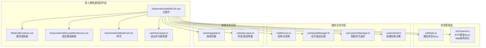
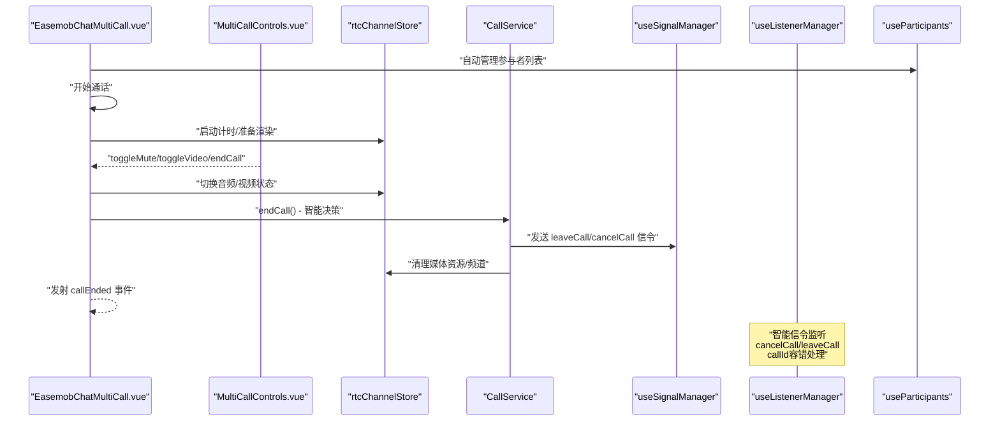
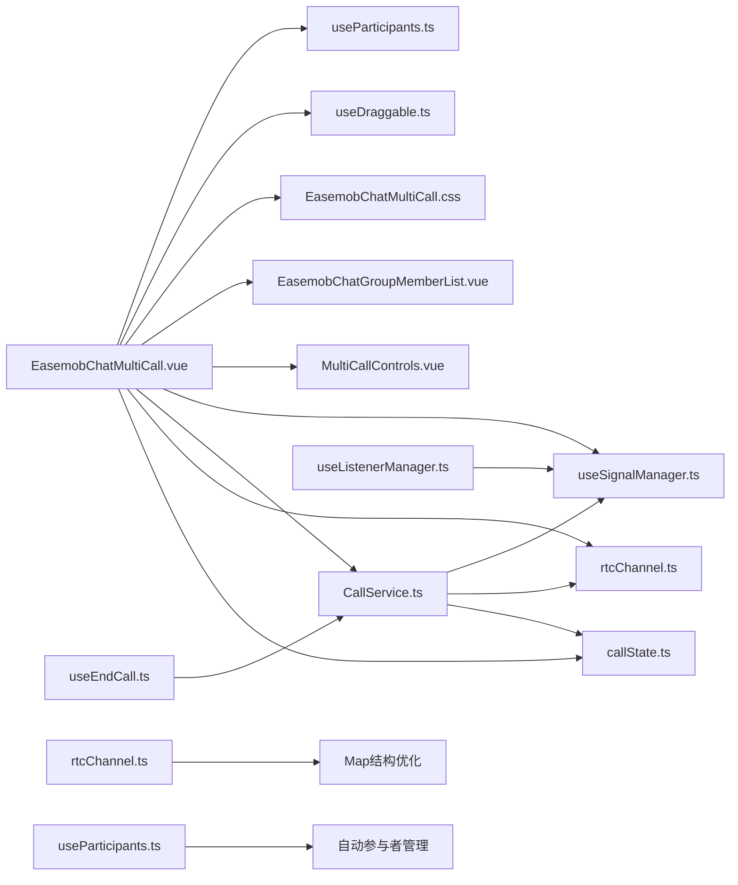

# 主组件 EasemobChatMultiCall

<cite>
**本文档引用的文件**
- [EasemobChatMultiCall.vue](file://lib/components/multiCall/EasemobChatMultiCall.vue)
- [MultiCallControls.vue](file://lib/components/multiCall/MultiCallControls.vue)
- [EasemobChatGroupMemberList.vue](file://lib/components/multiCall/EasemobChatGroupMemberList.vue)
- [EasemobChatMultiCall.css](file://lib/components/multiCall/styles/EasemobChatMultiCall.css)
- [callState.ts](file://lib/store/callState.ts)
- [rtcChannel.ts](file://lib/store/rtcChannel.ts)
- [CallService.ts](file://lib/services/CallService.ts)
- [useSignalManager.ts](file://lib/composables/useSignalManager.ts)
- [useListenerManager.ts](file://lib/composables/useListenerManager.ts)
- [useEndCall.ts](file://lib/composables/useEndCall.ts)
- [useDraggable.ts](file://lib/composables/useDraggable.ts)
- [useParticipants.ts](file://lib/composables/useParticipants.ts)
- [callstate.types.ts](file://lib/types/callstate.types.ts)
- [README.md](file://README.md)
- [package.json](file://package.json)
</cite>

## 更新摘要
**变更内容**
- 视频渲染系统从数组改为Map结构，彻底解决内存泄漏问题
- 邀请成员功能大幅增强，支持待加入用户跟踪和智能映射
- 视频流中断处理得到显著改进，支持流重新发布和自动恢复
- 新增自动参与者管理功能，简化组件使用复杂度
- 改进的拖拽功能和智能显示控制

## 目录
1. [简介](#简介)
2. [项目结构](#项目结构)
3. [核心组件](#核心组件)
4. [架构总览](#架构总览)
5. [详细组件分析](#详细组件分析)
6. [依赖关系分析](#依赖关系分析)
7. [性能考虑](#性能考虑)
8. [故障排查指南](#故障排查指南)
9. [结论](#结论)
10. [附录](#附录)

## 简介
EasemobChatMultiCall 是环信聊天与音视频通话集成方案中的群组通话主组件，负责多参与者的视频布局管理、主视频与侧边栏视频的双列布局设计、参与者状态管理以及视频流渲染机制。组件采用左右双列布局：左侧为主视频区域，右侧为参与者缩略列表；支持清屏模式、最小化窗口、邀请成员、音频/视频开关、挂断等核心交互。

**更新** 该组件现已实现重大架构升级：视频渲染系统从数组改为Map结构彻底解决内存泄漏问题；邀请成员功能增强支持待加入用户跟踪；视频流中断处理得到显著改进；新增自动参与者管理功能简化使用复杂度。

## 项目结构
该组件位于 lib/components/multiCall 目录，配合 store、service、composable、样式等模块协同工作，形成完整的群组通话 UI 与业务闭环。

**图表来源**
- [EasemobChatMultiCall.vue:1-147](file://lib/components/multiCall/EasemobChatMultiCall.vue#L1-L147)
- [MultiCallControls.vue:1-49](file://lib/components/multiCall/MultiCallControls.vue#L1-L49)
- [EasemobChatGroupMemberList.vue:1-142](file://lib/components/multiCall/EasemobChatGroupMemberList.vue#L1-L142)
- [useParticipants.ts:1-122](file://lib/composables/useParticipants.ts#L1-L122)
- [rtcChannel.ts:1-410](file://lib/store/rtcChannel.ts#L1-L410)

## 核心组件
- 主组件：EasemobChatMultiCall.vue
  - 负责渲染双列布局、视频流渲染、参与者状态管理、事件发射与生命周期清理。
  - **重大更新**：视频渲染系统从数组改为Map结构，彻底解决内存泄漏问题。
- 控制条：MultiCallControls.vue
  - 提供静音、摄像头开关、挂断按钮的 UI 与事件。
- 成员列表：EasemobChatGroupMemberList.vue
  - 群组成员选择与邀请弹窗，支持批量邀请。
- 自动参与者管理：useParticipants.ts
  - **新增**：自动生成参与者列表，内部处理 leftUsers 逻辑，用户无需关心。
- 样式：EasemobChatMultiCall.css
  - 定义布局、动画、响应式与交互态样式。

**章节来源**
- [EasemobChatMultiCall.vue:1-147](file://lib/components/multiCall/EasemobChatMultiCall.vue#L1-L147)
- [useParticipants.ts:1-122](file://lib/composables/useParticipants.ts#L1-L122)

## 架构总览
组件采用"组件 + Store + Service + Composable"的分层架构：
- 组件层：负责视图渲染与用户交互。
- Store 层：callState 与 rtcChannel 管理通话状态与媒体流状态，**采用Map结构优化内存管理**。
- Service 层：CallService 负责挂断流程与资源清理。
- Composable 层：useSignalManager 封装环信信令发送，useListenerManager 实现智能信令监听，useEndCall 提供智能挂断决策，**useParticipants 自动管理参与者列表**。

**更新** 架构中新增了 useParticipants 组合式函数，提供自动参与者管理能力；rtcChannel Store 采用 Map 结构优化内存使用。

**图表来源**
- [EasemobChatMultiCall.vue:752-795](file://lib/components/multiCall/EasemobChatMultiCall.vue#L752-L795)
- [useParticipants.ts:29-116](file://lib/composables/useParticipants.ts#L29-L116)

## 详细组件分析

### 主组件 EasemobChatMultiCall.vue
- 视图结构
  - 顶部 CallHeader：展示群组信息与通话时长，支持"添加成员""最小化"。
  - 左侧主视频区：展示主视频参与者，包含音频状态指示与"邀请中"遮罩。
  - 右侧侧边栏：纵向滚动展示其他参与者，支持点击切换主视频。
  - 底部 MultiCallControls：静音、摄像头、挂断。
  - 小窗模式：最小化后显示迷你窗口，支持展开与关闭。
- 核心 Props
  - groupId：群组 ID（可选，优先使用组件传入，否则从 store 获取）。
  - groupName：群组名称（可选）。
  - groupAvatar：群组头像（可选）。
  - participants：**可选**，参与者数组，若不传入将由 useParticipants 自动管理。
  - type：通话类型，'audio' | 'video'。
  - maxParticipants：最大参与者数，默认 18。
  - backgroundImage：自定义背景图（可选）。
  - currentUserId：当前用户 ID（用于区分本地/远端视频）。
  - autoShow：**新增** 自动显示/隐藏控制，默认启用。
- 核心状态
  - isMuted：本地音频静音状态。
  - isVideoEnabled：本地视频开关状态。
  - isCallActive：通话是否已开始。
  - isClearScreen：清屏模式（隐藏 UI 元素，仅显示视频）。
  - selectedVideoId：当前主视频用户 ID。
  - isMinimized：小窗模式状态（来自 callStateStore）。
  - **新增** isVisible：**智能显示控制**，根据通话状态自动显示/隐藏。
  - **重大更新** videoRefs：从数组改为 Map 结构，彻底解决内存泄漏问题。
- 核心方法
  - startCall：开始通话，发射 callStarted，启动计时器。
  - toggleMute：切换音频状态，调用 rtcChannelStore.rtcService。
  - toggleVideo：切换视频状态。
  - endCall：**智能挂断决策**，根据通话状态选择 CANCEL 或 HANGUP 原因。
  - handleAddParticipant：打开成员列表弹窗，发射 addParticipant。
  - handleInviteMembers：**增强**批量邀请成员，发送邀请信令并设置邀请超时定时器。
  - switchMainVideo：切换主视频，**优化**清空 videoRefs 并延时渲染。
  - handleClearScreen：点击容器切换清屏模式（拖拽中/刚结束拖拽时不触发）。
- 视频渲染机制
  - **重大更新** renderVideoStreams：从数组改为 Map 遍历，使用 forEach((videoElement, userId) => {...})，彻底解决内存泄漏问题。
  - scheduleRender：防抖渲染，避免频繁重绘。
  - 渲染锁 isRendering：防止并发渲染导致的竞态。
  - 备选方案：当按 userId 无法找到远端轨道时，遍历 client.remoteUsers 查找第一个有视频轨道的用户。
  - **新增** hasAudioTrack：**音频状态指示**，显示上麦状态。
- 邀请与超时
  - **增强** setInvitationTimer：为每个被邀请成员设置 30 秒超时定时器。
  - **增强** handleInvitationTimeout：超时后发射 participantTimeout，清理定时器。
  - **增强** clearAllInvitationTimers：组件卸载时统一清理。
  - **新增** pendingUserIds：待加入RTC的用户ID集合，支持智能映射。
- 远程用户检查轮询
  - startRemoteUserCheck/stopRemoteUserCheck：每秒检查一次 remoteUsers，尝试订阅缺失的音频/视频轨道，最多轮询 30 次。
  - **增强** user-published/user-unpublished 事件监听，实时处理远程用户流发布/取消。
- 事件系统
  - callStarted：开始通话时发射。
  - callEnded：挂断完成后发射。
  - addParticipant：打开成员列表时发射。
  - participantTimeout：邀请超时时发射。
  - userLeft：远端用户离开/视频流结束时发射。
  - userJoined：**增强** 远端用户加入/视频已播放时发射。
- 生命周期与清理
  - onMounted：启动通话、监听 RTC 事件、启动轮询检查、延迟计算容器尺寸并渲染。
  - onUnmounted：离开频道、尝试发送挂断信令、清理定时器、停止轮询。

**章节来源**
- [EasemobChatMultiCall.vue:247-256](file://lib/components/multiCall/EasemobChatMultiCall.vue#L247-L256)
- [EasemobChatMultiCall.vue:417-440](file://lib/components/multiCall/EasemobChatMultiCall.vue#L417-L440)
- [EasemobChatMultiCall.vue:552-637](file://lib/components/multiCall/EasemobChatMultiCall.vue#L552-L637)
- [EasemobChatMultiCall.vue:813-834](file://lib/components/multiCall/EasemobChatMultiCall.vue#L813-L834)

### 自动参与者管理 useParticipants.ts
- **新增**：自动生成参与者列表的组合式函数
- 自动过滤已离开的用户，自动标记加入状态
- 内部处理 leftUsers 逻辑，用户无需关心
- 支持主叫方显示逻辑，确保通话开始时的正确参与者列表

**章节来源**
- [useParticipants.ts:29-116](file://lib/composables/useParticipants.ts#L29-L116)

### rtcChannel Store 的 Map 结构优化
- **重大更新**：videoRefs 从数组改为 Map 结构
- 彻底解决内存泄漏问题，提高性能
- 支持高效的视频元素查找和管理
- 优化的视频渲染流程

**章节来源**
- [rtcChannel.ts:24-27](file://lib/store/rtcChannel.ts#L24-L27)
- [rtcChannel.ts:342-368](file://lib/store/rtcChannel.ts#L342-L368)

### 邀请成员功能增强
- **新增** pendingUserIds：待加入RTC的用户ID集合
- **增强** addPendingUserId/removePendingUserId/popPendingUserId 方法
- **增强** 智能映射：支持待加入用户与UID的匹配
- **增强** 邀请超时处理：更精确的定时器管理

**章节来源**
- [EasemobChatMultiCall.vue:813-834](file://lib/components/multiCall/EasemobChatMultiCall.vue#L813-L834)
- [rtcChannel.ts:342-368](file://lib/store/rtcChannel.ts#L342-L368)

### 视频流中断处理改进
- **增强** user-unpublished 事件处理：支持视频流结束时的自动恢复
- **增强** 流重新发布支持：当视频流重新发布时自动重新播放
- **增强** 自动切换逻辑：当主视频用户视频结束时自动切换回本地视频
- **增强** 清理机制：正确清理视频元素的播放状态

**章节来源**
- [EasemobChatMultiCall.vue:967-1002](file://lib/components/multiCall/EasemobChatMultiCall.vue#L967-L1002)

## 依赖关系分析

**图表来源**
- [EasemobChatMultiCall.vue:152-166](file://lib/components/multiCall/EasemobChatMultiCall.vue#L152-L166)
- [useParticipants.ts:20-24](file://lib/composables/useParticipants.ts#L20-L24)

**章节来源**
- [EasemobChatMultiCall.vue:152-166](file://lib/components/multiCall/EasemobChatMultiCall.vue#L152-L166)
- [useParticipants.ts:20-24](file://lib/composables/useParticipants.ts#L20-L24)

## 性能考虑
- **重大优化** Map结构替代数组：videoRefs 从数组改为 Map，彻底解决内存泄漏问题，提高查找效率。
- 渲染锁与防抖：通过 isRendering 与 scheduleRender 避免频繁重绘，降低主线程压力。
- 去重渲染：Map 结构天然去重，避免重复设置同一元素。
- 轮询检查：远程用户轮询最多 30 次，避免无限等待；成功订阅后触发一次延时渲染。
- 容器尺寸缓存：updateContainerSize 缓存尺寸，减少布局抖动。
- 资源清理：组件卸载时统一清理定时器、轮询、渲染队列与 RTC 资源。
- **新增** 智能拖拽：拖拽阈值检测避免误触发，拖拽结束后防误触机制。
- **新增** 自动参与者管理：useParticipants 减少不必要的重新渲染。

## 故障排查指南
- **内存泄漏问题**
  - 检查 videoRefs 是否仍使用数组结构。
  - 确认 Map 结构的正确使用和清理。
- 本地视频无法播放
  - 检查本地流是否存在与权限授权。
  - 确认 muted=true 与 play() 异常日志。
- 远端视频轨道缺失
  - 查看 remoteUsers 与轨道状态，确认是否已订阅。
  - 观察轮询日志与订阅结果。
- 邀请超时
  - 检查 setInvitationTimer 与 handleInvitationTimeout 的触发。
  - 确认被邀请用户是否加入 RTC。
  - **新增** 检查 pendingUserIds 集合是否正确管理。
- 挂断后资源未释放
  - 确认 onUnmounted 中 leaveChannel 与 reset 是否执行。
  - 检查 CallService 的清理流程与异常分支。
- **新增** 视频流中断问题
  - 检查 user-unpublished 事件处理逻辑。
  - 确认视频流重新发布时的自动恢复机制。
- **新增** 参与者列表异常
  - 检查 useParticipants 的自动管理逻辑。
  - 确认 leftUsers 和 joinedRtcUsers 的状态同步。

**章节来源**
- [EasemobChatMultiCall.vue:552-637](file://lib/components/multiCall/EasemobChatMultiCall.vue#L552-L637)
- [useParticipants.ts:29-116](file://lib/composables/useParticipants.ts#L29-L116)

## 结论
EasemobChatMultiCall 通过清晰的双列布局、完善的视频渲染机制、健壮的邀请与超时处理、以及统一的信令与状态管理，提供了稳定可靠的群组通话体验。**最新版本**实现了重大架构升级：视频渲染系统从数组改为Map结构彻底解决内存泄漏问题；邀请成员功能大幅增强支持待加入用户跟踪；视频流中断处理得到显著改进；新增自动参与者管理功能简化使用复杂度。这些改进显著提升了组件的稳定性、性能和易用性。

## 附录

### 组件 Props 与状态对照表
- Props
  - groupId：群组 ID（可选）
  - groupName：群组名称（可选）
  - groupAvatar：群组头像（可选）
  - participants：**可选**，参与者数组（内部自动管理）
  - type：通话类型（'audio' | 'video'）
  - maxParticipants：最大参与者数（默认 18）
  - backgroundImage：背景图（可选）
  - currentUserId：当前用户 ID（可选）
  - autoShow：**新增** 自动显示/隐藏控制（默认 true）
- 状态
  - isMuted：本地音频静音
  - isVideoEnabled：本地视频开关
  - isCallActive：通话开始
  - isClearScreen：清屏模式
  - isMinimized：小窗模式（来自 store）
  - isVisible：**新增** 智能显示控制
  - **重大更新** videoRefs：**Map结构**，彻底解决内存泄漏

**章节来源**
- [EasemobChatMultiCall.vue:178-194](file://lib/components/multiCall/EasemobChatMultiCall.vue#L178-L194)
- [EasemobChatMultiCall.vue:247-256](file://lib/components/multiCall/EasemobChatMultiCall.vue#L247-L256)

### 事件清单
- callStarted：开始通话
- callEnded：挂断完成
- addParticipant：打开成员列表
- participantTimeout：邀请超时
- userLeft：用户离开/视频结束
- userJoined：**增强** 用户加入/视频已播放

**章节来源**
- [EasemobChatMultiCall.vue:196-217](file://lib/components/multiCall/EasemobChatMultiCall.vue#L196-L217)

### 使用示例与最佳实践
- 使用示例
  - 在应用中引入插件并在组件模板中使用主组件。
  - **新增** 可以省略 participants 参数，让 useParticipants 自动管理。
- 最佳实践
  - 传入 currentUserId 以正确区分本地/远端视频。
  - 合理设置 maxParticipants 与 backgroundImage 提升用户体验。
  - 监听 userLeft/userJoined 事件以同步 UI 状态。
  - 在路由切换或组件卸载时确保调用挂断流程，避免资源泄漏。
  - **新增** 利用 autoShow 属性自动控制组件显示/隐藏。
  - **新增** 享受 useParticipants 自动管理带来的便利。
  - **新增** 利用 Map 结构优化的视频渲染获得更好的性能。

**章节来源**
- [README.md:136-166](file://README.md#L136-L166)
- [useParticipants.ts:16-19](file://lib/composables/useParticipants.ts#L16-L19)