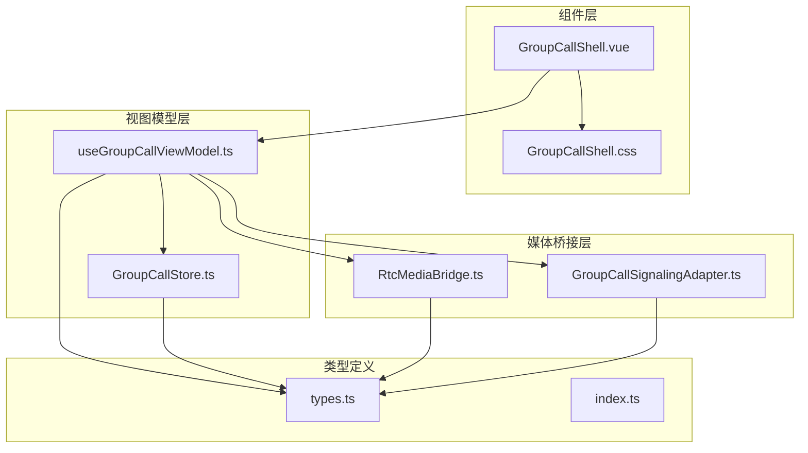
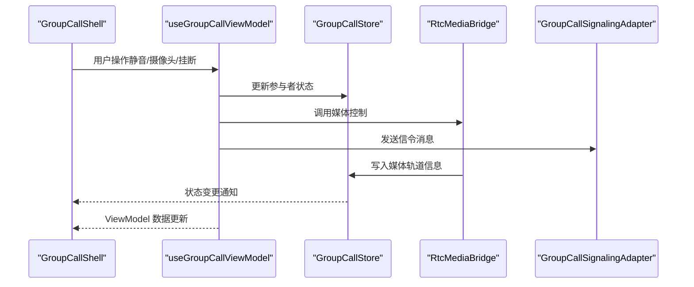
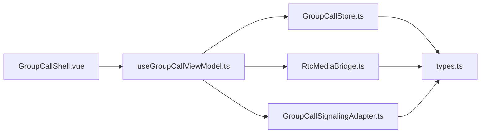

# 多人群组控件组

<cite>
**本文引用的文件**
- [GroupCallShell.vue](file://lib/modules/groupCall/components/GroupCallShell.vue)
- [useGroupCallViewModel.ts](file://lib/modules/groupCall/viewModel/useGroupCallViewModel.ts)
- [GroupCallStore.ts](file://lib/modules/groupCall/viewModel/GroupCallStore.ts)
- [RtcMediaBridge.ts](file://lib/modules/groupCall/media/RtcMediaBridge.ts)
- [GroupCallSignalingAdapter.ts](file://lib/modules/groupCall/signaling/GroupCallSignalingAdapter.ts)
- [GroupCallShell.css](file://lib/modules/groupCall/components/GroupCallShell.css)
- [types.ts](file://lib/modules/groupCall/types.ts)
- [index.ts](file://lib/modules/groupCall/index.ts)
- [CallControls.vue](file://lib/components/singleCall/CallControls.vue)
</cite>

## 更新摘要
**所做更改**
- MultiCallControls.vue 已被新的 GroupCallShell 组件替代
- 旧的通话控制逻辑已集成到新的群组通话架构中
- 新架构采用 ViewModel + Store + Bridge 的分层设计
- 移除了原有的 CallControls 组件及其相关逻辑
- 新增了完整的群组通话状态管理和媒体控制机制

## 目录
1. [简介](#简介)
2. [项目结构](#项目结构)
3. [核心组件](#核心组件)
4. [架构总览](#架构总览)
5. [详细组件分析](#详细组件分析)
6. [依赖分析](#依赖分析)
7. [性能考量](#性能考量)
8. [故障排查指南](#故障排查指南)
9. [结论](#结论)
10. [附录](#附录)

## 简介
本文档详细介绍新的 GroupCallShell 组件在多人群组通话场景下的完整能力与实现细节。该组件替代了原有的 MultiCallControls.vue，提供了更加完善和现代化的群组通话控制面板，涵盖音频控制（静音）、视频控制（摄像头开关）、通话结束、参与者管理、拖拽窗口等核心功能。新架构采用 ViewModel + Store + Bridge 的分层设计，实现了状态驱动的媒体控制和完整的参与者生命周期管理。

## 项目结构
- **组件层**：GroupCallShell.vue 作为主要控制面板，提供完整的群组通话 UI 和交互逻辑
- **视图模型层**：useGroupCallViewModel.ts 管理通话状态和业务逻辑
- **状态管理层**：GroupCallStore.ts 提供单一事实源的参与者状态管理
- **媒体桥接层**：RtcMediaBridge.ts 负责 RTC 事件监听和媒体轨道管理
- **信令适配层**：GroupCallSignalingAdapter.ts 复用现有 CallKit 信令实现
- **类型定义**：types.ts 定义群组通话的核心数据结构和状态类型

**图表来源**
- [GroupCallShell.vue:1-300](file://lib/modules/groupCall/components/GroupCallShell.vue#L1-L300)
- [useGroupCallViewModel.ts:1-295](file://lib/modules/groupCall/viewModel/useGroupCallViewModel.ts#L1-L295)
- [GroupCallStore.ts:1-223](file://lib/modules/groupCall/viewModel/GroupCallStore.ts#L1-L223)
- [RtcMediaBridge.ts:1-282](file://lib/modules/groupCall/media/RtcMediaBridge.ts#L1-L282)
- [GroupCallSignalingAdapter.ts:1-66](file://lib/modules/groupCall/signaling/GroupCallSignalingAdapter.ts#L1-L66)
- [types.ts:1-57](file://lib/modules/groupCall/types.ts#L1-L57)
- [index.ts:1-18](file://lib/modules/groupCall/index.ts#L1-L18)

**章节来源**
- [GroupCallShell.vue:1-300](file://lib/modules/groupCall/components/GroupCallShell.vue#L1-L300)
- [useGroupCallViewModel.ts:1-295](file://lib/modules/groupCall/viewModel/useGroupCallViewModel.ts#L1-L295)
- [GroupCallStore.ts:1-223](file://lib/modules/groupCall/viewModel/GroupCallStore.ts#L1-L223)
- [RtcMediaBridge.ts:1-282](file://lib/modules/groupCall/media/RtcMediaBridge.ts#L1-L282)
- [GroupCallSignalingAdapter.ts:1-66](file://lib/modules/groupCall/signaling/GroupCallSignalingAdapter.ts#L1-L66)
- [types.ts:1-57](file://lib/modules/groupCall/types.ts#L1-L57)
- [index.ts:1-18](file://lib/modules/groupCall/index.ts#L1-L18)

## 核心组件
- **GroupCallShell**：新的群组通话控制外壳，提供完整的 UI 控制面板和交互逻辑
- **useGroupCallViewModel**：群组通话的顶层 ViewModel，连接 Store、MediaBridge、SignalingAdapter
- **GroupCallStore**：单一事实源的参与者状态管理，替代旧架构中的分散逻辑
- **RtcMediaBridge**：RTC 事件监听和媒体轨道桥接，负责 Agora 事件处理
- **GroupCallSignalingAdapter**：信令适配器，复用现有 CallKit 群通话信令实现
- **状态绑定**：通过 ViewModel 管理 isMuted、isCameraOn 等状态与组件状态的同步
- **交互行为**：支持拖拽窗口、清屏模式、参与者选择、邀请管理等高级功能

**章节来源**
- [GroupCallShell.vue:1-300](file://lib/modules/groupCall/components/GroupCallShell.vue#L1-L300)
- [useGroupCallViewModel.ts:10-45](file://lib/modules/groupCall/viewModel/useGroupCallViewModel.ts#L10-L45)
- [GroupCallStore.ts:10-50](file://lib/modules/groupCall/viewModel/GroupCallStore.ts#L10-L50)
- [RtcMediaBridge.ts:8-34](file://lib/modules/groupCall/media/RtcMediaBridge.ts#L8-L34)
- [GroupCallSignalingAdapter.ts:6-10](file://lib/modules/groupCall/signaling/GroupCallSignalingAdapter.ts#L6-L10)

## 架构总览
新的 GroupCallShell 采用分层架构设计，通过 ViewModel 连接各个层次，实现了清晰的关注点分离。UI 组件只负责展示和用户交互，业务逻辑由 ViewModel 管理，状态存储在 Store 中，媒体控制通过 Bridge 处理，信令通过 Adapter 适配。

**图表来源**
- [GroupCallShell.vue:260-286](file://lib/modules/groupCall/components/GroupCallShell.vue#L260-L286)
- [useGroupCallViewModel.ts:274-294](file://lib/modules/groupCall/viewModel/useGroupCallViewModel.ts#L274-L294)
- [GroupCallStore.ts:195-222](file://lib/modules/groupCall/viewModel/GroupCallStore.ts#L195-L222)
- [RtcMediaBridge.ts:35-66](file://lib/modules/groupCall/media/RtcMediaBridge.ts#L35-L66)
- [GroupCallSignalingAdapter.ts:11-66](file://lib/modules/groupCall/signaling/GroupCallSignalingAdapter.ts#L11-L66)

## 详细组件分析

### GroupCallShell 组件
GroupCallShell 是新的群组通话控制外壳，提供了完整的 UI 控制面板，包括头部信息、视频网格、控制按钮和参与者管理功能。

**核心功能特性**：
- **拖拽窗口**：支持拖拽移动和居中定位，提供拖拽状态指示
- **清屏模式**：点击内容区域切换显示/隐藏控制面板
- **参与者管理**：集成成员邀请和参与者列表管理
- **实时计时**：独立的本地通话计时器，不依赖 ViewModel
- **响应式设计**：完整的移动端适配和样式系统

**状态管理**：
- 通过 ViewModel 管理参与者列表、本地参与者状态
- 使用 computed 属性响应状态变化
- 支持参与者选择和主视频模式切换

**章节来源**
- [GroupCallShell.vue:1-300](file://lib/modules/groupCall/components/GroupCallShell.vue#L1-L300)
- [GroupCallShell.css:1-258](file://lib/modules/groupCall/components/GroupCallShell.css#L1-L258)

### useGroupCallViewModel 视图模型
ViewModel 作为业务逻辑的核心，连接 Store、MediaBridge 和 SignalingAdapter，提供完整的群组通话管理功能。

**状态管理**：
- **会话状态**：管理通话会话的启动、运行和销毁
- **参与者状态**：跟踪所有参与者的生命周期状态
- **本地媒体状态**：管理本地用户的音频、视频状态
- **选择状态**：管理主视频模式的参与者选择

**核心方法**：
- `startSession()`：启动新的通话会话
- `addRemoteParticipant()`：添加远程参与者
- `bindRtcService()`：绑定 RTC 服务
- `sendInvite()`：发送邀请消息
- `hangup()`：结束通话

**邀请管理**：
- 自动邀请超时处理（30秒）
- 邀请定时器的自动清理
- 邀请状态的生命周期管理

**章节来源**
- [useGroupCallViewModel.ts:10-45](file://lib/modules/groupCall/viewModel/useGroupCallViewModel.ts#L10-L45)
- [useGroupCallViewModel.ts:136-178](file://lib/modules/groupCall/viewModel/useGroupCallViewModel.ts#L136-L178)
- [useGroupCallViewModel.ts:229-244](file://lib/modules/groupCall/viewModel/useGroupCallViewModel.ts#L229-L244)

### GroupCallStore 状态管理
GroupCallStore 作为单一事实源，提供完整的参与者状态管理和数据持久化。

**数据结构**：
- **会话状态**：存储当前通话的基本信息
- **参与者映射**：使用 Map 存储所有参与者，确保响应式更新
- **UID 映射**：管理 Agora UID 到用户 ID 的映射关系
- **接受成员集合**：跟踪已接受邀请的成员

**状态转换**：
- 支持完整的参与者生命周期状态转换
- 自动处理状态变更的时间戳记录
- 智能的响应式更新机制

**核心功能**：
- `initSession()`：初始化新的通话会话
- `addParticipant()`：添加新参与者
- `setParticipantState()`：更新参与者状态
- `resolveUid()`：解析 UID 映射关系

**章节来源**
- [GroupCallStore.ts:10-50](file://lib/modules/groupCall/viewModel/GroupCallStore.ts#L10-L50)
- [GroupCallStore.ts:59-92](file://lib/modules/groupCall/viewModel/GroupCallStore.ts#L59-L92)
- [GroupCallStore.ts:108-130](file://lib/modules/groupCall/viewModel/GroupCallStore.ts#L108-L130)

### RtcMediaBridge 媒体桥接
RtcMediaBridge 负责监听 Agora RTC 事件，处理远程用户流的订阅和轨道管理。

**事件处理**：
- `user-joined`：处理用户加入事件，建立 UID 映射
- `user-left`：处理用户离开事件，清理状态
- `user-published`：订阅远程用户流，写入轨道信息
- `user-unpublished`：处理用户停止发布，清理轨道
- `volume-indicator`：批量更新说话状态

**UID 解析机制**：
- 优先使用 GroupCallStore 中的映射
- 兼容旧架构的 RtcChannelStore 映射
- 通过 API 调用获取最终的用户 ID

**订阅管理**：
- 关闭 RtcService 的自动订阅功能
- 统一由桥接器处理订阅逻辑
- 避免重复订阅导致的错误

**章节来源**
- [RtcMediaBridge.ts:13-34](file://lib/modules/groupCall/media/RtcMediaBridge.ts#L13-L34)
- [RtcMediaBridge.ts:67-132](file://lib/modules/groupCall/media/RtcMediaBridge.ts#L67-L132)
- [RtcMediaBridge.ts:134-221](file://lib/modules/groupCall/media/RtcMediaBridge.ts#L134-L221)

### GroupCallSignalingAdapter 信令适配
信令适配器复用现有的 CallKit 群通话信令实现，提供标准化的消息发送接口。

**功能特性**：
- `sendInvite()`：发送邀请消息，复用现有信令格式
- `sendAnswer()`：发送接听确认，保持信令兼容性
- `hangup()`：发送挂断消息，清理通话状态
- `cancelInvitation()`：发送取消邀请消息

**兼容性保证**：
- 不修改任何 IM 消息格式
- 完全复用现有的 CallService 和 useSignalManager
- 保持与现有系统的无缝集成

**章节来源**
- [GroupCallSignalingAdapter.ts:11-66](file://lib/modules/groupCall/signaling/GroupCallSignalingAdapter.ts#L11-L66)

### 音频控制（静音）
新的架构中，音频控制通过 ViewModel 和 RTC 服务的异步调用来实现。

**控制流程**：
- 用户点击静音按钮触发 ViewModel 方法
- ViewModel 调用 RTC 服务的 toggleAudio 方法
- RTC 服务返回实际状态，ViewModel 更新本地状态
- 通过 Store 同步到 UI

**错误处理**：
- 异步调用失败时记录错误日志
- 状态回滚机制确保一致性
- 用户界面即时反馈操作结果

**章节来源**
- [GroupCallShell.vue:260-269](file://lib/modules/groupCall/components/GroupCallShell.vue#L260-L269)
- [useGroupCallViewModel.ts:253-258](file://lib/modules/groupCall/viewModel/useGroupCallViewModel.ts#L253-L258)

### 视频控制（摄像头开关）
摄像头控制与音频控制类似，通过异步调用和状态同步实现。

**控制流程**：
- 用户点击摄像头按钮触发 ViewModel 方法
- ViewModel 调用 RTC 服务的 toggleVideo 方法
- RTC 服务返回实际状态，ViewModel 更新本地状态
- 通过 Store 同步到 UI

**状态管理**：
- 本地摄像头状态的精确跟踪
- 与远程用户的同步机制
- 错误状态的处理和恢复

**章节来源**
- [GroupCallShell.vue:271-280](file://lib/modules/groupCall/components/GroupCallShell.vue#L271-L280)
- [useGroupCallViewModel.ts:260-265](file://lib/modules/groupCall/viewModel/useGroupCallViewModel.ts#L260-L265)

### 通话结束
挂断操作通过 ViewModel 的 hangup 方法实现，确保完整的状态清理。

**清理流程**：
- 清理所有邀请定时器
- 发送挂断信令
- 解绑 RTC 服务
- 销毁会话状态
- 停止计时器

**状态同步**：
- ViewModel 级别的状态清理
- Store 级别的数据重置
- UI 级别的状态更新

**章节来源**
- [GroupCallShell.vue:282-286](file://lib/modules/groupCall/components/GroupCallShell.vue#L282-L286)
- [useGroupCallViewModel.ts:238-244](file://lib/modules/groupCall/viewModel/useGroupCallViewModel.ts#L238-L244)

### 响应式设计与样式系统
新的组件提供了完整的响应式设计和现代化的样式系统。

**设计特点**：
- 深色主题设计，适合视频通话场景
- 毛玻璃效果和阴影增强视觉层次
- 圆角设计和流畅的过渡动画
- 完整的移动端适配

**响应式断点**：
- 768px 断点：平板设备适配
- 480px 断点：手机设备适配
- 自适应的按钮尺寸和间距
- 移动端优化的触摸交互

**状态样式**：
- 激活状态的颜色变化
- 禁用状态的视觉反馈
- 悬停和按下状态的交互反馈
- 特殊状态（挂断按钮）的强调样式

**章节来源**
- [GroupCallShell.css:1-258](file://lib/modules/groupCall/components/GroupCallShell.css#L1-L258)

## 依赖分析
新架构采用了清晰的分层依赖关系，每个组件都有明确的职责边界。

**组件依赖关系**：
- GroupCallShell 依赖 ViewModel 和样式文件
- ViewModel 依赖 Store、MediaBridge、SignalingAdapter
- Store 独立管理状态，无外部依赖
- MediaBridge 依赖 Store 和 RTC 服务
- SignalingAdapter 依赖 CallService 和信令管理器

**数据流向**：
- UI 事件 → ViewModel → Store/RTC 服务
- RTC 事件 → MediaBridge → Store → ViewModel → UI
- 信令事件 → SignalingAdapter → ViewModel → Store → UI

**图表来源**
- [GroupCallShell.vue:90-98](file://lib/modules/groupCall/components/GroupCallShell.vue#L90-L98)
- [useGroupCallViewModel.ts:50-56](file://lib/modules/groupCall/viewModel/useGroupCallViewModel.ts#L50-L56)
- [GroupCallStore.ts:1-10](file://lib/modules/groupCall/viewModel/GroupCallStore.ts#L1-L10)
- [RtcMediaBridge.ts:1-7](file://lib/modules/groupCall/media/RtcMediaBridge.ts#L1-L7)
- [GroupCallSignalingAdapter.ts:1-4](file://lib/modules/groupCall/signaling/GroupCallSignalingAdapter.ts#L1-L4)

**章节来源**
- [GroupCallShell.vue:90-98](file://lib/modules/groupCall/components/GroupCallShell.vue#L90-L98)
- [useGroupCallViewModel.ts:50-56](file://lib/modules/groupCall/viewModel/useGroupCallViewModel.ts#L50-L56)
- [GroupCallStore.ts:1-10](file://lib/modules/groupCall/viewModel/GroupCallStore.ts#L1-L10)
- [RtcMediaBridge.ts:1-7](file://lib/modules/groupCall/media/RtcMediaBridge.ts#L1-L7)
- [GroupCallSignalingAdapter.ts:1-4](file://lib/modules/groupCall/signaling/GroupCallSignalingAdapter.ts#L1-L4)

## 性能考量
新架构在多个方面进行了性能优化和改进。

**状态管理优化**：
- 使用 Pinia Store 提供更好的性能和开发体验
- Map 数据结构确保高效的参与者查找和更新
- 智能的响应式更新机制，避免不必要的重渲染

**媒体处理优化**：
- 统一的媒体事件处理，避免重复订阅
- 智能的 UID 解析机制，减少 API 调用
- 批量更新说话状态，提高性能

**内存管理**：
- 自动清理邀请定时器，防止内存泄漏
- 会话销毁时的完整资源清理
- 事件监听器的正确绑定和解绑

**渲染优化**：
- 组件级别的细粒度状态管理
- 计算属性的智能缓存
- 条件渲染优化用户体验

**章节来源**
- [GroupCallStore.ts:18-27](file://lib/modules/groupCall/viewModel/GroupCallStore.ts#L18-L27)
- [RtcMediaBridge.ts:29-33](file://lib/modules/groupCall/media/RtcMediaBridge.ts#L29-L33)
- [useGroupCallViewModel.ts:57-106](file://lib/modules/groupCall/viewModel/useGroupCallViewModel.ts#L57-L106)

## 故障排查指南
针对新架构可能出现的问题提供详细的排查指导。

**常见问题**：
- **UID 解析失败**：检查 RtcMediaBridge 的 UID 解析流程
- **媒体轨道丢失**：验证 MediaBridge 的事件处理和轨道写入
- **信令通信异常**：检查 SignalingAdapter 的消息发送和接收
- **状态同步问题**：验证 Store 的响应式更新机制

**调试技巧**：
- 使用 logger 记录关键操作和状态变化
- 检查 ViewModel 的方法调用链
- 验证 Store 的状态变更历史
- 监控 RTC 事件的正确处理

**性能监控**：
- 监控组件的渲染次数和更新频率
- 检查 Store 的响应式更新开销
- 监控媒体事件的处理性能
- 分析内存使用情况和泄漏风险

**章节来源**
- [RtcMediaBridge.ts:35-66](file://lib/modules/groupCall/media/RtcMediaBridge.ts#L35-L66)
- [GroupCallStore.ts:88-92](file://lib/modules/groupCall/viewModel/GroupCallStore.ts#L88-L92)
- [useGroupCallViewModel.ts:200-227](file://lib/modules/groupCall/viewModel/useGroupCallViewModel.ts#L200-L227)

## 结论
新的 GroupCallShell 组件代表了群组通话架构的重大升级，通过 ViewModel + Store + Bridge 的分层设计，实现了更加清晰、可维护和高性能的解决方案。相比旧的 MultiCallControls.vue，新架构提供了：

- **完整的状态管理**：单一事实源确保状态一致性
- **清晰的职责分离**：各层专注于特定功能，降低复杂度
- **强大的扩展性**：模块化的架构便于功能扩展和维护
- **优秀的性能表现**：优化的状态管理和媒体处理机制
- **完善的错误处理**：全面的错误捕获和恢复机制

建议在实际项目中充分利用新架构的优势，结合现有的 CallService 和信令系统，构建稳定可靠的群组通话功能。

## 附录
- **快速开始**：参考项目根目录的 README 和 USAGE 文档
- **API 参考**：查看 types.ts 中的完整类型定义
- **样式定制**：参考 GroupCallShell.css 进行样式定制
- **集成指南**：参考 index.ts 导出的完整 API

**章节来源**
- [types.ts:1-57](file://lib/modules/groupCall/types.ts#L1-L57)
- [index.ts:1-18](file://lib/modules/groupCall/index.ts#L1-L18)
- [GroupCallShell.css:1-258](file://lib/modules/groupCall/components/GroupCallShell.css#L1-L258)