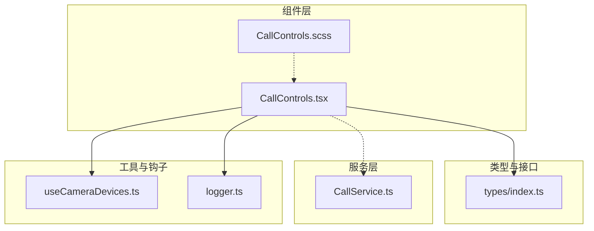
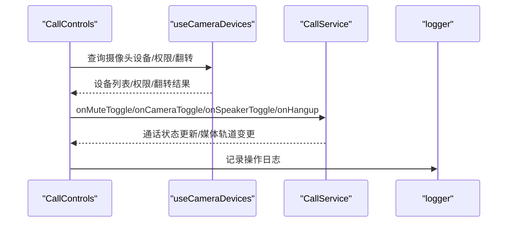
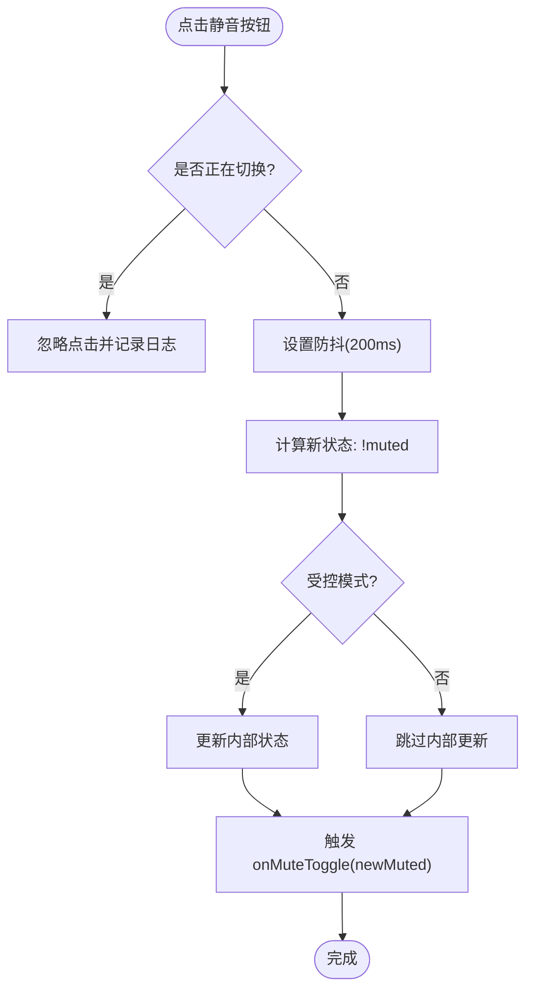
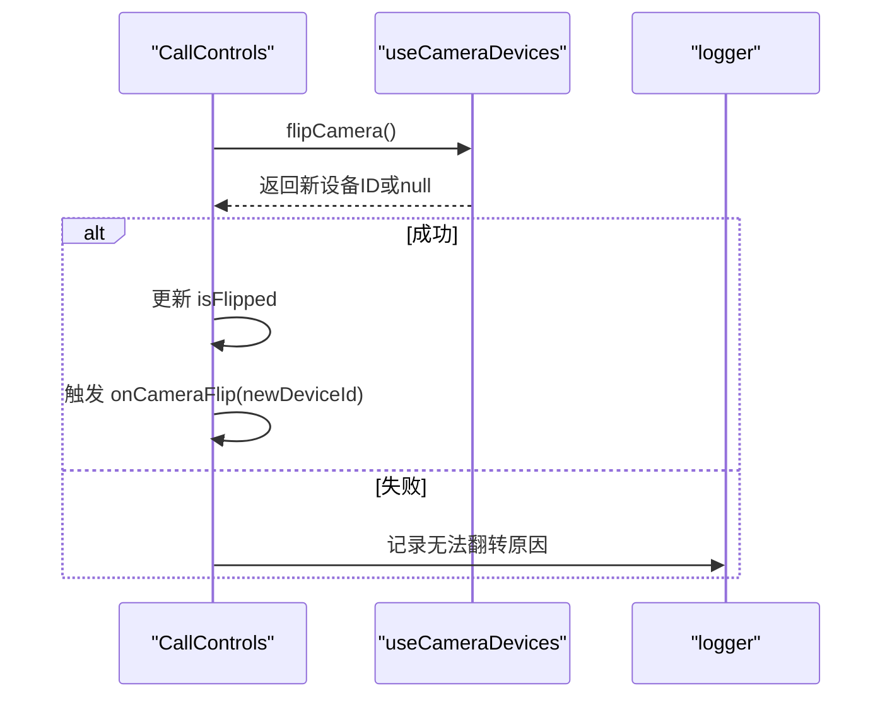
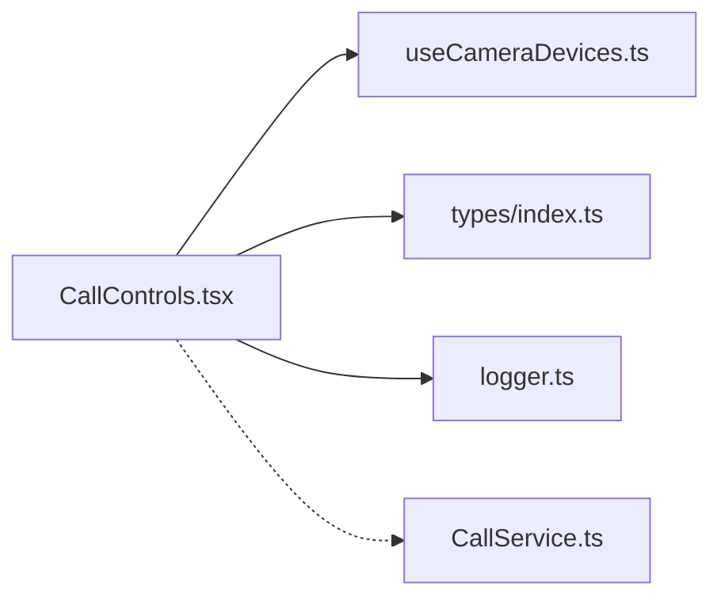

# 多人群组控件组

<cite>
**本文引用的文件**
- [CallControls.tsx](file://callkit/components/CallControls.tsx)
- [CallControls.scss](file://callkit/components/CallControls.scss)
- [index.ts](file://callkit/types/index.ts)
- [CallService.ts](file://callkit/services/CallService.ts)
- [useCameraDevices.ts](file://callkit/hooks/useCameraDevices.ts)
- [logger.ts](file://callkit/utils/logger.ts)
- [customization.md](file://callkit/docs/customization.md)
- [quickstart.md](file://callkit/docs/quickstart.md)
- [sample_runthrough.md](file://callkit/docs/sample_runthrough.md)
</cite>

## 目录
1. [简介](#简介)
2. [项目结构](#项目结构)
3. [核心组件](#核心组件)
4. [架构总览](#架构总览)
5. [详细组件分析](#详细组件分析)
6. [依赖分析](#依赖分析)
7. [性能考量](#性能考量)
8. [故障排查指南](#故障排查指南)
9. [结论](#结论)
10. [附录](#附录)

## 简介
本文件系统性地介绍 MultiCallControls 控件组（即 CallControls 组件）在多人群组通话场景下的完整能力与实现细节，涵盖音频控制（静音）、视频控制（摄像头开关/翻转）、扬声器控制、屏幕共享、通话结束等核心控件的操作逻辑与状态绑定机制。文档还解释了组件在不同模式（预览/正常通话/群组）下的交互差异、样式与响应式布局、与 CallService 的协作关系、自定义配置与扩展方法，并提供最佳实践与常见问题解决方案。

## 项目结构
- 组件层：CallControls.tsx 负责 UI 与交互逻辑，CallControls.scss 提供样式与响应式规则。
- 类型与接口：types/index.ts 定义 CallControls 的 Props、图标映射、CallKit 主组件接口等。
- 服务层：CallService.ts 管理底层通话生命周期、状态与媒体轨道，为控件提供能力支撑。
- 工具与钩子：useCameraDevices.ts 提供摄像头设备枚举、权限与翻转能力；logger.ts 提供统一日志记录。
- 文档与示例：customization.md、quickstart.md、sample_runthrough.md 提供配置与使用指南。

图表来源
- [CallControls.tsx](file://callkit/components/CallControls.tsx#L1-L808)
- [CallControls.scss](file://callkit/components/CallControls.scss#L1-L218)
- [index.ts](file://callkit/types/index.ts#L312-L356)
- [CallService.ts](file://callkit/services/CallService.ts#L116-L285)
- [useCameraDevices.ts](file://callkit/hooks/useCameraDevices.ts#L272-L387)
- [logger.ts](file://callkit/utils/logger.ts#L28-L181)

章节来源
- [CallControls.tsx](file://callkit/components/CallControls.tsx#L1-L808)
- [CallControls.scss](file://callkit/components/CallControls.scss#L1-L218)
- [index.ts](file://callkit/types/index.ts#L312-L356)

## 核心组件
- CallControls：多人群组通话控制面板，提供静音、摄像头、扬声器、挂断、摄像头翻转、屏幕共享等控件。
- 关键 Props：支持受控/非受控模式、预览模式、群组通话状态、图标自定义与渲染函数等。
- 状态绑定：isMuted、isVideoEnabled、speakerEnabled、screenSharing 等状态与组件内部状态或外部传入状态联动。
- 交互行为：防抖、并发互斥、禁用逻辑、摄像头翻转、挂断回调等。
- 样式与响应式：圆角按钮、激活/禁用/加载态、预览禁用态、移动端适配等。

章节来源
- [CallControls.tsx](file://callkit/components/CallControls.tsx#L11-L63)
- [CallControls.tsx](file://callkit/components/CallControls.tsx#L187-L204)
- [CallControls.scss](file://callkit/components/CallControls.scss#L5-L186)

## 架构总览
CallControls 作为 UI 控件，通过回调与 CallService 协作，实现对底层媒体轨道与通话状态的控制。摄像头设备能力来自 useCameraDevices 钩子，日志能力来自 logger。

图表来源
- [CallControls.tsx](file://callkit/components/CallControls.tsx#L100-L106)
- [useCameraDevices.ts](file://callkit/hooks/useCameraDevices.ts#L272-L387)
- [CallService.ts](file://callkit/services/CallService.ts#L116-L285)
- [logger.ts](file://callkit/utils/logger.ts#L28-L181)

## 详细组件分析

### 组件接口与状态绑定
- 受控/非受控模式：通过 managed 标志决定是否使用内部状态；否则使用外部传入的 muted、cameraEnabled、speakerEnabled、screenSharing。
- 默认值策略：根据 isGroupCall 或 callMode 计算默认摄像头状态；扬声器默认开启。
- 群组通话状态：isGroupCall、hasParticipants、isConnected 影响按钮禁用与交互行为。
- 图标自定义：customIcons 与 iconRenderer 支持完全替换或自定义渲染。

章节来源
- [CallControls.tsx](file://callkit/components/CallControls.tsx#L11-L63)
- [CallControls.tsx](file://callkit/components/CallControls.tsx#L132-L149)
- [CallControls.tsx](file://callkit/components/CallControls.tsx#L187-L204)
- [index.ts](file://callkit/types/index.ts#L324-L337)

### 音频控制（静音）
- 防抖与并发互斥：使用 isTogglingMic 与防抖定时器避免频繁切换。
- 状态同步：受控模式下更新内部状态，再触发 onMuteToggle 回调。
- 禁用逻辑：操作中禁用按钮，预览/群组等待阶段允许点击但有日志提示。

图表来源
- [CallControls.tsx](file://callkit/components/CallControls.tsx#L262-L311)

章节来源
- [CallControls.tsx](file://callkit/components/CallControls.tsx#L262-L311)

### 视频控制（摄像头开关/翻转）
- 摄像头开关：与静音类似，使用 isTogglingCamera 与防抖；群组等待阶段允许切换。
- 摄像头翻转：依赖 useCameraDevices 的 flipCamera，仅在多摄像头、有权限、摄像头开启时可用；翻转后更新 isFlipped 以改变按钮视觉状态。
- 禁用策略：当 shouldDisableControls 或 isTogglingCamera 为真时禁用；DOM 级禁用与样式禁用并存。

图表来源
- [CallControls.tsx](file://callkit/components/CallControls.tsx#L440-L458)
- [useCameraDevices.ts](file://callkit/hooks/useCameraDevices.ts#L353-L377)

章节来源
- [CallControls.tsx](file://callkit/components/CallControls.tsx#L313-L375)
- [CallControls.tsx](file://callkit/components/CallControls.tsx#L440-L458)
- [useCameraDevices.ts](file://callkit/hooks/useCameraDevices.ts#L353-L377)

### 扬声器控制
- 防抖与互斥：使用 isTogglingSpeaker 与较短防抖（100ms）。
- 状态同步：受控模式更新内部状态，触发 onSpeakerToggle 回调。
- 禁用策略：操作中禁用按钮。

章节来源
- [CallControls.tsx](file://callkit/components/CallControls.tsx#L377-L426)

### 屏幕共享（预留）
- 屏幕共享按钮当前被注释，保留接口 onScreenShareToggle 与内部状态 screenSharing。
- 使用时可解除注释并按需扩展 UI 与样式。

章节来源
- [CallControls.tsx](file://callkit/components/CallControls.tsx#L428-L438)

### 通话结束
- 挂断按钮统一触发 onHangup 回调，交由上层 CallService 或 CallKit 处理实际挂断流程。

章节来源
- [CallControls.tsx](file://callkit/components/CallControls.tsx#L460-L462)

### 预览模式与群组模式差异
- 预览模式：显示挂断/拒绝/接听按钮；摄像头翻转仅在多摄像头时显示；群组预览下麦克风可能受限。
- 群组模式：未连接时禁用部分按钮；摄像头翻转在等待阶段允许；默认摄像头关闭。

章节来源
- [CallControls.tsx](file://callkit/components/CallControls.tsx#L205-L229)
- [CallControls.tsx](file://callkit/components/CallControls.tsx#L237-L260)
- [CallControls.tsx](file://callkit/components/CallControls.tsx#L132-L149)

### 样式与响应式布局
- 布局：flex 布局，按钮组垂直排列，按钮尺寸与间距在不同断点下自适应。
- 状态样式：激活态（功能开启）、禁用态（DOM 级禁用+样式）、加载态（操作中）。
- 预览禁用态：文本与图标透明度调整，视觉反馈更柔和。
- 移动端适配：在 768px 与 480px 断点下调整按钮尺寸与间距。

章节来源
- [CallControls.scss](file://callkit/components/CallControls.scss#L5-L186)
- [CallControls.scss](file://callkit/components/CallControls.scss#L188-L218)

### 与 CallService 的协作关系
- CallControls 通过回调将用户操作转化为对 CallService 的调用（如静音、摄像头、扬声器切换）。
- CallService 负责底层媒体轨道创建、加入/离开频道、网络质量、远端用户加入/离开等。
- CallControls 仅负责 UI 与交互，不直接操作媒体轨道。

章节来源
- [CallControls.tsx](file://callkit/components/CallControls.tsx#L79-L83)
- [CallService.ts](file://callkit/services/CallService.ts#L116-L285)

### 自定义配置与扩展方法
- 图标自定义：通过 customIcons 与 iconRenderer 完全替换或自定义渲染。
- CallKit 级别自定义：参考 customization.md 中的自定义图标配置项。
- 日志：通过 logger 提供统一日志记录，便于调试与追踪。

章节来源
- [CallControls.tsx](file://callkit/components/CallControls.tsx#L56-L62)
- [index.ts](file://callkit/types/index.ts#L324-L337)
- [customization.md](file://callkit/docs/customization.md#L66-L82)
- [logger.ts](file://callkit/utils/logger.ts#L28-L181)

## 依赖分析
- 组件依赖 useCameraDevices 获取摄像头设备列表、权限与翻转能力。
- 组件依赖 types/index.ts 中的 CallControlsIconMap、CallControlsProps 等类型定义。
- 组件依赖 logger.ts 提供的日志能力。
- 组件与 CallService 通过回调解耦，遵循“UI 控件只负责交互”的原则。

图表来源
- [CallControls.tsx](file://callkit/components/CallControls.tsx#L1-L10)
- [useCameraDevices.ts](file://callkit/hooks/useCameraDevices.ts#L272-L387)
- [index.ts](file://callkit/types/index.ts#L312-L356)
- [logger.ts](file://callkit/utils/logger.ts#L28-L181)
- [CallService.ts](file://callkit/services/CallService.ts#L116-L285)

章节来源
- [CallControls.tsx](file://callkit/components/CallControls.tsx#L1-L10)
- [useCameraDevices.ts](file://callkit/hooks/useCameraDevices.ts#L272-L387)
- [index.ts](file://callkit/types/index.ts#L312-L356)
- [logger.ts](file://callkit/utils/logger.ts#L28-L181)
- [CallService.ts](file://callkit/services/CallService.ts#L116-L285)

## 性能考量
- 防抖优化：静音与摄像头切换采用防抖（200ms），扬声器切换采用短防抖（100ms），减少频繁调用带来的性能损耗。
- 并发互斥：isTogglingMic/isTogglingCamera/isTogglingSpeaker 避免同一操作并发执行。
- DOM 级禁用：按钮在禁用时使用 disabled 属性，阻止事件冒泡与多余计算。
- 响应式布局：在小屏设备上减小按钮尺寸与间距，提升交互体验与渲染效率。

章节来源
- [CallControls.tsx](file://callkit/components/CallControls.tsx#L262-L311)
- [CallControls.tsx](file://callkit/components/CallControls.tsx#L313-L375)
- [CallControls.tsx](file://callkit/components/CallControls.tsx#L377-L426)
- [CallControls.scss](file://callkit/components/CallControls.scss#L188-L218)

## 故障排查指南
- 摄像头翻转无效
  - 检查 hasMultipleCameras、hasPermission、cameraEnabled 三者是否满足；查看日志输出定位原因。
  - 确认设备列表缓存是否过期，必要时手动刷新。
- 静音/摄像头/扬声器切换失败
  - 查看回调是否抛错；组件会在失败时回滚内部状态；检查 CallService 的媒体轨道状态。
- 预览模式按钮不可用
  - 群组等待阶段可能禁用部分按钮；确认 isGroupCall、isConnected、isPreview 的组合状态。
- 日志定位
  - 使用 logger 的 debug/warn/error 级别输出，结合组件内的 logDebug/logError 输出定位问题。

章节来源
- [CallControls.tsx](file://callkit/components/CallControls.tsx#L440-L458)
- [CallControls.tsx](file://callkit/components/CallControls.tsx#L262-L311)
- [CallControls.tsx](file://callkit/components/CallControls.tsx#L313-L375)
- [CallControls.tsx](file://callkit/components/CallControls.tsx#L377-L426)
- [useCameraDevices.ts](file://callkit/hooks/useCameraDevices.ts#L353-L377)
- [logger.ts](file://callkit/utils/logger.ts#L28-L181)

## 结论
MultiCallControls 控件组在多人群组通话场景下提供了完善的 UI 控制能力，通过防抖、并发互斥、禁用策略与图标自定义，兼顾了易用性与可扩展性。其与 CallService 解耦的设计使得 UI 与业务逻辑分离，便于维护与升级。建议在实际项目中结合 CallService 的状态与回调，合理使用受控/非受控模式，并充分利用图标自定义与日志能力进行调试与优化。

## 附录
- 快速开始与示例：参考 quickstart.md 与 sample_runthrough.md，了解如何集成与发起一对一/群组通话。
- 自定义图标与样式：参考 customization.md，了解如何自定义图标与整体样式。

章节来源
- [quickstart.md](file://callkit/docs/quickstart.md#L1-L617)
- [sample_runthrough.md](file://callkit/docs/sample_runthrough.md#L1-L74)
- [customization.md](file://callkit/docs/customization.md#L66-L82)