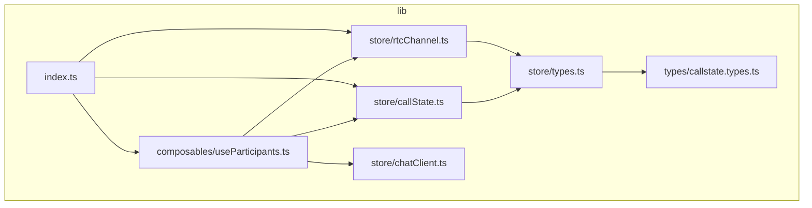
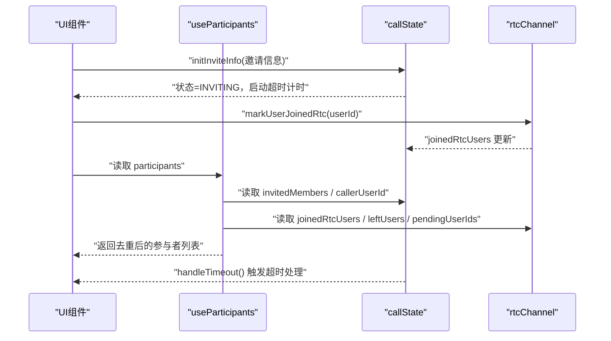
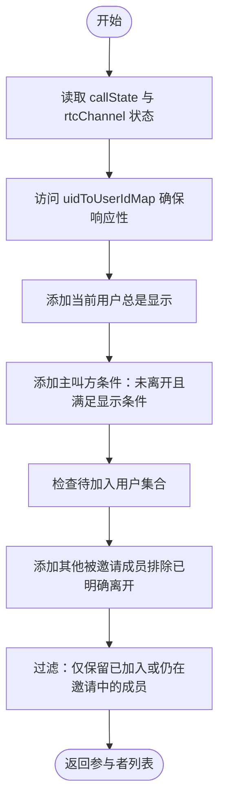
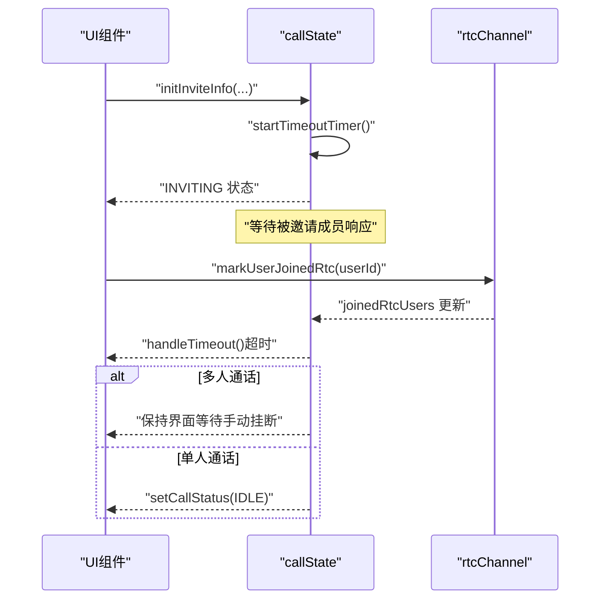
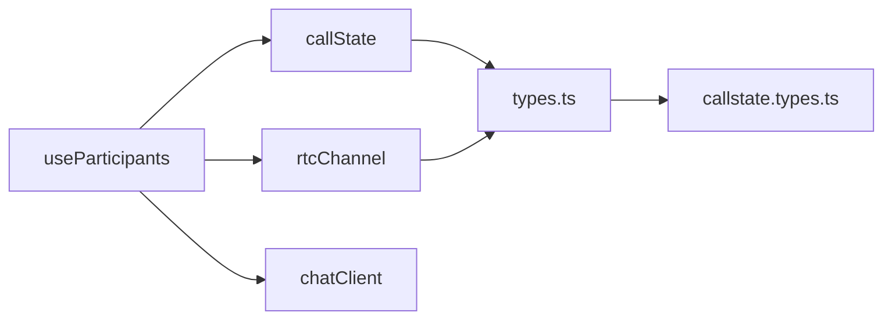

# 群组成员管理

<cite>
**本文档引用的文件**
- [lib/composables/useParticipants.ts](file://lib/composables/useParticipants.ts)
- [lib/store/callState.ts](file://lib/store/callState.ts)
- [lib/store/rtcChannel.ts](file://lib/store/rtcChannel.ts)
- [lib/store/types.ts](file://lib/store/types.ts)
- [lib/types/callstate.types.ts](file://lib/types/callstate.types.ts)
- [lib/store/chatClient.ts](file://lib/store/chatClient.ts)
- [lib/index.ts](file://lib/index.ts)
- [README.md](file://README.md)
</cite>

## 更新摘要
**变更内容**
- 增强了参与者跟踪机制，新增待加入用户集合管理
- 改进了用户状态区分逻辑，通过明确离开标记实现更精确的状态管理
- 优化了UID映射跟踪，确保计算属性能够响应映射变化
- 完善了状态转换时的清理逻辑，避免状态污染

## 目录
1. [简介](#简介)
2. [项目结构](#项目结构)
3. [核心组件](#核心组件)
4. [架构总览](#架构总览)
5. [详细组件分析](#详细组件分析)
6. [依赖关系分析](#依赖关系分析)
7. [性能考虑](#性能考虑)
8. [故障排查指南](#故障排查指南)
9. [结论](#结论)
10. [附录](#附录)

## 简介
本文件聚焦于群组成员管理功能，围绕"群组成员列表弹窗"的实现进行系统化说明。内容涵盖成员信息展示、邀请新成员、成员状态管理、成员列表数据结构与区分逻辑、邀请流程（含邀请消息发送、邀请超时处理、成员加入状态更新）、搜索与筛选能力、权限管理、API 接口说明与使用示例，以及最佳实践与性能优化建议。

## 项目结构
本项目采用模块化组织方式，核心与状态管理位于 lib 目录，其中：
- composable 层负责组合式逻辑（如 useParticipants）
- store 层负责 Pinia 状态管理（callState、rtcChannel）
- types 层定义类型与常量（callstate.types）

**图表来源**
- [lib/composables/useParticipants.ts:1-122](file://lib/composables/useParticipants.ts#L1-L122)
- [lib/store/callState.ts:1-263](file://lib/store/callState.ts#L1-L263)
- [lib/store/rtcChannel.ts:1-410](file://lib/store/rtcChannel.ts#L1-L410)
- [lib/store/types.ts:1-86](file://lib/store/types.ts#L1-L86)
- [lib/types/callstate.types.ts:1-93](file://lib/types/callstate.types.ts#L1-L93)
- [lib/store/chatClient.ts:1-23](file://lib/store/chatClient.ts#L1-L23)
- [lib/index.ts:1-58](file://lib/index.ts#L1-L58)

**章节来源**
- [README.md:5-31](file://README.md#L5-L31)
- [lib/index.ts:1-58](file://lib/index.ts#L1-L58)

## 核心组件
- useParticipants：动态生成群组参与者列表，自动过滤已离开用户并标记加入状态，增强的用户状态跟踪
- callState：维护通话状态、邀请信息、超时控制、用户信息映射等，支持状态转换时的清理逻辑
- rtcChannel：维护 RTC 频道状态、用户加入/离开、UID 映射、待加入用户集合、计时器等
- 类型系统：统一的状态枚举、接口定义与常量

**章节来源**
- [lib/composables/useParticipants.ts:1-122](file://lib/composables/useParticipants.ts#L1-L122)
- [lib/store/callState.ts:1-263](file://lib/store/callState.ts#L1-L263)
- [lib/store/rtcChannel.ts:1-410](file://lib/store/rtcChannel.ts#L1-L410)
- [lib/store/types.ts:1-86](file://lib/store/types.ts#L1-L86)
- [lib/types/callstate.types.ts:1-93](file://lib/types/callstate.types.ts#L1-L93)

## 架构总览
群组成员管理的运行时交互如下：
- useParticipants 依赖 callState 与 rtcChannel 的状态，计算出最终的参与者列表
- callState 负责邀请初始化、超时控制、状态切换与用户信息缓存，支持状态转换时的清理逻辑
- rtcChannel 负责用户加入/离开、UID 映射、待加入用户集合、计时器与频道生命周期管理

**图表来源**
- [lib/composables/useParticipants.ts:29-116](file://lib/composables/useParticipants.ts#L29-L116)
- [lib/store/callState.ts:49-131](file://lib/store/callState.ts#L49-L131)
- [lib/store/rtcChannel.ts:292-337](file://lib/store/rtcChannel.ts#L292-L337)

## 详细组件分析

### 增强的参与者跟踪与状态管理

#### 待加入用户集合管理
- **pendingUserIds 集合**：新增的待加入用户集合，用于跟踪收到 answerCall 但尚未加入 RTC 的用户
- **addPendingUserId(userId)**：标记用户为待加入状态
- **removePendingUserId(userId)**：从待加入列表移除用户
- **popPendingUserId()**：获取并移除第一个待加入用户，用于 RTC uid 匹配

#### 明确离开用户标记
- **leftUsers 集合**：已明确离开的用户集合，避免挂断后仍显示"邀请中"
- **hasUserLeft(userId)**：精确检查用户是否已明确离开
- **clearLeftUsers()**：新通话开始时清空离开用户列表

#### UID映射优化
- **uidToUserIdMap 访问**：在 useParticipants 中访问 UID 到用户 ID 的映射，确保计算属性响应其变化
- **响应式更新**：通过强制赋值确保 UI 实时反映映射变化

**图表来源**
- [lib/composables/useParticipants.ts:29-116](file://lib/composables/useParticipants.ts#L29-L116)
- [lib/store/rtcChannel.ts:324-329](file://lib/store/rtcChannel.ts#L324-L329)

**章节来源**
- [lib/composables/useParticipants.ts:6-14](file://lib/composables/useParticipants.ts#L6-L14)
- [lib/composables/useParticipants.ts:29-116](file://lib/composables/useParticipants.ts#L29-L116)
- [lib/store/rtcChannel.ts:24-28](file://lib/store/rtcChannel.ts#L24-L28)
- [lib/store/rtcChannel.ts:324-329](file://lib/store/rtcChannel.ts#L324-L329)

### 邀请流程与超时处理
- 邀请初始化
  - 调用 initInviteInfo，设置 type、calleeUserId、groupId/groupName/groupAvatar、invitedMembers
  - 生成 callId/channel，状态置为 INVITING，并启动 inviteTimeoutTimer
- 邀请超时
  - startTimeoutTimer 清除旧定时器后设置新定时器
  - handleTimeout：单人通话场景自动回到 IDLE 并隐藏界面；多人通话场景保持界面等待用户手动挂断
- 成员加入状态更新
  - markUserJoinedRtc(userId)：加入 RTC 集合，从 leftUsers 移除
  - markUserLeftRtc(userId)：从 joinedRtcUsers 删除，并加入 leftUsers，避免挂断后仍显示"邀请中"

**图表来源**
- [lib/store/callState.ts:49-131](file://lib/store/callState.ts#L49-L131)
- [lib/store/rtcChannel.ts:292-337](file://lib/store/rtcChannel.ts#L292-L337)

**章节来源**
- [lib/store/callState.ts:49-131](file://lib/store/callState.ts#L49-L131)
- [lib/store/rtcChannel.ts:292-337](file://lib/store/rtcChannel.ts#L292-L337)

### 成员状态管理与 UI 行为
- 状态字段
  - isMuted：静音状态（当前实现固定为 false，可在 UI 层扩展）
  - isInviting：是否仍在邀请中（依据 hasJoined=false 判断）
  - hasJoined：是否已加入 RTC
- UI 行为
  - 已加入：显示在线状态
  - 邀请中：显示"邀请中"占位或加载态
  - 已离开：不再显示（由 leftUsers 保护）

**章节来源**
- [lib/composables/useParticipants.ts:46-102](file://lib/composables/useParticipants.ts#L46-L102)

### 搜索与筛选功能
- 当前实现
  - useParticipants 返回的列表为计算结果，未内置搜索/筛选逻辑
- 建议实现方式
  - 在 UI 层对 participants 进行二次过滤（按昵称/用户ID模糊匹配）
  - 结合 callState 的 userInfoMap 提供更准确的昵称匹配
- 性能建议
  - 使用防抖搜索，避免高频重渲染
  - 将过滤逻辑置于 computed 中，结合响应式数据自动更新

**章节来源**
- [lib/composables/useParticipants.ts:29-116](file://lib/composables/useParticipants.ts#L29-L116)
- [lib/store/callState.ts:72-84](file://lib/store/callState.ts#L72-L84)

### 权限管理
- 当前仓库未暴露成员角色/权限相关接口
- 建议扩展点
  - 在 INVITE_INFO 中增加角色字段（如主持人、普通成员）
  - 在 UI 层根据角色控制操作按钮（如静音、踢人、解除静音）
  - 在 callState 中维护角色映射表，配合 useParticipants 输出不同权限的成员项

**章节来源**
- [lib/store/types.ts:35-42](file://lib/store/types.ts#L35-L42)

### API 接口说明与使用示例
- 导出入口
  - 组件与 Hook：EasemobChatCallKitProvider、EasemobChatSingleCall、EasemobChatMultiCall、InvitationNotification、EasemobChatMiniWindow
  - Store：useCallStateStore、useRtcChannelStore
  - Hook：useCallKit、useEndCall、useAnswerCall、useRtcService、useJoinChannel、useParticipants
  - 类型：CALL_STATUS、CALL_TYPE、HANGUP_REASON 等
- 使用示例（基于仓库提供的安装与使用方式）
  - 安装插件并在应用中注册组件
  - 在组件中使用 useParticipants 获取成员列表
  - 使用 useCallStateStore 与 useRtcChannelStore 控制状态与行为

**章节来源**
- [lib/index.ts:18-46](file://lib/index.ts#L18-L46)
- [README.md:136-165](file://README.md#L136-L165)

## 依赖关系分析
- useParticipants 依赖
  - callState：invitedMembers、callerUserId、userInfoMap
  - rtcChannel：joinedRtcUsers、leftUsers、pendingUserIds、uidToUserIdMap
  - chatClient：currentUserId 获取
- 状态耦合
  - callState 与 rtcChannel 在成员状态切换时存在强关联（加入/离开、超时）
  - 状态转换时自动清理 leftUsers 集合
- 外部依赖
  - Pinia（状态管理）
  - easemob-websdk（IM SDK）
  - agora-rtc-sdk-ng（RTC 服务）

**图表来源**
- [lib/composables/useParticipants.ts:1-5](file://lib/composables/useParticipants.ts#L1-L5)
- [lib/store/callState.ts:1-6](file://lib/store/callState.ts#L1-L6)
- [lib/store/rtcChannel.ts:1-5](file://lib/store/rtcChannel.ts#L1-L5)
- [lib/store/types.ts:1-8](file://lib/store/types.ts#L1-L8)
- [lib/types/callstate.types.ts:1-8](file://lib/types/callstate.types.ts#L1-L8)

**章节来源**
- [lib/composables/useParticipants.ts:1-5](file://lib/composables/useParticipants.ts#L1-L5)
- [lib/store/callState.ts:1-6](file://lib/store/callState.ts#L1-L6)
- [lib/store/rtcChannel.ts:1-5](file://lib/store/rtcChannel.ts#L1-L5)
- [lib/store/types.ts:1-8](file://lib/store/types.ts#L1-L8)
- [lib/types/callstate.types.ts:1-8](file://lib/types/callstate.types.ts#L1-L8)

## 性能考虑
- 计算属性优化
  - useParticipants 使用 computed，内部通过浅拷贝与日志调试，避免不必要的重算
  - 访问 uidToUserIdMap 确保计算属性响应映射变化
- 集合操作
  - joinedRtcUsers/leftUsers/pendingUserIds 使用 Set，提升查找与去重效率
- 响应式更新
  - 对 Set 进行强制赋值以触发响应式更新，确保 UI 实时反映状态变化
- 超时控制
  - startTimeoutTimer 会先清除旧定时器，避免重复计时导致的内存泄漏与异常行为
- 状态清理
  - 新通话开始时自动清空 leftUsers 集合，避免状态污染

**章节来源**
- [lib/composables/useParticipants.ts:34-46](file://lib/composables/useParticipants.ts#L34-L46)
- [lib/composables/useParticipants.ts:104-116](file://lib/composables/useParticipants.ts#L104-L116)
- [lib/store/rtcChannel.ts:292-301](file://lib/store/rtcChannel.ts#L292-L301)
- [lib/store/rtcChannel.ts:307-314](file://lib/store/rtcChannel.ts#L307-L314)
- [lib/store/callState.ts:89-110](file://lib/store/callState.ts#L89-L110)
- [lib/store/callState.ts:146-150](file://lib/store/callState.ts#L146-L150)

## 故障排查指南
- 常见问题
  - 成员列表为空
    - 检查 invitedMembers 是否正确初始化
    - 确认当前用户与主叫方是否被过滤（已明确离开）
  - "邀请中"状态不消失
    - 确认 markUserJoinedRtc 是否被调用
    - 检查 leftUsers 是否误将用户标记为已离开
  - 超时后界面未隐藏
    - 单人通话场景应自动回到 IDLE；多人通话场景需手动挂断
  - 待加入用户状态异常
    - 检查 pendingUserIds 集合是否正确管理
    - 确认 popPendingUserId 方法是否正确移除用户
- 日志定位
  - useParticipants 在计算过程中打印调试日志，便于观察输入状态与输出结果
  - rtcChannel 与 callState 在关键状态变更处记录日志

**章节来源**
- [lib/composables/useParticipants.ts:37-46](file://lib/composables/useParticipants.ts#L37-L46)
- [lib/composables/useParticipants.ts:104-116](file://lib/composables/useParticipants.ts#L104-L116)
- [lib/store/rtcChannel.ts:292-314](file://lib/store/rtcChannel.ts#L292-L314)
- [lib/store/callState.ts:115-131](file://lib/store/callState.ts#L115-L131)

## 结论
本方案通过 useParticipants、callState 与 rtcChannel 的协同，实现了群组成员列表的动态生成与状态管理。核心优势在于：
- 明确区分"已加入"与"邀请中"两类成员
- 通过 leftUsers 防止已离开用户在 UI 上反复出现
- 新增待加入用户集合管理，提供更精确的状态跟踪
- 优化 UID 映射响应机制，确保状态变化的实时性
- 完善状态转换时的清理逻辑，避免状态污染
- 提供超时控制与多人/单人通话差异化处理

建议在后续迭代中补充搜索/筛选与权限管理能力，以进一步完善群组成员管理体验。

## 附录
- 相关类型与常量
  - CALL_STATUS、CALL_TYPE、HANGUP_REASON 等
  - INVITE_INFO、CallState、RtcChannelState 等接口
- 导出清单
  - 组件：EasemobChatCallKitProvider、EasemobChatSingleCall、EasemobChatMultiCall、InvitationNotification、EasemobChatMiniWindow
  - Store：useCallStateStore、useRtcChannelStore
  - Hook：useCallKit、useEndCall、useAnswerCall、useRtcService、useJoinChannel、useParticipants

**章节来源**
- [lib/types/callstate.types.ts:1-93](file://lib/types/callstate.types.ts#L1-L93)
- [lib/store/types.ts:35-85](file://lib/store/types.ts#L35-L85)
- [lib/index.ts:18-46](file://lib/index.ts#L18-L46)