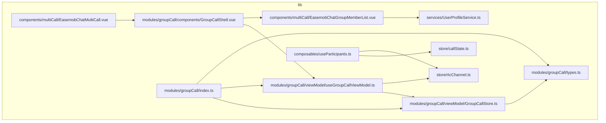
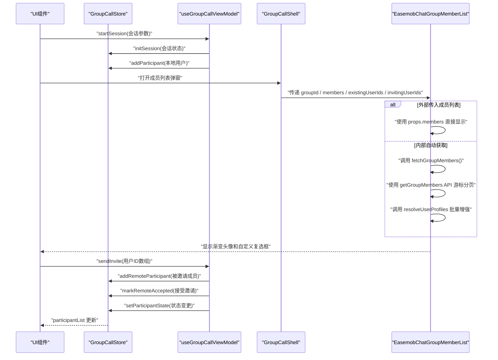
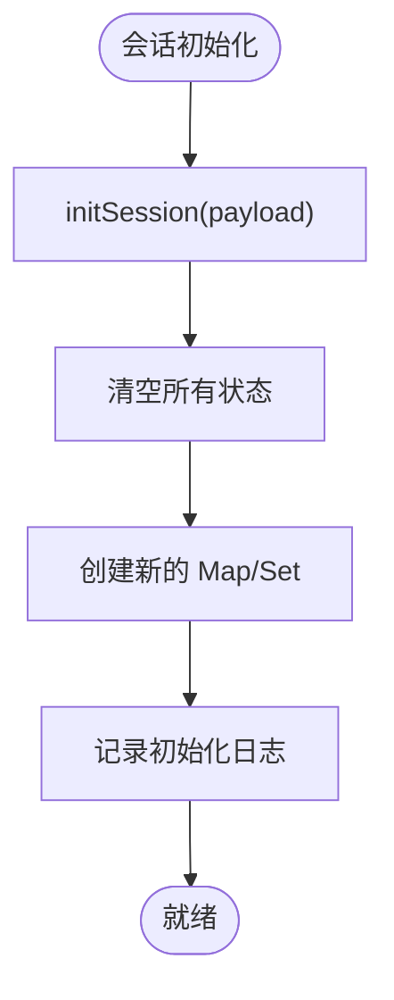
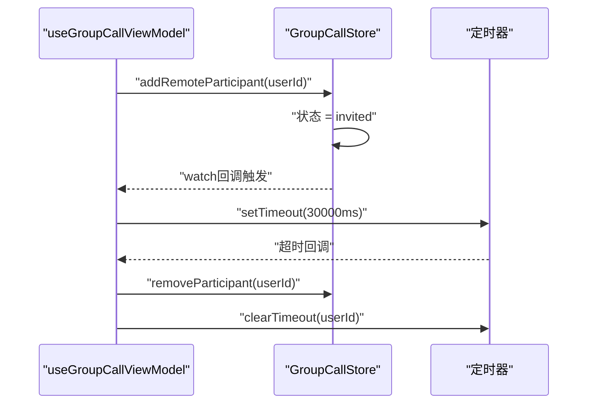
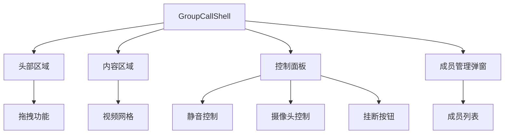
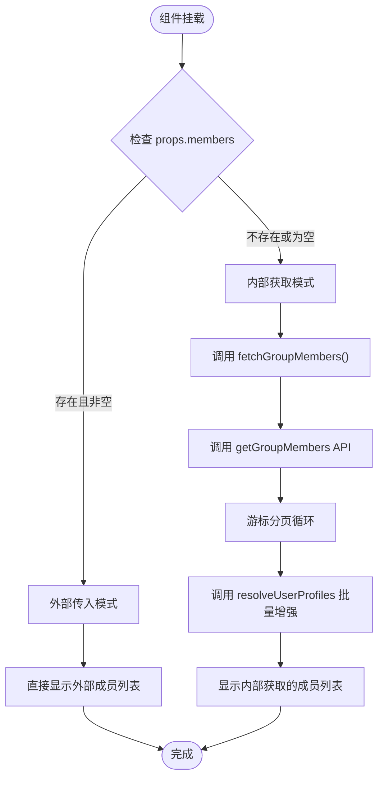
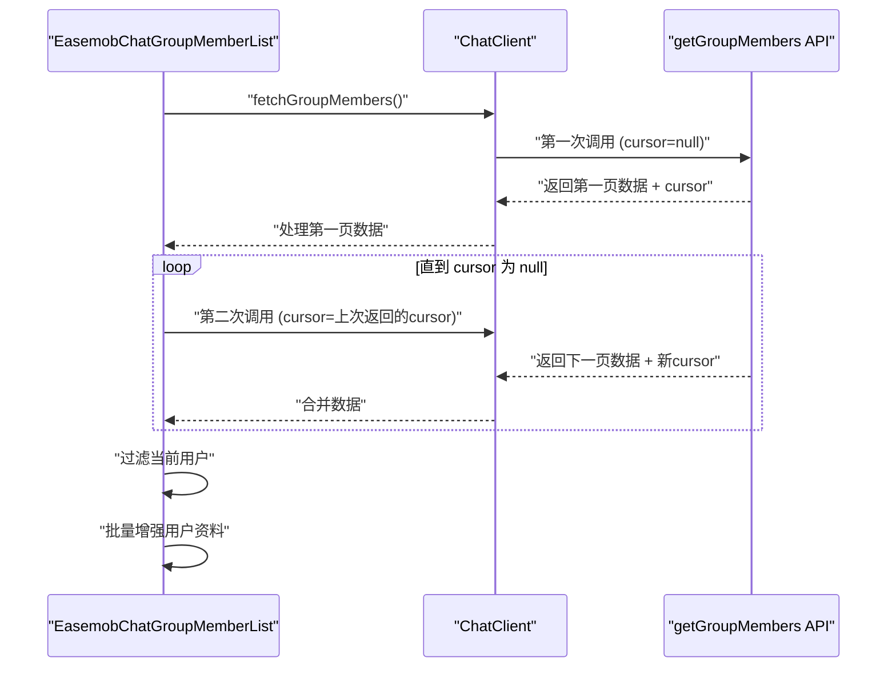
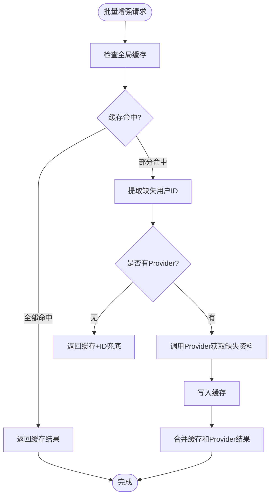
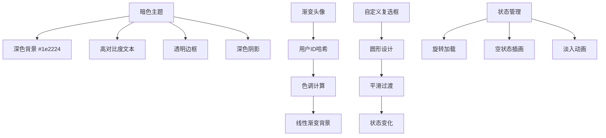
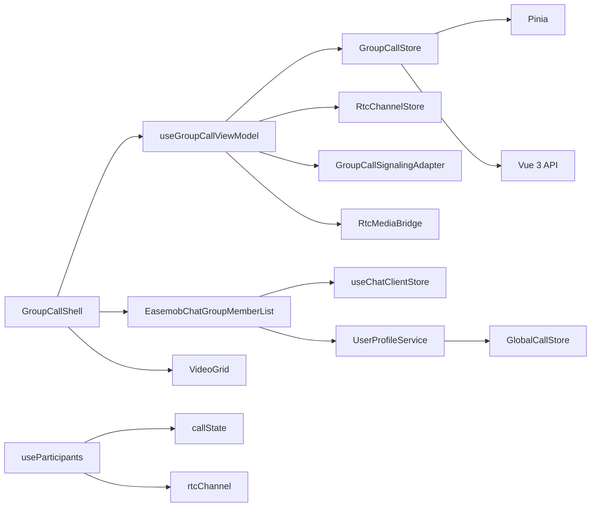

# 群组成员管理

<cite>
**本文档引用的文件**
- [lib/modules/groupCall/viewModel/GroupCallStore.ts](file://lib/modules/groupCall/viewModel/GroupCallStore.ts)
- [lib/modules/groupCall/viewModel/useGroupCallViewModel.ts](file://lib/modules/groupCall/viewModel/useGroupCallViewModel.ts)
- [lib/modules/groupCall/types.ts](file://lib/modules/groupCall/types.ts)
- [lib/modules/groupCall/components/GroupCallShell.vue](file://lib/modules/groupCall/components/GroupCallShell.vue)
- [lib/modules/groupCall/index.ts](file://lib/modules/groupCall/index.ts)
- [lib/store/callState.ts](file://lib/store/callState.ts)
- [lib/store/rtcChannel.ts](file://lib/store/rtcChannel.ts)
- [lib/store/types.ts](file://lib/store/types.ts)
- [lib/types/callstate.types.ts](file://lib/types/callstate.types.ts)
- [lib/store/chatClient.ts](file://lib/store/chatClient.ts)
- [lib/index.ts](file://lib/index.ts)
- [lib/components/multiCall/EasemobChatGroupMemberList.vue](file://lib/components/multiCall/EasemobChatGroupMemberList.vue)
- [lib/components/multiCall/styles/EasemobChatGroupMemberList.css](file://lib/components/multiCall/styles/EasemobChatGroupMemberList.css)
- [lib/components/multiCall/EasemobChatMultiCall.vue](file://lib/components/multiCall/EasemobChatMultiCall.vue)
- [lib/services/UserProfileService.ts](file://lib/services/UserProfileService.ts)
- [lib/components/InvitationNotification.vue](file://lib/components/InvitationNotification.vue)
- [callkit/styles/variables.scss](file://callkit/styles/variables.scss)
- [callkit/styles/layouts/multi-party-full.scss](file://callkit/styles/layouts/multi-party-full.scss)
- [README.md](file://README.md)
</cite>

## 更新摘要
**变更内容**
- EasemobChatGroupMemberList.vue 实现双轨制操作：支持外部传入成员列表或内部自动获取
- 采用新的 getGroupMembers API 进行游标分页获取群成员，支持大数据量群组
- 集成 UserProfileService 批量用户资料增强，提升用户体验
- 新增 useParticipants.ts 已被新的 GroupCallStore 替代，旧的参与者管理逻辑已集成到新架构的状态管理系统中
- 新增 GroupCallStore 作为群组通话参与者与状态的单一事实源，替代旧架构中的 useParticipants + rtcChannelStore 分散逻辑
- 新增 useGroupCallViewModel 作为群组通话的顶层 ViewModel，连接 Store、MediaBridge、SignalingAdapter
- GroupCallShell 作为新的群组通话外壳组件，集成成员管理功能
- 旧的 callState 与 rtcChannel 状态管理继续支持单人通话场景，群聊成员管理迁移到新架构

## 目录
1. [简介](#简介)
2. [项目结构](#项目结构)
3. [核心组件](#核心组件)
4. [架构总览](#架构总览)
5. [详细组件分析](#详细组件分析)
6. [双轨制操作模式](#双轨制操作模式)
7. [游标分页获取群成员](#游标分页获取群成员)
8. [批量用户资料增强](#批量用户资料增强)
9. [UI 主题与视觉设计](#ui-主题与视觉设计)
10. [依赖关系分析](#依赖关系分析)
11. [性能考虑](#性能考虑)
12. [故障排查指南](#故障排查指南)
13. [结论](#结论)
14. [附录](#附录)

## 简介
本文件聚焦于群组成员管理功能，围绕"群组成员列表弹窗"的实现进行系统化说明。内容涵盖成员信息展示、邀请新成员、成员状态管理、成员列表数据结构与区分逻辑、邀请流程（含邀请消息发送、邀请超时处理、成员加入状态更新）、搜索与筛选能力、权限管理、API 接口说明与使用示例，以及最佳实践与性能优化建议。

**更新** 新架构采用 GroupCallStore 作为单一事实源，替代了原有的 useParticipants + rtcChannelStore 分散逻辑，提供更清晰的状态管理和更强大的功能扩展能力。新增的双轨制操作模式和游标分页获取机制，显著提升了大规模群组的成员管理效率。

## 项目结构
本项目采用模块化组织方式，核心与状态管理位于 lib 目录，其中：
- **modules/groupCall**：新的群组通话模块，包含 ViewModel、Store、组件和类型定义
- **composable 层**：包含兼容旧架构的 useParticipants（已标注废弃）
- **store 层**：Pinia 状态管理（callState、rtcChannel）
- **types 层**：统一的类型定义（groupCall/types）
- **components 层**：现代化 UI 组件（包括新的 GroupCallShell）
- **services 层**：用户资料服务（UserProfileService）

**图表来源**
- [lib/modules/groupCall/viewModel/GroupCallStore.ts:1-252](file://lib/modules/groupCall/viewModel/GroupCallStore.ts#L1-L252)
- [lib/modules/groupCall/viewModel/useGroupCallViewModel.ts:1-299](file://lib/modules/groupCall/viewModel/useGroupCallViewModel.ts#L1-L299)
- [lib/modules/groupCall/types.ts:1-57](file://lib/modules/groupCall/types.ts#L1-L57)
- [lib/modules/groupCall/components/GroupCallShell.vue:1-306](file://lib/modules/groupCall/components/GroupCallShell.vue#L1-L306)
- [lib/modules/groupCall/index.ts:1-18](file://lib/modules/groupCall/index.ts#L1-L18)
- [lib/composables/useParticipants.ts:1-123](file://lib/composables/useParticipants.ts#L1-L123)
- [lib/services/UserProfileService.ts:1-137](file://lib/services/UserProfileService.ts#L1-L137)

**章节来源**
- [README.md:5-31](file://README.md#L5-L31)
- [lib/index.ts:1-67](file://lib/index.ts#L1-L67)

## 核心组件
- **GroupCallStore**：群组通话参与者与状态的单一事实源，替代旧架构中的 useParticipants + rtcChannelStore 分散逻辑
- **useGroupCallViewModel**：群组通话的顶层 ViewModel，连接 Store、MediaBridge、SignalingAdapter
- **GroupCallShell**：新的群组通话外壳组件，集成成员管理、视频网格布局等功能
- **EasemobChatGroupMemberList**：现代化群组成员列表弹窗组件，支持双轨制操作（外部传入成员列表或内部自动获取）、暗色主题、渐变头像、自定义复选框、加载状态和空状态
- **UserProfileService**：批量用户资料解析服务，支持缓存和 Provider 模式
- **useParticipants**：已废弃的旧架构参与者管理（仅保留兼容性）

**章节来源**
- [lib/modules/groupCall/viewModel/GroupCallStore.ts:1-252](file://lib/modules/groupCall/viewModel/GroupCallStore.ts#L1-L252)
- [lib/modules/groupCall/viewModel/useGroupCallViewModel.ts:1-299](file://lib/modules/groupCall/viewModel/useGroupCallViewModel.ts#L1-L299)
- [lib/modules/groupCall/components/GroupCallShell.vue:1-306](file://lib/modules/groupCall/components/GroupCallShell.vue#L1-L306)
- [lib/services/UserProfileService.ts:1-137](file://lib/services/UserProfileService.ts#L1-L137)
- [lib/composables/useParticipants.ts:16-20](file://lib/composables/useParticipants.ts#L16-L20)

## 架构总览
群组成员管理的新架构运行时交互如下：
- **GroupCallStore** 作为单一事实源，维护会话状态、参与者列表、UID 映射等
- **useGroupCallViewModel** 连接 Store、MediaBridge、SignalingAdapter，处理业务逻辑
- **GroupCallShell** 作为外壳组件，集成视频网格、控制面板、成员管理弹窗
- **EasemobChatGroupMemberList** 作为独立组件，负责成员列表的展示与交互，支持双轨制操作

**图表来源**
- [lib/modules/groupCall/viewModel/useGroupCallViewModel.ts:230-240](file://lib/modules/groupCall/viewModel/useGroupCallViewModel.ts#L230-L240)
- [lib/modules/groupCall/viewModel/GroupCallStore.ts:60-92](file://lib/modules/groupCall/viewModel/GroupCallStore.ts#L60-L92)
- [lib/modules/groupCall/components/GroupCallShell.vue:294-302](file://lib/modules/groupCall/components/GroupCallShell.vue#L294-L302)
- [lib/components/multiCall/EasemobChatGroupMemberList.vue:118-186](file://lib/components/multiCall/EasemobChatGroupMemberList.vue#L118-L186)

## 详细组件分析

### GroupCallStore - 单一事实源

#### 核心状态管理
- **session**：维护会话基本信息（sessionId、groupId、callType、isActive、startTime）
- **participants**：Map 结构存储参与者，键为 userId，值为完整参与者信息
- **uidToUserIdMap**：UID 到用户 ID 的映射表，支持强推断解析
- **acceptedMembers**：已接受邀请的用户集合

#### 参与者状态管理
- **participantList**：计算属性，按 isLocal、joinedAt、invitedAt 排序
- **localParticipant**：本地参与者计算属性
- **activeParticipants**：活跃参与者过滤（排除 left 状态）
- **publishingParticipants**：正在发布的参与者过滤

**图表来源**
- [lib/modules/groupCall/viewModel/GroupCallStore.ts:43-49](file://lib/modules/groupCall/viewModel/GroupCallStore.ts#L43-L49)

**章节来源**
- [lib/modules/groupCall/viewModel/GroupCallStore.ts:10-49](file://lib/modules/groupCall/viewModel/GroupCallStore.ts#L10-L49)
- [lib/modules/groupCall/viewModel/GroupCallStore.ts:18-39](file://lib/modules/groupCall/viewModel/GroupCallStore.ts#L18-L39)

### useGroupCallViewModel - 顶层 ViewModel

#### 业务逻辑协调
- **邀请超时管理**：自动为新 invited 成员设置 30 秒超时定时器
- **会话生命周期**：startSession、hangup、destroySession
- **媒体服务绑定**：bindRtcService、unbindRtcService
- **参与者管理**：addRemoteParticipant、markRemoteAccepted

#### 状态同步机制
- 监听 participantList 变化，自动管理邀请超时定时器
- 与 RtcChannelStore 同步本地流状态
- 维护通话时长计时器

**图表来源**
- [lib/modules/groupCall/viewModel/useGroupCallViewModel.ts:74-106](file://lib/modules/groupCall/viewModel/useGroupCallViewModel.ts#L74-L106)
- [lib/modules/groupCall/viewModel/useGroupCallViewModel.ts:229-236](file://lib/modules/groupCall/viewModel/useGroupCallViewModel.ts#L229-L236)

**章节来源**
- [lib/modules/groupCall/viewModel/useGroupCallViewModel.ts:51-106](file://lib/modules/groupCall/viewModel/useGroupCallViewModel.ts#L51-L106)
- [lib/modules/groupCall/viewModel/useGroupCallViewModel.ts:136-178](file://lib/modules/groupCall/viewModel/useGroupCallViewModel.ts#L136-L178)

### GroupCallShell - 新外壳组件

#### 集成功能
- **视频网格布局**：VideoGrid 组件展示参与者视频
- **控制面板**：静音、摄像头开关、挂断等控制按钮
- **成员管理弹窗**：EasemobChatGroupMemberList 集成在弹窗中
- **拖拽功能**：支持窗口拖拽和居中定位

#### 状态同步
- 从 useGroupCallViewModel 获取 participants、localParticipant
- 自动计算 existingUserIds 和 invitingUserIds
- 绑定 RTC Service，同步本地媒体状态

**图表来源**
- [lib/modules/groupCall/components/GroupCallShell.vue:1-87](file://lib/modules/groupCall/components/GroupCallShell.vue#L1-L87)

**章节来源**
- [lib/modules/groupCall/components/GroupCallShell.vue:89-223](file://lib/modules/groupCall/components/GroupCallShell.vue#L89-L223)
- [lib/modules/groupCall/components/GroupCallShell.vue:225-258](file://lib/modules/groupCall/components/GroupCallShell.vue#L225-L258)

### 传统架构兼容性

#### useParticipants - 已废弃
- 仍然保留以支持旧项目迁移
- 依赖 callState 和 rtcChannel 状态
- 标注为 @deprecated，建议迁移到新架构

#### callState 与 rtcChannel
- 继续支持单人通话场景
- 群聊成员管理已迁移到 GroupCallStore
- 提供向新架构的过渡支持

**章节来源**
- [lib/composables/useParticipants.ts:16-20](file://lib/composables/useParticipants.ts#L16-L20)
- [lib/store/callState.ts:46-56](file://lib/store/callState.ts#L46-L56)
- [lib/store/callState.ts:214](file://lib/store/callState.ts#L214)

## 双轨制操作模式

### 操作模式概述
EasemobChatGroupMemberList 组件实现了灵活的双轨制操作模式，根据外部传入的成员列表决定数据获取策略：

- **外部传入模式**：当 props.members 存在且长度大于 0 时，直接使用外部传入的成员列表
- **内部获取模式**：当 props.members 不存在或为空时，自动调用 getGroupMembers API 获取群成员

### 双轨制实现逻辑

**图表来源**
- [lib/components/multiCall/EasemobChatGroupMemberList.vue:118-123](file://lib/components/multiCall/EasemobChatGroupMemberList.vue#L118-L123)
- [lib/components/multiCall/EasemobChatGroupMemberList.vue:205-214](file://lib/components/multiCall/EasemobChatGroupMemberList.vue#L205-L214)

### 外部传入模式
- **适用场景**：预加载的成员列表、缓存的成员数据、第三方集成场景
- **优势**：减少网络请求、提升响应速度、支持离线场景
- **实现**：直接使用 props.members 作为 displayMembers 的数据源

### 内部获取模式
- **适用场景**：首次访问、动态成员变更、实时成员列表
- **优势**：保证数据实时性、支持大规模群组、自动处理成员变更
- **实现**：调用 fetchGroupMembers() 自动获取最新成员列表

**章节来源**
- [lib/components/multiCall/EasemobChatGroupMemberList.vue:118-123](file://lib/components/multiCall/EasemobChatGroupMemberList.vue#L118-L123)
- [lib/components/multiCall/EasemobChatGroupMemberList.vue:205-214](file://lib/components/multiCall/EasemobChatGroupMemberList.vue#L205-L214)

## 游标分页获取群成员

### API 调用机制
组件使用环信 SDK 4.x 的 getGroupMembers API 实现游标分页获取，支持大规模群组的高效数据获取：

- **分页参数**：pageSize 固定为 100，cursor 用于下一页标识
- **循环机制**：持续调用直到 cursor 为 null
- **数据过滤**：自动过滤当前用户（避免邀请自己）

### 游标分页实现

**图表来源**
- [lib/components/multiCall/EasemobChatGroupMemberList.vue:125-186](file://lib/components/multiCall/EasemobChatGroupMemberList.vue#L125-L186)

### 分页参数配置
- **pageSize**：100（每页固定大小，平衡网络请求和内存占用）
- **cursor**：null（初始游标，表示从第一页开始）
- **过滤逻辑**：自动排除当前登录用户的 ID

### 错误处理机制
- **客户端验证**：检查 chatClient 和 groupId 的有效性
- **异常捕获**：try-catch 包装 API 调用
- **日志记录**：详细的错误日志便于调试
- **状态恢复**：finally 块确保 loading 状态正确恢复

**章节来源**
- [lib/components/multiCall/EasemobChatGroupMemberList.vue:125-186](file://lib/components/multiCall/EasemobChatGroupMemberList.vue#L125-L186)

## 批量用户资料增强

### UserProfileService 架构
UserProfileService 提供了完整的用户资料解析和缓存机制：

- **缓存策略**：优先使用全局缓存，减少重复请求
- **Provider 模式**：支持外部 Provider 注册，灵活扩展数据源
- **批量处理**：支持一次性解析多个用户的资料

### 批量增强流程

**图表来源**
- [lib/services/UserProfileService.ts:49-110](file://lib/services/UserProfileService.ts#L49-L110)

### 缓存机制
- **全局缓存**：使用 GlobalCallStore 缓存用户资料
- **命中检测**：检查 nickname 和 avatarURL 字段
- **智能合并**：缓存和 Provider 结果智能合并

### Provider 扩展
- **注册机制**：通过 registerUserInfoProvider 注册外部数据源
- **异步处理**：Provider 调用支持异步，不影响主流程
- **降级策略**：Provider 失败时返回用户 ID 兜底

**章节来源**
- [lib/services/UserProfileService.ts:1-137](file://lib/services/UserProfileService.ts#L1-L137)

## UI 主题与视觉设计

### 暗色主题系统
EasemobChatGroupMemberList 组件采用了现代化的暗色主题设计，提供舒适的视觉体验：

- **背景色彩**：深灰色背景 `#1e2224`，提供良好的对比度和视觉层次
- **文本色彩**：主要文本使用高对比度白色 `#f9fafa`，次要信息使用半透明灰色 `rgba(255, 255, 255, 0.5)`
- **边框与阴影**：使用透明边框 `rgba(255, 255, 255, 0.06)` 和深色阴影 `rgba(0, 0, 0, 0.5)` 增强立体感
- **动画效果**：包含淡入 (`fadeIn`) 和滑入 (`slideUp`) 动画，提供流畅的用户体验

### 渐变头像系统
组件实现了独特的渐变头像系统，基于用户 ID 生成唯一的视觉标识：

- **算法实现**：使用哈希函数对用户 ID 进行字符编码累加，生成两个不同的色调值
- **色彩范围**：色调范围 `0-360`，饱和度 `60%`，亮度在 `35%-45%` 之间
- **渐变效果**：使用线性渐变 `linear-gradient(135deg, hsl(h1, 60%, 45%) 0%, hsl(h2, 60%, 35%) 100%)`
- **视觉特性**：每个用户都有独特的渐变色彩，增强识别性和个性化体验

### 自定义圆形复选框
组件提供了现代化的圆形复选框设计：

- **基础样式**：圆角边框 `border-radius: 50%`，边框宽度 `2px`，默认半透明边框 `rgba(255, 255, 255, 0.35)`
- **选中状态**：蓝色填充 `#0091ff`，边框同步变为相同颜色
- **过渡动画**：0.2秒平滑过渡，提供流畅的交互反馈
- **视觉反馈**：包含悬停和激活状态的不同视觉表现

### 加载状态与空状态
组件实现了完整的状态管理：

- **加载状态**：旋转加载指示器 `.spinner`，配合 `fadeIn` 动画，显示 "加载中..." 文本
- **空状态**：SVG 用户插画 `.empty-state`，显示 "暂无可选成员" 文本，提供友好的视觉反馈
- **动画效果**：所有状态转换都包含平滑的 CSS 动画，提升用户体验

### 响应式设计
组件支持多种屏幕尺寸：

- **桌面端**：最大宽度 `360px`，高度 `70vh`
- **移动端**：在 `480px` 以下时调整为 `90vw` 宽度和 `75vh` 高度
- **滚动条优化**：自定义滚动条样式，使用半透明灰色 `rgba(255, 255, 255, 0.1)` 背景

**图表来源**
- [lib/components/multiCall/styles/EasemobChatGroupMemberList.css:27-347](file://lib/components/multiCall/styles/EasemobChatGroupMemberList.css#L27-L347)
- [lib/components/multiCall/EasemobChatGroupMemberList.vue:84-91](file://lib/components/multiCall/EasemobChatGroupMemberList.vue#L84-L91)

**章节来源**
- [lib/components/multiCall/EasemobChatGroupMemberList.vue:1-218](file://lib/components/multiCall/EasemobChatGroupMemberList.vue#L1-L218)
- [lib/components/multiCall/styles/EasemobChatGroupMemberList.css:1-347](file://lib/components/multiCall/styles/EasemobChatGroupMemberList.css#L1-L347)

## 依赖关系分析
- **GroupCallStore 依赖**
  - Pinia（状态管理）
  - Vue 3 Composition API（ref、computed）
  - 自定义 logger（日志记录）
- **useGroupCallViewModel 依赖**
  - GroupCallStore（状态管理）
  - RtcChannelStore（媒体状态）
  - GroupCallSignalingAdapter（信令适配）
  - RtcMediaBridge（媒体桥接）
- **GroupCallShell 依赖**
  - useGroupCallViewModel（业务逻辑）
  - EasemobChatGroupMemberList（成员管理）
  - VideoGrid（视频布局）
- **EasemobChatGroupMemberList 依赖**
  - useChatClientStore（聊天客户端）
  - UserProfileService（用户资料解析）
  - logger（日志记录）
- **UserProfileService 依赖**
  - GlobalCallStore（全局缓存）
  - Provider 模式（可选外部数据源）
- **传统架构兼容**
  - useParticipants 依赖 callState 和 rtcChannel
  - 保持向新架构的平滑迁移路径

**图表来源**
- [lib/modules/groupCall/viewModel/GroupCallStore.ts:1-4](file://lib/modules/groupCall/viewModel/GroupCallStore.ts#L1-L4)
- [lib/modules/groupCall/viewModel/useGroupCallViewModel.ts:1-8](file://lib/modules/groupCall/viewModel/useGroupCallViewModel.ts#L1-L8)
- [lib/modules/groupCall/components/GroupCallShell.vue:93-98](file://lib/modules/groupCall/components/GroupCallShell.vue#L93-L98)
- [lib/components/multiCall/EasemobChatGroupMemberList.vue:77-79](file://lib/components/multiCall/EasemobChatGroupMemberList.vue#L77-L79)
- [lib/services/UserProfileService.ts:53-54](file://lib/services/UserProfileService.ts#L53-L54)
- [lib/composables/useParticipants.ts:1-5](file://lib/composables/useParticipants.ts#L1-L5)

**章节来源**
- [lib/modules/groupCall/viewModel/GroupCallStore.ts:1-4](file://lib/modules/groupCall/viewModel/GroupCallStore.ts#L1-L4)
- [lib/modules/groupCall/viewModel/useGroupCallViewModel.ts:1-8](file://lib/modules/groupCall/viewModel/useGroupCallViewModel.ts#L1-L8)
- [lib/modules/groupCall/components/GroupCallShell.vue:93-98](file://lib/modules/groupCall/components/GroupCallShell.vue#L93-L98)
- [lib/components/multiCall/EasemobChatGroupMemberList.vue:77-79](file://lib/components/multiCall/EasemobChatGroupMemberList.vue#L77-L79)
- [lib/services/UserProfileService.ts:53-54](file://lib/services/UserProfileService.ts#L53-L54)
- [lib/composables/useParticipants.ts:1-5](file://lib/composables/useParticipants.ts#L1-L5)

## 性能考虑
- **响应式优化**
  - GroupCallStore 使用 ref + computed 组合，避免深层响应式开销
  - Map/Set 数据结构提供高效的查找和去重操作
  - Vue3 对 Map 的浅响应处理，通过重新赋值触发更新
- **状态管理优化**
  - 单一事实源避免多处状态同步问题
  - watch 监听精确定位，减少不必要的重计算
  - 定时器管理优化，避免内存泄漏
- **媒体性能**
  - 媒体轨道状态分离，避免频繁的媒体重连
  - 本地流状态与远端状态分离管理
  - 媒体会话生命周期管理
- **UI 性能优化**
  - 渐变头像使用 CSS 线性渐变，避免图片加载开销
  - 自定义复选框使用纯 CSS 实现，减少 JavaScript 依赖
  - 动画使用 CSS transform 和 opacity，利用 GPU 加速
- **网络性能优化**
  - 游标分页避免一次性加载大量数据
  - 批量用户资料增强减少多次 API 调用
  - 缓存机制提升重复访问性能
- **内存管理**
  - 双轨制操作避免重复数据存储
  - 定时器和事件监听器及时清理
  - 组件卸载时释放资源

**章节来源**
- [lib/modules/groupCall/viewModel/GroupCallStore.ts:90-92](file://lib/modules/groupCall/viewModel/GroupCallStore.ts#L90-L92)
- [lib/modules/groupCall/viewModel/GroupCallStore.ts:143-145](file://lib/modules/groupCall/viewModel/GroupCallStore.ts#L143-L145)
- [lib/modules/groupCall/viewModel/useGroupCallViewModel.ts:74-106](file://lib/modules/groupCall/viewModel/useGroupCallViewModel.ts#L74-L106)
- [lib/components/multiCall/EasemobChatGroupMemberList.vue:125-186](file://lib/components/multiCall/EasemobChatGroupMemberList.vue#L125-L186)

## 故障排查指南
- **常见问题**
  - 成员列表为空
    - 检查 GroupCallStore 是否正确初始化会话
    - 确认 useGroupCallViewModel 是否正确添加参与者
    - 验证 EasemobChatGroupMemberList 的 groupId 参数
    - 检查外部传入的 members 是否正确
  - 邀请超时问题
    - 检查定时器是否正确设置和清理
    - 确认参与者状态是否正确从 invited 变更为 accepted/joinedRtc
    - 验证 useGroupCallViewModel 的 watch 逻辑
  - UID 映射异常
    - 检查 uidToUserIdMap 是否正确建立映射
    - 确认 resolveUid 方法的推断逻辑
    - 验证 acceptedMembers 集合的状态
  - 媒体状态不同步
    - 检查 RtcChannelStore 的本地流状态
    - 确认 useGroupCallViewModel 的媒体绑定逻辑
    - 验证 GroupCallShell 的状态同步机制
  - 游标分页问题
    - 检查 cursor 是否正确传递
    - 确认 pageSize 设置是否合理
    - 验证 API 返回格式是否符合预期
  - 用户资料缺失
    - 检查 UserProfileService 的 Provider 是否正确注册
    - 确认缓存机制是否正常工作
    - 验证用户 ID 格式是否正确
- **日志定位**
  - GroupCallStore 所有关键操作都有详细日志
  - useGroupCallViewModel 记录会话生命周期和定时器管理
  - EasemobChatGroupMemberList 记录成员获取和选择状态
  - UserProfileService 记录缓存命中和 Provider 调用情况

**章节来源**
- [lib/modules/groupCall/viewModel/GroupCallStore.ts:48](file://lib/modules/groupCall/viewModel/GroupCallStore.ts#L48)
- [lib/modules/groupCall/viewModel/useGroupCallViewModel.ts:84-96](file://lib/modules/groupCall/viewModel/useGroupCallViewModel.ts#L84-L96)
- [lib/components/multiCall/EasemobChatGroupMemberList.vue:118](file://lib/components/multiCall/EasemobChatGroupMemberList.vue#L118)

## 结论
新架构通过 GroupCallStore、useGroupCallViewModel 和 GroupCallShell 的协同，实现了群组成员管理的现代化解决方案。核心优势在于：
- **单一事实源**：GroupCallStore 作为唯一状态来源，避免状态分散和不一致
- **清晰的职责分离**：Store 负责状态管理，ViewModel 负责业务逻辑，Shell 负责 UI 展示
- **完善的生命周期管理**：从会话初始化到销毁的完整生命周期
- **智能的超时管理**：自动化的邀请超时处理机制
- **媒体状态同步**：与 RTC 服务的深度集成和状态同步
- **现代化 UI 设计**：暗色主题、渐变头像、自定义复选框、加载动画、空状态插画等视觉改进
- **双轨制操作模式**：灵活的数据获取策略，适应不同使用场景
- **游标分页机制**：高效处理大规模群组成员数据
- **批量用户资料增强**：提升用户体验和数据完整性
- **向后兼容**：保留 useParticipants 以支持旧项目迁移

**更新** 新架构提供了比旧 useParticipants 更强大和灵活的成员管理能力，建议在新项目中优先使用 GroupCallStore 和相关组件。双轨制操作模式和游标分页机制显著提升了系统的可扩展性和性能表现。

## 附录
- **新架构导出清单**
  - Store：useGroupCallStore
  - ViewModel：useGroupCallViewModel
  - 组件：GroupCallShell、ParticipantTile、VideoGrid
  - 类型：Participant、ParticipantState、GroupCallSessionState、UidResolution
  - 服务：UserProfileService
- **传统架构兼容导出**
  - 组件：EasemobChatCallKitProvider、EasemobChatSingleCall、EasemobChatMultiCall、InvitationNotification、EasemobChatMiniWindow
  - Store：useCallStateStore、useRtcChannelStore
  - Hook：useCallKit、useEndCall、useAnswerCall、useRtcService、useJoinChannel、useParticipants（@deprecated）
  - 类型：CALL_STATUS、CALL_TYPE、HANGUP_REASON 等

**章节来源**
- [lib/modules/groupCall/index.ts:1-18](file://lib/modules/groupCall/index.ts#L1-L18)
- [lib/index.ts:16-32](file://lib/index.ts#L16-L32)
- [lib/composables/useParticipants.ts:16-20](file://lib/composables/useParticipants.ts#L16-L20)