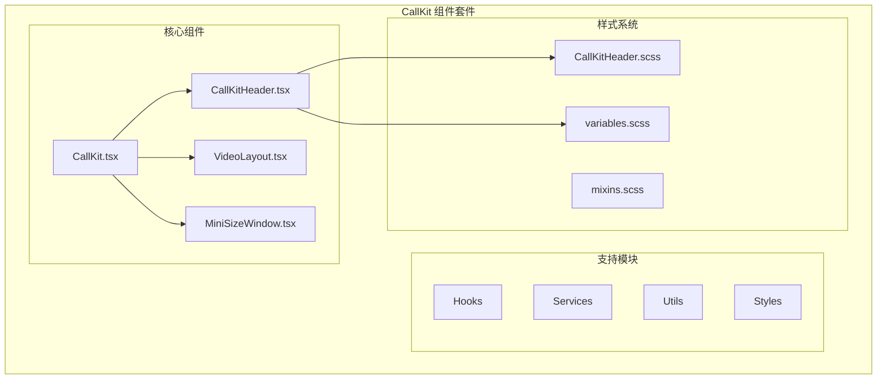
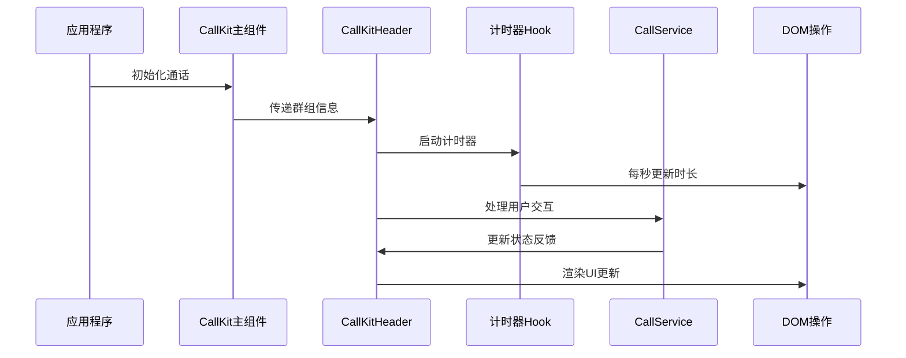
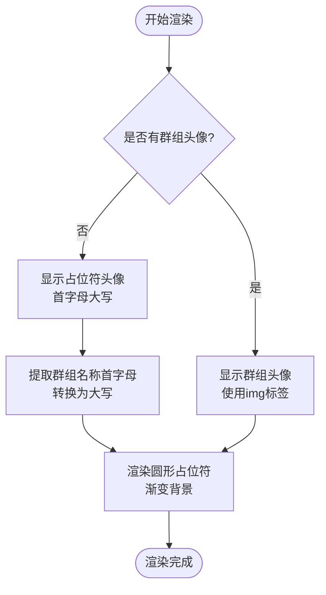
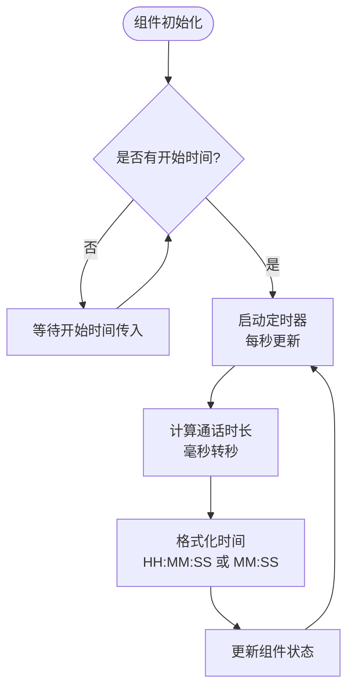
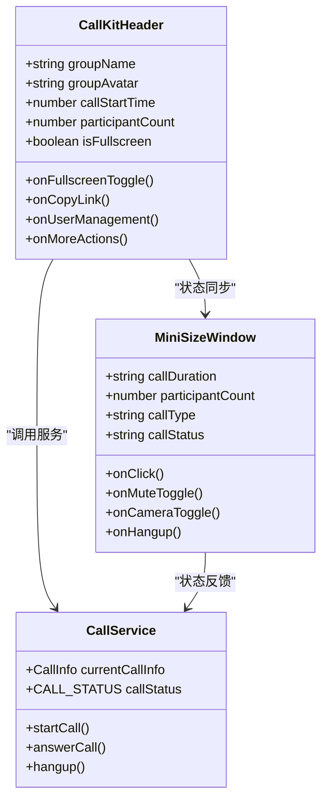
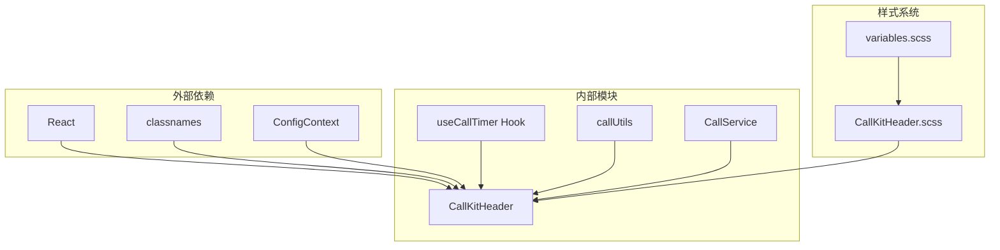
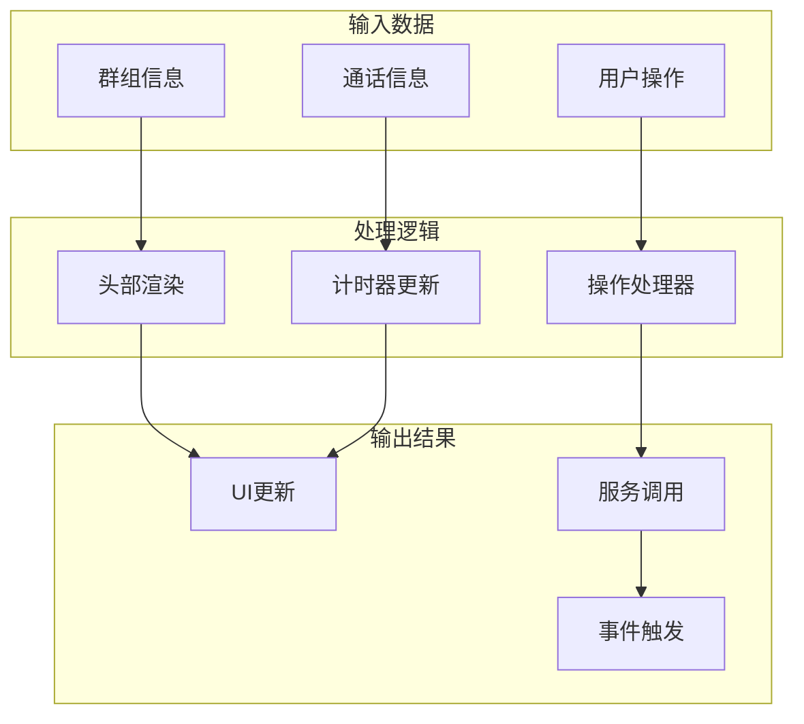

# 群组通话头部栏

<cite>
**本文档引用的文件**
- [CallKitHeader.tsx](file://callkit/components/CallKitHeader.tsx)
- [CallKitHeader.scss](file://callkit/components/CallKitHeader.scss)
- [MiniSizeWindow.tsx](file://callkit/components/MiniSizeWindow.tsx)
- [useCallTimer.ts](file://callkit/hooks/useCallTimer.ts)
- [callUtils.ts](file://callkit/utils/callUtils.ts)
- [CallService.ts](file://callkit/services/CallService.ts)
- [variables.scss](file://callkit/styles/variables.scss)
- [VideoLayout.tsx](file://callkit/VideoLayout.tsx)
- [CallKit.tsx](file://callkit/CallKit.tsx)
- [index.ts](file://callkit/types/index.ts)
</cite>

## 目录
1. [简介](#简介)
2. [项目结构](#项目结构)
3. [核心组件](#核心组件)
4. [架构概览](#架构概览)
5. [详细组件分析](#详细组件分析)
6. [依赖关系分析](#依赖关系分析)
7. [性能考虑](#性能考虑)
8. [故障排除指南](#故障排除指南)
9. [结论](#结论)
10. [附录](#附录)

## 简介

CallHeader 头部栏是群组通话顶部栏的核心组件，负责展示群组通话的关键信息和提供交互功能。该组件实现了完整的群组通话顶部栏功能，包括群组信息显示、通话时长展示、成员管理入口等核心功能。

该组件采用现代化的React设计，结合SCSS样式系统，提供了响应式的用户体验和丰富的自定义选项。组件支持多种交互操作，包括全屏切换、复制链接、用户管理和更多操作等功能。

## 项目结构

CallHeader 头部栏位于 CallKit 通话组件套件中，作为独立的组件模块存在。其项目结构如下：



**图表来源**
- [CallKit.tsx](file://callkit/CallKit.tsx#L1-L200)
- [CallKitHeader.tsx](file://callkit/components/CallKitHeader.tsx#L1-L179)
- [VideoLayout.tsx](file://callkit/VideoLayout.tsx#L1-L200)

**章节来源**
- [CallKit.tsx](file://callkit/CallKit.tsx#L1-L200)
- [CallKitHeader.tsx](file://callkit/components/CallKitHeader.tsx#L1-L179)

## 核心组件

### CallKitHeader 组件

CallKitHeader 是群组通话头部栏的主要实现，具有以下核心特性：

#### 组件属性接口

| 属性名 | 类型 | 默认值 | 描述 |
|--------|------|--------|------|
| groupName | string | 'Groupname' | 群组名称显示 |
| groupAvatar | string | - | 群组头像URL |
| callStartTime | number | - | 通话开始时间戳 |
| participantCount | number | 0 | 参与者数量 |
| isFullscreen | boolean | false | 是否全屏状态 |
| className | string | - | 自定义CSS类名 |
| style | React.CSSProperties | - | 自定义内联样式 |
| prefix | string | - | CSS类名前缀 |
| onFullscreenToggle | () => void | - | 全屏切换回调 |
| onCopyLink | () => void | - | 复制链接回调 |
| onUserManagement | () => void | - | 用户管理回调 |
| onMoreActions | () => void | - | 更多操作回调 |

#### 组件结构

组件采用左右两栏布局设计：

1. **左侧群组信息区域**
   - 群组头像显示（支持图片和占位符）
   - 群组名称展示
   - 通话时长显示
   - 参与者数量显示

2. **右侧操作按钮区域**
   - 全屏切换按钮
   - 复制链接按钮
   - 用户管理按钮
   - 更多操作按钮

**章节来源**
- [CallKitHeader.tsx](file://callkit/components/CallKitHeader.tsx#L6-L31)
- [CallKitHeader.tsx](file://callkit/components/CallKitHeader.tsx#L33-L176)

## 架构概览

CallHeader 头部栏在整个通话系统中的架构位置如下：



**图表来源**
- [CallKit.tsx](file://callkit/CallKit.tsx#L175-L200)
- [CallKitHeader.tsx](file://callkit/components/CallKitHeader.tsx#L52-L81)
- [useCallTimer.ts](file://callkit/hooks/useCallTimer.ts#L9-L25)

## 详细组件分析

### 组件结构分析

#### 头像显示逻辑



**图表来源**
- [CallKitHeader.tsx](file://callkit/components/CallKitHeader.tsx#L90-L98)

#### 通话时长计算机制

组件集成了专门的计时器Hook来管理通话时长：



**图表来源**
- [useCallTimer.ts](file://callkit/hooks/useCallTimer.ts#L9-L25)
- [callUtils.ts](file://callkit/utils/callUtils.ts#L25-L32)

#### 交互功能实现

组件提供了四个主要的交互按钮：

| 按钮类型 | 功能描述 | 触发事件 | 返回值 |
|----------|----------|----------|--------|
| 全屏按钮 | 切换全屏模式 | onFullscreenToggle | void |
| 复制链接 | 复制邀请链接 | onCopyLink | void |
| 用户管理 | 打开用户管理界面 | onUserManagement | void |
| 更多操作 | 显示更多功能菜单 | onMoreActions | void |

**章节来源**
- [CallKitHeader.tsx](file://callkit/components/CallKitHeader.tsx#L123-L171)

### 样式设计与主题适配

#### 设计规范

组件采用了现代化的设计语言，具有以下特点：

1. **视觉层次**
   - 主要信息：群组名称（16px，半粗体）
   - 辅助信息：通话时长和参与者数量（12px，半透明）
   - 操作按钮：36x36px，圆角8px

2. **色彩系统**
   - 主色调：白色文字，半透明背景
   - 按钮悬停效果：背景色从15%增加到25%
   - 特定按钮颜色：蓝色（全屏）、绿色（复制）、橙色（用户管理）

3. **响应式设计**
   - 桌面端：60px最小高度，48px头像尺寸
   - 平板端：56px最小高度，40px头像尺寸
   - 移动端：隐藏参与者数量，按钮尺寸缩小

**章节来源**
- [CallKitHeader.scss](file://callkit/components/CallKitHeader.scss#L1-L259)
- [variables.scss](file://callkit/styles/variables.scss#L1-L49)

### 最小化窗口集成

CallHeader 头部栏与最小化窗口组件协同工作：



**图表来源**
- [CallKitHeader.tsx](file://callkit/components/CallKitHeader.tsx#L33-L46)
- [MiniSizeWindow.tsx](file://callkit/components/MiniSizeWindow.tsx#L6-L38)
- [CallService.ts](file://callkit/services/CallService.ts#L34-L52)

**章节来源**
- [MiniSizeWindow.tsx](file://callkit/components/MiniSizeWindow.tsx#L1-L276)

## 依赖关系分析

### 组件间依赖关系



**图表来源**
- [CallKitHeader.tsx](file://callkit/components/CallKitHeader.tsx#L1-L5)
- [useCallTimer.ts](file://callkit/hooks/useCallTimer.ts#L1-L3)
- [callUtils.ts](file://callkit/utils/callUtils.ts#L1-L2)

### 数据流分析



**图表来源**
- [CallKitHeader.tsx](file://callkit/components/CallKitHeader.tsx#L33-L176)
- [useCallTimer.ts](file://callkit/hooks/useCallTimer.ts#L9-L48)

**章节来源**
- [CallKitHeader.tsx](file://callkit/components/CallKitHeader.tsx#L1-L179)
- [useCallTimer.ts](file://callkit/hooks/useCallTimer.ts#L1-L50)

## 性能考虑

### 优化策略

1. **计时器管理**
   - 使用 useEffect 清理机制避免内存泄漏
   - 每秒更新而非每帧更新，降低CPU消耗
   - 条件渲染参与者数量，减少DOM操作

2. **样式优化**
   - 使用CSS变量统一管理样式
   - 响应式设计减少不必要的重绘
   - 按需加载SVG图标

3. **渲染优化**
   - 使用 React.memo 优化子组件渲染
   - 条件渲染避免不必要的DOM节点
   - 事件委托减少事件监听器数量

### 性能监控

组件内置了日志系统，可以通过配置启用详细的性能监控：

```typescript
// 性能监控配置示例
const performanceConfig = {
  logLevel: 'debug', // 支持 error, warn, info, debug, verbose
  enableLogging: true,
  logPrefix: '[CallHeader]'
};
```

**章节来源**
- [CallKitHeader.tsx](file://callkit/components/CallKitHeader.tsx#L52-L81)
- [variables.scss](file://callkit/styles/variables.scss#L1-L49)

## 故障排除指南

### 常见问题及解决方案

#### 1. 头像显示问题

**问题症状**：群组头像无法正常显示，总是显示占位符

**可能原因**：
- groupAvatar URL无效或不可访问
- 网络连接问题
- CORS 跨域限制

**解决方案**：
```typescript
// 检查头像URL有效性
const isValidAvatar = (url: string): boolean => {
  try {
    new URL(url);
    return true;
  } catch (e) {
    return false;
  }
};

// 回退策略
const getAvatarOrDefault = (avatarUrl: string, groupName: string): string => {
  return isValidAvatar(avatarUrl) ? avatarUrl : getDefaultAvatar(groupName);
};
```

#### 2. 通话时长不更新

**问题症状**：通话时长固定不变

**可能原因**：
- callStartTime 未正确传入
- 计时器被意外清理
- 时间戳格式错误

**解决方案**：
```typescript
// 验证时间戳
const validateTimestamp = (timestamp: number): boolean => {
  const now = Date.now();
  return timestamp > 0 && timestamp <= now && (now - timestamp) < 86400000; // 24小时内
};

// 重新初始化计时器
const resetTimer = (startTime: number) => {
  if (validateTimestamp(startTime)) {
    // 重新设置计时器逻辑
  }
};
```

#### 3. 响应式布局问题

**问题症状**：在移动设备上布局异常

**可能原因**：
- 媒体查询条件不匹配
- 容器尺寸计算错误
- CSS 优先级冲突

**解决方案**：
```scss
// 确保媒体查询正确性
@media (max-width: 768px) {
  .cui-callkit-header {
    // 确保样式覆盖
    &-participant-count {
      display: none;
    }
  }
}
```

**章节来源**
- [CallKitHeader.tsx](file://callkit/components/CallKitHeader.tsx#L52-L81)
- [CallKitHeader.scss](file://callkit/components/CallKitHeader.scss#L199-L259)

## 结论

CallHeader 头部栏是一个功能完整、设计精良的群组通话顶部栏组件。它成功地实现了以下关键目标：

1. **功能完整性**：提供了群组信息显示、通话时长跟踪、用户交互等核心功能
2. **用户体验**：采用现代化设计，支持响应式布局，提供流畅的交互体验
3. **可扩展性**：通过配置接口和样式定制，支持各种业务场景
4. **性能优化**：实现了合理的性能优化策略，确保在各种设备上都能良好运行

该组件为群组通话提供了坚实的基础，是整个通话系统的重要组成部分。通过合理使用和适当的定制，可以满足大多数群组通话场景的需求。

## 附录

### 自定义配置选项

#### 样式定制

```scss
// 自定义头部栏样式
.cui-callkit-header {
  // 背景样式
  background: linear-gradient(45deg, #your-color1, #your-color2);
  
  // 头像样式
  .cui-callkit-header-avatar {
    border-radius: 20px;
    border: 3px solid rgba(255, 255, 255, 0.5);
  }
  
  // 按钮样式
  .cui-callkit-header-action-btn {
    background: rgba(0, 0, 0, 0.3);
    
    &:hover {
      background: rgba(0, 0, 0, 0.5);
    }
  }
}
```

#### JavaScript 配置

```typescript
// 自定义头部栏配置
const customHeaderConfig = {
  prefix: 'custom-prefix',
  className: 'custom-header-class',
  style: {
    backgroundColor: '#your-custom-color'
  },
  onFullscreenToggle: () => console.log('全屏切换'),
  onCopyLink: () => console.log('复制链接'),
  onUserManagement: () => console.log('用户管理'),
  onMoreActions: () => console.log('更多操作')
};
```

### 最佳实践建议

1. **性能优化**
   - 确保及时清理计时器资源
   - 避免不必要的重新渲染
   - 合理使用CSS动画

2. **用户体验**
   - 提供清晰的视觉反馈
   - 确保交互的一致性
   - 考虑无障碍访问需求

3. **代码维护**
   - 保持组件职责单一
   - 提供充分的错误处理
   - 编写清晰的文档注释