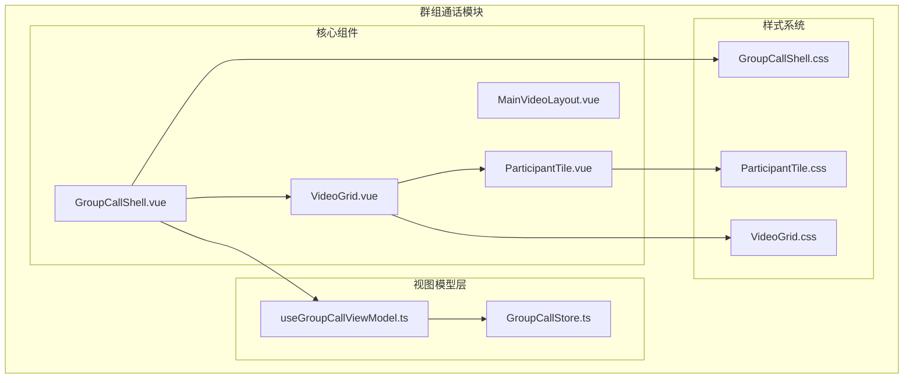
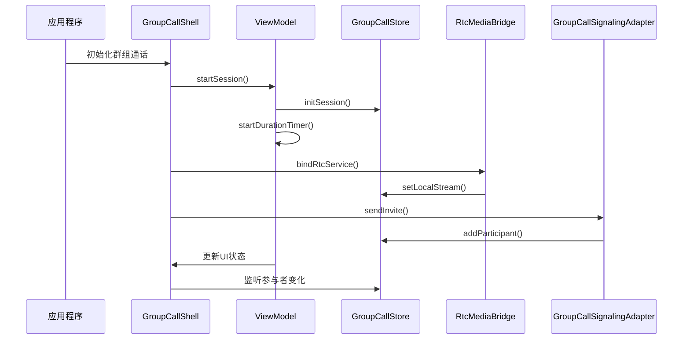
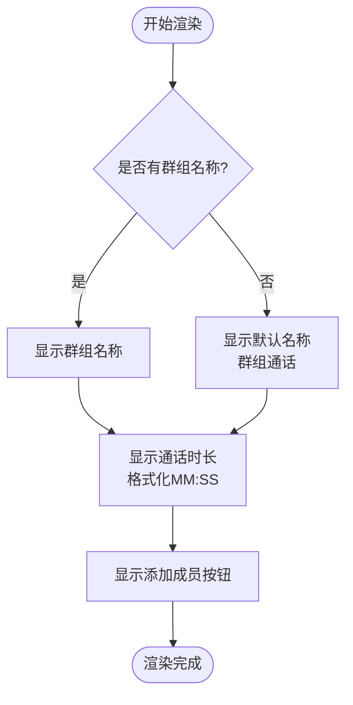
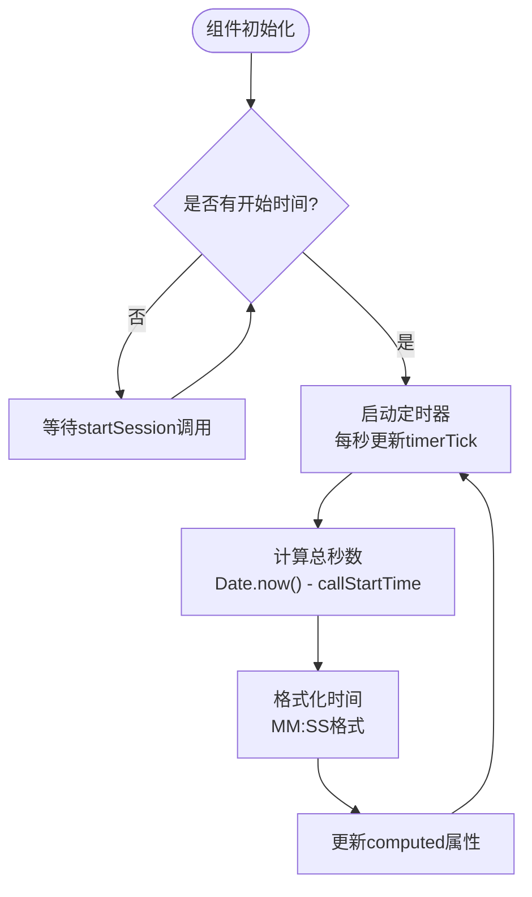
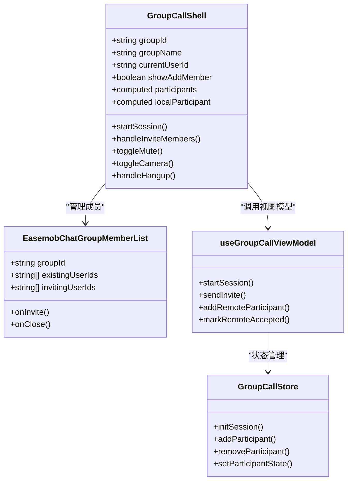
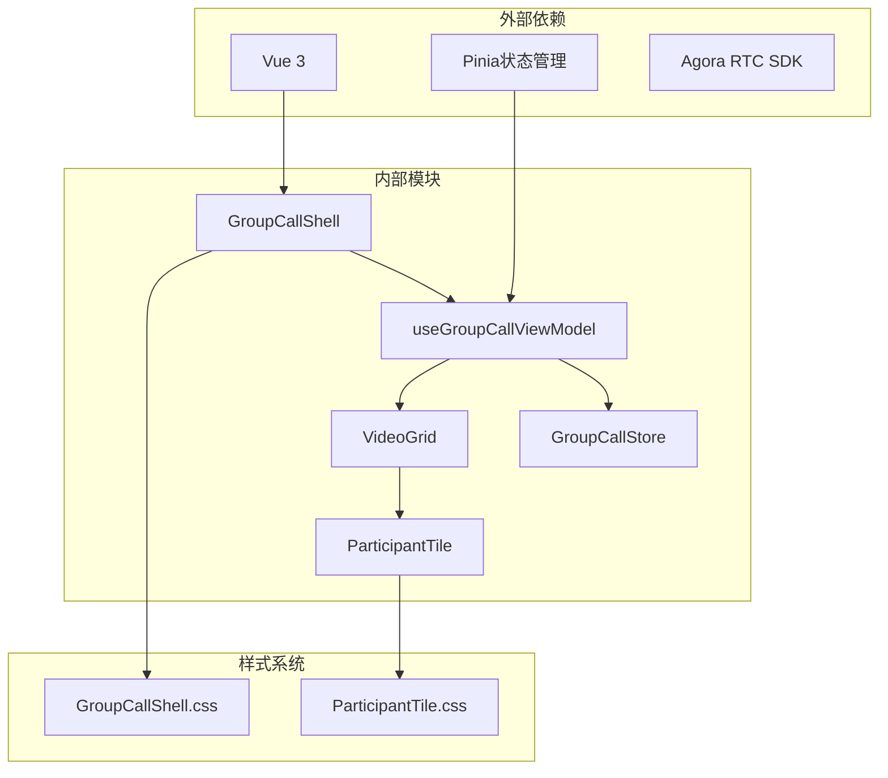
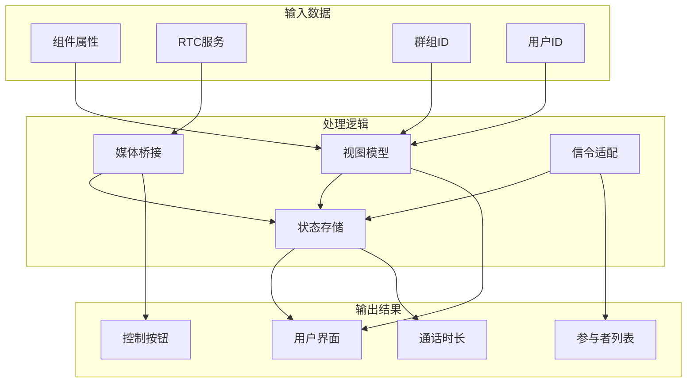

# 群组通话头部栏

<cite>
**本文档引用的文件**
- [GroupCallShell.vue](file://lib/modules/groupCall/components/GroupCallShell.vue)
- [GroupCallShell.css](file://lib/modules/groupCall/components/GroupCallShell.css)
- [useGroupCallViewModel.ts](file://lib/modules/groupCall/viewModel/useGroupCallViewModel.ts)
- [GroupCallStore.ts](file://lib/modules/groupCall/viewModel/GroupCallStore.ts)
- [VideoGrid.vue](file://lib/modules/groupCall/components/VideoGrid.vue)
- [ParticipantTile.vue](file://lib/modules/groupCall/components/ParticipantTile.vue)
- [types.ts](file://lib/modules/groupCall/types.ts)
- [CallKitHeader.tsx](file://callkit/components/CallKitHeader.tsx)
- [CallKitHeader.scss](file://callkit/components/CallKitHeader.scss)
</cite>

## 更新摘要
**所做更改**
- 更新了架构概述，反映 CallHeader.vue 被 GroupCallShell 组件替代
- 新增了新的组件结构分析，基于 Vue 3 Composition API 实现
- 更新了样式设计和主题适配部分，反映新的 CSS 架构
- 增加了新的交互功能实现说明，包括添加成员和参与者管理
- 更新了依赖关系分析，反映新的模块化架构
- 新增了最佳实践建议，基于新的 Vue 3 组件设计

## 目录
1. [简介](#简介)
2. [项目结构](#项目结构)
3. [核心组件](#核心组件)
4. [架构概览](#架构概览)
5. [详细组件分析](#详细组件分析)
6. [依赖关系分析](#依赖关系分析)
7. [性能考虑](#性能考虑)
8. [故障排除指南](#故障排除指南)
9. [结论](#结论)
10. [附录](#附录)

## 简介

**更新** CallHeader 组件已被新的 GroupCallShell 组件完全替代，采用 Vue 3 Composition API 重构，提供更现代化的群组通话头部栏功能。

GroupCallShell 是群组通话顶部栏的新一代实现，负责展示群组通话的关键信息和提供交互功能。该组件实现了完整的群组通话顶部栏功能，包括群组信息显示、通话时长展示、成员管理入口等核心功能。

该组件采用现代化的 Vue 3 设计，结合 CSS 模块化样式系统，提供了响应式的用户体验和丰富的自定义选项。组件支持多种交互操作，包括添加成员、静音控制、摄像头控制、挂断通话等功能。

## 项目结构

**更新** 项目结构已完全重构，从 React 架构迁移到 Vue 3 架构，CallHeader 组件被 GroupCallShell 组件替代。



**图表来源**
- [GroupCallShell.vue:1-300](file://lib/modules/groupCall/components/GroupCallShell.vue#L1-L300)
- [useGroupCallViewModel.ts:1-295](file://lib/modules/groupCall/viewModel/useGroupCallViewModel.ts#L1-L295)
- [GroupCallStore.ts:1-223](file://lib/modules/groupCall/viewModel/GroupCallStore.ts#L1-L223)

**章节来源**
- [GroupCallShell.vue:1-300](file://lib/modules/groupCall/components/GroupCallShell.vue#L1-L300)
- [useGroupCallViewModel.ts:1-295](file://lib/modules/groupCall/viewModel/useGroupCallViewModel.ts#L1-L295)

## 核心组件

### GroupCallShell 组件

**更新** GroupCallShell 是群组通话头部栏的新一代实现，基于 Vue 3 Composition API 构建。

#### 组件属性接口

| 属性名 | 类型 | 默认值 | 描述 |
|--------|------|--------|------|
| groupId | string | - | 群组ID |
| groupName | string | '群组通话' | 群组名称显示 |
| currentUserId | string | - | 当前用户ID |
| currentNickname | string | - | 当前用户昵称 |
| currentAvatarUrl | string | - | 当前用户头像URL |
| rtcService | RtcService | null | RTC服务实例 |

#### 组件结构

组件采用三段式布局设计：

1. **顶部头部区域**
   - 群组名称显示
   - 通话时长显示
   - 添加成员按钮

2. **中央内容区域**
   - 视频网格显示
   - 清屏提示
   - 参与者选择功能

3. **底部控制区域**
   - 静音控制按钮
   - 摄像头控制按钮
   - 挂断按钮

**章节来源**
- [GroupCallShell.vue:1-87](file://lib/modules/groupCall/components/GroupCallShell.vue#L1-L87)
- [GroupCallShell.vue:100-113](file://lib/modules/groupCall/components/GroupCallShell.vue#L100-L113)

## 架构概览

**更新** 架构已完全重构，采用 MVVM 模式，结合 Pinia 状态管理。



**图表来源**
- [GroupCallShell.vue:202-223](file://lib/modules/groupCall/components/GroupCallShell.vue#L202-L223)
- [useGroupCallViewModel.ts:136-178](file://lib/modules/groupCall/viewModel/useGroupCallViewModel.ts#L136-L178)
- [GroupCallStore.ts:43-57](file://lib/modules/groupCall/viewModel/GroupCallStore.ts#L43-L57)

## 详细组件分析

### 组件结构分析

#### 头部栏显示逻辑



**图表来源**
- [GroupCallShell.vue:4-14](file://lib/modules/groupCall/components/GroupCallShell.vue#L4-L14)

#### 通话时长计算机制

**更新** 新的计时器实现基于 Vue 3 的响应式系统：



**图表来源**
- [GroupCallShell.vue:157-189](file://lib/modules/groupCall/components/GroupCallShell.vue#L157-L189)
- [useGroupCallViewModel.ts:114-129](file://lib/modules/groupCall/viewModel/useGroupCallViewModel.ts#L114-L129)

#### 交互功能实现

**更新** 新的交互功能基于 Vue 3 Composition API：

| 按钮类型 | 功能描述 | 触发事件 | 方法 |
|----------|----------|----------|--------|
| 添加成员 | 打开成员管理界面 | @click | showAddMember = true |
| 静音控制 | 切换本地音频状态 | @click | toggleMute() |
| 摄像头控制 | 切换本地视频状态 | @click | toggleCamera() |
| 挂断通话 | 结束当前通话会话 | @click | handleHangup() |

**章节来源**
- [GroupCallShell.vue:10-12](file://lib/modules/groupCall/components/GroupCallShell.vue#L10-L12)
- [GroupCallShell.vue:260-296](file://lib/modules/groupCall/components/GroupCallShell.vue#L260-L296)

### 样式设计与主题适配

**更新** 样式系统已完全重构，采用现代 CSS 设计：

#### 设计规范

组件采用了现代化的设计语言，具有以下特点：

1. **视觉层次**
   - 主要信息：群组名称（16px，半粗体）
   - 辅助信息：通话时长（13px，等宽字体）
   - 操作按钮：36x36px，圆角50%

2. **色彩系统**
   - 主色调：深色背景(#171a1c)，高对比度文字(#f9fafa)
   - 按钮悬停效果：透明度从15%增加到25%
   - 特定按钮颜色：红色（挂断）、绿色（激活状态）

3. **响应式设计**
   - 桌面端：60px头部高度，80px控制高度
   - 平板端：50px头部高度，72px控制高度
   - 移动端：全屏适配，按钮尺寸缩小

**章节来源**
- [GroupCallShell.css:1-258](file://lib/modules/groupCall/components/GroupCallShell.css#L1-L258)
- [GroupCallShell.vue:137-146](file://lib/modules/groupCall/components/GroupCallShell.vue#L137-L146)

### 成员管理集成

**更新** 新增了完整的成员管理功能：



**图表来源**
- [GroupCallShell.vue:78-85](file://lib/modules/groupCall/components/GroupCallShell.vue#L78-L85)
- [useGroupCallViewModel.ts:229-236](file://lib/modules/groupCall/viewModel/useGroupCallViewModel.ts#L229-L236)
- [GroupCallStore.ts:59-69](file://lib/modules/groupCall/viewModel/GroupCallStore.ts#L59-L69)

**章节来源**
- [GroupCallShell.vue:78-85](file://lib/modules/groupCall/components/GroupCallShell.vue#L78-L85)
- [useGroupCallViewModel.ts:229-236](file://lib/modules/groupCall/viewModel/useGroupCallViewModel.ts#L229-L236)

## 依赖关系分析

### 组件间依赖关系

**更新** 依赖关系已完全重构：



**图表来源**
- [GroupCallShell.vue:90-98](file://lib/modules/groupCall/components/GroupCallShell.vue#L90-L98)
- [useGroupCallViewModel.ts:1-8](file://lib/modules/groupCall/viewModel/useGroupCallViewModel.ts#L1-L8)
- [GroupCallStore.ts:1-4](file://lib/modules/groupCall/viewModel/GroupCallStore.ts#L1-L4)

### 数据流分析

**更新** 数据流已采用响应式设计：



**图表来源**
- [GroupCallShell.vue:115-117](file://lib/modules/groupCall/components/GroupCallShell.vue#L115-L117)
- [useGroupCallViewModel.ts:50-56](file://lib/modules/groupCall/viewModel/useGroupCallViewModel.ts#L50-L56)

**章节来源**
- [GroupCallShell.vue:90-98](file://lib/modules/groupCall/components/GroupCallShell.vue#L90-L98)
- [useGroupCallViewModel.ts:1-295](file://lib/modules/groupCall/viewModel/useGroupCallViewModel.ts#L1-L295)

## 性能考虑

### 优化策略

**更新** 性能优化已基于 Vue 3 的响应式系统：

1. **响应式优化**
   - 使用 computed 属性避免重复计算
   - 采用 watch 侦听器精确更新
   - 使用 ref 和 reactive 优化状态管理

2. **媒体优化**
   - 智能 track.play() 播放控制
   - 自动清理视频元素资源
   - 延迟加载参与者视频

3. **渲染优化**
   - 条件渲染参与者列表
   - 按需加载成员管理组件
   - 事件防抖处理

### 性能监控

**更新** 新增了详细的日志记录系统：

```typescript
// 性能监控配置示例
const performanceConfig = {
  logLevel: 'info', // 支持 error, warn, info, debug
  enableLogging: true,
  logPrefix: '[GroupCallShell]'
};

// 日志记录示例
logger.info('[GroupCallShell] 会话启动', sessionId);
logger.warn('[GroupCallShell] 切换静音失败', error);
logger.debug('[GroupCallShell] 视频播放状态', { playing, userId });
```

**章节来源**
- [GroupCallShell.vue](file://lib/modules/groupCall/components/GroupCallShell.vue#L98)
- [useGroupCallViewModel.ts:8-8](file://lib/modules/groupCall/viewModel/useGroupCallViewModel.ts#L8-L8)

## 故障排除指南

### 常见问题及解决方案

#### 1. 头部栏显示问题

**问题症状**：群组名称无法正常显示，总是显示默认值

**可能原因**：
- groupId 属性未正确传入
- groupName 属性为空字符串
- 组件初始化顺序问题

**解决方案**：
```typescript
// 验证组件属性
const validateProps = (props: GroupCallShellProps): boolean => {
  return props.groupId && props.currentUserId;
};

// 回退策略
const getGroupNameOrDefault = (groupName: string): string => {
  return groupName || '群组通话';
};
```

#### 2. 通话时长不更新

**问题症状**：通话时长固定不变

**可能原因**：
- startSession 方法未调用
- 计时器被意外清理
- 时间戳格式错误

**解决方案**：
```typescript
// 验证会话状态
const validateSession = (): boolean => {
  return vm.isActive.value && store.session?.startTime;
};

// 重新启动计时器
const restartDurationTimer = () => {
  if (vm.isActive.value) {
    vm.startDurationTimer();
  }
};
```

#### 3. 响应式布局问题

**问题症状**：在移动设备上布局异常

**可能原因**：
- CSS 媒体查询条件不匹配
- 容器尺寸计算错误
- Flexbox 属性冲突

**解决方案**：
```css
/* 确保媒体查询正确性 */
@media (max-width: 768px) {
  .gcall-shell {
    width: 100%;
    height: 100%;
    border-radius: 0;
  }
  
  .gcall-header {
    height: 50px;
    padding: 0 12px;
  }
  
  .gcall-control-btn {
    width: 40px;
    height: 40px;
  }
}
```

**章节来源**
- [GroupCallShell.vue:157-189](file://lib/modules/groupCall/components/GroupCallShell.vue#L157-L189)
- [GroupCallShell.css:207-258](file://lib/modules/groupCall/components/GroupCallShell.css#L207-L258)

## 结论

**更新** GroupCallShell 组件代表了群组通话头部栏的重大升级，成功实现了以下关键目标：

1. **架构现代化**：从 React 迁移到 Vue 3，采用 Composition API 和响应式设计
2. **功能完整性**：提供了群组信息显示、通话时长跟踪、成员管理等核心功能
3. **用户体验**：采用现代化设计，支持响应式布局，提供流畅的交互体验
4. **可扩展性**：通过 MVVM 架构和 Pinia 状态管理，支持复杂的业务场景
5. **性能优化**：实现了合理的性能优化策略，确保在各种设备上都能良好运行

该组件为群组通话提供了坚实的基础，是整个通话系统的重要组成部分。通过合理使用和适当的定制，可以满足大多数群组通话场景的需求。

## 附录

### 自定义配置选项

#### 样式定制

```css
/* 自定义头部栏样式 */
.gcall-header {
  background: linear-gradient(45deg, #your-color1, #your-color2);
  backdrop-filter: blur(20px);
}

/* 自定义按钮样式 */
.gcall-header-btn {
  background: rgba(255, 255, 255, 0.2);
  border: 1px solid rgba(255, 255, 255, 0.3);
}

.gcall-header-btn:hover {
  background: rgba(255, 255, 255, 0.3);
  transform: scale(1.05);
}
```

#### JavaScript 配置

```typescript
// 自定义头部栏配置
const customHeaderConfig = {
  groupId: 'your-group-id',
  groupName: '自定义群组名称',
  currentUserId: 'user-id',
  currentNickname: '用户昵称',
  currentAvatarUrl: '头像URL',
  onFullscreenToggle: () => console.log('全屏切换'),
  onCopyLink: () => console.log('复制链接'),
  onUserManagement: () => console.log('用户管理'),
  onMoreActions: () => console.log('更多操作')
};
```

### 最佳实践建议

1. **性能优化**
   - 确保及时清理计时器和媒体资源
   - 使用 computed 属性优化响应式更新
   - 合理使用 v-if 和 v-show 控制渲染

2. **用户体验**
   - 提供清晰的视觉反馈和状态指示
   - 确保交互的一致性和可预测性
   - 考虑无障碍访问需求

3. **代码维护**
   - 保持组件职责单一，遵循单一职责原则
   - 提供充分的错误处理和边界检查
   - 编写清晰的文档注释和类型定义

4. **迁移指导**
   - 从旧的 CallHeader 组件迁移到 GroupCallShell
   - 更新样式类名和属性命名约定
   - 适应新的事件处理和状态管理模式