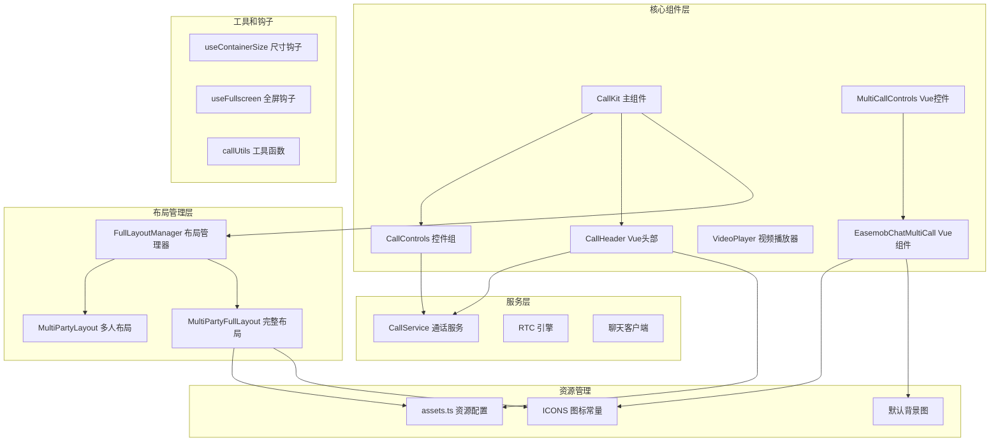
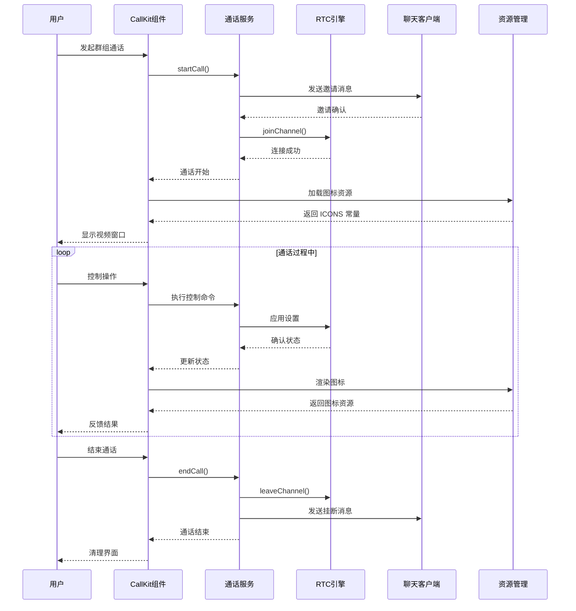
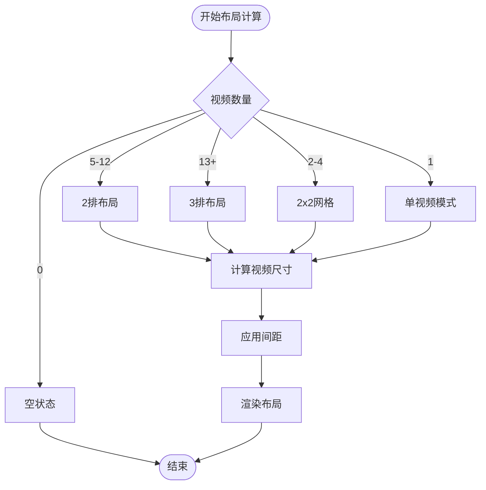
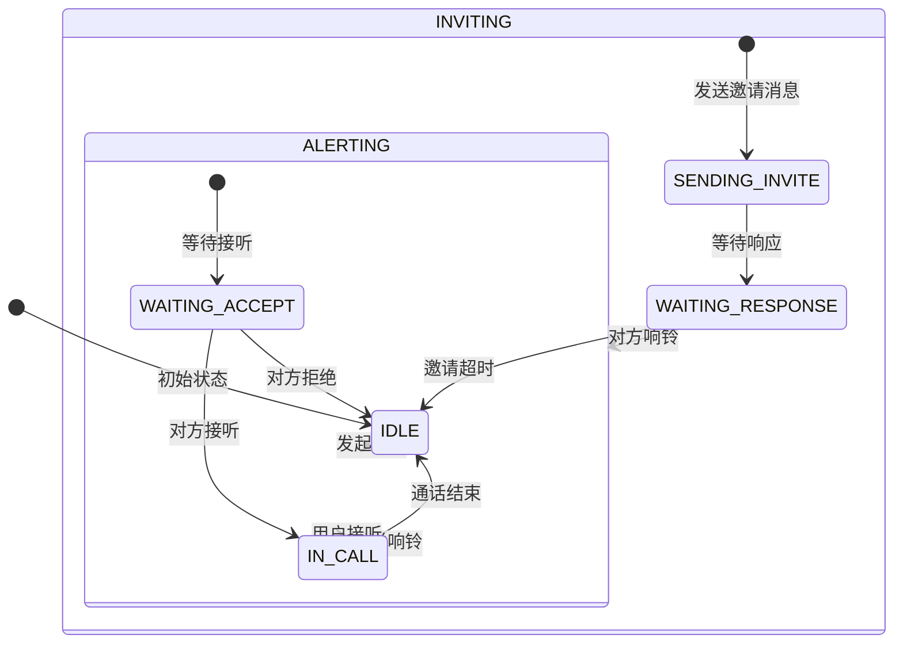
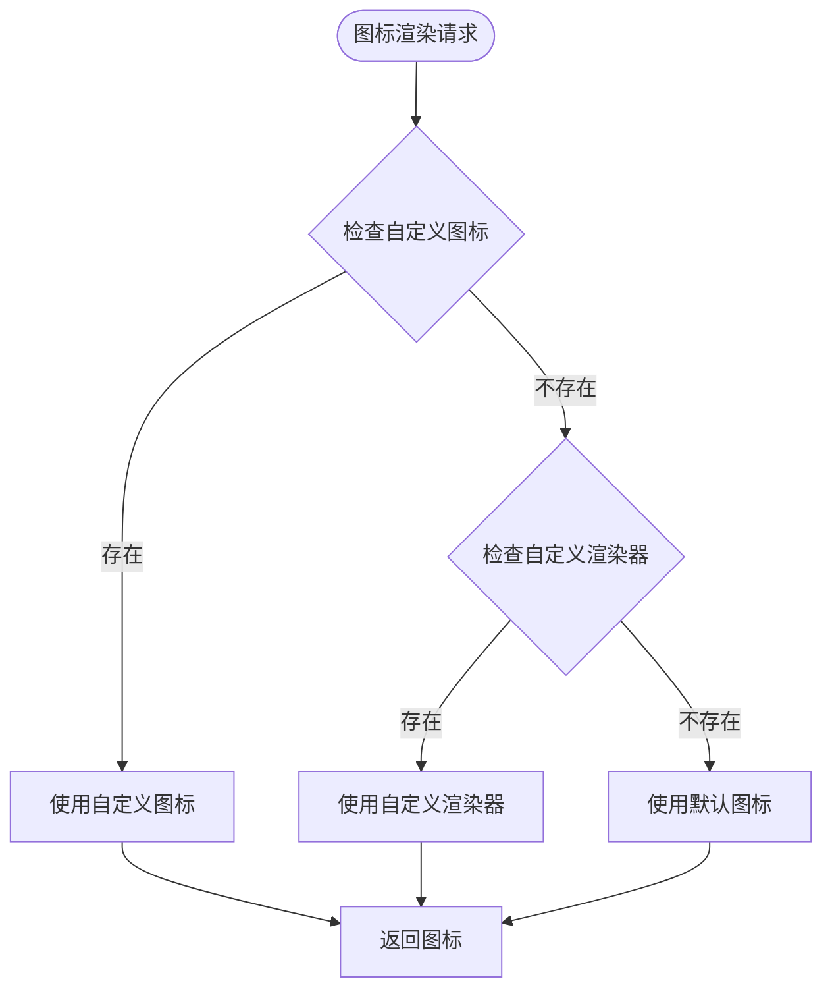
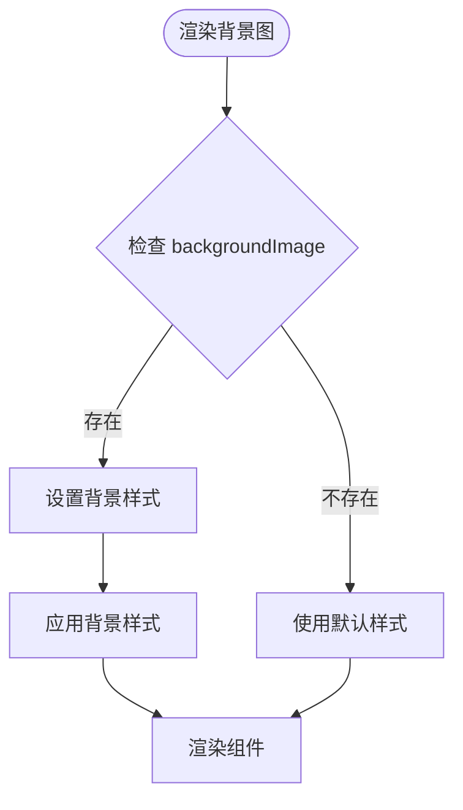
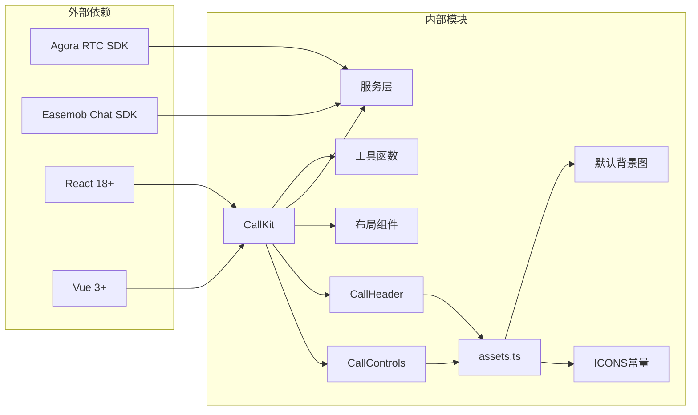

# 群组通话组件

<cite>
**本文档引用的文件**
- [CallKit.tsx](file://callkit/CallKit.tsx)
- [CallControls.tsx](file://callkit/components/CallControls.tsx)
- [CallKitHeader.tsx](file://callkit/components/CallKitHeader.tsx)
- [MultiPartyLayout.tsx](file://callkit/layouts/MultiPartyLayout.tsx)
- [MultiPartyFullLayout.tsx](file://callkit/layouts/MultiPartyFullLayout.tsx)
- [FullLayoutManager.tsx](file://callkit/layouts/FullLayoutManager.tsx)
- [VideoPlayer.tsx](file://callkit/components/VideoPlayer.tsx)
- [CallService.ts](file://callkit/services/CallService.ts)
- [index.ts](file://callkit/types/index.ts)
- [useContainerSize.ts](file://callkit/hooks/useContainerSize.ts)
- [useFullscreen.ts](file://callkit/hooks/useFullscreen.ts)
- [index.scss](file://callkit/styles/index.scss)
- [callUtils.ts](file://callkit/utils/callUtils.ts)
- [assets.ts](file://lib/config/assets.ts)
- [EasemobChatMultiCall.vue](file://lib/components/multiCall/EasemobChatMultiCall.vue)
- [MultiCallControls.vue](file://lib/components/multiCall/MultiCallControls.vue)
- [CallHeader.vue](file://lib/components/multiCall/CallHeader.vue)
- [README.md](file://lib/callkit-static-assets/README.md)
</cite>

## 更新摘要
**所做更改**
- 更新了图标常量系统的文档，反映新的 ICONS 常量和改进的图标管理
- 新增了背景图处理功能的详细说明
- 更新了 CallControls 和 CallHeader 组件的图标渲染机制
- 增强了自定义图标和背景图的配置选项说明
- 添加了图标资源管理和静态资产配置的新内容

## 目录
1. [简介](#简介)
2. [项目结构](#项目结构)
3. [核心组件](#核心组件)
4. [架构概览](#架构概览)
5. [详细组件分析](#详细组件分析)
6. [图标常量系统](#图标常量系统)
7. [背景图处理功能](#背景图处理功能)
8. [依赖关系分析](#依赖关系分析)
9. [性能考虑](#性能考虑)
10. [故障排除指南](#故障排除指南)
11. [结论](#结论)

## 简介

EasemobChatMultiCall 是一个专为群组音视频通话设计的 Vue 3 组件，基于 Easemob Chat SDK 和 Agora RTC SDK 构建。该组件提供了完整的群组通话功能，包括多参与者管理、智能视频布局控制、实时音频处理和丰富的用户交互体验。

**更新** 新版本引入了统一的图标常量系统和改进的背景图处理功能，提供了更好的可定制性和资源管理能力。

该组件的核心特性包括：
- 支持最多18个参与者的群组视频通话
- 智能视频网格布局和主视频模式切换
- 实时成员管理功能
- 屏幕共享和静音控制
- 全屏和最小化模式支持
- 网络质量监控和性能优化
- **新增** 统一的图标常量管理和自定义图标渲染
- **新增** 改进的背景图处理和资源管理

## 项目结构

项目采用模块化的架构设计，主要分为以下几个核心模块：



**图表来源**
- [CallKit.tsx](file://callkit/CallKit.tsx#L51-L800)
- [FullLayoutManager.tsx](file://callkit/layouts/FullLayoutManager.tsx#L16-L158)
- [assets.ts](file://lib/config/assets.ts#L35-L51)
- [EasemobChatMultiCall.vue](file://lib/components/multiCall/EasemobChatMultiCall.vue#L156-L157)

**章节来源**
- [CallKit.tsx](file://callkit/CallKit.tsx#L1-L800)
- [index.ts](file://callkit/types/index.ts#L1-L356)
- [assets.ts](file://lib/config/assets.ts#L1-L75)

## 核心组件

### CallKit 主组件

CallKit 是整个群组通话系统的核心组件，负责协调各个子组件和处理通话生命周期管理。

**主要功能特性：**
- 通话状态管理（空闲、呼叫中、响铃、连接）
- 多种布局模式支持（网格布局、主视频模式、预览模式）
- 实时视频流管理和渲染
- 用户交互事件处理
- 邀请管理和通话控制

**关键配置选项：**
- `layoutMode`: 布局模式（默认: MULTI_PARTY）
- `maxVideos`: 最大视频数量（默认: 16）
- `aspectRatio`: 视频宽高比（默认: 1）
- `gap`: 视频间距（默认: 6px）
- **新增** `backgroundImage`: 通话背景图片
- `showControls`: 是否显示控制按钮（默认: true）

**章节来源**
- [CallKit.tsx](file://callkit/CallKit.tsx#L51-L165)

### CallControls 控件组

**更新** CallControls 提供了完整的通话控制功能，并集成了新的图标常量系统。

**支持的控制功能：**
- 静音切换（麦克风）
- 摄像头开关
- 扬声器控制
- 屏幕共享（预留）
- 挂断通话
- 摄像头翻转

**群组通话特殊功能：**
- 预览模式下的摄像头控制
- 群组通话中的静音状态管理
- 参与者添加功能集成

**图标常量集成：**
- 使用统一的 ICONS 常量系统
- 支持自定义图标渲染
- 内置图标回退机制

**章节来源**
- [CallControls.tsx](file://callkit/components/CallControls.tsx#L11-L95)
- [assets.ts](file://lib/config/assets.ts#L35-L51)

### CallKitHeader 顶部栏

**更新** CallKitHeader 提供了通话顶部的信息显示和操作区域，并集成了图标常量系统。

**显示信息：**
- 群组头像和名称
- 通话持续时间
- 参与者数量统计
- 全屏切换按钮
- 复制链接按钮
- 用户管理按钮
- 更多操作按钮

**交互功能：**
- 全屏模式切换
- 用户管理操作
- 通话信息展示

**图标常量集成：**
- 使用 ICONS.MIC_ON/MIC_OFF 图标
- 支持自定义图标渲染
- 统一的图标管理

**章节来源**
- [CallKitHeader.tsx](file://callkit/components/CallKitHeader.tsx#L6-L31)
- [assets.ts](file://lib/config/assets.ts#L35-L51)

## 架构概览

系统采用分层架构设计，确保各组件职责清晰、耦合度低：



**图表来源**
- [CallService.ts](file://callkit/services/CallService.ts#L346-L527)
- [CallKit.tsx](file://callkit/CallKit.tsx#L319-L426)
- [assets.ts](file://lib/config/assets.ts#L35-L51)

## 详细组件分析

### 多人视频布局系统

MultiPartyLayout 提供了智能的视频网格布局算法，能够根据参与者数量和屏幕尺寸自动调整布局。

**布局策略：**
- 移动端优化：小屏幕设备上的紧凑布局
- 桌面端优化：大屏幕设备上的网格布局
- 自适应调整：根据视频数量动态计算行列数

**布局算法流程：**



**图表来源**
- [MultiPartyLayout.tsx](file://callkit/layouts/MultiPartyLayout.tsx#L18-L125)

**章节来源**
- [MultiPartyLayout.tsx](file://callkit/layouts/MultiPartyLayout.tsx#L1-L790)

### 通话服务管理系统

CallService 是整个通话系统的核心服务，负责管理 RTC 连接、用户状态和通话流程。

**核心功能：**
- 通话状态管理（INVITING、ALERTING、IN_CALL 等）
- 用户邀请和管理
- 音视频轨道管理
- 通话错误处理和恢复

**通话流程：**



**图表来源**
- [CallService.ts](file://callkit/services/CallService.ts#L14-L32)

**章节来源**
- [CallService.ts](file://callkit/services/CallService.ts#L116-L473)

### 视频播放器组件

VideoPlayer 提供了高效的视频渲染和管理功能，支持本地和远程视频流。

**主要特性：**
- 性能优化的渲染机制
- 自动镜像处理（本地视频）
- 流状态跟踪和管理
- 外部视频元素支持

**渲染优化：**
- 使用 React.memo 避免不必要的重渲染
- 智能的流对象比较
- 条件渲染优化

**章节来源**
- [VideoPlayer.tsx](file://callkit/components/VideoPlayer.tsx#L1-L104)

### 布局管理器

FullLayoutManager 负责根据不同的通话状态和模式选择合适的布局组件。

**支持的布局模式：**
- ONE_TO_ONE: 一对一通话布局
- MULTI_PARTY: 多人视频网格布局
- PREVIEW: 预览模式布局
- MINIMIZED: 最小化模式布局
- SCREEN_SHARE: 屏幕共享布局

**章节来源**
- [FullLayoutManager.tsx](file://callkit/layouts/FullLayoutManager.tsx#L16-L158)

## 图标常量系统

**新增** 系统引入了统一的图标常量管理系统，提供了更好的图标资源管理和自定义能力。

### ICONS 常量定义

系统提供了完整的图标常量集合，支持所有通话相关的图标资源：

```typescript
export const ICONS = {
  MIC_ON: `${getBaseUrl()}/icons/mic_on.svg`,
  MIC_OFF: `${getBaseUrl()}/icons/mic_slash.svg`,
  CAMERA_ON: `${getBaseUrl()}/icons/video_camera.svg`,
  CAMERA_OFF: `${getBaseUrl()}/icons/video_camera_slash.svg`,
  SPEAKER_ON: `${getBaseUrl()}/icons/speaker_wave_2.svg`,
  SPEAKER_OFF: `${getBaseUrl()}/icons/speaker_xmark.svg`,
  PHONE_HANG: `${getBaseUrl()}/icons/phone_hang.svg`,
  PHONE_PICK: `${getBaseUrl()}/icons/phone_pick.svg`,
  MAXIMIZE: `${getBaseUrl()}/icons/chevron_4_all_around.svg`,
  MINIMIZE: `${getBaseUrl()}/icons/chevron_4_cluster.svg`,
  GRID: `${getBaseUrl()}/icons/boxes.svg`,
  SHARE_SCREEN: `${getBaseUrl()}/icons/arrow_right_square_fill.svg`,
  PERSON_ADD: `${getBaseUrl()}/icons/person_add_fill.svg`,
  DEFAULT_AVATAR: `${getBaseUrl()}/images/default_avatar.png`,
} as const;
```

### 图标渲染机制

**更新** CallControls 和 CallHeader 组件集成了新的图标渲染机制：



**图表来源**
- [CallControls.tsx](file://callkit/components/CallControls.tsx#L151-L185)
- [assets.ts](file://lib/config/assets.ts#L35-L51)

### 自定义图标配置

组件支持灵活的自定义图标配置：

**CallControls 自定义图标映射：**
- `micOn`: 静音开启图标
- `micOff`: 静音关闭图标
- `cameraOn`: 摄像头开启图标
- `cameraOff`: 摄像头关闭图标
- `speakerOn`: 扬声器开启图标
- `speakerOff`: 扬声器关闭图标
- `hangup`: 挂断图标
- `accept`: 接听图标
- `reject`: 拒绝图标
- `screenShare`: 屏幕共享图标
- `screenShareStop`: 停止共享图标

**CallHeader 自定义图标映射：**
- `back`: 返回图标
- `close`: 关闭图标
- `fullscreen`: 全屏图标
- `exitFullscreen`: 退出全屏图标
- `minimize`: 最小化图标
- `more`: 更多图标
- `addParticipant`: 添加参与者图标

**章节来源**
- [assets.ts](file://lib/config/assets.ts#L35-L51)
- [CallControls.tsx](file://callkit/components/CallControls.tsx#L324-L337)
- [CallHeader.vue](file://lib/components/multiCall/CallHeader.vue#L1-L45)

## 背景图处理功能

**新增** 系统提供了改进的背景图处理功能，支持灵活的背景资源管理和自定义配置。

### 背景图配置选项

**更新** CallKit 和 MultiPartyFullLayout 组件支持背景图配置：

```typescript
// CallKit 主组件配置
export interface CallKitProps {
  // ... 其他配置
  // 🔧 多人通话背景图片设置
  backgroundImage?: string;
}

// 布局组件配置
export interface BaseLayoutProps {
  // ... 其他配置
  // 🔧 多人通话背景图片设置
  backgroundImage?: string;
}
```

### 背景图渲染机制

**更新** MultiPartyFullLayout 组件实现了智能的背景图渲染：



**图表来源**
- [MultiPartyFullLayout.tsx](file://callkit/layouts/MultiPartyFullLayout.tsx#L175-L186)

### 默认背景图配置

系统提供了默认的背景图资源：

```typescript
export const DEFAULT_BACKGROUND_IMAGE = `${getBaseUrl()}/images/callkit_bg.png`;
```

### 背景图资源管理

**更新** assets.ts 文件提供了完整的背景图资源管理：

```typescript
/**
 * 背景图资源
 */
export const DEFAULT_BACKGROUND_IMAGE = `${getBaseUrl()}/images/callkit_bg.png`;

/**
 * 获取资源基础 URL
 */
function getBaseUrl(): string {
  // 如果配置了 CDN，优先使用 CDN
  if (CDN_BASE_URL) {
    return CDN_BASE_URL;
  }
  // 默认使用本地路径
  return LOCAL_BASE_URL;
}
```

**章节来源**
- [assets.ts](file://lib/config/assets.ts#L28-L31)
- [MultiPartyFullLayout.tsx](file://callkit/layouts/MultiPartyFullLayout.tsx#L175-L186)
- [README.md](file://lib/callkit-static-assets/README.md#L213-L231)

## 依赖关系分析

系统采用松耦合的设计，通过清晰的接口定义组件间的依赖关系：



**图表来源**
- [CallService.ts](file://callkit/services/CallService.ts#L1-L12)
- [CallKit.tsx](file://callkit/CallKit.tsx#L1-L40)
- [assets.ts](file://lib/config/assets.ts#L1-L75)

**章节来源**
- [index.ts](file://callkit/types/index.ts#L1-L356)
- [assets.ts](file://lib/config/assets.ts#L1-L75)

## 性能考虑

### 渲染性能优化

系统采用了多种性能优化策略：

1. **组件懒加载**: 使用 React.lazy 和 Suspense 实现按需加载
2. **虚拟化列表**: 对于大量视频流使用虚拟化技术
3. **状态缓存**: 使用 useMemo 和 useCallback 优化状态更新
4. **条件渲染**: 智能的条件渲染减少 DOM 操作

### 网络优化

1. **自适应码率**: 根据网络状况动态调整视频质量
2. **缓冲策略**: 智能的视频缓冲和播放策略
3. **连接复用**: 复用 RTC 连接减少资源消耗

### 内存管理

1. **资源清理**: 及时清理视频轨道和媒体流
2. **事件解绑**: 正确解绑事件监听器
3. **垃圾回收**: 合理的对象生命周期管理

### 图标资源优化

**新增** 图标常量系统提供了以下优化：
- **统一资源管理**: 集中的图标资源管理
- **CDN 支持**: 可配置的 CDN 基础路径
- **资源可用性检查**: 提供资源可用性检测功能
- **图标回退机制**: 自动的图标回退处理

**章节来源**
- [assets.ts](file://lib/config/assets.ts#L67-L74)

## 故障排除指南

### 常见问题及解决方案

**视频无法加载**
- 检查摄像头权限设置
- 确认网络连接稳定
- 验证 RTC Token 配置

**音频问题**
- 检查麦克风权限
- 确认扬声器设置
- 测试音频设备

**通话中断**
- 检查网络稳定性
- 验证服务器连接
- 查看错误日志

**图标显示问题**
- 检查 ICONS 常量配置
- 验证图标文件路径
- 确认 SVG 文件格式

**背景图加载失败**
- 检查 backgroundImage 配置
- 验证图片 URL 可访问性
- 确认图片格式支持

**章节来源**
- [CallService.ts](file://callkit/services/CallService.ts#L292-L308)
- [assets.ts](file://lib/config/assets.ts#L67-L74)

### 调试工具

系统提供了完善的日志记录和调试功能：

1. **日志级别控制**: 支持 error、warn、info、debug、verbose 等级别
2. **实时状态监控**: 实时显示通话状态和网络质量
3. **性能指标收集**: 收集渲染性能和网络性能数据
4. **资源可用性检查**: 提供图标和背景图的可用性检测

**章节来源**
- [CallKit.tsx](file://callkit/CallKit.tsx#L200-L216)
- [assets.ts](file://lib/config/assets.ts#L67-L74)

## 结论

EasemobChatMultiCall 组件提供了一个功能完整、性能优异的群组音视频通话解决方案。通过模块化的架构设计、智能的布局管理、完善的错误处理机制和新的图标常量系统，该组件能够满足各种群组通话场景的需求。

**主要优势：**
- 完整的群组通话功能支持
- 智能的视频布局和优化
- 良好的性能和用户体验
- 灵活的配置和扩展能力
- **新增** 统一的图标常量管理和自定义能力
- **新增** 改进的背景图处理和资源管理

**适用场景：**
- 在线会议和协作
- 远程教育和培训
- 团队沟通和讨论
- 社交娱乐应用

**新功能亮点：**
- 图标常量系统提供了统一的图标管理
- 支持自定义图标渲染和回退机制
- 改进的背景图处理功能
- 灵活的资源配置和 CDN 支持
- 完善的资源可用性检测

通过合理使用本组件的配置选项和自定义功能，开发者可以快速构建高质量的群组通话应用。新的图标常量系统和背景图处理功能进一步提升了组件的可定制性和用户体验。