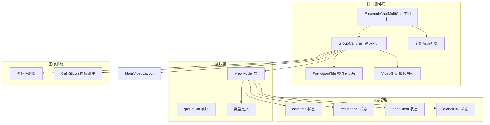
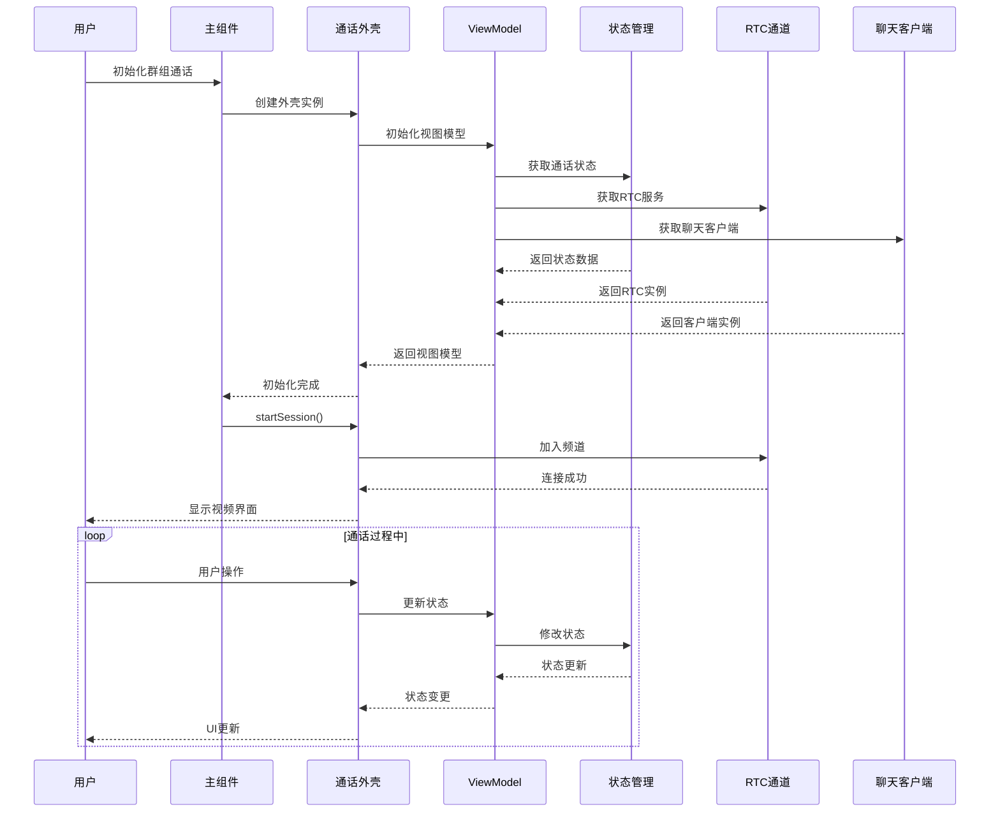
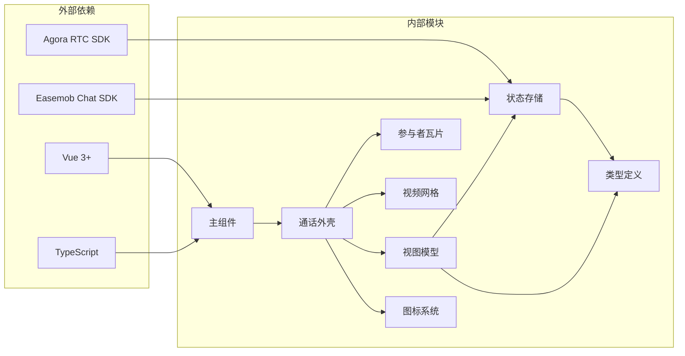

# 群组通话组件

<cite>
**本文档引用的文件**
- [EasemobChatMultiCall.vue](file://lib/components/multiCall/EasemobChatMultiCall.vue)
- [EasemobChatGroupMemberList.vue](file://lib/components/multiCall/EasemobChatGroupMemberList.vue)
- [index.ts](file://lib/modules/groupCall/index.ts)
- [types.ts](file://lib/modules/groupCall/types.ts)
- [GroupCallShell.vue](file://lib/modules/groupCall/components/GroupCallShell.vue)
- [ParticipantTile.vue](file://lib/modules/groupCall/components/ParticipantTile.vue)
- [VideoGrid.vue](file://lib/modules/groupCall/components/VideoGrid.vue)
- [MainVideoLayout.vue](file://lib/modules/groupCall/components/MainVideoLayout.vue)
- [iconRegistry.ts](file://lib/modules/groupCall/components/iconRegistry.ts)
- [CallKitIcon.vue](file://lib/modules/groupCall/components/CallKitIcon.vue)
- [callState.ts](file://lib/store/callState.ts)
- [rtcChannel.ts](file://lib/store/rtcChannel.ts)
- [chatClient.ts](file://lib/store/chatClient.ts)
- [globalCall.ts](file://lib/store/globalCall.ts)
</cite>

## 更新摘要
**所做更改**
- 更新了群组通话组件架构，从旧的 Vue 组件实现迁移到新的模块化架构
- 移除了已废弃的 CallHeader.vue.bak、EasemobChatMultiCall.vue.bak、MultiCallControls.vue.bak 等旧组件
- 新增了基于 GroupCallShell 的现代化群组通话实现
- 更新了组件依赖关系和数据流架构
- 增强了群组通话的状态管理和参与者管理功能

## 目录
1. [简介](#简介)
2. [项目结构](#项目结构)
3. [核心组件](#核心组件)
4. [架构概览](#架构概览)
5. [详细组件分析](#详细组件分析)
6. [状态管理](#状态管理)
7. [图标系统](#图标系统)
8. [依赖关系分析](#依赖关系分析)
9. [性能考虑](#性能考虑)
10. [故障排除指南](#故障排除指南)
11. [结论](#结论)

## 简介

EasemobChatMultiCall 是一个专为群组音视频通话设计的 Vue 3 组件，基于全新的模块化架构构建。该组件提供了完整的群组通话功能，包括多参与者管理、智能视频布局控制、实时音频处理和丰富的用户交互体验。

**重要更新**：新版本完全重构了架构，移除了旧的 Vue 组件实现，采用基于 GroupCallShell 的现代化设计，提供了更好的可维护性和扩展性。

该组件的核心特性包括：
- 支持最多18个参与者的群组视频通话
- 智能视频网格布局和主视频模式切换
- 实时成员管理功能
- 屏幕共享和静音控制
- 全屏和最小化模式支持
- 网络质量监控和性能优化
- **新增** 基于 GroupCallShell 的模块化架构
- **新增** 增强的参与者状态管理和 UI 组件

## 项目结构

项目采用全新的模块化架构设计，主要分为以下几个核心模块：



**图表来源**
- [EasemobChatMultiCall.vue:1-97](file://lib/components/multiCall/EasemobChatMultiCall.vue#L1-L97)
- [index.ts:1-18](file://lib/modules/groupCall/index.ts#L1-L18)
- [GroupCallShell.vue](file://lib/modules/groupCall/components/GroupCallShell.vue)
- [callState.ts](file://lib/store/callState.ts)

**章节来源**
- [EasemobChatMultiCall.vue:1-97](file://lib/components/multiCall/EasemobChatMultiCall.vue#L1-L97)
- [index.ts:1-18](file://lib/modules/groupCall/index.ts#L1-L18)

## 核心组件

### EasemobChatMultiCall 主组件

**更新** EasemobChatMultiCall 作为群组通话的入口组件，现在完全基于新的 GroupCallShell 架构实现。

**主要功能特性：**
- 通话状态管理（空闲、呼叫中、响铃、连接）
- 自动显示/隐藏逻辑（基于通话状态）
- 事件转发和回调处理
- 群组通话参数传递

**关键配置选项：**
- `groupId`: 群组 ID（可选）
- `groupName`: 群组名称（可选）
- `type`: 通话类型（audio/video，默认: video）
- `autoShow`: 自动显示控制（默认: true）
- `currentUserId`: 当前用户 ID（可选）

**事件处理：**
- `callStarted`: 通话开始事件
- `callEnded`: 通话结束事件
- `addParticipant`: 添加参与者事件
- `participantTimeout`: 参与者超时事件
- `error`: 错误事件

**章节来源**
- [EasemobChatMultiCall.vue:25-50](file://lib/components/multiCall/EasemobChatMultiCall.vue#L25-L50)

### GroupCallShell 通话外壳

**新增** GroupCallShell 是新的群组通话核心组件，负责协调所有子组件和处理通话生命周期。

**主要功能：**
- 通话会话管理
- 参与者状态同步
- 视频布局协调
- 用户交互处理

**核心属性：**
- `group-id`: 群组 ID
- `group-name`: 群组名称
- `current-user-id`: 当前用户 ID
- `current-nickname`: 当前用户昵称
- `current-avatar-url`: 当前用户头像 URL
- `rtc-service`: RTC 服务实例

**章节来源**
- [GroupCallShell.vue](file://lib/modules/groupCall/components/GroupCallShell.vue)

### 参与者瓦片组件

**新增** ParticipantTile 负责渲染单个参与者的视频和状态信息。

**主要功能：**
- 视频流渲染
- 用户头像显示
- 静音/摄像头状态指示
- 发言者模式支持

**状态管理：**
- `isMuted`: 静音状态
- `isCameraOn`: 摄像头状态
- `isSpeaking`: 发言状态
- `isLocal`: 本地用户标识

**章节来源**
- [ParticipantTile.vue](file://lib/modules/groupCall/components/ParticipantTile.vue)

### 视频网格组件

**新增** VideoGrid 提供智能的视频网格布局算法。

**布局策略：**
- 根据参与者数量自动调整网格
- 支持主视频模式
- 响应式布局适配

**章节来源**
- [VideoGrid.vue](file://lib/modules/groupCall/components/VideoGrid.vue)

## 架构概览

系统采用全新的模块化架构设计，确保各组件职责清晰、耦合度低：



**图表来源**
- [EasemobChatMultiCall.vue:76-91](file://lib/components/multiCall/EasemobChatMultiCall.vue#L76-L91)
- [GroupCallShell.vue](file://lib/modules/groupCall/components/GroupCallShell.vue)
- [callState.ts](file://lib/store/callState.ts)

## 详细组件分析

### 群组成员列表组件

**新增** EasemobChatGroupMemberList 提供群组成员邀请功能。

**主要功能：**
- 群组成员列表获取
- 成员选择和邀请
- 加载状态管理
- 错误处理

**成员状态：**
- `existingUserIds`: 已在通话中的用户
- `invitingUserIds`: 邀请中的用户
- `selectedUsers`: 已选择的用户

**API 集成：**
- 使用环信 SDK 获取群成员
- 支持分页加载（每页100人）
- 过滤当前用户

**章节来源**
- [EasemobChatGroupMemberList.vue:115-148](file://lib/components/multiCall/EasemobChatGroupMemberList.vue#L115-L148)

### 群组通话状态管理

**新增** 基于 ViewModel 的状态管理模式，提供统一的状态管理接口。

**参与者状态生命周期：**
- `invited`: 已发送邀请，等待 answer
- `accepted`: 对方已 answer（被叫方接听/主叫方收到 answer）
- `joinedRtc`: Agora user-joined 已触发，已建立 uid 映射
- `publishing`: 至少发布了 audio 或 video 中的一种
- `left`: 明确离开（user-left 或收到挂断/拒绝信令）

**群组通话会话状态：**
- `sessionId`: 会话 ID（通常等于 channelName）
- `groupId`: 群组 ID
- `groupName`: 群组名称
- `callType`: 通话类型（video/audio）
- `isActive`: 是否活跃
- `startTime`: 开始时间戳

**章节来源**
- [types.ts:6-49](file://lib/modules/groupCall/types.ts#L6-L49)

### 视频布局系统

**新增** 基于 GroupCallShell 的智能视频布局系统。

**布局模式：**
- 网格布局：适用于中小规模群组
- 主视频布局：突出显示主要说话者
- 自适应布局：根据屏幕尺寸和参与者数量自动调整

**布局算法：**
- 计算最优网格尺寸
- 处理参与者数量变化
- 平滑的布局过渡动画

**章节来源**
- [MainVideoLayout.vue](file://lib/modules/groupCall/components/MainVideoLayout.vue)
- [VideoGrid.vue](file://lib/modules/groupCall/components/VideoGrid.vue)

## 状态管理

### 通话状态存储

**更新** 新架构采用集中式状态管理，通过多个专用存储模块管理不同层面的状态。

**CallState 存储：**
- 通话状态管理（INVITING、ALERTING、IN_CALL 等）
- 通话类型识别（VIDEO_MULTI、AUDIO_MULTI）
- 通话会话信息

**RtcChannel 存储：**
- RTC 连接状态
- 频道信息管理
- 音视频轨道状态

**ChatClient 存储：**
- 聊天客户端实例
- 用户认证状态
- 群组信息

**GlobalCall 存储：**
- 全局通话配置
- 用户信息缓存
- 通话统计数据

**章节来源**
- [callState.ts](file://lib/store/callState.ts)
- [rtcChannel.ts](file://lib/store/rtcChannel.ts)
- [chatClient.ts](file://lib/store/chatClient.ts)
- [globalCall.ts](file://lib/store/globalCall.ts)

## 图标系统

**新增** 基于 iconRegistry 的统一图标管理系统。

### 图标注册表

**新增** iconRegistry 提供统一的图标管理接口：

```typescript
export const iconRegistry = {
  micOn: '/icons/mic_on.svg',
  micOff: '/icons/mic_slash.svg',
  cameraOn: '/icons/video_camera.svg',
  cameraOff: '/icons/video_camera_slash.svg',
  speakerOn: '/icons/speaker_wave_2.svg',
  speakerOff: '/icons/speaker_xmark.svg',
  phoneHang: '/icons/phone_hang.svg',
  phonePick: '/icons/phone_pick.svg',
  maximize: '/icons/chevron_4_all_around.svg',
  minimize: '/icons/chevron_4_cluster.svg',
  grid: '/icons/boxes.svg',
  shareScreen: '/icons/arrow_right_square_fill.svg',
  personAdd: '/icons/person_add_fill.svg',
  defaultAvatar: '/images/default_avatar.png',
} as const;
```

### CallKitIcon 图标组件

**新增** CallKitIcon 提供统一的图标渲染组件：

**功能特性：**
- 支持所有通话相关图标
- 自动图标回退机制
- 响应式图标大小
- SVG 格式支持

**使用方式：**
```vue
<CallKitIcon name="micOn" size="24" />
<CallKitIcon name="cameraOff" size="32" />
```

**章节来源**
- [iconRegistry.ts](file://lib/modules/groupCall/components/iconRegistry.ts)
- [CallKitIcon.vue](file://lib/modules/groupCall/components/CallKitIcon.vue)

## 依赖关系分析

**更新** 新架构采用更清晰的依赖关系设计：



**图表来源**
- [EasemobChatMultiCall.vue:17-23](file://lib/components/multiCall/EasemobChatMultiCall.vue#L17-L23)
- [index.ts:1-18](file://lib/modules/groupCall/index.ts#L1-L18)

**章节来源**
- [index.ts:1-18](file://lib/modules/groupCall/index.ts#L1-L18)
- [types.ts:1-56](file://lib/modules/groupCall/types.ts#L1-L56)

## 性能考虑

### 渲染性能优化

**新增** 新架构采用了多项性能优化策略：

1. **组件懒加载**: 基于 Vue 3 的动态导入实现按需加载
2. **虚拟化支持**: VideoGrid 支持大量参与者的虚拟化渲染
3. **状态缓存**: ViewModel 使用响应式状态缓存减少重渲染
4. **条件渲染**: 智能的条件渲染优化 DOM 操作

### 网络优化

1. **自适应码率**: 基于网络状况动态调整视频质量
2. **连接复用**: 复用 RTC 连接减少资源消耗
3. **流管理**: 智能的音视频轨道管理

### 内存管理

1. **资源清理**: 自动清理视频轨道和媒体流
2. **事件解绑**: 正确解绑事件监听器
3. **垃圾回收**: 合理的对象生命周期管理

### 状态管理优化

**新增** ViewModel 提供了以下优化：
- **状态分层**: 分离 UI 状态和业务状态
- **响应式更新**: 基于 Vue 3 的响应式系统
- **状态持久化**: 支持状态持久化和恢复
- **错误边界**: 完善的错误处理和恢复机制

**章节来源**
- [types.ts:14-39](file://lib/modules/groupCall/types.ts#L14-L39)

## 故障排除指南

### 常见问题及解决方案

**视频无法加载**
- 检查摄像头权限设置
- 确认网络连接稳定
- 验证 RTC Token 配置

**音频问题**
- 检查麦克风权限
- 确认扬声器设置
- 测试音频设备

**通话中断**
- 检查网络稳定性
- 验证服务器连接
- 查看错误日志

**图标显示问题**
- 检查 iconRegistry 配置
- 验证图标文件路径
- 确认 SVG 文件格式

**组件渲染问题**
- 检查 GroupCallShell 初始化
- 验证 ViewModel 状态
- 确认依赖注入正确

**章节来源**
- [EasemobChatGroupMemberList.vue:115-148](file://lib/components/multiCall/EasemobChatGroupMemberList.vue#L115-L148)
- [iconRegistry.ts](file://lib/modules/groupCall/components/iconRegistry.ts)

### 调试工具

**新增** 新架构提供了完善的调试功能：

1. **日志系统**: 基于 logger 的统一日志记录
2. **状态监控**: 实时显示通话状态和参与者信息
3. **性能指标**: 收集渲染性能和网络性能数据
4. **错误追踪**: 完善的错误处理和追踪机制

**章节来源**
- [EasemobChatGroupMemberList.vue](file://lib/components/multiCall/EasemobChatGroupMemberList.vue#L78)
- [types.ts:14-39](file://lib/modules/groupCall/types.ts#L14-L39)

## 结论

EasemobChatMultiCall 组件经过全新架构重构，提供了一个功能完整、性能优异的群组音视频通话解决方案。通过模块化的架构设计、智能的布局管理、完善的错误处理机制和现代化的状态管理，该组件能够满足各种群组通话场景的需求。

**主要优势：**
- 完整的群组通话功能支持
- 智能的视频布局和优化
- 良好的性能和用户体验
- 灵活的配置和扩展能力
- **新增** 基于 GroupCallShell 的模块化架构
- **新增** 增强的参与者状态管理和 UI 组件
- **新增** 统一的图标管理和状态管理

**适用场景：**
- 在线会议和协作
- 远程教育和培训
- 团队沟通和讨论
- 社交娱乐应用

**新架构亮点：**
- GroupCallShell 提供了统一的通话外壳
- ViewModel 模式实现了清晰的状态分离
- iconRegistry 提供了统一的图标管理
- 增强的错误处理和调试功能
- 更好的性能和可维护性

通过合理使用本组件的配置选项和自定义功能，开发者可以快速构建高质量的群组通话应用。新的模块化架构和状态管理功能进一步提升了组件的可定制性和用户体验。