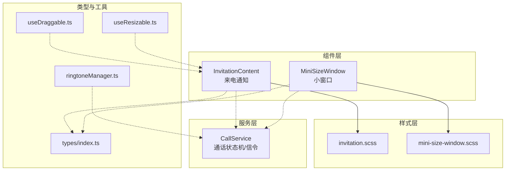
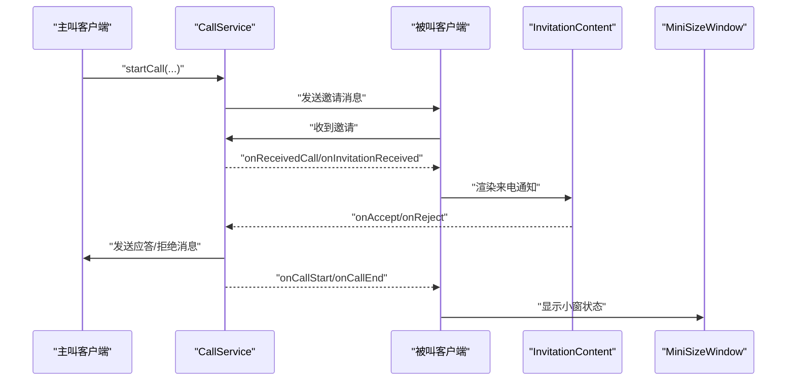
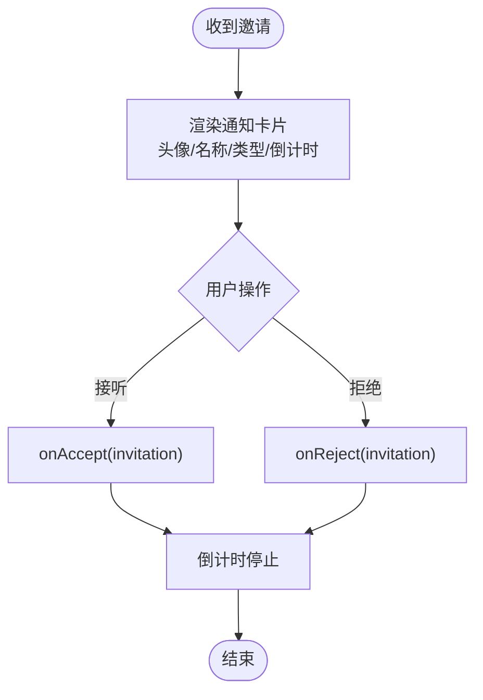
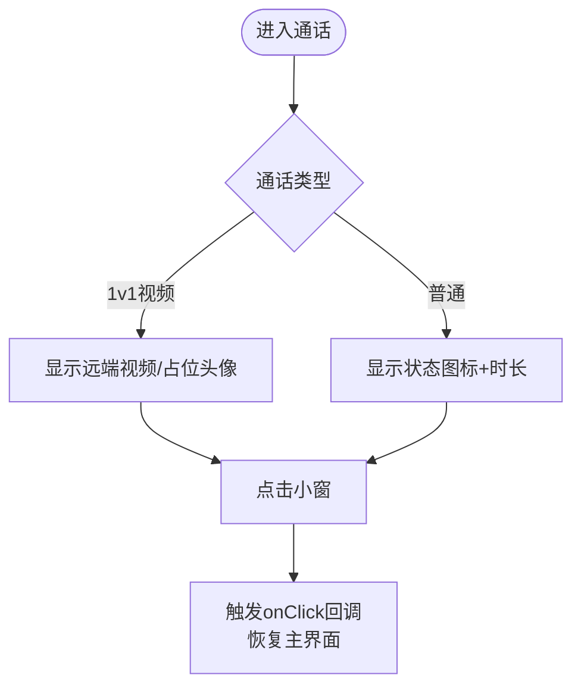
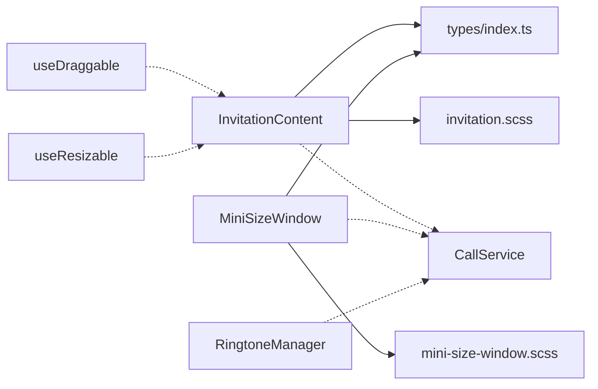

# 通知组件

<cite>
**本文引用的文件**
- [InvitationContent.tsx](file://callkit/components/InvitationContent.tsx)
- [MiniSizeWindow.tsx](file://callkit/components/MiniSizeWindow.tsx)
- [invitation.scss](file://callkit/styles/invitation.scss)
- [mini-size-window.scss](file://callkit/styles/components/mini-size-window.scss)
- [CallService.ts](file://callkit/services/CallService.ts)
- [index.ts](file://callkit/types/index.ts)
- [useDraggable.ts](file://callkit/hooks/useDraggable.ts)
- [useResizable.ts](file://callkit/hooks/useResizable.ts)
- [ringtoneManager.ts](file://callkit/utils/ringtoneManager.ts)
- [integration.md](file://callkit/docs/integration.md)
- [customization.md](file://callkit/docs/customization.md)
- [sample_runthrough.md](file://callkit/docs/sample_runthrough.md)
- [CallKit.stories.tsx](file://callkit/CallKit.stories.tsx)
</cite>

## 目录
1. [简介](#简介)
2. [项目结构](#项目结构)
3. [核心组件](#核心组件)
4. [架构总览](#架构总览)
5. [组件详细分析](#组件详细分析)
6. [依赖关系分析](#依赖关系分析)
7. [性能考量](#性能考量)
8. [故障排查指南](#故障排查指南)
9. [结论](#结论)
10. [附录](#附录)

## 简介
本文件聚焦于通知组件体系，重点覆盖 InvitationNotification（来电通知）与 EasemobChatMiniWindow（小窗口）两大组件。文档从功能、样式、交互、自定义与集成角度，系统阐述它们在通话流程中的作用与协作方式，并提供最佳实践与排障建议。

## 项目结构
- 组件层：InvitationContent（通知内容）、MiniSizeWindow（小窗）
- 样式层：invitation.scss、mini-size-window.scss
- 服务层：CallService（通话状态机与信令）
- 类型层：types/index.ts（InvitationInfo、CallKitProps 等）
- 交互钩子：useDraggable、useResizable（拖拽与尺寸调整）
- 工具层：RingtoneManager（铃声管理）
- 文档：integration.md、customization.md、sample_runthrough.md、CallKit.stories.tsx

图表来源
- [InvitationContent.tsx](file://callkit/components/InvitationContent.tsx#L1-L211)
- [MiniSizeWindow.tsx](file://callkit/components/MiniSizeWindow.tsx#L1-L276)
- [invitation.scss](file://callkit/styles/invitation.scss#L1-L142)
- [mini-size-window.scss](file://callkit/styles/components/mini-size-window.scss#L1-L346)
- [CallService.ts](file://callkit/services/CallService.ts#L1-L4478)
- [index.ts](file://callkit/types/index.ts#L1-L356)
- [useDraggable.ts](file://callkit/hooks/useDraggable.ts#L1-L291)
- [useResizable.ts](file://callkit/hooks/useResizable.ts#L1-L603)
- [ringtoneManager.ts](file://callkit/utils/ringtoneManager.ts#L1-L139)

章节来源
- [integration.md](file://callkit/docs/integration.md#L1-L417)
- [customization.md](file://callkit/docs/customization.md#L1-L82)

## 核心组件
- InvitationContent（来电通知）
  - 功能：展示来电者信息、通话类型、倒计时与接听/拒绝操作；支持自定义图标与文本；与 CallService 事件联动。
  - 关键属性：invitation、onAccept、onReject、acceptText、rejectText、showAvatar、showTimer、autoRejectTime、customIcons、iconRenderer。
  - 样式：invitation.scss 提供通知卡片布局、头像、动作按钮等样式。
- MiniSizeWindow（小窗口）
  - 功能：显示通话状态、时长、参与者数；1v1视频模式下显示远端视频或占位；普通模式显示状态图标与文本；支持点击恢复。
  - 关键属性：callDuration、participantCount、callType、callStatus、remoteVideoStream/Element、remoteUserAvatar/Nickname、onClick。
  - 样式：mini-size-window.scss 提供深色主题、动画、响应式与1v1视频模式特有样式。

章节来源
- [InvitationContent.tsx](file://callkit/components/InvitationContent.tsx#L11-L30)
- [invitation.scss](file://callkit/styles/invitation.scss#L4-L122)
- [MiniSizeWindow.tsx](file://callkit/components/MiniSizeWindow.tsx#L6-L38)
- [mini-size-window.scss](file://callkit/styles/components/mini-size-window.scss#L7-L96)

## 架构总览
通知组件与通话流程的集成关系：
- CallService 负责建立信令通道、发送/接收邀请消息、维护通话状态机（INVITING、ALERTING、IN_CALL 等），并通过回调通知 UI 层。
- InvitationContent 作为“邀请通知”呈现层，接收 CallService 的 onReceivedCall/onInvitationReceived 回调，渲染来电通知并处理接听/拒绝。
- MiniSizeWindow 作为“通话小窗”，在通话进行中显示状态与媒体信息，支持点击恢复主界面。

图表来源
- [CallService.ts](file://callkit/services/CallService.ts#L529-L684)
- [integration.md](file://callkit/docs/integration.md#L240-L273)
- [InvitationContent.tsx](file://callkit/components/InvitationContent.tsx#L117-L126)
- [MiniSizeWindow.tsx](file://callkit/components/MiniSizeWindow.tsx#L61-L66)

## 组件详细分析

### InvitationNotification（来电通知）
- 功能要点
  - 头像与名称：根据邀请类型（单聊/群组）动态选择头像与名称。
  - 通话类型图标与描述：区分 video/audio/group。
  - 倒计时与自动拒绝：可配置 autoRejectTime，到达时间自动触发拒绝回调。
  - 自定义图标与渲染器：支持 customIcons 与 iconRenderer，灵活替换默认图标。
  - 主题适配：读取 RootContext.theme.avatarShape 影响头像形状。
- 交互行为
  - 接听/拒绝按钮事件冒泡阻断，避免误触容器。
  - 支持 i18n 文案，可自定义 accept/reject 文本。
- 样式与主题
  - invitation.scss 提供深色模式、头像占位、动作按钮 hover 效果、文本截断等。
- 与 CallService 的集成
  - 通过 onReceivedCall/onInvitationReceived 回调触发通知展示。
  - 接听/拒绝时调用 answerCall/sendAnswerCallMessage，更新状态机。

图表来源
- [InvitationContent.tsx](file://callkit/components/InvitationContent.tsx#L47-L114)
- [InvitationContent.tsx](file://callkit/components/InvitationContent.tsx#L117-L126)
- [CallService.ts](file://callkit/services/CallService.ts#L686-L727)

章节来源
- [InvitationContent.tsx](file://callkit/components/InvitationContent.tsx#L32-L210)
- [invitation.scss](file://callkit/styles/invitation.scss#L4-L142)
- [integration.md](file://callkit/docs/integration.md#L240-L273)

### EasemobChatMiniWindow（小窗口）
- 设计理念
  - 低侵入、轻交互：在后台显示通话状态与媒体信息，点击即可恢复主界面。
  - 1v1视频模式：直接嵌入远端视频流或占位头像，兼顾性能与体验。
  - 普通模式：显示状态图标与通话时长，便于快速感知。
- 使用场景
  - 通话中最小化到任务栏/桌面角落的小窗。
  - 多任务场景下快速查看通话状态与恢复通话。
- 功能特性
  - 状态图标：connecting/ringing/connected 三态，connected 时绿色高亮。
  - 1v1视频：优先使用 remoteVideoElement，其次 remoteVideoStream；播放失败记录告警日志。
  - 点击恢复：onClick 回调交由上层处理恢复主界面。
- 样式与主题
  - mini-size-window.scss 提供深色背景、模糊滤镜、边框与状态色、动画与响应式适配。

图表来源
- [MiniSizeWindow.tsx](file://callkit/components/MiniSizeWindow.tsx#L44-L273)
- [mini-size-window.scss](file://callkit/styles/components/mini-size-window.scss#L7-L96)

章节来源
- [MiniSizeWindow.tsx](file://callkit/components/MiniSizeWindow.tsx#L44-L273)
- [mini-size-window.scss](file://callkit/styles/components/mini-size-window.scss#L302-L346)

### 通知组件与通话流程的集成关系
- 邀请阶段
  - CallService 发送邀请消息，被叫侧收到 onReceivedCall/onInvitationReceived，渲染 InvitationContent。
- 应答阶段
  - 用户点击接听/拒绝，InvitationContent 调用 onAccept/onReject，CallService 发送 answer/refuse 消息并更新状态机。
- 通话阶段
  - CallService 触发 onCallStart，MiniSizeWindow 显示小窗；通话中持续更新时长与状态。
- 结束阶段
  - CallService 触发 onCallEnd，清理资源并隐藏通知/小窗。

章节来源
- [CallService.ts](file://callkit/services/CallService.ts#L529-L684)
- [integration.md](file://callkit/docs/integration.md#L240-L273)

### 样式定制与行为配置
- InvitationContent
  - 自定义图标：通过 customIcons 与 iconRenderer 替换 accept/reject 等图标。
  - 文案与头像：acceptText/rejectText、showAvatar 控制文案与头像显示。
  - 倒计时：autoRejectTime 控制自动拒绝时间；showTimer 控制倒计时显示。
- MiniSizeWindow
  - 状态样式：通过 callStatus（connecting/ringing/connected）切换边框色与图标颜色。
  - 1v1视频：remoteVideoStream/Element 优先级与占位头像。
  - 点击恢复：onClick 回调交由上层处理。
- CallKit 主组件
  - resizable/minWidth/minHeight/maxWidth/maxHeight/onResize 控制可调整大小。
  - draggable/dragHandle/onDragStart/onDrag/onDragEnd 控制拖拽。
  - invitationCustomContent、acceptText/rejectText/showInvitationAvatar/showInvitationTimer/autoRejectTime 等影响通知外观与行为。

章节来源
- [index.ts](file://callkit/types/index.ts#L110-L123)
- [index.ts](file://callkit/types/index.ts#L290-L307)
- [customization.md](file://callkit/docs/customization.md#L11-L29)
- [customization.md](file://callkit/docs/customization.md#L37-L48)

### 使用示例与最佳实践
- 集成步骤
  - Provider 初始化 IM SDK，CallKit 注入 chatClient 与 userInfoProvider/groupInfoProvider。
  - 配置 enableRingtone/resizable/draggable 等参数。
  - 监听 onReceivedCall/onInvitationAccept/onInvitationReject/onCallStart/onCallEnd 等回调。
- 发起/接听通话
  - 主叫：startSingleCall/startGroupCall。
  - 被叫：收到 onReceivedCall 后渲染 InvitationContent，用户操作后通过 CallService 更新状态。
- 小窗使用
  - 通话中显示 MiniSizeWindow，点击恢复主界面；1v1视频模式下注意 remoteVideoStream/Element 的可用性。
- 最佳实践
  - 使用 userInfoProvider/groupInfoProvider 提供头像与昵称，提升用户体验。
  - 合理设置 autoRejectTime，避免过短导致误拒。
  - 在移动端使用 mini-size-window.scss 的响应式规则，确保小窗在窄屏下可读性良好。
  - 使用 RingtoneManager 控制铃声播放与停止，避免重复播放。

章节来源
- [integration.md](file://callkit/docs/integration.md#L36-L114)
- [integration.md](file://callkit/docs/integration.md#L240-L273)
- [sample_runthrough.md](file://callkit/docs/sample_runthrough.md#L54-L74)
- [ringtoneManager.ts](file://callkit/utils/ringtoneManager.ts#L50-L96)

## 依赖关系分析
- InvitationContent 依赖
  - 类型：InvitationInfo、CallControlsIconMap、RootContext（主题）。
  - 样式：invitation.scss。
  - 服务：CallService（通过回调集成）。
- MiniSizeWindow 依赖
  - 类型：VideoWindowProps、CallService（状态与媒体信息）。
  - 样式：mini-size-window.scss。
  - 工具：logger（调试日志）。
- 通用交互
  - useDraggable/useResizable：为可调整大小/拖拽场景提供底层能力（如 CallKit 主组件）。
  - RingtoneManager：统一铃声播放与停止。

图表来源
- [InvitationContent.tsx](file://callkit/components/InvitationContent.tsx#L1-L10)
- [MiniSizeWindow.tsx](file://callkit/components/MiniSizeWindow.tsx#L1-L5)
- [index.ts](file://callkit/types/index.ts#L95-L108)
- [useDraggable.ts](file://callkit/hooks/useDraggable.ts#L19-L29)
- [useResizable.ts](file://callkit/hooks/useResizable.ts#L26-L49)
- [ringtoneManager.ts](file://callkit/utils/ringtoneManager.ts#L6-L28)

章节来源
- [index.ts](file://callkit/types/index.ts#L1-L356)
- [useDraggable.ts](file://callkit/hooks/useDraggable.ts#L1-L291)
- [useResizable.ts](file://callkit/hooks/useResizable.ts#L1-L603)
- [ringtoneManager.ts](file://callkit/utils/ringtoneManager.ts#L1-L139)

## 性能考量
- InvitationContent
  - 倒计时使用 setInterval，注意在组件卸载时清理定时器，避免内存泄漏。
  - 自定义图标渲染采用 useCallback，减少不必要的重渲染。
- MiniSizeWindow
  - 1v1视频模式下优先使用 remoteVideoElement，减少重复创建 MediaStream。
  - 播放失败时记录警告日志，避免阻塞主线程。
- CallKit 主组件
  - resizable/draggable 事件监听器在组件卸载时清理，避免全局事件泄漏。
  - onResize/onDrag 回调中避免频繁重排，必要时使用 requestAnimationFrame。

章节来源
- [InvitationContent.tsx](file://callkit/components/InvitationContent.tsx#L97-L114)
- [MiniSizeWindow.tsx](file://callkit/components/MiniSizeWindow.tsx#L148-L168)
- [useDraggable.ts](file://callkit/hooks/useDraggable.ts#L258-L281)
- [useResizable.ts](file://callkit/hooks/useResizable.ts#L544-L595)

## 故障排查指南
- 邀请通知不出现
  - 检查 onReceivedCall/onInvitationReceived 回调是否正确注册。
  - 确认 CallService.startCall 已发送邀请消息且未被拦截。
- 自动拒绝未生效
  - 检查 autoRejectTime 与 showTimer 配置；确认倒计时逻辑在 useEffect 中运行。
- 小窗无视频
  - 确认 remoteVideoElement/remoteVideoStream 是否可用；播放失败时查看日志。
  - 1v1视频模式下，确保 remoteUserAvatar/Nickname 存在以提供占位头像。
- 铃声异常
  - 使用 RingtoneManager.playRingtone/stopRingtone 控制播放；检查 enableRingtone/ringtoneVolume/ringtoneLoop 配置。
- 拖拽/调整大小无效
  - 检查 draggable/resizable 是否启用；确认 dragHandle 选择器正确；事件监听器是否被清理。

章节来源
- [integration.md](file://callkit/docs/integration.md#L240-L273)
- [ringtoneManager.ts](file://callkit/utils/ringtoneManager.ts#L50-L96)
- [useDraggable.ts](file://callkit/hooks/useDraggable.ts#L83-L139)
- [useResizable.ts](file://callkit/hooks/useResizable.ts#L401-L459)

## 结论
通知组件体系通过 InvitationContent 与 MiniSizeWindow，实现了从“邀请通知”到“通话小窗”的完整闭环。结合 CallService 的状态机与回调机制，以及丰富的样式与行为配置，开发者可以快速构建稳定、可定制的音视频通话体验。建议在生产环境中重视资源清理、日志监控与移动端适配，以获得更佳的用户体验。

## 附录
- 快速参考
  - 邀请通知属性：invitation、onAccept、onReject、acceptText、rejectText、showAvatar、showTimer、autoRejectTime、customIcons、iconRenderer。
  - 小窗属性：callDuration、participantCount、callType、callStatus、remoteVideoStream/Element、remoteUserAvatar/Nickname、onClick。
  - CallKit 主组件：resizable、draggable、managedPosition、minimizedSize、invitationCustomContent、acceptText/rejectText 等。
- 示例与文档
  - 集成与回调：integration.md
  - 自定义与配置：customization.md
  - 示例运行：sample_runthrough.md
  - Storybook 演示：CallKit.stories.tsx

章节来源
- [integration.md](file://callkit/docs/integration.md#L1-L417)
- [customization.md](file://callkit/docs/customization.md#L1-L82)
- [sample_runthrough.md](file://callkit/docs/sample_runthrough.md#L1-L74)
- [CallKit.stories.tsx](file://callkit/CallKit.stories.tsx#L1-L540)