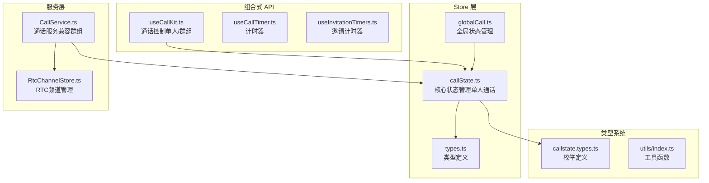
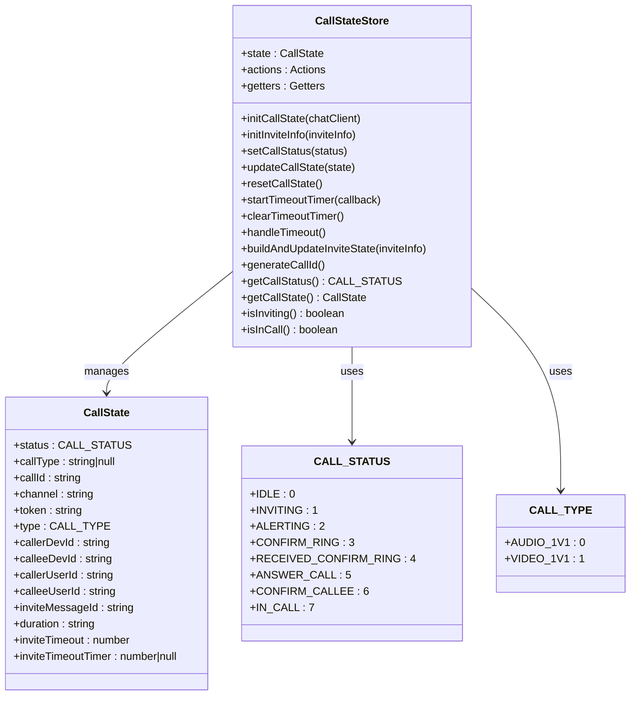
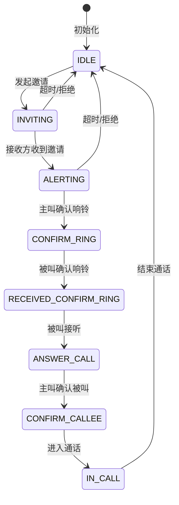
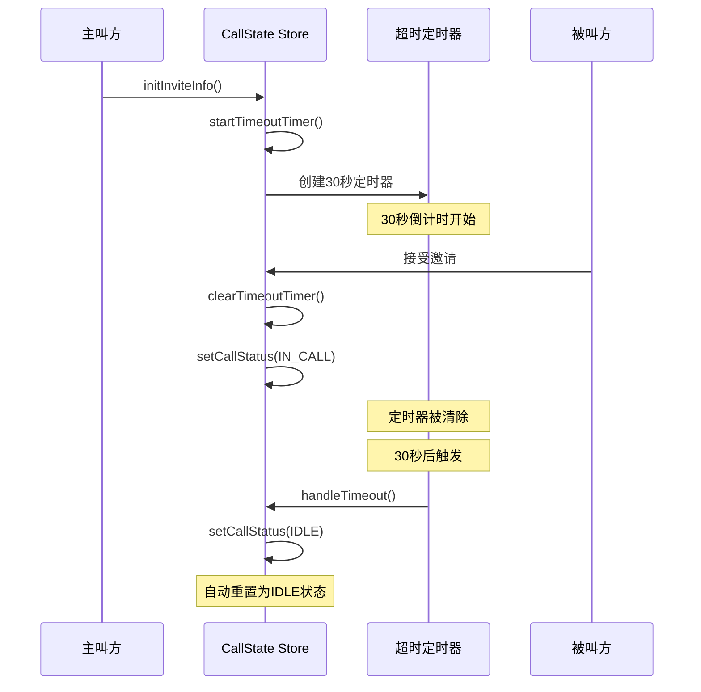
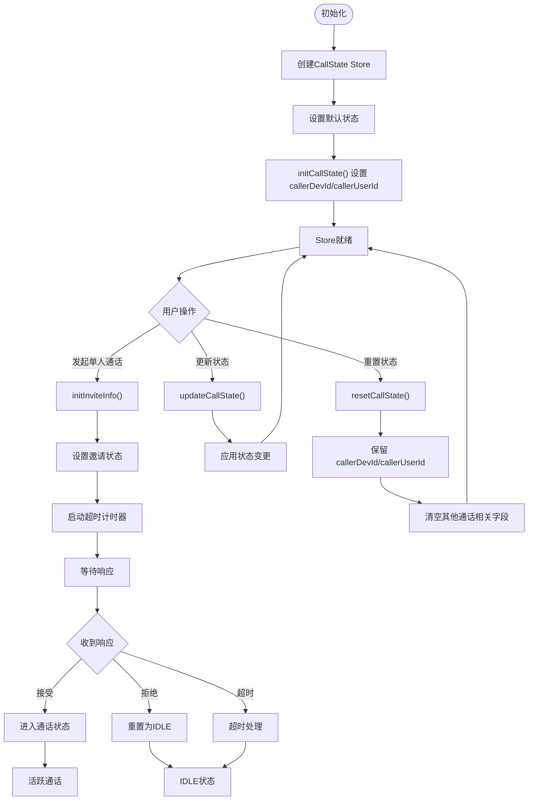
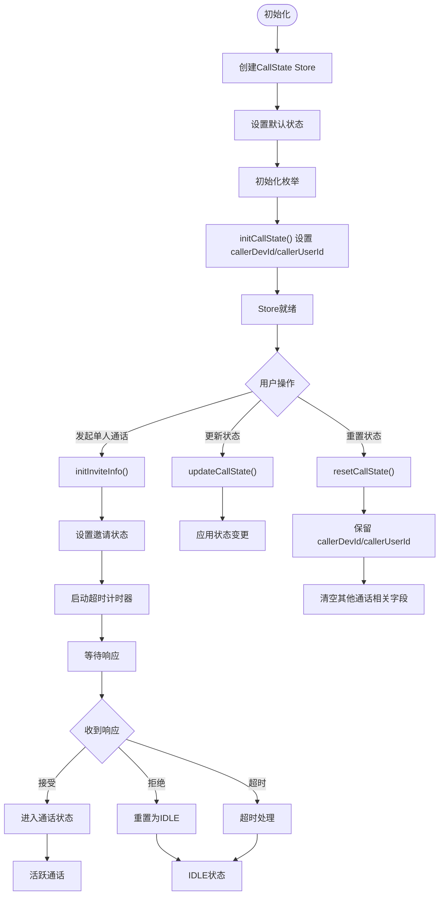
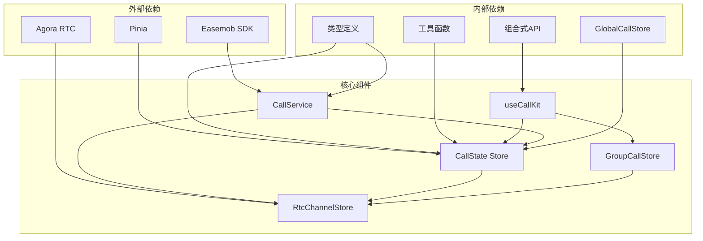

# CallState Store 详细文档

<cite>
**本文档引用的文件**
- [lib/store/callState.ts](file://lib/store/callState.ts)
- [lib/store/types.ts](file://lib/store/types.ts)
- [lib/types/callstate.types.ts](file://lib/types/callstate.types.ts)
- [lib/composables/useCallKit.ts](file://lib/composables/useCallKit.ts)
- [lib/services/CallService.ts](file://lib/services/CallService.ts)
- [lib/store/globalCall.ts](file://lib/store/globalCall.ts)
- [.trae/documents/修复CallService中CallState store初始化检查问题.md](file://.trae/documents/修复CallService中CallState store初始化检查问题.md)
- [最新代码评审-CallKitVue3-v1.0.4.md](file://最新代码评审-CallKitVue3-v1.0.4.md)
</cite>

## 更新摘要
**所做更改**
- 修正了 caller 身份持久化问题，确保多设备场景下 caller 设备 ID 和用户 ID 的正确保存
- 更新了状态重置逻辑，避免在重置时清空 callerDevId 和 callerUserId 字段
- 强化了多设备场景下的身份保持机制
- 修复了二次通话时身份丢失的问题

## 目录
1. [简介](#简介)
2. [项目结构](#项目结构)
3. [核心组件](#核心组件)
4. [架构概览](#架构概览)
5. [详细组件分析](#详细组件分析)
6. [依赖关系分析](#依赖关系分析)
7. [性能考虑](#性能考虑)
8. [故障排除指南](#故障排除指南)
9. [结论](#结论)

## 简介

CallState Store 是 EasyMob Vue3 CallKit 组件库中的核心状态管理模块，经过重大重构后专注于单人通话状态管理。该 Store 实现了完整的单人通话生命周期管理，包括状态初始化、更新、超时处理和重置等功能。

**重要更新** 本次更新重点解决了多设备场景下的 caller 身份持久化问题，确保在通话重置后 caller 设备 ID 和用户 ID 能够正确保存，避免二次通话时的身份丢失问题。

本文件将深入解析重构后的 CallState Store 设计架构，包括简化的状态结构定义、动作方法、计算属性，以及与 CALL_STATUS 和 CALL_TYPE 枚举的关系，同时详细说明 inviteTimeout 超时机制的设计原理和 caller 身份持久化的实现细节。

## 项目结构

重构后的 CallState Store 位于 lib/store 目录下，采用模块化设计，专注于单人通话场景：

**图表来源**
- [lib/store/callState.ts:1-187](file://lib/store/callState.ts#L1-L187)
- [lib/store/globalCall.ts:1-42](file://lib/store/globalCall.ts#L1-L42)
- [lib/types/callstate.types.ts:1-93](file://lib/types/callstate.types.ts#L1-L93)

**章节来源**
- [lib/store/callState.ts:1-187](file://lib/store/callState.ts#L1-L187)
- [lib/store/types.ts:1-82](file://lib/store/types.ts#L1-L82)

## 核心组件

### 状态结构定义

重构后的 CallState Store 定义了简化的单人通话状态结构，移除了所有群组相关字段：

#### 基础通话状态
- `status`: 当前通话状态，初始值为 IDLE
- `callType`: 通话类型，支持一对一语音和视频通话
- `callId`: 唯一通话标识符
- `channel`: 通话频道名称
- `token`: 通话令牌
- `type`: 通话类型枚举值（AUDIO_1V1 或 VIDEO_1V1）

#### 用户身份信息
- `callerDevId`: 主叫方设备ID（**关键：此字段在重置时不会被清空**）
- `calleeDevId`: 被叫方设备ID
- `callerUserId`: 主叫方用户ID（**关键：此字段在重置时不会被清空**）
- `calleeUserId`: 被叫方用户ID

#### 超时配置
- `inviteTimeout`: 邀请超时时间，默认30秒
- `inviteTimeoutTimer`: 超时定时器实例

#### 已移除的功能
- `groupId`: 群组ID（已移除）
- `groupName`: 群组名称（已移除）
- `groupAvatar`: 群组头像（已移除）
- `invitedMembers`: 被邀请成员列表（已移除）
- `joinedMembers`: 已加入成员列表（已移除）
- `userInfoMap`: 用户信息映射表（已移除）
- `UIdToUserIdMap`: UID到用户ID映射表（已移除）
- `isMinimized`: 窗口最小化状态（已移除）

**章节来源**
- [lib/store/callState.ts:11-29](file://lib/store/callState.ts#L11-L29)
- [lib/store/types.ts:43-51](file://lib/store/types.ts#L43-L51)

### 动作方法详解

#### 状态初始化方法
- `initCallState(chatClient)`: 通过聊天客户端初始化部分状态内容，**关键：此方法会设置 callerDevId 和 callerUserId**

#### 状态更新方法
- `updateCallState(partialState)`: 更新部分通话状态
- `setCallStatus(status)`: 设置通话状态，包含状态转换逻辑

#### 超时处理机制
- `startTimeoutTimer(callback)`: 开始超时计时
- `clearTimeoutTimer()`: 清除超时计时器
- `handleTimeout()`: 处理超时逻辑（自动重置为IDLE状态）

#### 状态重置
- `resetCallState()`: 重置所有通话状态（**关键：修复了 caller 身份持久化问题**）

#### 新增功能
- `buildAndUpdateInviteState(inviteInfo)`: 构建并更新邀请状态
- `generateCallId()`: 生成唯一通话ID

**章节来源**
- [lib/store/callState.ts:34-148](file://lib/store/callState.ts#L34-L148)

### 计算属性

#### 状态查询属性
- `getCallStatus()`: 只读获取当前CallState
- `getCallState()`: 获取完整通话状态
- `getInviteTimeoutTimer()`: 获取定时器状态

#### 状态判断属性
- `isInviting()`: 判断是否处于邀请中状态
- `isInCall()`: 判断是否处于通话中状态

#### 已移除的功能
- `getUserInfo()`: 用户信息获取函数（已移除）
- `getInvitedMembers()`: 被邀请成员列表（已移除）
- `getIsMinimized()`: 窗口模式状态（已移除）

**章节来源**
- [lib/store/callState.ts:153-185](file://lib/store/callState.ts#L153-L185)

## 架构概览

重构后的 CallState Store 采用 Pinia 状态管理库，实现了简化的单人通话状态管理和计算属性功能：

**图表来源**
- [lib/store/callState.ts:7-187](file://lib/store/callState.ts#L7-L187)
- [lib/types/callstate.types.ts:12-48](file://lib/types/callstate.types.ts#L12-L48)

## 详细组件分析

### CALL_STATUS 枚举分析

CALL_STATUS 定义了完整的单人通话状态流转：

**图表来源**
- [lib/types/callstate.types.ts:13-22](file://lib/types/callstate.types.ts#L13-L22)

#### 状态流转特点
- **IDLE (0)**: 空闲状态，初始状态
- **INVITING (1)**: 发起邀请状态
- **ALERTING (2)**: 响铃状态
- **CONFIRM_RING (3)**: 确认响铃状态
- **RECEIVED_CONFIRM_RING (4)**: 接收确认响铃状态
- **ANSWER_CALL (5)**: 应答状态
- **CONFIRM_CALLEE (6)**: 确认被叫状态
- **IN_CALL (7)**: 通话中状态

**章节来源**
- [lib/types/callstate.types.ts:12-22](file://lib/types/callstate.types.ts#L12-L22)

### CALL_TYPE 枚举分析

重构后的 CALL_TYPE 仅包含单人通话类型：

| 类型常量 | 数值 | 描述 | 使用场景 |
|---------|------|------|----------|
| AUDIO_1V1 | 0 | 一对一语音通话 | 个人语音通话 |
| VIDEO_1V1 | 1 | 一对一视频通话 | 个人视频通话 |

**章节来源**
- [lib/types/callstate.types.ts:42-48](file://lib/types/callstate.types.ts#L42-L48)

### inviteTimeout 超时机制

超时机制实现了智能的单人通话邀请管理：

**图表来源**
- [lib/store/callState.ts:58-88](file://lib/store/callState.ts#L58-L88)

#### 超时处理策略
- **单人通话**: 超时后自动设置为 IDLE 状态
- **定时器管理**: 自动清除重复定时器，避免内存泄漏
- **状态重置**: 超时后自动清理所有通话相关状态

**章节来源**
- [lib/store/callState.ts:58-88](file://lib/store/callState.ts#L58-L88)

### caller 身份持久化机制

**重要更新** 本次更新重点解决了多设备场景下的 caller 身份持久化问题：

**图表来源**
- [lib/store/callState.ts:36-148](file://lib/store/callState.ts#L36-L148)

#### 持久化策略
- **callerDevId 和 callerUserId 字段在 resetCallState() 中不会被清空**
- **这些字段由 initCallState() 从 chatClient 初始化，只要 chatClient 不变就无需重置**
- **确保多设备场景下二次通话时 caller 身份保持不变**

**章节来源**
- [lib/store/callState.ts:171-198](file://lib/store/callState.ts#L171-L198)

### 状态初始化流程

**图表来源**
- [lib/store/callState.ts:36-148](file://lib/store/callState.ts#L36-L148)

**章节来源**
- [lib/store/callState.ts:36-148](file://lib/store/callState.ts#L36-L148)

## 依赖关系分析

重构后的依赖关系更加清晰，专注于单人通话场景：

**图表来源**
- [lib/store/callState.ts:1-6](file://lib/store/callState.ts#L1-L6)
- [lib/composables/useCallKit.ts:1-8](file://lib/composables/useCallKit.ts#L1-L8)

**章节来源**
- [lib/store/callState.ts:1-6](file://lib/store/callState.ts#L1-L6)
- [lib/composables/useCallKit.ts:1-8](file://lib/composables/useCallKit.ts#L1-L8)

## 性能考虑

### 内存管理
- **定时器清理**: 自动清理超时定时器，防止内存泄漏
- **状态重置**: 完整的状态重置机制确保资源释放
- **简化的状态结构**: 移除群组相关字段减少内存占用
- **caller 身份持久化**: 避免重复初始化 caller 信息，节省资源

### 响应式优化
- **按需更新**: 使用 Partial 更新减少不必要的响应式更新
- **计算属性**: 智能的计算属性避免重复计算
- **状态分离**: 专注于单人通话状态，提高性能

### 并发处理
- **状态锁**: 防止重复状态更新
- **异步操作**: 正确处理异步状态变更
- **错误恢复**: 完善的错误处理和状态恢复机制

## 故障排除指南

### 常见问题及解决方案

#### CallState Store 初始化问题
根据修复文档，主要问题包括：
- 错误的 store 初始化检查逻辑
- Pinia 实例未正确初始化
- store 访问失败的错误处理

**修复措施**：
1. 修改 store 访问检查逻辑，使用正确的属性检查
2. 确保 Pinia 通过 `app.use(pinia)` 正确安装
3. 添加适当的错误处理和状态跟踪

**章节来源**
- [.trae/documents/修复CallService中CallState store初始化检查问题.md:1-42](file://.trae/documents/修复CallService中CallState store初始化检查问题.md#L1-L42)

#### 状态同步问题
- **问题**: 多个组件同时更新状态导致冲突
- **解决方案**: 使用统一的状态更新接口，避免直接修改状态

#### 超时处理异常
- **问题**: 超时定时器重复创建
- **解决方案**: 在创建新定时器前先清除旧定时器

#### **caller 身份持久化问题** **（新增）**
- **问题**: 多端场景下 caller 设备 ID 和用户 ID 被清空
- **解决方案**: 在 resetCallState() 中保留 callerDevId 和 callerUserId 字段

**章节来源**
- [lib/store/callState.ts:188-189](file://lib/store/callState.ts#L188-L189)

#### 二次通话身份丢失问题 **（新增）**
- **问题**: 通话结束后再次发起通话时 caller 信息为空
- **根本原因**: 代码评审发现 reset 时清空了 callerDevId/callerUserId
- **解决方案**: 修复 resetCallState() 方法，保留 caller 身份信息

**章节来源**
- [最新代码评审-CallKitVue3-v1.0.4.md:7-12](file://最新代码评审-CallKitVue3-v1.0.4.md#L7-L12)

## 结论

重构后的 CallState Store 作为 EasyMob Vue3 CallKit 的核心状态管理模块，展现了优秀的架构设计和实现质量。其主要特点包括：

### 设计优势
- **专注单一职责**: 专注于单人通话状态管理，设计更加简洁
- **模块化设计**: 清晰的职责分离和模块化组织
- **类型安全**: 完整的 TypeScript 类型定义
- **响应式更新**: 基于 Pinia 的响应式状态管理
- **扩展性强**: 为未来功能扩展预留空间
- **多设备兼容**: 通过 caller 身份持久化机制支持多设备场景

### 功能完整性
- **状态管理**: 完整的单人通话生命周期管理
- **超时处理**: 智能的超时机制和异常处理
- **计算属性**: 高效的状态查询和转换
- **状态重置**: 完整的资源清理机制，**特别修复了 caller 身份持久化问题**

### 最佳实践
- **状态隔离**: 专注于单人通话状态类型
- **错误处理**: 完善的异常捕获和恢复机制
- **性能优化**: 简化的状态结构和智能的响应式更新
- **可维护性**: 清晰的代码结构和详细的注释
- **多设备支持**: 通过 caller 身份持久化确保多设备场景下的稳定性

**重要更新总结** 本次更新重点关注了多设备场景下的稳定性问题，通过修复 caller 身份持久化机制，确保了在通话重置后 caller 设备 ID 和用户 ID 的正确保存，解决了二次通话时身份丢失的问题。这一改进对于多设备、多端使用的场景尤为重要，提升了整体的用户体验和系统可靠性。

重构后的 CallState Store 为 Vue3 应用提供了强大而可靠的单人通话状态管理能力，是构建高质量音视频通话应用的重要基础设施。通过移除群组相关功能和修复关键的持久化问题，现在能够更专注于单人通话场景的优化，提供更好的性能和用户体验。