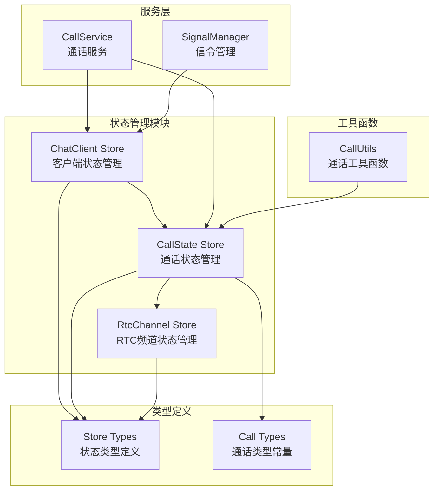
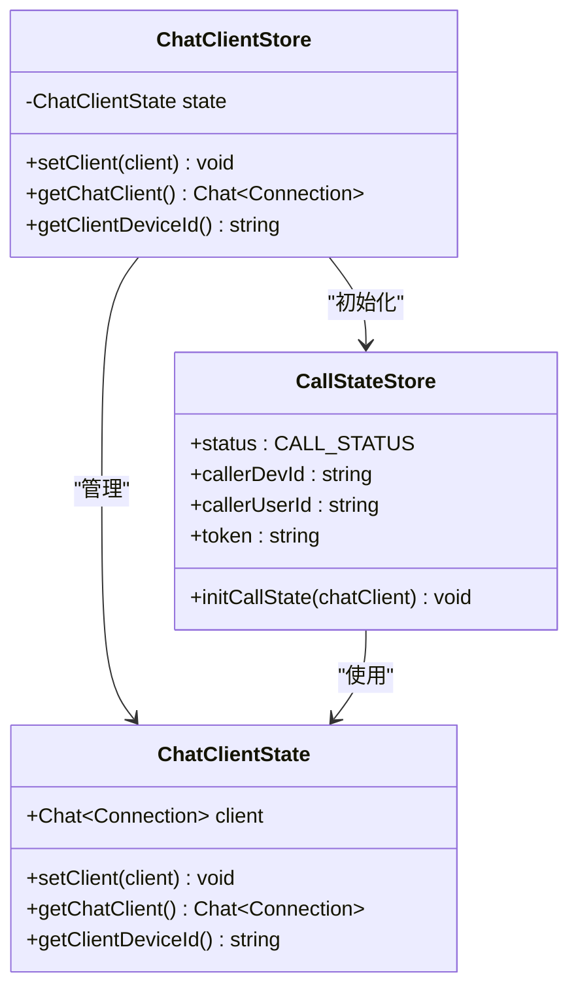
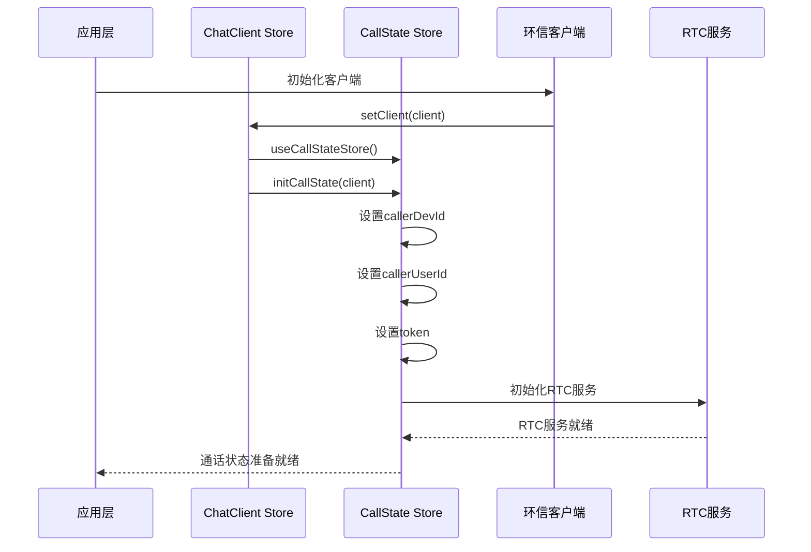
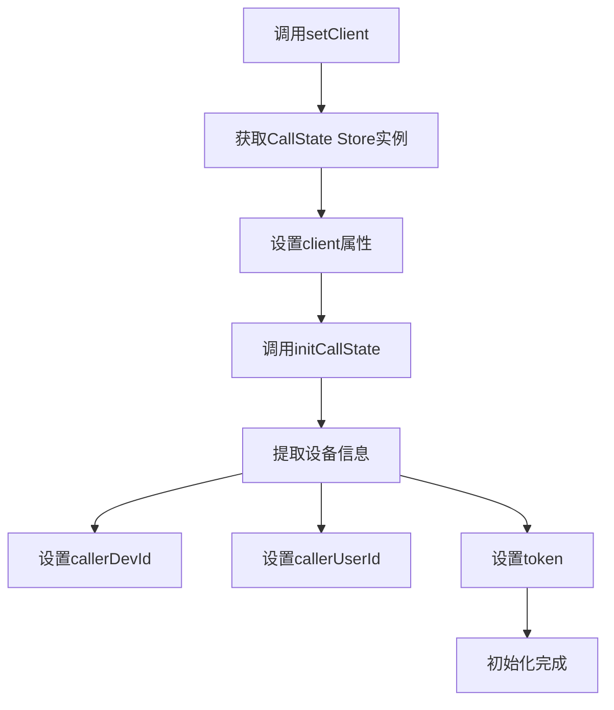
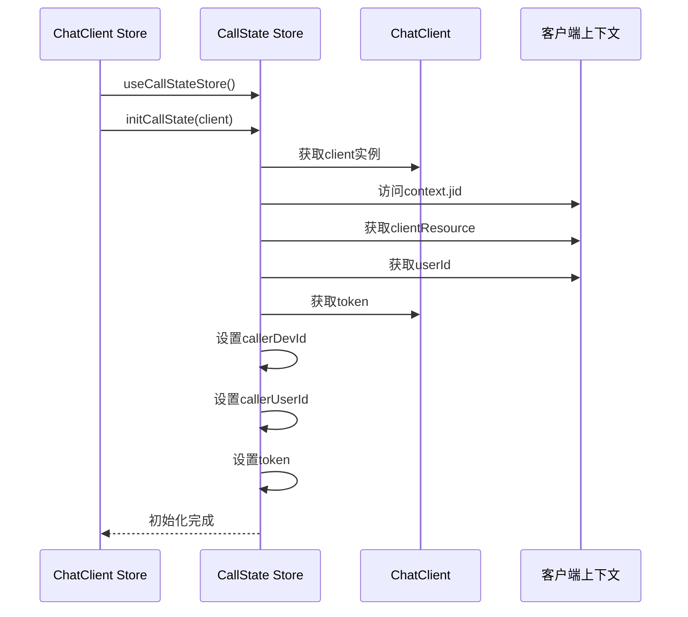
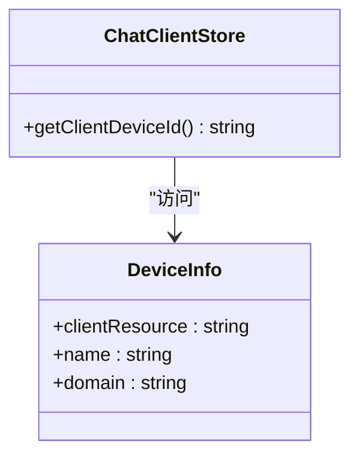
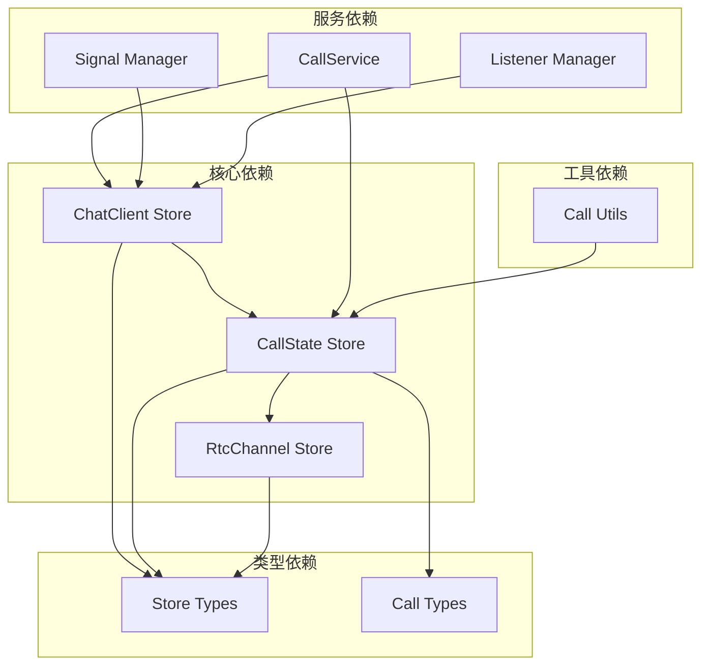

# ChatClient Store

<cite>
**本文档引用的文件**
- [lib/store/chatClient.ts](file://lib/store/chatClient.ts)
- [lib/store/callState.ts](file://lib/store/callState.ts)
- [lib/store/rtcChannel.ts](file://lib/store/rtcChannel.ts)
- [lib/store/types.ts](file://lib/store/types.ts)
- [lib/types/callstate.types.ts](file://lib/types/callstate.types.ts)
- [lib/services/CallService.ts](file://lib/services/CallService.ts)
- [lib/composables/useSignalManager.ts](file://lib/composables/useSignalManager.ts)
- [lib/composables/useListenerManager.ts](file://lib/composables/useListenerManager.ts)
- [lib/utils/callUtils.ts](file://lib/utils/callUtils.ts)
</cite>

## 目录
1. [简介](#简介)
2. [项目结构](#项目结构)
3. [核心组件](#核心组件)
4. [架构概览](#架构概览)
5. [详细组件分析](#详细组件分析)
6. [依赖关系分析](#依赖关系分析)
7. [性能考虑](#性能考虑)
8. [故障排除指南](#故障排除指南)
9. [结论](#结论)

## 简介

ChatClient Store 是环信即时通讯客户端状态管理的核心组件，负责管理环信客户端连接状态、用户认证信息和设备信息。该 Store 采用 Pinia 状态管理库实现，为整个 CallKit 通话系统提供基础的客户端状态支持。

ChatClient Store 的主要职责包括：
- 维护环信客户端连接实例
- 提供设备信息访问接口
- 与 CallState Store 协作初始化通话状态
- 为其他 Store 和服务提供客户端状态查询能力

## 项目结构

基于仓库的实际结构，ChatClient Store 位于 lib/store 目录下，与相关的 Store 和类型定义共同构成了完整的状态管理体系。

**图表来源**
- [lib/store/chatClient.ts](file://lib/store/chatClient.ts#L1-L23)
- [lib/store/callState.ts](file://lib/store/callState.ts#L1-L263)
- [lib/store/rtcChannel.ts](file://lib/store/rtcChannel.ts#L1-L410)

**章节来源**
- [lib/store/chatClient.ts](file://lib/store/chatClient.ts#L1-L23)
- [lib/store/index.ts](file://lib/store/index.ts#L1-L3)

## 核心组件

### ChatClient Store 设计

ChatClient Store 采用简洁的状态管理模式，专注于客户端连接状态的管理：

**图表来源**
- [lib/store/chatClient.ts](file://lib/store/chatClient.ts#L6-L22)
- [lib/store/callState.ts](file://lib/store/callState.ts#L44-L48)

### 状态结构设计

ChatClient Store 的状态结构极其简洁，只包含一个核心属性：

| 属性名 | 类型 | 描述 | 默认值 |
|--------|------|------|--------|
| client | Chat.Connection \| null | 环信客户端连接实例 | null |

这种设计遵循了单一职责原则，确保 Store 专注于客户端连接状态管理。

**章节来源**
- [lib/store/chatClient.ts](file://lib/store/chatClient.ts#L7-L11)
- [lib/store/types.ts](file://lib/store/types.ts#L10-L12)

## 架构概览

ChatClient Store 在整个 CallKit 系统中的位置和作用如下：

**图表来源**
- [lib/store/chatClient.ts](file://lib/store/chatClient.ts#L11-L16)
- [lib/store/callState.ts](file://lib/store/callState.ts#L44-L48)

### 状态协作机制

ChatClient Store 与 CallState Store 的协作体现了松耦合的设计理念：

1. **延迟初始化**: ChatClient Store 在设置客户端时才获取 CallState Store 实例
2. **单向依赖**: ChatClient Store 依赖 CallState Store，但不反向依赖
3. **状态共享**: 通过 CallState Store 共享客户端的认证信息和设备信息

**章节来源**
- [lib/store/chatClient.ts](file://lib/store/chatClient.ts#L4-L5)
- [lib/store/chatClient.ts](file://lib/store/chatClient.ts#L11-L16)

## 详细组件分析

### ChatClient Store 实现细节

#### 状态管理机制

ChatClient Store 采用 Pinia 的 defineStore 函数创建，实现了以下核心功能：

**图表来源**
- [lib/store/chatClient.ts](file://lib/store/chatClient.ts#L11-L16)
- [lib/store/callState.ts](file://lib/store/callState.ts#L44-L48)

#### Getter 方法设计

ChatClient Store 提供了两个关键的 getter 方法：

1. **getChatClient**: 返回当前的 Chat.Connection 实例
2. **getClientDeviceId**: 从客户端上下文中提取设备标识符

这些 getter 方法确保了外部组件可以安全地访问客户端状态，而无需直接操作 Store 的内部状态。

**章节来源**
- [lib/store/chatClient.ts](file://lib/store/chatClient.ts#L18-L21)

### CallState Store 协作机制

#### 初始化流程详解

当 ChatClient Store 设置客户端时，会触发 CallState Store 的初始化过程：

**图表来源**
- [lib/store/chatClient.ts](file://lib/store/chatClient.ts#L11-L16)
- [lib/store/callState.ts](file://lib/store/callState.ts#L44-L48)

#### 认证信息维护

CallState Store 通过 initCallState 方法维护以下认证相关信息：

| 信息类型 | 来源 | 用途 |
|----------|------|------|
| callerDevId | client.context.jid.clientResource | 标识发起方设备 |
| callerUserId | client.context.userId | 标识发起方用户 |
| token | client.token | 通话认证令牌 |

这些信息是建立稳定通话连接的基础。

**章节来源**
- [lib/store/callState.ts](file://lib/store/callState.ts#L44-L48)

### 设备资源管理

#### 设备信息提取

ChatClient Store 提供了直接访问设备信息的能力：

**图表来源**
- [lib/store/chatClient.ts](file://lib/store/chatClient.ts#L20-L21)

#### 资源访问模式

设备信息的访问遵循安全的链式调用模式，确保在客户端未初始化时不会产生错误：

**章节来源**
- [lib/store/chatClient.ts](file://lib/store/chatClient.ts#L19-L21)

## 依赖关系分析

### 组件间依赖图

**图表来源**
- [lib/store/chatClient.ts](file://lib/store/chatClient.ts#L1-L5)
- [lib/store/callState.ts](file://lib/store/callState.ts#L1-L6)
- [lib/services/CallService.ts](file://lib/services/CallService.ts#L1-L7)

### 依赖注入模式

系统采用了依赖注入的设计模式，通过动态导入的方式避免了循环依赖：

1. **延迟导入**: ChatClient Store 在需要时才导入 CallState Store
2. **运行时解析**: 通过 useCallStateStore() 函数在运行时获取 Store 实例
3. **松耦合设计**: Store 之间通过接口而非具体实现进行交互

**章节来源**
- [lib/store/chatClient.ts](file://lib/store/chatClient.ts#L4-L5)

## 性能考虑

### 状态更新优化

ChatClient Store 的设计充分考虑了性能优化：

1. **最小状态集**: 只维护必要的客户端连接信息
2. **惰性初始化**: CallState Store 仅在需要时初始化
3. **高效访问**: Getter 方法提供快速的状态访问

### 内存管理

系统采用了有效的内存管理策略：

- **及时释放**: CallService 在挂断时会清理媒体资源
- **状态重置**: CallState Store 提供完整的状态重置功能
- **资源清理**: RTC Channel Store 支持完整的资源清理流程

## 故障排除指南

### 常见问题诊断

#### ChatClient 未初始化

**症状**: 调用 getClientDeviceId 时返回 undefined

**解决方案**:
1. 确保在应用启动时调用了 setClient 方法
2. 检查环信客户端是否正确初始化
3. 验证客户端连接状态

#### CallState 初始化失败

**症状**: 通话状态无法正常初始化

**解决方案**:
1. 检查 ChatClient Store 的 setClient 方法是否被正确调用
2. 验证客户端实例的有效性
3. 确认 CallState Store 的依赖注入正常工作

#### 设备信息访问异常

**症状**: getClientDeviceId 返回空值

**解决方案**:
1. 确认客户端上下文中的 jid 对象存在
2. 检查 clientResource 属性是否正确设置
3. 验证客户端连接的认证状态

**章节来源**
- [lib/composables/useSignalManager.ts](file://lib/composables/useSignalManager.ts#L57-L64)
- [lib/store/chatClient.ts](file://lib/store/chatClient.ts#L19-L21)

## 结论

ChatClient Store 作为环信即时通讯客户端状态管理的核心组件，展现了优秀的软件设计原则：

1. **简洁性**: 采用极简的状态设计，专注于核心职责
2. **协作性**: 与 CallState Store 形成良好的协作关系
3. **可扩展性**: 为未来的功能扩展提供了清晰的接口
4. **可靠性**: 通过严格的错误处理和状态管理确保系统的稳定性

该 Store 的设计为整个 CallKit 通话系统奠定了坚实的基础，通过与其他 Store 的紧密协作，为用户提供稳定的即时通讯体验。